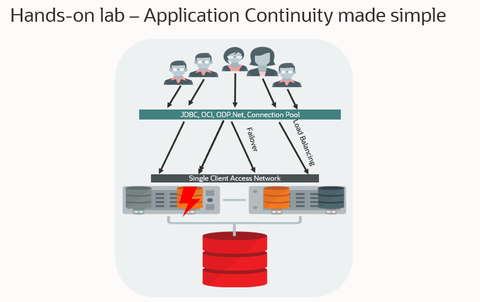

# Introduction

## About this Workshop

**Application Continuity** makes planned maintenance activities and unplanned outages transparent to end-users by recovering the in-flight work of impacted database sessions.

Run this hands-on workshop to learn how to use RAC services, configure Fast Application Notification, Connection Draining, and Application Continuity from an Oracle connection pool (UCP).

### Why use UCP?

Managing the connection pool from [UCP](https://docs.oracle.com/en/database/oracle/oracle-database/21/jjucp/index.html) is often the easiest way for a Java application to take full advantage of Application Continuity.

This implementation of a JDBC connection pool, delivered as a jar file, is a free piece of software (UCP is delivered under Oracle Free Use Terms and Conditions).  Its main advantage is that it leverages transparently many high availability and performance features available through an Oracle Real Application Clusters (Oracle RAC) database.

These features include Fast Connection Failover (FCF), Run-time connection Load Balancing (RLB), and Connection Affinity. Furthermore, UCP provides explicit request boundaries on check-in and check-out of connections, which makes Application Continuity easy to use.

### What's in the workshop

This workshop is based on a compute instance (a demo application) connected to a 2-node Database Cloud Service (Oracle Base RAC Database).
The demo application is a simple Java program using a 21c client. Its code shows how to create and use a Universal Connection Pool to the RAC.

It demonstrates:
*	How to set up UCP (good for ISVs).
*	How to set up ONS & FAN (which is required for both Application Continuity and Transparent Application Continuity).
*	How to configure and use database services to make planned maintenance as well as other outages transparent to applications.

The demo program allows one to interrupt a transaction at will and show whether or not it is transparently replayed on a different node of the RAC.

Different database services with or without application continuity can be tested.

Estimated Workshop Time: 2 hours (this estimate is for the entire workshop - it is the sum of the estimates provided for each of the labs included in the workshop.)

### Objectives

This workshop has three objectives:

* Understand how to best configure the client-server Environment (database services, connection pool, etc.)
* Show Application Continuity in action
* Show how to use database services and Application Continuity for Planned Maintenance

### Prerequisites

This lab assumes you have:
* An Oracle LiveLabs sandbox environment
* Or an Oracle Free Tier, Always Free, Paid or LiveLabs Cloud Account - You can check Getting Started section for more information.

Here is a video to help with the Oracle Trial Sign Up Process:

**At this point, you are ready to start learning! Please proceed.**

## Acknowledgements
* **Author** - François Pons, Senior Principal Product Manager
* **Contributors** - Andrei Manoliu, Principal Product Manager
* **Last Updated By/Date** - François Pons, March 2024
