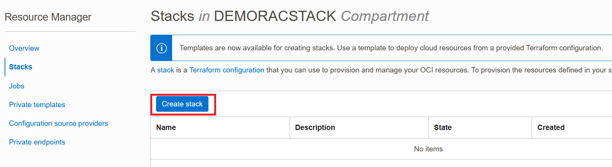
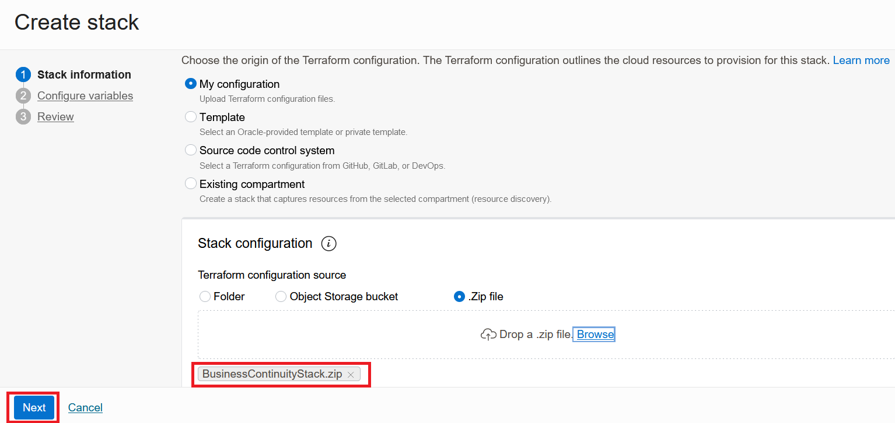
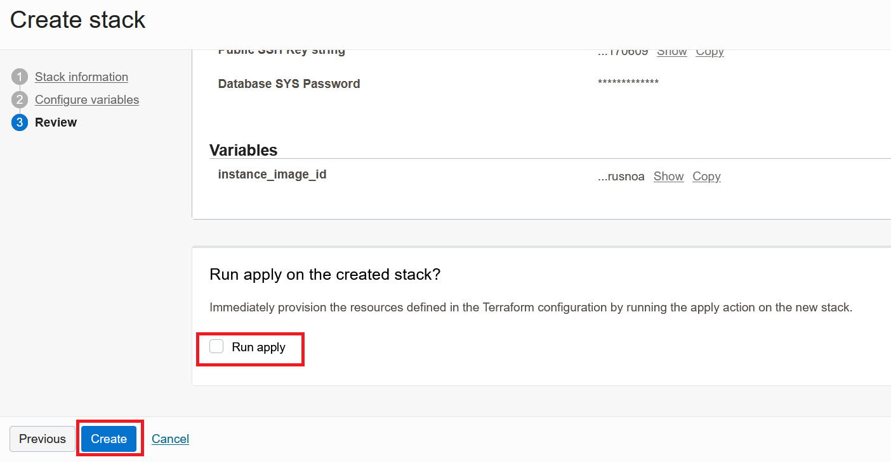
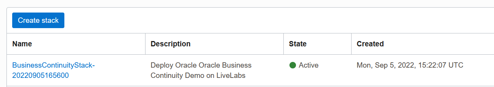
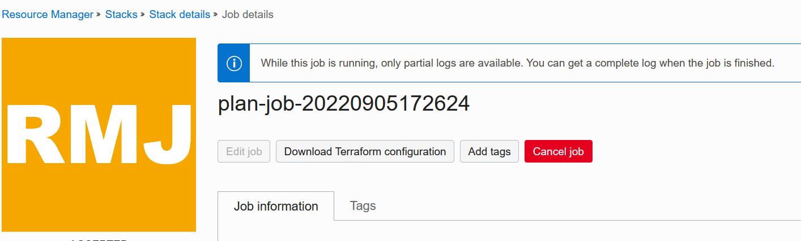
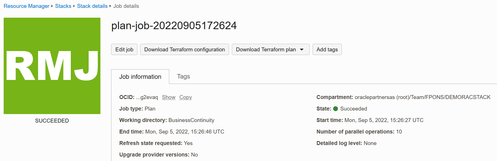
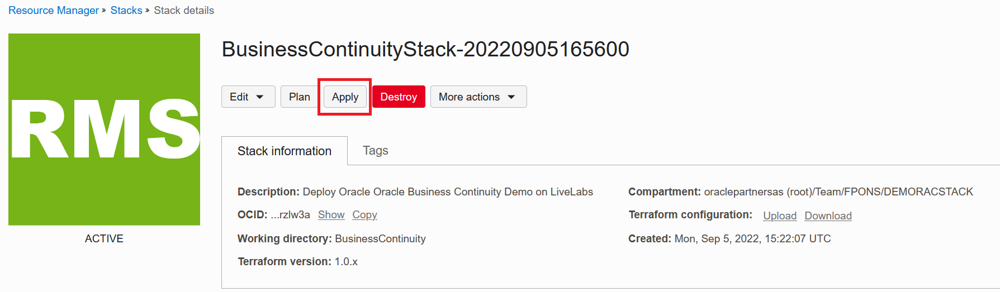

# Provision the RAC database

## Introduction

In this lab, you will run a Terraform script to provision the lab environment.

Estimated Lab Time: 30 minutes


### Objectives

The following components will be created by Terraform:

* an Oracle Cloud network (VCN)
* a 2-node RAC database
* a compute instance with a demo application


### Prerequisites

This lab assumes you have:

* access to an Oracle tenancy with the proper privileges.
* a pair of SSH keys

Click on the link below to download the Resource Manager zip files you need to build your environment.

- [BusinessContinuityStack.zip](https://objectstorage.eu-paris-1.oraclecloud.com/p/qftSkMvy2UGGaeO-BsmBW0JROXS45kSl0HnjApDGhC_03zrTTuS8A309h1KdYDi3/n/oraclepartnersas/b/demoTac_bucket/o/BusinessContinuityStack.zip) - Packaged Terraform Environment creation script.


## Task 1: Load Terraform Stack

1. Login to the Oracle Cloud Console, click the **Navigation Menu** in the upper left, navigate to **Developer Services**, and select **Stacks**. *Note: If you are in a workshop, double check your region to ensure you are on the assigned region.*


Click **Create Stack**



2. Check the **.ZIP FILE**, Click the **Browse** link and select the primary database setup zip file (`BusinessContinuityStack.zip`) that you downloaded. Click **Select** to upload the zip file.




Click **Next**

3. Select the following values and click **Next**

* Availability domain																: AD-1
* Pubic key for compute instance and database nodes : Browse to and upload your public key

````
* Database SYS Password : <copy>_MyCloud2022_</copy>
````

* Instance Shape																		: VM.Standard.E3.Flex
* OCPU																							: 1

````
* Instance_image_id  : <copy>ocid1.image.oc1.eu-paris-1.aaaaaaaa4h2jbofel25uzoisymmfr6blevdq5vgh76pthncqrbp6kirusnoa</copy>
````

4. Click **Create** to create the Terraform stack



Your stack has now been stackcreated



**You can proceed to the next lab…**


## Task 2: Terraform Plan (OPTIONAL)

When using Resource Manager to deploy an environment, execute a terraform **Plan** to verify the configuration. This is an optional step in this lab.

1.  [OPTIONAL] Click **Terraform Actions** -> **Plan** to validate your configuration. Click **Plan**. This takes about a minute, please be patient.



(...)




## Task 3: Terraform Apply

When using Resource Manager to deploy an environment, execute a terraform **Apply** job. Let's do that now.

1.  At the top of your page, click on **Stack Details**.  Click the button, **Terraform Actions** -> **Apply**. Click **Apply**. This will provision the environment. This takes about 15 minutes, please be patient.



2.  Once this job succeeds, you will get an apply complete notification from Terraform. In the end of the apply log,  you can get the **noVNC URL** to connect to the client compute instance.

Go to **Jobs** under **Resources** to monitor the progress of the Apply job.

Click on the job link, to see its log.

## Acknowledgements
* **Author** - François Pons, Senior Principal Product Manager
* **Contributors** - Andrei Manoliu, Principal Product Manager
* **Last Updated By/Date** - François Pons, September 2022
