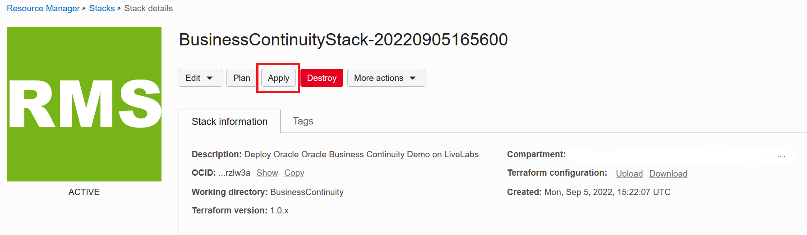
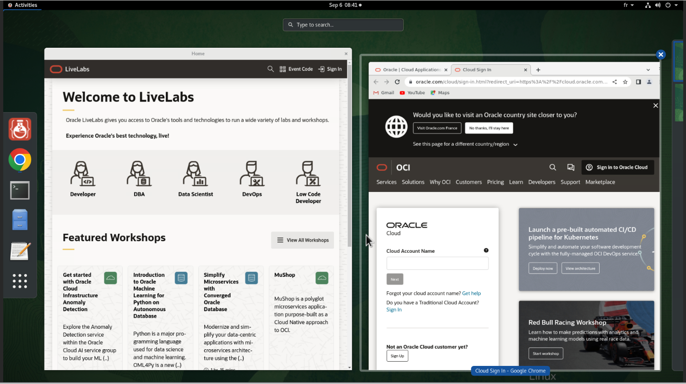

# Provision the environment

## Introduction

In this lab, you will run a Terraform script to provision the lab environment.

Estimated Lab Time: 15 minutes to follow the instructions. The provisioning job will then take about 90 mn to complete.


### Objectives

The following components will be created by Terraform:

* An Oracle Cloud network (VCN)
* A 2-node RAC database with Grid Infrastructure and ASM storage
* A compute instance hosting a demo application


### Prerequisites

This lab assumes you have:

* access to an Oracle tenancy with the proper privileges
* a pair of SSH keys

Click on the link below to download the Resource Manager zip files you need to build your environment.

- [BusinessContinuityStack.zip](https://objectstorage.eu-paris-1.oraclecloud.com/p/hNtnfmA58kds-Ytf6r5DoOE1IdY6K3nmlew4QaBsDPbu5RFisPmUPsxrhyEfnMSQ/n/oraclepartnersas/b/demoTac_bucket/o/BusinessContinuityStackV3.zip) - Packaged Terraform Environment creation script.

## Task 1: Load Terraform Stack

  1. Login to the Oracle Cloud Console, click the **Navigation Menu** in the upper left, navigate to **Developer Services**, and select **Stacks**.

    >**Note:** If you are in a workshop, double check your region to ensure you are on the assigned region.

    

    Click **Create Stack**

    

  2. Check the **.ZIP File**, Click the **Browse** link and select the zip file (**BusinessContinuityStack.zip**) that you downloaded. Click **Select** to upload the zip file.

    

    Then click **Next**

  3. Select the following values and click **Next**

    * Availability domain																: AD-1
    * Pubic key for compute instance and database nodes : Browse to and upload your public key file

    ````
    * Database SYS Password : <copy>_MyCloud2022_</copy>
    ````

    * Instance Shape																		: VM.Standard.E3.Flex or VM.Standard.E4.Flex
    * OCPU																							: 1

  4. Leave **Run Apply** unchecked and click **Create** to upload the Terraform stack

    

    You should now see that your stack has been created!

    


## Task 2: Run Terraform Plan Job (OPTIONAL)

  When using Resource Manager to deploy an environment, execute a terraform **Plan** to verify the configuration. This is an optional step in this lab.

  1.  [OPTIONAL] Click **Terraform Actions** -> **Plan** to validate your configuration. Click **Plan**. This takes about a minute, please be patient.

    

    (...)

    

    The **Plan** job should finish with a **SUCCEEDED** message.


## Task 3: Run Terraform Apply Job

  When using Resource Manager to deploy an environment, execute a terraform **Apply** job. Let's do that now.

  1.  At the top of your page, click on **Stack Details**.  Click the button, **Terraform Actions** -> **Apply**. Click **Apply**. This will provision the environment. The job will take about 90 minutes to complete, please be patient.

    

  2. Go to **Jobs** under **Resources** to monitor the progress of the Apply job.

  3. Once the apply job succeeds, click on its name and access to the log.

    Go to the bottom of the log.

    The log will confirm the creation of database **dbrac** and client machine **demotac**

    Look for the **remote desktop** entry and copy the URL.

    

    This URL will allow you to connect from a browser to a noVNC remote desktop of the client machine as user **oracle**.

    


**You can proceed to the next lab…**

## Acknowledgements
* **Author** - François Pons, Senior Principal Product Manager
* **Contributors** - Andrei Manoliu, Principal Product Manager
* **Last Updated By/Date** - François Pons, September 2022
