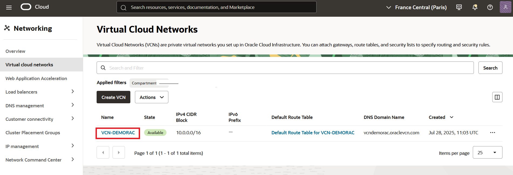
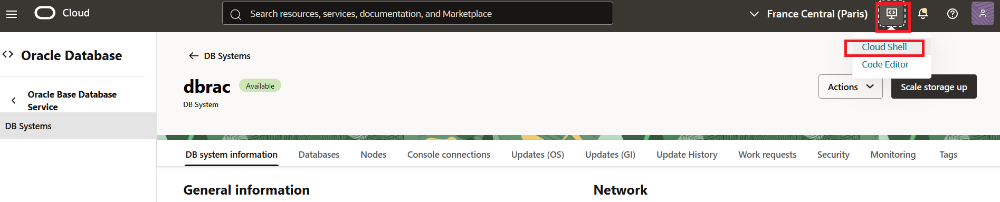

# Configure the application environment

## Introduction

In this lab, we will customize the environment that will be used to run the rest of the workshop.

> **Note**: Most components should have been pre-created.

There are three main elements in our environment:

* **VCN-DEMORAC** (or another automatically generated name if you run in a sandbox environment): a **Virtual Cloud Network (VCN)** has been pre-created with the required network topology components inside the Oracle Cloud (Subnets, Route Tables, Security Lists, Gateways, etc.)
* **dbrac** : a two-node Database Cloud Service (aka Oracle Base RAC Database) **RAC database** with **Grid Infrastructure** (which should have also been pre-created)
* **demotac** : a **Compute instance** Virtual Machine hosting our demo application

Estimated Lab Time: 30 minutes.


### Objectives

In this lab, you will:

<if type="tenancy">
* Complete the network configuration
</if>
<if type="sandbox">
* Understand important points in the network configuration
</if>
* Configure RAC database services
* Create a demo schema in the database
* Compile a demo application


### Prerequisites

This lab assumes you have:

<if type="tenancy">
* An Oracle Cloud Account (aka tenancy) where you created this environment by following LiveLabs instructions.
</if>
<if type="sandbox">
* An Oracle LiveLabs sandbox environment providing the components described above.
</if>


## Task 1: Configure the Network for Oracle Net

<if type="sandbox">
***As you are running in a sandbox environment, you should skip this task and go directly to Task 2. Security restrictions in sandbox environments do not allow the creation of Network Security Groups. However, all required ports are open for the workshop to work. You can read the instructions in this task to better understand which ports need to be open and for which purpose.***
</if>

  1. Create a **Network Security Group** rule allowing Oracle Net connectivity

    * It is necessary to **open TCP port 1521** in the VCN to allow the demo application to connect to the database. We can do this by configuring a **Network Security Group Rule** and adding the NSG to the database.

    * From the Oracle Cloud web console, go to **Networking** > **Virtual Could Network** sand select your VCN. It should be named **VCN-DEMORAC**.

      

        >**Note:** Be sure to select the **region** and **compartment** that have been assigned to you.

        

    * Select the VCN

      

    * Then click on **Create Network Security Group** under **Security** to create a Network Security Group in the VCN.

      

    * Enter a name for the Network Security Group

      ````
      Name : <copy>NSG-DEMORAC</copy>
      ````

    * At the bottom of the same page, add a **stateful ingress rule** allowing Oracle Net connectivity within the VCN

    * Enter the following values in the **Add Security Rules** dialog:

      Stateless   : leave unchecked

      Direction   : Ingress

      Source Type : Enter the following CIDR block
      ````
      Source CIDR : <copy>10.0.0.0/16</copy>
      ````

      IP Protocol : select TCP

      Source Port Range : leave empty (ie ALL)

      ````
      Destination Port range : <copy>1521</copy>
      ````

      ````
      Description : <copy>Allow Oracle Net connectivity within the VCN</copy>
      ````

      * Example

        

      * Click **Create**


  3. Finally add the NSG to the database

    * From the Oracle Cloud web console, go to **Oracle Database** > **Oracle Base Database Service**

      

    * Select database **dbrac**

      

    * Under Network, Find **Network Security Groups** and click **Edit**

      

    * select NSG-DEMORAC in your compartment and **Save**

      


## Task 2: Configure the Network for Oracle Notification Services


  1. Connect to Cloud shell from the details page of database **dbrac**

    * From the Oracle Cloud web console, go to **Oracle Database** > **Oracle Base Database Service**

      

    * Select database **dbrac**

      


    * Click on the Cloud Shell icon from the top right of the OCI console

        

    * From the Cloud Shell menu, click **Upload**

        

    * Upload the file containing your private key

    * Make sure the mode is set to 400 (**chmod 400 private-key-file**)

        

  2. Check that ONS is running on the server

    * Find out the public IPs of the database nodes from the database details page, under **Nodes**

      

    * Using Cloud Shell, connect to the first node of the RAC cluster as **opc** and switch to the **oracle** user

      ````
      user@cloudshell:~ $ <copy>ssh -i [private-key-file] opc@[node 1 public IP]</copy>

      (...)
      Are you sure you want to continue connecting (yes/no)? yes
      Warning: Permanently added 'xxx' (ECDSA) to the list of known hosts.
      (...)
      ````

    * Switch to user *oracle*

      ````
      $ <copy>sudo su - oracle</copy>
      ````

    * Check ONS is running on the server

      ````
      [oracle@ruby1 ~]$ <copy>srvctl status nodeapps</copy>

      VIP 10.0.0.183 is enabled
      VIP 10.0.0.183 is running on node: ruby1
      VIP 10.0.0.80 is enabled
      VIP 10.0.0.80 is running on node: ruby2
      Network is enabled
      Network is running on node: ruby1
      Network is running on node: ruby2
      ONS is enabled
      ONS daemon is running on node: ruby1
      ONS daemon is running on node: ruby2
      ````

    * Also verify the ports used by ONS

      ````
      [oracle@ruby1 ~]$ <copy>srvctl config nodeapps -s</copy>

      [oracle@ruby1 ~]$ srvctl config nodeapps -s
      ONS exists: Local port 6100, remote port 6200, EM port 2016, Uses SSL true
      ONS is enabled
      ONS is individually enabled on nodes:
      ONS is individually disabled on nodes:
      ````

  3. Add an ingress rule opening TCP port 6200 to FAN events

    * It is necessary to **open TCP port 6200** in the VCN to allow **Fast Application Notification Events** to flow from the cluster database to the client application. We can do this by adding a **Network Security Group Rule** to the database NSG.

    <if type="sandbox">
    * *As you are running this workshop in a sandbox, you should skip this step. The port is open by an automatically created Security List. You can read the instructions in this step to review and understand what normally needs to be done manually to open port 6200.*
    </if>

    * From the OCI console under **Networking** > **Virtual Cloud Networks**, select the VCN (**VCN-DEMORAC**)

    * Retrieve the Network Security Group **NSG-DEMORAC** of the database under **Security** > **Network Security Groups** and select it.

    * Click **Add Rules** under **Security Rules**

    * Enter the following values for another **ingress** rule allowing the propagation of Fast Application Notification (FAN) events to the connection pool

      Stateless   : leave unchecked

      Direction   : Ingress

      Source Type : Enter the following CIDR block
      ````
      Source CIDR : <copy>10.0.0.0/16</copy>
      ````

      IP Protocol : select TCP

      Source Port Range : leave empty (ie ALL)

        ````
        Destination Port range : <copy>6200</copy>
        ````

        ````
        Description : <copy>Allow Fast Application Notification (FAN) events to propagate	</copy>
        ````

    * Example

      

    * Click **Add**


## Task 3: Configure RAC Services

  1. Using Cloud Shell, connect to the first node of the RAC cluster as **opc**

    * Using Cloud Shell, connect to the first node of the RAC cluster

        ````
        user@cloudshell:~ $ <copy>ssh -i [private-key-file] opc@[node 1 public IP]</copy>
        ````

    * Switch to user **oracle**

        ````
        $ <copy>sudo su - oracle</copy>
        ````


  2. Create a database service with standard parameters (no Application Continuity)


    * Find out the database unique name from the details page of the database **CONT** in Oracle Base Database Service **dbrac**

        Make a note of your Database Unique Name. In should be in the form ***CONT_xyz***.

        

        *PLEASE NOTE: In the following commands, you need to replace the template database name "cont_prim" by the real value of the database unique name.*

        > **Note:** In most cases one can choose the database unique name when provisioning a database system. However, in our workshop, the value had to be automatically generated and needs to be retrieved.


    * Create the service **demosrv**:

        Cut and paste the following command in an editor and replace **cont_prim** by the real value of your database unique name before executing the command!

        ````
        [oracle@ruby1 ~]$ <copy>srvctl add service -db cont_prim -service demosrv -preferred CONT1,CONT2 -pdb PDB1 -notification TRUE -drain_timeout 300 -stopoption IMMEDIATE -role PRIMARY</copy>
        ````

    * Check service configuration:

        ````
        [oracle@ruby1 ~]$ <copy>srvctl config service -db cont_prim -service demosrv</copy>

        Service name: **demosrv**
        Server pool:
        Cardinality: 2
        Service role: PRIMARY
        Management policy: AUTOMATIC
        DTP transaction: false
        AQ HA notifications: true
        Global: false
        Commit Outcome: false
        Failover type:
        Failover method:
        Failover retries:
        Failover delay:
        Failover restore: NONE
        Connection Load Balancing Goal: LONG
        Runtime Load Balancing Goal: NONE
        TAF policy specification: NONE
        Edition:
        Pluggable database name: PDB1
        Hub service:
        Maximum lag time: ANY
        SQL Translation Profile:
        Retention: 86400 seconds
        Replay Initiation Time: 300 seconds
        Drain timeout: 300 seconds
        Stop option: immediate
        Session State Consistency: DYNAMIC
        GSM Flags: 0
        Service is enabled
        Preferred instances: CONT1,CONT2
        Available instances:
        CSS critical: no
        ````

        > **Note**: failover type is not set.

    * Start the service and check its status

        ````
        [oracle@ruby1 ~]$ <copy>srvctl start service -db cont_prim -service demosrv</copy>
        ````

        ````
        [oracle@ruby1 ~]$ <copy>srvctl status service -db cont_prim -service demosrv</copy>

        Service demosrv is running on instance(s) CONT1,CONT2
        ````

        > **Note**: the service should run on all the preferred instances.


    * If you need to delete the service and create it again, use the following command:

        ````
        [oracle@ruby1 ~]$ <copy>srvctl remove service -db cont_prim -service demosrv</copy>
        ````

  3. Create a database service with Application Continuity support

    * Create the service **tacsrv**:

        ````
        [oracle@ruby1 ~]$ <copy>srvctl add service -db cont_prim -service tacsrv -pdb PDB1 -preferred CONT1,CONT2 -failover_restore AUTO -commit_outcome TRUE -failovertype AUTO -replay_init_time 600 -retention 86400 -notification TRUE -drain_timeout 300 -stopoption IMMEDIATE -role PRIMARY</copy>
        ````

    * Check service configuration

        ````
        [oracle@ruby1 ~]$ <copy>srvctl config service -db cont_prim -service tacsrv</copy>

        Service name: **tacsrv**
        Server pool:
        Cardinality: 2
        Service role: PRIMARY
        Management policy: AUTOMATIC
        DTP transaction: false
        AQ HA notifications: true
        Global: false
        Commit Outcome: true
        Failover type: **AUTO**
        Failover method:
        Failover retries: 30
        Failover delay: 10
        Failover restore: AUTO
        Connection Load Balancing Goal: LONG
        Runtime Load Balancing Goal: NONE
        TAF policy specification: NONE
        Edition:
        Pluggable database name: PDB1
        Hub service:
        Maximum lag time: ANY
        SQL Translation Profile:
        Retention: 86400 seconds
        Replay Initiation Time: 600 seconds
        Drain timeout: 300 seconds
        Stop option: immediate
        Session State Consistency: AUTO
        GSM Flags: 0
        Service is enabled
        Preferred instances: CONT1,CONT2
        Available instances:
        CSS critical: no
        ````

        > **Note**: failover type is set to **AUTO**.


    * Start the service and check its status

        ````
        [oracle@ruby1 ~]$ <copy>srvctl start service -db cont_prim -service tacsrv</copy>
        ````

        ````
        [oracle@ruby1 ~]$ <copy>srvctl status service -db cont_prim -service tacsrv</copy>

        Service tacsrv is running on instance(s) CONT1,CONT2
        ````

        > **Note**: the service should run on all the preferred instances.


    * If you need to delete the service and create it again, use the following command:

        ````
        [oracle@ruby1 ~]$ <copy>srvctl remove service -db cont_prim -service tacsrv</copy>
        ````


## Task 4: Create the Demo Schema


  1. Understand the demo application directory structure


  <if type="sandbox">
  * ***As you are running this workshop in a sandbox environment, you will have to change the connect strings in SQL and Java files.
    **.dnsdemorac.vcndemorac** will have to be replaced by **.pub.ll12345vcn** where **12345** is your LiveLab reservation ID. (Note the two lower case **L** followed by reservation number.)
    The following command may help you to make this change in all the files of the current folder and its subfolders:***
    ````
    <copy>grep -lir dnsdemorac.vcndemorac | xargs -i@ sed -i 's/dnsdemorac.vcndemorac/pub.ll12345vcn/g' @</copy>
    ````
  </if>


    * Using noVNC, connect to the remote desktop of the client machine **demotac** as user **oracle**.

        

    * The demo application is installed in **/home/oracle/work/ac**

    * The directory structure under **/home/oracle/work/ac** is explained below:

      


        ```
        ac           : demo program with its compiling and running scripts
        ac/ddl       : SQL scripts to create the demo schema
        ac/libcli21c : required java libraries
        ac/sql       : SQL scripts to be used in next labs
        ```

    <if type="sandbox">
    * As you are running this workshop in a sandbox environment, you should change the connect strings in SQL and Java files before running them. Replace ***.dnsdemorac.vcndemorac*** by ***.pub.ll12345vcn*** where ***12345*** is your LiveLab reservation ID.
    </if>

  2. Open a terminal window (as oracle) and change directory to $HOME/work/ac/ddl

    

    ````
    [oracle@demotac:~]$ <copy>cd $HOME/work/ac/ddl ; ls -al</copy>

    (...)
    -rw-r--r--. 1 oracle oinstall 1047 Jul 29 09:27 ddl10_user.sql
    -rw-r--r--. 1 oracle oinstall 1036 Jul 29 09:27 ddl20_schema.sql
    -rwxr-xr-x. 1 oracle oinstall   64 Jun 28 07:50 ddl_setup.sh
    (...)
    ````

  3. Run **ddl_setup.sh** to create the demo schema

    > **Note**: Ignore the error on DROP commands if you are running the script for the first time.

    This script essentially connects to the RAC database and creates a user CONTI in PDB1.

    CONTI will connect to the Pluggable database PDB1 to make accounting entries in table ACCOUNT.

    Each accounting transaction should consist of two lines in ACCOUNT: one with DIR='D' (for Debit) and another one with DIR='C' (for Credit).

    A trigger allows to capture the database service that was used to connect when INSERT statements are executed.


    ````
    [oracle@demotac:~/work/ac/ddl]$ <copy>./ddl_setup.sh</copy>

    (...)
    SQL> drop user conti cascade;
    User dropped.

    SQL> drop tablespace conti including contents and datafiles;
    Tablespace dropped.

    SQL> create smallfile tablespace conti
      2   datafile '+DATA'	size 100M reuse autoextend on next 100m
      3   maxsize unlimited
      4   logging
      5   extent management local segment space management auto;
    Tablespace created.

    SQL> create user conti identified by "_MyCloud2022_" default tablespace conti account unlock;
    User created.

    SQL> grant connect, resource, unlimited tablespace to conti;
    Grant succeeded.

    (...)
    SQL> connect conti/_MyCloud2022_@ruby-scan.sub07270956560.vcndemorac.oraclevcn.com:1521/PDB1.sub07270956560.vcndemorac.oraclevcn.com
    Connected.
    SQL> --
    SQL> -- Create demo schema in ADB
    SQL> --

    SQL> create table account(
      2  id 	         number(12,0),
      3  date_create   date,
      4  service	     varchar2(60),
      5  dir	         char(1),
      6  amount	       number
      7  );
    Table created.

    SQL> create unique index account_pk on account(id);
    Index created.

    SQL> alter table account add constraint pk_account primary key (id) using index;
    Table altered.

    SQL> create sequence account_seq start with 1;
    Sequence created.

    SQL> -- Retaining Mutable Values in Application Continuity for Java
    SQL> ALTER SEQUENCE account_seq KEEP;
    Sequence altered.

    SQL> create or replace trigger biur_account
      2  before insert on account
      3  for each row
      4  begin
      5  	     select sysdate into :new.date_create from dual;
      6  	     select account_seq.nextval into :new.id from dual;
      7  	     select service_name into :new.service from v$session where audsid=userenv('sessionid');
      8  end biur_account;
      9  /
    Trigger created.
    (...)
    ````

## Task 5: Compile the Demo Application

  1. Understand required **CLASSPATH** libraries

    Our demo program uses JDBC to connect to the RAC database.
    It shows how to create an intelligent connection pool, able to communicate with the cluster database through the Oracle Notification Service.

    To compile and run such a Java program, you need:
    * the right jdbc driver (usually ojdbcX.jar)
    * the right Universal Connection Pool jar file (usually ucp.jar or ucp11.jar)
    * the Oracle Notification Service jar file (usually ons.jar)

    The jar files you need depend on:
    * the version of your Oracle client
    * the version of Java you are using
    * the version of the database you connect to (to a lesser extent)

    **Oracle Database JDBC drivers and Companion Jars** can be downloaded from [here](https://www.oracle.com/database/technologies/appdev/jdbc-downloads.html).

    In our case we are using:
    * JDK 11
    * Oracle 21c instant client
    * Oracle 19c database

    The jar files you need in your **CLASSPATH** have already been downloaded to **/home/oracle/work/ac/libcli21c**


  2. Understand **Universal Connection Pool (UCP)** configuration

    * From the **noVNC** desktop connection as oracle to the client machine, use the text editor to edit the Java program

      

      

      


    * The most interesting method is **createPool(String strAlias)** which shows the commands to create a connection pool able to take full advantage of a RAC database.

    * Notice the following elements:

      The call to configure Replay Driver for Application Continuity

        ```
        pds.setConnectionFactoryClassName("oracle.jdbc.replay.OracleDataSourceImpl");
        ```

      The connection URL which should be of the following form to allow FAN auto-configuration

        ```
        String dbURL = "jdbc:oracle:thin:@" +
        	"(DESCRIPTION=" +
        	"(CONNECT_TIMEOUT=90)(RETRY_COUNT=50)(RETRY_DELAY=3)(TRANSPORT_CONNECT_TIMEOUT=3)" +
        	"(ADDRESS_LIST=(ADDRESS=(PROTOCOL=TCP)(HOST="+strScan+")(PORT=1521)))" +			
        	"(CONNECT_DATA=(SERVICE_NAME="+strService+")))";
        ```

      Usual instructions to configure the number of connections in the pool

        ```
        pds.setInitialPoolSize(1);
        pds.setMinPoolSize(1);
        pds.setMaxPoolSize(20);
        ```

      Some additional commands which speak for themselves

        ```
        pds.setFastConnectionFailoverEnabled(true);
        pds.setValidateConnectionOnBorrow(true);
        ```

  3. Update the value of **strScan**

    * Verify the value of strScan and change it in MyCUPDemo.java if necessary.

    <if type="sandbox">
    * ***As you are running this workshop in a sandbox environment, you should change the connect string in the application code. Replace **.dnsdemorac.vcndemorac** by **.pub.ll12345vcn** where **12345** is your LiveLab reservation ID. Note the two lower case L.
    For instance:***

    ```
    //String strScan = "ruby-scan.dnsdemorac.vcndemorac.oraclevcn.com";
    String strScan = "ruby-scan.pub.ll12345vcn.oraclevcn.com";
    //String strService = strAlias + ".dnsdemorac.vcndemorac.oraclevcn.com";
    String strService = strAlias + ".pub.ll12345vcn.oraclevcn.com";
    ```
    </if>


  4. Compile the demo application

    * Open a terminal window and change to the ac directory:

      ````
      [oracle@demotac:~]$ <copy>cd /home/oracle/work/ac</copy>
      ````

    * Then run the following command to compile the demo application:

      ````
      [oracle@demotac:~/work/ac]$ <copy>MyCompile.sh MyUCPDemo.java</copy>
      ````


**You can proceed to the next lab.**


## Acknowledgements
* **Author** - François Pons, Senior Principal Product Manager
* **Contributors** - Andrei Manoliu, Principal Product Manager
* **Last Updated By/Date** - François Pons, July 2025
