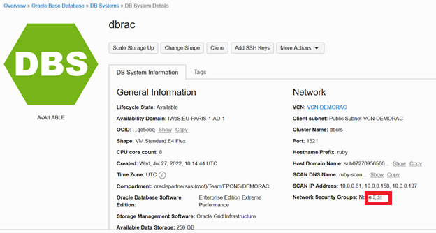
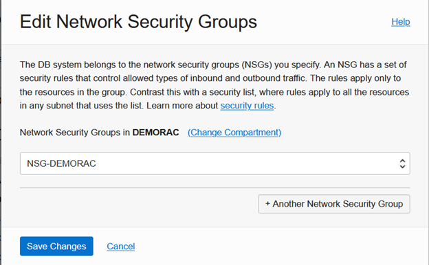
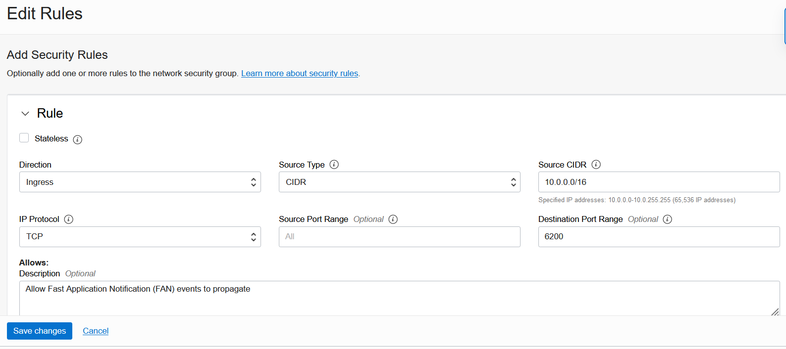

# Configure the application environment

## Introduction

In this lab we will customize the environment that will be used to run the rest of the workshop.

> **Note**: Most components should have been pre-created.

There are three main elements in our environment:

* A **Virtual Cloud Network (VCN)** has been pre-created. It represents the network topology inside the Oracle Cloud by defining the following components (Subnets, Route Tables, Security Lists, Gateways, etc.).
* A two-node **DBCS RAC database** with ASM storage (which should have also been pre-created).
* A **Compute instance** which is a VM hosting our demo application.

Estimated Lab Time: 30 minutes.


### Objectives

In this lab, you will:

* Complete the network configuration
* Configure RAC database services
* Create a demo schema in the database
* Compile a demo application


### Prerequisites

This lab assumes you have:
* An Oracle LiveLabs sandbox environment
* Or an Oracle Free Tier, Always Free, Paid or LiveLabs Cloud Account - You can check Getting Started section for more information.


## Task 1: Configure the network for Oracle Net

1. Create a **Network Security Group** rule allowing Oracle Net connectivity

Create the Network Security Group in the VCN.


2. Then add a stateful ingress rule allowing Oracle connectivity within the VCN


3. Finally add the NSG to the database






## Task 2: Configure the network for Oracle Notification Services

1. Check that ONS is running on the server

* Using Cloud Shell, connect to the first node of the RAC cluster as **opc** and switch to the **oracle** user

  ````
  user@cloudshell:~ $ <copy>ssh -i fpkey opc@[node 1 public IP]</copy>

  (...)
  Are you sure you want to continue connecting (yes/no)? yes
  Warning: Permanently added 'xxx' (ECDSA) to the list of known hosts.
  (...)
  ````

* Switch to user *oracle*

  ````
  $ <copy>sudo su - oracle</copy>
  ````

* Check ONS is running on the server

  ````
  [oracle@ruby1 ~]$ <copy>srvctl status nodeapps</copy>

  VIP 10.0.0.183 is enabled
  VIP 10.0.0.183 is running on node: ruby1
  VIP 10.0.0.80 is enabled
  VIP 10.0.0.80 is running on node: ruby2
  Network is enabled
  Network is running on node: ruby1
  Network is running on node: ruby2
  ONS is enabled
  ONS daemon is running on node: ruby1
  ONS daemon is running on node: ruby2
  ````

* Also verify the ports used by ONS

  ````
  [oracle@ruby1 ~]$ <copy>srvctl config nodeapps -s</copy>

  [oracle@ruby1 ~]$ srvctl config nodeapps -s
  ONS exists: Local port 6100, remote port 6200, EM port 2016, Uses SSL true
  ONS is enabled
  ONS is individually enabled on nodes:
  ONS is individually disabled on nodes:
  ````

2. Add an ingress rule opening TCP port 6200 to FAN events

Fast Application Notification (FAN) requires the following **ingress** rule to be added to the Network Security Group in order to allow the propagation of FAN events to the connection pool.




## Task 3: Configure RAC services


1. Using Cloud Shell, connect to the first node of the RAC cluster as **opc** and switch to the **oracle** user

  ````
  user@cloudshell:~ $ <copy>ssh -i fpkey opc@[node 1 public IP]</copy>
  ````

* Switch to user *oracle*

  ````
  $ <copy>sudo su - oracle</copy>
  ````


1. Create a database service with standard parameters (no Application Continuity)

* Create the service **demosrv**:

  ````
  user@cloudshell:~ $ <copy>srvctl add service -db cont_prim -service demosrv -preferred CONT1,CONT2 -pdb PDB1 -notification TRUE -drain_timeout 300 -stopoption IMMEDIATE -role PRIMARY</copy>
  ````

* Check service configuration:

  ````
  user@cloudshell:~ $ <copy>srvctl config service -db cont_prim -service demosrv</copy>

  Service name: **demosrv**
  Server pool:
  Cardinality: 2
  Service role: PRIMARY
  Management policy: AUTOMATIC
  DTP transaction: false
  AQ HA notifications: true
  Global: false
  Commit Outcome: false
  Failover type:
  Failover method:
  Failover retries:
  Failover delay:
  Failover restore: NONE
  Connection Load Balancing Goal: LONG
  Runtime Load Balancing Goal: NONE
  TAF policy specification: NONE
  Edition:
  Pluggable database name: PDB1
  Hub service:
  Maximum lag time: ANY
  SQL Translation Profile:
  Retention: 86400 seconds
  Replay Initiation Time: 300 seconds
  Drain timeout: 300 seconds
  Stop option: immediate
  Session State Consistency: DYNAMIC
  GSM Flags: 0
  Service is enabled
  Preferred instances: CONT1,CONT2
  Available instances:
  CSS critical: no
  ````

> **Note**: failover type is not set.

* Start the service and check its status

````
user@cloudshell:~ $ <copy>srvctl start service -db cont_prim -service demosrv</copy>
````

````
user@cloudshell:~ $ <copy>srvctl status service -db cont_prim -service demosrv</copy>

Service demosrv is running on instance(s) CONT1,CONT2
````

> **Note**: the service should run on all the preferred instances.


* If you need to delete the service and create it again, use the following command:

  ````
  user@cloudshell:~ $ <copy>srvctl remove service -db cont_prim -service demosrv</copy>
  ````

2. Create a database service with Application Continuity support

* Create the service **tacsrv**:

  ````
  user@cloudshell:~ $ <copy>srvctl add service -db cont_prim -service tacsrv -pdb PDB1 -preferred CONT1,CONT2 -failover_restore AUTO -commit_outcome TRUE -failovertype AUTO -replay_init_time 600 -retention 86400 -notification TRUE -drain_timeout 300 -stopoption IMMEDIATE -role PRIMARY</copy>
  ````

* Check service configuration

  ````
  user@cloudshell:~ $ <copy>srvctl config service -db cont_prim -service tacsrv</copy>

  Service name: **tacsrv**
  Server pool:
  Cardinality: 2
  Service role: PRIMARY
  Management policy: AUTOMATIC
  DTP transaction: false
  AQ HA notifications: true
  Global: false
  Commit Outcome: true
  Failover type: **AUTO**
  Failover method:
  Failover retries: 30
  Failover delay: 10
  Failover restore: AUTO
  Connection Load Balancing Goal: LONG
  Runtime Load Balancing Goal: NONE
  TAF policy specification: NONE
  Edition:
  Pluggable database name: PDB1
  Hub service:
  Maximum lag time: ANY
  SQL Translation Profile:
  Retention: 86400 seconds
  Replay Initiation Time: 600 seconds
  Drain timeout: 300 seconds
  Stop option: immediate
  Session State Consistency: AUTO
  GSM Flags: 0
  Service is enabled
  Preferred instances: CONT1,CONT2
  Available instances:
  CSS critical: no
  ````

> **Note**: failover type is set to **AUTO**.


* Start the service and check its status

````
user@cloudshell:~ $ <copy>srvctl start service -db cont_prim -service tacsrv</copy>
````

````
user@cloudshell:~ $ <copy>srvctl status service -db cont_prim -service tacsrv</copy>

Service tacsrv is running on instance(s) CONT1,CONT2
````

> **Note**: the service should run on all the preferred instances.


* If you need to delete the service and create it again, use the following command:

  ````
  user@cloudshell:~ $ <copy>srvctl remove service -db cont_prim -service tacsrv</copy>
  ````


## Task 4: Create demo schema

1. Create tablespace and user
2. Create  schema


## Task 5: Compile demo application

1. Download libraries and set CLASSPATH
2. Build the JDBC URL for the connection pool
3. Compile demo


**You can proceed to the next lab…**


## Acknowledgements
* **Author** - François Pons, Senior Principal Product Manager
* **Contributors** - Andrei Manoliu, Principal Product Manager
* **Last Updated By/Date** - François Pons, July 2022
