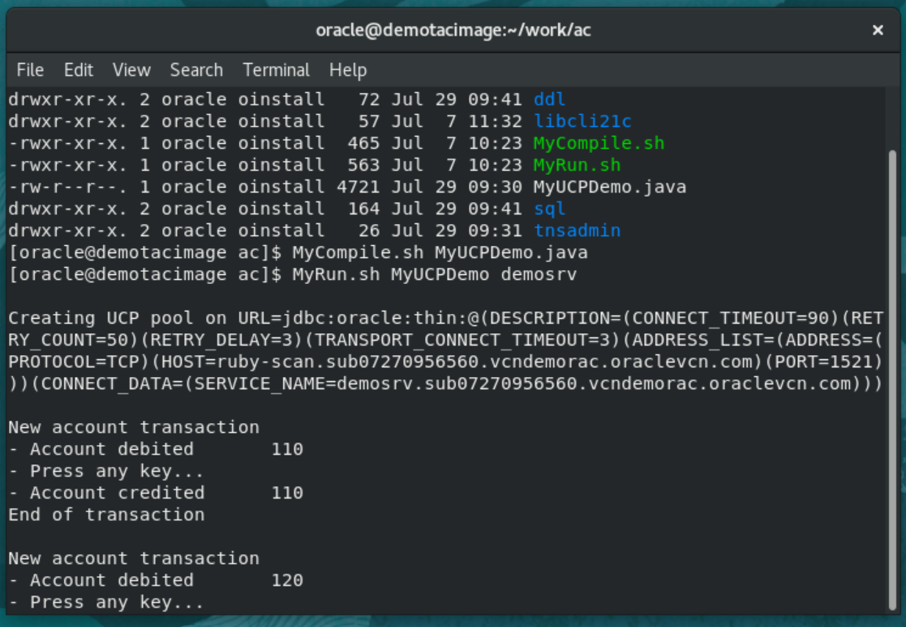

# Application Continuity for unplanned outages

## Introduction

In this lab, we will configure a connection pool with a single connection. This will allow us to interrupt at will the demo application in the middle of a transaction and see whether or not Application Continuity hides the outage.

Estimated Lab Time: 30 minutes


### Objectives

In this lab, you will:

* Interrupt a transaction whilst connected with a **standard service** and experience an application error and a lost transaction.
* Interrupt a transaction whilst connected with a database service supporting **Application Continuity** and verify that the application continues without outage nor loss of any transactions.


### Prerequisites

This lab assumes you have:
* The Oracle environment prepared in the preceding lab.


## Task 1: Configure the Lab

  1. Configure the pool to use a single connection

    In this lab, we'll use a pool configured to use a **single connection** to the database. That way, we'll be able to identify the connection more easily from a different session if we want to kill it in the middle of a transaction to simulate an unplanned outage.

    **Make sure the pool in MyUCPDemo.java is configured to use a single connection**

      ```
      pds.setMinPoolSize(1);
      pds.setMaxPoolSize(1);
      ```

  2. Recompile the application

    ````
    [oracle@demotac ac]$ <copy>MyCompile.sh MyUCPDemo.java</copy>
    ````


## Task 2: Observe What Happens **Without** Application Continuity

  1. Run the demo program with a database service that does *not* use Application Continuity

    ````
    [oracle@demotac ac]$ <copy>MyRun.sh MyUCPDemo demosrv</copy>
    ````


    The application gets a connection and starts a first transaction. It connects to the database as user **CONTI** and makes accounting entries in table **ACCOUNT**. Each accounting transaction should consist of two lines in ACCOUNT: one with DIR='D' (for Debit) and another one with DIR='C' (for Credit).

    A trigger allows to capture the database service that was used to connect when INSERT statements are executed.

    

  2. Strike RETURN, and the application finishes the first transaction and starts a second one

    

  3. Strike RETURN two more times to complete more transactions

    

    We are now in the middle of the 4th transaction.

  4. From a **second tab** in the terminal session (File > New Tab), go to the **sql** directory and examine the content of the transaction table **ACCOUNT**

    ````
    [oracle@demotac ac]$ <copy>cd /home/oracle/work/ac/sql</copy>
    ````

    

    Execute **show_data.sh**

      ````
      [oracle@demotac sql]$ <copy>show_data.sh</copy>
      ````

    

  5. One can see three completed transactions for **110**, **120** and **130** and we should be in the middle of the fourth one for **140** (which we do not see since it is not finished and has not yet been committed).

    > **Note**: the trigger on the table has captured the database service used by the Connection.

    We can also see the session we have been using by running **show_session.sh** from the same terminal.

    

      ````
      [oracle@demotac sql]$ <copy>show_session.sh</copy>
      ````

    

  6. Now let's kill that session in the middle of the current transaction to simulate an unplanned outage. Run **kill_session.sh** from the same terminal window

    

      ````
      [oracle@demotac sql]$ <copy>kill_session.sh</copy>
      ````

    

  7. Back to the first terminal window where the application is running, strike RETURN again !

    Since our single connection to the database has been broken, the program expectedly receives an error.

    

  8. Even if the program manages to reconnect, one can see that a transaction has been lost.

    Run **show_data.sh** again to verify

      ````
      [oracle@demotac sql]$ <copy>show_data.sh</copy>
      ````

    


## Task 3: Observe What Happens **With** Application Continuity

  We will now see Application Continuity in action by running the application with the **tacsrv** service.

  1. Refresh demo schema

    We will start by refreshing the demo schema. Run **ddl_setup.sh** again from a third tab on your terminal window.

    

      ````
      [oracle@demotac ddl]$ <copy>ddl_setup.sh</copy>
      ````

    


  2. Run the demo program with a database service that uses **Application Continuity**

    ````
    [oracle@demotac ac]$ <copy>MyRun.sh MyUCPDemo tacsrv</copy>
    ````

    The application gets a connection and starts a first transaction. It connects to the database as user **CONTI** and makes accounting entries in table **ACCOUNT**. Each accounting transaction should consist of two lines in ACCOUNT: one with DIR='D' (for Debit) and another one with DIR='C' (for Credit).

    A trigger allows to capture the database service that was used to connect when INSERT statements are executed.

    

  3. Strike RETURN and the application finishes the first transaction and starts a second one

    

  4. Strike RETURN two more times to complete more transactions

    

    We are now in the middle of the 4th transaction.

  5. From a **second tab** in the terminal session, go to the **sql** directory and examine the content of the transaction table **ACCOUNT**

    

      ````
      [oracle@demotac sql]$ <copy>show_data.sh</copy>
      ````

    

  6. One can see three completed transactions for **110**, **120** and **130** and we should be in the middle of the fourth one for **140**.

    Note that the trigger on the table has captured the database service used by the Connection

    We can also see the session we have been using by running **show_sessions.sh** from the same terminal

    

      ````
      [oracle@demotac sql]$ <copy>show_session.sh</copy>
      ````

    

  7. Now let's kill that session in the middle of the current transaction to simulate an unplanned outage. Run **kill_session.sh** from the same terminal window

      ````
      [oracle@demotac sql]$ <copy>kill_session.sh</copy>
      ````

    

  8. Back to the first terminal window where the application is running, strike RETURN again !

    This time, Application Continuity kicks in and the program continues without showing any errors.

    *In fact, AC has obtained a new connection and replayed the transaction from the beginning (the first INSERT) when an error was detected. An error was detected (but not shown) when trying to execute the second INSERT through a broken connection. This set AC to work...*

    

  8. Furthermore one can see that no data has been lost.

    You may run a few more transactions from the first window and check from the second window that no transactions are lost (run **show_data.sh** again)

    


**You can now proceed to the next lab…**


## Acknowledgements
* **Author** - François Pons, Senior Principal Product Manager
* **Contributors** - Andrei Manoliu, Principal Product Manager
* **Last Updated By/Date** - François Pons, September, 15th 2022
