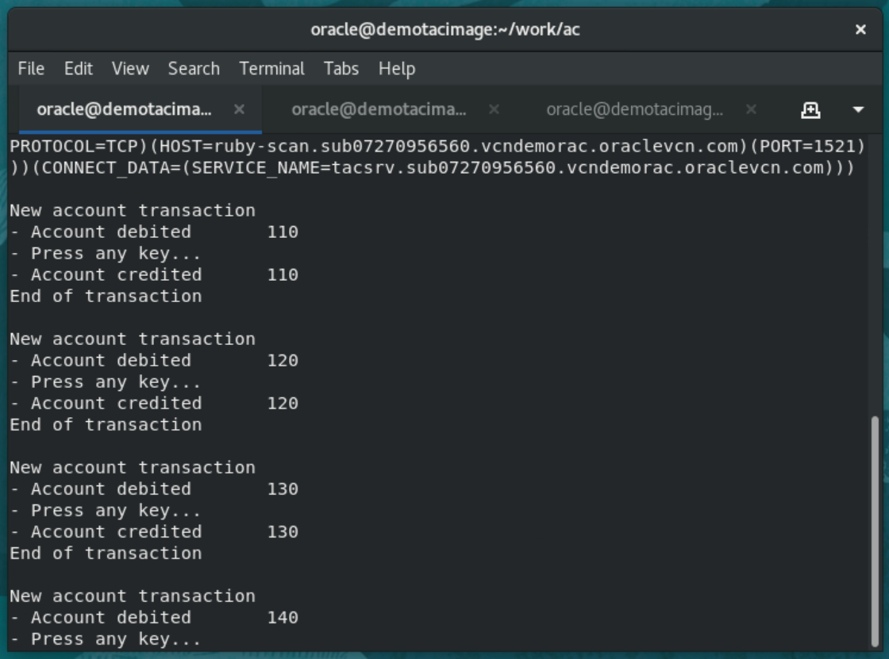

# Application Continuity for Planned Maintenance

## Introduction

In this lab we will create a connection pool with 10 connections and first verify that UCP distributes them equally between the cluster nodes.

We will then also direct (and drain) connections to a chosen node of the database cluster, thus making one node of the cluster available for planned maintenance.

Draining connections means that enough time is provided for current work to complete before maintenance is started on a node.


Estimated Lab Time: 30 minutes


### Objectives

In this lab, you will:

* Verify that the UCP connection pool balances the connections between available instances
* Move database services between instances according to planned maintenance needs

### Prerequisites

This lab assumes you have:
* The Oracle environment prepared in the first lab.


## Task 1: Configure the lab

1. Configure the pool for 10 connections

Edit the java demo application MyUCPDemo.java and make sure the pool is configured to use a 10 connections. For example:

  ```
  pds.setInitialPoolSize(10);
  pds.setMinPoolSize(10);
  pds.setMaxPoolSize(20);
  ```


2. Recompile the application

````
user@cloudshell:~ $ <copy>MyCompile.sh MyUCPDemo.java</copy>
````


3. Refresh demo schema

We will start by refreshing the demo schema. Run **ddl_setup.sh** again from a third tab on your terminal window.


## Task 2: Connection routing to instance 2 only

1. Run the demo program with a database service that uses **Application Continuity**

````
user@cloudshell:~ $ <copy>MyRun.sh MyUCPDemo tacsrv</copy>
````

The application creates a connection pool of 10 connections, gets a connection from the pool and starts a first transaction.


2. Observe the pool

From a **second tab** in the terminal session, go to the **sql** directory and examine the pool by running **show_pool.sh**


Observe that connections are spread across available nodes.


3. Strike RETURN and complete a few more transactions




4. Prepare to no longer use node1 (ie instance CONT1)

Let us suppose we need to do some maintenance to node1 of the cluster.

To be able to take node1 our of the cluster without impacting the application, let us move the service to instance 2.

Using Cloud Shell:

* Connect to the first node of the RAC cluster as **opc** and switch to the **oracle** user

  ````
  user@cloudshell:~ $ <copy>ssh -i fpkey opc@[node 1 public IP]</copy>
  ````

* Switch to user *oracle*

  ````
  $ <copy>sudo su - oracle</copy>
  ````

* Instruct the service to stop on instance CONT1


````
user@cloudshell:~ $ <copy>srvctl stop service -db cont_prim -service tacsrv -instance CONT1</copy>
````

````
user@cloudshell:~ $ <copy>srvctl status service -db cont_prim -service tacsrv</copy>

Service tacsrv is running on instance(s) CONT2
````

5. Run a couple more transactions and verify the pool

* does not get any errors
* has recreated all connections to node2


## Task 3: Connection routing to instance 1 only

1. We can now do the reverse and move the service to only CONT1


````
user@cloudshell:~ $ <copy>srvctl start service -db cont_prim -service tacsrv -instance CONT1</copy>
````

````
user@cloudshell:~ $ <copy>srvctl stop service -db cont_prim -service tacsrv -instance CONT2</copy>
````

````
user@cloudshell:~ $ <copy>srvctl status service -db cont_prim -service tacsrv</copy>

Service tacsrv is running on instance(s) CONT1
````

2. Run a couple more transactions and verify the pool is now only using connections to node1


3. Use both instances again

````
user@cloudshell:~ $ <copy>srvctl start service -db cont_prim -service tacsrv -instance CONT2</copy>

Service tacsrv is running on instance(s) CONT1,CONT2
````


**This is the end of the workshop**


## Acknowledgements
* **Author** - François Pons, Senior Principal Product Manager
* **Contributors** - Andrei Manoliu, Principal Product Manager
* **Last Updated By/Date** - François Pons, August 2022
