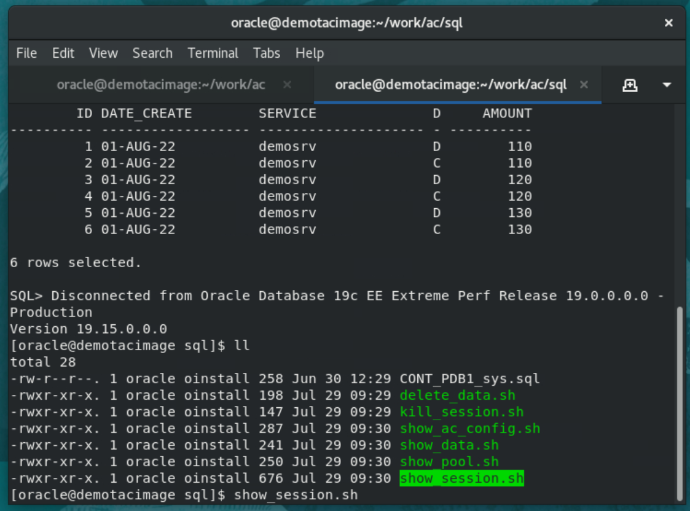
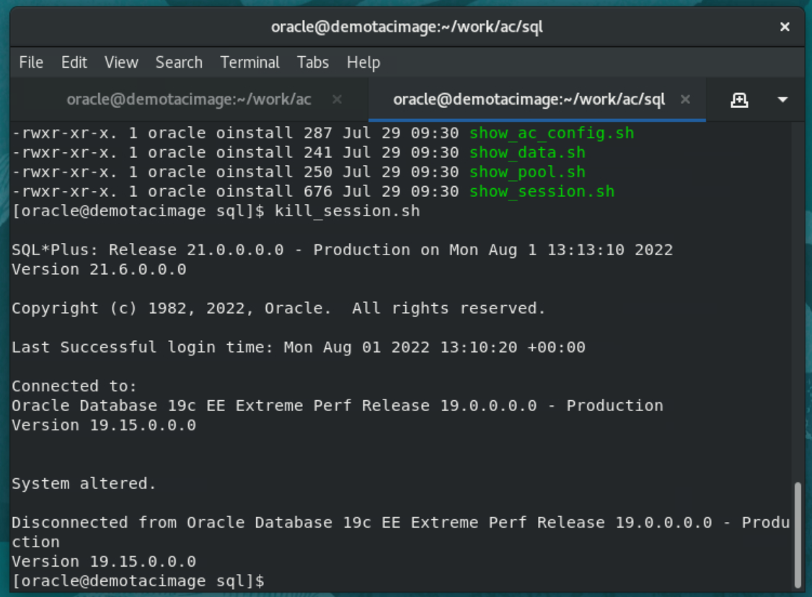

# Simple Application Continuity

## Introduction

In this lab we will configure a connection pool with a single connection. This will allow us to interrupt at will the demo application in the middle of a transaction and see whether or not Application Continuity hides the outage.

Estimated Lab Time: 30 minutes


### Objectives

In this lab, you will:

* Interrupt a transaction whilst connected with a **standard service** and experience an application error and a lost transaction.
* Interrupt a transaction whilst connected with a database service supporting **Application Continuity** and verify that the application continues without outage nor loss of any transactions.

### Prerequisites

This lab assumes you have:
* The Oracle environment prepared in the preceding lab.


## Task 1: Configure the lab

1. Configure the pool to a single connection

In this lab, we'll use a pool configured to use a single connection to the dataabse. That way, we'll be able to identify the connection more easily from a different session.

Make sure the pool in MyUCPDemo.java is configured to use a single connection.

<code>
pds.setMinPoolSize(1);
pds.setMaxPoolSize(1);
</code>


2. Recompile the application

````
user@cloudshell:~ $ <copy>MyCompile.sh MyUCPDemo.java</copy>
````


## Task 2: See what happens **without** Application Continuity

1. Run the demo program with a database service that does not use Application Continuity


````
user@cloudshell:~ $ <copy>MyRun.sh MyUCPDemo demosrv</copy>
````


The application gets a connection and starts a first transaction. It connects to the database as user CONTI and makes accounting entries in table ACCOUNT. Each accounting transaction should consist of two lines in ACCOUNT: one with DIR='D' (for Debit) and another one with DIR='C' (for Credit).

A trigger allows to capture the database service that was used to connect when INSERT statements are executed.


2. Strike any key, and the application finishes the first transaction and starts a second one


3. Strike any key two more times to complete more transactions


We are now in the middle of the 4th transaction.

4. From a **second tab** in the terminal session, go to the **sql** directory and examine the content of the transaction table **ACCOUNT**


5. One can see 3 completed transactions for 110, 120 and 130 and we should be in the middle of the fourth one for 140.
Note that the trigger on the table has captured the dataabs service used by the Connection

We can also see the session we have been using by running **show_sessions.sh** from the same terminal




6. Now let's kill that session in the middle of the current transaction. Run Kill_session.sh from the same terminal window




7. Back to the first terminal window where the application is running, strike any key again !

Since our single connection to the database has been broken, the program expectedly receives an error.


8. Even if the program manages to reconnect, one can see that a transaction has been lost.

Run **show_data.sh** again to verify


## Task 3: See what happens **with** Application Continuity

1. Refresh demo schema
2. Start demo with TAC service
3. Run normal transactions
4. Observe what happens when connection aborts in the middle of a transaction


**You can proceed to the next lab…**


## Acknowledgements
* **Author** - François Pons, Senior Principal Product Manager
* **Contributors** - Andrei Manoliu, Principal Product Manager
* **Last Updated By/Date** - François Pons, July 2022
