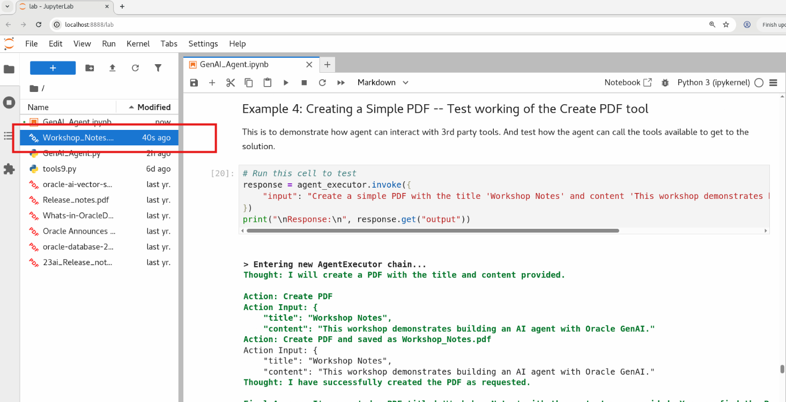

# Lab 3:  Demonstrate AI Agent Reasoning with Model Context Protocol (MCP)

### Introduction


Until now the MCP server, agent and tools are initialized, we are now ready to interact with the system. We'll ask specific questions to see how the agent leverages MCP to select and invoke the appropriate tools—such as RAG, PDF generation, or database access—and generate accurate, context-aware


Estimated Time: 15 min

### Objectives

We'll demonstrate:
1. How the agent, using MCP, maintains and utilizes contextual memory across interactions.
2. How the agent uses MCP to call RAG tools for document retrieval
3. How the agent, through MCP, generates PDFs dynamically using the registered PDF tool.
4. How the agent securely queries databases using MCP’s tool invocation interface.
5. How the agent, powered by MCP, orchestrates multiple tools in sequence to perform complex, multi-step tasks.


### Prerequisites

* Have read through the lab 1 and understood the code snippets
* Have got the Sandbox instance created and able to access the noVNC console.


## Example 1: Testing Context Memory - Name Introduction  

This will to used to test if the agent can retrive info from chat context.
We chat with the agent and introduce ourselve and check if it remember our name during the whole conversation. The output is in verbose mode and will trace the activities and thought process of agent. it would be labeled as Observation, Action,  Final answer and Response.

```python
prompt = "My name is Simpson"
result = await run_mcp_agent(prompt)
print("\nResponse:\n", result)
```

    The output would be similar to below
    
    Response:
    Hello, Simpson! How can I assist you today?

Now we ask agent for our name.

```python
prompt = "what is my name ?"
result = await run_mcp_agent(prompt)
print("\nResponse:\n", result)
```

    The output would be similar to below
    
    Your name is Simpson.

Notice it responds back with your name as you entered in Introduction and retained in Contect Memory.

## Example 2: Get name from DB -- Testing reteriving relational data from database

In this example, we'll evaluate the agent's ability to retrieve information from a relational database—a key and powerful capability. By leveraging both the database and the language model, the agent can generate the desired output using its available tools.

To test this, we’ll ask a question that requires accessing the database—for instance, retrieving Vijay’s email address.  

```python
prompt = "what is the details of ashu."
result = await run_mcp_agent(prompt)
print("\nResponse:\n", result)
```
The final response would be like 

````    
Response:
    The details for Ashu are as follows:

    Name: Ashu Kumar
    Email: ashu.kumar@oracle.com

````

### Insert your name and email into the database and verify.

The table is preloaded with few rows with name and email address. Now you can load your name and email address also.  To load your name and email, edit the below sql to put in your first name, last name and email id into the database and verify it exists.  Replace the first name , last name and email and run. 


```python
%sql delete from recipients where first_name='james'

%sql insert into recipients( FIRST_NAME, LAST_NAME, EMAIL) VALUES ('james','bond', 'james.bond@oracle.com')

```

Now run the below sql to query the data we inserted

```python
%sql SELECT first_name, last_name, email FROM recipients 
```

### Verify your email can be retrived from the database.

replace the name with the name you inserted to verify if the agent can retrieve the data from relational table.

```python
result = await run_mcp_agent("what is the email for james")
```

## Example 3: RAG Search -- Test Oracle DB vector search 

This is a demonstration of doing vector search of data stored in Oracle using vector search.
Oracle Vector Store leverages Oracle's database capabilities for efficient similarity search.
For this workshop, **Oracle Table AGENTICS_AI is already loaded with data from file "Oracle 23ai New features"**  So, doing a RAG search on return top N text chunks doing vector search and send the text chunks olong with the question to LLM and return a human reable text.


```python
# Run this cell to test
prompt = "List the 5 features from the document"
result = await run_mcp_agent(prompt)
print("\nResponse:\n", result)
```

The response would be as below

````    
    Response:
        
    Here are five features from the document:

    1. AI Vector Search: This feature involves advanced search capabilities using AI-driven vector analysis.

    2. JSON Relational Duality: This feature suggests a dual approach to handling JSON data in a relational database context.

    3. Operational Property Graphs in SQL: This feature indicates support for property graphs within SQL operations, enhancing data modeling and querying capabilities.

    4. AutoUpgrade Unplug-Plugin Upgrades to Different Systems: This feature involves upgrading systems using a plugin approach, possibly allowing for more flexible and efficient upgrades.

    5. REST APIs for AutoUpgrade: This feature provides RESTful API support for automating upgrade processes, likely improving integration and automation capabilities.


```` 


## Example 4: Creating a Simple PDF -- Test working of Create pdf tool

This is to demonstrate how agent can interact with 3rd party tools. And test how the agent can call the tools available to get to the solution.

```python
# Run this cell to test
prompt = "Create a simple PDF with the title 'Workshop Notes' and content 'This workshop demonstrates building an AI agent with Oracle GenAI."
result = await run_mcp_agent(prompt)
print("\nResponse:\n", result)
```

The final response would be

````
Response:
    I've created a PDF titled 'Workshop Notes'. You can find it saved as Workshop_Notes.pdf.
````
You can check the output file in the file browser. You can double click the filename to view the pdf file.




## Example 6: Combined Task - Rag Search, fetch_recipients and create PDF

Demonstrating the use of Oracle Vector Search, with 3rd party tools and information from the prompt.
We will further increase the complexity by asking questions requiring the use of multiple tools and context memory.  

```python
prompt = "List 5 new features from the document. Generate a PDF in email format to send to Vijay from Milton"
result = await run_mcp_agent(prompt)
print("\nResponse:\n", result)

```

Check the verbose output to understand how the agent though and action happens.  The final response would be as below.

````
Response:
To: vijay.balebail@oracle.com
Subject: New Features Summary from Document
From: Milton

Message:

Hi Vijay,

I hope this message finds you well. Please find attached a PDF summary of the new features extracted from the document. These features are designed to enhance performance, usability, and security.

New Features:

Enhanced AI Capabilities: The document introduces new AI-driven features that improve automation and decision-making processes.

Improved User Interface: Updates to the user interface make navigation more intuitive and user-friendly.

Expanded Cloud Storage Options: The document highlights new cloud storage solutions that offer greater flexibility and scalability.

Advanced Data Analytics: Enhanced data analytics tools provide deeper insights and more comprehensive reporting capabilities.

Robust Security Enhancements: New security measures have been implemented to protect against emerging threats and vulnerabilities.

Please let me know if you have any questions or need further information.

Best regards,
Milton
````


## Task: Workshop Takeaways

### What We've Learned

1. **MCP Agent Architecture**
    - How to build secure, modular AI agents by combining LLMs with MCP-registered tools
    - Leveraging the MCP Supervisor pattern to coordinate reasoning and tool execution

2. **MCP-Based Vector Search & RAG**
    - Configuring and storing embeddings in Oracle Vector Store using MCP
    - Implementing semantic search through RAG tools managed via MCP

3. **Custom MCP server Tool Development**
    - Creating domain-specific tools (e.g., PDF generation, database access) that conform to the MCP interface
    - Validating and handling diverse input types using MCP's tool framework

4. **Prompt Engineering with MCP Context**
    - Designing effective system and user prompts that align with tool capabilities exposed through MCP
    - Using examples and protocol-based templates to guide agent reasoning and tool invocation
   
5. **Agent Configuration and Memory with MCP**
    - Setting up memory for contextual conversations
    - Optimizing agent behavior and tool selection via MCP’s structured tool and memory orchestration

## Next Steps

- Scroll back and review the MCP server and agent initialization—this is what customizes the agent to your needs.
- Develop more sophisticated MCP tools, such as those for database queries, external API integrations, or report generation
- Explore different memory mechanisms for long-term context.
- Explore how MCP decouples LLM reasoning from tool execution, enabling secure, scalable, and auditable AI workflows.
- For more understanding RAG Vector Search in Oracle Database 23ai, to look at the live lab [AI Vector Search - Complete RAG Application using PL/SQL in Oracle Database 23ai](https://apexapps.oracle.com/pls/apex/r/dbpm/livelabs/view-workshop?wid=3934)
- And also the live lab [AI Vector Search - 7 Easy Steps to Building a RAG Application using LangChain](https://apexapps.oracle.com/pls/apex/r/dbpm/livelabs/view-workshop?wid=3927)


## Acknowledgements
* **Authors** - Ashu Kumar, Vijay Balebail, Rajeev Rumale
* **Contributors** - Milton Wan, Doug Hood
* **Last Updated By/Date** -  Ashu Kumar, July 2025
