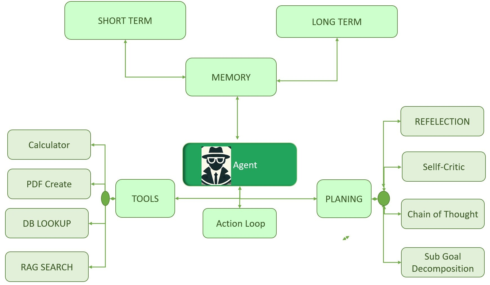

# Oracle AI Agent Workshop - Building a Document Search and PDF Generation Agent

## About this Workshop

Introduction

This workshop demonstrates how to build a powerful AI agent that can search documents, generate PDFs, and handle email-related tasks using LangChain and Oracle GenAI. This hands-on workshop teaches building AI agents with Python and LangChain, focusing on Oracle Database 23ai integration for relational and RAG data. Learn to design prompts, create custom tools, and use memory for tasks like email automation and PDF generation. using LangChain participants will gain skills to develop cutting-edge AI solutions, showcasing Oracle’s AI Agentics capabilities.

### **About LLM Agents**
What are LLM Agents?
An AI Agent is a reasoning framework built around a Large Language Model (LLM) that can interpret user input, reason through it step-by-step, and autonomously use external tools (like search, email, or PDF generators) to accomplish tasks.

Think of it as turning an LLM into a decision-making assistant ? not just a chatbot that responds, but a system that plans, decides, and acts.

It's like giving the LLM: a brain to reason and remember (via prompts + memory),
eyes and ears to read documents or look up info (via tools),
and hands to take action (e.g., sending emails, generating PDFs).
 

### **Why AI Agents Matter?**
AI agents are transforming industries by automating sophisticated workflows, boosting productivity, and enabling scalable solutions. Integrated with systems like Oracle Database 23ai (11.15% market share in relational databases), they streamline tasks like customer support and data analysis, reducing costs and errors. For developers, mastering AI agents unlocks opportunities to build innovative, competitive solutions.

### **Understanding LLM Agents**

AI Architecture LLM Agents are AI systems that can:

Plan and Reason: Analyze a task and determine necessary steps
Use Tools: Execute functions to gather information or perform actions
Maintain Context: Remember conversation history and previous actions
Make Decisions: Choose appropriate next steps based on observations
The agent we're building today follows the ReAct pattern (Reasoning + Acting):

Reasoning: The agent thinks through the problem
Acting: The agent takes action based on reasoning
Observation: The agent observes the result
Repeat: Until the task is complete """

### **Agent Components**

AI agents rely on key components for functionality:
Tools: External resources or APIs (e.g., database queries, email services, PDF generation).
Prompts: Instructions guiding the agent’s behavior for accurate outputs.
Model: The AI model (e.g., GPT, LLaMA) powering reasoning and decisions.
Memory: Contextual memory for retaining prior interactions in multi-step tasks.
Planner: Breaks down tasks into steps, selecting tools and actions.
Environment: Data sources like Oracle 23ai for processing information.

 

Estimated Time:  15 min

### Objectives

Throughout this workshop, we'll explore:

* Setting up the environment and dependencies
* Creating custom tools for our agent
* Designing effective prompt templates
* Initializing and running the agent
* Let's get started!

### Prerequisites

- An Oracle LiveLabs Account
- Check out Livelab - Complete RAG Application using PL/SQL in Oracle Database 23ai

## Learn More

See below for more information on Oracle Database 23ai and Oracle AI Vector Search

* [Oracle AI Agentics Blog ]( )
* [Oracle AI Agentics Blog ](https://docs.oracle.com/en/database/oracle/oracle-database/)
* [Oracle AI Vector Search User's Guide](https://docs.oracle.com/en/database/oracle/oracle-database/23/vecse/index.html)
* [Oracle AI Vector Search Blog](https://blogs.oracle.com/database/post/oracle-announces-general-availability-of-ai-vector-search-in-oracle-database-23ai)

You may now [proceed to the next lab](#next).

## Acknowledgements
* **Authors** -  Vijay Balebail, Milton Wan, Rajeev Rumale, Doug Hood
* **Last Updated By/Date** -  Rajeev Rumale, May 2025
