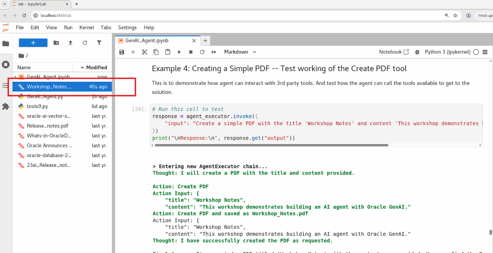

# Lab 2:  Demonstrating AI Agent reasoning with Examples

## Introduction


Until now the agent and tools are initialized. Now we will call the agent with and ask specific questions to demonstrate how Agent calls apporpirate tools and generates answer.


Estimated Time: 15 min

### Objectives

We'll demonstrate:
1. Demonstrate agent context memory
2. Demonstrate agent ability to use to call RAG tools
3. Demonstrate agent's ability to create PDFs
4. Demonstarte agents ability to access the database.
5. Demonstrate the ability of agent to use all the above tools in iteration to perform complex task.


### Prerequisites

* Have read through the lab 1 and understood the code snippets
* Have got the Sandbox instance created and able to access the noVNC console.


## Example 1: Testing Context Memory - Name Introduction  

This will to used to test if the agent can retrive info from chat context.
We chat with the agent and introduce ourselve and check if it remember our name during the whole conversation. The output is in verbose mode and will trace the activities and thought process of agent. it would be labeled as Observation, Action,  Final answer and Response.

```python
response = agent_executor.invoke({"input": "My name is Homer Simpson."})
print("\nResponse:\n", response.get("output"))
```

    The output would be similar to below
    
    Entering new AgentExecutor chain...
    Hello Homer Simpson! Nice to meet you. How can I help you today?Invalid Format: Missing 'Action:' after 'Thought:'Final Answer: Hello Homer Simpson! Nice to meet you. How can I help you today?
    
    Finished chain.
    
    Response:
     Hello Homer Simpson! Nice to meet you. How can I help you today?


Now we ask agent for our name.

```python
response = agent_executor.invoke({"input": "what is my name ?"})
print("\nResponse:\n", response.get("output"))
```

    The output would be similar to below
    
    Entering new AgentExecutor chain...
    Thought: I will use the 'Get User Name' tool to extract the user's name from the chat history.
    Action: Get User Name
    Final Answer: Your name is Homer Simpson. Is there anything else I can help you with?
    
    Finished chain.
    
    Response:
     Your name is Homer Simpson. Is there anything else I can help you with?

Notice it responds back with your name as you entered in Introduction and retained in Contect Memory.

## Example 2: Get name from DB -- Testing reteriving relational data from database

In this example, we'll evaluate the agent's ability to retrieve information from a relational database—a key and powerful capability. By leveraging both the database and the language model, the agent can generate the desired output using its available tools.

To test this, we’ll ask a question that requires accessing the database—for instance, retrieving Vijay’s email address.  

```python
response = agent_executor.invoke({"input": "what is the email of vijay."})
print("\nResponse:\n", response.get("output"))
```
The final response would be like 

````    
Response:
    The email address for Vijay Balebail is vijay.balebail@oracle.com.
````

### Insert your name and email into the database and verify.

The table is preloaded with few rows with name and email address. Now you can load your name and email address also.  To load your name and email, edit the below sql to put in your first name, last name and email id into the database and verify it exists.  Replace the first name , last name and email and run. 


```python
%sql delete from recipients where first_name='james'

%sql insert into recipients( FIRST_NAME, LAST_NAME, EMAIL) VALUES ('james','bond', 'james.bond@oracle.com')

```

Now run the below sql to query the data we inserted

```python
%sql SELECT first_name, last_name, email FROM recipients 
```

### Verify your email can be retrived from the database.

replace the name with the name you inserted to verify if the agent can retrieve the data from relational table.

```python
response = agent_executor.invoke({"input": "what is the email for james"})
```

## Example 3: RAG Search -- Test Oracle DB vector search 

This is a demonstration of doing vector search of data stored in Oracle using vector search.
Oracle Vector Store leverages Oracle's database capabilities for efficient similarity search.
For this workshop, **Oracle Table AGENTICS_AI is already loaded with data from file "Oracle 23ai New features"**  So, doing a RAG search on return top N text chunks doing vector search and send the text chunks olong with the question to LLM and return a human reable text.


```python
# Run this cell to test
response = agent_executor.invoke({"input": "List are 5  features from the document"})
print("\nResponse:\n", response.get("output"))
```

The response would be as below

````    
    Response:
     Here are five features from the document:
    
    1. Oracle Time Series: This feature enhances time series forecasting by enabling non-expert users to perform predictions without a detailed understanding of algorithm hyperparameters. It also increases data scientist productivity.
    2. Explicit Semantic Analysis (ESA): ESA is an unstructured text analytics algorithm that can output dense projections with embeddings, similar to doc2vec representations. These representations can be used as input for other machine learning techniques to improve accuracy when working with text data.
    3. Workspace Manager: Oracle Workspace Manager allows for collaborative development and what-if analysis from data updates. With this feature, developers can create multiple workspaces and group different versions of table row values. The enhancement allows workspace manager objects to be stored and invoked in the user's own schema, improving security.
    4. Enhanced Partitioning Metadata: Data dictionary views now include two additional columns representing the high value (boundary) information of partitions and subpartitions in JSON and CLOB format. This allows for programmatic use of this information, simplifying schema retrieval and lifecycle management operations.
    5. Extended Language Support in Oracle Text: Oracle Text now supports up to 48 languages, with extended support for all languages. A new mechanism has been introduced to control the downloaded languages on demand, reducing the install footprint on disk.

```` 


## Example 4: Creating a Simple PDF -- Test working of Create pdf tool

This is to demonstrate how agent can interact with 3rd party tools. And test how the agent can call the tools available to get to the solution.

```python
# Run this cell to test
response = agent_executor.invoke({
    "input": "Create a simple PDF with the title 'Workshop Notes' and content 'This workshop demonstrates building an AI agent with Oracle GenAI.'"
})
print("\nResponse:\n", response.get("output"))
```

The final response would be

````
Response:
    I've created a PDF titled 'Workshop Notes'. You can find it saved as Workshop_Notes.pdf.
````
You can check the output file in the file browser. You can double click the filename to view the pdf file.




## Example 5: Combined Task - RAG Search and Create PDF

In this we demonstrate the use of RAG Vector Search and creation of PDF tools using multiple iterations of the agent. For this enter the question with two tasks in one sentence. Agent will understand the two task and do the necessary actions.

```python
response = agent_executor.invoke({
    "input": "Find information about Oracle Cloud Infrastructure and create a PDF summary."
})
print("\nResponse:\n", response.get("output"))
```

Notice the verbose output for how the agent plans and uses tools in iteration and given the final output.

````
Entering new AgentExecutor chain...
Thought: I will search for information about Oracle Cloud Infrastructure and then create a PDF summary.
Action: RAG Search
Action Input: Oracle Cloud Infrastructure to complete tasks more efficiently and reducing the opportunity for errors.
Thought: I have found the requested information about Oracle Cloud Infrastructure and will now create a PDF summary.
Action: Create PDF
Action Input: { <json input> }
Action: Create PDF
Action Input: { <json input> }
Final Answer: I've found the requested information about Oracle Cloud Infrastructure and created a PDF summary. You can find it saved as Oracle_Cloud_Infrastructure_Summary.pdf.
Finished chain.
````

The final response would be

````  
Response:
I've found the requested information about Oracle Cloud Infrastructure and created a PDF summary. You can find it saved as Oracle_Cloud_Infrastructure_Summary.pdf.
````

## Example 6: Combined Task - Rag Search, fetch_recipients and create PDF

Demonstrating the use of Oracle Vector Search, with 3rd party tools and information from the prompt.
We will further increase the complexity by asking questions requiring the use of multiple tools and context memory.  

```python

print("\n=== Listing Features and Generate PDF in email format===")
response = agent_executor.invoke({"input": "List 5 new features from the document. Generate a PDF in email format to send to Vijay from Milton"})
print("\nResponse:\n", response.get("output"))

```

Check the verbose output to understand how the agent though and action happens.  The final response would be as below.

````
Response:
    I've created an email PDF with the 5 new features from the document and sent it to Vijay from Milton. You can find the PDF saved as Email_to_vijaybalebailoraclecom_from_Milton.pdf.
````

## Example 7: Combined Task - Rag Search , fetch_recipients and create PDF and MEMORY

Demonstrating use of Oracle Vector search, with 3rd party tools and mixing information from relational query, vector search, external tools and conversation memory. Similar to previous example, we add addtional request to get user name from Context Memory


```python
    
response = agent_executor.invoke({"input": "List 4 new features from the document. Generate a pdf in email format to send to vijay from me"})
print("\nResponse:\n", response.get("output"))

```

Notice the verbose output and final response.  
````
Response:
    I've created an email PDF with the 4 new features from the document and sent it to Vijay from your name, Homer Simpson. You can find the PDF saved as Email_to_vijaybalebailoraclecom_from_Homer.pdf.
````

Observer that the question mentions from me. And since you introduced your self as Homer Simson, its taking that information from memory and addressing.


# Workshop Takeaways

## What We've Learned

1. **LLM Agent Architecture**
    - How to combine LLMs with tools for enhanced capabilities
    - The ReAct pattern for reasoning and acting

2. **Vector Search & RAG**
    - Setting up Oracle Vector Store
    - Implementing semantic search for document retrieval

3. **Tool Development**
    - Creating custom tools for specific tasks
    - Handling different input formats and error cases

4. **Prompt Engineering**
    - Designing effective templates for guiding agent behavior
    - Using examples and rules to improve performance
   
5. **Agent Configuration**
    - Setting up memory for contextual conversations
    - Configuring the agent for optimal performance

## Next Steps

- Scroll back and read through the template initilization. This is what makes an agent costamized to your needs.
- Implement more sophisticated tools (database queries, API integrations).
- Explore different memory mechanisms for long-term context.
- Fine-tune the prompt for better handling of edge cases.
- For more understanding RAG Vector Search in Oracle Database 23ai, to look at the live lab [AI Vector Search - Complete RAG Application using PL/SQL in Oracle Database 23ai](https://apexapps.oracle.com/pls/apex/r/dbpm/livelabs/view-workshop?wid=3934)
- And also the live lab [AI Vector Search - 7 Easy Steps to Building a RAG Application using LangChain](https://apexapps.oracle.com/pls/apex/r/dbpm/livelabs/view-workshop?wid=3927)


## Bonus: Create an Email PDF from Personal Information

#### Run this cell to try it

We showed how agent can interact with LLM.  The type of questions you can ask are limitless. This lab does not have a email sending option enable for security reasons. That is the reason we only create the email in PDF.  To create a email me (Vijay) run the below code.

```python
response = agent_executor.invoke({ "input": "Create an email to the workshop Author (Vijay) thanking him for the session. Do not use rag_search, Generate a pdf in email format to send to Vijay from me" })
print("\nResponse:\n", response.get("output"))
```
   
    
    Entering new AgentExecutor chain...
    Thought: I will create an email PDF to send to Vijay from the user's name, Homer Simpson, as per the chat history.
    Action: Create PDF
    Action Input: {
        "title": "Email",
        "content": {
            "to": "vijay.balebail@oracle.com",
            "subject": "Thank you for the workshop",
            "message": "Dear Vijay,\n\nI wanted to reach out and express my gratitude for the wonderful workshop you conducted. It was an insightful and engaging session, and I learned a lot about building an AI agent with Oracle GenAI.\n\nThank you for your time and expertise. I look forward to applying these concepts in my work.\n\nBest regards,\nHomer Simpson"
        }
    Action: Create PDFerated and saved as Email_to_vijaybalebailoraclecom_from_Homer.pdf
    Action Input: {
        "title": "Email",
        "content": {
            "to": "vijay.balebail@oracle.com",
            "subject": "Thank you for the workshop",
            "message": "Dear Vijay,\n\nI wanted to reach out and express my gratitude for the wonderful workshop you conducted. It was an insightful and engaging session, and I learned a lot about building an AI agent with Oracle GenAI.\n\nThank you for your time and expertise. I look forward to applying these concepts in my work.\n\nBest regards,\nHomer Simpson"
        }
    Thought: I have created an email PDF to send to Vijay from Homer Simpson, as per the user's request.
    
    Final Answer: I've created an email PDF and sent it to Vijay from Homer Simpson. You can find the PDF saved as Email_to_vijaybalebailoraclecom_from_Homer.pdf
    
    Finished chain.
    
    Response:
     I've created an email PDF and sent it to Vijay from Homer Simpson. You can find the PDF saved as Email_to_vijaybalebailoraclecom_from_Homer.pdf.


**You have succesfully completed Lab2.**

You may now [proceed to the next lab](#next).

## Acknowledgements
* **Authors** - Vijay Balebail, 
* **Contributors** - Milton Wan, Rajeev Rumale
* **Last Updated By/Date** -  Rajeev Rumale, May 2025