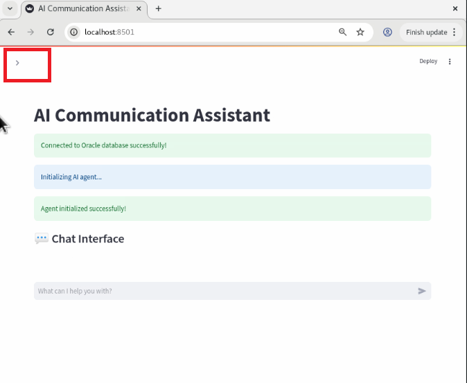
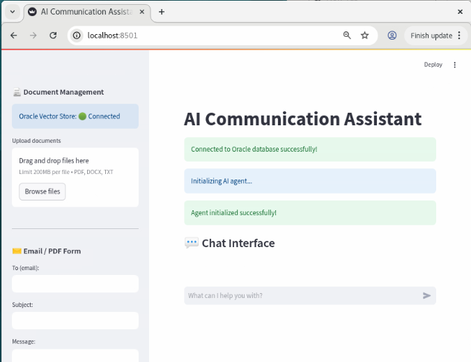
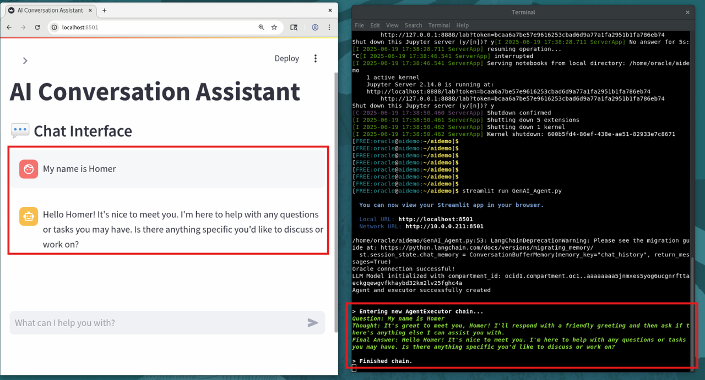
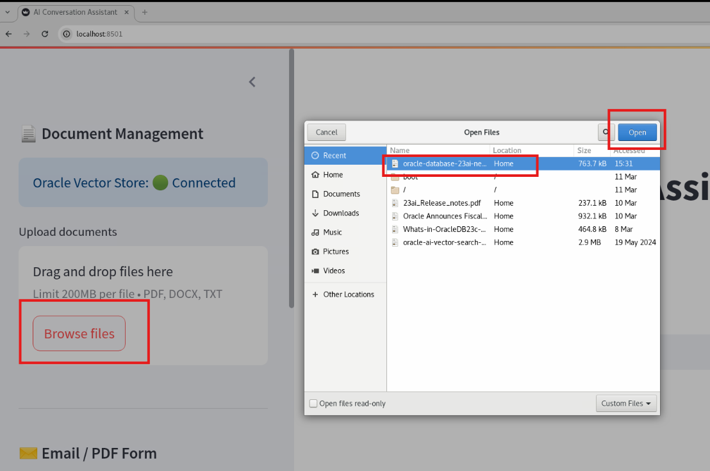
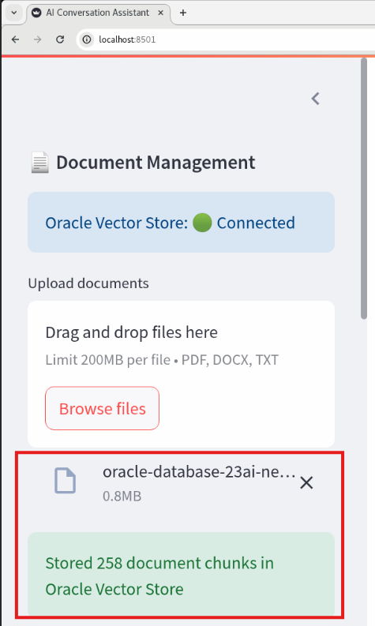
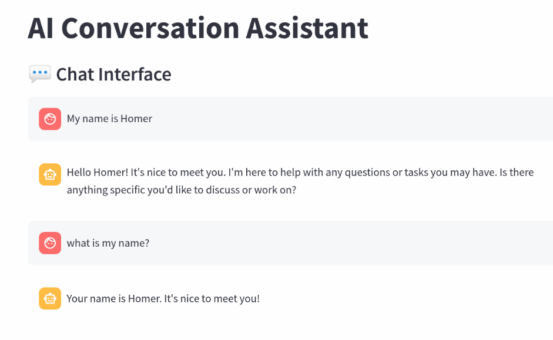
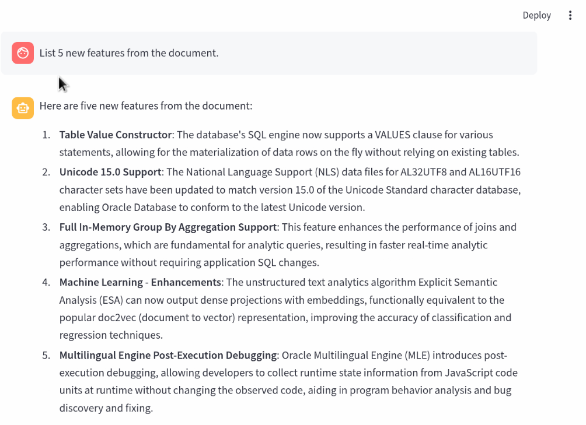
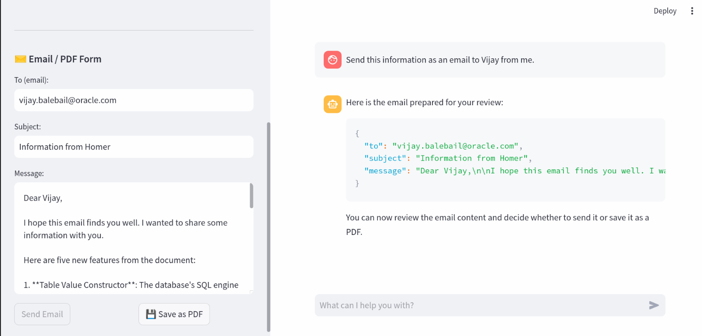

# Lab 3: Run an Interactive Agentic Application

## Introduction

Run and test the application. It features a GUI front end that accepts user questions. The agent processes the input using all available tools, guided by its initialization role defined in the prompt template. It interacts with the specified LLM to generate the most accurate and relevant response.

> Important Note: To keep the resource usage with in limit we have restricted the agent max iteration to 15.  In case the question times out or gives an error stating max iterations reached, please re-submit the same question again or try to rephrase the question.

Estimated Time: 15 min

### Objectives

To demonstrate the ability of AI agents to do RAG search and access relational data to generate answers and interface with external tools (create PDF ).

### Prerequisites

* VM environment provided in this lab running Oracle Database 23ai

## Task 1: Run application

1. From the terminal, go to directory

    ```bash
    cd /home/oracle/aidemo
    ```

2. Run the Agentic application

    ```bash
    streamlit run GenAI_Agent.py
    ```

3. A browser will launch. If not, open a browser from the Activities menu and select Firefox or Chrome.

4. Enter **localhost:8501** for the URL in the browser.

    Your application will now be running.  The UI will look like the figure below.  Click on the **">"** icon on the upper left corner as highlighted with red box.  This would expand the section to display file loading options and email display fields

    

    The expanded UI would look like below

    

5. Checking Agent thought process and actions
    We can observe the agent's thought process and actions in real time. To do this, resize your browser window and place it next to the terminal window. When you perform an action in the application, you’ll be able to see the detailed reasoning and steps the agent is taking in the terminal.
    
    Refer the screen shot below.
    
    


## Task 2: Interacting with the Agentic Application

Try the following steps question and hit return. In a few seconds the LLM will answer the question and respond with context stored in Oracle Database 23ai.

**Step 1: Load a pdf file "23ai new features guide"**

Click on the **Browse files** button and load a PDF document.

After a few seconds the PDF document will be loaded, transformed to text, chunked, and vectorized into Oracle Database 23ai.

A prompt area will now appear for you to ask a question about your PDF.  You can type in your own question or use the suggestions listed below.



Note: In the Lab 2, we used a table with pre-loaded vector data for "Oracle 23ai new feature guide" document. In this demo we are actually reading the document, chunking and vectorized it in a different table.

You should see the confirmation of file uploaded as shown in figure below.



**Step 2: To test context Memory feature**

Tell LLM your name i.e., "My name is Homer Simpson".  Then check if application remembers your name by asking i.e., "What is my name?"



**Step 3: Do a RAG Search on document uploaded**

Ask a question to query the document i.e.,  "List 5 features of Oracle 23ai from the document"
Note: Agentic is prompted to RAG search only if ask search within document.



**Step 4: Send the information as email**

To test the email creation agent  ask question to send earlier information to Vijay as email from your side i.e.,  "Send the information as email to Vijay from me"

Check the email form on the left side for the result



Proceed to test other PDF files provided on VM and ask more question as per your imagination. Few suggested question are below

**Suggestions**

For the Oracle Database 23ai documentation:
* What are the new features in Oracle Database 23ai
* Tell me more about AI Vector Search
* Tell me more about new enhancement to SQL
* Tell me more about JSON Relational Duality
* List 5 new features of Oracle Database 23ai

For the Oracle Fiscal Year 2024 Quarter 2 Financial Results document:
* Summarize the Oracle 2024 Quarter 2 financial results
* What did Larry say in the Oracle Fiscal Year 2024 Quarter 2 financial results

## Task 3: Check the Code for the application (Optional) 

Now check out the application code using the UI. From a terminal window type:

```bash
cd /home/oracle/aidemo
more GenAI_Agent.py
```

Note the additional imported libraries and **st** objects for Streamlit.
But essentially the code is the same AI Agentic application that we studied in Lab 2.

### Conclusion

Now it’s your turn! Try experimenting with different transformers on various data sources—whether it’s video, audio, text, or more. All of them can be embedded as vectors within Oracle Database 23ai.

By leveraging AI Vector Search in Oracle Database 23ai, you can build agentic AI applications enriched with meaningful context—without needing to retrain the LLM. The relevant context is stored, searched, and retrieved directly from Oracle Database 23ai, then passed to the LLM to generate accurate, up-to-date, and targeted responses to your prompts.

Enterprises can use RAG (Retrieval-Augmented Generation) with AI Vector Search and an LLM to securely answer critical business questions or generate content across a wide range of use cases using private, internal business data.

**Completed. Thanks for running the lab.**

## Acknowledgements

* **Authors** - Vijay Balebail, Rajeev Rumale
* **Contributors** - Milton Wan, Doug Hood
* **Last Updated By/Date** - Rajeev Rumale, June 2025
