<if type="Cohere">

# Lab 2: Using Oracle OCI GenerativeAI Cohere for Vector Embedding Models

## Introduction

In this lab we will learn how to use the embedding models from the Oracle OCI GenAI Cohere service with vectors stored in Oracle Database 23ai. 

------------
Estimated Time: 25 minutes

### Objectives


In this lab, you will see the following Vector operations using Java: 
* Task 1: Preparing the Environment
* Task 2: Perform Similarity Search using Oracle OCI Generative Ai Cohere embedding
* Task 3: Explore The Database Structure
* Task 4: Changing embedding models


### Prerequisites 

This lab assumes you have:
* An Oracle Cloud Infrastructure account
* Oracle Database 23ai is installed and running 
* Java 11 or newer installed
* Maven 3.9.6 or newer installed


## Task 1: Preparing The Environment

The first step in order to properly run our code, we will verify we are in the proper directory. Within the Operating System user Oracle, go into the ai-vector-search-oracle-jdbc-examples-main folder. This shall be the root directory for our project.

```
<copy>
cd ai-vector-search-oracle-jdbc-examples-main/
</copy>
```

Now within the root folders directory, we want to make sure our code is able to compile and is executable. For that we will run maven clean install command.

```
<copy>
mvn clean install
</copy>
```

## Task 2: Perform Similarity Search using Oracle OCI GenAi Cohere

In this lab we will see how to perform a similarity search with the Cohere embedding models using Java. Our table which has been provided within the **`Schema.java`** connects to the Oracle database, drops and creates a table called MY_DATA. The program then inserts 150 rows of sample data. We will vectorize our search phrase with the embedding model provided by Cohere from the OCI Generative AI service. The search phrase is entered in the console by the user, vectorized and then used to search against the vectors in the database.

1. While logged into your Operating System as the oracle user, within the ai-vector-search-oracle-jdbc-examples-main folder we shall be running our CohereSimilaritySearch.java file. This will run an interactive similarity search using Oracle Database and the CohereModel for generating vector embeddings. The **main** method in this class calls the **run** method of the **SimilaritySearch** class, passing the singleton instance of **CohereModel** as an argument. This setup leverages the OCI Generative AI service to generate embeddings and execute similarity searches.


    

    ```
    <copy>
        /**-----------------------------------------------------------------------------
    Copyright (c) 2023, Oracle and/or its affiliates.

    This software is dual-licensed to you under the Universal Permissive License
    (UPL) 1.0 as shown at https://oss.oracle.com/licenses/upl and Apache License
    2.0 as shown at http://www.apache.org/licenses/LICENSE-2.0. You may choose
    either license.

    If you elect to accept the software under the Apache License, Version 2.0,
    the following applies:

    Licensed under the Apache License, Version 2.0 (the "License");
    you may not use this file except in compliance with the License.
    You may obtain a copy of the License at

        https://www.apache.org/licenses/LICENSE-2.0

      Unless required by applicable law or agreed to in writing, software
    distributed under the License is distributed on an "AS IS" BASIS,
    WITHOUT WARRANTIES OR CONDITIONS OF ANY KIND, either express or implied.
    See the License for the specific language governing permissions and
    limitations under the License.
    -----------------------------------------------------------------------------
    */
    package oracle.jdbc.vector.examples.cohere;

    import oracle.jdbc.vector.examples.SimilaritySearch;

    /**
    * Runs an interactive similarity search using Oracle Database and
    * the OCI Generative AI Service
    * must be configured to run this example.
    */
    public class CohereSimilaritySearch {

      public static void main(String[] args) {
        SimilaritySearch.run(CohereModel.INSTANCE);
      }
    }
    </copy>
    ```

    This is the CohereSimilaritySearch Java file.
</br>

  In addition, here is the CohereModel Java file
  
  


    ```
    <copy>
      /**-----------------------------------------------------------------------------
 Copyright (c) 2023, Oracle and/or its affiliates.

 This software is dual-licensed to you under the Universal Permissive License
 (UPL) 1.0 as shown at https://oss.oracle.com/licenses/upl and Apache License
 2.0 as shown at http://www.apache.org/licenses/LICENSE-2.0. You may choose
 either license.

 If you elect to accept the software under the Apache License, Version 2.0,
 the following applies:

 Licensed under the Apache License, Version 2.0 (the "License");
 you may not use this file except in compliance with the License.
 You may obtain a copy of the License at

    https://www.apache.org/licenses/LICENSE-2.0

  Unless required by applicable law or agreed to in writing, software
 distributed under the License is distributed on an "AS IS" BASIS,
 WITHOUT WARRANTIES OR CONDITIONS OF ANY KIND, either express or implied.
 See the License for the specific language governing permissions and
 limitations under the License.
 -----------------------------------------------------------------------------
*/

package oracle.jdbc.vector.examples.cohere;

//import necessary OCI and Java utility classes
import com.oracle.bmc.ClientConfiguration;
import com.oracle.bmc.ConfigFileReader;
import com.oracle.bmc.auth.AuthenticationDetailsProvider;
import com.oracle.bmc.auth.ConfigFileAuthenticationDetailsProvider;
import com.oracle.bmc.generativeaiinference.GenerativeAiInferenceClient;
import com.oracle.bmc.generativeaiinference.model.EmbedTextDetails;
import com.oracle.bmc.generativeaiinference.model.OnDemandServingMode;
import com.oracle.bmc.generativeaiinference.requests.EmbedTextRequest;
import com.oracle.bmc.generativeaiinference.responses.EmbedTextResponse;
import oracle.jdbc.vector.examples.Config;
import oracle.jdbc.vector.examples.Model;

import java.util.Arrays;
import java.util.List;
import java.util.stream.Collectors;

/**
 * A model which is accessed through the OCI Generative AI Service.
 * This class implements the Model interface, providing a specific implementation embedding text using OCI's services.
 */
public class CohereModel implements Model {
    //Singleton instance of the model
    public static final Model INSTANCE = new CohereModel();
    private final AuthenticationDetailsProvider authentication;

    //Constructor for the CohereModel class
    public CohereModel() {
        try {
              //Initialize the authentication provider using OCI configuration file
             authentication = new ConfigFileAuthenticationDetailsProvider(
                ConfigFileReader.parse(Config.get("OCI_CONFIG_LOCATION"), Config.get("OCI_CONFIG_PROFILE"))
            );

        } catch (Exception e) {
            throw new RuntimeException("Failed to initialize the OCI Generative AI client", e);
        }
    }

    //Method to create and configure GenerativeAiinferenceClient
    private GenerativeAiInferenceClient createClient(){
        // Set up the client configuration with a custom read timeout
            ClientConfiguration clientConfiguration = ClientConfiguration.builder()
                    .readTimeoutMillis(240000) //sets the read timeout to 240 seconds
                    .build();
        // Create a client instance for generative Ai inference with the configured provider and client configuration
        GenerativeAiInferenceClient generativeAiInferenceClient = new GenerativeAiInferenceClient(authentication, clientConfiguration);    
         
        generativeAiInferenceClient.setEndpoint(Config.get("OCI_ENDPOINT"));
        return generativeAiInferenceClient;
    }

    @Override
    public float[][] embed(String[] texts) {
        //use try-with-response to ensure the client is closed after use
        try (GenerativeAiInferenceClient client = createClient()) {
            List<String> inputs = Arrays.asList(texts);
            float[][] embeddings = new float[inputs.size()][];

            // Process in batches of up to 96 items
            int batchSize = 96;
            for (int start = 0; start < inputs.size(); start += batchSize) {
                int end = Math.min(inputs.size(), start + batchSize);
                List<String> batchInputs = inputs.subList(start, end);
                System.out.print(start);
                
                //Create EmbedTextDetails for the current batch
                EmbedTextDetails embedTextDetails = EmbedTextDetails.builder()
                        .servingMode(OnDemandServingMode.builder().modelId("cohere.embed-english-v3.0").build())
                        .compartmentId(Config.get("OCI_COMPARTMENT_ID"))
                        .inputs(batchInputs)
                        .build();

                //Create the EmbedTextRequest for the current batch
                EmbedTextRequest request = EmbedTextRequest.builder()
                        .embedTextDetails(embedTextDetails)
                        .build();

                // Get the response for the current batch
                EmbedTextResponse response = client.embedText(request);
                float[][] batchEmbeddings = parseResponse(response);
                
                // Combine batch embeddings into the main array
                System.arraycopy(batchEmbeddings, 0, embeddings, start, batchEmbeddings.length);
            }
            return embeddings;
        }
    }

    //method to parse the EmbedTextResponse and convert it to a float[][] array
    private float[][] parseResponse(EmbedTextResponse response) {
        List<List<Float>> embeddingsList = response.getEmbedTextResult().getEmbeddings();
        float[][] embeddings = new float[embeddingsList.size()][];
        for (int i = 0; i < embeddingsList.size(); i++) {
            List<Float> embeddingList = embeddingsList.get(i);
            embeddings[i] = new float[embeddingList.size()];
          
            for (int j = 0; j < embeddingList.size(); j++) {
               embeddings[i][j] = embeddingList.get(j);    
            }
          }
        // Placeholder for the response parsing logic
        // This should convert the response to the required float[][] format
        // Assume response parsing is implemented correctly here
        return embeddings;
    }
}
    </copy>
    ```

  Now we shall run our program from the main root folder.
    ```
    <copy>
    mvn exec:java -pl ojdbc-vector-examples-cohere -Dexec.mainClass="oracle.jdbc.vector.examples.cohere.CohereSimilaritySearch"
    </copy>
    ```

    Once the program has run, you will be asked to create a Schema, write "Y" and press enter:

    

    You will now be within the SimilaritySearch interface.

2. For our first example, let's try the word "cars" at the prompt.</br>
You should see something similar to : </br>

    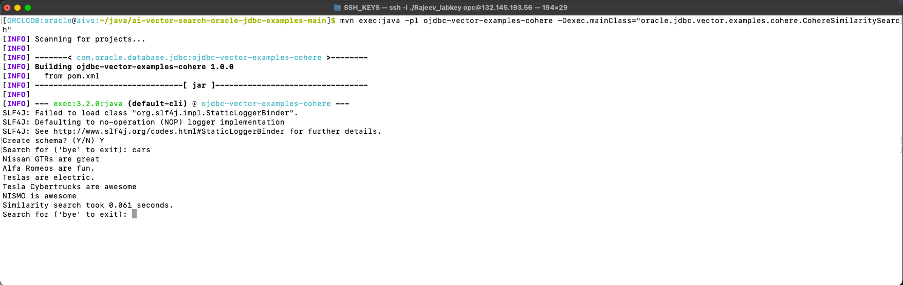

    It's possible that you will see times different to ours, as the time includes the network round trip REST call. With that being the case, we can see that the first operation is to vectorize the phrase, which in this case is "cars" and it took 0.061 seconds. <br>

    - Next we see that similarity search took 0.061 seconds to locate 5 related entries to the word "cars".
    - The 5 rows returned are the 5 most semantically simillar to our phrase cars from our sample data in MY_DATA table
    - The results themselves look like good results as all 5 of the factoids are in fact accurate with the phrase "cars".
    </br>

  3. Next we can type in the word "cats" </br>
  You should see something similar to :
  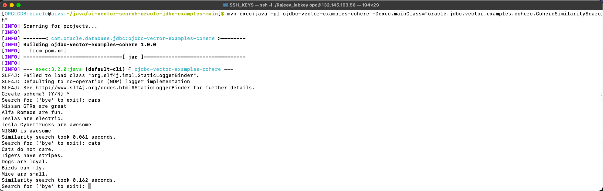

    - This time, the output does not appear to have the same level of accuracy as "Birds can fly" has nothing really to do with cats. Tigers are in the cat family so one can see the similarity there. As for "Dogs are loyal" and "Mice are small" are usally animals which have comman similaties with cats, as cats hunt mice and Cats and dogs are both popular pets. 
    - The entire point about Similarity Search is that it is not necessaritly exactly correct, as it is best to match given the available data using the given embedding model. The embedding model is trained using information avilable from the internet and other publicly sourced information.

4. We can also try another search phrase for example "fruit" or even "NY".

    We should see something similar to : </br>
    

    - Both of these results were on target and illustrate the power of similarity search. The queries are very different to a traditional relational query where we are looking for an exact match, but in both of these instances neither of the terms "fruit" or "NY" were in our table. Similarity search is able to find a correlation. 
    - For "fruit", we see that Eggs are not fruits but they are a food. All the other returned searches are in fact fruits.
    - For "NY", you can see that Buffalo, a city within NY state is selected, not just the boroughs within NYC.

 5. Next we should search for "Borough".
    You should see something similar to :
    

    - This phrase directs our similarity search to information related to New York City - and you should notice that now, we don't see "Buffalo". You may also notice that we see four of the five boroughs: "Bronx" , "Brooklyn", "Manhattan" and "Staten Island". We see "Harlem" which is a neighborhood within the borough of Manhattan, it is not a borough itself.

  6. For another experiment, we can enter the word "Bombay". You should see something similar to this :

    
    - The word "Bombay" does not appear in our data set, but the results related to Mumbai are correct because "Bombay" is the former name for "Mumbai", and as such there is a strong correlation between the two names for the same geographic location. 

    Remember, similarity search works on the basis of the trained data from which the embedding models use. Trained embedding models use text sourced from the internet and it is very likely that there is information that includes both the names "Bombay" and "Mumbai" in relation to the same place.


  7. Now to see what happens when there is no correlation in the terms, let's try something completely random.

      Enter the phrase  phrase **"random stuff"** - you should see :

      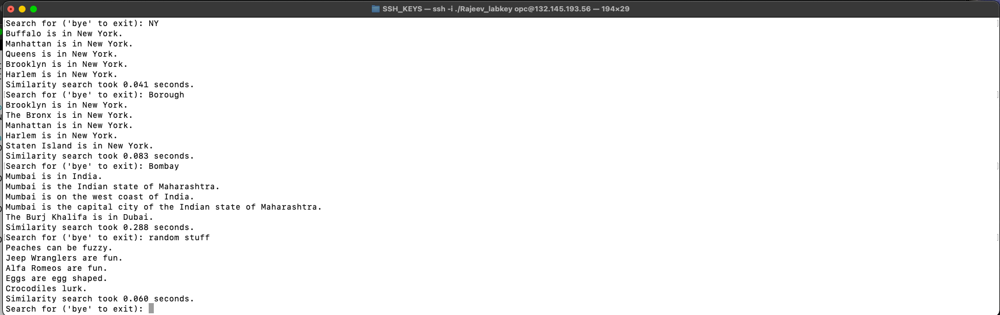

      The first thing you may notice is that there is little or no correlation between the terms returned and the phrase we entered. This is also likely influenced by the small data-set or number of rows in the MY\_DATA table.

      To exit the program, type "bye".
      
    Once it has completed in exiting, we will proceed to view the contents of our database.


## Task 3: Explore The Database Structure
Now that we have ran our similarity search, we can take a quick look at the Vector column: V in the MY\_DATA table in the Oracle database. 

  i. In order see our database looks like, let's log into sqlplus:

  ```
    <copy>
    sqlplus vector/vector@orclpdb1
    </copy>
  ```

  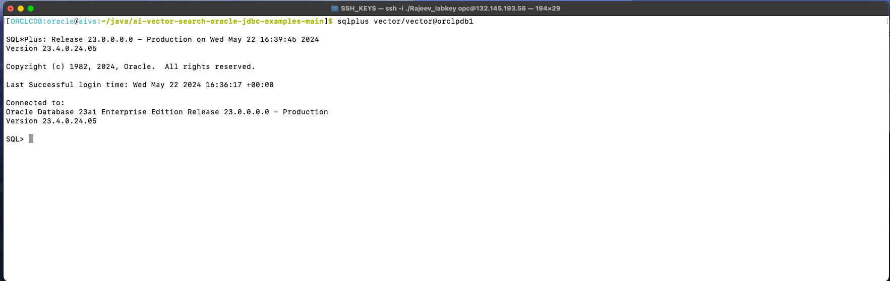

  ii. We can now query the MY\_DATA table to verify that all 150 rows have been updated.

  ```
    <copy>
    select count(*) from MY_DATA where V is not null;
    </copy>
  ```

  

  iii. We can see the information within our table by writing 
  
  ```
  <copy>
  select info from my_data where V is not null;
  </copy>
  ```

   
  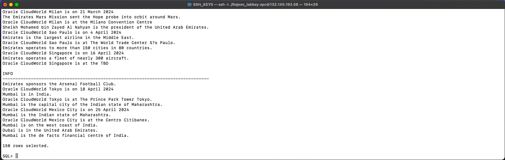

  iv. We can also query the vector column: V in the MY_DATA table to see what the vectors and dimensions look like.

  ```
    <copy>
    select V from MY_DATA ; 
    </copy>
  ```

  You should see: 

  
  
  
  What you are seeing is the semantic representation of the data stored in the corresponding row of the INFO column.


  To be honest it is difficult to see a change to our Vectors when we look at the raw data. An alternative query we can try is to see if the length of the V column has changed. We can run the following query to check this-

  iv. We can also query the length of the vectors stored in the V column by running the following query:

  ```
    <copy>
    select max(length(V)) from MY_DATA ;
    </copy>
  ```

  You should see something similar to this:

  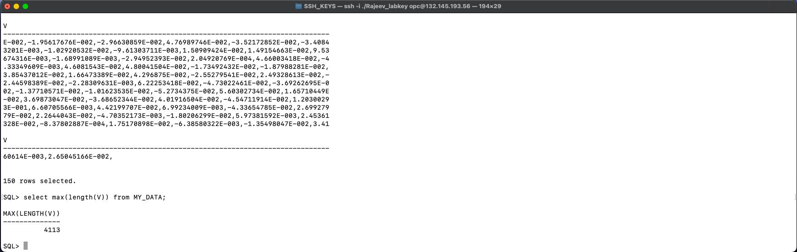 </br>

  You should notice that that length of the contents in the vector column: V is 4113. 

  This is approximately: ((1024 from Cohere Embed English v3.0 dimensions) x (4 bytes for each float dimension)) + (header overhead) 
  </br>

  To summarize what we've just done, the **`CohereSimilaritySearch`** program calls will run an interactive similarity search using Oracle Database and the **`CohereModel`** for generating vector embeddings. The main method in this class calls the run method of the SimilaritySearch class, passing the singleton instance of CohereModel as an argument. This setup leverages the OCI Generative AI service to generate embeddings and execute similarity searches. The CohereModel which is used implements the Model interface to generate the vector embedding. The class is initialized with an OCI client configured through client configuration and authentication details read from the configuration.properties file. The embed method processes input text in batches, sends requests to the OCI Generative AI Service to generate embeddings, and combines the results into a single 2D float array. The parseResponse method converts the embedding results from the service response into the required float array format for further use. The data stored within the `MY_DATA` table, is retrieved from the INFO column, and vectorizes the "factoid" for each of the 150 rows. We are storing the vectorized data as a vector in the column called: V. You will also notice that we are using `cohere.embed-english-v3.0` as the embedding model for this operation, both to vectorize our data when we populated the `MY_DATA` table, as well as when we performed our similarity searches. 

Next, let's show the steps if the user wants to change the Embedding Model.

## Task 4: Changing the Embedding Models
In the next step we will show the user what to do if they want to switch the embedding model so they can see the differences in similarity search results.

We will continue to use Cohere embedding through OCI Generative AI Service, so the modifications required are minor.

1. In order to do this we will need to edit a few of files:
    The first file we will be making changes to will be our config.properties file, located in our root folder ai-vector-search-oracle-jdbc-examples-main. Open the file using your editor of choice, we will be using nano. 

    ```
    <copy>
    nano config.properties
    </copy>
    ``` 

     

    We will scroll down to the cohere section and change the listed model from  **'cohere.embed-english-v3.0'** to the user's desired new model. Insert the model of your choice, for example you can select **'cohere.*embed-multilingual-v3.0'**.

    
    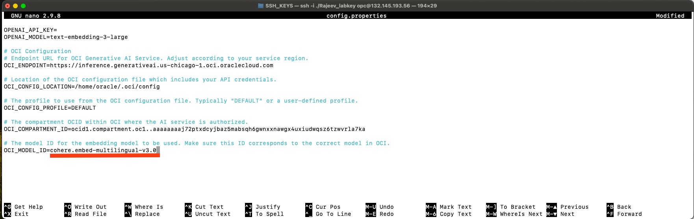

2. After making the change here, we will now go into the cohere folder, located in
**`/ai-vector-search-oracle-jdbc-examples-main/ojdbc-vector-examples-cohere/src/main/java/oracle/jdbc/vector/examples/cohere`**.
    
    ```
    ai-vector-search-oracle-jdbc-examples-main
    └── ojdbc-vector-examples-cohere
        └── src
            └── main
                └── java
                    └── oracle
                        └── jdbc
                            └── vector
                                └── examples
                                    └── cohere
    ```

    The file we shall make a correction to shall be the `CohereModel.java`.

    Scroll down until you see this portion of the code:

    ```
    // Process in batches of up to 96 items
        int batchSize = 96;
        for (int start = 0; start < inputs.size(); start += batchSize) {
            int end = Math.min(inputs.size(), start + batchSize);
            List<String> batchInputs = inputs.subList(start, end);
            
            EmbedTextDetails embedTextDetails = EmbedTextDetails.builder()
                    .servingMode(OnDemandServingMode.builder().modelId("cohere.embed-english-v3.0").build())
                    .compartmentId(Config.get("OCI_COMPARTMENT_ID"))
                    .inputs(batchInputs)
                    .build();

            EmbedTextRequest request = EmbedTextRequest.builder()
                    .embedTextDetails(embedTextDetails)
                    .build();
    ```


    Find line of code that reads:
    **".servingMode(OnDemandServingMode.builder().modelId("cohere.embed-english-v3.0").build())"**

    You will change that from **'cohere.embed-english-v3.0'** to **'cohere.embed-multilingual-v3.0'.**

    

     Save and exit the nano editor.

<<<<<<< HEAD
3. Return to the root folder ai-vector-search-oracle-jdbc-examples-main. Once there run the mvn clean install since we made changes to the files.
    Run mvn clean install since we made configuration changes.
=======
3. Return to the root folder ai-vector-search-oracle-jdbc-examples-main. Once there run the mvn clean install -o since we made changes to the files. 
    Run mvn clean install -o since we made configuration changes.
>>>>>>> 4c6bfba (changes to desktop folder)
      ```
        <copy>
        mvn clean install
        </copy>
      ```

4. Now that it has finished building correctly, feel free to re run your CohereSimilaritySearch to see the differences in speed or results.
  You'll run the program with the same command as before :

    ```
    <copy>
    mvn exec:java -pl ojdbc-vector-examples-cohere -Dexec.mainClass="oracle.jdbc.vector.examples.cohere.CohereSimilaritySearch"
    </copy>
    ```

## Summary

Congratulations you've completed the lab!

You have seen how easy it is to use Oracle OCI Generative AI Cohere with JDBC and Oracle Database 23ai with Similarity Search. You are ready to use this on your own application.


## Learn More
* [Oracle Database 23ai Release Notes](https://docs.oracle.com/en/database/oracle/oracle-database/23/rnrdm/)
* [Oracle AI Vector Search Users Guide](https://docs.oracle.com/en/database/oracle/oracle-database/23/vecse/)
* [Oracle Documentation](http://docs.oracle.com)


## Acknowledgements
* **Author** - Francis Regalado, Cloud Solutions Engineer
* **Last Updated By/Date** - Francis Regalado, May 2024

</if>

<if type="OpenAi">

# Lab 3: Using OpenAI Vector Embedding Models With JDBC

### **This module CANNOT run in The Live Labs platform and is for informational purposes only. This sample code is provided so that a student can run this example in their own environment.**

## Introduction

In this lab we will learn how to use the OpenAI embedding models and JDBC with Oracle Database 23ai. OpenAI is a commercial product and as such requires a licensed key to use their embedding models.


### **Objectives**

In this lab, you will see the following Vector operations using Java:
* Task 1: Preparing The Environment
* Task 2: Perform Similarity Search Using OpenAi
* Task 3: Explore The Database Structure
* Task 4: Changing Embedding Models
* Task 5: Explore The Updated Database Structure

### **Prerequisites** 

This lab assumes you have:
* An Oracle Cloud Infrastructure account
* Your workshop environment is configured (Completed Lab 0)
* An API key for OpenAI (Can be a free trial key)
* Oracle Database 23ai is installed and running 
* Java 11 or newer installed
* Maven 3.9.6 or newer installed


## Task 1: Preparing The Environment
The first step in order to properly run our code, we will verify we are in the proper directory. Within the Operating System user oracle, go into the ai-vector-search-oracle-jdbc-examples-main folder. This shall be the root directory for our project.

```
<copy>
cd ai-vector-search-oracle-jdbc-examples-main/
</copy>
```

Now within the root folders directory, we want to make sure our code is able to compile and is executable. For that we will run maven clean install command.

```
<copy>
mvn clean install
</copy>
```

Everything should compile without an issue.

## Task 2: Perform Similarity Search using OpenAi

In this lab we will see how to perform a similarity search with the OpenAI embedding models using Java. Our table which has been provided within the Schema.java connects to the Oracle database, dops and creates a table called MY_DATA. The program then inserts 150 rows of sample data. We will vectorize our search phrase with the embedding model provided by OpenAI. The search phrase is entered in the console by the user, vectorized and then used to search against the vectors in the database.

Running the `OpenAiSimilaritySearch.java` performs and interactive similarity search using Oracle Database combined with the defined OpenAI model. The main method in this class calls a static run method from the 'SimilaritySearch' class, passing the singleton instance of `OpenAiModel` as an argument.

Within the ojdbc-vector-examples-openai, there are 2 files we shall be addressing:  **`OpenAiModel.java`** and **`OpenAiSimilaritySearch.java`**. Once we run our OpenAiSimilaritySearch program and as perform our searches, we connect to OpenAi to vectorize our search phrase with the same embedding model. Let's take a look at how our files look.

### **OpenAiModel.java** 
</b>

1. Let's begin with viewing the contents of the Java file **`OpenAiModel.java`**

    
</br>

    ```
    package oracle.jdbc.vector.examples.openai;

    import com.theokanning.openai.OpenAiHttpException;
    import com.theokanning.openai.embedding.Embedding;
    import com.theokanning.openai.embedding.EmbeddingRequest;
    import oracle.jdbc.vector.examples.Config;
    import oracle.jdbc.vector.examples.Model;
    import com.theokanning.openai.service.OpenAiService;

    import java.util.Arrays;
    import java.util.List;

    /**
    * A model implemented with OpenAI. This implementation uses the community
    * maintained Java client for OpenAI:
    * <a href="https://github.com/TheoKanning/openai-java/tree/main">
    * OpenAI-Java
    * </a>
    */
    final class OpenAiModel implements Model {


      /** Singleton instance of this class */
      static final OpenAiModel INSTANCE = new OpenAiModel();
      private OpenAiModel() { }

      private static final OpenAiService SERVICE =
        new OpenAiService(Config.get("OPENAI_API_KEY"));

      @Override
      public float[][] embed(String[] sentences) {
        EmbeddingRequest request =
          EmbeddingRequest.builder()
            .input(Arrays.asList(sentences))
            .model(Config.getOrDefault("OPENAI_MODEL", "text-embedding-3-small"))
            .build();

        do {
          try {
            return SERVICE.createEmbeddings(request)
              .getData()
              .stream()
              .map(Embedding::getEmbedding)
              .map(OpenAiModel::toFloatArray)
              .toArray(float[][]::new);
          }
          catch (OpenAiHttpException httpException) {
            if (!"rate_limit_exceeded".equals(httpException.code))
              throw httpException;

            // A "rate_limit_exceeded" error means that too many requests have been
            // sent within a period of time. Recover from this by waiting.
            System.out.println(httpException.getMessage());
            try {
              for (int i = 20; i >= 0; i--) {
                System.out.print("Waiting " + i + " seconds...\r");
                Thread.sleep(1_000);
              }
            }
            catch (InterruptedException interruptedException) {
              System.out.println("Wait interrupted");
            }
          }
        } while (true);

      }

      private static float[] toFloatArray(List<Double> doubleList) {
        float[] floatArray = new float[doubleList.size()];

        for (int i = 0; i < floatArray.length; i++)
          floatArray[i] = doubleList.get(i).floatValue();

        return floatArray;
      }
    }
    ```

    The **'OpenAiModel.java'** is class that implements the **Model** interface for generating vector embeddings of sentences using OpenAi's embedding service. The implementation uses the community maintained Java Client for OpenAI. It defines a singleton `OpenAiModel` class that implements the `Model` interface and provides a method to embed sentences using OpenAi's embedding service. 
</br>

    

    Next,it uses the `OpenAiService` to send embedding requests via the OpenAI API with the specified model, which is configurable within the `Config` class and config.proferties file. Once it has access the key, it selects which embedding model to run, this this case we first defined "text-embedding-3-small". </br>

    

    Now it will create the embedding. If it encounters a limit, it will throw an exception. In this case, we defined a rate limit exception if the user is using a free api key. The system will wait a specified 20 seconds.The `embed` method processes the response to convert the embeddings from a list of `Double` to a 2D array of `float`. 


    This concludes the `OpenAiModel.java` program. </br>
</br>

### **OpenAiSimilaritySearch.java** </br>

2. Now we will look at the next java file **`OpenAiSimilaritySearch.java`**. 

    ```
    package oracle.jdbc.vector.examples.openai;

    import oracle.jdbc.vector.examples.SimilaritySearch;

    /**
    * Runs an interactive similarity search using Oracle Database and
    * OpenAiModel OpenAI
    */
    public class OpenAiSimilaritySearch {

      public static void main(String[] args) {
        SimilaritySearch.run(OpenAiModel.INSTANCE);
      }

    }
    ```

     

    This is the Java code which we shall be running from the main root directory folder. The Java code defines a class **`OpenAiSimilaritySearch`** that performs an interactive similarity search using Oracle Database combined with an **`OpenAiModel`** for generating vector embeddings. The **`main`** method in this class calls the **`run`** method from the **`SimilaritySearch`** class, passing the singleton instance of **`OpenAiModel`** as an argument.

    In order to execute this program, we shall run:

    ```
    <copy>
    mvn exec:java -pl ojdbc-vector-examples-openai -Dexec.mainClass="oracle.jdbc.vector.examples.openai.OpenAiSimilaritySearch"
    </copy>
    ```
    Once you run the similarity search Java program, the first thing you shall see is:
       

3. For our first example let's enter the word "cars". This is the same phrase we tested with other models,so you'll know what to expect. As expected, these results should be the conceptually similar.
</br>

  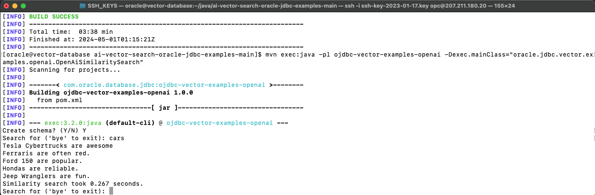

  Next let's try the phrase "cats" and see what our results are.

    

    Looking at the query output, not all the results are directly related to our search term: "cats", being that four out of the five rows return a member of the cat family, while "crocodile" is the outlier. One could argue that there is a minor correlation as all 5 rows are animal associations. This is not too bad considering our relatively small number of 150 entries.


    If we try a more general term like "animals" we should see the following:

    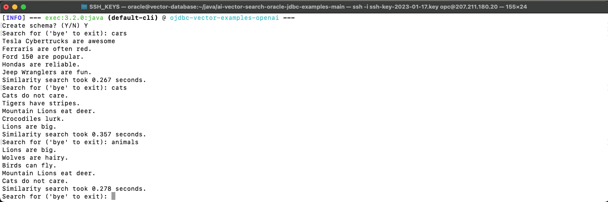

    All 5 entries are correct as they contain an animal in the results.

    Let's try our two queries related to New York: </br>
    The first shall be "NY" and then "boroughs"

    

    The results for "NY" are related to places located in the state of "New York". You see Buffalo is a city in New York State and the others are boroughs within New York City. In the second search of Borough, it's not as accurate. Although the first 4 results are actual boroughs located in New York City, "Boston" is not even in the state of New York. It is important to remember that similarity search can respond with results that vary depending on the embedding model in use.

    Another intereting query to test is the phrase "New Zealand".

    

    The top 4 results we see when using OpenAi and the "text-embedding-3-small" embedding model are related to the place "New Zealand" ("Kiwi" is slang for a person from New Zealand, and Kiwi birds and Kiwi fruit are native to New Zealand). However the last entry about "Queens" seems very random, though it is a geographic location and the word "New" appears in both phrases, so one could argue there is a slight correlation here.

    Now that our data has been vectorize, we should take a look in the the Oracle database to see the updates made to the *MY\_DATA* table.

    Let us exit our Similarity Search program by typing "bye".

    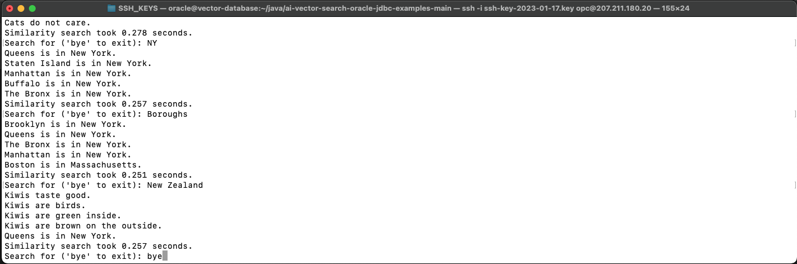


* Task 3: Explore The Database Structure

Now that we have ran our similarity search, we can take a quick look at the Vector column: V in the MY\_DATA table in the Oracle database. 

  i. In order see what our database looks like, let's log into sqlplus:

    ```
    <copy>
    sqlplus vector/vector@FREEPDB1
    </copy>
    ```

    

    ii. We can now query the MY\_DATA table to verify that all 150 rows have been updated.

    ```
    <copy>
    select count(*) from MY_DATA where V is not null;
    </copy>
    ```
    


    iii. We can also query the vector column: V in the MY\_DATA table to see what the vectors and dimensions look like.

    ```
    <copy>
    select V from MY_DATA;
    </copy>
    ```

    
    


    What you are seeing is the semantic representation of the data stored in the corresponding row of the INFO column.
        
    iv. We can also query the length of the vectors stored in the V column by running the following query-

    ```
    <copy>
    select max(length(V)) from MY_DATA ;
    </copy>
    ```

    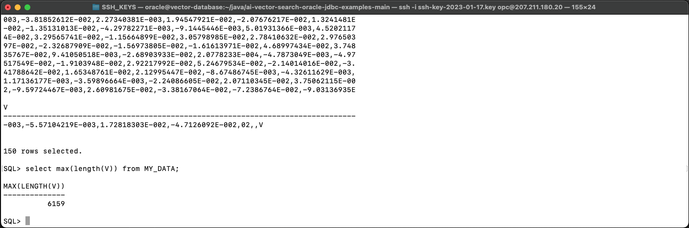

    You will notice that the length of the vector in column: **V** is 6159.

    This is approximately: ((1536 dimensions from text-embedding-3-small) x (4 bytes for each float dimension)) + (header overhead)


## Task 4: Changing Embedding Models
1. Let's experiment with changing the embedding model in our OpenAi Java program.

    In this case we are going to see what happens when we switch to a larger embedding model. We will switch from *"text-embedding-3-small"* to *"text-embedding-3-large"*. This change increases the number of dimensions for each Vector from 1536 to 3072, so hopefully the accuracy of our search results will improve. 
    </br>

      **NOTE:** There is a difference in cost when using different embedding models in OpenAI. Pricing information for the OpenAI embedding models is available here: https://openai.com/pricing
    
    Remember the embedding model used for similarity search must match in both the `config.properties` file as well as the `OpenAiModel.java` file. 

    First go to the config.properties file located in the root folder

      The first file we will be making changes to will be our config.properties file, located in our root folder ai-vector-search-oracle-jdbc-examples-main. Open the file using your editor of choice, we will be using nano. 

      ```
      <copy>
      nano config.properties
      </copy>
      ``` 

      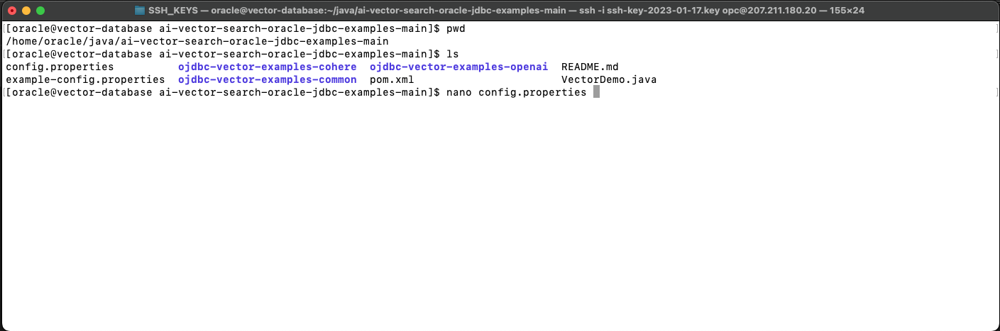

    We will scroll down to the openai section and change the listed model from **"text-embedding-3-small"** to **"text-embedding-3-large"**. </br>

      
      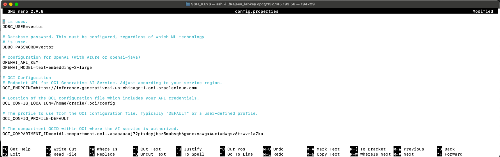

    After making the change here, we will now go into the openai folder, located in `/ai-vector-search-oracle-jdbc-examples-main/ojdbc-vector-examples-openai/src/main/java/oracle/jdbc/vector/examples/openai`.

    ```
    ai-vector-search-oracle-jdbc-examples-main
    └── ojdbc-vector-examples-openai
        └── src
            └── main
                └── java
                    └── oracle
                        └── jdbc
                            └── vector
                                └── examples
                                    └── openai
    ```

    The file we shall make a correction to shall be the `OpenAiModel.java`

    Open the file using your code editor of choice, in this case we will be choosing nano

    ```
    nano OpenAiModel.java
    ```

    


    Scroll down until you see the code section 

    ```
    <copy>
      private static final OpenAiService SERVICE =
        new OpenAiService(Config.get("OPENAI_API_KEY"));

      @Override
      public float[][] embed(String[] sentences) {
        EmbeddingRequest request =
          EmbeddingRequest.builder()
            .input(Arrays.asList(sentences))
            .model(Config.getOrDefault("OPENAI_MODEL", "text-embedding-3-small"))
            .build();
    </copy>
    ```

    replace the "text-embedding-3-small" with "text-embedding-3-large"

    Save and exit the code editor.

    
    


2. Now return to your root folder ai-vector-search-oracle-jdbc-examples-main. Run mvn clean install since we made configuration changes.

    

    ```
    <copy>
    mvn clean install
    </copy>
    ```

    

3. We're now ready rerun the Similarity Search program once again: </br> 

    ```
    <copy>
    mvn exec:java -pl ojdbc-vector-examples-openai -Dexec.mainClass="oracle.jdbc.vector.examples.openai.OpenAiSimilaritySearch"
    </copy>
    ```
    
    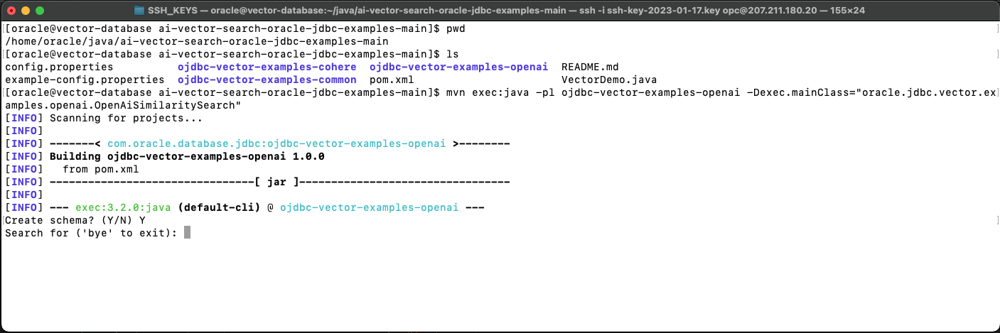


4. As a baseline let's start with our familar search terms "cars".

    You should see :
    

    The first thing you should notice it that performance with the larger model is slower than the smaller model. This is expected. Also, the results of the similarity search for the phrase "cars" is once again 100% accurate, however the phrases returned are different to those returned when we used the smaller embedding model. 

    Now let's try the phrase "cats" to asses if there are any changes : 

    


    This time we will see four of the five results include terms directly related to Cats. One could argue that while the one off phrase is not specific to cats, there is a closer correlation between cats and dogs versus cats and crocodiles. 

    Let's revisit our other combinations of phrases "NY" and "Boroughs" to see whether the embedding model makes a difference.

    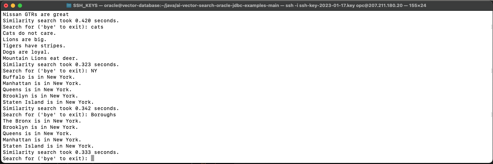

    This time, both phrases return 100% correct results. So the large model with more dimesions provides us with a better accuracy. 

    Another phrase to retry is "New Zealand".

    
    
    Once again, the top 4 results are the same as when using the OpenAI "text-embedding-3-small" embedding model. All four phrases are related to the place "New Zealand" ("Kiwi" is slang for a person from New Zealand, and *Kiwi birds* and *Kiwi fruit* are native to New Zealand). However once again the last phrase about "Staten Island" seems very out of place at first. But it is a geographic location and the word "New" appears in both phrases, so one could argue there is a slight correlation here.

    Feel free to try some other queries including repeating some of the previous examples we entered when we used other embedding models for your own comparison. 
    
## Task 5: Explore The Updated Database Structure

5. Now that we are finished, we can take a quick look at the Vector column: V in the MY\_DATA table in the Oracle database to see what the change looks like by logging into sqlplus:

    i. First exit the Similarity Search program by entering "bye" </br>  
    
    

    ```
    <copy>
    sqlplus vector/vector@FREEPDB1
    </copy>
    ```
    

    ii. Next, run the following query-

    ```
      <copy>
      select V from MY_DATA ; 
      </copy>
    ```

    

    ii. We can now query the MY\_DATA table to see what the vectors and dimensions look like

    ```
    <copy>
    select V from MY_DATA;
    </copy>
    ```

    
    

    
    To be honest it is difficult to see a change to our Vectors when we look at the raw data. An alternative query we can try is to see if the length of the V column has changed. We can run the following query to check this-

    ```
      <copy>
      select max(length(V)) from MY_DATA ;
      </copy>
    ```

    You should see something similar to this-

      

    You should notice that that length of the contents in the vector column: V is now 12303.  You may recall it was 6159 when we used the smaller model.
  
    This is approximately: ((3072 dimensions from text-embedding-3-large) x (4 bytes for each float dimension)) + (header overhead)

    To summarize, the difference between the two OpenAI embedding models we've tried, comes down to performance versus accuracy. There are times where accuracy is more important than performance and vice versa. This is a trade-off you will need to decide upon - based on your specific use-case. The least of your concerns is whether or not the Oracle database can accomodate different embedding models.  The effort to support different embedding models with Oracle Database is minimal. 

    Feel free to try some other queries including repeating some of the previous examples we entered with the "small" embedding model for your own comparison. 

## Summary

Congratulations you've completed the lab!

You have seen how easy it is to use OpenAI with JDBC and Oracle Database 23ai with Similarity Search. This concludes this lab.

## Learn More
* [Oracle Database 23ai Release Notes](https://docs.oracle.com/en/database/oracle/oracle-database/23/rnrdm/)
* [Oracle AI Vector Search Users Guide](https://docs.oracle.com/en/database/oracle/oracle-database/23/vecse/)
* [Oracle Documentation](http://docs.oracle.com)


## Acknowledgements
* **Author** - Francis Regalado, Cloud Solutions Engineer
* **Last Updated By/Date** - Francis Regalado, May 2024

</if>