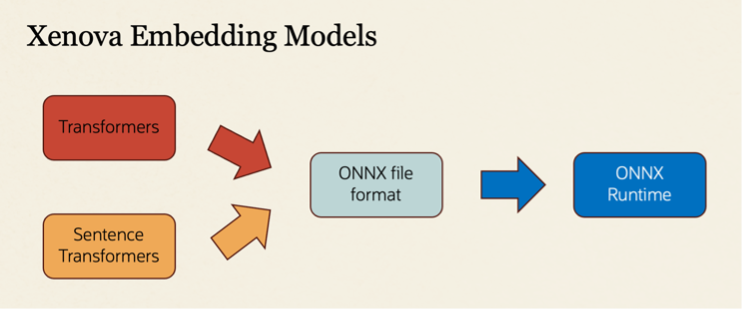

# AI Vector Search - Using Embedding Models with Node

## Introduction

In this lab you will learn how to use Oracle Vector datatypes with external embedding models. You will see how to perform binds and defines using hard-coded vectors. 

## 1. Vector Embedding Models

**What is an embedding model?**
An embedding model is a neural network which is used to create vectors which represent text, images, audio or videos.

 
 Figure 1. 

This LiveLab will focus on embedding models for *text*. Embedding models are usually pre-trained on data from the internet.  

 
 Figure 2.

Almost all vector embedding models are based on the transformer architecture as it is the current state of the art.

* Transformers [Python library]
* Sentence Transformers [Python library]
* Transformers.js [JavaScript library which looks like the Node Transformers library]

If you are an expert, then you can create your own embedding models.

Most popular Machine Learning frameworks can also use the ONNX format to convert models between frameworks. The ONNX Runtime can execute embedding models built in other frameworks.

Figure 3. ONNX Interoperability

**Some popular embedding models**

There are many different types of vector embedding models.

 
 Figure 4.

**Cohere** makes embedding models and Large Language Models (LLMs) including embed-v3.
* These embedding models are accessed via REST API calls or SDKs [eg Node.js and Python].
* You need to pay to use Cohere embedding models.
* An API key: **CO\_API\_KEY** is required to use the Cohere embedding models.

[Find more information on Cohere embedding models including how to setup and manage the CO\_API\_KEY](https://txt.cohere.com/introducing-embed-v3/)

**Hugging Face** is a repository for thousands of open source machine learning models.
* Hugging Face has many open source vector embedding models.
* These embedding models can be accessed via REST APIs, or local SDKs [Nodejs].
* The **Transformers** and **Sentence Transformers** are very popular embedding models which use local Nodejs libraries. Xenova is a different type of embedding model on Hugging Face.

**Xenova** wrappers to the ONNX Runtime [ONNX formatted](https://onnx.ai/) files.
* The ONNX fomatted files can be executed in the [ONNX Runtime](https://onnxruntime.ai/) via APIs.
* Open Neural Network Exchange (ONNX) is an open format for representing machine learning models. 
* The Xenova [Transformer.js](https://huggingface.co/docs/transformers.js/en/index) library is a JavaScript wrapper to the JavaScript API to the ONNX Runtime which is made to look similar to the Python Transformer library.

 
 Figure 5.

## 2. Embedding Model Quality 

**Embedding Model Quality**

The quality of vector embedding models can vary widely. You want high quality embeddings to enable successful similarity search and Retrieval Augmented Generation (RAG).

You need some independent / objective way to measure the quality of embedding models.

The most common ways to do this is via the *MTEB Leaderboard*. The Massive Text Embedding Benchmark (MTEB) has 8 embedding tasks, 58 datasets and 112 languages. The simplest way to use the MTEB benchmark results is to use the average (56 datasets) score. This average is out of 100 where a higher number is better. Embedding models with a higher average MTEB score tend to have better quality than embedding models with lower average MTEB scores.

* The leaders of the MTEB average scores can change every week as new or improved embedding models become available.
* This strong competition is a good thing for customers as you tend to get better quality embedding models over time.

 
*Image by: Thomas Wolter [Pixabay - Hobbyfotograf und Hobbybildbearbeiter aus Berlin](https://pixabay.com/photos/women-running-race-racing-athletes-655353/)*

Figure 6: Finding the best quality embedding model is like a never-ending relay race. Existing embedding models can be replaced by newer versions and new teams can enter the race at any time. 

## 3. Embedding Model Performance

Having the best quality embedding model is not useful if it takes too long to create the vector.

If you have millions or billions of data items to vectorize, the rate at which you vectorize your data is important. To maximize the rate of vectorization, you will tend to optimize three things:
* The amount of data as input to vectorization (fetch size)
* The amount of data that you vectorize (embedding size)
* The amount of vector data that you commit per transaction (commit size)

 

 Figure 7.

When you do a similarity search or do a RAG query, you also need to care about the latency of those operations:
* You need to create a query vector for the input data
* You will need to search for the closest vectors, usually via an vector index

Embedding models which have a large number of dimensions (eg > 1024) tend to have the best quality, but slowest performance. Embedding models which have the smallest dimensions (eg 384) tend to be the fastest, but also tend to have lower quality.

 
 Figure 8. Size vs Performance of Embedding Models

## 4. What is the best embedding model

There is no correct answer to this question as it depends on many factors:
* Do you have a corporate standard that forces you to use a specific embedding model
* Do you choose not to pay for commercial vector embeddings
* Do you need a multi-lingual embedding model
* Do you want the best quality and can afford to have reduced performance for a use case
* Do you want the best performance and can afford to have reduce quality for a use case
* Do you need a good blend of quality and performance
* Do you choose to use embedding model Y because it was recommended to you

One way to compare embedding models is quality vs performance vs popularity
* The X-axis represents performance in terms of vectors created per second
* The Y-axis represents quality in terms on MTEB average score [out of 100]
* The size of the data point represents the popularity in terms of monthly downloads

## Getting Started with this Workshop 

**Create vector table and load sample data**

For this workshop you will start by creating a table (**my\_data**) and populating it with 150 rows of data. The whole operation will be done by running a Node program and should take a around a second to run.

The table will be the basis for all vectorize operations in the labs, and you will use various embedding models, all on the same table.

For the labs to work, we will be using the following pattern:
* Choose a vector embedding model
* Vectorize your data using that embedding model
    * This updates/overwrites any existing vectors (or NULL values)
* Do similarity search using the same embedding model

 
 Figure 10. Vector workflow

There are many different embedding models. At the time of this lab creation:
* Cohere has *4* recent models used in the sample code
* Hugging Face has many. The sample code uses *25* models

**NOTE:** You *MUST* use the same embedding model to *vectorize the data* as when you *create a query vector*. The whole point of doing similarity search is to find the closest *data vectors* to the *query vector*. For this to work, you need to compare like to like:
* The vectors should have the same number of dimensions (else you will get a runtime error)
* The vectors should have the same number format
* The *data* and *query vectors* should use the same embedding model (otherwise you will get garbage results)

In this workshop you will have an opportunity to use the following vector embedding models from:
* Cohere
* Sentence Transformers from Hugging Face

This Lab utilizes tabs to switch between learning about the embedding models:

To switch between learning about Cohere and Hugging Face embedding models click on the appropiate tab. 

 
 
## Learn More

* [Oracle Database 23ai Release Notes](../docs/release_notes.pdf)
* [Oracle AI Vector Search Users Guide](../docs/oracle-ai-vector-search-users-guide_latest.pdf)
* [Oracle Documentation](http://docs.oracle.com)
* [Google Transformers Whitepaper - Attention Is All You Need](https://arxiv.org/pdf/1706.03762.pdf)
* [Cohere embedding models](https://txt.cohere.com/introducing-embed-v3/)
* [ONNX runtime information](https://onnxruntime.ai/)
* [Information on Xenova Transformer.js](https://huggingface.co/docs/transformers.js/en/index)

## Acknowledgements
* **Author** - Doug Hood, Product Manager
* **Contributors** -  Sean Stacey, Outbound Product Manager, Zackary Rice, Software Developer
* **Last Updated By/Date** - Zackary Rice, May 2024
