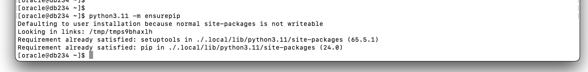
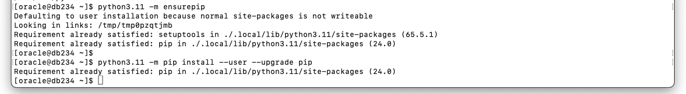
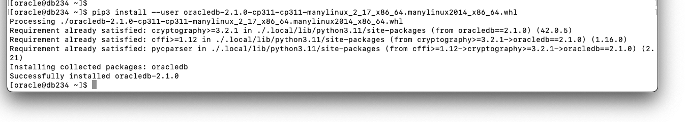
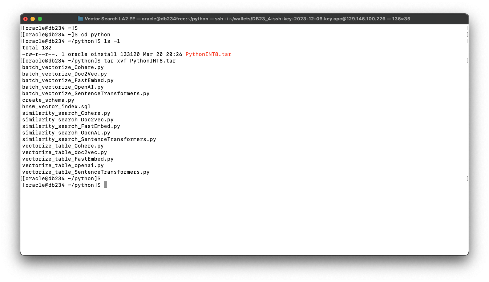
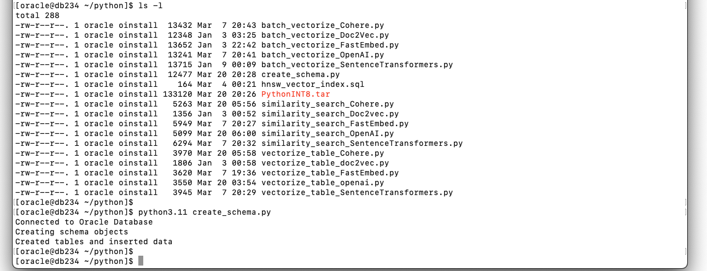
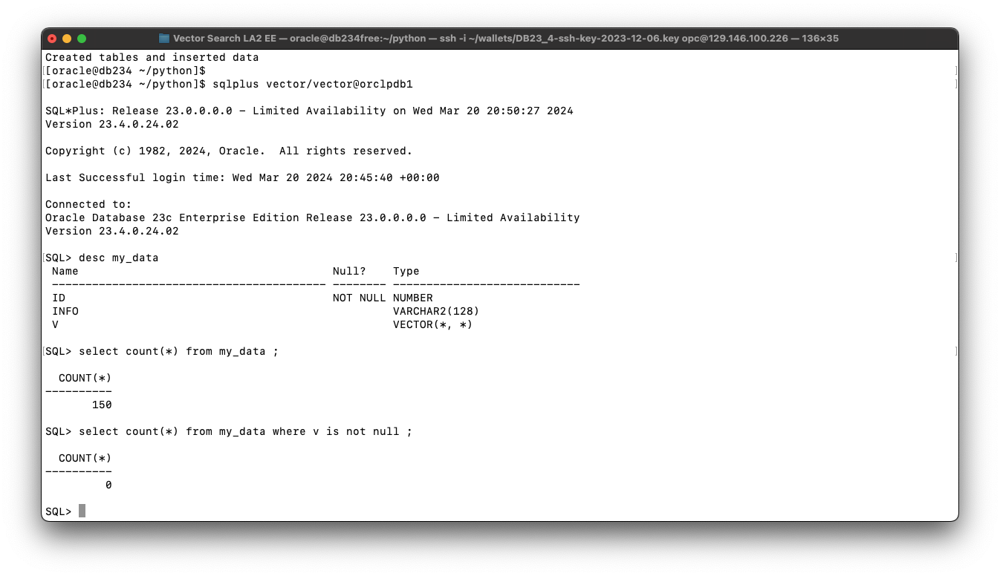
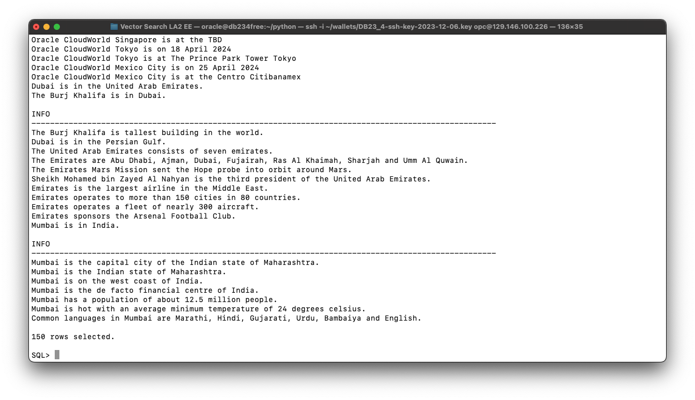

# Lab 0: Setup Workshop VM Environment

## Introduction

In this lab we will setup and configure the VM environment for the LiveLab Workshop.

**THESE STEPS SHOULD BE RUN IN THE VM IMAGE PRIOR TO SHIPPING SO THE END-USER DOES NOT NEED TO PERFORM THE TASKS ...  MAKE THE LAB EASIER AND FASTER TO RUN.**


  i.e.  increase VM disk size to 1TB if not already done so...
        install python
        install / update pip
        set up oracle environment variables
        create directory "python"
        unzip the contents of pythonINT8.tar into the python directory
        create the user vector/vector

  *SHOULD WE ADD TO THE APPENDIX FOR USERS WHO WISH TO RUN THIS IN THEIR OWN ENVIRONMENT???*

------------
Estimated Time: 20 minutes

### Objectives

In this lab, you will perform the following tasks:
* Task 1: Install and Configure Python.
* Task 2: Set up the Oracle Database environment


### Prerequisites (Optional)

This lab assumes you have:
* An Oracle account
* An Oracle Database 23.4 preinstalled 

*This is the "fold" - below items are collapsed by default*

## Task 1: Install and Configure Python.

In this task you will install and configure Python.In addition to Python, you will also install the *OracleDB* Python driver for working with an Oracle database. Python and the Python-OracleDB driver will be used by all of the labs in the workshop. 


1. Install Python 3.11

    ```
      <copy>
      sudo dnf install python3.11
      </copy>
    ```

2. As Operating System user oracle make sure *pip* is installed

    ```
      <copy>
      su - oracle
      cd python
      python3.11 -m ensurepip
      </copy>
    ```


    


3. As the operating system user Oracle, upgrade *pip* to enable the local python-oracledb installation to work

    ```
      <copy>
      python3.11 -m pip install --user --upgrade pip
      </copy>
    ```

    


4. As the user Oracle, install the vector enabled python-oracledb From the SQL Drivers Python directory

    ```
      <copy>
      pip3 install --user oracledb-2.1.0-cp311-cp311-manylinux_2_17_×86_64.manylinux2014_×86_64.whl 
      </copy>
    ```

    


   **????? In Dougs demo he hits his code fails due missing dependancy on "numpy"**
   **so he adds it with: pip install numpy**     
   **I did NOT experience this issue with my image...**
 
   **BUT perhaps add this step to our vm-install so students do not hit this...  ?????**

 
## Task 2: Set up the Oracle Database environment

*Taken from VIDEO- 3\_Python\_table_data:*

1. Set up the environment variables for the shell environment to make operations in the lab easier to perform...

    ```
      <copy>
      export ORACLE_SID=ORCLCDB
      export ORAENV_ASK=NO
      . /opt/oracle/product/23c/dbhome_1/bin/oraenv
      export TNS_ADMIN=/opt/oracle/product/23c/dbhome_1/network/admin
      export PYTHON_USERNAME='vector'
      export PYTHON_PASSWORD='vector'
      export PYTHON_CONNECTSTRING='localhost/orclpdb1'
      </copy>
    ```


2. Extract contents of *PythonINT8.tar* file


    ```
      <copy>
      mkdir python
      cd python
      ls -l
      tar xvf PythonINT8.tar
      </copy>
    ```

    


3. For this workshop we will be using a table called MY\_DATA. The table is created and partially populated using the python program: *"create\_schema.py"*. 


    You can view the contents of the *create\_schema.py* file before running it-

    ```
      <copy>
      view create_schema.py
      </copy>
    ```


    To run the python program- 
 
    ```
      <copy>
      python3.11 create_schema.py
      </copy>
    ```

    


4. Connect as the Oracle database user: *vector* password: *vector*
    ```
      <copy>
      sqlplus vector/vector@orclpdb1
      </copy>
    ```


5. Verify that the table "my\_data" has been created  

    ```
      <copy>
      desc my_data;

      select count(*) from my_data;
      select count(*) from my_data where v is not null ;
      </copy>
    ```

    


6. Verify that the *"INFO"* column from the table "my\_data" has been populated  

    ```
      <copy>
      select info from my_data;
      </copy>
    ```

    


 

## Summary

Once you have confirmed that the *MY\_DATA* table is create and contains 150 rows you are ready to proceed with the next Lab.

## Learn More

* [Oracle Database 23c Release Notes](../docs/release_notes.pdf)
* [Oracle AI Vector Search Users Guide](../docs/oracle-ai-vector-search-users-guide_latest.pdf)
* [Oracle Documentation](http://docs.oracle.com)

## Acknowledgements
* **Author** - Doug Hood, Product Manager
* **Contributors** - Sean Stacey, Outbound Product Manager
* **Last Updated By/Date** - Sean Stacey, April 2024
