<if type="SentenceTransformers">

# Lab 1: Using Sentence Transformers and Python with Oracle AI Vector Search

## Introduction

In this lab we will be using open source embedding models from Hugging Face so they're free to use. In addition to being free to use, these models can be installed locally, so they can be accessed by making a function call to a library, rather than a RESTful call over the internet.

So they're free, local and fast ...plus there are over 500 sentence transformer models to choose from.

*SentenceTransformers* is an open source Python framework for modern sentence, text and image embeddings. Sentence Transformers make creating embeddings for text or images simple. Simple text based sentence transformers tend to have the same template where the only variable is the embedding model you choose to use.

See [https://www.sbert.net/](https://www.sbert.net/) and [https://arxiv.org/abs/1908.10084](https://arxiv.org/abs/1908.10084) for more details about Sentence Transformers.


------------
Estimated Time: 20 minutes

### Objectives

In this lab, you will be performing the following tasks:
* Task 1: Create and setup a table for the lab
* Task 2: Vectorizing a table with Sentence Transformers embedding
* Task 3: Understanding the Vector Embedding process
* Task 4: Perform Similarity Search with Sentence Transformers
* Task 5: Changing embedding models

* Appendix 1: Installing Sentence Transformers libraries in your system


### Prerequisites

This lab assumes you have:
* An Oracle account
* A preinstalled Oracle Database 23.4 
* Your workshop environment is configured (Completed Lab 0)


## Task 1: Create and setup a table for the lab

**NOTE:** This Task can be skipped if you have already completed another lab in this workshop.

Our first step will be to create a table that we'll name: *MY\_DATA* to use for our lab exercises. The table will have three columns:

 | Column Name | Type | Nullable |
 | --- | --- | --- |
 | ID | Number | Not Null |
 | INFO | Varchar2(128) | |
 | V | Vector(*, *) | |

- The first column in our table is **ID**. It will be used as a unique identifier to reference each row in our table. We will be using this column to associate a Vector (Column: V) with our information (Column: INFO).  
- The second column in our table is **INFO**. This column will contain a string of text or phrase. The contents of this column will be the basis of our vectorization process and the related vector for the string will be stored in column V.
- The third column in our table is **V**. This is what we will use to store the vector for our string. We are not explicitly defining the vector type or size for this column as we will be storing vectors with different types and numbers of Dimensions.   

As the focus of this workshop is for Python programmers, we will use a Python program to create our table.

1. While logged into your Operating System as the Oracle user, create a file called *create\_schema.py* and paste the following contents into the file.

   **NOTE: The *create\_schema.py file may already exist in your lab environment. If so, you're good to go, but it's not a bad idea to take a look at what the program is doing and ouchthe sample data we will be using for the workshop.**  

    ```
      <copy>
      # -----------------------------------------------------------------------------
      # Copyright (c) 2023, Oracle and/or its affiliates.
      #
      # This software is dual-licensed to you under the Universal Permissive License
      # (UPL) 1.0 as shown at https://oss.oracle.com/licenses/upl and Apache License
      # 2.0 as shown at http://www.apache.org/licenses/LICENSE-2.0. You may choose
      # either license.
      #
      # If you elect to accept the software under the Apache License, Version 2.0,
      # the following applies:
      #
      # Licensed under the Apache License, Version 2.0 (the "License");
      # you may not use this file except in compliance with the License.
      # You may obtain a copy of the License at
      #
      #    https://www.apache.org/licenses/LICENSE-2.0
      #
      # Unless required by applicable law or agreed to in writing, software
      # distributed under the License is distributed on an "AS IS" BASIS,
      # WITHOUT WARRANTIES OR CONDITIONS OF ANY KIND, either express or implied.
      # See the License for the specific language governing permissions and
      # limitations under the License.
      # -----------------------------------------------------------------------------
      #
      # Create the schema for the demostrations
      
      
      import os
      import sys
      
      import oracledb
      
      un = os.getenv("PYTHON_USERNAME")
      pw = os.getenv("PYTHON_PASSWORD")
      cs = os.getenv("PYTHON_CONNECTSTRING")
      
      # Connect to Oracle Database 23.4
      with oracledb.connect(user=un, password=pw, dsn=cs) as connection:
          db_version = tuple(int(s) for s in connection.version.split("."))[:2]
          if db_version < (23, 4):
              sys.exit("This example requires Oracle Database 23.4 or later")
          print("\nConnected to Oracle Database")
      
          print("Creating schema objects")
          with connection.cursor() as cursor:
              sql = [
                  """drop table if exists my_data purge""",
                  """create table if not exists my_data (
                       id   number primary key,
                       info varchar2(128),
                       v    vector)""",
              ]
              for s in sql:
                  try:
                      cursor.execute(s)
                  except oracledb.DatabaseError as e:
                      if e.args[0].code != 942:  # ignore ORA-942: table does not exist
                          raise
      
              data_to_insert = [
                  (1, "San Francisco is in California.", None),
                  (2, "San Jose is in California.", None),
                  (3, "Los Angeles is in California.", None),
                  (4, "Buffalo is in New York.", None),
                  (5, "Brooklyn is in New York.", None),
                  (6, "Queens is in New York.", None),
                  (7, "Harlem is in New York.", None),
                  (8, "The Bronx is in New York.", None),
                  (9, "Manhattan is in New York.", None),
                  (10, "Staten Island is in New York.", None),
                  (11, "Miami is in Florida.", None),
                  (12, "Tampa is in Florida.", None),
                  (13, "Orlando is in Florida.", None),
                  (14, "Dallas is in Texas.", None),
                  (15, "Houston is in Texas.", None),
                  (16, "Austin is in Texas.", None),
                  (17, "Phoenix is in Arizona.", None),
                  (18, "Las Vegas is in Nevada.", None),
                  (19, "Portland is in Oregon.", None),
                  (20, "New Orleans is in Louisiana.", None),
                  (21, "Atlanta is in Georgia.", None),
                  (22, "Chicago is in Illinois.", None),
                  (23, "Cleveland is in Ohio.", None),
                  (24, "Boston is in Massachusetts.", None),
                  (25, "Baltimore is in Maryland.", None),
                  (26, "Charlotte is in North Carolina.", None),
                  (27, "Raleigh is in North Carolina.", None),
                  (28, "Detroit is in Michigan.", None),
      
      
                  (100, "Ferraris are often red.", None),
                  (101, "Teslas are electric.", None),
                  (102, "Mini Coopers are small.", None),
                  (103, "Fiat 500 are small.", None),
                  (104, "Dodge Vipers are wide.", None),
                  (105, "Ford 150 are popular.", None),
                  (106, "Alfa Romeos are fun.", None),
                  (107, "Volvos are safe.", None),
                  (108, "Toyotas are reliable.", None),
                  (109, "Hondas are reliable.", None),
                  (110, "Porsches are fast and reliable.", None),
                  (111, "Nissan GTR are great.", None),
                  (112, "NISMO is awesome.", None),
                  (113, "Tesla Cybertrucks are big.", None),
                  (114, "Jeep Wranglers are fun.", None),
                  (115, "Lamborghinis are fast.", None),
      
                  (200, "Bananas are yellow.", None),
                  (201, "Kiwis are green inside.", None),
                  (202, "Kiwis are brown on the outside.", None),
                  (203, "Kiwis are birds.", None),
                  (204, "Kiwis taste good.", None),
                  (205, "Ripe strawberries are red.", None),
                  (206, "Apples can be green, yellow or red.", None),
                  (207, "Ripe cherries are red.", None),
                  (208, "Pears can be green, yellow or brown.", None),
                  (209, "Oranges are orange.", None),
                  (210, "Peaches can be yellow, orange or red.", None),
                  (211, "Peaches can be fuzzy.", None),
                  (212, "Grapes can be green, red or purple.", None),
                  (213, "Watermelons are green on the outside.", None),
                  (214, "Watermelons are red on the inside.", None),
                  (215, "Blueberries are blue.", None),
                  (216, "Limes are green.", None),
                  (217, "Lemons are yellow.", None),
                  (218, "Ripe tomatoes are red.", None),
                  (219, "Unripe tomatoes are green.", None),
                  (220, "Ripe raspberries are red.", None),
                  (221, "Mangoes can be yellow, gold, green or orange.", None),
      
                  (300, "Tigers have stripes.", None),
                  (301, "Lions are big.", None),
                  (302, "Mice are small.", None),
                  (303, "Cats do not care.", None),
                  (304, "Dogs are loyal.", None),
                  (305, "Bears are hairy.", None),
                  (306, "Pandas are black and white.", None),
                  (307, "Zebras are black and white.", None),
                  (308, "Penguins can be black and white.", None),
                  (309, "Puffins can be black and white.", None),
                  (310, "Giraffes have long necks.", None),
                  (311, "Elephants have trunks.", None),
                  (312, "Horses have four legs.", None),
                  (313, "Birds can fly.", None),
                  (314, "Birds lay eggs.", None),
                  (315, "Fish can swim.", None),
                  (316, "Sharks have lots of teeth.", None),
                  (317, "Flies can fly.", None),
                  (318, "Snakes have fangs.", None),
                  (319, "Hyenas laugh.", None),
                  (320, "Crocodiles lurk.", None),
                  (321, "Spiders have eight legs.", None),
                  (322, "Wolves are hairy.", None),
                  (323, "Mountain Lions eat deer.", None),
                  (324, "Kangaroos can hop.", None),
                  (325, "Turtles have shells.", None),
      
                  (400, "Ibaraki is in Kanto.", None),
                  (401, "Tochigi is in Kanto.", None),
                  (402, "Gunma is in Kanto.", None),
                  (403, "Saitama is in Kanto.", None),
                  (404, "Chiba is in Kanto.", None),
                  (405, "Tokyo is in Kanto.", None),
                  (406, "Kanagawa is in Kanto.", None),
      
                  (500, "Eggs are egg shaped.", None),
                  (501, "Sydney is in Australia.", None),
                  (502, "To be, or not to be, that is the question.", None),
                  (503, "640K ought to be enough for anybody.", None),
                  (504, "Man overboard.", None),
                  (505, "The world is your oyster.", None),
                  (506, "One small step for Mankind.", None),
                  (507, "Bitcoin is a cryptocurrency.", None),
                  (508, "Saturn has rings.", None),
                  (509, "Antarctica is very cold.", None),
                  (510, "Wellington is the capital of New Zealand.", None),
                  (511, "The Amazon River is the largest river by discharge.", None),
      
                  (600, "Catamarans have two hulls.", None),
                  (601, "Monohulls have a single hull.", None),
                  (602, "Foiling sailboats are fast.", None),
                  (603, "Cutters have two headsails.", None),
                  (604, "Yawls have two masts.", None),
                  (605, "Sloops have one mast.", None),
                  (606, "HMS Endeavour was a squared rigged ship.", None),
                  (607, "Auckland has hosted the Americas Cup race three times.", None),
                  (608, "Joshua Slocum sailed the first solo circumnavigation of the world.", None),
      
                  (900, 'Oracle CloudWorld Las Vegas was on September 18–21, 2023', None),
                  (901, 'Oracle CloudWorld Las Vegas was at The Venetian Convention and Expo Center', None),
                  (902, 'Oracle CloudWorld Dubai was on 23 January 2024', None),
                  (903, 'Oracle CloudWorld Dubai is at the Dubai World Trade Centre', None),
                  (904, 'Oracle CloudWorld Mumbai was on 14 February 2024', None),
                  (905, 'Oracle CloudWorld Mumbai is at the Jio World Convention Centre', None),
                  (906, 'Oracle CloudWorld London was on 14 March 2024', None),
                  (907, 'Oracle CloudWorld London is at the ExCeL London', None),
                  (908, 'Oracle CloudWorld Milan was on 21 March 2024', None),
                  (909, 'Oracle CloudWorld Milan is at the Milano Convention Centre', None),
                  (910, 'Oracle CloudWorld Sao Paulo was on 4 April 2024', None),
                  (911, 'Oracle CloudWorld Sao Paulo is at the World Trade Center São Paulo', None),
                  (912, 'Oracle CloudWorld Singapore is on 16 April 2024', None),
                  (914, 'Oracle CloudWorld Tokyo is on 18 April 2024', None),
                  (915, 'Oracle CloudWorld Tokyo is at The Prince Park Tower Tokyo', None),
                  (916, 'Oracle CloudWorld Mexico City is on 25 April 2024', None),
                  (917, 'Oracle CloudWorld Mexico City is at the Centro Citibanamex', None),
      
                  (1000, 'Mumbai is in India.', None),
                  (1001, 'Mumbai is the capital city of the Indian state of Maharashtra.', None),
                  (1002, 'Mumbai is the Indian state of Maharashtra.', None),
                  (1003, 'Mumbai is on the west coast of India.', None),
                  (1004, 'Mumbai is the de facto financial centre of India.', None),
                  (1005, 'Mumbai has a population of about 12.5 million people.', None),
                  (1006, 'Mumbai is hot with an average minimum temperature of 24 degrees celsius.', None),
                  (1007, 'Common languages in Mumbai are Marathi, Hindi, Gujarati, Urdu, Bambaiya and English.', None),
      
                  (1100, 'Dubai is in the United Arab Emirates.', None),
                  (1101, 'The Burj Khalifa is in Dubai.', None),
                  (1102, 'The Burj Khalifa is tallest building in the world.', None),
                  (1103, 'Dubai is in the Persian Gulf.', None),
                  (1104, 'The United Arab Emirates consists of seven emirates.', None),
              ]
      
              connection.autocommit = True
      
              cursor.executemany(
                  """insert into my_data (id, info, v)
                     values (:1, :2, :3)""",
                        data_to_insert,
                    )
            
            print("Created table MY_DATA and inserted sample data.")
      print("-----------------------------------------------\n")
      </copy>
    ```

2. Save the file and run it with *python3.11* as follows:

    ```
      <copy>
      python3.11 create_schema.py
      </copy>
    ```

    **NOTE:** There are no issues with running this program multiple times. However it will reset any data that may have been added to the table, including an vectors that you may have generated.

    You should see the following:

    

    To summarize what we've just done, the *create\_schema.py* program connects to the Oracle database, drops and creates a table called MY\_DATA. The program then inserts 150 rows of sample data. The table does not yet contain any Vector information. 
    
    We will be logging into the database to take a look at the contents of the MY\_DATA table in the next Task. 


## Task 2: Vectorizing a table with Sentence Transformers embedding

Now that we have our MY\_DATA table created, we are ready to commence with generating embeddings for (or vectorizing) our data using the hugging face sentence transformers. To do this we will create a Python program to vectorize our phrases using the Sentence Transformers embedding model packages that we just installed.

1. While logged into your Operating System as the Oracle user, create a file called *vectorize\_table\_SentenceTransformers.py* and paste the following contents into the file.

    ```
      <copy>
      # -----------------------------------------------------------------------------
      # Copyright (c) 2023, Oracle and/or its affiliates.
      #
      # This software is dual-licensed to you under the Universal Permissive License
      # (UPL) 1.0 as shown at https://oss.oracle.com/licenses/upl and Apache License
      # 2.0 as shown at http://www.apache.org/licenses/LICENSE-2.0. You may choose
      # either license.
      #
      # If you elect to accept the software under the Apache License, Version 2.0,
      # the following applies:
      #
      # Licensed under the Apache License, Version 2.0 (the "License");
      # you may not use this file except in compliance with the License.
      # You may obtain a copy of the License at
      #
      #    https://www.apache.org/licenses/LICENSE-2.0
      #
      # Unless required by applicable law or agreed to in writing, software
      # distributed under the License is distributed on an "AS IS" BASIS,
      # WITHOUT WARRANTIES OR CONDITIONS OF ANY KIND, either express or implied.
      # See the License for the specific language governing permissions and
      # limitations under the License.
      # -----------------------------------------------------------------------------
      #
      # Add or update the vectors for all data values in a table
      #

      import os
      import sys
      import array
      import time

      import oracledb
      from sentence_transformers import SentenceTransformer

      un = os.getenv("PYTHON_USERNAME")
      pw = os.getenv("PYTHON_PASSWORD")
      cs = os.getenv("PYTHON_CONNECTSTRING")

      # -----------------------------------------------------------------------------
      # Use the Sentence Transformers all-MiniLM-L6-v2 model to create the vectors
      # Add or update the vectors for all data values in a table   
      
      embedding_model = "sentence-transformers/all-MiniLM-L6-v2"
      #embedding_model = "sentence-transformers/all-MiniLM-L12-v2"
      #embedding_model = "sentence-transformers/paraphrase-MiniLM-L3-v2"
      #embedding_model = "sentence-transformers/all-mpnet-base-v2"
      #embedding_model = "sentence-transformers/all-distilroberta-v1"
      #embedding_model = "BAAI/bge-small-en-v1.5"
      #embedding_model = "BAAI/bge-base-en-v1.5"
      #embedding_model = "sentence-transformers/average_word_embeddings_glove.6B.300d"
      #embedding_model = "sentence-transformers/average_word_embeddings_komninos"
      #embedding_model = "nomic-ai/nomic-embed-text-v1"

      #embedding_model  = "BAAI/bge-m3"
      #embedding_model = "intfloat/multilingual-e5-large"
      #embedding_model = "intfloat/multilingual-e5-base"
      #embedding_model = "intfloat/multilingual-e5-small"
      #embedding_model = "paraphrase-multilingual-mpnet-base-v2"
      #embedding_model = "distiluse-base-multilingual-cased-v2"
      #embedding_model = "stsb-xlm-r-multilingual"

      print("Using " + embedding_model)

      model = SentenceTransformer(embedding_model, trust_remote_code=True)

      query_sql = """select id, info
                     from my_data
                     order by 1"""

      update_sql = """update my_data set v = :1
                     where id = :2"""

      # -----------------------------------------------------------------------------
      # Connect to Oracle Database 23.4
      with oracledb.connect(user=un, password=pw, dsn=cs) as connection:
          db_version = tuple(int(s) for s in connection.version.split("."))[:2]
          if db_version < (23, 4):
              sys.exit("This example requires Oracle Database 23.4 or later")
          print("Connected to Oracle Database\n")

          with connection.cursor() as cursor:
              print("Vectorizing the following data:\n")

              # Loop over the rows and vectorize the VARCHAR2 data

              binds = []
              tic = time.perf_counter()

              for id_val, info in cursor.execute(query_sql):
                  # Convert to input string format for Sentence Transformers
                  data = f"[ {info} ]"

                  # Create the embedding and extract the vector
                  embedding = list(model.encode(data))

                  # Convert to array format
                  vec2 = array.array("f", embedding)

                  # Record the array and key
                  binds.append([vec2, id_val])

                  print(info)

              toc = time.perf_counter()

              # Do an update to add or replace the vector values
              cursor.executemany(
                  update_sql,
                  binds,
              )
              connection.commit()

              print(f"Vectors took {toc - tic:0.3f} seconds")
              print(f"\nAdded {len(binds)} vectors to the table using embedding model: " + embedding_model + "\n")

      </copy>
    ```

2. Save the file and run it with *python3.11* as follows:


    ```
      <copy>
      python3.11 vectorize_table_SentenceTransformers.py
      </copy>
    ```

    **NOTE:** In a typical deployment, when running this program for the first time, you will likely see a series of dependencies being downloaded. However in our Oracle LiveLabs configuration, you should not see this happen. However there may be a pause or delay when you run the program for the first time. 

    You should see the following:

    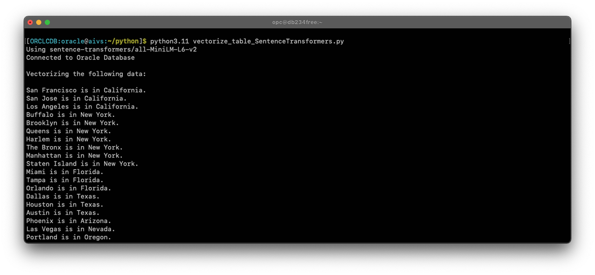

    Once the program has completed you will see the following:

    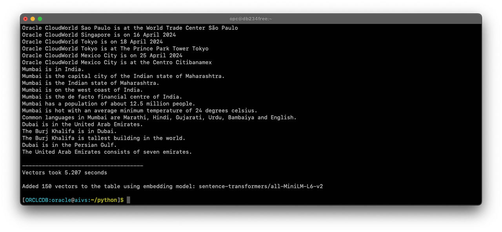

    To summarize what we've just done, the *vectorize\_table\_SentenceTransformers.py* program connects to the Oracle database, retrieves the text from the INFO column of the MY\_DATA table, and generates a vector for the INFO column in each of the 150 rows. We then store the vectorized data as a vector in the V column.

    If you have previously run this process with another embedding model from Cohere or OpenAI, the first thing you will notice is that this operation runs significantly faster. This can be attributed to the fact that we do not have to go over the internet to perform the task.

    You may have also noticed that we used the *all-MiniLM-L6-v2* embedding model. This is a very popular embedding model with millions of monthly downloads. It's popularity is due to the fact that it tends to be a good trade-off when comparing accuracy and performance.

    Before we take a look at the code we just ran, we will take a look in the Database.


3. We can now query the MY\_DATA table in the Oracle database to verify that our data has been updated too:

    i. Connect to the Oracle database as the user: *vector* and password *vector*

    ```
      <copy>
      sqlplus vector/vector@orclpdb1
      </copy>
    ```


    ii. We can now query the MY\_DATA table to verify that all 150 rows have been updated.

    ```
      <copy>
      select count(*) from my_data where V is not null ;
      </copy>
    ```

    You should see:

    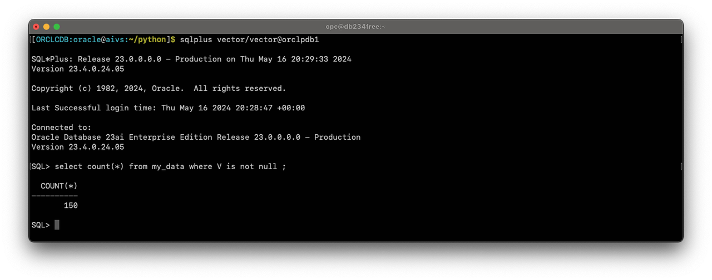


    iii. Next we can see the INFO column in the MY\_DATA table to see the phrases or factoids that will vectors will be generated for.

    ```
      <copy>
      select info from my_data where V is not null order by id;
      </copy>
    ```

    You should see:

    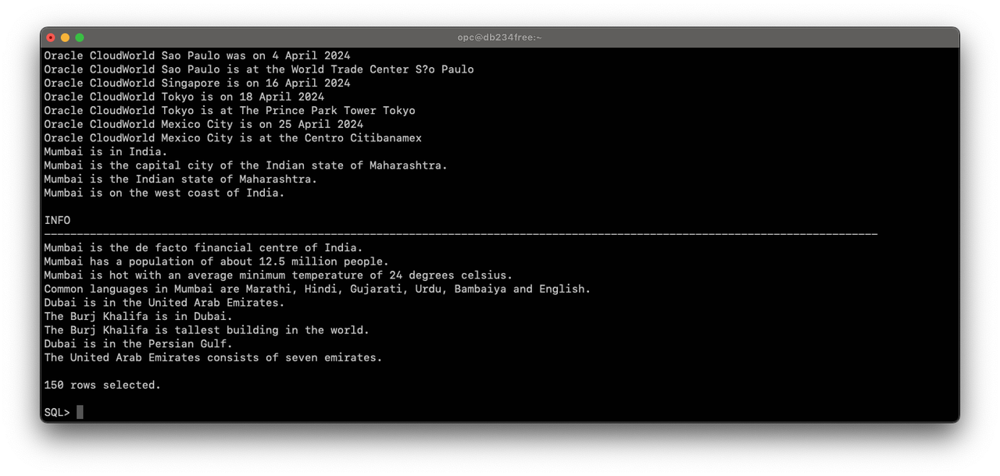

    iv. We can also query the vector column: V in the MY\_DATA table to see what the vectors and dimensions look like.

    ```
      <copy>
      select V from my_data where ID = 1;
      </copy>
    ```

    You should see:

    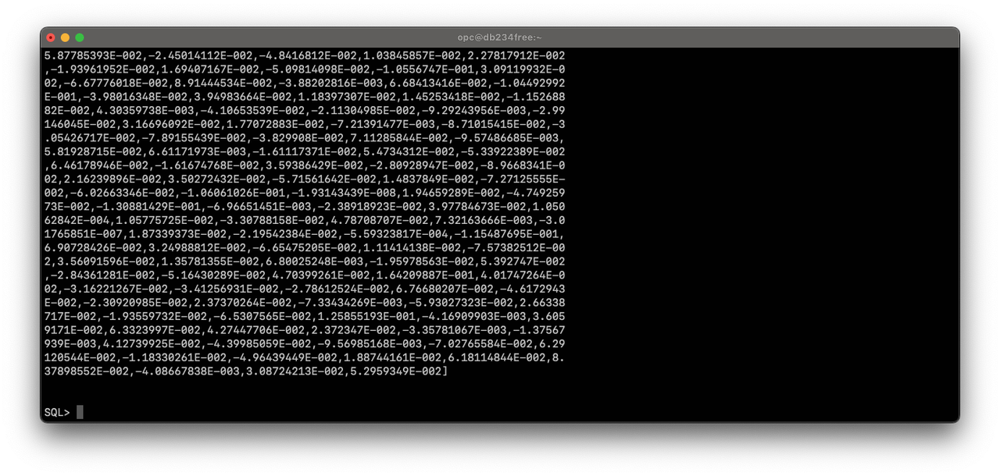

You can now exit from SQL*Plus.
    
## Task 3: Understanding the Vector Embedding process

Before proceeding any further, lets take a look at the code of the Python program we just ran. This will help with understanding how this process is being performed. You will notice that this program looks very similar to the other vectorize\_table Python programs in this workshop, the basic logic flow is very similar for the most part.

1. Open the file with your favorite editor. You can use *vi* or *view* to view the contents of the file. We will not be making any changes to the program at this point-

    ```
      <copy>
      view vectorize_table_SentenceTransformers.py
      </copy>
    ```


    The first thing you should notice is that the program has just over 100 lines of code. If you've inspected the vectorizing Python programs for other embedding models other vendors you will notice that this program logic is very similar. 
    
    The program calls the *oracledb* library to load the Python Oracle driver. This time however we are importing the *SentenceTransformer* package from *Hugging Face*.

    The next block of code is where we assign the embedding model we have chosen (un-commented line) to use.  

    We also have a large number of embedding models to choose from. As we've aready noted, we opted to use the "all-MiniLM-L6-v2" embedding model due to it's popularity.       

    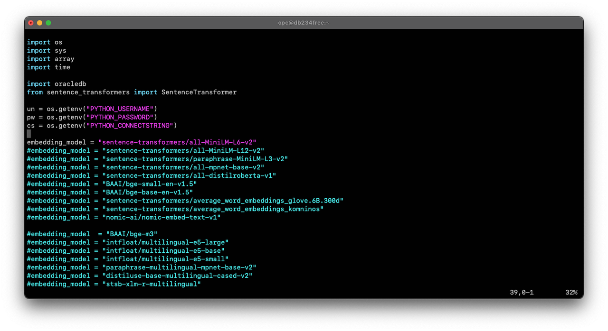

    If we scroll a little further down we can see the SQL code that is being called to populate the vectorized data into the MY\_DATA table. The first block of SQL code creates a cursor for the rows we wish to update and the second block performs the update operation.

    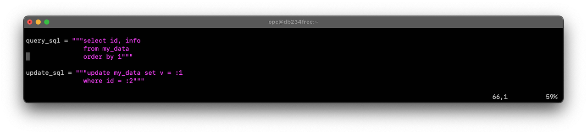

    Once we have connected to the Oracle database and chosen our embedding model we are ready to generate vectors for the rows in our table. To perform this we create a cursor from our first SQL statement called *query\_sql* and loop through the table. We then use the SQL from *update\_sql* to update the V column with the vectorized value of the phrase from the INFO column. We perform this row by row and print the progress as we loop through the cursor.

    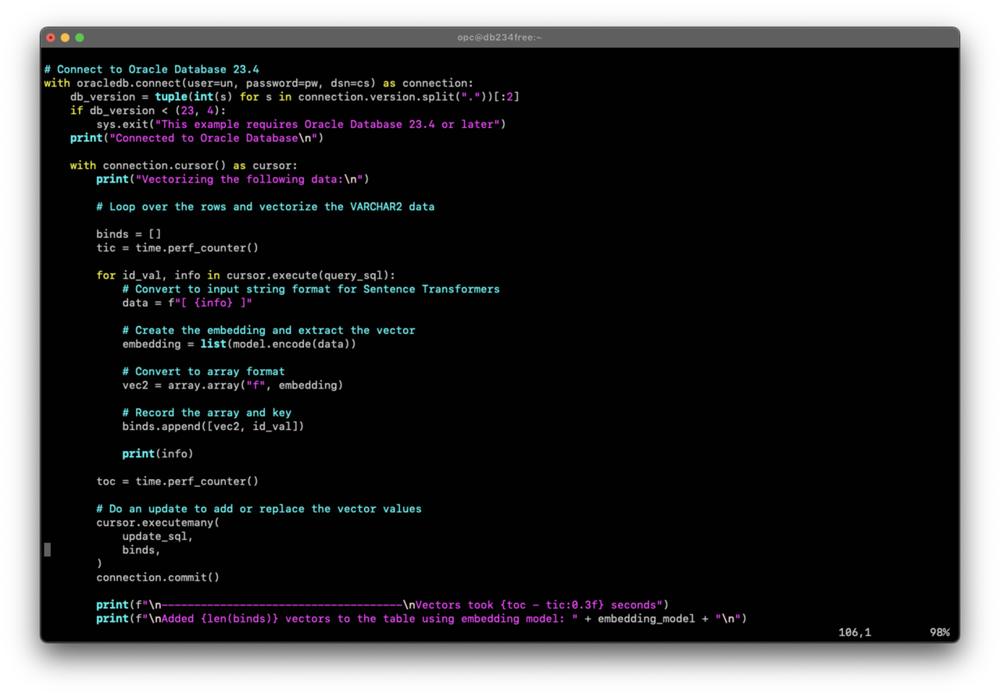

    If you chose to use *vi* or *view* to see your file, you can close the file using the vi command- **:q!** now and move on to the next task.

    press \[esc\] then- 
    ```
      <copy>
      :q!
      </copy>
    ```
    

## Task 4: Perform Similarity Search with Sentence Transformers

It's time to have some fun!

In this task we will take a look at how to perform similarity search in the Oracle Database with the Sentence Transformer embedding models from python.

Now that our data has been vectorized, we are ready to try performing similarity searches using Sentence Transformers. To do this using Python, we will create a Python program to call Sentence Transformers to vectorize a search phrase that can then be used to search against the vectors stored in column V. We then return the phrases or factoids from the INFO column associated with the corresponding ID column, this is all done using similarity search. 

Even though the data in our table has been vectorized we will still need to generate a vector using python, this is because the search phrase needs to also be a vector using the same embedding model as the data. The search phrase is entered on the fly, vectorized, and then used to search against the vectors stored in our MY\_DATA table in the database. 

1. While logged into your Operating System as the Oracle user, create a file called *similarity\_search\_SentenceTransformers.py* and paste the following contents into the file.

    ```
      <copy>
      # -----------------------------------------------------------------------------
      # Copyright (c) 2023, Oracle and/or its affiliates.
      #
      # This software is dual-licensed to you under the Universal Permissive License
      # (UPL) 1.0 as shown at https://oss.oracle.com/licenses/upl and Apache License
      # 2.0 as shown at http://www.apache.org/licenses/LICENSE-2.0. You may choose
      # either license.
      #
      # If you elect to accept the software under the Apache License, Version 2.0,
      # the following applies:
      #
      # Licensed under the Apache License, Version 2.0 (the "License");
      # you may not use this file except in compliance with the License.
      # You may obtain a copy of the License at
      #
      #    https://www.apache.org/licenses/LICENSE-2.0
      #
      # Unless required by applicable law or agreed to in writing, software
      # distributed under the License is distributed on an "AS IS" BASIS,
      # WITHOUT WARRANTIES OR CONDITIONS OF ANY KIND, either express or implied.
      # See the License for the specific language governing permissions and
      # limitations under the License.
      # -----------------------------------------------------------------------------
      #
      # Basic Similarity Search using the Sentence Transformers embedding models
      #
      
      import os
      import sys
      import array
      import time
      
      import oracledb
      from sentence_transformers import SentenceTransformer
      from sentence_transformers import CrossEncoder
      
      un = os.getenv("PYTHON_USERNAME")
      pw = os.getenv("PYTHON_PASSWORD")
      cs = os.getenv("PYTHON_CONNECTSTRING")
      
      # topK is how many rows to return
      topK = 5
      
      # Re-ranking is about potentially improving the order of the resultset
      # Re-ranking is significantly slower than doing similarity search
      # Re-ranking is optional
      rerank = 0
      
      sql = """select info
               from my_data
               order by vector_distance(v, :1, COSINE)
               fetch first :2 rows only"""
      
      # English embedding models
      embedding_model = "sentence-transformers/all-MiniLM-L6-v2"
      #embedding_model = "sentence-transformers/all-MiniLM-L12-v2"
      #embedding_model = "sentence-transformers/paraphrase-MiniLM-L3-v2"
      #embedding_model = "sentence-transformers/all-mpnet-base-v2"
      #embedding_model = "sentence-transformers/all-distilroberta-v1"
      #embedding_model = "BAAI/bge-small-en-v1.5"
      #embedding_model = "BAAI/bge-base-en-v1.5"
      #embedding_model = "sentence-transformers/average_word_embeddings_glove.6B.300d"
      #embedding_model = "sentence-transformers/average_word_embeddings_komninos"
      #embedding_model = "nomic-ai/nomic-embed-text-v1"
      
      # Multi-lingual embedding models
      #embedding_model = "BAAI/bge-m3"
      #embedding_model = "intfloat/multilingual-e5-large"
      #embedding_model = "intfloat/multilingual-e5-base"
      #embedding_model = "intfloat/multilingual-e5-small"
      #embedding_model = "paraphrase-multilingual-mpnet-base-v2"
      #embedding_model = "distiluse-base-multilingual-cased-v2"
      #embedding_model = "stsb-xlm-r-multilingual"
      
      # English re-rankers
      rerank_model = "cross-encoder/ms-marco-TinyBERT-L-2-v2"
      #rerank_model = "cross-encoder/ms-marco-MiniLM-L-2-v2"
      #rerank_model = "cross-encoder/ms-marco-MiniLM-L-6-v2"
      #rerank_model = "cross-encoder/ms-marco-MiniLM-L-12-v2"
      #rerank_model = "BAAI/bge-reranker-base"
      #rerank_model = "BAAI/bge-reranker-large"
      
      # Multi-lingual re-rankers
      #rerank_model = "jeffwan/mmarco-mMiniLMv2-L12-H384-v1"
      #rerank_model = "cross-encoder/msmarco-MiniLM-L6-en-de-v1"
      
      print("Using embedding model " + embedding_model)
      if rerank:
        print("Using reranker " + rerank_model)
      
      print("TopK = " + str(topK))
      
      model = SentenceTransformer(embedding_model, trust_remote_code=False)
      
      # Connect to Oracle Database 23.4
      with oracledb.connect(user=un, password=pw, dsn=cs) as connection:
          db_version = tuple(int(s) for s in connection.version.split("."))[:2]
          if db_version < (23, 4):
              sys.exit("This example requires Oracle Database 23.4 or later")
          print("Connected to Oracle Database\n")
      
          with connection.cursor() as cursor:
      
              while True:
                  # Get the input text to vectorize
                  text = input("\nEnter a phrase. Type quit to exit : ")
      
                  if (text == "quit") or (text == "exit"):
                      break
      
                  if text == "":
                      continue
      
                  tic = time.perf_counter()
      
                  # Create the embedding and extract the vector
                  embedding = list(model.encode(text))
      
                  toc = time.perf_counter()
                  print(f"\nVectorize query took {toc - tic:0.3f} seconds")
      
                  # Convert to array format
                  vec = array.array("f", embedding)
      
                  docs  = []
                  cross = []
      
                  tic = time.perf_counter()
      
                  # Do the Similarity Search
                  for (info,) in cursor.execute(sql, [vec, topK]):
      
                      # Remember the SQL data resultset
                      docs.append(info)
      
                      if rerank == 1:
      
                        # create the query/data pair needed for cross encoding
                        tup = []
                        tup.append(text)
                        tup.append(info)
                        cross.append(tup)
      
                  toc = time.perf_counter()
                  print(f"Similarity Search took {toc - tic:0.4f} seconds")
      
                  if rerank == 0:
      
                      # Just rely on the vector distance for the resultset order
                      print("\nWithout ReRanking")
                      print("====================================")
                      for hit in docs:
                        print(hit)

                  else:
      
                    tic = time.perf_counter()
      
                    # ReRank for better results
                    ce = CrossEncoder(rerank_model, max_length=512)
                    ce_scores = ce.predict(cross)
      
                    toc = time.perf_counter()
                    print(f"Rerank took {toc - tic:0.3f} seconds")
      
                    # Create the unranked list of ce_scores + data
                    unranked = []
                    for idx in range(topK):
      
                        tup2 = []
                        tup2.append(ce_scores[idx])
                        tup2.append(docs[idx])
                        unranked.append(tup2)
      
                    # Create the reranked list by sorting the unranked list
                    reranked = sorted(unranked, key=lambda foo: foo[0], reverse=True)
      
                    print("\nReRanked results:")
                    print("====================================")
                    for idx in range(topK):
                        x = reranked[idx]
                        print(x[1])
                    
                  print("------------------------------------")
    
      </copy>
    ```

    Save the file and exit.    

Before we run the program, let's take a moment to review what our program does.

The first block of code loads modules needed for the basic operation of the program. Next, we import the *oracledb* library to load the Python Oracle driver. 

```
    import os
    import sys
    import array
    import time
    
    import oracledb
    from sentence_transformers import SentenceTransformer
    from sentence_transformers import CrossEncoder
```

Next we are passing our Oracle Username, Password and connectstring to connect to the Oracle database.


```

    un = os.getenv("PYTHON_USERNAME")
    pw = os.getenv("PYTHON_PASSWORD")
    cs = os.getenv("PYTHON_CONNECTSTRING")
```

The next setting controls the number of rows or results we want to return. and then whether we would like to use Re-ranking to control the order of the results being returned. As documented in the code, there are trade-offs in using a re-rank. There are also different re-rank models available too.

```
    
    # topK is how many rows to return
    topK = 5
    
    # Re-ranking is about potentially improving the order of the resultset
    # Re-ranking is significantly slower than doing similarity search
    # Re-ranking is optional
    rerank = 0
```
      
The SQL statement that is used to perform the Vector similarity search is parsed to the SQL variable.   

```
    sql = """select info
        from my_data
        order by vector_distance(v, :1, COSINE)
        fetch first :2 rows only"""
```

The next block of code is where we assign the embedding model (un-commented line) to use.

You will notice there is a significant number of embedding models to choose from. As we've aready noted, we opted to use the "all-MiniLM-L6-v2" embedding model due to it's popularity.

```
    # English embedding models
    embedding_model = "sentence-transformers/all-MiniLM-L6-v2"
    #embedding_model = "sentence-transformers/all-MiniLM-L12-v2"
    #embedding_model = "sentence-transformers/paraphrase-MiniLM-L3-v2"
    #embedding_model = "sentence-transformers/all-mpnet-base-v2"
    #embedding_model = "sentence-transformers/all-distilroberta-v1"
    #embedding_model = "BAAI/bge-small-en-v1.5"
    #embedding_model = "BAAI/bge-base-en-v1.5"
    #embedding_model = "sentence-transformers/average_word_embeddings_glove.6B.300d"
    #embedding_model = "sentence-transformers/average_word_embeddings_komninos"
    #embedding_model = "nomic-ai/nomic-embed-text-v1"
    
    # Multi-lingual embedding models
    #embedding_model = "BAAI/bge-m3"
    #embedding_model = "intfloat/multilingual-e5-large"
    #embedding_model = "intfloat/multilingual-e5-base"
    #embedding_model = "intfloat/multilingual-e5-small"
    #embedding_model = "paraphrase-multilingual-mpnet-base-v2"
    #embedding_model = "distiluse-base-multilingual-cased-v2"
    #embedding_model = "stsb-xlm-r-multilingual"
```
      
The next block lets us choose a re-rank model. You will notice there are rerank models for different languages too. 

NOTE: This does not enable or disable re-ranking. This simply chooses the  re-rank model to be used if *rerank* = 1. 
        
```
# English re-rankers
rerank_model = "cross-encoder/ms-marco-TinyBERT-L-2-v2"
#rerank_model = "cross-encoder/ms-marco-MiniLM-L-2-v2"
#rerank_model = "cross-encoder/ms-marco-MiniLM-L-6-v2"
#rerank_model = "cross-encoder/ms-marco-MiniLM-L-12-v2"
#rerank_model = "BAAI/bge-reranker-base"
#rerank_model = "BAAI/bge-reranker-large"

# Multi-lingual re-rankers
#rerank_model = "jeffwan/mmarco-mMiniLMv2-L12-H384-v1"
#rerank_model = "cross-encoder/msmarco-MiniLM-L6-en-de-v1"
```

Once this is configured, we connect to the database, retrieve an input string (or phrase) from the prompt. We then generate a vector of that phrase using the specified embedding model. and run the SQL operation to perform a similarity search in the Oracle database using that vector. The results of the corresponding INFO column are then returned. The number of results returned is controlled by the top-K variable.   

If you are comfortable with the what the program does, you're ready to use the program. ...and have some fun.


2. We are ready to try performing a similarity search using the Sentence Transformers.

   You can do this by-

    ```
      <copy>
      python3.11 similarity_search_SentenceTransformers.py
      </copy>
    ```

    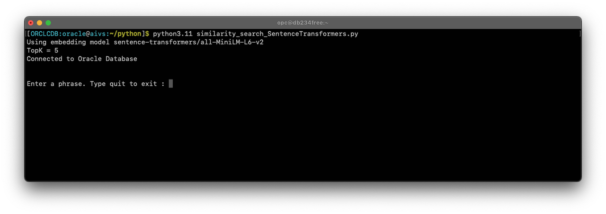


    **NOTE:** The embedding model being used is displayed when we run the program. It is important to make sure that the embedding model you use matches the embedding model you chose when you vectorized the data - in this instance we vectorized our data with *"all-MiniLM-L6-v2"*, and our search is using the same model, so we are good to go. A mismatch will lead to an error and even worse a false positive - in the sense that no error will be displayed but the wrong results will be displayed.

3.  For our first example let's try the word "cars" at the prompt.

    Enter Phrase: **cars**

    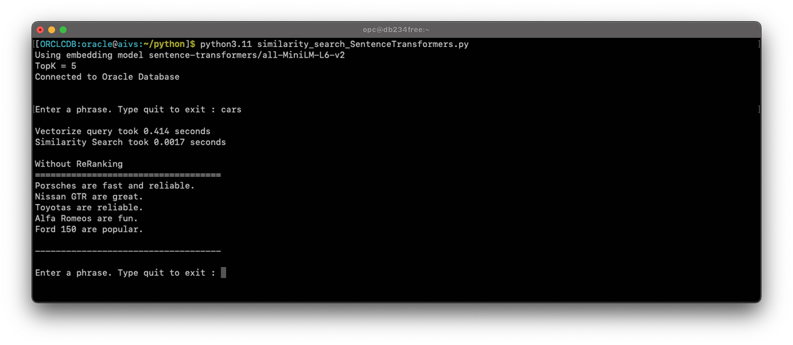

    In our situation it took under half a second to generate a vector from the query and about 2 milliseconds to perform the query. This is extremely fast when we compare it to other models as we do not need to perform the roundtrip REST calls over the internet.

    - The first thing to consider is that this query demonstrates the true power of Similarity Search. The term "cars" is not present in any of the results we see, yet we are able to instantly acknowledge that all 5 results are directly related (or correlated) to our term "cars".

    - The 5 rows returned *have the minimum vector distance* to our *vectorized* phrase *cars* from the sample data in the MY\_DATA table.

    - The vectors with the minimum vector distance tend to have the closest semantic meaning.

    - ie the closet vectors tend to be based on the most similar data

    - The results themselves look like a "good" result as all 5 of the factoids are on-point with the phrase "cars".


4. Next let's try the phrase "cats" and see what is returned.

    Enter phrase: **cats**

    You should see:

    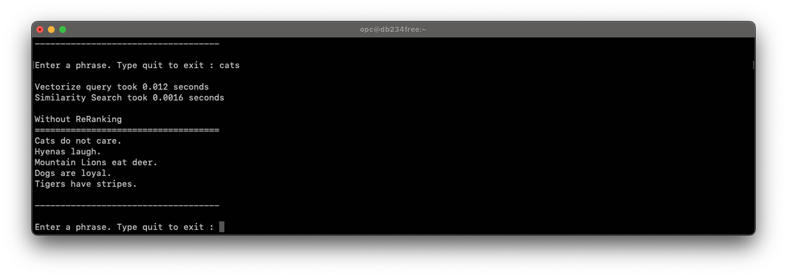


    The first thing you may notice is that the operation runs even faster now as we have already performed our database connection and authorization and the Sentence Transformers libraries are already loaded into memory too.

    Looking at the search output, not all the results are directly related to our search term: "cats", but there is definitely a correlation to all 5 results. Our own biases may cause us not to immediately see a correlation, but when you take a step back and consider the context of the terms, one could argue there is a correlation between "cats" and "dogs" when we consider articles and information that may been uploaded to the internet. Also, though not immediately obvious, Hyenas are more closely related to the Feline branch then the Canine branch. But more importantly from a contextual standpoint there are many articles that include hyenas, dogs and cats. So the results are very good when we consider our relatively small number of 150 terms.

5. If we try a more general term like "animals" we should see the following:

    Enter phrase: **animals**

    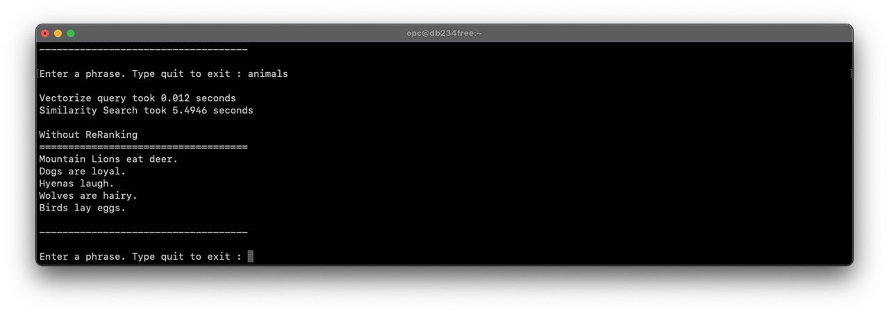


6. Let's try two queries related to New York...

    First we'll try "NY" and then "boroughs"

    Enter phrase: **NY**

    Enter phrase: **boroughs**

    This time you should see the following:

    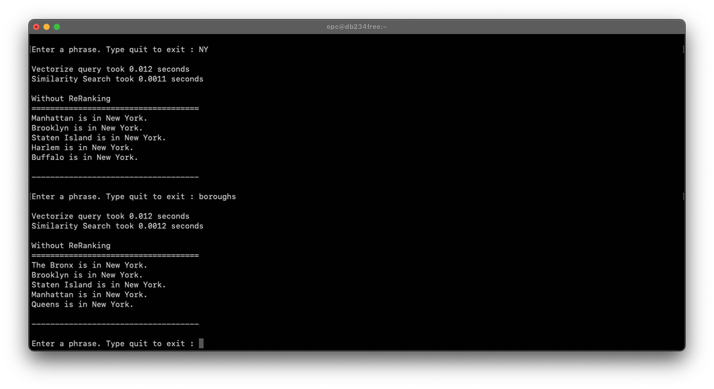

    This time we see results that are accurate. For "NY", the model returns the names of places located in the state of "New York" including "Buffalo". The second search for the term "boroughs" is also 100% accurate, we no longer see "Buffalo" listed, but instead see the five boroughs of New York City.

7. Another interesting query to test our results are for the phrase "New Zealand".

    Enter Phrase: **New Zealand**

    This time we see the following:

    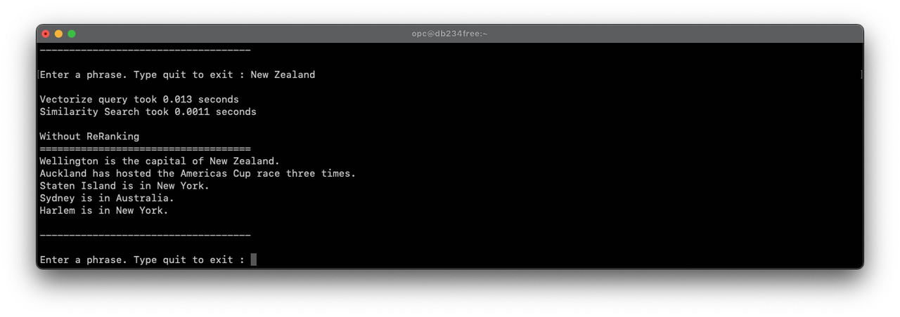

    Three of the results we see when using the Sentence Transformers embedding model appear to have nothing to do with "New Zealand", though they are geographic locations, so one could argue there is a minor correlation here. But when you factor in that we are only using a pool of 150 sentences to compare against this is powerful. Also upon further investigation, the name "Staten Landt" was the original name given to New Zealand by the first European to sight and record the land, so once again the power of similarity search with Sentence Transformers is impressive. 

## Task 5: Changing embedding models

So far, for the sake of simplicity and speed, we have been using the "all-MiniLM-L6-v2" embedding model. In the next step we will switch the embedding model to see how it impacts our similarity search results.

We will continue to use Sentence Transformers from Hugging Face, so the modifications required are minor.

In order to do this we will need to edit the Python program: similarity\_search\_SentenceTransformers.py. 
In this instance we will see what happens when we use a multilingual embedding model. We will switch from *"sentence-transformers/all-MiniLM-L6-v2"* to *"intfloat/multilingual-e5-large"*. This embedding model not only supports English, but also other languages including: German, Spanish, Japanese, Russian, Thai, etc

To switch embedding models you will need to comment out the line:

*embedding\_model = "sentence-transformers/all-MiniLM-L6-v2"*

and uncomment the line:

*embedding\_model = "intfloat/multilingual-e5-large"*.

1. To make this switch we will need to change the embedding model in both the programs:

    - *vectorize\_table\_SentenceTransformers.py*

    ```
      <copy>
      vi vectorize_table_SentenceTransformers.py
      </copy>
    ```

    - *similarity\_search\_SentenceTransformers.py*

    ```
      <copy>
      vi similarity_search_SentenceTransformers.py
      </copy>
    ```


    Both of your programs will look like this **BEFORE** making your modification-

    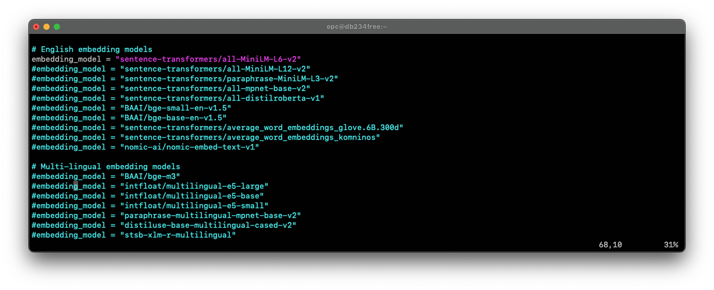


    Both of your programs will look like this **AFTER** making your modification-

    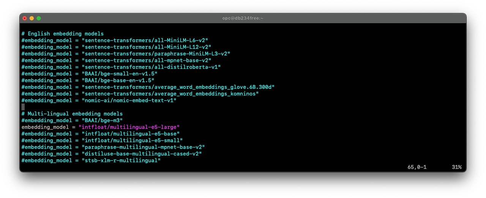


2. Before performing a similarity search the entries in the MY\_DATA table must be re-vectorized. To do this we need to run the *vectorize\_table\_SentenceTransformers.py* program as follows:


    ```
      <copy>
      python3.11 vectorize_table_SentenceTransformers.py
      </copy>
    ```

    You should see:

    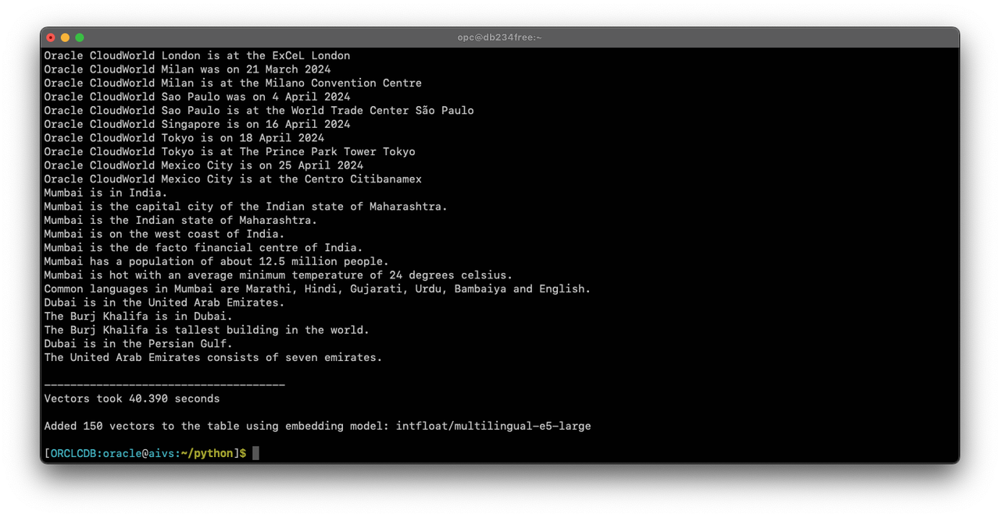


    Verify that the program is using the correct embedding model: *"intfloat/multilingual-e5-large"*

    **NOTE** If it's the first time you are using this embedding model there may be multiple libraries and modules that get downloaded and installed into your system. This is done automatically and there should be no manual intervention required, but this will require additional disk space (our lab system has been sized to accomodate this). Once the embedding model is installed, the data will be vectorized.  


3. We're now ready to try out our new model. As a baseline let's start with the term "cars".  But this time, we'll also perform the similarity search in Spanish "coche", French "voiture" and even a Spanish dialect "carros". What is interesting, is that while the phrases returned are all accurately related to the search phrase "cars", they are different results per language. This could be attributed to localized information that the embedding model was originally trained with.

    Enter Phrase: **cars**

    Enter Phrase: **coche**

    Enter Phrase: **voiture**

    Enter Phrase: **carros**

    You should see:

    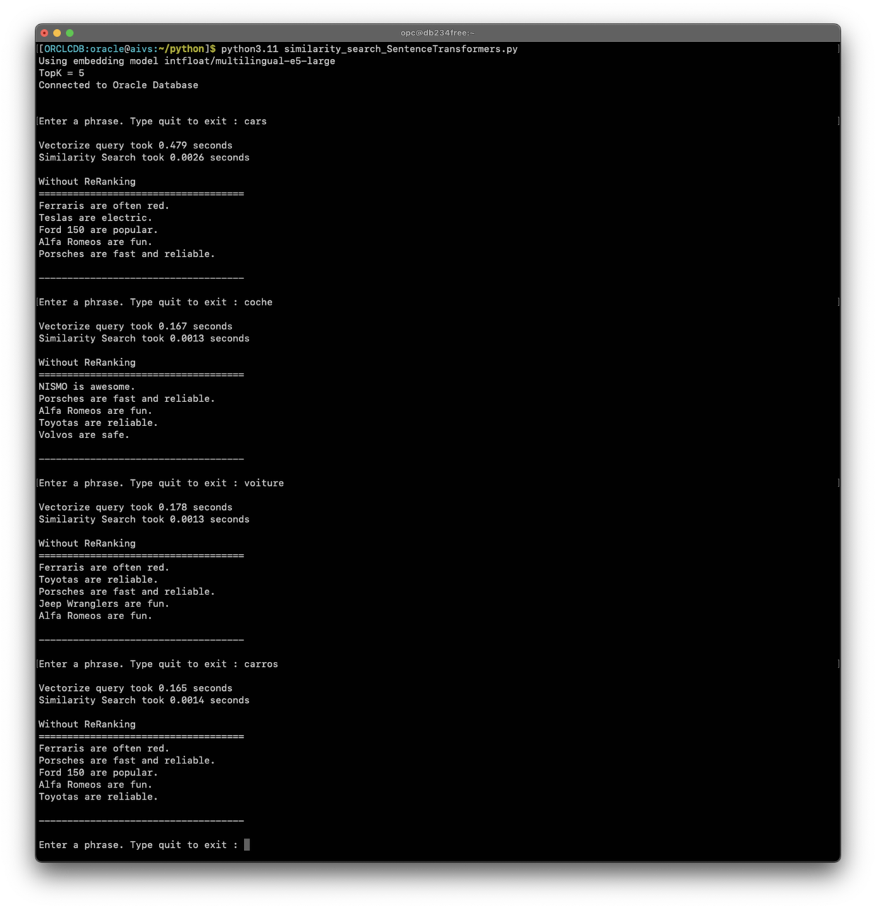


4. Let's also take a look at how the new model fares when we try our phrase "cats" and this time we'll also try German "katze" and Spanish "gato" as well to see what happens...    

    Enter Phrase: **cats**

    Enter Phrase: **katze**

    Enter Phrase: **gato**

    You should see:

    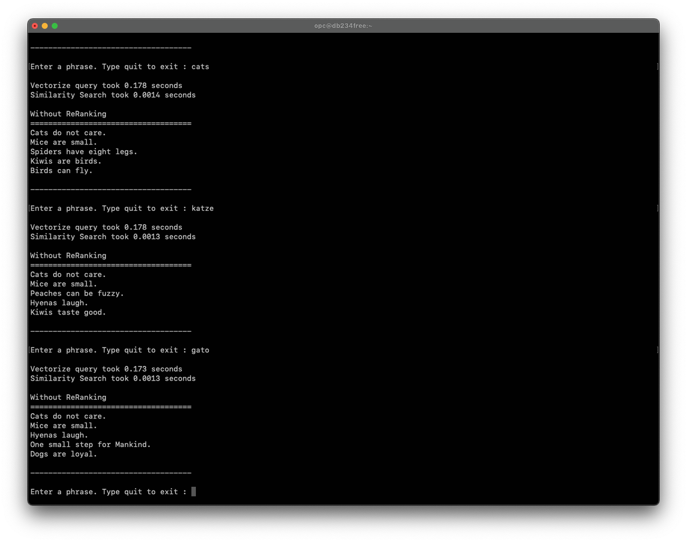


    This time the embedding model is fairly accurate for the first two responses for all 3 languages. But following that, the results are mixed. In the English version the results are at least within the animals grouping, but the German and Spanish results are a bit more random. Once again underscoring subtle nuances between differnt embedding models. But perhaps there is a recognizable correlation for German and Spanish speakers. 

    Feel free to try out some different terms and see what results you get.


## Summary

Congratulations you've completed the lab!

Hopefully you have seen how easy it is to use Sentence Transformers with Python and Oracle Vectors and Similarity Search. You are ready to move onto the next lab.

## APPENDIX 1: Installing Sentence Transformers libraries in your system

Sentence Transformers have already been installed on this hands-on-lab system. The information in this Appendix is for reference only in the event that you wish to install Sentence Transformers on your own system. 

As mentioned in the Introduction, Sentence Transformers are available from hugging face and can be installed and run locally on your system. Your system should have at least 50 Gigabytes of additional disk space available if you wish to install Sentence Transformers.

1. Our first step is to install the *sentence-transformers* packages from hugging face with *pip* (package installer for Python). While logged in as the oracle Linux user, run the following *pip* command:

    ```
      <copy>
      pip install -U sentence-transformers
      </copy>
    ```

    This may take a few minutes to perform (in our case 4 minutes and our available disk space shrunk by approximately 15G).

    You should see:

    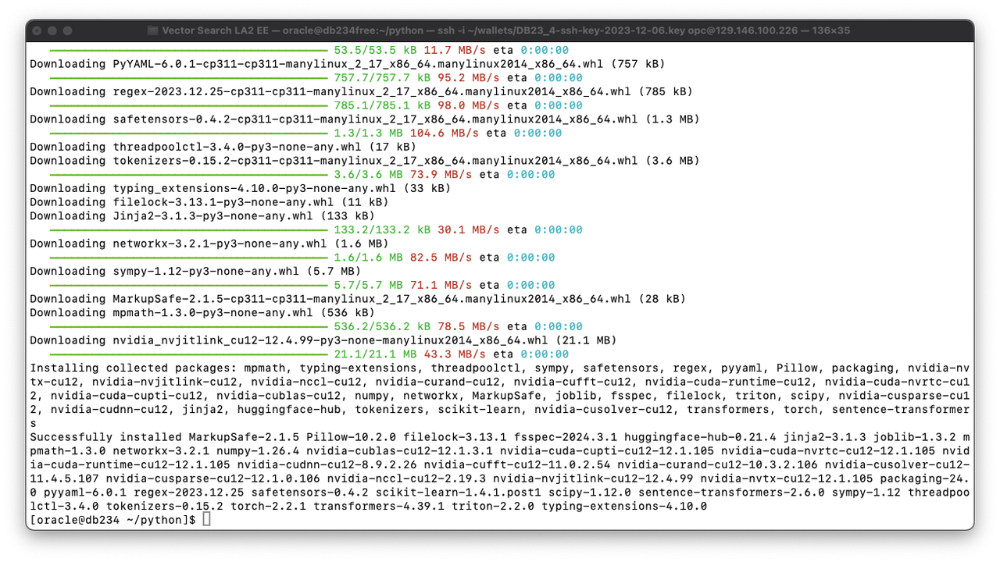


You should now be ready to proceed with using Sentence Transformers!

</if>


<if type="Cohere">
# Lab 2: Using Oracle OCI GenAI Cohere LLM for Vector Embedding Models


## Introduction

In this lab we will learn how to use the embedding models from the Oracle OCI GenAI Cohere service with vectors stored in Oracle Database 23ai.

------------
Estimated Time: 20 minutes

### Objectives


In this lab, you will learn how to perform the following Vector operations using Python:

* Task 1: Create and setup a table for the lab
* Task 2: Vectorizing a table with Oracle OCI GenAI Cohere embedding
* Task 3: Perform Similarity Search using Oracle OCI GenAI Cohere 


### Prerequisites

This lab assumes you have:
* An Oracle account
* Your workshop environment is configured (Completed Lab 0)
* Oracle Database 23ai is installed and running


## Task 1: Create and setup a table for the lab

**NOTE:** This Task can be skipped if you have already completed another lab in this workshop.

Our first step will be to create a table that we'll name: *MY\_DATA* to use for our lab exercises. The table will have three columns:

   | Column Name | Type | Nullable |
   | --- | --- | --- |
   | ID | Number | Not Null |
   | INFO | Varchar2(128) | |
   | V | Vector(*, *) | |

- The first column in our table is **ID**. It will be used as a unique identifier to reference each row in our table. We will be using this column to associate a Vector (Column: V) with our information (Column: INFO).  
- The second column in our table is **INFO**. This column will contain a string of text or phrase. The contents of this column will be the basis of our vectorization process and the related vector for the string will be stored in column V.
- The third column in our table is **V**. This is what we will use to store the vector for our string. We are not explicitly defining the vector type or size for this column as we will be storing vectors with different types and numbers of Dimensions.   

As the focus of this workshop is for Python programmers, we will use a Python program to create our table.

1. While logged into your Operating System as the Oracle user, create a file called *create\_schema.py* and paste the following contents into the file.

   **NOTE: The *create\_schema.py file may already exist in your lab environment. If so you're good to go, but it's not a bad idea to take a look at what the program is doing and the sample data we will be using for the workshop.**  


    ```
      <copy>
      # -----------------------------------------------------------------------------
      # Copyright (c) 2023, Oracle and/or its affiliates.
      #
      # This software is dual-licensed to you under the Universal Permissive License
      # (UPL) 1.0 as shown at https://oss.oracle.com/licenses/upl and Apache License
      # 2.0 as shown at http://www.apache.org/licenses/LICENSE-2.0. You may choose
      # either license.
      #
      # If you elect to accept the software under the Apache License, Version 2.0,
      # the following applies:
      #
      # Licensed under the Apache License, Version 2.0 (the "License");
      # you may not use this file except in compliance with the License.
      # You may obtain a copy of the License at
      #
      #    https://www.apache.org/licenses/LICENSE-2.0
      #
      # Unless required by applicable law or agreed to in writing, software
      # distributed under the License is distributed on an "AS IS" BASIS,
      # WITHOUT WARRANTIES OR CONDITIONS OF ANY KIND, either express or implied.
      # See the License for the specific language governing permissions and
      # limitations under the License.
      # -----------------------------------------------------------------------------
      #
      # Create the schema for the demostrations
      
      
      import os
      import sys
      
      import oracledb
      
      un = os.getenv("PYTHON_USERNAME")
      pw = os.getenv("PYTHON_PASSWORD")
      cs = os.getenv("PYTHON_CONNECTSTRING")
      
      # Connect to Oracle Database 23.4
      with oracledb.connect(user=un, password=pw, dsn=cs) as connection:
          db_version = tuple(int(s) for s in connection.version.split("."))[:2]
          if db_version < (23, 4):
              sys.exit("This example requires Oracle Database 23.4 or later")
          print("\nConnected to Oracle Database")
      
          print("Creating schema objects")
          with connection.cursor() as cursor:
              sql = [
                  """drop table if exists my_data purge""",
                  """create table if not exists my_data (
                       id   number primary key,
                       info varchar2(128),
                       v    vector)""",
              ]
              for s in sql:
                  try:
                      cursor.execute(s)
                  except oracledb.DatabaseError as e:
                      if e.args[0].code != 942:  # ignore ORA-942: table does not exist
                          raise
      
              data_to_insert = [
                  (1, "San Francisco is in California.", None),
                  (2, "San Jose is in California.", None),
                  (3, "Los Angeles is in California.", None),
                  (4, "Buffalo is in New York.", None),
                  (5, "Brooklyn is in New York.", None),
                  (6, "Queens is in New York.", None),
                  (7, "Harlem is in New York.", None),
                  (8, "The Bronx is in New York.", None),
                  (9, "Manhattan is in New York.", None),
                  (10, "Staten Island is in New York.", None),
                  (11, "Miami is in Florida.", None),
                  (12, "Tampa is in Florida.", None),
                  (13, "Orlando is in Florida.", None),
                  (14, "Dallas is in Texas.", None),
                  (15, "Houston is in Texas.", None),
                  (16, "Austin is in Texas.", None),
                  (17, "Phoenix is in Arizona.", None),
                  (18, "Las Vegas is in Nevada.", None),
                  (19, "Portland is in Oregon.", None),
                  (20, "New Orleans is in Louisiana.", None),
                  (21, "Atlanta is in Georgia.", None),
                  (22, "Chicago is in Illinois.", None),
                  (23, "Cleveland is in Ohio.", None),
                  (24, "Boston is in Massachusetts.", None),
                  (25, "Baltimore is in Maryland.", None),
                  (26, "Charlotte is in North Carolina.", None),
                  (27, "Raleigh is in North Carolina.", None),
                  (28, "Detroit is in Michigan.", None),
      
      
                  (100, "Ferraris are often red.", None),
                  (101, "Teslas are electric.", None),
                  (102, "Mini Coopers are small.", None),
                  (103, "Fiat 500 are small.", None),
                  (104, "Dodge Vipers are wide.", None),
                  (105, "Ford 150 are popular.", None),
                  (106, "Alfa Romeos are fun.", None),
                  (107, "Volvos are safe.", None),
                  (108, "Toyotas are reliable.", None),
                  (109, "Hondas are reliable.", None),
                  (110, "Porsches are fast and reliable.", None),
                  (111, "Nissan GTR are great.", None),
                  (112, "NISMO is awesome.", None),
                  (113, "Tesla Cybertrucks are big.", None),
                  (114, "Jeep Wranglers are fun.", None),
                  (115, "Lamborghinis are fast.", None),
      
                  (200, "Bananas are yellow.", None),
                  (201, "Kiwis are green inside.", None),
                  (202, "Kiwis are brown on the outside.", None),
                  (203, "Kiwis are birds.", None),
                  (204, "Kiwis taste good.", None),
                  (205, "Ripe strawberries are red.", None),
                  (206, "Apples can be green, yellow or red.", None),
                  (207, "Ripe cherries are red.", None),
                  (208, "Pears can be green, yellow or brown.", None),
                  (209, "Oranges are orange.", None),
                  (210, "Peaches can be yellow, orange or red.", None),
                  (211, "Peaches can be fuzzy.", None),
                  (212, "Grapes can be green, red or purple.", None),
                  (213, "Watermelons are green on the outside.", None),
                  (214, "Watermelons are red on the inside.", None),
                  (215, "Blueberries are blue.", None),
                  (216, "Limes are green.", None),
                  (217, "Lemons are yellow.", None),
                  (218, "Ripe tomatoes are red.", None),
                  (219, "Unripe tomatoes are green.", None),
                  (220, "Ripe raspberries are red.", None),
                  (221, "Mangoes can be yellow, gold, green or orange.", None),
      
                  (300, "Tigers have stripes.", None),
                  (301, "Lions are big.", None),
                  (302, "Mice are small.", None),
                  (303, "Cats do not care.", None),
                  (304, "Dogs are loyal.", None),
                  (305, "Bears are hairy.", None),
                  (306, "Pandas are black and white.", None),
                  (307, "Zebras are black and white.", None),
                  (308, "Penguins can be black and white.", None),
                  (309, "Puffins can be black and white.", None),
                  (310, "Giraffes have long necks.", None),
                  (311, "Elephants have trunks.", None),
                  (312, "Horses have four legs.", None),
                  (313, "Birds can fly.", None),
                  (314, "Birds lay eggs.", None),
                  (315, "Fish can swim.", None),
                  (316, "Sharks have lots of teeth.", None),
                  (317, "Flies can fly.", None),
                  (318, "Snakes have fangs.", None),
                  (319, "Hyenas laugh.", None),
                  (320, "Crocodiles lurk.", None),
                  (321, "Spiders have eight legs.", None),
                  (322, "Wolves are hairy.", None),
                  (323, "Mountain Lions eat deer.", None),
                  (324, "Kangaroos can hop.", None),
                  (325, "Turtles have shells.", None),
      
                  (400, "Ibaraki is in Kanto.", None),
                  (401, "Tochigi is in Kanto.", None),
                  (402, "Gunma is in Kanto.", None),
                  (403, "Saitama is in Kanto.", None),
                  (404, "Chiba is in Kanto.", None),
                  (405, "Tokyo is in Kanto.", None),
                  (406, "Kanagawa is in Kanto.", None),
      
                  (500, "Eggs are egg shaped.", None),
                  (501, "Sydney is in Australia.", None),
                  (502, "To be, or not to be, that is the question.", None),
                  (503, "640K ought to be enough for anybody.", None),
                  (504, "Man overboard.", None),
                  (505, "The world is your oyster.", None),
                  (506, "One small step for Mankind.", None),
                  (507, "Bitcoin is a cryptocurrency.", None),
                  (508, "Saturn has rings.", None),
                  (509, "Antarctica is very cold.", None),
                  (510, "Wellington is the capital of New Zealand.", None),
                  (511, "The Amazon River is the largest river by discharge.", None),
      
                  (600, "Catamarans have two hulls.", None),
                  (601, "Monohulls have a single hull.", None),
                  (602, "Foiling sailboats are fast.", None),
                  (603, "Cutters have two headsails.", None),
                  (604, "Yawls have two masts.", None),
                  (605, "Sloops have one mast.", None),
                  (606, "HMS Endeavour was a squared rigged ship.", None),
                  (607, "Auckland has hosted the Americas Cup race three times.", None),
                  (608, "Joshua Slocum sailed the first solo circumnavigation of the world.", None),
      
                  (900, 'Oracle CloudWorld Las Vegas was on September 18–21, 2023', None),
                  (901, 'Oracle CloudWorld Las Vegas was at The Venetian Convention and Expo Center', None),
                  (902, 'Oracle CloudWorld Dubai was on 23 January 2024', None),
                  (903, 'Oracle CloudWorld Dubai is at the Dubai World Trade Centre', None),
                  (904, 'Oracle CloudWorld Mumbai was on 14 February 2024', None),
                  (905, 'Oracle CloudWorld Mumbai is at the Jio World Convention Centre', None),
                  (906, 'Oracle CloudWorld London was on 14 March 2024', None),
                  (907, 'Oracle CloudWorld London is at the ExCeL London', None),
                  (908, 'Oracle CloudWorld Milan was on 21 March 2024', None),
                  (909, 'Oracle CloudWorld Milan is at the Milano Convention Centre', None),
                  (910, 'Oracle CloudWorld Sao Paulo was on 4 April 2024', None),
                  (911, 'Oracle CloudWorld Sao Paulo is at the World Trade Center São Paulo', None),
                  (912, 'Oracle CloudWorld Singapore is on 16 April 2024', None),
                  (914, 'Oracle CloudWorld Tokyo is on 18 April 2024', None),
                  (915, 'Oracle CloudWorld Tokyo is at The Prince Park Tower Tokyo', None),
                  (916, 'Oracle CloudWorld Mexico City is on 25 April 2024', None),
                  (917, 'Oracle CloudWorld Mexico City is at the Centro Citibanamex', None),
      
                  (1000, 'Mumbai is in India.', None),
                  (1001, 'Mumbai is the capital city of the Indian state of Maharashtra.', None),
                  (1002, 'Mumbai is the Indian state of Maharashtra.', None),
                  (1003, 'Mumbai is on the west coast of India.', None),
                  (1004, 'Mumbai is the de facto financial centre of India.', None),
                  (1005, 'Mumbai has a population of about 12.5 million people.', None),
                  (1006, 'Mumbai is hot with an average minimum temperature of 24 degrees celsius.', None),
                  (1007, 'Common languages in Mumbai are Marathi, Hindi, Gujarati, Urdu, Bambaiya and English.', None),
      
                  (1100, 'Dubai is in the United Arab Emirates.', None),
                  (1101, 'The Burj Khalifa is in Dubai.', None),
                  (1102, 'The Burj Khalifa is tallest building in the world.', None),
                  (1103, 'Dubai is in the Persian Gulf.', None),
                  (1104, 'The United Arab Emirates consists of seven emirates.', None),
              ]
      
              connection.autocommit = True
      
              cursor.executemany(
                  """insert into my_data (id, info, v)
                     values (:1, :2, :3)""",
                        data_to_insert,
                    )
            
            print("Created table MY_DATA and inserted sample data.")
      print("-----------------------------------------------\n")
      </copy>
    ```

2. Save the file and run it with *python3.11* as follows:

    ```
      <copy>
      python3.11 create_schema.py
      </copy>
    ```

    **NOTE:** There are no issues with running this program multiple times. However it will reset any data that may have been added to the table, including an vectors that you may have generated.

    You should see the following:

    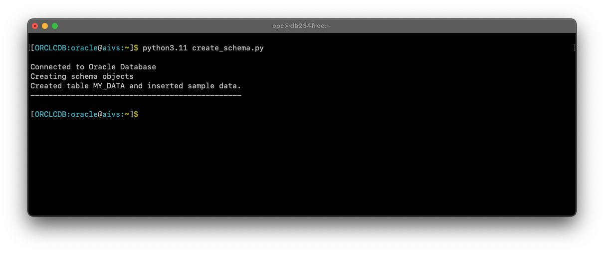

    To summarize what we've just done, the *create\_schema.py* program connects to the Oracle database, drops and creates a table called MY\_DATA. The program then inserts 150 rows of sample data. The table does not yet contain any Vector information. 
    
    We will be logging into the database to take a look at the contents of the MY\_DATA table in the next Task. 


## Task 2: Vectorizing a table with Oracle OCI GenAI Cohere embedding

1. The first step is to vectorize the contents of our table using an embedding model provided by Cohere. To do this, we will create a Python program to vectorize our phrases using an embedding model from the Oracle OCI Generative AI service.

While logged into your Operating System as the Oracle user, create a file called *vectorize\_table\_Cohere.py* and paste the following contents into the file.


    ```
      <copy>
      # -----------------------------------------------------------------------------
      # Copyright (c) 2023, Oracle and/or its affiliates.
      #
      # This software is dual-licensed to you under the Universal Permissive License
      # (UPL) 1.0 as shown at https://oss.oracle.com/licenses/upl and Apache License
      # 2.0 as shown at http://www.apache.org/licenses/LICENSE-2.0. You may choose
      # either license.
      #
      # If you elect to accept the software under the Apache License, Version 2.0,
      # the following applies:
      #
      # Licensed under the Apache License, Version 2.0 (the "License");
      # you may not use this file except in compliance with the License.
      # You may obtain a copy of the License at
      #
      #    https://www.apache.org/licenses/LICENSE-2.0
      #
      # Unless required by applicable law or agreed to in writing, software
      # distributed under the License is distributed on an "AS IS" BASIS,
      # WITHOUT WARRANTIES OR CONDITIONS OF ANY KIND, either express or implied.
      # See the License for the specific language governing permissions and
      # limitations under the License.
      # -----------------------------------------------------------------------------
      #
      
      
      import os
      import sys
      import array
      import time
      
      import oracledb
      import oci
      
      un = os.getenv("PYTHON_USERNAME")
      pw = os.getenv("PYTHON_PASSWORD")
      cs = os.getenv("PYTHON_CONNECTSTRING")
      
      query_sql = """select id, info
                     from my_data
                     order by 1"""
      
      update_sql = """update my_data 
                      set v = :1
                      where id = :2"""
      
      # -----------------------------------------------------------------------------
      # Setup OCI Configuration and Credentials
      
      CONFIG_PROFILE = "DEFAULT"
      config = oci.config.from_file('~/.oci/config', CONFIG_PROFILE)
      compartment_id = os.getenv("COMPARTMENT_ID")
      
      # Service endpoint
      endpoint = "https://inference.generativeai.us-chicago-1.oci.oraclecloud.com"
      generative_ai_inference_client = oci.generative_ai_inference.GenerativeAiInferenceClient(config=config, service_endpoint=endpoint, retry_strategy=oci.retry.NoneRetryStrategy(), timeout=(10,240))
      
      # Use the Cohere embed-english-v3.0 model to create the vectors
      # Add or update the vectors for all data values in a table      
      embedding_model = "cohere.embed-english-v3.0"
      #embedding_model = "cohere.embed-english-light-v3.0"
      #embedding_model = "cohere.embed-multilingual-light-v3.0"
      #embedding_model = "cohere.embed-multilingual-v3.0"
      
      # Set the following value to 1 if using a Cohere trial key or running 
      # Oracle OCI Generative AI Service
      use_free_key = 1

      # -----------------------------------------------------------------------------
      
      # Whether to generate int8 or float embeddings
      use_int_8 = 0
      if use_int_8:
          the_type = "int8"
          print("Using INT8 embeddings")
      else:
          the_type = "float"
          print("Using float embeddings")
      
      
      # -----------------------------------------------------------------------------
      # Connect to Oracle Database 23.4
      with oracledb.connect(user=un, password=pw, dsn=cs) as connection:
          db_version = tuple(int(s) for s in connection.version.split("."))[:2]
          if db_version < (23, 4):
              sys.exit("\nThis example requires Oracle Database 23.4 or later")
          print("\nConnected to Oracle Database\n")
      
          with connection.cursor() as cursor:
              print("Vectorizing the following data:\n")
      
              # Loop over the rows and vectorize the VARCHAR2 data
      
              binds = []
              tic = time.perf_counter()
              for id_val, info in cursor.execute(query_sql):
      
                  # Convert to format that Cohere wants
                  data = [info]
                  print(info)
      
                  # Use OCI GenAI Cohere to embed the data
                  embed_text_detail = oci.generative_ai_inference.models.EmbedTextDetails()
                  embed_text_detail.serving_mode = oci.generative_ai_inference.models.OnDemandServingMode(model_id=embedding_model)
                  embed_text_detail.inputs = data
                  embed_text_detail.truncate = "NONE"
                  embed_text_detail.compartment_id = compartment_id
                  embed_text_response = generative_ai_inference_client.embed_text(embed_text_detail)
      
                  # Extract the vector from the JSON object
                  # and convert to array format
                  vec = array.array("f", embed_text_response.data.embeddings[0])
      
                  # Record the array and key
                  binds.append([vec, id_val])
      
                  # Sleep for half a second if the Cohere API Key is a free key
                  # or if no key provided
                  if use_free_key:
                      time.sleep(.5)
      
              toc = time.perf_counter()
      
              # Do an update to add or replace the vector values
              cursor.executemany(
                  update_sql,
                  binds,
              )
              connection.commit()
      
              print(f"\nVectors took {toc - tic:0.3f} seconds")
              print(f"\nAdded {len(binds)} vectors to the table using embedding model: " + embedding_model + "\n")
      </copy>
    ```

2. Save the file and run it with *python3.11* as follows:


    ```
      <copy>
      python3.11 vectorize_table_Cohere.py
      </copy>
    ```

    When the program finishes running, you should see something similar to the following-

    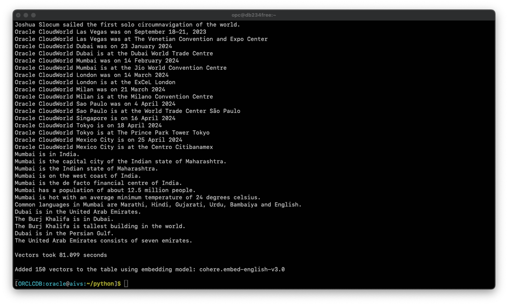

   **Note:** Running the program in this workshop environment takes around 80 seconds to run. This is because there is programmed delay that adds a half second delay between every vectorize operation. In a non workshop environment this operation will run many times faster (less than 3 seconds in our tests)

To summarize what we've just done, the *vectorize\_table\_Cohere.py* program connects to the Oracle database, retrieves the text from the INFO column of the MY\_DATA table, and vectorizes the "factoid" for each of the 150 rows. We then store the vectorized data as a vector in the column called: V. You will also notice that the program uses the *cohere.embed-english-v3.0* embedding model for this operation. In other words an English speaking embedding model, this model creates a vector with 1024 dimensions.

3. Before we move onto performing Similarity Searches using Cohere embedding models, we should take a look in the the Oracle database to see the updates made to the *MY\_DATA* table.

    3.a Connect to your Oracle database as the user: **vector** with password: **vector**

    ```
      <copy>
      sqlplus vector/vector@orclpdb1
      </copy>
    ```

    3.b We can now query the *MY\_DATA* table to verify that all 150 rows have been updated.

    ```
      <copy>
      select count(*) from MY_DATA where V is not null;
      </copy>
    ```


    You should see:

    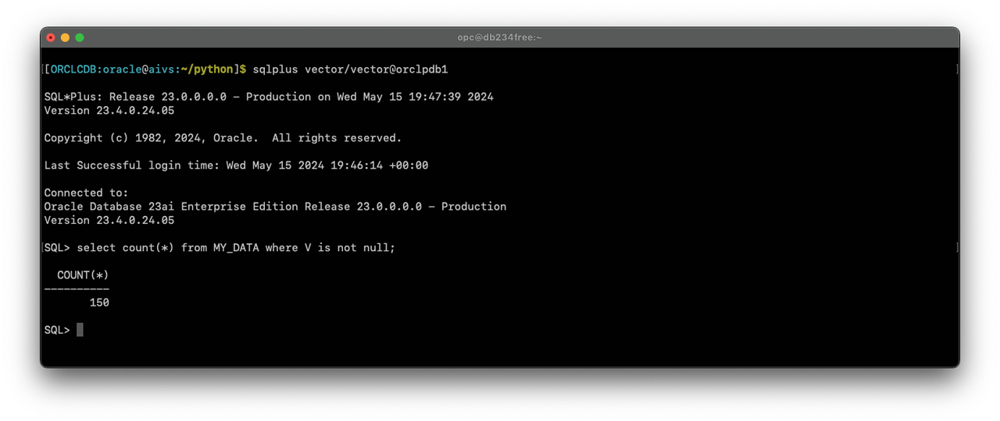


    3.c We can also query the vector column: V in the MY\_DATA table to see what the vectors and dimensions look like.

    ```
      <copy>
      select V from MY_DATA;
      </copy>
    ```

    You should see something similar to this-

    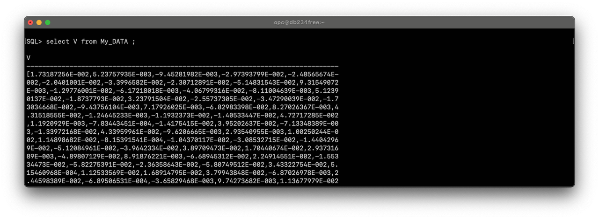

    and

    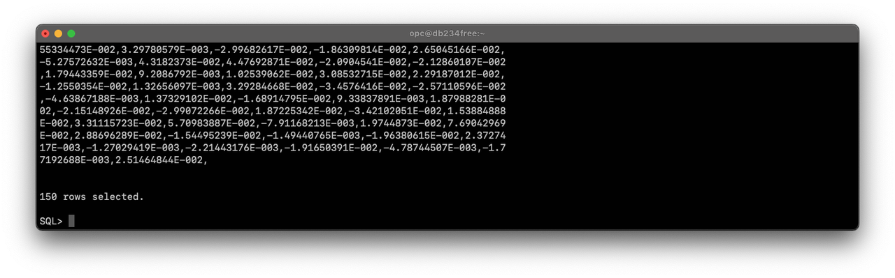

    This is the semantic representation of the data stored in the INFO column for the corresponding row.

    Now that we have vectorized the data in our table and confirmed the updates, we are ready to move onto the next task which is performing Similarity Searches using our Vectors.


## Task 3: Perform Similarity Search using Oracle OCI GenAI Cohere 

In this lab we will see how to perform a similarity search with the Oracle OCI GenAI Cohere embedding models using python.

So far we have vectorized the data in the *MY\_DATA* table using the Oracle OCI GenAI Cohere embedding model, we can now start performing Similarity Searches using the Vectors stored in column "V" in the table. Even though the data in our table has been vectorized we will still need to perform a "vectorize" operation, as the search phrase needs to also be vectorized using the same embedding model. The search phrase is entered on the fly, vectorized, and then used to search against the vectors stored in our MY\_DATA table in the database. We will create a Python program to do this.


1. While logged into your Operating System as the Oracle user, create a file called *similarity\_search\_Cohere.py* and paste the following contents into the file.

    ```
      <copy>
      # -----------------------------------------------------------------------------
      # Copyright (c) 2023, Oracle and/or its affiliates.
      #
      # This software is dual-licensed to you under the Universal Permissive License
      # (UPL) 1.0 as shown at https://oss.oracle.com/licenses/upl and Apache License
      # 2.0 as shown at http://www.apache.org/licenses/LICENSE-2.0. You may choose
      # either license.
      #
      # If you elect to accept the software under the Apache License, Version 2.0,
      # the following applies:
      #
      # Licensed under the Apache License, Version 2.0 (the "License");
      # you may not use this file except in compliance with the License.
      # You may obtain a copy of the License at
      #
      #    https://www.apache.org/licenses/LICENSE-2.0
      #
      # Unless required by applicable law or agreed to in writing, software
      # distributed under the License is distributed on an "AS IS" BASIS,
      # WITHOUT WARRANTIES OR CONDITIONS OF ANY KIND, either express or implied.
      # See the License for the specific language governing permissions and
      # limitations under the License.
      # -----------------------------------------------------------------------------
      #
      # Basic Similarity Search using the Cohere embed-english-light-v3.0 model
      #
      
      import os
      import sys
      import array
      import time
      
      import oracledb
      import oci
      
      # -----------------------------------------------------------------------------
      # Setup OCI Config and Credentials
      # Setup basic variables
      
      CONFIG_PROFILE = "DEFAULT"
      config = oci.config.from_file('~/.oci/config', CONFIG_PROFILE)
      compartment_id = os.getenv("COMPARTMENT_ID")
      
      # Service endpoint
      endpoint = "https://inference.generativeai.us-chicago-1.oci.oraclecloud.com"
      generative_ai_inference_client = oci.generative_ai_inference.GenerativeAiInferenceClient(config=config, service_endpoint=endpoint, retry_strategy=oci.retry.NoneRetryStrategy(), timeout=(10,240))
      
      # Use the cohere.embed-english-v3.0 model to create the vectors
      # Additional embedding models are available for use
      embedding_model =  "cohere.embed-english-v3.0"
      #embedding_model =  "cohere.embed-english-light-v3.0"
      #embedding_model =  "cohere.embed-english-v2.0"
      #embedding_model =  "cohere.embed-multilingual-light-v3.0"
      #embedding_model =  "cohere.embed-multilingual-v3.0"
      
      un = os.getenv("PYTHON_USERNAME")
      pw = os.getenv("PYTHON_PASSWORD")
      cs = os.getenv("PYTHON_CONNECTSTRING")
      
      # topK sets how many rows to return
      topK = 5
      
      # -----------------------------------------------------------------------------
      
      sql = """select info
               from my_data
               order by vector_distance(v, :1, COSINE)
               fetch first :2 rows only"""
      
      print("\nUsing embedding model " + embedding_model)
      print("TopK = " + str(topK))
      
      # Whether to generate int8 or float embeddings
      use_int_8 = 0
      if use_int_8:
          the_type = "int8"
          print("Using INT8 embeddings")
      else:
          the_type = "float"
          print("Using float embeddings")
      
      # Connect to Oracle Database 23.4
      with oracledb.connect(user=un, password=pw, dsn=cs) as connection:
          db_version = tuple(int(s) for s in connection.version.split("."))[:2]
          if db_version < (23, 4):
              sys.exit("This example requires Oracle Database 23.4 or later")
          print("Connected to Oracle Database")
      
          with connection.cursor() as cursor:
      
              while True:
                  # Get the input text to vectorize
                  text = input("\nEnter a phrase. Type quit to exit : ")
      
                  if (text == "quit") or (text == "exit"):
                      break
      
                  if text == "":
                      continue
      
                  # Create the vector embedding [a JSON object]
                  sentence = [text]
      
                  tic = time.perf_counter()
      
                  binds = []
      
                  # Use OCI GenAI Cohere to embed the sentence [a JSON object]
                  embed_text_detail = oci.generative_ai_inference.models.EmbedTextDetails()
                  embed_text_detail.serving_mode = oci.generative_ai_inference.models.OnDemandServingMode(model_id=embedding_model)
                  embed_text_detail.inputs = sentence
                  embed_text_detail.truncate = "NONE"
                  embed_text_detail.compartment_id = compartment_id
                  embed_text_response = generative_ai_inference_client.embed_text(embed_text_detail)
      
                  # Extract the vector from the JSON object
                  # and convert to array format
                  vec = array.array("f", embed_text_response.data.embeddings[0])
      
                  toc = time.perf_counter()
                  print(f"\nVectorize query took {toc - tic:0.3f} seconds")
      
                  docs = []
      
                  tic = time.perf_counter()
      
                  # Perform the Similarity Search operation
                  cursor.execute(sql, [vec, topK]) 
      
                  for (info,) in cursor.execute(sql, [vec, topK]): 
      
                      # Copy the resultset to a list of docs
                      docs.append(info)
      
                  toc = time.perf_counter()
                  print(f"Similarity Search took {toc - tic:0.3f} seconds")
      
                  print("\nResults:\n------------------------------------\n")
                  for hit in docs:
                    print(hit)
      
                  print("\n------------------------------------")
      </copy>
    ```

**NOTE:** This program does not require any modifications to run.

2. Save the file and run it with *python3.11* as follows:

    ```
      <copy>
      python3.11 similarity_search_Cohere.py
      </copy>
    ```

    You should see the following:

    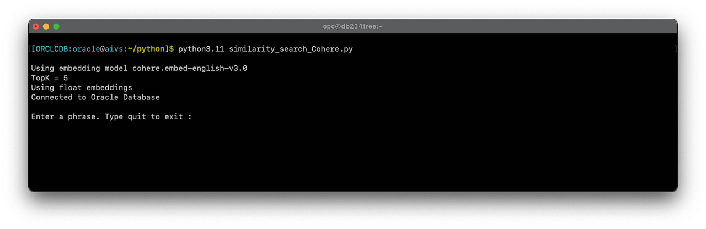

    The first thing you should notice is that the embedding model: "cohere.embed-english-v3.0" is being used. The similarity search must use the same embedding model as the vectors stored in the MY\_DATA table. You will also notice:

    - We are only looking at the TopK 5 - or nearest 5 results
    - We are connecting to the Oracle database with the *oracledb* Python library
    - We are using "float" embeddings. As opposed to "Int8"

3. For our first example let's try the phrase "cars and see what is returned.

    Enter phrase **cars**   

    You should see something similar to:

    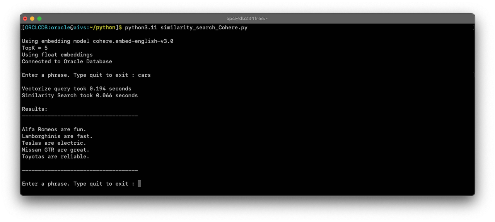

    It's possible that your times will be different to ours, as the time includes a network roundtrip and api call. With that being the case, we can see that the first operation is to vectorize our phrase, in this case "cars", and that it took 0.194 seconds.

    - Next we can see that the similarity search took 0.066 seconds (or 66 milliseconds) to locate 5 related entries to the word "cars".

    - The 5 rows returned are the 5 *most semantically* similar to our phrase *cars* from our sample data in the MY\_DATA table.

    - The results themselves look like a "good" result as all 5 of the factoids appear to be on-point with the phrase "cars".  


4. Next we can type in the word "cats"

    Enter phrase **cats**

    You should see something similar to:

    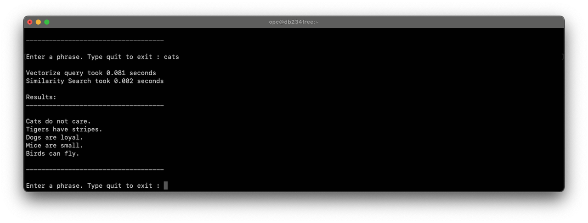

    This time, on the surface, the output does not appear to have the same level of accuracy. The first two results are definitely on target. But the following 3 sentences do not appear to be specifically about cats, however, if you take a moment to consider that "dogs", "mice" and "birds" are frequently used in the same context as cats, there is a correlation between all of these animals and "cats".

    The whole point about Similarity Search is that it is not necessarily exactly correct, it is the best match given the available data while using the given embedding model. The model is trained using information available from the internet and other publicly sourced information.


5. We can also try other search phrases for example "NY", or even "fruit".

    Enter phrase **fruit**

    Enter phrase **NY**

    You should see something similar to:

    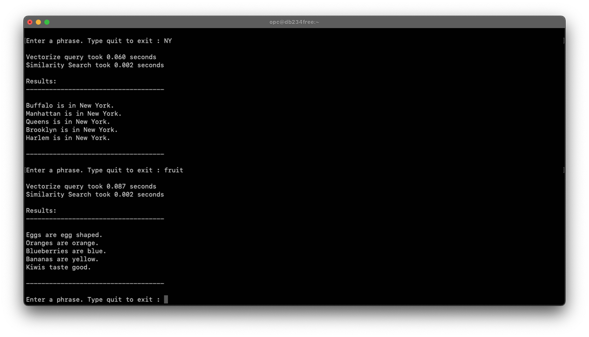

    In the first example, the term "NY" appears to be on-point. Even though the word "NY" is not in the sentences themselves, all 5 include places located in the state of "New York". 

    In the second example, when we used the word "fruit", the first result "Eggs" appears to have no correlation to "fruit". However the next four sentences directly correlate to our term. Here we should emphasize, it is important to understand that the search is not an exact match or substring search. Instead the results are looking for similar data based on their  vectorized representation.
    

6. Next we can search for the term "Boroughs".

   Enter phrase **Boroughs**
    
   You should see something similar to:

   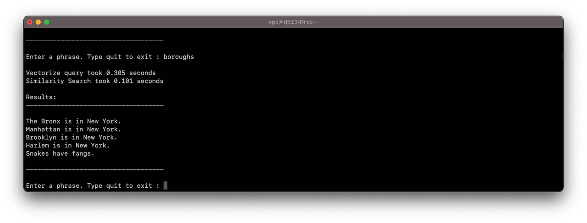


    This phrase directs our similarity search to information related specifically to New York City. The first three entries are indeed Boroughs in New York City. However the fourth result "Harlem", while being a neighbourhood in New York City, is not actually a borough. However the fifth result returned has no connection or correlation to the Boroughs of New York City.
    
    **NOTE: We do have entries for the remaining 2 Boroughs: "Staten Island" and "Queens" in our MY\_DATA table, but once again we can see Similarity Search does not guarantee an exact answer. This is where choosing the correct embedding model can influence your results.**


7. For another experiment, we can enter the word "Bombay". 

   Enter phrase **Bombay**
    
   You should see something similar to:

   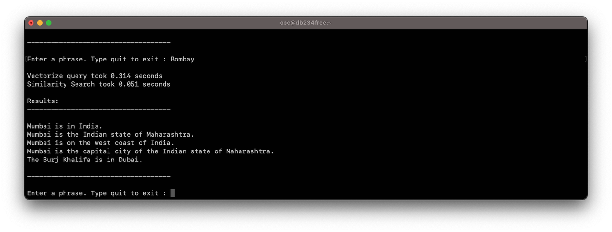


    The word "Bombay" does not appear any where in our data set, but the results related to Mumbai are correct because "Bombay" is the former name for "Mumbai", and as such there is a strong correlation between the two names for the same geographic location. So if we disregard the fifth result, the other items are on-target.

    Remember, similarity search works on the basis of the trained data from which the embedding models were trained. Many embedding models use text sourced from the internet and it is very likely that there is information that includes both the names "Bombay" and "Mumbai" in relation to the same place.


  Feel free to try other queries including repeating some of the previous examples we entered using other embedding models for your own comparison.


## Summary

Congratulations you've completed the lab!

Hopefully you have seen how easy it is to use Oracle OCI GenAI Cohere with Python and Oracle Database 23.4 Vectors with Similarity Search. You are ready to move onto trying this at home.

</if>


<if type="FastEmbed">

# Lab 3: Using FastEmbed and Python with Oracle AI Vector Search

## Introduction

In this lab we will be using FastEmbed.  FastEmbed uses the Hugging Face vector embedding models, which are usually sentence transformers *(Sentence Transformers are covered in a separate lab)* . But instead of using the Python runtime to execute the embedding models, FastEmbed uses the open source project: *ONNX-runtime* which is then called from our Python programs.

ONNX is a common file format that can be used to convert between different machine learning models, the ONNX-runtime is a C++ library which allows you to run models in the ONNX file format.

So for this lab we will take open source embedding models and transform them to the ONNX file format so we can then use the ONNX runtime. The model is using FastEmbed, so essentially, it's using a wrapper to a wrapper to the Python apis. This is not only done for convenience, but also so that it's less work for the end-user, because the embedding models are ready to go.

Also, just as with Sentence Transformers, FastEmbed uses the the vector embedding models from Hugging Face, so not only are they open source and therefore free to use, they can be installed locally. This means they can be accessed by making a function call to a local library, rather than a REST call over a network.


------------
Estimated Time: 20 minutes

### Objectives

In this lab, you will perform the following tasks:
* Task 1: Create and setup a table for the lab
* Task 2: Vectorizing a table with FastEmbed
* Task 3: Understanding the Vector Embedding processing
* Task 4: View the Vector updates in the Database
* Task 5: Perform Similarity Search with FastEmbed
* Task 6: Changing embedding models

* APPENDIX 1: Installing FastEmbed Packages in your system


### Prerequisites

This lab assumes you have:
* An Oracle account
* An Oracle Database 23.4 preinstalled
* Your workshop environment is configured (Completed Lab 0)


## Task 1: Create and setup a table for the lab

**NOTE:** This Task can be skipped if you have already completed another lab in this workshop. As the table should already exist.

Our first step will be to create a table that we'll name: *MY\_DATA* to use for our lab exercises. The table will have three columns:

 | Column Name | Type | Nullable |
 | --- | --- | --- |
 | ID | Number | Not Null |
 | INFO | Varchar2(128) | |
 | V | Vector(*, *) | |

- The first column in our table is **ID**. It will be used as a unique identifier to reference each row in our table. We will be using this column to associate a Vector (Column: V) with our information (Column: INFO).  
- The second column in our table is **INFO**. This column will contain a string of text or phrase. The contents of this column will be the basis of our vectorization process and the related vector for the string will be stored in column V.
- The third column in our table is **V**. This is what we will use to store the vector for our string. We are not explicitly defining the vector type or size for this column as we will be storing vectors with different types and numbers of Dimensions.   

As the focus of this workshop is for Python programmers, we will use a Python program to create our table.

1. While logged into your Operating System as the Oracle user, create a file called *create\_schema.py* and paste the following contents into the file.

   **NOTE: The *create\_schema.py file may already exist in your lab environment. If so, you're good to go, but it's not a bad idea to take a look at what the program is doing and the sample data we will be using for the workshop.**  


    ```
      <copy>
      # -----------------------------------------------------------------------------
      # Copyright (c) 2023, Oracle and/or its affiliates.
      #
      # This software is dual-licensed to you under the Universal Permissive License
      # (UPL) 1.0 as shown at https://oss.oracle.com/licenses/upl and Apache License
      # 2.0 as shown at http://www.apache.org/licenses/LICENSE-2.0. You may choose
      # either license.
      #
      # If you elect to accept the software under the Apache License, Version 2.0,
      # the following applies:
      #
      # Licensed under the Apache License, Version 2.0 (the "License");
      # you may not use this file except in compliance with the License.
      # You may obtain a copy of the License at
      #
      #    https://www.apache.org/licenses/LICENSE-2.0
      #
      # Unless required by applicable law or agreed to in writing, software
      # distributed under the License is distributed on an "AS IS" BASIS,
      # WITHOUT WARRANTIES OR CONDITIONS OF ANY KIND, either express or implied.
      # See the License for the specific language governing permissions and
      # limitations under the License.
      # -----------------------------------------------------------------------------
      #
      # Create the schema for the demostrations
      
      
      import os
      import sys
      
      import oracledb
      
      un = os.getenv("PYTHON_USERNAME")
      pw = os.getenv("PYTHON_PASSWORD")
      cs = os.getenv("PYTHON_CONNECTSTRING")
      
      # Connect to Oracle Database 23.4
      with oracledb.connect(user=un, password=pw, dsn=cs) as connection:
          db_version = tuple(int(s) for s in connection.version.split("."))[:2]
          if db_version < (23, 4):
              sys.exit("This example requires Oracle Database 23.4 or later")
          print("\nConnected to Oracle Database")
      
          print("Creating schema objects")
          with connection.cursor() as cursor:
              sql = [
                  """drop table if exists my_data purge""",
                  """create table if not exists my_data (
                       id   number primary key,
                       info varchar2(128),
                       v    vector)""",
              ]
              for s in sql:
                  try:
                      cursor.execute(s)
                  except oracledb.DatabaseError as e:
                      if e.args[0].code != 942:  # ignore ORA-942: table does not exist
                          raise
      
              data_to_insert = [
                  (1, "San Francisco is in California.", None),
                  (2, "San Jose is in California.", None),
                  (3, "Los Angeles is in California.", None),
                  (4, "Buffalo is in New York.", None),
                  (5, "Brooklyn is in New York.", None),
                  (6, "Queens is in New York.", None),
                  (7, "Harlem is in New York.", None),
                  (8, "The Bronx is in New York.", None),
                  (9, "Manhattan is in New York.", None),
                  (10, "Staten Island is in New York.", None),
                  (11, "Miami is in Florida.", None),
                  (12, "Tampa is in Florida.", None),
                  (13, "Orlando is in Florida.", None),
                  (14, "Dallas is in Texas.", None),
                  (15, "Houston is in Texas.", None),
                  (16, "Austin is in Texas.", None),
                  (17, "Phoenix is in Arizona.", None),
                  (18, "Las Vegas is in Nevada.", None),
                  (19, "Portland is in Oregon.", None),
                  (20, "New Orleans is in Louisiana.", None),
                  (21, "Atlanta is in Georgia.", None),
                  (22, "Chicago is in Illinois.", None),
                  (23, "Cleveland is in Ohio.", None),
                  (24, "Boston is in Massachusetts.", None),
                  (25, "Baltimore is in Maryland.", None),
                  (26, "Charlotte is in North Carolina.", None),
                  (27, "Raleigh is in North Carolina.", None),
                  (28, "Detroit is in Michigan.", None),
      
      
                  (100, "Ferraris are often red.", None),
                  (101, "Teslas are electric.", None),
                  (102, "Mini Coopers are small.", None),
                  (103, "Fiat 500 are small.", None),
                  (104, "Dodge Vipers are wide.", None),
                  (105, "Ford 150 are popular.", None),
                  (106, "Alfa Romeos are fun.", None),
                  (107, "Volvos are safe.", None),
                  (108, "Toyotas are reliable.", None),
                  (109, "Hondas are reliable.", None),
                  (110, "Porsches are fast and reliable.", None),
                  (111, "Nissan GTR are great.", None),
                  (112, "NISMO is awesome.", None),
                  (113, "Tesla Cybertrucks are big.", None),
                  (114, "Jeep Wranglers are fun.", None),
                  (115, "Lamborghinis are fast.", None),
      
                  (200, "Bananas are yellow.", None),
                  (201, "Kiwis are green inside.", None),
                  (202, "Kiwis are brown on the outside.", None),
                  (203, "Kiwis are birds.", None),
                  (204, "Kiwis taste good.", None),
                  (205, "Ripe strawberries are red.", None),
                  (206, "Apples can be green, yellow or red.", None),
                  (207, "Ripe cherries are red.", None),
                  (208, "Pears can be green, yellow or brown.", None),
                  (209, "Oranges are orange.", None),
                  (210, "Peaches can be yellow, orange or red.", None),
                  (211, "Peaches can be fuzzy.", None),
                  (212, "Grapes can be green, red or purple.", None),
                  (213, "Watermelons are green on the outside.", None),
                  (214, "Watermelons are red on the inside.", None),
                  (215, "Blueberries are blue.", None),
                  (216, "Limes are green.", None),
                  (217, "Lemons are yellow.", None),
                  (218, "Ripe tomatoes are red.", None),
                  (219, "Unripe tomatoes are green.", None),
                  (220, "Ripe raspberries are red.", None),
                  (221, "Mangoes can be yellow, gold, green or orange.", None),
      
                  (300, "Tigers have stripes.", None),
                  (301, "Lions are big.", None),
                  (302, "Mice are small.", None),
                  (303, "Cats do not care.", None),
                  (304, "Dogs are loyal.", None),
                  (305, "Bears are hairy.", None),
                  (306, "Pandas are black and white.", None),
                  (307, "Zebras are black and white.", None),
                  (308, "Penguins can be black and white.", None),
                  (309, "Puffins can be black and white.", None),
                  (310, "Giraffes have long necks.", None),
                  (311, "Elephants have trunks.", None),
                  (312, "Horses have four legs.", None),
                  (313, "Birds can fly.", None),
                  (314, "Birds lay eggs.", None),
                  (315, "Fish can swim.", None),
                  (316, "Sharks have lots of teeth.", None),
                  (317, "Flies can fly.", None),
                  (318, "Snakes have fangs.", None),
                  (319, "Hyenas laugh.", None),
                  (320, "Crocodiles lurk.", None),
                  (321, "Spiders have eight legs.", None),
                  (322, "Wolves are hairy.", None),
                  (323, "Mountain Lions eat deer.", None),
                  (324, "Kangaroos can hop.", None),
                  (325, "Turtles have shells.", None),
      
                  (400, "Ibaraki is in Kanto.", None),
                  (401, "Tochigi is in Kanto.", None),
                  (402, "Gunma is in Kanto.", None),
                  (403, "Saitama is in Kanto.", None),
                  (404, "Chiba is in Kanto.", None),
                  (405, "Tokyo is in Kanto.", None),
                  (406, "Kanagawa is in Kanto.", None),
      
                  (500, "Eggs are egg shaped.", None),
                  (501, "Sydney is in Australia.", None),
                  (502, "To be, or not to be, that is the question.", None),
                  (503, "640K ought to be enough for anybody.", None),
                  (504, "Man overboard.", None),
                  (505, "The world is your oyster.", None),
                  (506, "One small step for Mankind.", None),
                  (507, "Bitcoin is a cryptocurrency.", None),
                  (508, "Saturn has rings.", None),
                  (509, "Antarctica is very cold.", None),
                  (510, "Wellington is the capital of New Zealand.", None),
                  (511, "The Amazon River is the largest river by discharge.", None),
      
                  (600, "Catamarans have two hulls.", None),
                  (601, "Monohulls have a single hull.", None),
                  (602, "Foiling sailboats are fast.", None),
                  (603, "Cutters have two headsails.", None),
                  (604, "Yawls have two masts.", None),
                  (605, "Sloops have one mast.", None),
                  (606, "HMS Endeavour was a squared rigged ship.", None),
                  (607, "Auckland has hosted the Americas Cup race three times.", None),
                  (608, "Joshua Slocum sailed the first solo circumnavigation of the world.", None),
      
                  (900, 'Oracle CloudWorld Las Vegas was on September 18–21, 2023', None),
                  (901, 'Oracle CloudWorld Las Vegas was at The Venetian Convention and Expo Center', None),
                  (902, 'Oracle CloudWorld Dubai was on 23 January 2024', None),
                  (903, 'Oracle CloudWorld Dubai is at the Dubai World Trade Centre', None),
                  (904, 'Oracle CloudWorld Mumbai was on 14 February 2024', None),
                  (905, 'Oracle CloudWorld Mumbai is at the Jio World Convention Centre', None),
                  (906, 'Oracle CloudWorld London was on 14 March 2024', None),
                  (907, 'Oracle CloudWorld London is at the ExCeL London', None),
                  (908, 'Oracle CloudWorld Milan was on 21 March 2024', None),
                  (909, 'Oracle CloudWorld Milan is at the Milano Convention Centre', None),
                  (910, 'Oracle CloudWorld Sao Paulo was on 4 April 2024', None),
                  (911, 'Oracle CloudWorld Sao Paulo is at the World Trade Center São Paulo', None),
                  (912, 'Oracle CloudWorld Singapore is on 16 April 2024', None),
                  (914, 'Oracle CloudWorld Tokyo is on 18 April 2024', None),
                  (915, 'Oracle CloudWorld Tokyo is at The Prince Park Tower Tokyo', None),
                  (916, 'Oracle CloudWorld Mexico City is on 25 April 2024', None),
                  (917, 'Oracle CloudWorld Mexico City is at the Centro Citibanamex', None),
      
                  (1000, 'Mumbai is in India.', None),
                  (1001, 'Mumbai is the capital city of the Indian state of Maharashtra.', None),
                  (1002, 'Mumbai is the Indian state of Maharashtra.', None),
                  (1003, 'Mumbai is on the west coast of India.', None),
                  (1004, 'Mumbai is the de facto financial centre of India.', None),
                  (1005, 'Mumbai has a population of about 12.5 million people.', None),
                  (1006, 'Mumbai is hot with an average minimum temperature of 24 degrees celsius.', None),
                  (1007, 'Common languages in Mumbai are Marathi, Hindi, Gujarati, Urdu, Bambaiya and English.', None),
      
                  (1100, 'Dubai is in the United Arab Emirates.', None),
                  (1101, 'The Burj Khalifa is in Dubai.', None),
                  (1102, 'The Burj Khalifa is tallest building in the world.', None),
                  (1103, 'Dubai is in the Persian Gulf.', None),
                  (1104, 'The United Arab Emirates consists of seven emirates.', None),
              ]
      
              connection.autocommit = True
      
              cursor.executemany(
                  """insert into my_data (id, info, v)
                     values (:1, :2, :3)""",
                        data_to_insert,
                    )
            
            print("Created table MY_DATA and inserted sample data.")
      print("-----------------------------------------------\n")
      </copy>
    ```

2. Save the file and run it with *python3.11* as follows:

    ```
      <copy>
      python3.11 create_schema.py
      </copy>
    ```

    **NOTE:** There are no issues with running this program multiple times. However it will reset any data that may have been added to the table, including any vectors that you may have generated.

    You should see the following:

    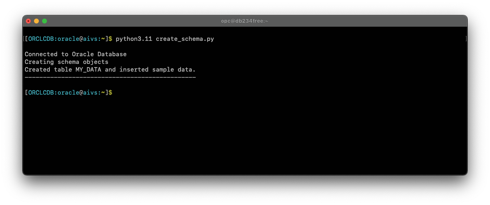

    To summarize what we've just done, the *create\_schema.py* program connects to the Oracle database, drops and creates a table called MY\_DATA. The program then inserts 150 rows of sample data. The table does not yet contain any Vector information. 
    
    We will be logging into the database to take a look at the contents of the MY\_DATA table in the Task 4. 


## Task 2: Vectorizing a table with FastEmbed

We're now ready to generate vectors four our data using fastEmbed. To do this you will need to create a Python program to vectorize our phrases using the FastEmbed packages that are pre-installed.

1. While logged into your Operating System as the Oracle user, create a file called *vectorize\_table\_FastEmbed.py* and paste the following contents into the file.

    ```
      <copy>
      # -----------------------------------------------------------------------------
      # Copyright (c) 2023, Oracle and/or its affiliates.
      #
      # This software is dual-licensed to you under the Universal Permissive License
      # (UPL) 1.0 as shown at https://oss.oracle.com/licenses/upl and Apache License
      # 2.0 as shown at http://www.apache.org/licenses/LICENSE-2.0. You may choose
      # either license.
      #
      # If you elect to accept the software under the Apache License, Version 2.0,
      # the following applies:
      #
      # Licensed under the Apache License, Version 2.0 (the "License");
      # you may not use this file except in compliance with the License.
      # You may obtain a copy of the License at
      #
      #    https://www.apache.org/licenses/LICENSE-2.0
      #
      # Unless required by applicable law or agreed to in writing, software
      # distributed under the License is distributed on an "AS IS" BASIS,
      # WITHOUT WARRANTIES OR CONDITIONS OF ANY KIND, either express or implied.
      # See the License for the specific language governing permissions and
      # limitations under the License.
      # -----------------------------------------------------------------------------
      #
      # Add or update the vectors for all data values in a table
      #

      import os
      import sys
      import array
      import time

      import oracledb
      from fastembed import TextEmbedding

      un = os.getenv("PYTHON_USERNAME")
      pw = os.getenv("PYTHON_PASSWORD")
      cs = os.getenv("PYTHON_CONNECTSTRING")

      # English embedding models
      embedding_model = "sentence-transformers/all-MiniLM-L6-v2"
      #embedding_model = "nomic-ai/nomic-embed-text-v1"
      #embedding_model = "BAAI/bge-small-en-v1.5"
      #embedding_model = "BAAI/bge-base-en-v1.5"
      #embedding_model = "BAAI/bge-large-en-v1.5"
      #embedding_model = "BAAI/bge-large-en-v1.5-quantized"
      #embedding_model = "jinaai/jina-embeddings-v2-base-en"
      #embedding_model = "jinaai/jina-embeddings-v2-small-en"

      # Multi-lingual embedding models
      #embedding_model = "intfloat/multilingual-e5-large"
      #embedding_model = "sentence-transformers/paraphrase-multilingual-mpnet-base-v2"

      print("Using FastEmbed " + embedding_model)

      model = TextEmbedding(model_name=embedding_model, max_length=512)

      # Connect to Oracle Database 23.4
      with oracledb.connect(user=un, password=pw, dsn=cs) as connection:
          db_version = tuple(int(s) for s in connection.version.split("."))[:2]
          if db_version < (23, 4):
              sys.exit("This example requires Oracle Database 23.4 or later")
          print("Connected to Oracle Database\n")

          with connection.cursor() as cursor:
              print("Vectorizing the following data:\n")

              # Loop over the rows and vectorize the VARCHAR2 data
              sql = """select id, info
                       from my_data
                       order by 1"""

              binds = []
              tic = time.perf_counter()
              for id_val, info in cursor.execute(sql):

                  # Convert to input string format for Sentence Transformers
                  data = f"[ 'query: {info}' ]"

                  print(info)

                  # Create the embedding and extract the vector
                  embedding = list(model.embed(data))

                  # Convert to a list
                  vec = list(embedding[0])

                  # Convert to array format
                  vec2 = array.array("f", vec)

                  # Record the array and key
                  binds.append([vec2, id_val])

              toc = time.perf_counter()

              # Do an update to add or replace the vector values
              cursor.executemany(
                  """update my_data set v = :1
                     where id = :2""",
                  binds,
              )
              connection.commit()

              print("\n-------------------------------------")
              print(f"Vectors took {toc - tic:0.4f} seconds")
              print(f"\nAdded {len(binds)} vectors to the table using FastEmbed " + embedding_model + "\n")
      </copy>
    ```

    Save the file and exit.

2. While logged in as the Oracle Linux user, run the program with *python3.11* as follows:


    ```
      <copy>
      python3.11 vectorize_table_FastEmbed.py
      </copy>
    ```

    **NOTE:** The first time you run this program you may notice series of dependencies get downloaded. The files have already been downloaded in our Oracle LiveLab environment so you should not see these download operations. 

    You should see the following:

    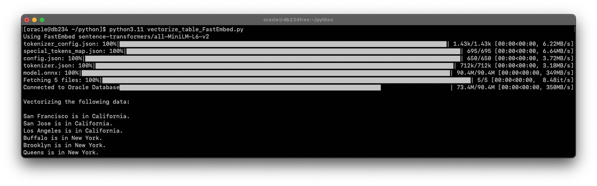

    Once the program has completed you will see the following:

    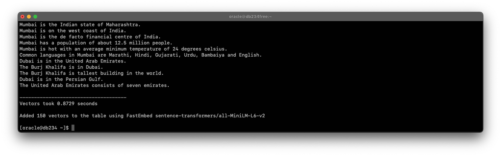

    You will notice that this is a relatively fast operation. In our case it ran in under a second. You should also see that it used the *"FastEmbed sentence-transformers/all-MiniLM-L6-v2"* embedding model. This is the same embedding model we use in our Setence Transformers lab but it has been converted to the ONNX format and is also using the ONNX runtime. The ONNX runtime has the ability to optimize existing models as well as use a C++ runtime (vs Python runtime from PyTorch) so net effect is that it is typically faster.

    To summarize what we've just done, the *vectorize\_table\_FastEmbed.py* program connects to the Oracle database, retrieves the text from the INFO column of the *MY\_DATA* table, and generates a vector for the INFO column in each of the 150 rows. We then store the vectorized data as a vector in the V column.

## Task 3: Understanding the Vector Embedding processing

Before proceeding any further, lets take a look at the code of the Python program we just ran. This will give us a better understanding of how this process is being performed.

1. Open the file with your favorite editor. Or you can use *vi* or *view* to view the contents of the file. We will not be making any changes to the program-

    ```
      <copy>
      view vectorize_table_FastEmbed.py
      </copy>
    ```

    The first thing you may notice is that the program has just over 100 lines of code. If you've looked at the Python code for vectorizing using other Embedding models you will see that this program logic is very similar.

2. After you scroll past the comments section of the program you will notice that we are importing the os, sys, array and time Python modules. We are using these modules to performing basic operations in the program.  

    We are also importing-
    - **oracledb** - the Python Driver for OracleDatabase. https://oracle.github.io/python-oracledb/
    - **fastembed** - the FastEmbed Python library. https://github.com/qdrant/fastembed

    Next we are passing the Username and Password along with the database connect-string for the Oracle Database user.

    Below that section is where we select the embedding model to be used, in this case we are using *"sentence-transformers/all-MiniLM-L6-v2"*  this is the embedding model entry that is uncommented.

    You should also notice that there is a large number of embedding models to choose from. For this lab we will use the *"sentence-transformers/all-MiniLM-L6-v2"* embedding model due to it's popularity.       

    Below the block with the Multi-lingual embedding models is where we actually call the embedding model we have chosen (un-commented) to be used.  

    We then connect to the database and verfiy that the database is running version 23.4 at a mininum. 

    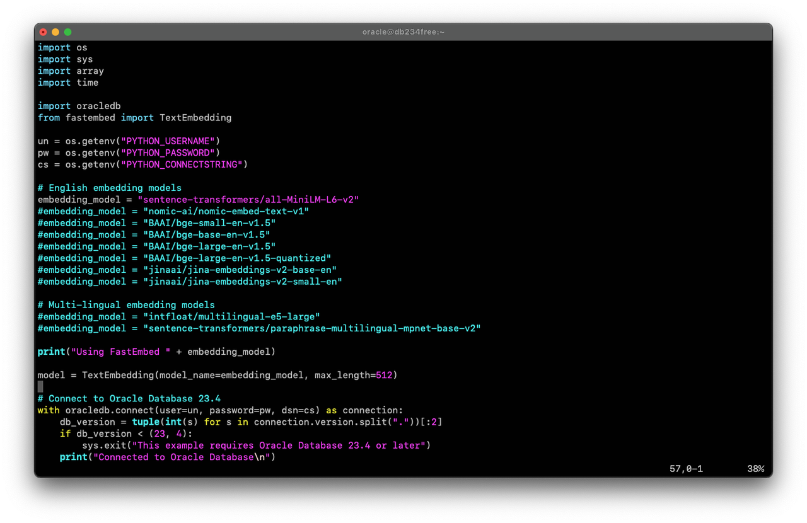

    Once we have selected our embedding model and connected to the database, we assign a SQL statement to a variable we have called *"sql"*. We then use this as a cursor to loop through the table. As we loop though the table we generate a vector from the contents of the *info* column and then update the *v* column to store that vectorized result.     

    When we have finished vectorizing every row we commit the update operation and ouput the time taken to vectorize the data.

    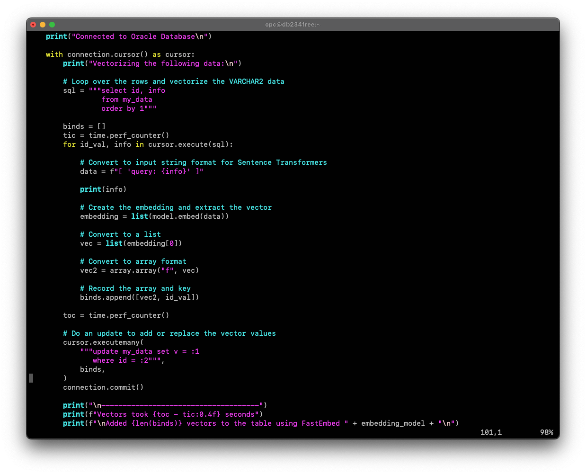

    You can now close the program file.

    If you chose to use *vi* or *view* to see your file, you can close the file using vi command- \[esc\] and **:q!** now and move on to the next task.


To summarize what the program does, it connects to the database, and then uses a sql cursor to loop through the table. For each row returned, a vector for the "INFO" column is generated and then stored in the "V" column.


## Task 4: View the Vector updates in the Database

We can now query the *MY\_DATA* table in the Oracle database to verify that our data has been updated.

1. Connect to Oracle database as the user: *vector* and password: *vector*

    ```
      <copy>
      sqlplus vector/vector@orclpdb1
      </copy>
    ```


2. Query the MY\_DATA table to verify that all 150 rows have been updated.

    ```
      <copy>
      select count(*) from my_data where V is not null ;
      </copy>
    ```

    You should see:

    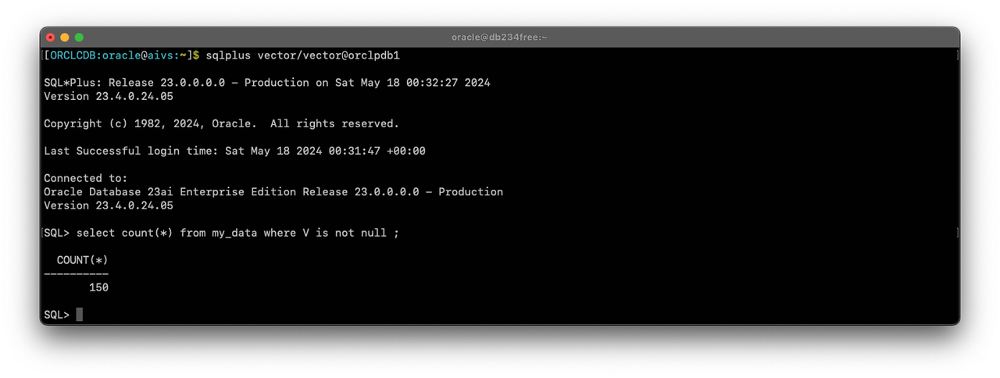


3. We can query the INFO column in the MY\_DATA table to see some of the factoids we are using.

    ```
      <copy>
      select info from my_data order by ID;
      </copy>
    ```


    You should see 150 rows of information-

    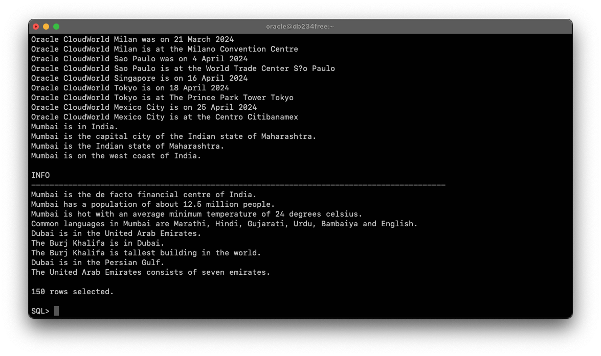

4. We can also query the V in the MY\_DATA table to see what the vectors and their dimensions look like.

    ```
      <copy>
      select V from my_data ;
      </copy>
    ```


    You should see:

    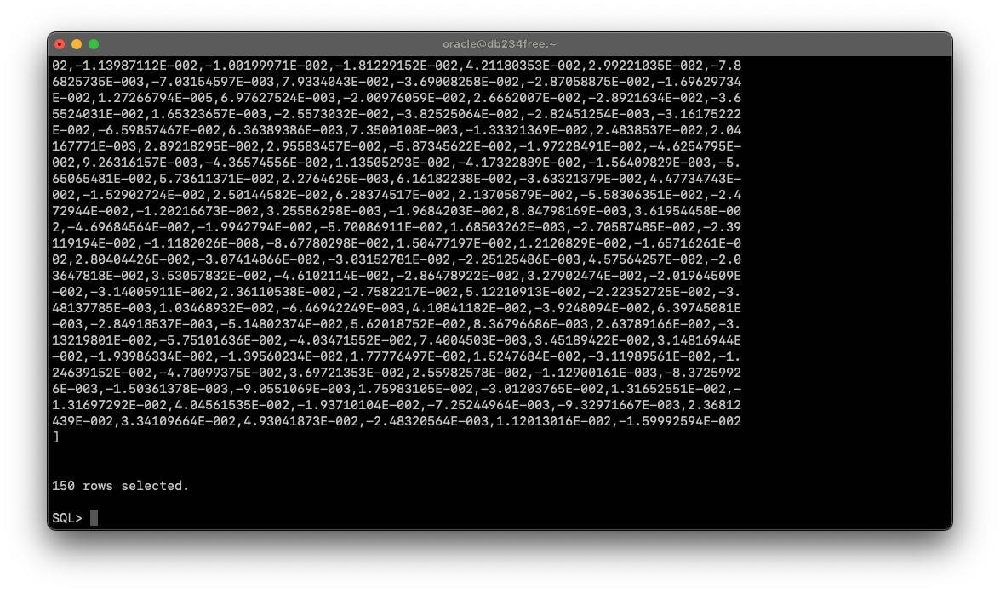

    **NOTE:** Depending on the embedding model you have used the size of the contents of the V column will differ. So keep in mind that the output displayed in our screen-shot is just the tail-end of a single vector for our last INFO factoid/phrase. 


You can now exit from SQL*Plus.


## Task 5: Perform Similarity Search with FastEmbed

It's time to have some fun!

So far we have vectorized the data in the *MY\_DATA* table using an FastEmbed embedding. We can now start performing Similarity Searches using the Vectors in our table. Even though the table has been vectorized we will still need to connect to use FastEmbed to vectorize our search phrase using the same embedding model. The search phrase is entered on the fly, vectorized and then used to search against the vectors in the database. We will create a Python program to do this.

1. While logged into your Operating System as the Oracle user, create a file called *similarity\_search\_FastEmbed.py* and paste the following contents into the file.

    ```
      <copy>
      # -----------------------------------------------------------------------------
      # Copyright (c) 2023, Oracle and/or its affiliates.
      #
      # This software is dual-licensed to you under the Universal Permissive License
      # (UPL) 1.0 as shown at https://oss.oracle.com/licenses/upl and Apache License
      # 2.0 as shown at http://www.apache.org/licenses/LICENSE-2.0. You may choose
      # either license.
      #
      # If you elect to accept the software under the Apache License, Version 2.0,
      # the following applies:
      #
      # Licensed under the Apache License, Version 2.0 (the "License");
      # you may not use this file except in compliance with the License.
      # You may obtain a copy of the License at
      #
      #    https://www.apache.org/licenses/LICENSE-2.0
      #
      # Unless required by applicable law or agreed to in writing, software
      # distributed under the License is distributed on an "AS IS" BASIS,
      # WITHOUT WARRANTIES OR CONDITIONS OF ANY KIND, either express or implied.
      # See the License for the specific language governing permissions and
      # limitations under the License.
      # -----------------------------------------------------------------------------
      #
      # Basic Similarity Search using the FastEmbed embedding model
      #
      
      import os
      import sys
      import array
      import time
      
      import oracledb
      from fastembed import TextEmbedding
      from sentence_transformers import CrossEncoder
      
      un = os.getenv("PYTHON_USERNAME")
      pw = os.getenv("PYTHON_PASSWORD")
      cs = os.getenv("PYTHON_CONNECTSTRING")
      
      # topK is how many rows to return
      topK = 5
      
      # Re-ranking is about potentially improving the order of the resultset
      # Re-ranking is significantly slower than doing similarity search
      # Re-ranking is optional
      rerank = 0
      
      # English embedding models
      embedding_model = "sentence-transformers/all-MiniLM-L6-v2"
      #embedding_model = "nomic-ai/nomic-embed-text-v1"
      #embedding_model = "BAAI/bge-small-en-v1.5"
      #embedding_model = "BAAI/bge-base-en-v1.5"
      #embedding_model = "BAAI/bge-large-en-v1.5"
      #embedding_model = "BAAI/bge-large-en-v1.5-quantized"
      #embedding_model = "jinaai/jina-embeddings-v2-base-en"
      #embedding_model = "jinaai/jina-embeddings-v2-small-en"
      
      # Multi-lingual embedding models
      #embedding_model = "intfloat/multilingual-e5-large"
      #embedding_model = "sentence-transformers/paraphrase-multilingual-mpnet-base-v2"
      
      # English re-rankers
      rerank_model = "cross-encoder/ms-marco-TinyBERT-L-2-v2"
      #rerank_model = "cross-encoder/ms-marco-MiniLM-L-2-v2"
      #rerank_model = "cross-encoder/ms-marco-MiniLM-L-6-v2"
      #rerank_model = "cross-encoder/ms-marco-MiniLM-L-12-v2"
      #rerank_model = "BAAI/bge-reranker-base"
      #rerank_model = "BAAI/bge-reranker-large"
      
      # Multi-lingual re-rankers
      #rerank_model = "jeffwan/mmarco-mMiniLMv2-L12-H384-v1"
      #rerank_model = "cross-encoder/msmarco-MiniLM-L6-en-de-v1"
      
      print("Using FastEmbed embedding model " + embedding_model)
      if rerank:
        print("Using reranker " + rerank_model)
      
      print("TopK = " + str(topK))
      
      sql = """select info
               from my_data
               order by vector_distance(v, :1, COSINE)
               fetch first :2 rows only"""
      
      
      # Define the specific model to use
      model = TextEmbedding(model_name=embedding_model, max_length=512)
      
      # Connect to Oracle Database 23.4
      with oracledb.connect(user=un, password=pw, dsn=cs) as connection:
          db_version = tuple(int(s) for s in connection.version.split("."))[:2]
          if db_version < (23, 4):
              sys.exit("This example requires Oracle Database 23.4 or later")
          print("Connected to Oracle Database\n")
      
          with connection.cursor() as cursor:
              while True:
                  # Get the input text to vectorize
                  text = input("\nEnter a phrase. Type quit to exit : ")
      
                  if (text == "quit") or (text == "exit"):
                      break
      
                  if text == "":
                      continue
      
                  tic = time.perf_counter()
      
                  # Create the embedding and extract the vector
                  embedding = list(model.embed(text))
      
                  toc = time.perf_counter()
                  print(f"\nVectorize query took {toc - tic:0.3f} seconds")
      
                  # Convert to a list
                  vec = list(embedding[0])
      
                  # Convert to array format
                  vec2 = array.array("f", vec)
      
                  docs  = []
                  cross = []
      
                  tic = time.perf_counter()
      
                  # Do the Similarity Search
                  for (info,) in cursor.execute(sql, [vec2, topK]):
      
                      # Remember the SQL data resultset
                      docs.append(info)
      
                      if rerank == 1:
      
                        # create the query/data pair needed for cross encoding
                        tup = []
                        tup.append(text)
                        tup.append(info)
                        cross.append(tup)
      
                  toc = time.perf_counter()
                  print(f"Similarity Search took {toc - tic:0.4f} seconds")
      
                  if rerank == 0:
      
                      # Just rely on the vector distance for the resultset order
                      print("\nWithout ReRanking")
                      print("==================================")
                      for hit in docs:
                        print(hit)
      
                  else:
      
                    tic = time.perf_counter()
      
                    # ReRank for better results
                    ce = CrossEncoder(rerank_model, max_length=512)
                    ce_scores = ce.predict(cross)
      
                    toc = time.perf_counter()
                    print(f"Rerank took {toc - tic:0.3f} seconds")
      
                    # Create the unranked list of ce_scores + data
                    unranked = []
                    for idx in range(topK):
      
                        tup2 = []
                        tup2.append(ce_scores[idx])
                        tup2.append(docs[idx])
                        unranked.append(tup2)
      
                    # Create the reranked list by sorting the unranked list
                    reranked = sorted(unranked, key=lambda foo: foo[0], reverse=True)
      
                    print("\nReRanked results:")
                    print("==================================")
                    for idx in range(topK):
                        x = reranked[idx]
                        print(x[1])
      
                    print("\n----------------------------------")
      </copy>
    ```

    Save the file and exit.

2. While logged in as the oracle Linux user, run the program with *python3.11* as follows:

    ```
      <copy>
      python3.11 similarity_search_FastEmbed.py
      </copy>
    ```

    If this is the first time you are running FastEmbed, you may see the following. If you do not see any libraries downloaded, there is nothing to worry about. 

    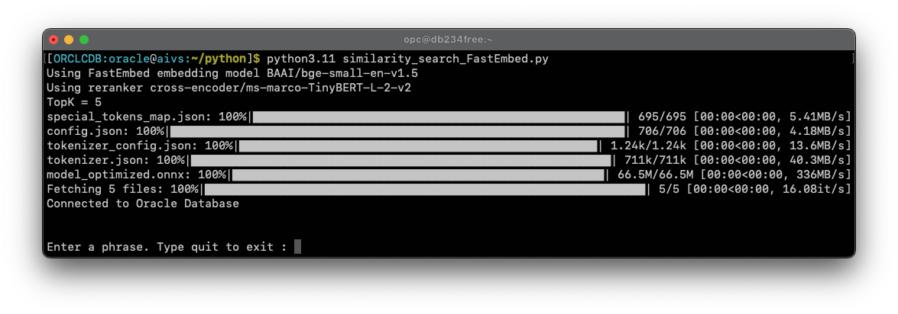


3. For our first example let's try the word "cars". This is the same phrase we have tested using the other models, so if you have tried this in another lab, you know what to expect. The results should be similar. If on the other hand this is your first time, you should see a list of 5 of our terms that are similar to the term we enter.

    Enter Phrase: **cars**

    You may see the following:

    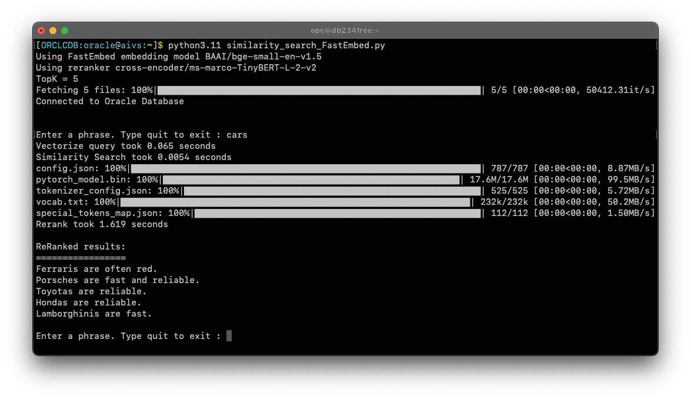

    It is possible that you see libraries being downloaded if this is the first time you are running this program. This will result in the first similarity search operation taking a little longer than usual, but this is not a problem, so it's nothing to worry about. 

    Alternately, if there are no additional libraries downloaded, you will see the following:

    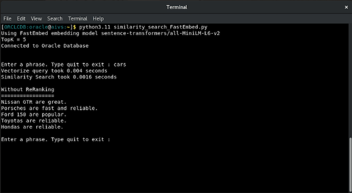

    Your times may vary but you should notice that the response time is significantly faster than other Similarity Searches that you may have run in this workshop. 

    Next we can see that the similarity search took 0.0024 seconds (or 2 millisecond) to locate 5 entries related to the word "cars".

    In our situation it took under half a second to generate a vector from the query and about 2 milliseconds to perform the query. This is extremely fast when we compare it to other models as we do not need to perform the roundtrip REST calls over the internet.

    - The first thing to consider is that this query demonstrates the true power of Similarity Search. The term "cars" is not present in any of the results we see, yet we are able to instantly acknowledge that all 5 results are directly related (or correlated) to our term "cars".

    - The 5 rows returned have the minimum vector distance to our vectorized phrase cars from the sample data in the MY_DATA table.

    - The vectors with the minimum vector distance tend to have the closest semantic meaning.

    - ie the closet vectors tend to be based on the most similar data

    - The results themselves look like a "good" result as all 5 of the factoids are on-point with the phrase "cars".


4. Next we can try the word "cats"

    Enter the phrase: **cats**

    This time you should see the following:

    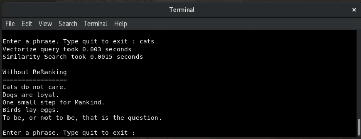


    Other than the first result, the output does not appear to have the same level of accuracy as some of the other models. However the terms with: "dogs" and "mice" are often used in the same context as "cats", so there is some correlation there. But finding a similarity between our searchphrase "cats" and the last two phrases may be considered a stretch. 

    The whole point about Similarity Search is that it is not necessarily an exact match as we are used to seeing with a relational query. Instead it is based on the closest vector from a pool of vectors using a given embedding model. Remember the embedding model is trained using information available from the internet and other publicly sourced information.

5. We can also try other search phrases for example "fruit", or even "NY". In both cases the query phrases we enter are not actually in the data-set themselves, but the connection or correlation is apparent. It is important to remember the search is not an exact or substring search for what is in the result set. Instead the results are based on vector distance math for locating vectors with the closest distance mathematically to our vectorized search phrase .


    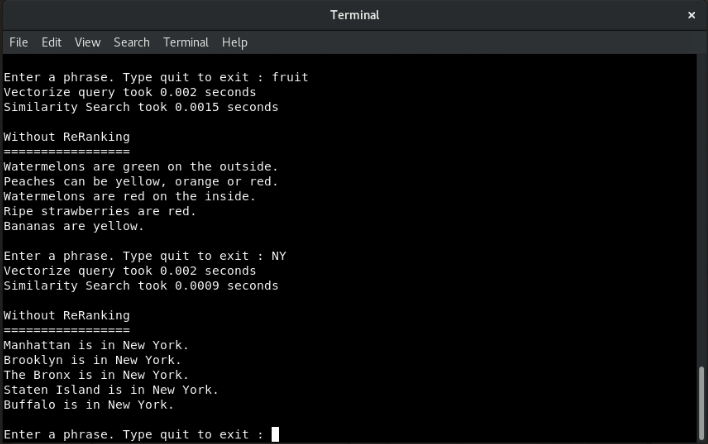


6. Next we can search for "Boroughs". This will focus our similarity search on data related specifically to New York City - and you should notice that we do not see "Buffalo" this time. We see the five boroughs of New York City, demonstrating the real power of Similarity Search with Oracle AI Vector Search.

    Enter the phrase: **Boroughs**

    You should see the following:

    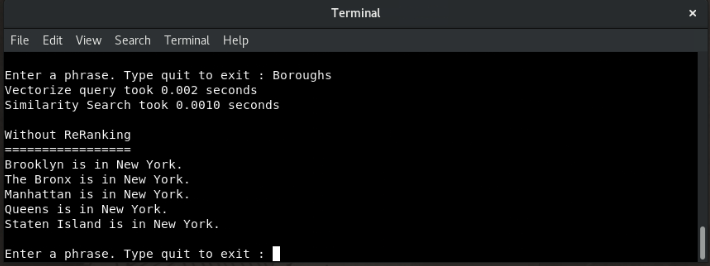


7. For another experiment, let's enter the word "Bombay".

    Enter the phrase: **Bombay**

    You should see the following:

    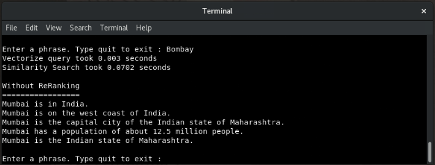


    The word "Bombay" does not actually appear in the *MY\_DATA* table, but the results related to "Mumbai" are correct because "Bombay" is the former name for "Mumbai", and as such there is a strong correlation between the two names for the same place.

    Remember, embedding models are trained on data that is often sourced from the internet and it is very likely that there is information that includes both the old name "Bombay" and the new name "Mumbai" in the same place.


8. Now to see what happens when there is no correlation in the terms, let's try something completely random.

    Enter the phrase: **random stuff**

    You should see the following:

    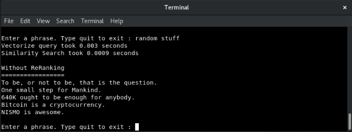


    If you have tried this search with other embedding models, you may notice that unlike other models, FastEmbed takes approximately the same amount of time to run for our random search. Also, as you may have anticipated, there is little or no correlation between the terms returned and the phrase we entered. Remember this is based entirely on the relatively small number of entries in the MY\_DATA table.

9. For another experiment, let's enter the phrase "New Zealand".

    Enter the phrase: **New Zealand**

    You should see the following:

    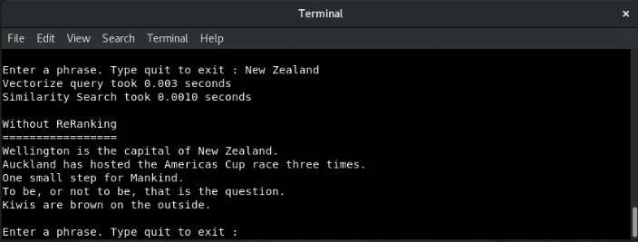


    This result is interesting as it successfully locates three vectors that are related to New Zealand, but two of the results (third ad fourth) are completely un-related. It is difficult to understand how the distance is closer to than the fifth phrase which is about "Kiwis". This term looks like it may be a good candidate to try a different embedding model (we will revisit this in Task 6).  

Feel free to try out some of your own terms to see what results you can get from the program.       

## Task 6: Changing embedding models

Now let's experiment with changing the embedding model we are using with FastEmbed.

This time we will switch from *"sentence-transformers/all-MiniLM-L6-v2"* to *"BAAI/bge-small-en-v1.5"*. 

1. To make this switch we will need to change the embedding model in both the programs:

   * *vectorize\_table\_FastEmbed.py*

    ```
      <copy>
      vi vectorize_table_FastEmbed.py
      </copy>
    ```

   * *similarity\_search\_FastEmbed.py*  

    ```
      <copy>
      vi similarity_search_FastEmbed.py
      </copy>
    ```


    Your programs will look like this **BEFORE** making your modification-

    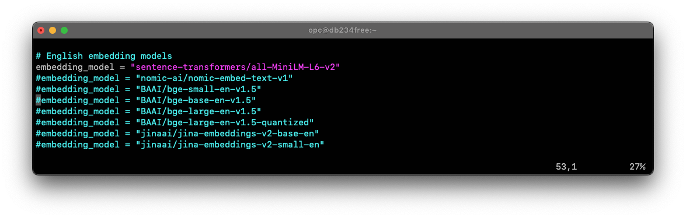

    Your programs will look like this **AFTER** making your modification-
    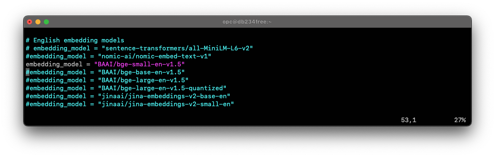


2. The first thing you will need to do before you can use a different embedding model for performing a similarity search is to re-generate the vectors for the entries in the table: MY\_DATA. We can do this by re-running the *vectorize\_table\_FastEmbed.py* program as follows:

    ```
      <copy>
      python3.11 vectorize_table_FastEmbed.py
      </copy>
    ```

    You should see:

    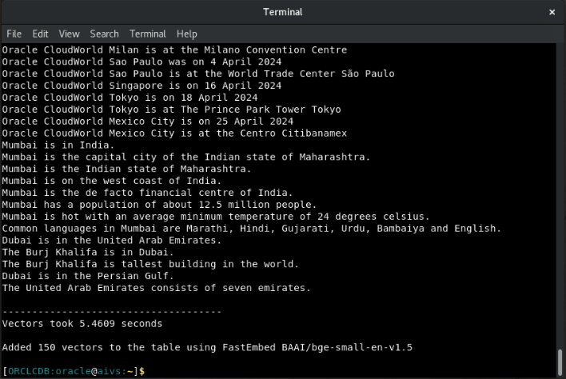


    Depending on your lab setup environment, there may be additional libraries and modules that will be downloaded and installed into our system. This is done automatically and there should be no manual intervention required, but this will require addition disk space (our system has been sized to accomodate this). Once the embedding model is installed, the data will be vectorized.  

    Notice that the embedding model has been changed to **BAAI/bge-small-en-v1.5** as we expected.  

3. We're now ready to try out our new model.  We can do this by running the *similarity\_search\_FastEmbed.py* program as follows:


    ```
      <copy>
      python3.11 similarity_search_FastEmbed.py
      </copy>
    ```

    As a baseline let's start with the term "cars".  Run it twice so we can eliminate the extra time it takes to load the new model.

    Enter the phrase **cars**

    You should see:

    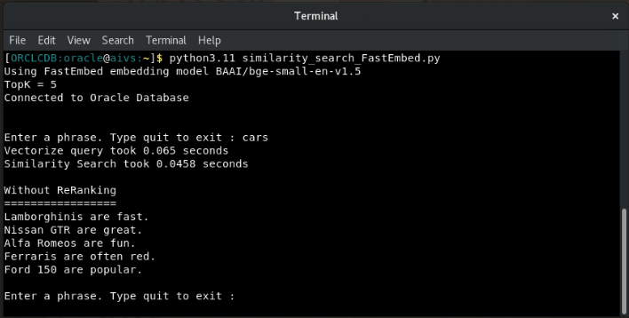


    You should notice that although the results are different when we compare this to our previous embedding model, the similarity search results are 100% accurate, however the time is significantly different to when we used the sentence transformers embedding model. It is important to keep this in mind when choosing an embedding model, they each come with their own set of trade-offs with regards to performance and accuracy characteristics. A good rule of thumb is to focus on the accuracy and then to performance.

4. Let's try revisiting our phrase "New Zealand"

    Enter phrase: **New Zealand**

    You should see:

    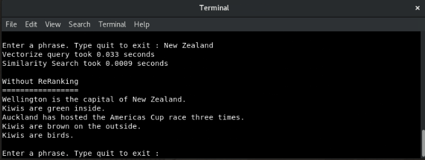


    This time, when we enter the phrase "New Zealand", our accuracy has improved significantly. All five entries are accurate versus only three with Sentence Transformers. So changing models can have a significant impact on our results 

    Feel free to try some other queries including repeating some of the previous examples we entered when we used other embedding models for your own comparison.


## Summary

Congratulations you've completed the lab!

Hopefully you have seen how easy it is to use FastEmbed with Python and Oracle Vectors for Similarity Search operations. You are ready to try another lab.

## APPENDIX 1: Installing FastEmbed packages in your system

As mentioned in the Introduction, the FastEmbed library is available from Hugging Face and is installed and run locally on your system. So unlike other embedding models where you install a "small" software library to connect to a remotely hosted model, this installs a "larger" set of software packages from Hugging Face that include the embedding models themselves to run on your local machine. Hence you will need to ensure your system has sufficient spare disk capacity to install the required models. 

1. Use pip to install the *fastembed* packages. While logged in as the oracle Linux user, run the following *pip* command:

    ```
      <copy>
      pip install -U fastembed
      </copy>
    ```

    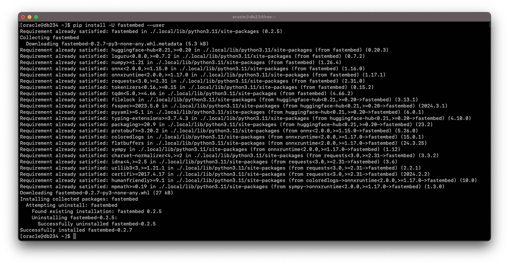
 
    You should now be ready to proceed with using the Sentence Transformers and FastEmbed.

</if>


## Learn More

* [Oracle Database 23ai Documentation](https://docs.oracle.com/en/database/oracle/oracle-database/23/index.html)
* [Oracle AI Vector Search Users Guide](https://docs.oracle.com/en/database/oracle/oracle-database/23/vecse/index.html)
* [Oracle Documentation](http://docs.oracle.com)
* [Cohere: Embedding models](https://cohere.com)
* [Hugging Face: Sentence Transformers](https://huggingface.co/sentence-transformers)
* [www.sbert.net](https://www.sbert.net/) 


## Acknowledgements
* **Author** - Doug Hood, Product Manager,  Sean Stacey, Outbound Product Manager
* **Contributors** - Rajeev Rumale, Principal Outbound Product Manager
* **Last Updated By/Date** - Sean Stacey, May 2024
