<if type="Cohere">
# Lab 1: Using Cohere LLM for Vector Embedding Models


## Introduction

In this lab we will learn how to use the Cohere embedding models with Oracle Vectors.

------------
Estimated Time: 25 minutes

### Objectives


In this lab, you will see the following Vector operations using Python:
* Task 1: Install python libraries for Cohere
* Task 2: Vectorizing a table with Cohere embedding
* Task 3: Perform Similarity Search using Cohere
* Task 4: Changing embedding models


### Prerequisites

This lab assumes you have:
* An Oracle account
* An API key for Cohere (Can be a free trial key)
* Your workshop environment is configured (Completed Lab 0)
* An Oracle Database 23.4 preinstalled

*This is the "fold" - below items are collapsed by default*

## Task 1: Install Cohere Python libraries.

The first step is to install the python libraries for Cohere-

Install cohere library with pip.

1. While logged in as the oracle Linux user, install the cohere library:

    ```
      <copy>
      pip install --upgrade cohere
      </copy>
    ```

    You should see:

    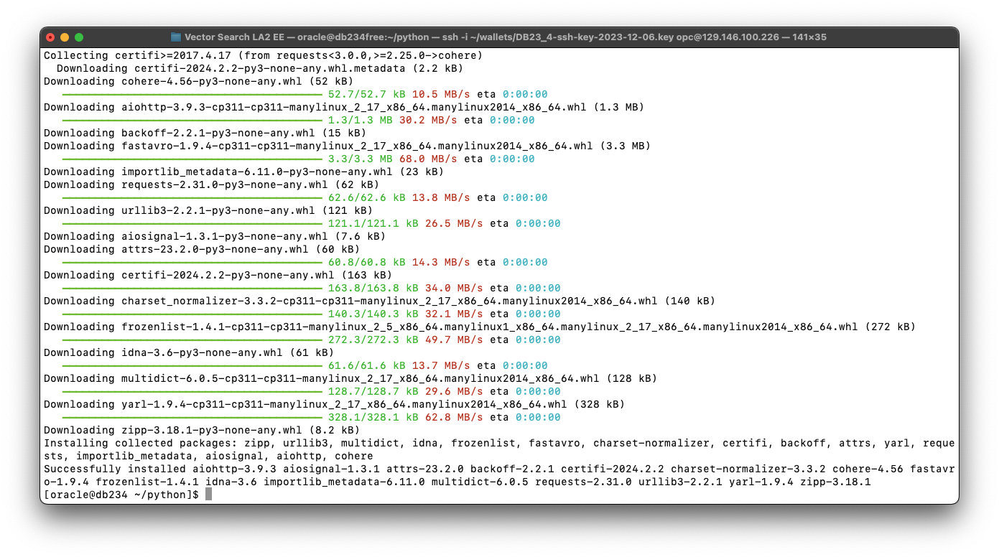
or
    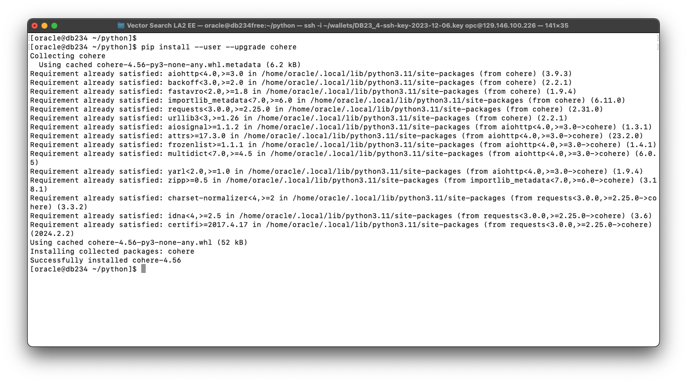


## Task 2: Vectorizing a table with Cohere embedding

1. The first step is to vectorize the contents of our table using an embedding model by Cohere. To do this, you will need to create a python program to vectorize our phrases using the Cohere embedding model libraries that we just installed.

While logged into your Operating System as the Oracle user, create a file called *vectorize\_table\_Cohere.py* and paste the following contents into the file.


    ```
      <copy>
      # -----------------------------------------------------------------------------
      # Copyright (c) 2023, Oracle and/or its affiliates.
      #
      # This software is dual-licensed to you under the Universal Permissive License
      # (UPL) 1.0 as shown at https://oss.oracle.com/licenses/upl and Apache License
      # 2.0 as shown at http://www.apache.org/licenses/LICENSE-2.0. You may choose
      # either license.
      #
      # If you elect to accept the software under the Apache License, Version 2.0,
      # the following applies:
      #
      # Licensed under the Apache License, Version 2.0 (the "License");
      # you may not use this file except in compliance with the License.
      # You may obtain a copy of the License at
      #
      #    https://www.apache.org/licenses/LICENSE-2.0
      #
      # Unless required by applicable law or agreed to in writing, software
      # distributed under the License is distributed on an "AS IS" BASIS,
      # WITHOUT WARRANTIES OR CONDITIONS OF ANY KIND, either express or implied.
      # See the License for the specific language governing permissions and
      # limitations under the License.
      # -----------------------------------------------------------------------------
      #
      # Add or update the vectors for all data values in a table
      # Use the Cohere embed-english-light-v3.0 model to create the vectors
      #

      # If you are using a FREE Cohere API Key you will need to add a time delay.
      # Change the setting below to "1" if your key is a free key.
      use_free_key = 0
      #use_free_key = 1

      import os
      import sys
      import array
      import time

      import oracledb
      import cohere

      un = os.getenv("PYTHON_USERNAME")
      pw = os.getenv("PYTHON_PASSWORD")
      cs = os.getenv("PYTHON_CONNECTSTRING")

      query_sql = """select id, info
                     from my_data
                     order by 1"""

      update_sql = """update my_data set v = :1
                      where id = :2"""

      # Get your Cohere API Key from the environment
      api_key = os.getenv("CO_API_KEY")
      if api_key:
          print('Using Cohere CO_API_KEY')
      else:
          print('\nYou need to set your Cohere API KEY\n')
          print('https://cohere.com/pricing')
          print('export CO_API_KEY=whatever_your_api_key_value_is\n')
          exit();

      embedding_model =  "embed-english-light-v3.0"
      #embedding_model =  "embed-english-v3.0"
      #embedding_model =  "embed-multilingual-light-v3.0"
      #embedding_model =  "embed-multilingual-v3.0"

      # Whether to generate int8 or float embeddings
      use_int_8 = 0
      if use_int_8:
          the_type = "int8"
          print("Using INT8 embeddings")
      else:
          the_type = "float"
          print("Using float embeddings")

      if use_free_key:
          print("Using FREE Cohere API Key")
      else:
          print("Using PAID Cohere API Key")

      # Authenicate and authorize with cohere.com
      co = cohere.Client(api_key)

      # Connect to Oracle Database 23.4
      with oracledb.connect(user=un, password=pw, dsn=cs) as connection:
          db_version = tuple(int(s) for s in connection.version.split("."))[:2]
          if db_version < (23, 4):
              sys.exit("This example requires Oracle Database 23.4 or later")
          print("\nConnected to Oracle Database\n")

          with connection.cursor() as cursor:
              print("Vectorizing the following data:\n")

              # Loop over the rows and vectorize the VARCHAR2 data

              binds = []
              tic = time.perf_counter()
              for id_val, info in cursor.execute(query_sql):

                  # Convert to format that Cohere wants
                  data = [info]

                  print(info)

                  # Create the vector embedding [a JSON object]
                  response = co.embed(
                      texts=data,
                      model=embedding_model,
                      input_type="search_query",
                      embedding_types=[the_type]).embeddings

                  # Extract the vector from the JSON object
                  # and convert to array format
                  if use_int_8:
                      vec = array.array("b", response.int8[0])
                  else:
                      vec = array.array("f", response.float[0])

                  # Record the array and key
                  binds.append([vec, id_val])

                  # Sleep for half a second if the Cohere API Key is a free key
                  if use_free_key:
                      time.sleep(.485)


              toc = time.perf_counter()

              # Do an update to add or replace the vector values
              cursor.executemany(
                  update_sql,
                  binds,
              )
              connection.commit()

              print(f"\nVectors took {toc - tic:0.3f} seconds")
              print(f"\nAdded {len(binds)} vectors to the table using embedding model: " + embedding_model + "\n")
      </copy>
    ```

2. Save the file and run it with *python3.11* as follows:


    ```
      <copy>
      python3.11 vectorize_table_Cohere.py
      </copy>
    ```

    If this is the first time you are running the program, you will likely see:

    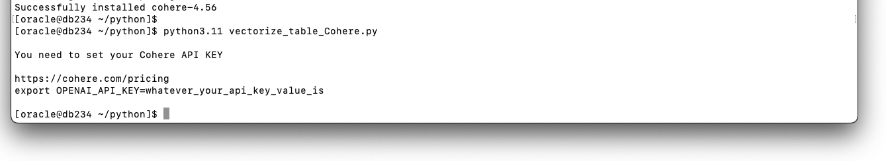


3. If you have not used the Cohere python libraries on this system before, you will likely encounter an error informing you that you have not entered an API Key to use Cohere. This is because Cohere is a commercial product and requires a key to use their REST end-point.

In addition to a paid-licensed key, Cohere also provides a free Trial API key for use with testing your configuration with different Cohere embedding models. The trial keys are fully functional, but the vectorization is rate limited to 100 API calls per minute. To overcome this restriction, the Python program has a setting to throttle the vectorization process to run for over a minute.  

You can get a Cohere API Key at [cohere.com](https://cohere.com). You will need to create an account and register with Cohere to create an API Key if you do not already have a Cohere API Key.

**NOTE:** If you are using a Free Cohere API key you will need to edit the following lines in the *vectorize\_table\_Cohere.py* program.

For a free Trial Key, change the parameter **use\_free\_key** to **1** by commenting out the line below  

To use a Trial Key-

  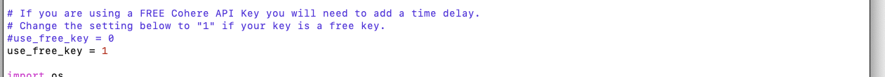

To use a Paid Key-

  


4. Once you have a Cohere API Key you are ready to proceed with vectorizing your data. The first step is to assign the key to an environment variable as follows:

    ```
      <copy>
      export CO_API_KEY=<your cohere api key>
      </copy>
    ```


5. After you have set the *CO\_API\_KEY* environment variable to your key, you are ready to run the *vectorize\_table\_Cohere.py* python program. This can be done by performing the following-  

    ```
      <copy>
      python3.11 vectorize_table_Cohere.py
      </copy>
    ```

    When the program finishes running, you should see something similar to the following-

    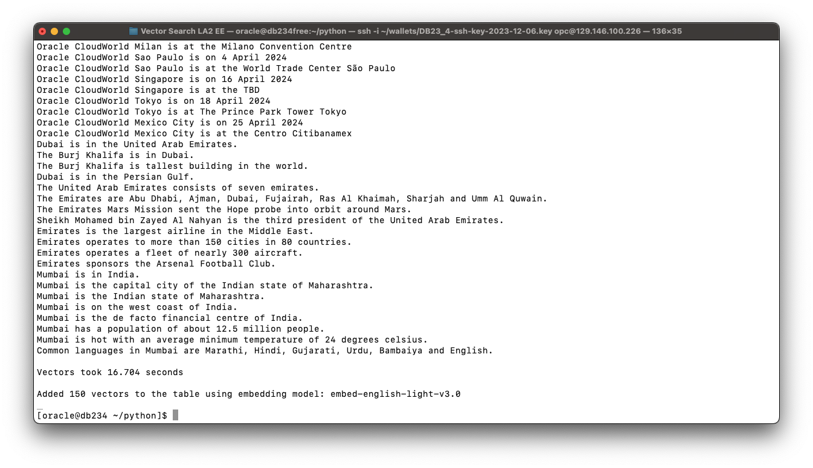

   **Note:** Running the program with a paid/commercial Cohere API Key takes around 15 seconds to run. Running with a free trial key (and the programmed delay) will take around 80 seconds.

To summarize what we've just done, the *vectorize\_table\_Cohere.py* program connects to the Oracle database, retrieves the text from the INFO column of the MY\_DATA table, and vectorizes the "factoid" for each of the 150 rows. We are then storing the vectorized data as a vector in the column called: V. You will also notice that we used the *embed-english-light-v3.0* embedding model for this operation. In other words an English speaking embedding model, and it's version 3.0 of the light model.

6. Before we move onto performing Similarity Searches using Cohere embedding models, we should take a look in the the Oracle database to see the updates made to the *MY\_DATA* table.

    6.a Connect to your Oracle database as the user: **vector** with password: **vector**

    ```
      <copy>
      sqlplus vector/vector@orclpdb1
      </copy>
    ```

    6.b We can now query the *MY\_DATA* table to verify that all 150 rows have been updated.

    ```
      <copy>
      select count(*) from MY_DATA where V is not null;
      </copy>
    ```


    You should see:

    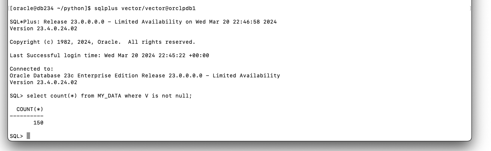


    6.c We can also query the vector column: V in the MY\_DATA table to see what the vectors and dimensions look like.

    ```
      <copy>
      select V from MY_DATA;
      </copy>
    ```

    You should see something similar to this-

    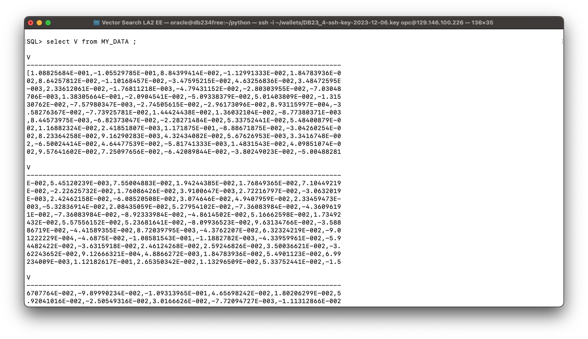

    and

    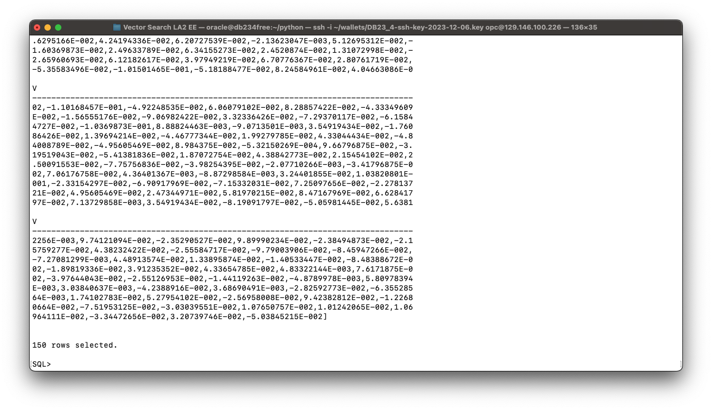


    This is the semantic representation of the data stored in the corresponding row of the INFO column.

    Now that we have vectorized the data in our table and confirmed the updates, we are ready to move onto the next task which is performing Similarity Searches using our Vectors.


## Task 3: Perform Similarity Search using Cohere

In this lab we will see how to perform a similarity search with the Cohere embedding models in python.

So far we have vectorized the data in the *MY\_DATA* table using the Cohere embedding model, we can now start performing Similarity Searches using the Vectors in our table. Even though the data in our table has been vectorized we will still need to connect to Cohere to vectorize our search phrase with the same embedding model. The search phrase is entered on the fly, vectorized and then used to search against the vectors in the database. We will create a python program to do this.


1. While logged into your Operating System as the Oracle user, create a file called *similarity\_search\_Cohere.py* and paste the following contents into the file.

    ```
      <copy>
      # -----------------------------------------------------------------------------
      # Copyright (c) 2023, Oracle and/or its affiliates.
      #
      # This software is dual-licensed to you under the Universal Permissive License
      # (UPL) 1.0 as shown at https://oss.oracle.com/licenses/upl and Apache License
      # 2.0 as shown at http://www.apache.org/licenses/LICENSE-2.0. You may choose
      # either license.
      #
      # If you elect to accept the software under the Apache License, Version 2.0,
      # the following applies:
      #
      # Licensed under the Apache License, Version 2.0 (the "License");
      # you may not use this file except in compliance with the License.
      # You may obtain a copy of the License at
      #
      #    https://www.apache.org/licenses/LICENSE-2.0
      #
      # Unless required by applicable law or agreed to in writing, software
      # distributed under the License is distributed on an "AS IS" BASIS,
      # WITHOUT WARRANTIES OR CONDITIONS OF ANY KIND, either express or implied.
      # See the License for the specific language governing permissions and
      # limitations under the License.
      # -----------------------------------------------------------------------------
      #
      # Basic Similarity Search using the Cohere embed-english-light-v3.0 model
      #

      import os
      import sys
      import array

      import oracledb
      import cohere
      import time

      un = os.getenv("PYTHON_USERNAME")
      pw = os.getenv("PYTHON_PASSWORD")
      cs = os.getenv("PYTHON_CONNECTSTRING")

      # topK is how many rows to return
      topK = 5

      # Re-ranking is about potentially improving the order of the resultset
      # Re-ranking is significantly slower than doing similarity search
      # Re-ranking is optional
      rerank = 1

      sql = """select info
               from my_data
               order by vector_distance(v, :1, COSINE)
               fetch APPROX first :2 rows only"""

      embedding_model =  "embed-english-light-v3.0"
      #embedding_model =  "embed-english-v3.0"
      #embedding_model =  "embed-multilingual-light-v3.0"
      #embedding_model =  "embed-multilingual-v3.0"

      rerank_model = "rerank-english-v2.0"
      #rerank_model = "rerank-multilingual-v2.0"

      print("Using embedding model " + embedding_model)
      if rerank:
        print("Using reranker " + rerank_model)
      else:
        print("Not using reranking")

      print("TopK = " + str(topK))

      # Whether to generate int8 or float embeddings
      use_int_8 = 0
      if use_int_8:
          the_type = "int8"
          print("Using INT8 embeddings")
      else:
          the_type = "float"
          print("Using float embeddings")

      # Get your Cohere API Key from the environment
      api_key = os.getenv("CO_API_KEY")
      if api_key:
          print('Using Cohere CO_API_KEY')
      else:
          print('\nYou need to set your Cohere API KEY\n')
          print('https://cohere.com/pricing')
          print('export CO_API_KEY=whatever_your_api_key_value_is\n')
          exit();

      co = cohere.Client(api_key)

      # Connect to Oracle Database 23.4
      with oracledb.connect(user=un, password=pw, dsn=cs) as connection:
          db_version = tuple(int(s) for s in connection.version.split("."))[:2]
          if db_version < (23, 4):
              sys.exit("This example requires Oracle Database 23.4 or later")
          print("Connected to Oracle Database")

          with connection.cursor() as cursor:

              while True:
                  # Get the input text to vectorize
                  text = input("\nEnter a phrase. Type quit to exit : ")

                  if (text == "quit") or (text == "exit"):
                      break

                  if text == "":
                      continue

                  # Create the vector embedding [a JSON object]
                  sentence = [text]

                  tic = time.perf_counter()

                  # Create the vector embedding [a JSON object]
                  response = co.embed(
                      texts=sentence,
                      model=embedding_model,
                      input_type="search_query",
                      embedding_types=[the_type]).embeddings

                  toc = time.perf_counter()
                  print(f"\nVectorize query took {toc - tic:0.3f} seconds")

                  # Extract the vector from the JSON object
                  # and convert to array format
                  if use_int_8:
                      vec = array.array("b", response.int8[0])
                  else:
                      vec = array.array("f", response.float[0])

                  docs = []

                  tic = time.perf_counter()

                  # Do the Similarity Search
                  for (info,) in cursor.execute(sql, [vec, topK]):

                      # Copy the resultset to a list of docs
                      docs.append(info)

                  toc = time.perf_counter()
                  print(f"Similarity Search took {toc - tic:0.3f} seconds")

                  if rerank == 0:

                      # Just rely on the vector distance for the resultset order
                      print("\nWithout ReRanking")
                      print("=================")
                      for hit in docs:
                        print(hit)

                  else:

                    tic = time.perf_counter()

                    # ReRank for better results
                    results = co.rerank(query=text,
                                        documents=docs,
                                        top_n=topK,
                                        model=rerank_model)

                    toc = time.perf_counter()
                    print(f"Rerank took {toc - tic:0.3f} seconds")

                    print("\nReRanked results:")
                    print("=================")
                    for hit in results:
                      print(docs[hit.index])
      </copy>
    ```

**NOTE:** This program does not require any modifications if you are using a Free Trial Key from Cohere.


2. Save the file and run it with *python3.11* as follows:

    ```
      <copy>
      python3.11 similarity_search_Cohere.py
      </copy>
    ```

    You should see the following:

    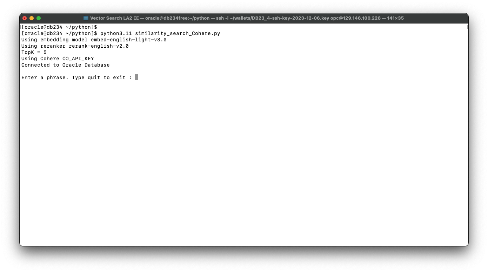

    The first thing you should notice is that the embedding model: "embed-english-light-v3.0" being used in the similarity search matches the embedding model that we used to Vectorize the data in the MY\_DATA table. You will also notice:

    - We are using the reranker with rerank-english-v2.0
    - We are only looking at the TopK 5 - or closest 5 results
    - We are using the Cohere key from our parameter CO\_API\_KEY - this is required for us to authenticate to Cohere for vectorizing the search phrase.
    - We and connecting to the Oracle database with the oracledb python library


3. For our first example we will enter the word "cars" at the prompt.  

    You should see something similar to:

    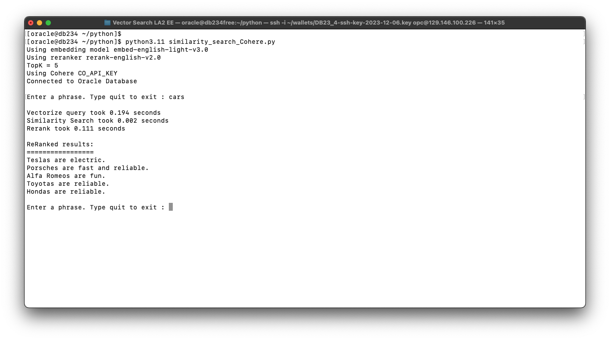

    It's possible that your times will be different to ours, as the time includes the network roundtrip REST call. With that being the case, we can see that the first operation is to vectorize our phrase, in this case "cars", and that it took 0.194 seconds.

    - Next we can see that the similarity search took 0.002 seconds (or 2 milliseconds) to locate 5 related entries to the word "cars".

    - The 5 rows returned are the 5 *most semantically* similar to our phrase *cars* from our sample data in the MY\_DATA table.

    - The results themselves look like a "good" result as all 5 of the factoids are on-point with the phrase "cars".  


4. Next we can type in the word "cats"

    You should see something similar to:

    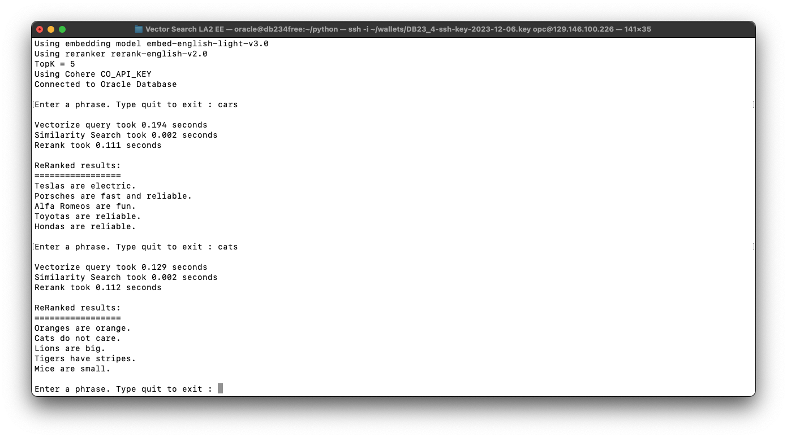

    This time, the output does not appear to have the same level of accuracy as "cats and mice" are often used in the same context, there is some correlation between the two animals. But finding a similarity between cats and oranges could be considered a stretch.

    The whole point about Similarity Search is that it is not necessarily exactly correct, it is the best match given the available data using the given embedding model. The embedding model is trained using information available from the internet and other publicly sourced information.

    Perhaps the term "orange" is associated with the colour of cats? But it would be pure speculation to jump to a conclusion on what drove the embedding model to make this correlation.  

5. We can also try other search phrases for example "fruit", or even "NY".

    You should see something similar to:

    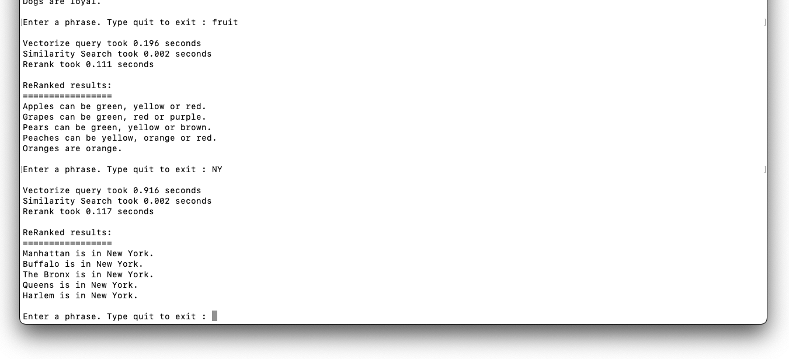

    In both cases the query phrases we enter are not actually in the data set themselves, but the connection or correlation is apparent. It is important to understand that the search is not an exact or substring search for what is in the result set. Instead the results are looking for similar data based on the text being vectorized.
    **or**
    Both of these results were on target and illustrate the power of similarity search. The queries are very different to a traditional relational query where we are looking for an exact match, but in both of these instances neither of the terms "fruit" or "NY" were in our table. Similarity search is able to find a correlation.


6. Next we can search for "Boroughs".

   You should see something similar to:

   

    This phrase directs our similarity search to information related to New York City - and you should notice that we do not see "Buffalo" this time. But you may also notice that we see four of the five boroughs: "Bronx" , "Brooklyn", "Manhattan" and "Queens". But we see "Harlem" and not "Staten Island". Harlem is a neighborhood in New York City and not a borough.

    **NOTE: We do have an entry for "Staten Island" in our MY\_DATA table, but once again we can see Similarity Search does not guarantee an exact answer.**


7. For another experiment, we can enter the word "Bombay". should see something similar to this"

   You should see something similar to:

   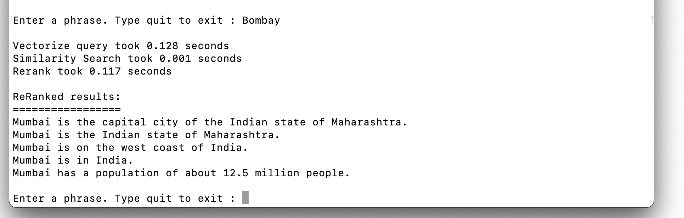


    The word "Bombay" does not appear in our data set, but the results related to Mumbai are correct because "Bombay" is the former name for "Mumbai", and as such there is a strong correlation between the two names for the same geographic location.

    Remember, similarity search works on the basis of the trained data from which the embedding models use. Trained embedding models use text sourced from the internet and it is very likely that there is information that includes both the names "Bombay" and "Mumbai" in relation to the same place.

8. Now to see what happens when there is no correlation in the terms, let's try something completely random.

    Enter the phrase "random stuff" - you should see:

   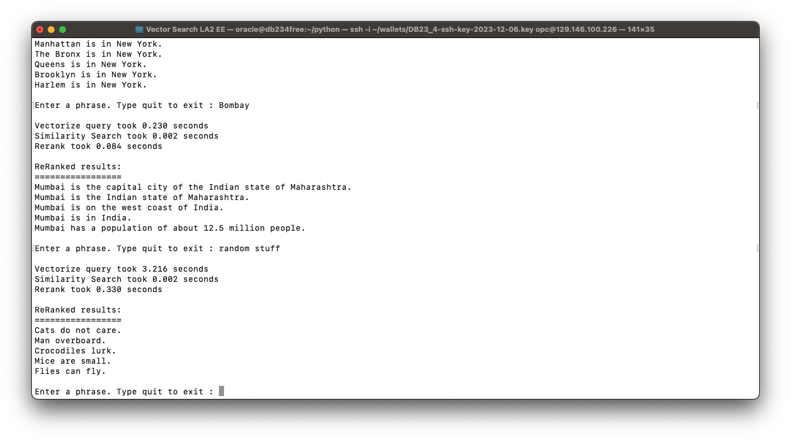

    The first thing you may notice is that this takes slightly longer, but just as you may have anticipated, there is little or no correlation between the terms returned and the phrase we entered. This is also likely influenced by the small data-set or number of rows in the MY\_DATA table.

    This also introduces another topic. What about changing the Embedding Model?  We'll take a look at that next...  


## Task 4: Changing embedding models

So far, for the sake of simplicity and speed, we have been using the "embed-english-light-v3.0" or English Light v3.0 embedding model from Cohere. In the next step we will switch the embedding model to see how it impacts our similarity search results.

We will continue to use Cohere, so the modifications required are minor.

1. In order to do this we will need to edit the python program: *similarity\_search\_Cohere.py*.

    Before we get started with making our changes, we should take a few moments to understand what the program is doing.

    If we scroll down past the comments in the file we will see:

   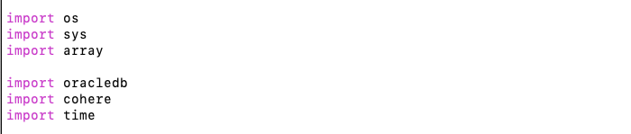

    Below the comment section of the program you will notice that we are importing the os, sys, array and time python modules. We are using these modules for performing basic operations in the program.  

    We are also importing-
    - oracledb - the Python Driver for OracleDatabase. https://oracle.github.io/python-oracledb/
    - cohere - the Cohere Client library for accessing Cohere. https://github.com/cohere-ai/cohere-python

    Next we are passing the Oracle database Username and Password along with the database connect-string. We then set the number of rows to return (topK) along with whether or not to use  Re-ranking.

   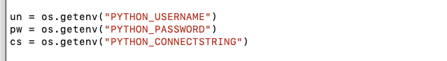

    The SQL statement returns the text from the INFO column in the MY\_DATA table.

   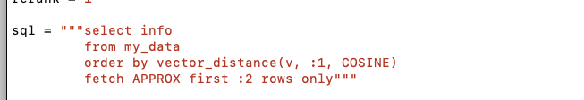

    The SQL statement calls the vector_distance function to perform a similarity comparison of the vectorized value for the input string (:1) with the vector that we stored in column V. This example performs a COSINE Similarity Search. We are only returning the first 5 rows (:2) which can be controlled using the TopK parameter. The key word APPROX informs the Oracle optimizer to use a Vector Index if it is deemed to be beneficial.  


    Below the SQL block we can see the parameter for setting the embedding model to be used by the program:

   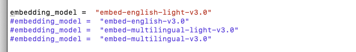


    This is where we can choose the embedding model. As mentioned earlier, we have been using the *embed-english-light-v3.0* - both to vectorize our data when we populated the MY\_DATA table, as well as when we performed our similarity searches.

    We can switch to the "non-light" version by commenting out the line where we with *"embed-english-light-v3.0"* and uncommenting the line for "embed-english-v3.0".

    Your modified program should look like this:

   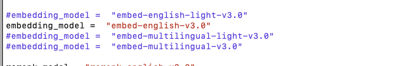

2. So now we're ready to rerun our program:

    ```
      <copy>
      python3.11 similarity_search_Cohere.py
      </copy>
    ```

    When prompted for a query string, enter the term "cats".

    However, this time, when we run the program we see the following error displayed:

   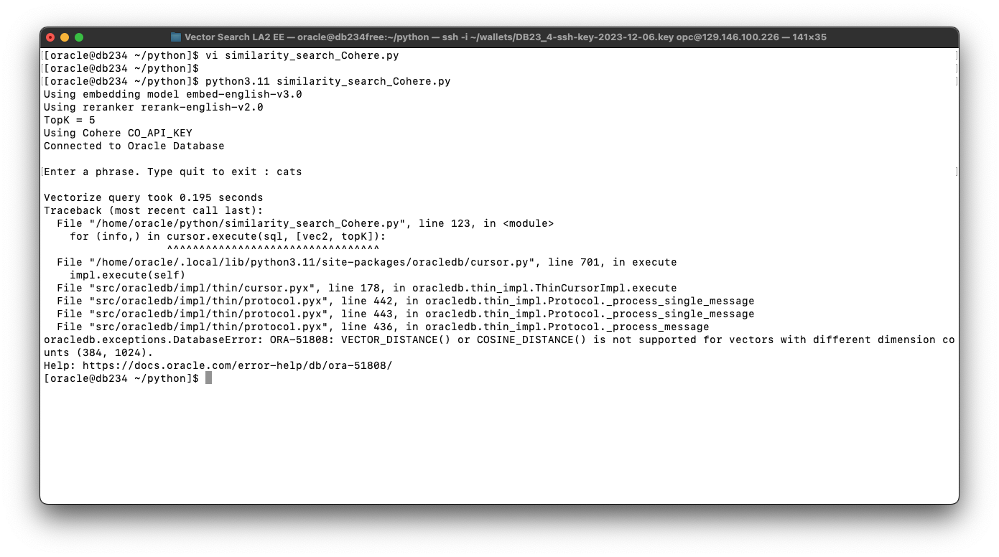


    This is because, as we mentioned earlier, you cannot perform similarity search operations using different embedding models. In other words, in order for us to use the *embedding-english-v3.0* model, we will need to go back and re-vectorize the data in the MY\_DATA table so that it too uses the same embedding model.

    In order to make this change we will need to revisit the *vectorize\_table\_Cohere.py* program and make the same code change to comment out the line for assigning the *"embed-english-light-v3.0"* and uncommenting the line for *"embed-english-v3.0"*.

    The program should look like this:

   

3. We will also need to rerun the Vectorize program to change the embedding model for our terms-  


    ```
      <copy>
      python3.11 vectorize_table_Cohere.py
      </copy>
    ```

    This time the vectorize operation will take slightly longer to run as the new model is more complex. For comparison embed-english-light-v3.0 has 384 dimensions and embed-english-v3.0 has 1024 dimensions.

    Your should see the following:

   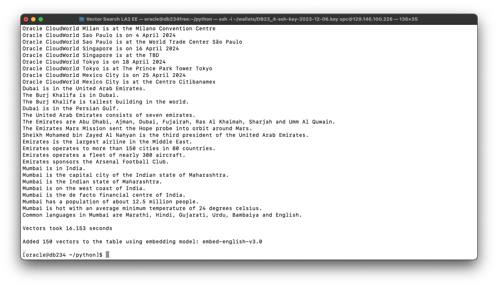


4. We're now ready to reun the Similarity Search program once again-

    ```
      <copy>
      python3.11 similarity_search_Cohere.py
      </copy>
    ```

    When prompted to enter a phrase to query - enter "cats"

    You should see something similar to the following-

   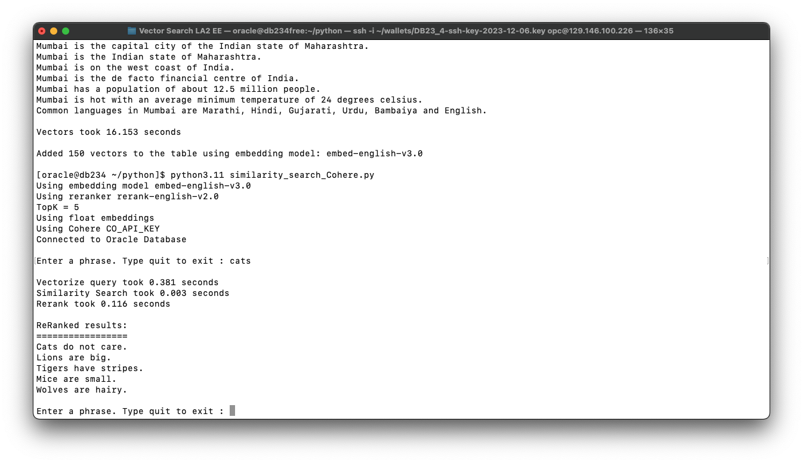

   This time your output will be different. The first result returned is "Cats do not care." which is more accurate than when we previously ran this query (you may recall the first entry was "Oranges are orange" when we used the *embed-english-light-v3.0* model). The last entry in the results "Wolves are hairy." is still not quite accurate but one could argue that there is a better correlation as they are both animals.   

5. Also when we re-run the query for "Borough" we see "Staten Island" this time, but we don't see "Queens" so we get a different set of results,  but it's still not exactly right...

   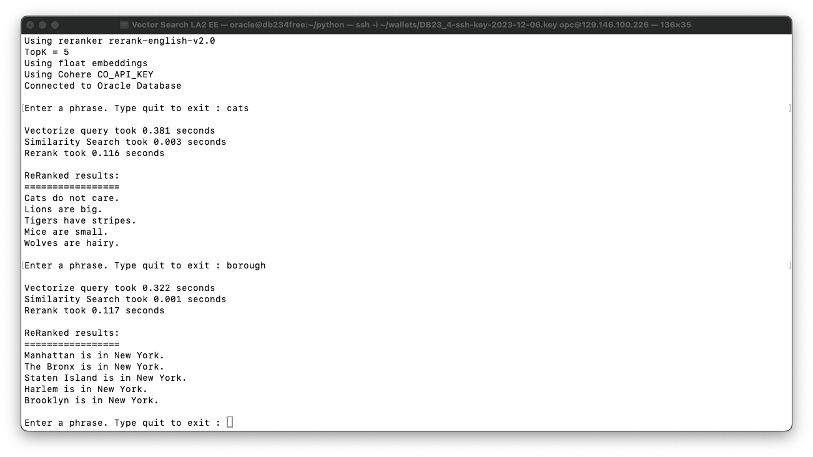


   Feel free to try some other queries including repeating some of the previous examples we entered with the light embedding model for your own comparison.


## Summary

In this lab you have seen how easy it is to use Cohere with Python and Oracle Vectors and Similarity Search. You are ready to move onto the next lab.

</if>

<if type="OpenAI">

# Lab 1: Using OpenAI Vector Embedding Models With Python

## Introduction

In this lab we will see how we can use the OpenAI embedding models and Python with Oracle Vectors. OpenAI is a commercial product and as such requires a licensed key to use their embedding models.

**NOTE:** You may already be aware that there is a newer version of OpenAI available than the version we are using for this Oracle LiveLab. The newer version has a dependency on *GLIBC\_2.29* which is not yet supported in Oracle Linux 8.

------------
Estimated Time: 25 minutes

### Objectives


In this lab, you will see the following Vector operations using Python:
* Task 1: Install python libraries for OpenAI
* Task 2: Vectorizing a table with OpenAI
* Task 3: Understanding the Vector embedding process
* Task 4: Perform Similarity Search using OpenAI
* Task 5: Changing embedding models


### Prerequisites

This lab assumes you have:
* An Oracle account
* An API key for OpenAI (Can be a free trial key)
* Successfully completed Lab 0: Setup lab.
* An Oracle Database 23.4 preinstalled

*This is the "fold" - below items are collapsed by default*

## Task 1: Install OpenAI Python libraries.

Before we can use the OpenAI embedding models with Python, we need to install the python libraries for OpenAI version 0.28.0

1. Our first step is to install the OpenAI python lbraries. While logged in as the oracle Linux user, enter the following command-

    ```
      <copy>
      pip install --upgrade openai==0.28.0
      </copy>
    ```

    You should see:

    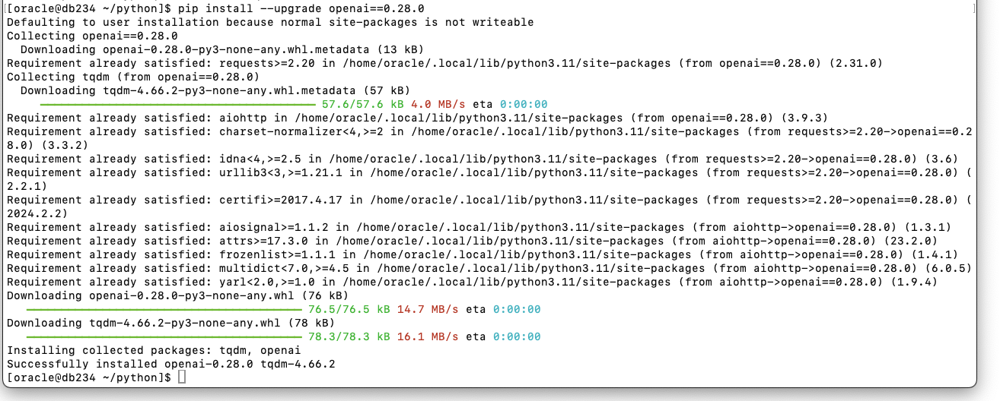

    **NOTE:** We are using an older version of openai as our source code has been written with the older version.


## Task 2: Vectorizing a table with OpenAI embedding

1. The first step is to vectorize the contents of our table using an embedding model from OpenAI. To do this, you will need to create a python program to vectorize our phrases using the OpenAI embedding model libraries that we just installed.

While logged into your Operating System as the Oracle user, create a file called *vectorize\_table\_OpenAI.py* and paste the following contents into the file.

    ```
      <copy>
      # -----------------------------------------------------------------------------
      # Copyright (c) 2024, Oracle and/or its affiliates.
      #
      # This software is dual-licensed to you under the Universal Permissive License
      # (UPL) 1.0 as shown at https://oss.oracle.com/licenses/upl and Apache License
      # 2.0 as shown at http://www.apache.org/licenses/LICENSE-2.0. You may choose
      # either license.
      #
      # If you elect to accept the software under the Apache License, Version 2.0,
      # the following applies:
      #
      # Licensed under the Apache License, Version 2.0 (the "License");
      # you may not use this file except in compliance with the License.
      # You may obtain a copy of the License at
      #
      #    https://www.apache.org/licenses/LICENSE-2.0
      #
      # Unless required by applicable law or agreed to in writing, software
      # distributed under the License is distributed on an "AS IS" BASIS,
      # WITHOUT WARRANTIES OR CONDITIONS OF ANY KIND, either express or implied.
      # See the License for the specific language governing permissions and
      # limitations under the License.
      # -----------------------------------------------------------------------------
      #
      # Add or update the vectors for all data values in a table
      # Use the OpenAI embedding models to create the vectors
      #

      import os
      import sys
      import array
      import time

      import oracledb
      import openai

      un = os.getenv("PYTHON_USERNAME")
      pw = os.getenv("PYTHON_PASSWORD")
      cs = os.getenv("PYTHON_CONNECTSTRING")

      # Get your OpenAI API Key from the environment
      openai.api_key = os.getenv("OPENAI_API_KEY")
      if openai.api_key:
          print('Using OPENAI_API_KEY')
      else:
          print('\nYou need to set your OpenAI API KEY\n')
          print('https://openai.com/pricing')
          print('export OPENAI_API_KEY=whatever_your_api_key_value_is\n')
          exit();

      embedding_model = "text-embedding-3-small"
      #embedding_model = "text-embedding-3-large"
      #embedding_model = "text-embedding-ada-002"

      print("Using embedding model " + embedding_model)

      query_sql = """select id, info
                     from my_data
                     order by 1"""

      update_sql = """update my_data set v = :1
                      where id = :2"""

      # Connect to Oracle Database 23.4
      with oracledb.connect(user=un, password=pw, dsn=cs) as connection:
          db_version = tuple(int(s) for s in connection.version.split("."))[:2]
          if db_version < (23, 4):
              sys.exit("This example requires Oracle Database 23.4 or later")
          print("Connected to Oracle Database\n")

          with connection.cursor() as cursor:
              print("Vectorizing the following data:\n")

              # Loop over the rows and vectorize the VARCHAR2 data
              binds = []
              tic = time.perf_counter()
              for id_val, info in cursor.execute(query_sql):
                  # Convert to format that OpenAI wants
                  data = [info]

                  print(info)

                  # Create the vector embedding [a JSON object]
                  response = openai.Embedding.create(
                      model=embedding_model, input=data
                  )

                  # Extract the vector from the JSON object
                  vec = response["data"][0]["embedding"]

                  # Convert to array format
                  vec2 = array.array("f", vec)

                  # Record the array and key
                  binds.append([vec2, id_val])

              toc = time.perf_counter()

              # Do an update to add or replace the vector values
              cursor.executemany(
                  update_sql,
                  binds,
              )
              connection.commit()

              print(f"\nVectors took {toc - tic:0.3f} seconds")
              print(f"\nAdded {len(binds)} vectors to the table using embedding model: " + embedding_model + "\n")
      </copy>
    ```

2. Save the file and run it with *python3.11* as follows:


    ```
      <copy>
      python3.11 vectorize_table_OpenAI.py
      </copy>
    ```

    If this is the first time you are running the program, you will likely see:

    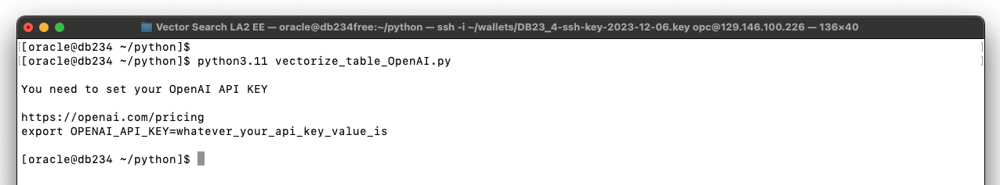


    If you have not used the OpenAI python libraries on this system before, you will likely encounter an error informing you that you have not entered an API Key to use OpenAI. This is because OpenAI is a commercial product and requires a key to use their REST end-point.

    OpenAI will provide you with $5 worth of API pre-paid credits when you set up a new account. These credits expire in 3 months. You can find out more about getting an API key for OpenAI at [openai.com](https://openai.com/product).


3. Once you have a OpenAI API Key you are ready to proceed with vectorizing your data. The first step is to assign the key to an environment variable *OPENAI\_API\_KEY* as follows:

    ```
      <copy>
      export OPENAI_API_KEY=<your OpenAI api key>
      </copy>
    ```


4. After you have set the *OPENAI\_API\_KEY* environment variable to your license key, you are ready to run the *vectorize\_table\_OpenAI.py* python program. This can be done by performing the following-  

    ```
      <copy>
      python3.11 vectorize_table_OpenAI.py
      </copy>
    ```

    When the program finishes running, you should see something similar to the following-

    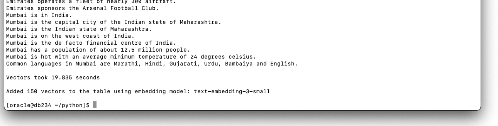

    In our case, the program took just under 20 seconds to run, your processig time should be similar.

    It also used the OpenAI *text-embedding-3-small* model to vectorize the data in the table. The *"text-embedding-3-small"* model is an upgrade to the *"text-embedding-ada-002"* model.

    To summarize what we've just done, the *vectorize\_table\_OpenAI.py* program connects to the Oracle database, retrieves the text from the INFO column of the *MY\_DATA* table, and vectorizes the "factoid" for each of the 150 rows. We are then storing the vectorized data as a vector in the column called: V. You should also notice that we used the *text-embedding-3-small* embedding model for this operation.

    Do not worry if you have already vectorized the data in the MY\_DATA table (even with a different embedding model such as Cohere) as the operation is idempotent. If there was already data in the MY\_DATA table, the data in the V column will be overwritten.

5. Before we move onto performing Similarity Searches using the embedding models from OpenAI, we should take a look in the the Oracle database to see the updates made to the *MY\_DATA* table.

    i. Connect to your Oracle database as the user: **vector** and password: **vector**

    ```
      <copy>
      sqlplus vector/vector@orclpdb1
      </copy>
    ```

    ii. We can now query the MY\_DATA table to verify that all 150 rows have been updated.

    ```
      <copy>
      select count(*) from MY_DATA where V is not null;
      </copy>
    ```

    You should see:

    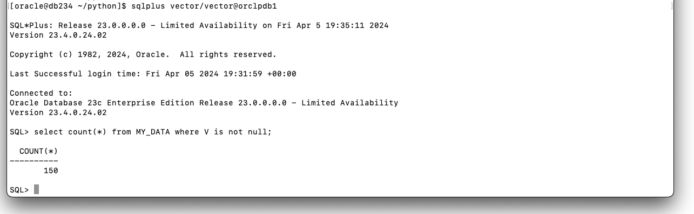


    iii. We can also query the vector column: V in the MY\_DATA table to see what the vectors and dimensions look like.

    ```
      <copy>
      select V from MY_DATA;
      </copy>
    ```

    You should see something similar to this-

    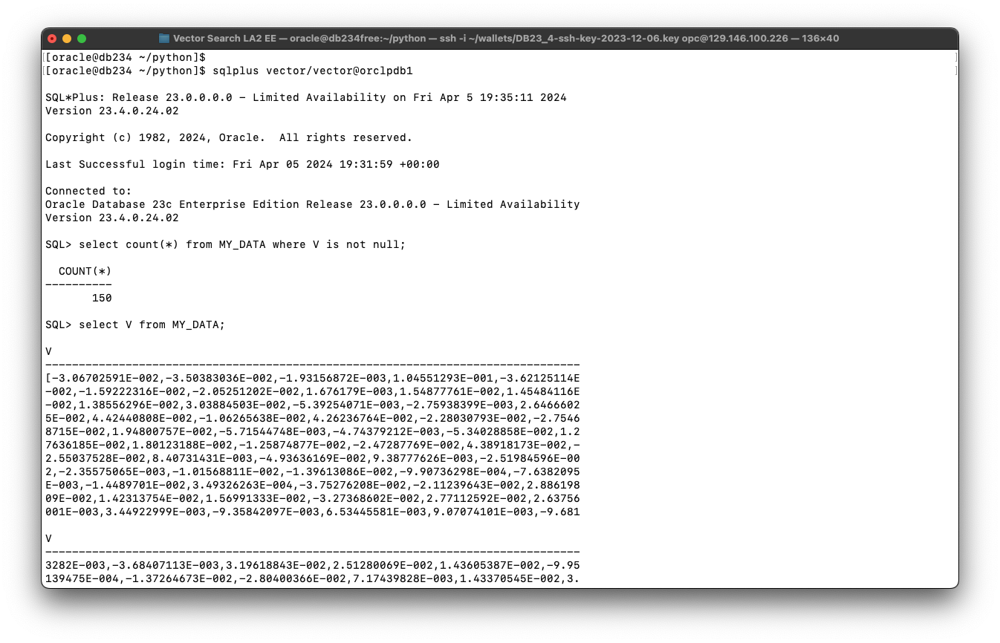

    and

    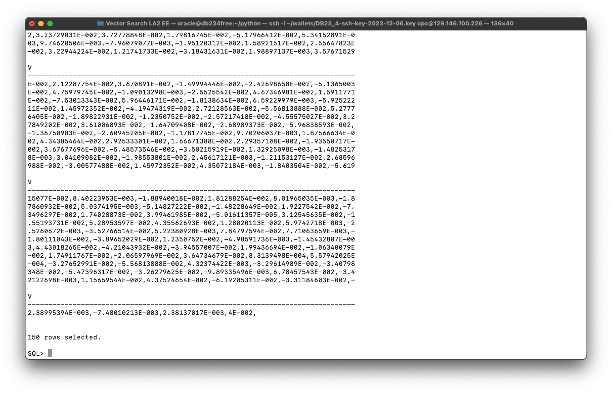


    What you are seeing is the semantic representation of the data stored in the corresponding row of the INFO column.

    iv. We can also query the length of the vectors stored in the V column by running the following query-

    ```
      <copy>
      select max(length(V)) from MY_DATA ;
      </copy>
    ```

    You should see something similar to this-

    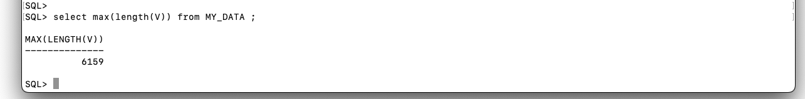

    You will notice that the length of the vector column: *"V"* is 6159.  

    This is approximately: ((1536 dimensions) x (4 bytes)) + (header overhead)

Now that we have vectorized the data in our table and confirmed the updates. We are ready to move onto performing some Similarity Searches using our Vectors. But before we do that, let's take a moment to look at the contents of the python program we just crated.


## Task 3: Understanding the Vector embedding process

Before proceeding any further, lets take a look at the code of the Python program we just ran. This will give us a better understanding of how this process is being performed. You will notice that this program looks very similar to the other vectorize_table python programs we have in this tutorial, the basic logic flow is very similar for the most part.

1. Open the file with your favorite editor. Or you can use *vi* or *view* to view the contents of the file. We will not be making any changes to the program-

    ```
      <copy>
      view vectorize_table_OpenAI.py
      </copy>
    ```


    After you Scroll past the comments section of the program you will notice that we are importing the os, sys, array and time python modules. We are using these modules to performing basic operations in the program.  

    We are also importing-
    - **oracledb** - the Python Driver for OracleDatabase. https://oracle.github.io/python-oracledb/
    - **openai** - the openai library for accessing openai. https://github.com/openai/openai-python

    Next we are passing the Username and Password along with the database connect-string for the Oracle Database user. We then parse the *OPENAI\_API\_KEY* from our environment variable. This is necessary for authenticating and authorization to access the service. It is also used by OpenAI to track consumption for billing purposes.

    Below that section is where we can set the embedding model to be used, in this case we are using "text-embedding-3-small" this is the embedding model entry that is uncommented. The "small" model is going to be faster than the "large" model but slightly less acurate. Note, the "ada-002" model is an older embedding model from OpenAI.

    


2. In the next section we see two SQL statements being defined. The first SQL statement (query\_sql) is used as the basis for a cursor to loop through the MY\_DATA table. The second SQL statement (update\_sql) is where we set the vectorized data to update the column "V" in the MY\_DATA table for the corresponding "ID" column.

    After defining the SQL statements we are ready to connect to the database using the oracledb.connect module.

    


3. Once connected to the database, the program loops through the result set of the query\_sql cursor variable and, for each row returned, the "V" column is updated with the vectorized version of the "INFO" column. Keep in mind the "INFO" column has already been populated with the phrase that is used to vectorize, and this is what gets passed to OpenAI for vectorization.

    You will notice that *openai.Embedding.create* is being called in the loop and the vector is being retrieved as a JSON object.

    

    You can close the program file.

You are now ready to move onto the next step where we will run similarity search operations against the sample data we have loaded into our table.

## Task 4: Perform Similarity Search using OpenAI

So far we have vectorized the data in the *MY\_DATA* table using an OpenAI embedding model, we can now start performing Similarity Searches using the Vectors in our table. Even though the table has been vectorized we will still need to connect to OpenAI to vectorize our search phrase with the same embedding model. The search phrase is entered on the fly, vectorized and then used to search against the vectors in the database. We will create a python program to do this.

1. While logged into your Operating System as the Oracle user, create a file called *similarity\_search\_OpenAI.py* and paste the following contents into the file.

    ```
      <copy>
      # -----------------------------------------------------------------------------
      # Copyright (c) 2024, Oracle and/or its affiliates.
      #
      # This software is dual-licensed to you under the Universal Permissive License
      # (UPL) 1.0 as shown at https://oss.oracle.com/licenses/upl and Apache License
      # 2.0 as shown at http://www.apache.org/licenses/LICENSE-2.0. You may choose
      # either license.
      #
      # If you elect to accept the software under the Apache License, Version 2.0,
      # the following applies:
      #
      # Licensed under the Apache License, Version 2.0 (the "License");
      # you may not use this file except in compliance with the License.
      # You may obtain a copy of the License at
      #
      #    https://www.apache.org/licenses/LICENSE-2.0
      #
      # Unless required by applicable law or agreed to in writing, software
      # distributed under the License is distributed on an "AS IS" BASIS,
      # WITHOUT WARRANTIES OR CONDITIONS OF ANY KIND, either express or implied.
      # See the License for the specific language governing permissions and
      # limitations under the License.
      # -----------------------------------------------------------------------------
      #
      # Basic Similarity Search using the OpenAI embedding models.
      #

      import os
      import sys
      import array

      import oracledb
      import openai
      import time

      un = os.getenv("PYTHON_USERNAME")
      pw = os.getenv("PYTHON_PASSWORD")
      cs = os.getenv("PYTHON_CONNECTSTRING")

      # topK is how many rows to return
      topK = 5

      # Re-ranking is about potentially improving the order of the resultset
      # Re-ranking is significantly slower than doing similarity search
      # Re-ranking is optional
      rerank = 0

      embedding_model = "text-embedding-3-small"
      #embedding_model = "text-embedding-3-large"
      #embedding_model = "text-embedding-ada-002"

      # OpenAI ReRanking
      rerank_model = "rerank-english-v2.0"
      #rerank_model = "rerank-multilingual-v2.0"

      print("Using embedding model " + embedding_model)
      if rerank:
        print("Using reranking model " + rerank_model)
      else:
        print("Not using reranking")

      print("TopK = " + str(topK))

      sql = """select info
               from my_data
               order by vector_distance(v, :1, COSINE)
               fetch approx first :2 rows only"""

      # Get your OpenAI API Key from the environment
      openai.api_key = os.getenv("OPENAI_API_KEY")
      if openai.api_key:
          print('Using OPENAI_API_KEY')
      else:
          print('\nYou need to set your OpenAI API KEY\n')
          print('https://openai.com/pricing')
          print('export OPENAI_API_KEY=whatever_your_api_key_value_is\n')
          exit();

      # Connect to Oracle Database 23.4
      with oracledb.connect(user=un, password=pw, dsn=cs) as connection:
          db_version = tuple(int(s) for s in connection.version.split("."))[:2]
          if db_version < (23, 4):
              sys.exit("This example requires Oracle Database 23.4 or later")
          print("Connected to Oracle Database")

          with connection.cursor() as cursor:

              while True:
                  # Get the input text to vectorize
                  text = input("\nEnter a phrase. Type quit to exit : ")

                  if (text == "quit") or (text == "exit"):
                      break

                  if text == "":
                      continue

                  sentence = [text]

                  tic = time.perf_counter()

                  # Create the vector embedding [a JSON object]
                  response = openai.Embedding.create(
                      model=embedding_model, input=sentence
                  )

                  toc = time.perf_counter()
                  print(f"Vectorize query took {toc - tic:0.3f} seconds")

                  # Extract the vector from the JSON object
                  vec = response.data[0].embedding
                  vec2 = array.array("f", vec)

                  docs = []

                  tic = time.perf_counter()

                  # Do the Similarity Search
                  for (info,) in cursor.execute(sql, [vec2, topK]):
                      docs.append(info)

                  toc = time.perf_counter()
                  print(f"Similarity Search took {toc - tic:0.4f} seconds")

                  if rerank == 0:

                      # Just rely on the vector distance for the resultset order
                      print("\nWithout ReRanking")
                      print("=================")
                      for hit in docs:
                        print(hit)

                  else:

                    tic = time.perf_counter()

                    # ReRank for better results
                    results = co.rerank(query=text,
                                        documents=docs,
                                        top_n=topK,
                                        model=rerank_model)

                    toc = time.perf_counter()
                    print(f"Rerank took {toc - tic:0.3f} seconds")

                    print("\nReRanked results:")
                    print("=================")
                    for hit in results:
                      print(docs[hit.index])
      </copy>
    ```


2. Save the file and run it with *python3.11* as follows:

    ```
      <copy>
      python3.11 similarity_search_OpenAI.py
      </copy>
    ```

    **NOTE:** If you see the following error it means your OpenAI API Key has not been setup correctly.

    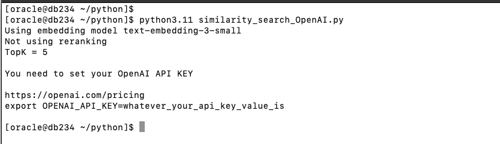

    You will need to set your OpenAI API Key using the environment variable before running *similarity\_search\_OpenAI.py* Python program. It can be set using the following command.

    ```
      <copy>
      export OPENAI_API_KEY= <you OpenAI API key>
      </copy>
    ```

    Once your OpenAI API Key is set and you have run the similarity search Python program. The first thing you should see is:

    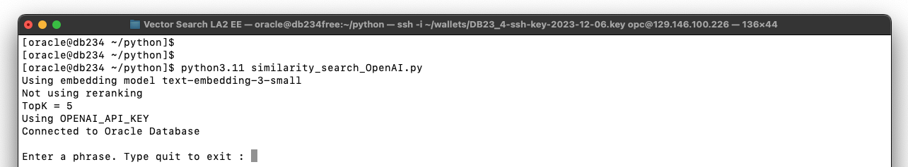


    **NOTE:** The embedding model being used is displayed when we run the program. It is important to make sure that the embedding model you use matches the embedding model you chose when you vectorized the data. As a mismatch will lead to an error and even worse a false positive - in the sense that no error will be displayed but the wrong results will be displayed. You will also see that we are not using ReRanking in this example. This is because OpenAI does not support Re-Ranking, but it is possible to use other embedding models like Cohere for this purpose.


3. For our first example let's enter the word "cars". This is the same phrase we have tested with the other models, so if you have tried this with other models you know what to expect, and these results should be the similar conceptually. In our situation it took under half a second to vectorize query and about 2 milliseconds to perform the similarity search.

    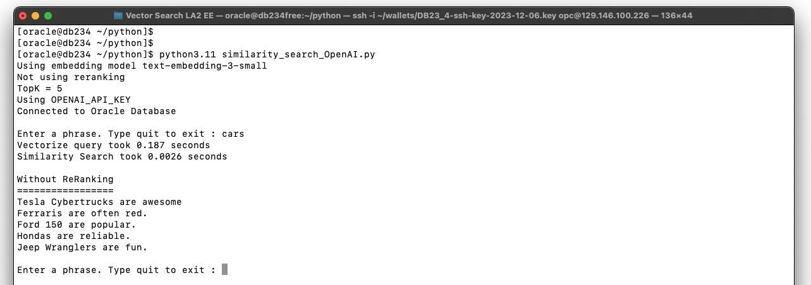


    Next let's try the phrase "cats" and see what our results are.

    You should see:

    

    The first thing you may notice is that the operation runs slightly faster this time as we have already performed our database connection and authorization and the OpenAI libraries are already loaded into memory too.

    Looking at the query output, not all the results are directly related to our search term: "cats", but one could argue that there is a minor correlation as all 5 rows are animal associations. So not too bad considering our relatively small number of 150 entries.

    If we try a more general term like "animals" we should see the following:

    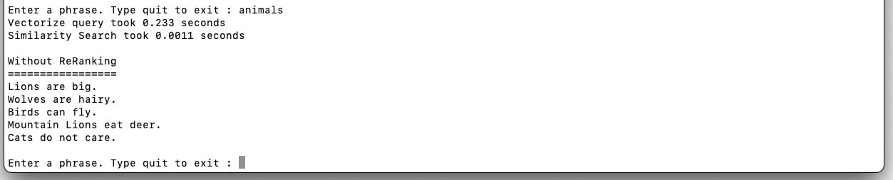


    Let's try our two queries related to New York...

    First we'll try "NY" and then "boroughs"

    This time you should see the following:

    

    The results we see for "NY" are related to places located in the state of "New York". But the second search, for the term "boroughs", is not so accurate. As "Harlem" is not a borough of New York City, but "Boston" is not even in the state of New York. It is important to remember that similarity search can respond with results vary depending on the embedding model in use.    

    Another interesting query to test with is the phrase "New Zealand".

    This time we see the following:

    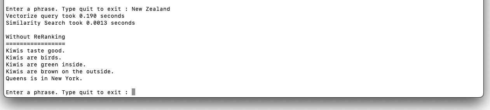


    The top 4 results we see when using OpenAI and the "text-embedding-3-small" embedding model are related to the place "New Zealand" ("Kiwi" is slang for a person from New Zealand, and Kiwi birds and Kiwi fruit are native to New Zealand). However the last entry about "Queens" seems very random, though it is a geographic location and the word "New" appears in both phrases, so one could argue there is a slight correlation here.


## Task 5: Changing embedding models

1. Just as we have done with embedding models from other vendors, let's experiment with changing the embedding model in our OpenAI Python program.

    In this case we are going to see what happens when we switch to a larger embedding model. We will switch from *"text-embedding-3-small"* to *"text-embedding-3-large"*. This change increases the number of dimensions for each Vector from 1536 to 3072, so hopefully the accuracy of our search results will improve.

    **NOTE:** There is a difference in cost when using different embedding models in OpenAI. Pricing information for the OpenAI embedding models is available here: https://openai.com/pricing

   To make this change we will need to change the embedding model in both of the following OpenAI Python programs:
   - vectorize\_table\_OpenAI.py  
   - similarity\_search\_OpenAI.py

   Remember, the embedding model used for a similarity search must match the embedding model used to vectorize the data, hence the need to modify both programs.

   As we mentioned earlier, you do not need to worry about the impact of re-vectorizing the data in the MY\_DATA table (even with different embedding models) as it is a SQL UPDATE operation and it is idempotent. If there was already data in the MY\_DATA table, the data in the V column will simply be updated and overwritten.

   To switch the embedding models we simply comment out the line with "text-embedding-3-small" and uncomment the line with "text-embedding-3-large".

   **BEFORE** making changes your program will have:

    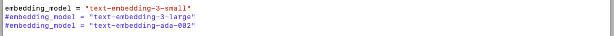


   **AFTER** making changes your program will have:

    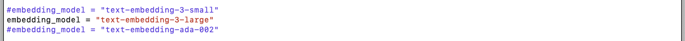

   Modify the *vectorize\_table\_OpenAI.py* program with your favorite editor - or you can use vi:

    ```
      <copy>
      vi vectorize_table_OpenAI.py
      </copy>
    ```

    Modify the *similarity\_search\_OpenAI.py* program with your favorite editor - or you can use vi:

    ```
      <copy>
      vi similarity_search_OpenAI.py
      </copy>
    ```

2. Once you have saved your changes, we can run the vectorize\_table\_OpenAI.py program as follows:

    ```
      <copy>
      python3.11 vectorize_table_OpenAI.py
      </copy>
    ```

    You should see:
    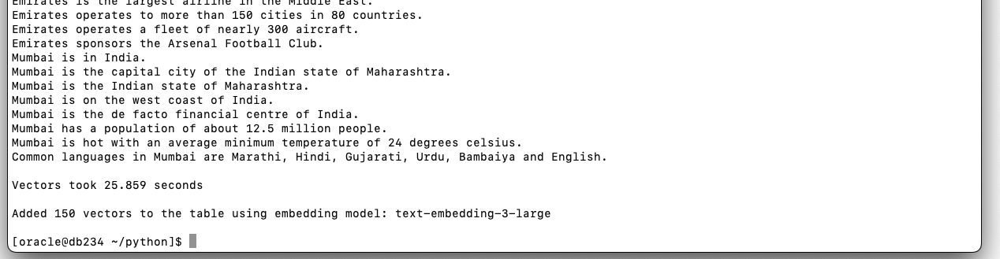

    Make sure that at the end of the program run you see the correct embedding model displayed: "text-embedding-3-large". In our example the operation took around 26 seconds to perform. You may recall the same operation took approximately 20 seconds when we used the smaller OpenAI embedding model: "text-embedding-3-small".

3. We can take a quick look at the Vector column: V in the MY\_DATA table in the Oracle database to see what the change looks like by logging into sqlplus:

    ```
      <copy>
      sqlplus vector/vector@orclpdb1
      </copy>
    ```

    and then running the following query-

    ```
      <copy>
      select V from MY_DATA ;
      </copy>
    ```

    You should see:

    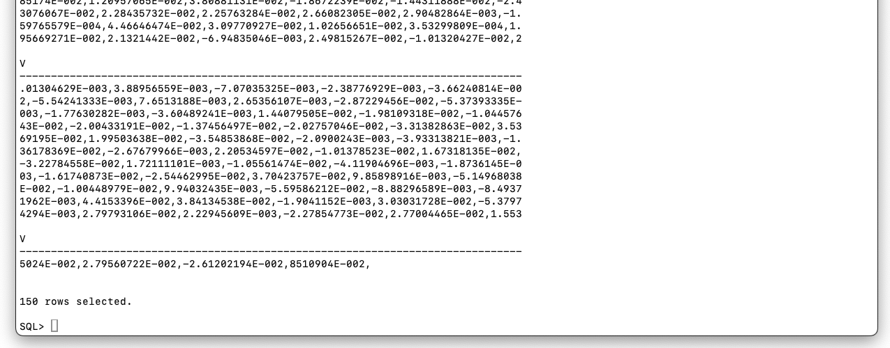


    To be honest it is difficult to see a change to our Vectors when we look at the raw data. An alternative query we can try is to see if the length of the V column has changed. We can run the following query to check this-

    ```
      <copy>
      select max(length(V)) from MY_DATA ;
      </copy>
    ```

    You should see something similar to this-

    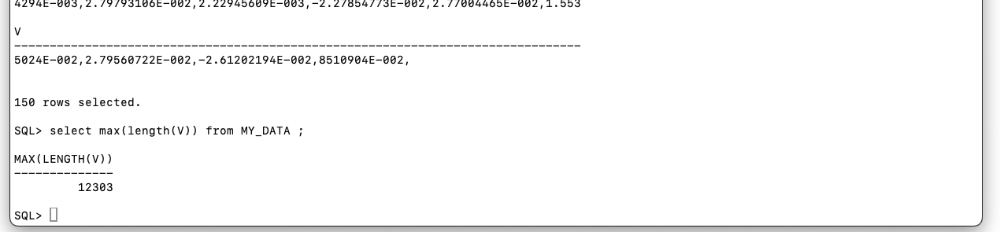

    You should notice that that length of the contents in the vector column: V is now 12303.  You may recall it was 6159 when we used the smaller model.

    This is approximately: ((3072 dimensions) x (4 bytes)) + (header overhead) = 12288


4. We're now ready to try out our new model by running a new similarity search with it. As a baseline let's start with our familiar search terms "cars"

    Run the OpenAI similarity search Python program-

    ```
      <copy>
      python3.11 similarity_search_OpenAI.py
      </copy>
    ```

    You should see:

    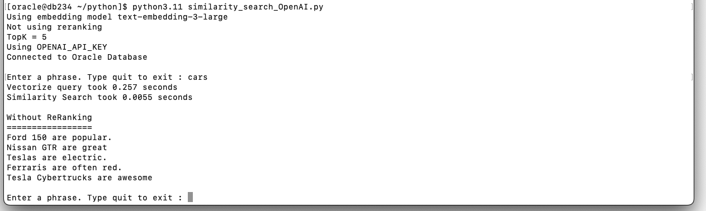

    The first thing you may notice is that the performance for the search with the larger model is slower than the smaller model. large: 0.257 seconds versus small: 0.187 seconds for vectorizing the query and then large: 0.0055 seconds versus small: 0.0026 to perform the similarity search.

    Also, the results for the similarity search for the phrase "cars" is once again 100% accurate, however the phrases returned are different to those returned when we used the smaller embedding model.    

    Now let's try the phrase "cats" to assess if there are any changes-

    You should see:

    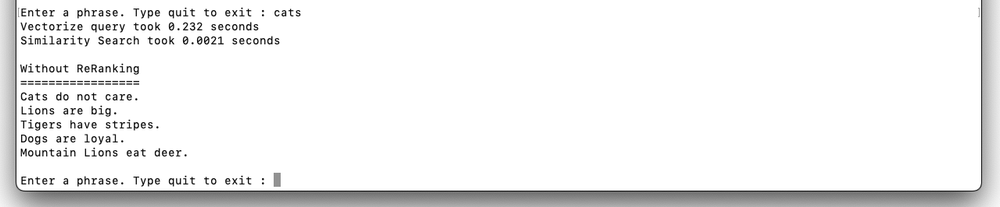

    This time we still see four of the five results include terms directly related to Cats. One could argue that while the one odd phrase is not specific to cats, there is a closer correlation between cats and dogs versus cats and crocodiles.

    Let's revisit our other combination of phrases "NY and "Boroughs" to see whether the embedding model makes a difference.

    You should see:

    

    This time, both phrases return 100% correct results. So the large model with more dimensions provides us with better accuracy.

    Another phrase to retry is "New Zealand".

    This time we see the following:

    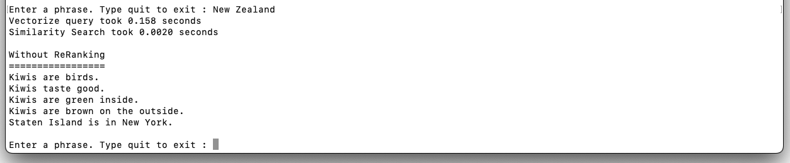

    Once again, the top 4 results are the same as when using the OpenAI "text-embedding-3-small" embedding model. All four phrases are related to the place "New Zealand" ("Kiwi" is slang for a person from New Zealand, and *Kiwi birds* and *Kiwi fruit* are native to New Zealand). However once again the last phrase about "Staten Island" seems very out of place at first. But it is a geographic location and the word "New" appears in both phrases, so one could argue there is a slight correlation here.

    Feel free to try some other queries including repeating some of the previous examples we entered when we used other embedding models for your own comparison.

    To summarize, the difference between the two OpenAI embedding models we've tried, comes down to performance versus accuracy. There are times where accuracy is more important than performance and vice versa. This is a trade-off you will need to decide upon - based on your specific use-case. The least of your concerns is whether or not the Oracle database can accomodate different embedding models.  The effort to support different embedding models with Oracle Database is minimal.

    Feel free to try some other queries including repeating some of the previous examples we entered with the "small" embedding model for your own comparison.


## Summary

In this lab you have seen how easy it is to use OpenAI with Python and Oracle Vectors and Similarity Search. You are ready to move onto the next lab.


</if>

<if type="SentenceTransformers">

# Lab 1: Using Sentence Transformers and Python with Oracle AI Vector Search

## Introduction

In this lab we will be using open source embedding models from Hugging Face so they're free to use. In addition to being free to use, these models can be installed locally, so they can be accessed by making a function call to a library, rather than a RESTful call over the internet.

So they're free, local and fast ...plus there are over 500 sentence transformer models to choose from.

*SentenceTransformers* is an open source Python framework for modern sentence, text and image embeddings. Sentence Transformers make creating embeddings for text or images simple. Simple text based sentence transformers tend to have the same template where the only variable is the embedding model.

See [https://www.sbert.net/](https://www.sbert.net/) and [https://arxiv.org/abs/1908.10084](https://arxiv.org/abs/1908.10084) for more details about Sentence Transformers.


------------
Estimated Time: 20 minutes

### Objectives

In this lab, you will perform the following tasks:
* Task 1: Installing Sentence Transformers libraries in your system
* Task 2: Vectorizing a table with Sentence Transformers embedding
* Task 3: Understanding the Vector Embedding processing
* Task 4: Perform Similarity Search with Sentence Transformers
* Task 5: Changing embedding models


### Prerequisites

This lab assumes you have:
* An Oracle account
* An Oracle Database 23.4 preinstalled
* Your workshop environment is configured (Completed Lab 0)

*This is the "fold" - below items are collapsed by default*

## Task 1: Installing Sentence Transformers libraries in your system

As mentioned in the Introduction, the sentence transformers available from hugging face are installed and run locally on your system. So unlike the Cohere and OpenAI labs where we installed a "small" software library to connect to an embedding model hosted in a remote location, this installs a "larger" set of software packages that include the embedding models themselves.

1. Check to see whether there is sufficient disk capacity in the system before proceeding. To see this, use the Linux *df -h* command as follows:

    ```
      <copy>
      df -h
      </copy>
    ```

    Your system should have 50 Gigabytes of space available. In our case we have 982G available:

    


2. Our first step is to install the *sentence-transformers* packages from hugging face with *pip* (package installer for Python). While logged in as the oracle Linux user, run the following *pip* command:

    ```
      <copy>
      pip install -U sentence-transformers
      </copy>
    ```

    This may take a few minutes to perform (in our case 4 minutes and our available disk space shrunk from 982G down to 974G).

    You should see:

    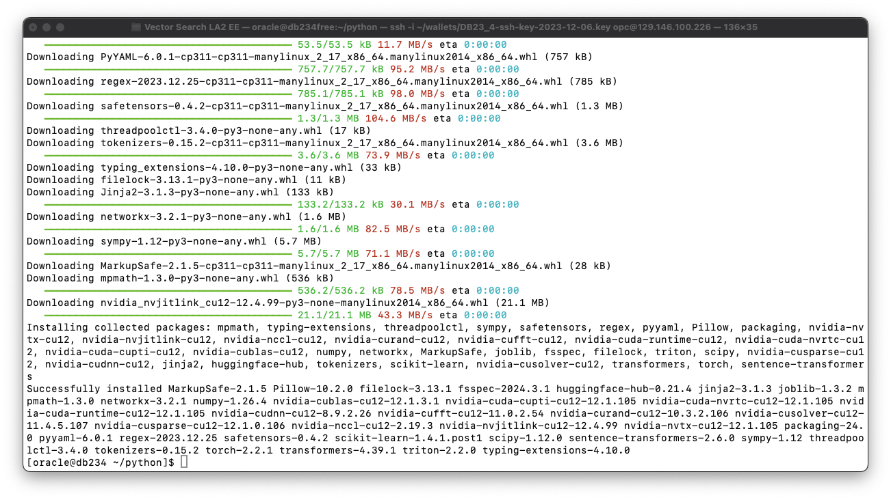


## Task 2: Vectorizing a table with Sentence Transformers embedding

We're now ready to vectorize our data using the hugging face sentence transformers. To do this you will need to create a python program to vectorize our phrases using the Sentence Transformers embedding model packages that we just installed.

1. While logged into your Operating System as the Oracle user, create a file called *vectorize_table_SentenceTransformers.py* and paste the following contents into the file.

    ```
      <copy>
      # -----------------------------------------------------------------------------
      # Copyright (c) 2023, Oracle and/or its affiliates.
      #
      # This software is dual-licensed to you under the Universal Permissive License
      # (UPL) 1.0 as shown at https://oss.oracle.com/licenses/upl and Apache License
      # 2.0 as shown at http://www.apache.org/licenses/LICENSE-2.0. You may choose
      # either license.
      #
      # If you elect to accept the software under the Apache License, Version 2.0,
      # the following applies:
      #
      # Licensed under the Apache License, Version 2.0 (the "License");
      # you may not use this file except in compliance with the License.
      # You may obtain a copy of the License at
      #
      #    https://www.apache.org/licenses/LICENSE-2.0
      #
      # Unless required by applicable law or agreed to in writing, software
      # distributed under the License is distributed on an "AS IS" BASIS,
      # WITHOUT WARRANTIES OR CONDITIONS OF ANY KIND, either express or implied.
      # See the License for the specific language governing permissions and
      # limitations under the License.
      # -----------------------------------------------------------------------------
      #
      # Add or update the vectors for all data values in a table
      #

      import os
      import sys
      import array
      import time

      import oracledb
      from sentence_transformers import SentenceTransformer

      un = os.getenv("PYTHON_USERNAME")
      pw = os.getenv("PYTHON_PASSWORD")
      cs = os.getenv("PYTHON_CONNECTSTRING")

      embedding_model = "sentence-transformers/all-MiniLM-L6-v2"
      #embedding_model = "sentence-transformers/all-MiniLM-L12-v2"
      #embedding_model = "sentence-transformers/paraphrase-MiniLM-L3-v2"
      #embedding_model = "sentence-transformers/all-mpnet-base-v2"
      #embedding_model = "sentence-transformers/all-distilroberta-v1"
      #embedding_model = "BAAI/bge-small-en-v1.5"
      #embedding_model = "BAAI/bge-base-en-v1.5"
      #embedding_model = "sentence-transformers/average_word_embeddings_glove.6B.300d"
      #embedding_model = "sentence-transformers/average_word_embeddings_komninos"
      #embedding_model = "nomic-ai/nomic-embed-text-v1"

      #embedding_model  = "BAAI/bge-m3"
      #embedding_model = "intfloat/multilingual-e5-large"
      #embedding_model = "intfloat/multilingual-e5-base"
      #embedding_model = "intfloat/multilingual-e5-small"
      #embedding_model = "paraphrase-multilingual-mpnet-base-v2"
      #embedding_model = "distiluse-base-multilingual-cased-v2"
      #embedding_model = "stsb-xlm-r-multilingual"

      print("Using " + embedding_model)

      model = SentenceTransformer(embedding_model, trust_remote_code=True)

      query_sql = """select id, info
                     from my_data
                     order by 1"""

      update_sql = """update my_data set v = :1
                     where id = :2"""

      # Connect to Oracle Database 23.4
      with oracledb.connect(user=un, password=pw, dsn=cs) as connection:
          db_version = tuple(int(s) for s in connection.version.split("."))[:2]
          if db_version < (23, 4):
              sys.exit("This example requires Oracle Database 23.4 or later")
          print("Connected to Oracle Database\n")

          with connection.cursor() as cursor:
              print("Vectorizing the following data:\n")

              # Loop over the rows and vectorize the VARCHAR2 data

              binds = []
              tic = time.perf_counter()

              for id_val, info in cursor.execute(query_sql):
                  # Convert to input string format for Sentence Transformers
                  data = f"[ {info} ]"

                  # Create the embedding and extract the vector
                  embedding = list(model.encode(data))

                  # Convert to array format
                  vec2 = array.array("f", embedding)

                  # Record the array and key
                  binds.append([vec2, id_val])

                  print(info)

              toc = time.perf_counter()

              # Do an update to add or replace the vector values
              cursor.executemany(
                  update_sql,
                  binds,
              )
              connection.commit()

              print(f"Vectors took {toc - tic:0.3f} seconds")
              print(f"\nAdded {len(binds)} vectors to the table using embedding model: " + embedding_model + "\n")

      </copy>
    ```

2. Save the file and run it with *python3.11* as follows:


    ```
      <copy>
      python3.11 vectorize_table_SentenceTransformers.py
      </copy>
    ```

    **NOTE:** The first time you run this program you will notice that it downloads a series of dependencies.

    You should see the following:

    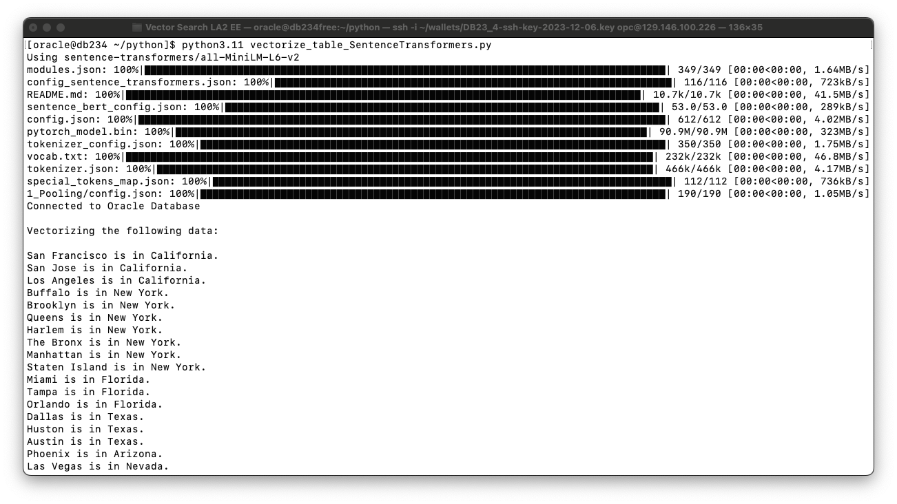

    Once the program has completed you will see the following:

    

    If you have previously run this process with Cohere or OpenAI, the first thing you will notice is that this operation runs significantly faster. This can be attributed to the fact that we do not have to go over the internet to perform the task.

    You may have also noticed that we used the *all-MiniLM-L6-v2* embedding model. This is a very popular embedding model with millions of monthly downloads. It's popularity is due to the fact that it tends to be a good trade-off when comparing accuracy and performance.

    To summarize what we've just done, the *vectorize\_table\_Cohere.py* program connects to the Oracle database, retrieves the text from the INFO column of the MY\_DATA table, and vectorizes the "factoid" for each of the 150 rows. We then store the vectorized data as a vector in the V column.


3. We can now query the MY\_DATA table in the Oracle database to verify that our data has been updated too:

    i. Connect to Oracle database as the user: *vector* and password *vector*

    ```
      <copy>
      sqlplus vector/vector@orclpdb1
      </copy>
    ```


    ii. We can now query the MY\_DATA table to verify that all 150 rows have been updated.

    ```
      <copy>
      select count(*) from my_data where V is not null ;
      </copy>
    ```

    You should see:

    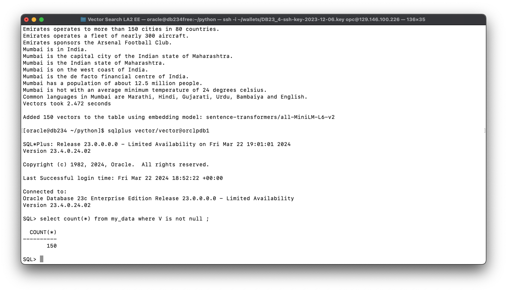


    iii. We can also query the vector column: V in the MY\_DATA table to see what the vectors and dimensions look like.

    ```
      <copy>
      select info from my_data where V is not null ;
      </copy>
    ```


    You should see:

    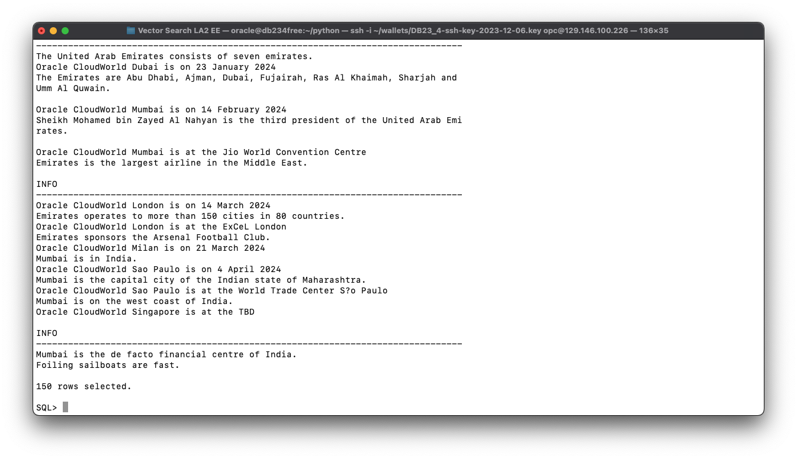


    ```
      <copy>
      select V from my_data ;
      </copy>
    ```


    You should see:

    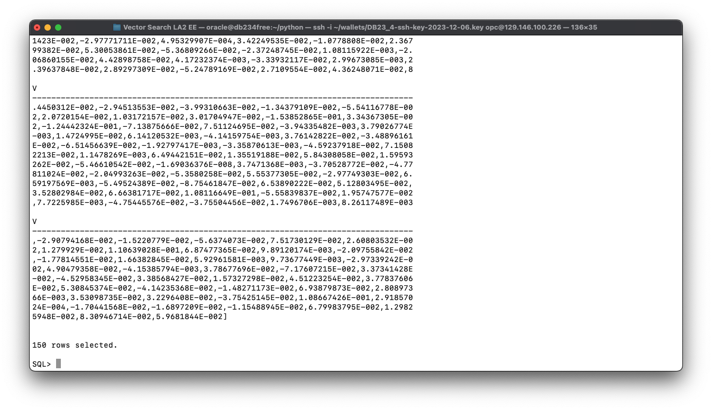


## Task 3: Understanding the Vector Embedding processing

Before proceeding any further, lets take a look at the code of the Python program we just ran. This will help us understand how this process is being performed. You will notice that this program looks very similar to the other vectorize\_table python programs we have run in this workshop, the basic logic flow is very similar for the most part.

1. Open the file with your favorite editor. You can use *vi* or *view* to view the contents of the file. We will not be making any changes to the program-

    ```
      <copy>
      vi vectorize_table_SentenceTransformers.py
      </copy>
    ```


    The first thing you should notice is that the program has just over 100 lines of code. If you've inspected the vectorizing python programs for Cohere or OpenAI you will see that this program logic is very similar. It calls the *oracledb* library to load the Python Oracle driver. This time however we are importing the SentenceTransformer package from Hugging Face.

    We also have a large number of embedding models to choose from. As we've aready noted, we opted to use the "all-MiniLM-L6-v2" embedding model due to it's popularity.       

    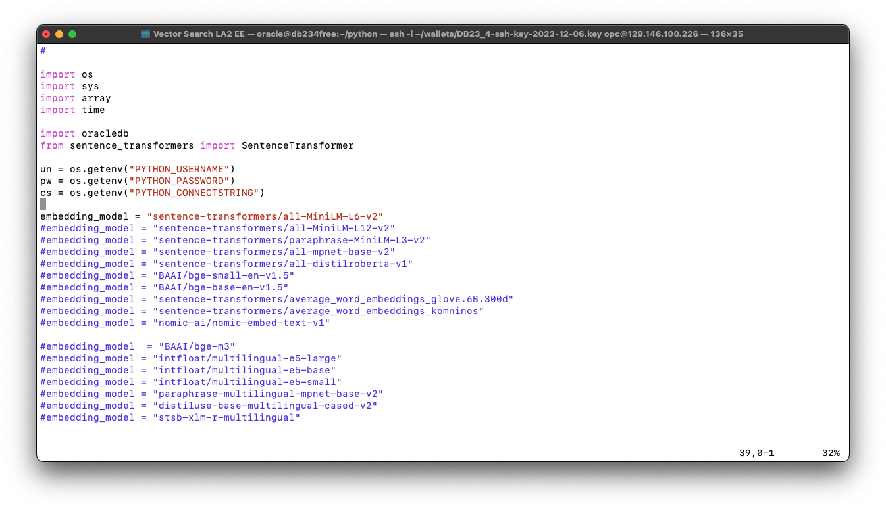

    The next set of code is where we assign the embedding model we have chosen (un-commented line) to use.  

    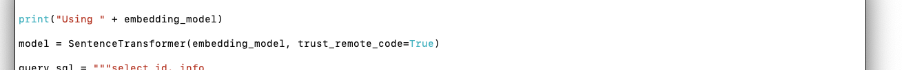

    If we scroll a little further down we can see the SQL code that is being called to populate the vectorized data into the MY\_DATA table. The first block of SQL code creates a cursor for the rows we wish to update and the second block performs the update operation.

    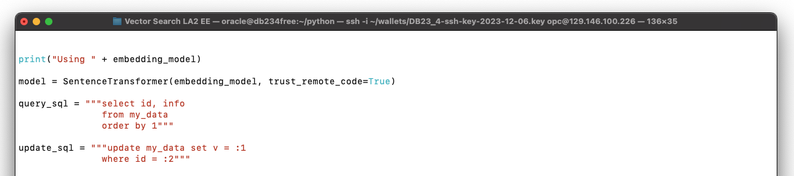

## Task 4: Perform Similarity Search with Sentence Transformers

Now that we've vectorized our data, we are ready to try performing a similarity search using the Sentence Transformers.

1. You can do this by-

    ```
      <copy>
      python3.11 similarity_search_SentenceTransformers.py
      </copy>
    ```

    The first time you run this program you will see  *"model.safetensors:"* gets downloaded.

    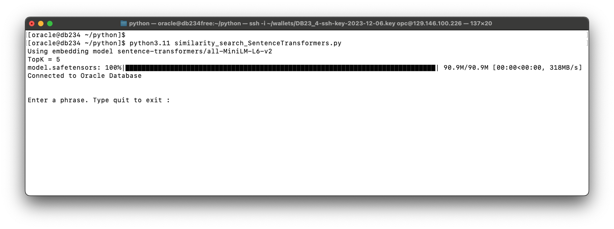


    **NOTE:** The embedding model being used is displayed when we run the program. It is important to make sure that the embedding model you use matches the embedding model you chose when you vectorized the data - in this instance we vectorized our data with *"all-MiniLM-L6-v2"*, and our search is using the same model, so we are good to go. A mismatch will lead to an error and even worse a false positive - in the sense that no error will be displayed but the wrong results will be displayed.

    For our first example let's try the word "cars". This is the same phrase we have tested using the Cohere and OpenAI models, so if you have used those embedding models, you know what to expect, and the results should be similar.

    Enter Phrase: **cars**

    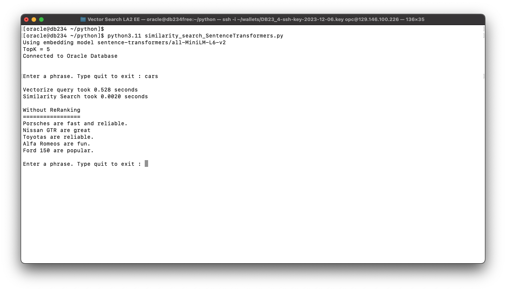

    In our situation it took half a second to vectorize the query and about 2 milliseconds to perform the query. This is extremely fast when we compare it to the Cohere and OpenAI models as we do not need to perform the roundtrip REST calls over the internet.


2. Next let's try the phrase "cats" and see what is returned.

    Enter phrase: **cats**

    You should see:

    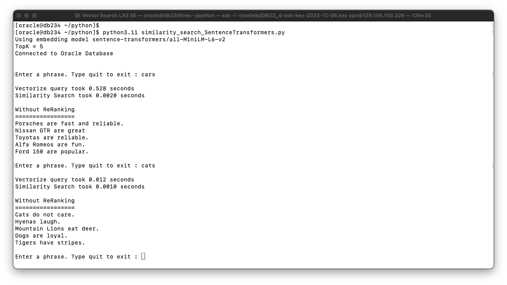

    The first thing you may notice is that the operation runs even faster now as we have already performed our database connection and authorization and the Sentence Transformers libraries are already loaded into memory too.

    Looking at the query output, not all the results are directly related to our search term: "cats", but one could argue that there is a minor correlation as all 5 rows are animal associations and not fruit. So not bad considering our relatively small number of 150 entries.

3. If we try a more general term like "animals" we should see the following:

    Enter phrase: **animals**

    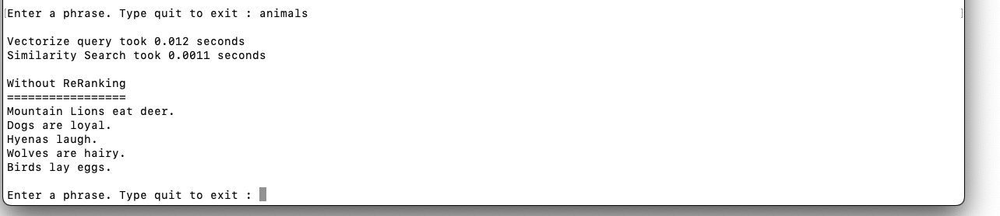


4. Let's try two queries related to New York...

    First we'll try "NY" and then "boroughs"

    Enter phrase: **NY**

    Enter phrase: **boroughs**

    This time you should see the following:

    

    This time we see results that are accurate. For "NY", the model returns the names of places located in the state of "New York". The second search for the term "boroughs" is 100% accurate using the Sentence Transformers embedding model.

5. Another interesting query to test our results are for the phrase "New Zealand".

    Enter Phrase: **New Zealand**

    This time we see the following:

    

    The results we see when using the Sentence Transformers embedding model have nothing to do with "New Zealand", though they are geographic locations, so one could argue there is a minor correlation here.

## Task 5: Changing embedding models

Just as we have done with the embedding models from other vendors, let's experiment with changing the Sentence Transformer embedding model.

In this instance we will see what happens when we use a multilingual embedding model. We will switch from *"sentence-transformers/all-MiniLM-L6-v2"* to *"intfloat/multilingual-e5-large"*. This embedding model not only supports English, but also other languages including: German, Spanish, Japanese, Russian, Thai, etc

To switch embedding models you will need to comment out the line:
*embedding\_model = "sentence-transformers/all-MiniLM-L6-v2"*
and uncomment the line:
*embedding\_model = "intfloat/multilingual-e5-large"*.

1. To make this switch we will need to change the embedding model in both the programs:

    - *vectorize\_table\_SentenceTransformers.py*

    ```
      <copy>
      vi vectorize_table_SentenceTransformers.py
      </copy>
    ```

    - *similarity\_search\_SentenceTransformers.py*

    ```
      <copy>
      vi similarity_search_SentenceTransformers.py
      </copy>
    ```


    Your programs will look like this **BEFORE** making your modification-

    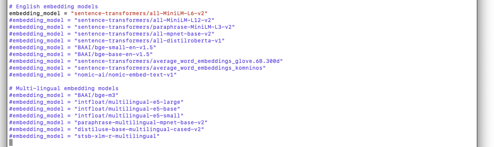

    Your programs will look like this **AFTER** making your modification-

    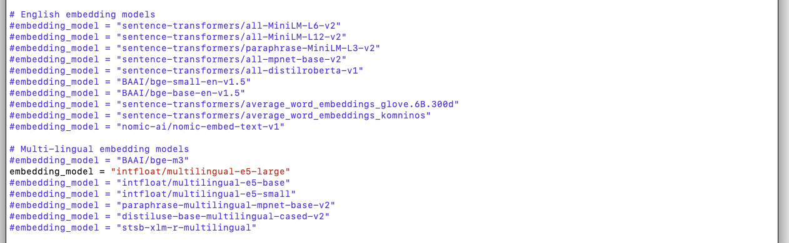


2. Before changing to a different embedding model for performing a similarity search you must re-vectorize the contents of the table: MY\_DATA. Do this by running the *vectorize\_table\_SentenceTransformers.py* program as follows:


    ```
      <copy>
      python3.11 vectorize_table_SentenceTransformers.py
      </copy>
    ```

    You should see:

    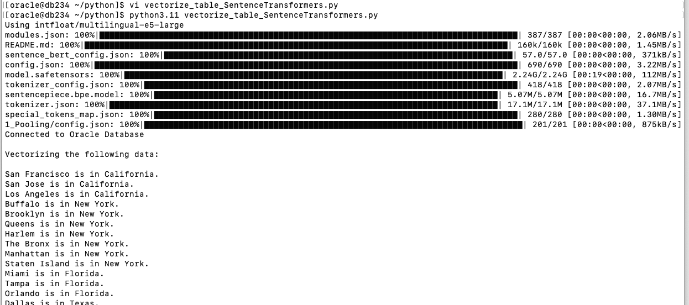

    **NOTE:** Verify that the program is using the new embedding model.

    Since it's the first time we are using this new embedding model there are multiple libraries and modules that will be downloaded and installed into our system. This is done automatically and there should be no manual intervention required, but this will require addition disk space (our system has been sized to accomodate this). Once the embedding model is installed, the data will be vectorized.  


3. We're now ready to try out our new model. As a baseline let's start with the term "cars".  But this time, we'll also perform the similarity search in Spanish "coche", French "voiture" and even a Spanish dialect "carros". What is interesting, is that while the phrases returned are all accurately related to the search phrase "cars", they are not identical phrases returned per language, nor are they in the same sequence.

    Enter Phrase: **cars**

    Enter Phrase: **coche**

    Enter Phrase: **voiture**

    Enter Phrase: **carros**

    You should see:

    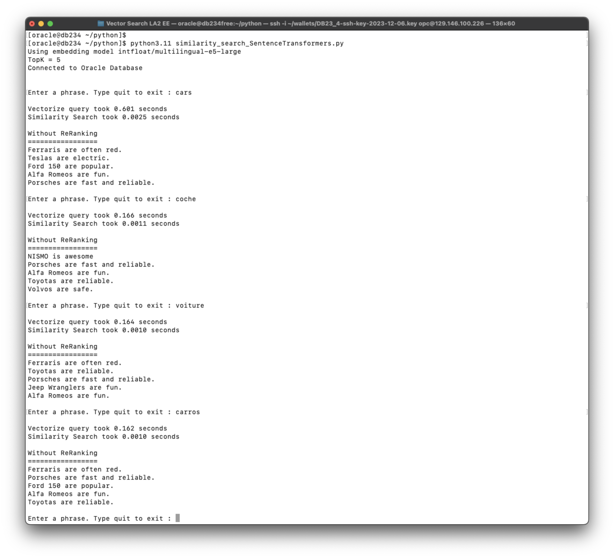


4. So now let's take a look at how the new model fares when we try our phrase "cats" and this time we'll also try German "katze" and Spanish "gato" as well to see what happens...    

    Enter Phrase: **cats**

    Enter Phrase: **katze**

    Enter Phrase: **gato**

    You should see:

    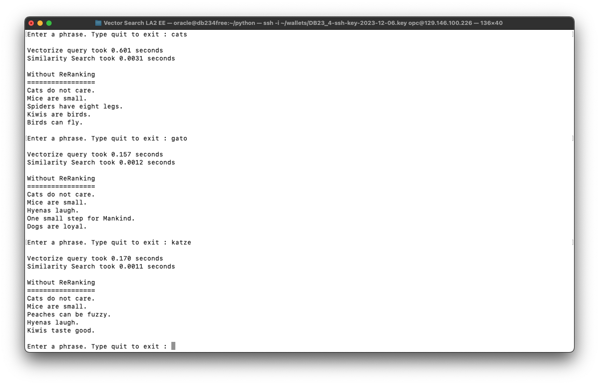

    Once again the embedding model is fairly accurate for the first two responses for all 3 languages. But after that the results are mixed. In the English version the results are at least within the animals grouping, but the German and Spanish results are a bit more random. Once again underscoring subtle nuances between differnt embedding models.


## Summary

In this lab you have seen how easy it is to use Sentence Transformers with Python and Oracle Vectors and Similarity Search. You are ready to move onto the next lab.


</if>


<if type="FastEmbed">

# Lab 1: Using FastEmbed and Python with Oracle AI Vector Search

## Introduction

In this lab we will be using the FastEmbed vector embedding models from Hugging Face. FastEmbed uses the Hugging Face vector embedding models, which are usually sentence transformers *(Sentence Transformers are covered in Lab 3)* . But instead of using the python runtime to execute the embedding models, FastEmbed uses the open source project: *ONNX-runtime*.

ONNX is a common file format that can be used to convert between different machine learning models, while the ONNX-runtime is a C++ library which allows you to run models in the ONNX file format.

So for this lab we will take open source embedding models and transform them to the ONNX file format so we can then use the ONNX runtime. The model is using FastEmbed, so essentially, it's using a wrapper to a wrapper to the python apis. This is not only done for convenience, but also so that it's less work for the end-user, because the embedding models are ready to go.

Also, just as with Sentence Transformers, FastEmbed uses the the vector embedding models from Hugging Face, so not only are they open source and therefore free to use, they can be installed locally. This means they can be accessed by making a function call to a local library, rather than a RESTful call over the internet.


------------
Estimated Time: 20 minutes

### Objectives

In this lab, you will perform the following tasks:
* Task 1: Installing FastEmbed Packages in your system
* Task 2: Vectorizing a table with FastEmbed
* Task 3: Understanding the Vector Embedding processing
* Task 4: View the Vector updates in the Database
* Task 5: Perform Similarity Search with FastEmbed
* Task 6: Changing embedding models


### Prerequisites

This lab assumes you have:
* An Oracle account
* An Oracle Database 23.4 preinstalled
* Your workshop environment is configured (Completed Lab 0)

*This is the "fold" - below items are collapsed by default*

## Task 1: Installing FastEmbed packages in your system

As mentioned in the Introduction, the FastEmbed library is available from Hugging Face and is installed and run locally on your system. So unlike the Cohere and OpenAI labs where we installed a "small" software library to connect to an embedding model hosted in a remote location, this installs a "larger" set of software packages that include the embedding models themselves.

1. Check to see whether there is sufficient disk capacity in the system before proceeding. To see this, use the Linux *df -h* command as follows:

    ```
      <copy>
      df -h
      </copy>
    ```

    Your system should have 50 Gigabytes of space available. In our case we have 982G available:

    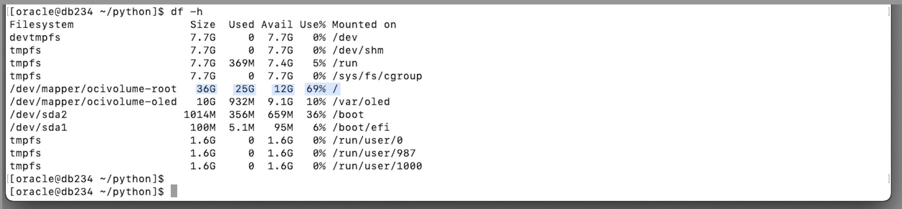


2. Our first step is to install the *fastembed* packages with *pip* (package installer for Python). While logged in as the oracle Linux user, run the following *pip* command:

    ```
      <copy>
      pip install -U fastembed
      </copy>
    ```

    This may take a few minutes to perform (in our case 4 minutes and our available disk space shrunk from 982G down to 974G).

    You should see:

    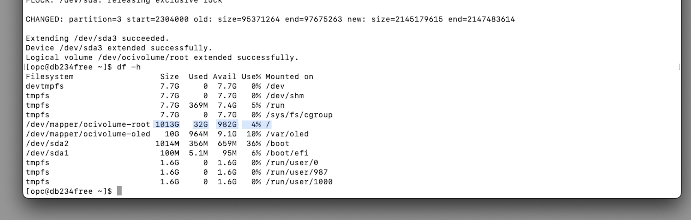


## Task 2: Vectorizing a table with FastEmbed

We're now ready to vectorize our data using fastEmbed. To do this you will need to create a python program to vectorize our phrases using the FastEmbed packages that we just installed.

1. While logged into your Operating System as the Oracle user, create a file called *vectorize\_table\_FastEmbed.py* and paste the following contents into the file.

    ```
      <copy>
      # -----------------------------------------------------------------------------
      # Copyright (c) 2023, Oracle and/or its affiliates.
      #
      # This software is dual-licensed to you under the Universal Permissive License
      # (UPL) 1.0 as shown at https://oss.oracle.com/licenses/upl and Apache License
      # 2.0 as shown at http://www.apache.org/licenses/LICENSE-2.0. You may choose
      # either license.
      #
      # If you elect to accept the software under the Apache License, Version 2.0,
      # the following applies:
      #
      # Licensed under the Apache License, Version 2.0 (the "License");
      # you may not use this file except in compliance with the License.
      # You may obtain a copy of the License at
      #
      #    https://www.apache.org/licenses/LICENSE-2.0
      #
      # Unless required by applicable law or agreed to in writing, software
      # distributed under the License is distributed on an "AS IS" BASIS,
      # WITHOUT WARRANTIES OR CONDITIONS OF ANY KIND, either express or implied.
      # See the License for the specific language governing permissions and
      # limitations under the License.
      # -----------------------------------------------------------------------------
      #
      # Add or update the vectors for all data values in a table
      #

      import os
      import sys
      import array
      import time

      import oracledb
      from fastembed import TextEmbedding

      un = os.getenv("PYTHON_USERNAME")
      pw = os.getenv("PYTHON_PASSWORD")
      cs = os.getenv("PYTHON_CONNECTSTRING")

      # English embedding models
      embedding_model = "sentence-transformers/all-MiniLM-L6-v2"
      #embedding_model = "nomic-ai/nomic-embed-text-v1"
      #embedding_model = "BAAI/bge-small-en-v1.5"
      #embedding_model = "BAAI/bge-base-en-v1.5"
      #embedding_model = "BAAI/bge-large-en-v1.5"
      #embedding_model = "BAAI/bge-large-en-v1.5-quantized"
      #embedding_model = "jinaai/jina-embeddings-v2-base-en"
      #embedding_model = "jinaai/jina-embeddings-v2-small-en"

      # Multi-lingual embedding models
      #embedding_model = "intfloat/multilingual-e5-large"
      #embedding_model = "sentence-transformers/paraphrase-multilingual-mpnet-base-v2"

      print("Using FastEmbed " + embedding_model)

      model = TextEmbedding(model_name=embedding_model, max_length=512)

      # Connect to Oracle Database 23.4
      with oracledb.connect(user=un, password=pw, dsn=cs) as connection:
          db_version = tuple(int(s) for s in connection.version.split("."))[:2]
          if db_version < (23, 4):
              sys.exit("This example requires Oracle Database 23.4 or later")
          print("Connected to Oracle Database\n")

          with connection.cursor() as cursor:
              print("Vectorizing the following data:\n")

              # Loop over the rows and vectorize the VARCHAR2 data
              sql = """select id, info
                       from my_data
                       order by 1"""

              binds = []
              tic = time.perf_counter()
              for id_val, info in cursor.execute(sql):

                  # Convert to input string format for Sentence Transformers
                  data = f"[ 'query: {info}' ]"

                  print(info)

                  # Create the embedding and extract the vector
                  embedding = list(model.embed(data))

                  # Convert to a list
                  vec = list(embedding[0])

                  # Convert to array format
                  vec2 = array.array("f", vec)

                  # Record the array and key
                  binds.append([vec2, id_val])

              toc = time.perf_counter()

              # Do an update to add or replace the vector values
              cursor.executemany(
                  """update my_data set v = :1
                     where id = :2""",
                  binds,
              )
              connection.commit()

              print(f"Vectors took {toc - tic:0.4f} seconds")
              print(f"\nAdded {len(binds)} vectors to the table using FastEmbed " + embedding_model + "\n")
      </copy>
    ```

    Save the file and exit.

2. While logged in as the Oracle Linux user, run the program with *python3.11* as follows:


    ```
      <copy>
      python3.11 vectorize_table_FastEmbed.py
      </copy>
    ```

    **NOTE:** The first time you run this program you will notice that it downloads a series of dependencies.

    You should see the following:

    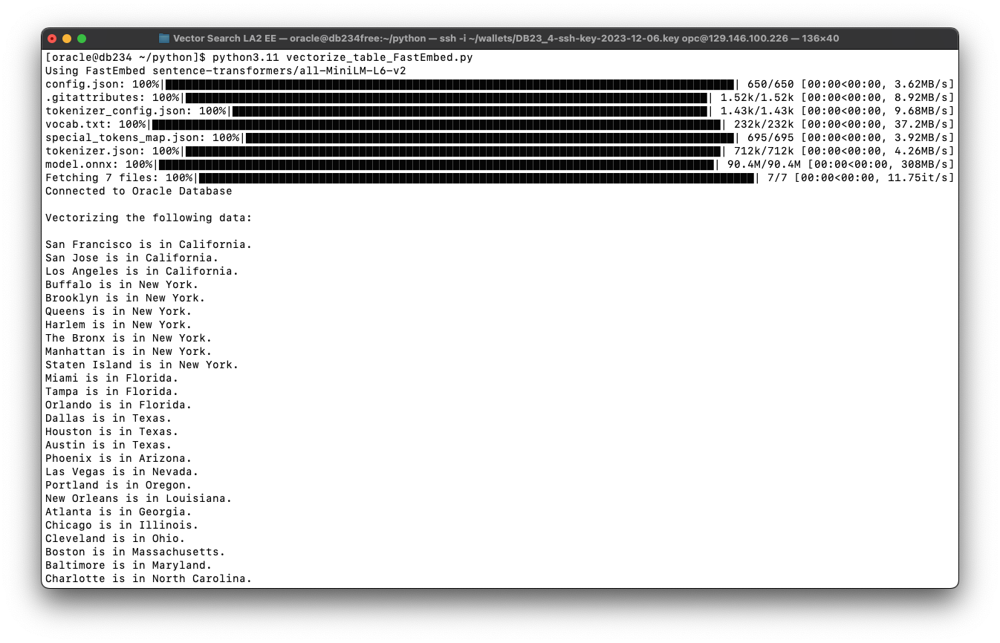

    Once the program has completed you will see the following:

    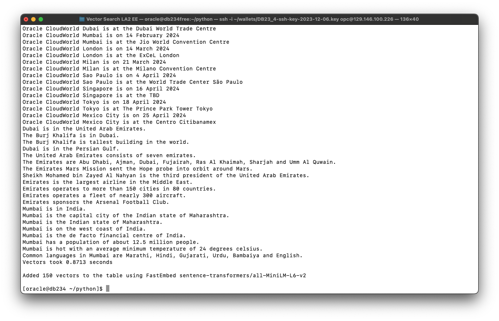

    You will notice that this is a very fast operation- in our case it ran in under a second. You should also see that it used the *"FastEmbed sentence-transformers/all-MiniLM-L6-v2"* embedding model. This is the same embedding model we used earlier but it has been converted to the ONNX format and is also using the ONNX runtime. The ONNX runtime has the ability to optimize existing models as well as use a C++ runtime (vs python runtime from pytorch) so net effect is that it is typically faster.

    To summarize what we've just done, the *vectorize\_table\_FastEmbed.py* program connects to the Oracle database, retrieves the text from the INFO column of the *MY\_DATA* table, and vectorizes the "factoid" for each of the 150 rows. We are then storing the vectorized data as a vector in the V column.

## Task 3: Understanding the Vector Embedding processing

Before proceeding any further, lets take a look at the code of the Python program we just ran. This will give us a better understanding of how this process is being performed.

1. Open the file with your favorite editor. Or you can use *vi* or *view* to view the contents of the file. We will not be making any changes to the program-

    ```
      <copy>
      view vectorize_table_FastEmbed.py
      </copy>
    ```

    The first thing you should see is that the program has just over 100 lines of code. If you've inspected the vectorizing python programs for Cohere, OpenAI or Sentence Transformers you will see that this program logic is very similar.

2. After you scroll past the comments section of the program you will notice that we are importing the os, sys, array and time python modules. We are using these modules to performing basic operations in the program.  

    We are also importing-
    - **oracledb** - the Python Driver for OracleDatabase. https://oracle.github.io/python-oracledb/
    - **fastembed** - the FastEmbed Python library. https://github.com/qdrant/fastembed

    Next we are passing the Username and Password along with the database connect-string for the Oracle Database user.

    Below that section is where we select the embedding model to be used, in this case we are using *"sentence-transformers/all-MiniLM-L6-v2"*  this is the embedding model entry that is uncommented.

    You should also notice that there is a large number of embedding models to choose from. For this lab we will use the *"sentence-transformers/all-MiniLM-L6-v2"* embedding model due to it's popularity.       

    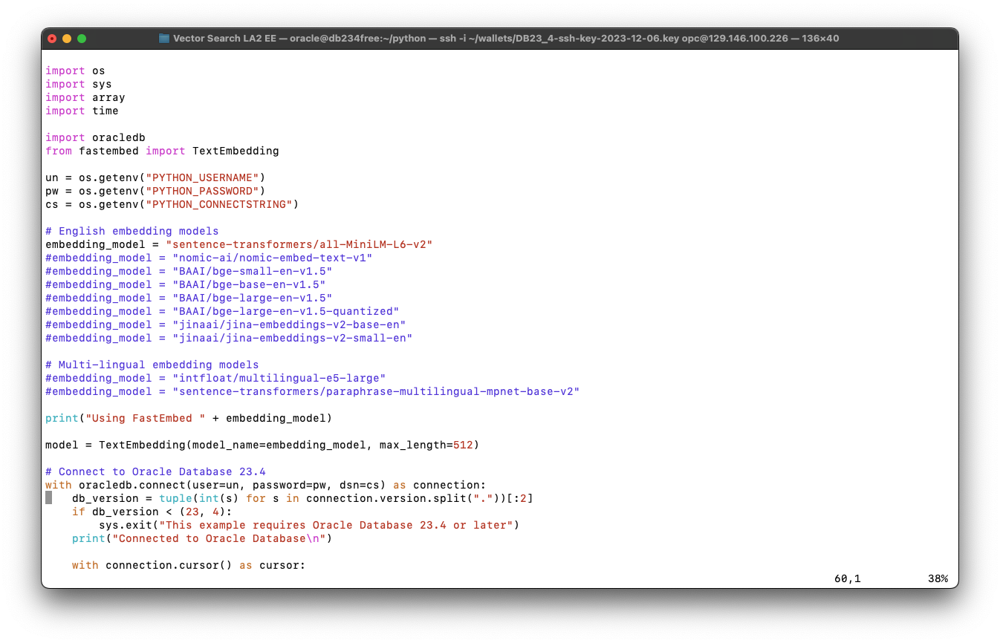

    The next code block is where we actually call the embedding model we have chosen (un-commented) to use.  

    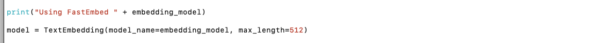


3. If you scroll a little further down you will see the the first of two blocks of SQL code. The first block of SQL *(sql)* is used as the basis for a cursor to loop through the MY\_DATA table. The second SQL statement, an anonymous block located at the bottom of the "for loop", updates column "V" with the vectorized data for the corresponding "ID" column.

    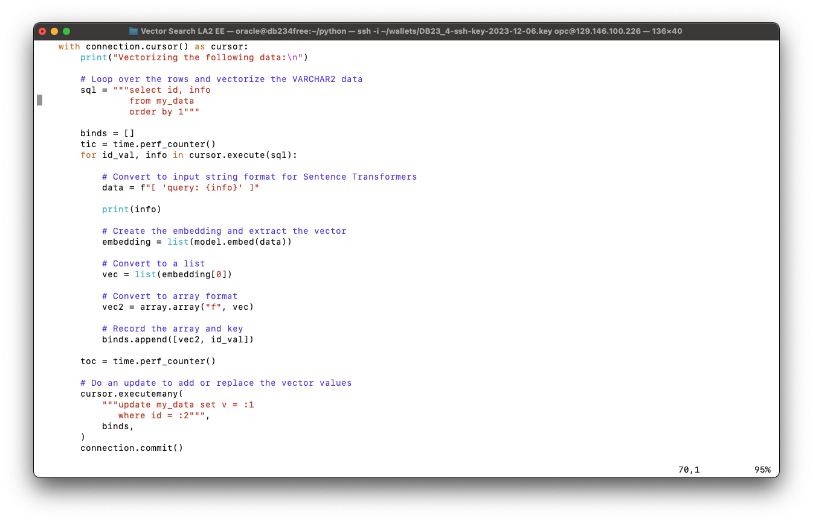


To summarize, once connected to the database, the program loops through the result set of the sql cursor variable and, for each row returned, the "V" column is updated with the vectorized version of the "INFO" column. Keep in mind the "INFO" column has already been populated with the factoid that is used to vectorize, and this is the text that gets vectorized.

You can now close the program file.

## Task 4: View the Vector updates in the Database

1We can now query the *MY\_DATA* table in the Oracle database to verify that our data has been updated.

1. Connect to Oracle database as the user: *vector* and password: *vector*

    ```
      <copy>
      sqlplus vector/vector@orclpdb1
      </copy>
    ```


2. Query the MY\_DATA table to verify that all 150 rows have been updated.

    ```
      <copy>
      select count(*) from my_data where V is not null ;
      </copy>
    ```

    You should see:

    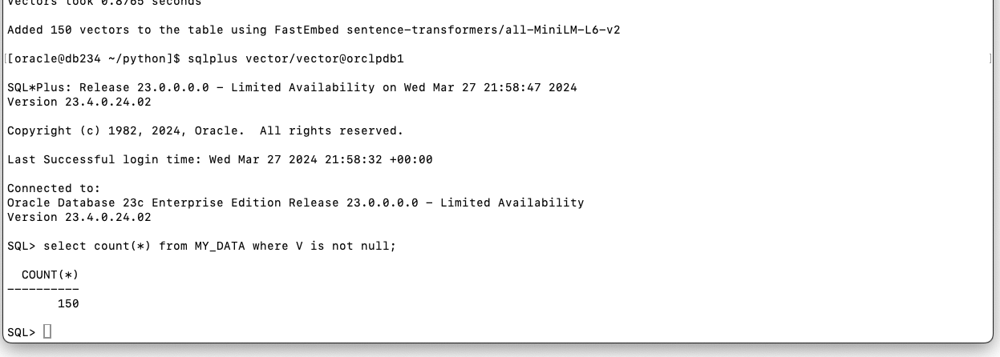


3. We can also query the vector column: V in the MY\_DATA table to see what the vectors and dimensions look like.

    ```
      <copy>
      select info from my_data order by 1;
      </copy>
    ```


    You should see 150 rows of information-

    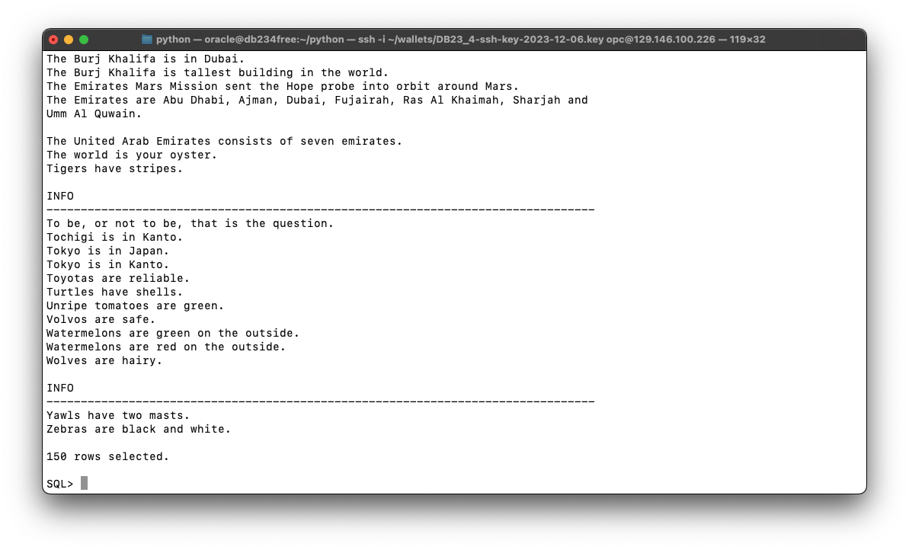


    ```
      <copy>
      select V from my_data ;
      </copy>
    ```


    You should see:

    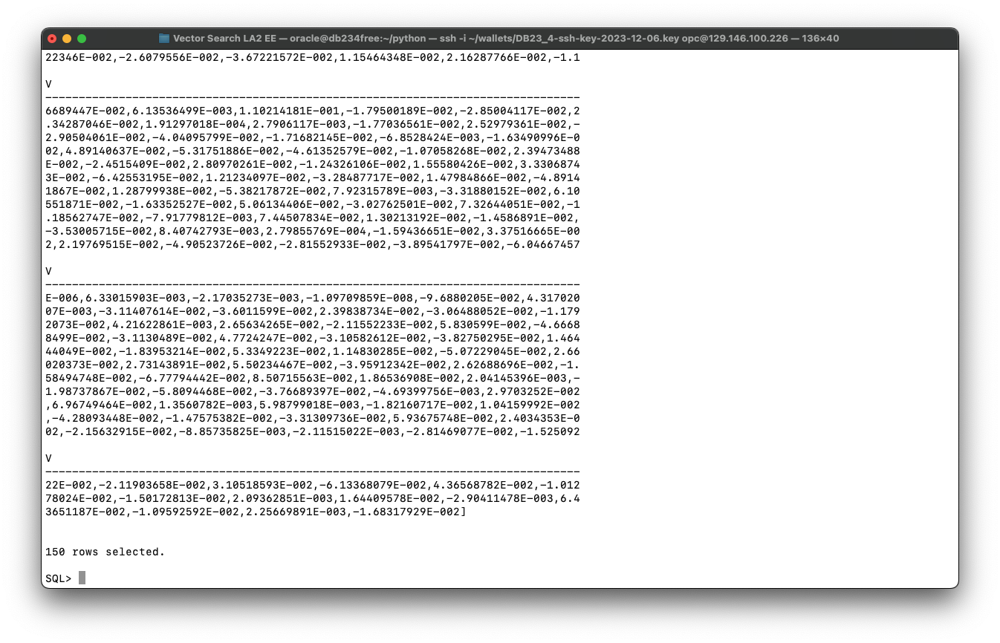


You can now exit from SQL*Plus.


## Task 5: Perform Similarity Search with FastEmbed

So far we have vectorized the data in the *MY\_DATA* table using an FastEmbed embedding. We can now start performing Similarity Searches using the Vectors in our table. Even though the table has been vectorized we will still need to connect to use FastEmbed to vectorize our search phrase using the same embedding model. The search phrase is entered on the fly, vectorized and then used to search against the vectors in the database. We will create a python program to do this.

1. While logged into your Operating System as the Oracle user, create a file called *similarity\_search\_FastEmbed.py* and paste the following contents into the file.

    ```
      <copy>
      # -----------------------------------------------------------------------------
      # Copyright (c) 2024, Oracle and/or its affiliates.
      #
      # This software is dual-licensed to you under the Universal Permissive License
      # (UPL) 1.0 as shown at https://oss.oracle.com/licenses/upl and Apache License
      # 2.0 as shown at http://www.apache.org/licenses/LICENSE-2.0. You may choose
      # either license.
      #
      # If you elect to accept the software under the Apache License, Version 2.0,
      # the following applies:
      #
      # Licensed under the Apache License, Version 2.0 (the "License");
      # you may not use this file except in compliance with the License.
      # You may obtain a copy of the License at
      #
      #    https://www.apache.org/licenses/LICENSE-2.0
      #
      # Unless required by applicable law or agreed to in writing, software
      # distributed under the License is distributed on an "AS IS" BASIS,
      # WITHOUT WARRANTIES OR CONDITIONS OF ANY KIND, either express or implied.
      # See the License for the specific language governing permissions and
      # limitations under the License.
      # -----------------------------------------------------------------------------
      #
      # Basic Similarity Search using the FastEmbed embedding model
      #

      import os
      import sys
      import array
      import time

      import oracledb
      from fastembed import TextEmbedding
      from sentence_transformers import CrossEncoder

      un = os.getenv("PYTHON_USERNAME")
      pw = os.getenv("PYTHON_PASSWORD")
      cs = os.getenv("PYTHON_CONNECTSTRING")

      # topK is how many rows to return
      topK = 5

      # Re-ranking is about potentially improving the order of the resultset
      # Re-ranking is significantly slower than doing similarity search
      # Re-ranking is optional
      rerank = 1

      # English embedding models
      embedding_model = "sentence-transformers/all-MiniLM-L6-v2"
      #embedding_model = "nomic-ai/nomic-embed-text-v1"
      #embedding_model = "BAAI/bge-small-en-v1.5"
      #embedding_model = "BAAI/bge-base-en-v1.5"
      #embedding_model = "BAAI/bge-large-en-v1.5"
      #embedding_model = "BAAI/bge-large-en-v1.5-quantized"
      #embedding_model = "jinaai/jina-embeddings-v2-base-en"
      #embedding_model = "jinaai/jina-embeddings-v2-small-en"

      # Multi-lingual embedding models
      #embedding_model = "intfloat/multilingual-e5-large"
      #embedding_model = "sentence-transformers/paraphrase-multilingual-mpnet-base-v2"

      # English re-rankers
      rerank_model = "cross-encoder/ms-marco-TinyBERT-L-2-v2"
      #rerank_model = "cross-encoder/ms-marco-MiniLM-L-2-v2"
      #rerank_model = "cross-encoder/ms-marco-MiniLM-L-6-v2"
      #rerank_model = "cross-encoder/ms-marco-MiniLM-L-12-v2"
      #rerank_model = "BAAI/bge-reranker-base"
      #rerank_model = "BAAI/bge-reranker-large"

      # Multi-lingual re-rankers
      #rerank_model = "jeffwan/mmarco-mMiniLMv2-L12-H384-v1"
      #rerank_model = "cross-encoder/msmarco-MiniLM-L6-en-de-v1"

      print("Using FastEmbed embedding model " + embedding_model)
      if rerank:
        print("Using reranker " + rerank_model)

      print("TopK = " + str(topK))

      sql = """select info
               from my_data
               order by vector_distance(v, :1, COSINE)
               fetch approx first :2 rows only"""


      # Define the specific model to use
      model = TextEmbedding(model_name=embedding_model, max_length=512)

      # Connect to Oracle Database 23.4
      with oracledb.connect(user=un, password=pw, dsn=cs) as connection:
          db_version = tuple(int(s) for s in connection.version.split("."))[:2]
          if db_version < (23, 4):
              sys.exit("This example requires Oracle Database 23.4 or later")
          print("Connected to Oracle Database\n")

          with connection.cursor() as cursor:
              while True:
                  # Get the input text to vectorize
                  text = input("\nEnter a phrase. Type quit to exit : ")

                  if (text == "quit") or (text == "exit"):
                      break

                  if text == "":
                      continue

                  tic = time.perf_counter()

                  # Create the embedding and extract the vector
                  embedding = list(model.embed(text))

                  toc = time.perf_counter()
                  print(f"Vectorize query took {toc - tic:0.3f} seconds")

                  # Convert to a list
                  vec = list(embedding[0])

                  # Convert to array format
                  vec2 = array.array("f", vec)

                  docs  = []
                  cross = []

                  tic = time.perf_counter()

                  # Do the Similarity Search
                  for (info,) in cursor.execute(sql, [vec2, topK]):

                      # Remember the SQL data resultset
                      docs.append(info)

                      if rerank == 1:

                        # create the query/data pair needed for cross encoding
                        tup = []
                        tup.append(text)
                        tup.append(info)
                        cross.append(tup)

                  toc = time.perf_counter()
                  print(f"Similarity Search took {toc - tic:0.4f} seconds")

                  if rerank == 0:

                      # Just rely on the vector distance for the resultset order
                      print("\nWithout ReRanking")
                      print("=================")
                      for hit in docs:
                        print(hit)

                  else:

                    tic = time.perf_counter()

                    # ReRank for better results
                    ce = CrossEncoder(rerank_model, max_length=512)
                    ce_scores = ce.predict(cross)

                    toc = time.perf_counter()
                    print(f"Rerank took {toc - tic:0.3f} seconds")

                    # Create the unranked list of ce_scores + data
                    unranked = []
                    for idx in range(topK):

                        tup2 = []
                        tup2.append(ce_scores[idx])
                        tup2.append(docs[idx])
                        unranked.append(tup2)

                    # Create the reranked list by sorting the unranked list
                    reranked = sorted(unranked, key=lambda foo: foo[0], reverse=True)

                    print("\nReRanked results:")
                    print("=================")
                    for idx in range(topK):
                        x = reranked[idx]
                        print(x[1])
      </copy>
    ```

    Save the file and exit.

2. While logged in as the oracle Linux user, run the program with *python3.11* as follows:

    ```
      <copy>
      python3.11 similarity_search_FastEmbed.py
      </copy>
    ```


    The first time you run this, you may see some additional software libraries being loaded - which will result in the first similarity search taking longer than expected.

3. For our first example let's try the word "cars". This is the same phrase we have tested using the other models, so if you have run those labs, you know what to expect. The results should be similar.

    Enter Phrase: **cars**

    You should see the following:

    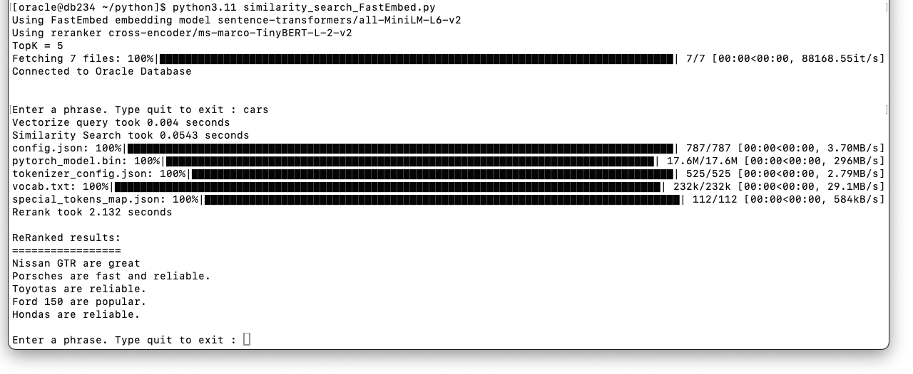

    As this was the first time we ran the program, it was a little slower than anticipated. We can run this again to get a better idea of the performance gain.

    Enter Phrase: **cars**

    You should see the following:

    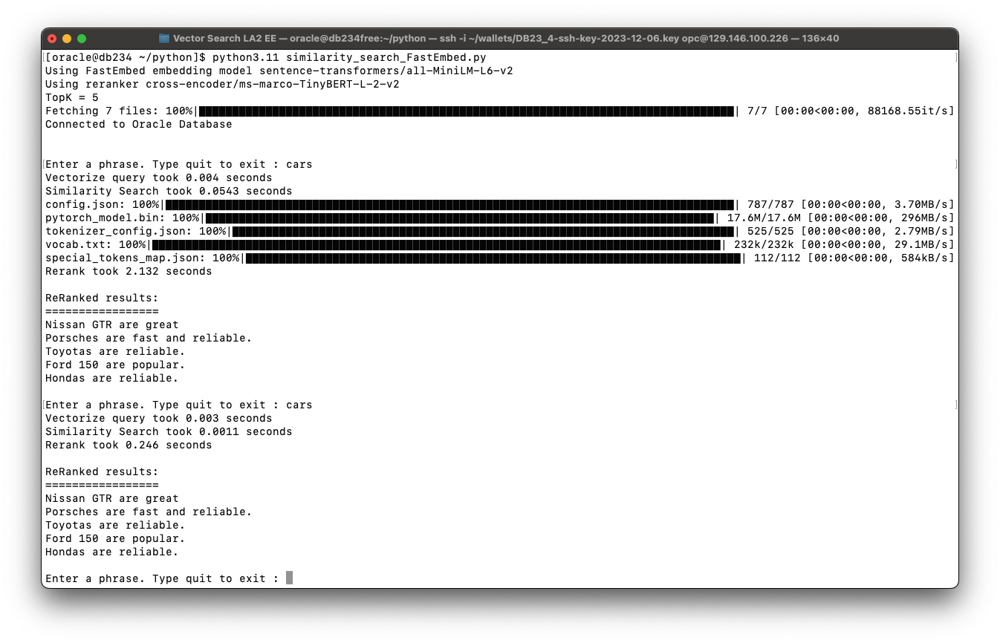

    Your times may vary but you should notice that the time is significantly faster than other Similarity Searches that you may have run in this workshop. If we look at the second time we ran this query with the search phrase "cars", we can see that the first operation is to vectorize our phrase, and that it took 0.003 seconds (or 3 milliseconds).

    Next we can see that the similarity search took 0.0011 seconds (or 1 millisecond) to locate 5 related entries to the word "cars".

    The 5 rows returned are "semantically" similar to cars based on the sample data from our MY\_DATA table.

4. Next we can try the word "cats"

    Enter the phrase: **cats**

    This time you should see the following:

    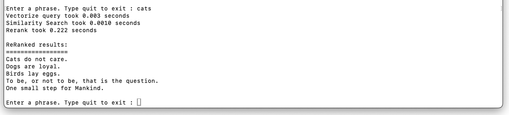


    Other than the first result, the output does not appear to have the same level of accuracy as some of the other models. However the terms: "dogs" and "cats" are often used in the same context and "birds" are animals, so there is some correlation. But finding a similarity between cats and the last two phrases would be considered a stretch at best.

    The whole point about Similarity Search is that it is not necessarily exactly correct, it is the best match given the available data using the given embedding model. The embedding model is trained using information available from the internet and other publicly sourced information.

5. We can also try other search phrases for example "fruit", or even "NY". In both cases the query phrases we enter are not actually in the data-set themselves, but the connection or correlation is apparent. It is important to understand that the search is not an exact or substring search for what is in the result set. Instead the results are looking for similar text based on the text being vectorized.


    


6. Next we can search for "Boroughs". This will focus our similarity search on data related to New York City - and you should notice that we do not see "Buffalo" this time. This time we see the five boroughs of New York City.

    Enter the phrase: **Boroughs**

    You should see the following:

    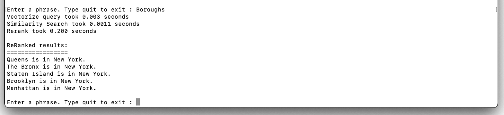


7. For another experiment, enter the word "Bombay".

    Enter the phrase: **Bombay**

    You should see the following:

    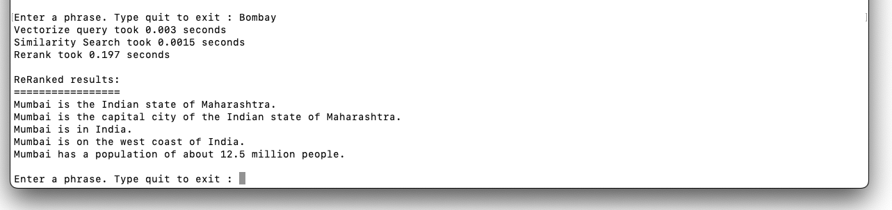


    The word "Bombay" does not appear in our data set, but the results related to "Mumbai" are correct because "Bombay" is the former name for "Mumbai", and as such there is a strong correlation between the two names for the same place.

    Remember, similarity search works on the basis of the trained data from which the embedding models use. Trained embedding models use text sourced from the internet and it is very likely that there is information that includes both the names "Bombay" and "Mumbai" in relation to the same place.

8. Now to see what happens when there is no correlation in the terms, let's try something completely random.

    Enter the phrase: **random stuff**

    You should see the following:

    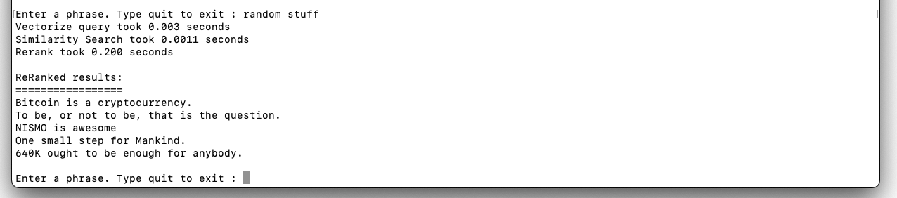


    Unlike other embedding models, FastEmbed takes approximately the same time to run for our random search, and as you may have anticipated, there is little or no correlation between the terms returned and the phrase we entered - based on the small number of rows in the MY\_DATA table.

## Task 6: Changing embedding models

Just as we have already done with the embedding models from other vendors, let's experiment with changing the embedding model with FastEmbed.

This time we will switch from *"sentence-transformers/all-MiniLM-L6-v2"* to *"BAAI/bge-small-en-v1.5"*. This embedding model not only works for English, but also other languages including German, Spanish, Japanese, Russian, Thai, etc

1. To make this switch we will need to change the embedding model in both the programs:

   * *vectorize\_table\_FastEmbed.py*

    ```
      <copy>
      vi vectorize_table_FastEmbed.py
      </copy>
    ```

   * *similarity\_search\_FastEmbed.py*  

    ```
      <copy>
      vi similarity_search_FastEmbed.py
      </copy>
    ```


    Your programs will look like this **BEFORE** making your modification-

    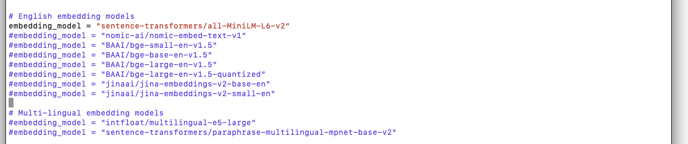

    Your programs will look like this **AFTER** making your modification-
    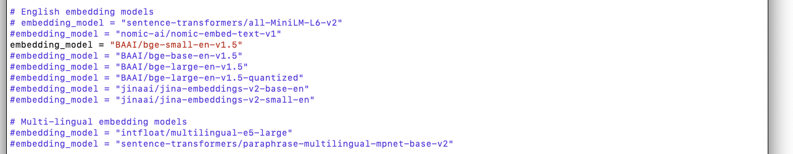


2. The first thing you will need to do before you can use a different embedding model for performing a similarity search is to re-vectorize the contents of the table: MY\_DATA. We can do this by running the *vectorize\_table\_FastEmbed.py* program as follows:

    ```
      <copy>
      python3.11 vectorize_table_FastEmbed.py
      </copy>
    ```

    You should see:

    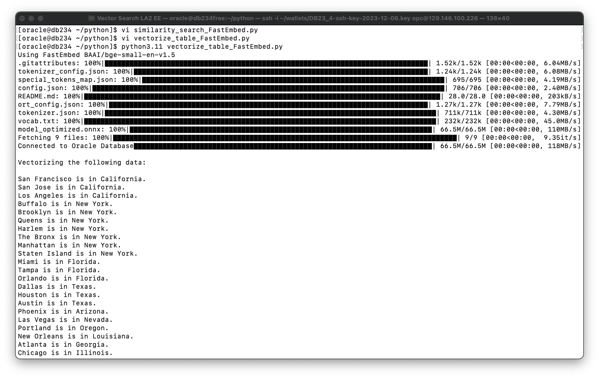


    Since it's the first time we are using this new embedding model there are multiple libraries and modules that will be downloaded and installed into our system. This is done automatically and there should be no manual intervention required, but this will require addition disk space (our system has been sized to accomodate this). Once the embedding model is installed, the data will be vectorized.  

    Notice that the embedding model has been changed to **BAAI/bge-small-en-v1.5** as we expected.  

3. We're now ready to try out our new model.  We can do this by running the *similarity\_search\_FastEmbed.py* program as follows:


    ```
      <copy>
      python3.11 similarity_search_FastEmbed.py
      </copy>
    ```

    As a baseline let's start with the term "cars".  Run it twice so we can eliminate the extra time it takes to load the new model.

    Enter the phrase **cars**

    You should see:

    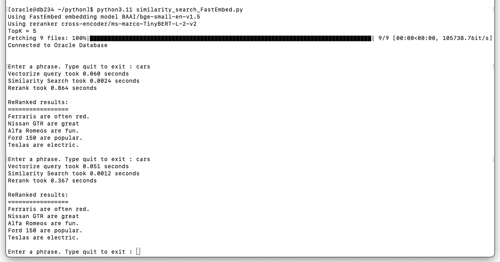


    You will notice that results for the similarity search query are 100% accurate, however the time is noticeably slower than when used the sentence transformers embedding model. It is important to note that when choosing an embedding model, they each come with their own set of trade-offs with regards to performance and accuracy characteristics. A good rule of thumb is to focus on the accuracy and then to performance.

4. Try some other phrases like "cats" and "New Zealand"

    Enter phrase: **cats**

    Enter phrase: **New Zealand**

    You should see-

    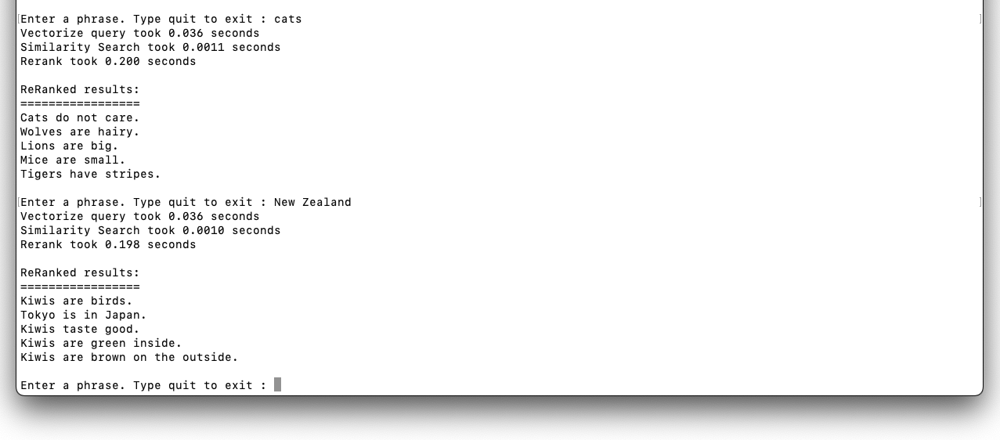


    In the case of the phrase "New Zealand", our accuracy has improved, we now have 4 related entries (versus 2 with Sentence Transformers). However, this embedding model is taking 36 milliseconds versus 3 milliseconds with Sentence Transformers - or 12 times slower.

    Feel free to try some other queries including repeating some of the previous examples we entered when we used other embedding models for your own comparison.


## Summary

In this lab you have seen how easy it is to use FastEmbed with Python and Oracle Vectors and Similarity Search. You are ready to move onto the next lab.

</if>


## Learn More

* [Oracle Database 23ai Release Notes](../docs/release_notes.pdf)
* [Oracle AI Vector Search Users Guide](../docs/oracle-ai-vector-search-users-guide_latest.pdf)
* [Oracle Documentation](http://docs.oracle.com)
* [Cohere website: cohere.com](https://cohere.com)

## Acknowledgements
* **Author** - Doug Hood, Product Manager
* **Contributors** - Sean Stacey, Outbound Product Manager
* **Last Updated By/Date** - Rajeev Rumale, April 2024
