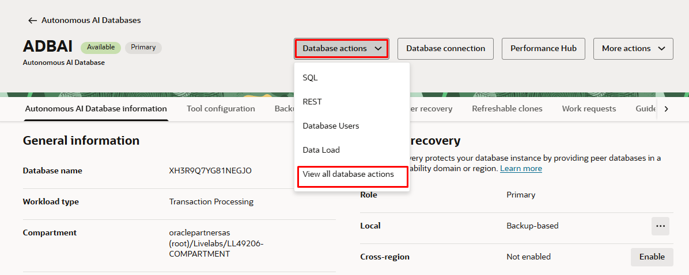
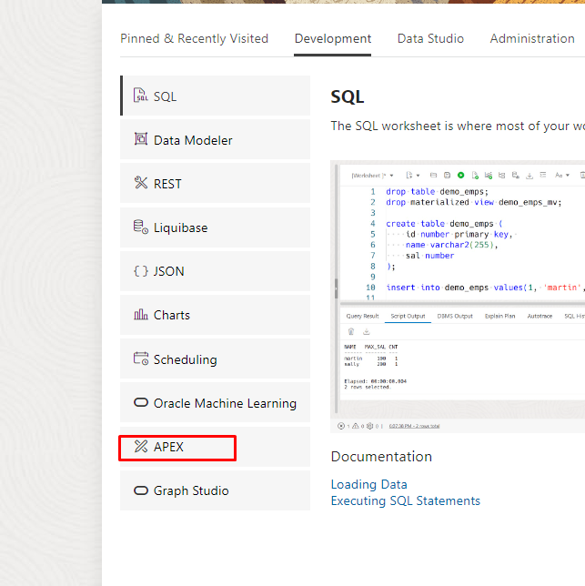
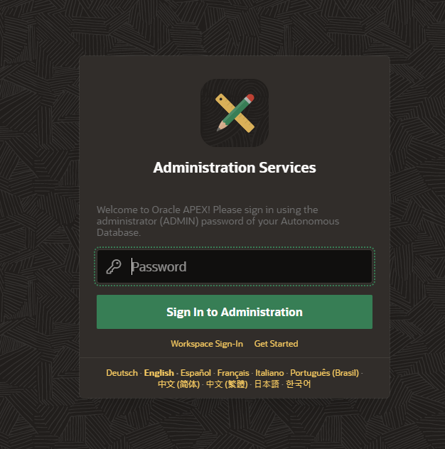
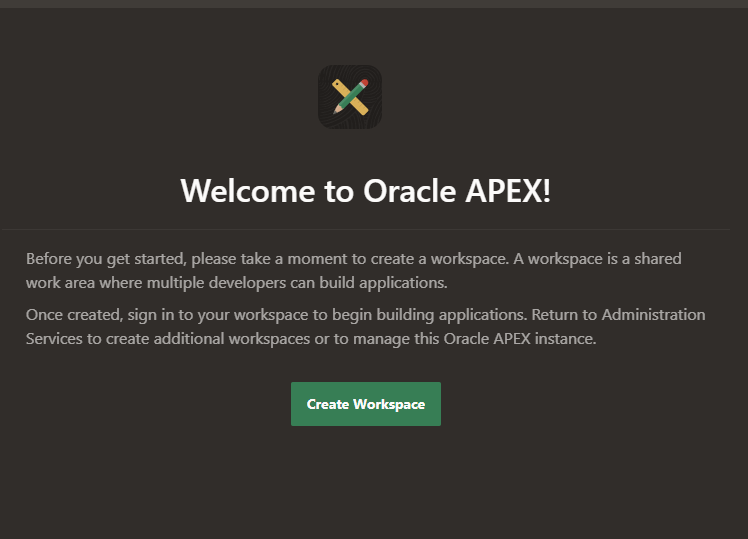
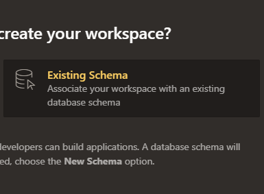
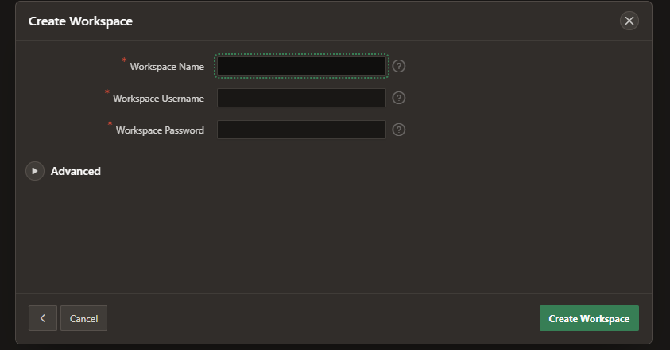
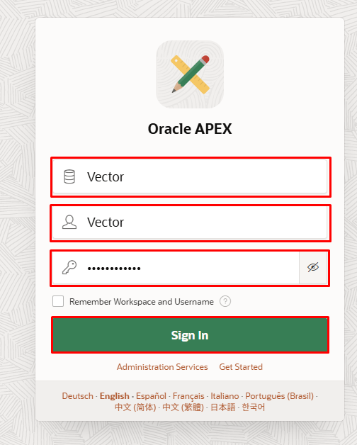
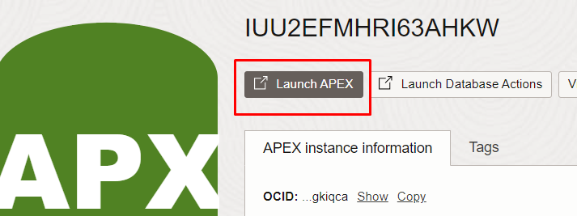
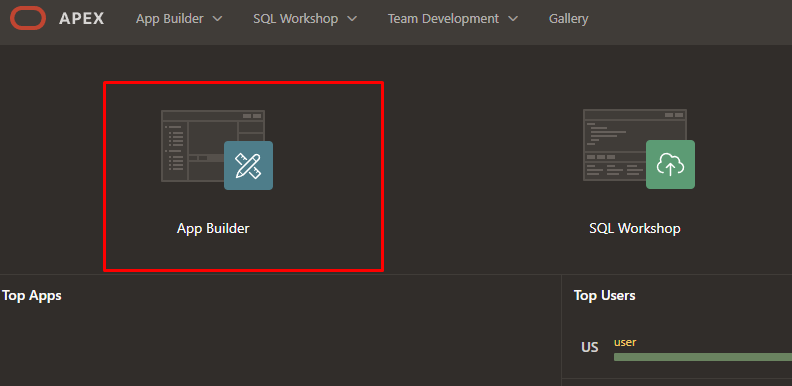
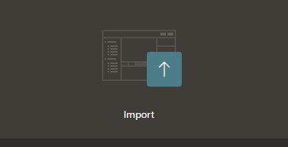

# Setup Apex Service

## Introduction

In this lab we will setup an Oracle APEX (Application Express) service with Oracle Autonomous Database for web application development. APEX provides a powerful and user-friendly platform to build scalable, secure, and highly functional web applications. This guide will walk you through the process of setting up an APEX service, creating a workspace, and preparing for application deployment.

Estimated Time: 10 minutes

## Objectives

By following this guide, you will:

* Set up an Oracle APEX service on your ADB instance.
* Create a new APEX workspace and schema.
* Login to your APEX instance.
* Import and configure a pre-built application in APEX.

### Task 1: Set Up Oracle APEX Service

1. Go to your ADB instance you created.
2. Click on **Database Actions** and select **View All Database Actions**.

3. Click on the **Development** tab.
4. Click **APEX** on the left-hand side.

5. Type in your password you created with the ADB instance and Click **Create Workspace**.

6. Select **Existing Schema**.

7. Enter the existing database schema user to use for this workspace.
8. Enter your desired values for the workspace name, username, and password. Click **Create Workspace**.

### Task 2: Log In to Your APEX Instance

1. Head back to the Autonomous Database you created.
2. Click on the APEX instance name.

3. Click **Launch APEX**.

4. Enter the credentials you created with your workspace:
   - **Workspace Name**: Enter your workspace name.
   - **Username**: Your user you created for the workspace.
   - **Password**: The password you created in the workspace for that user.
5. Click on **App Builder** located on the left of the dashboard.

6. Select **Import** and upload the [SQL file](images/f100.sql) we obtained to access the pre-configured application. 

7. Click next and install the application and the supporting objects.

## Conclusion

In this lab you created the Oracle APEX service and created a workspace. We imported a pre-built sample RAG application for you to run.  It alsow allows you to quickly leverage existing functionalities and customize them according to your requirements. 

You may now [proceed to the next lab](#next).

## Acknowledgements
* **Authors** - Blake Hendricks, Milton Wan
* **Last Updated By/Date** -  July 2024