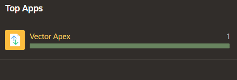
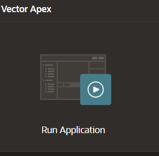
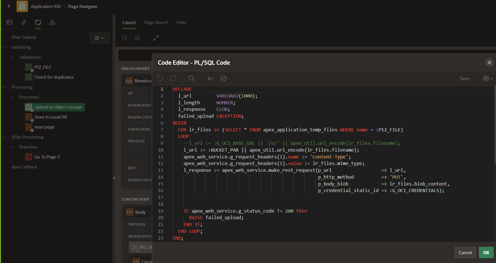
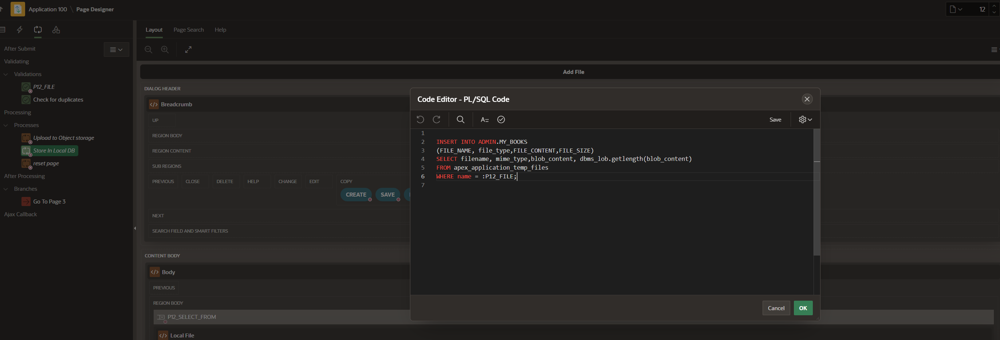
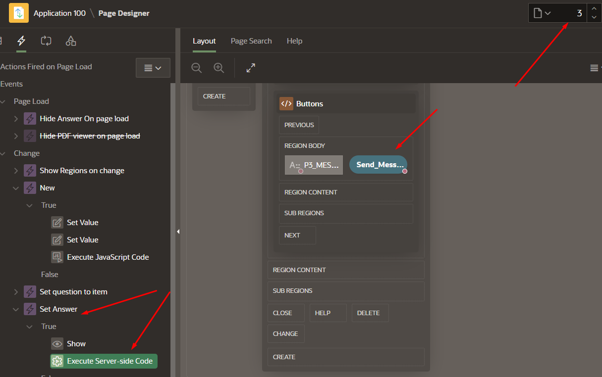
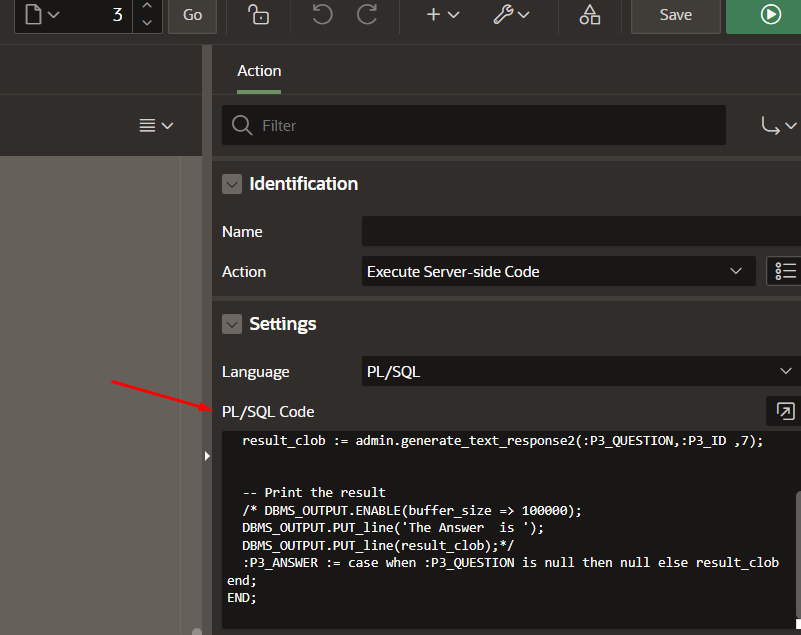

# Ask a Question

## Introduction

In this lab, we will load a document and ask a question about it. This process involves launching the application, uploading a document to object storage, selecting the document, previewing it, asking a question, displaying the results, and viewing the PL/SQL call that generates the response. There is no need to run any of the PLSQL in this lab.  It will be executed by APEX.

## Objectives

By following this guide, you will:

- Launch the application and sign in.
- Load a document to Oracle Object Storage.
- Select and preview the document.
- Ask a question about the document.
- Display the results of the question.
- View the PL/SQL call in the APEX Page Designer.


## Task 1: Launch Application

1. On the application home page, click on the application we uploaded and then select "Run Application".
   
   
2. Sign into the application with your credentials.


## Task 2: Load Document to Object Store

1. Click on the blue "Upload File" button.
2. Select the file you want to upload from your computer.
   This will upload it to the object storage.

Let's take a look at what PLSQL procedure is storing the document into our object storage.

Open the Apex Page Designer and select Page 12. 

As soon as we load our document this PLSQL procedure is called to put the document in the object storage. In this image we are using our credentials and putting our file to the object storage. 


``` sql
DECLARE
  l_url         VARCHAR2(1000);
  l_length      NUMBER;
  l_response    CLOB;    
  failed_upload EXCEPTION;
BEGIN
  FOR lr_files in (SELECT * FROM apex_application_temp_files WHERE name = :P12_FILE) 
  LOOP
    --l_url := :G_OCI_BASE_URL || '/o/' || apex_util.url_encode(lr_files.filename);
    l_url := :BUCKET_PAR || apex_util.url_encode(lr_files.filename);
    apex_web_service.g_request_headers(1).name := 'Content-Type';
    apex_web_service.g_request_headers(1).value := lr_files.mime_type;
    l_response := apex_web_service.make_rest_request(p_url                  => l_url,
                                                     p_http_method          => 'PUT',
                                                     p_body_blob            => lr_files.blob_content,
                                                     p_credential_static_id => :G_OCI_CREDENTIALS);


    IF apex_web_service.g_status_code != 200 then
      RAISE failed_upload;
    END IF;
  END LOOP;
END;
```

Let's take a look at the PLSQL code for storing the file into the database table.  

Click on Apex Processes Icon and select the Processes tab followed by Store in Local DB. On the right hand side you can view the window for the code. This is where the procedure stores the file to a table that you uploaded to object storage. 
We store the file in a table called "My_Books" within our database. As files are stored, a trigger converts the file to text, chunks the text, and creates vector embeddings for the chunks.


```sql
INSERT INTO ADMIN.MY_BOOKS
(FILE_NAME, file_type,FILE_CONTENT,FILE_SIZE)
SELECT filename, mime_type,blob_content, dbms_lob.getlength(blob_content)
FROM apex_application_temp_files
WHERE name = :P12_FILE;
```

## Task 3: Select Document from Drop-Down Menu

1. Select the item you just uploaded from the drop-down menu.

2. You can view the document you just uploaded by selecting the preview check box.

## Task 4: Type Question

1. After selecting the document, you can go ahead and type a question about the document and hit return.

After sending your question, you can view the results of the answer in the chat box.

We can see the PL/SQL call in the APEX Page Designer on page 3.
   
On the right-hand side, we can view the call that is made to generate the LLM response.
   

### PL/SQL Code

```sql
DECLARE
  result_clob CLOB;
BEGIN
  -- Call the function with the query
  result_clob := admin.generate_text_response2(:P3_QUESTION, :P3_ID, 7);
  
  -- Print the result
  /* DBMS_OUTPUT.ENABLE(buffer_size => 100000);
  DBMS_OUTPUT.PUT_LINE('The Answer is ');
  DBMS_OUTPUT.PUT_LINE(result_clob);*/
  
  :P3_ANSWER := CASE WHEN :P3_QUESTION IS NULL THEN NULL ELSE result_clob END;
END;
```

### Explanation of PL/SQL code:

DECLARE: This section is used to declare the variable result_clob, which will hold the response from the LLM.

BEGIN: Marks the beginning of the executable part of the PL/SQL block.
result_clob := admin.generate_text_response2(:P3_QUESTION,:P3_ID,7) calls the generate_text_response2 function. It passes three parameters:
1. :P3_QUESTION - The question entered by the user. 
2. :P3_ID - The ID of the document selected by the user.
3. :7 - A static parameter to return the top 7 chunks.

Finally assign the result of the function to the APEX page item :P3_ANSWER. If the question is null, the answer will also be null; otherwise, it assigns the result of the function call.

## Conclusion
In this workshop we showcased an AI RAG application using Oracle APEX, Oracle Autonomous Database 23ai with AI Vector Search, and the Oracle Cloud Object Storage.  These products and services are important building blocks for many AI solutions.

## Acknowledgements
* **Authors** - Blake Hendricks
* **Last Updated By/Date** -  July 2024
