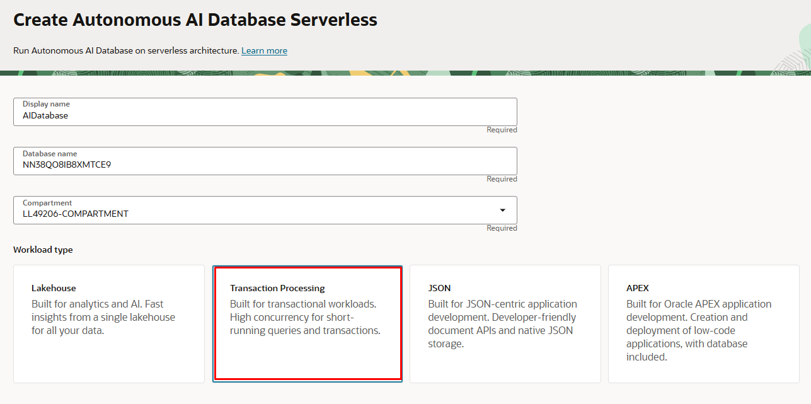

# Download Embedding Model from Oracle Object Storage into Oracle Autonomous Database

## Introduction

In this lab you will download the embedding model from Oracle Object Storage to Autonomous Database. The embedding model is used to vectorize the source data. Oracle provides data management with the Oracle Object Storage and Oracle Autonomous Database (ADB). One of the features available is the ability to download files directly from Oracle Object Storage into Oracle ADB using the DBMS\_CLOUD.GET\_OBJECTS procedure.

Estimated Time: 10 minutes

## Objectives

By following this guide, you will:

* Create a credential object in Oracle ADB for accessing Oracle Object Storage.
* Grant necessary privileges to use DBMS\_CLOUD procedures.
* Download the ONNX compliant embedding model from Oracle Object Storage into Oracle ADB using DBMS\_CLOUD.GET\_OBJECTS.
* Verify the downloaded model in Oracle ADB.
* Load the ONNX model into the database using DBMS\_VECTOR.LOAD\_ONNX\_MODEL.
* Create credential using DBMS\_VECTOR to access OCI GenAI service

## Prerequisites

Before we dive into the procedure, make sure you have the following:

1. **Oracle Cloud Account**: You need an active Oracle Cloud account with access to Oracle Object Storage and Oracle Autonomous Database.
2. **Object Storage Bucket**: Create a bucket in Oracle Object Storage and upload the files you want to download into Oracle ADB.
3. **Credentials**: Ensure you have the necessary credentials (access key and secret key) to access Oracle Object Storage.
4. **Oracle Autonomous Database 23ai**: Make sure you have an Oracle Autonomous Database 23ai

## Task 1: Login to Oracle Cloud 

1. From your browser login into Oracle Cloud


## Task 2: Provision ADW 

   Provision the Autonomous Data Warehouse Databasewith the steps below.

1. Select your assigned Region from the upper right of the OCI console.

2. From the hamburger menu (top left side), select Autonomous Transaction Processing.


3.  Select your Compartment. You may have to drill in (click “+”) to see your compartment.

4. Select Workload Type Data Warehouse.

5. Click Create Autonomous Database.
  


6. Choose your compartment.

7. Enter any unique name (maybe your name) for your display and database name.
   The display name is used in the  Console UI to identify your database.
  

8. Ensure Warehouse workload type is selected.

9. Select **Serverless** for deployment type.

10. Choose database version 23ai.

11. Configure the database with **2 cores and 1 TB storage**.

12. Check Auto scaling.

13. Enter a password. The username is always ADMIN. (Note: remember your password)

14. Select Allow secure access from everywhere for this workshop.  
    As a best practice when you deploy your own application, you should select network access to be from Virtual cloud network.  
  


15. Select BYOL license type.

16. Click Create Autonomous Database.
    

    Your console will show that ATP is provisioning. This will take about 2 or 3 minutes to complete.

    You can check the status of the provisioning in the Work Request.


## Task 3: Create Credential Object in Oracle ADB

1. First, create a credential object in your Oracle Autonomous Database that will store your Object Storage credentials. This is required for authenticating with Oracle Object Storage. 

Next head back to your ADB console, and select Database Actions and then SQL. Log in as ADMIN. This will open up an editor for us to perform statements.


Copy this statement and replace with your username and password for Oracle Cloud.

```sql
<copy>
BEGIN
  DBMS_CLOUD.CREATE_CREDENTIAL(
    credential_name => 'OBJ_STORE_CRED',
    username => '<your_oci_user_name>',
    password => '<your_oci_password>'
  );
END;
/
</copy>
```

## Task 4: Grant Necessary Privileges

From ADMIN user, run the following to ensure your database user has the necessary privileges to use DBMS packages. We are using the user VECTOR when creating the schema objects.  If you use a different user, be sure to use the correct schema user during table creation in the subsequent lab.

```sql
<copy>
CREATE USER VECTOR identified by <password>;
GRANT CONNECT to VECTOR;
GRANT RESOURCE to VECTOR;
GRANT DB_DEVELOPER_ROLE to VECTOR;
GRANT EXECUTE ON DBMS_CLOUD TO VECTOR;
GRANT EXECUTE ON DBMS_VECTOR TO VECTOR;
GRANT EXECUTE ON DBMS_VECTOR_CHAIN TO VECTOR;
GRANT CREATE ANY DIRECTORY TO VECTOR;
GRANT EXECUTE ON DBMS_CLOUD_AI TO VECTOR;
</copy>
```

## Task 5: Option 1 - Create the credential for ADB to access OCI GenAI Service

### OCI GenAI Service
The OCI GenAI service provides access to several LLMs including Cohere and Llama.  
API authentication is required. 

1. From ADB Database Actions SQL Worksheet or SQL Developer, login as VECTOR user and copy and run the SQL below and replace the following with your ocid and key information you got from the previous lab.

Important Note: Open your private key and copy the private key all onto a single line.

```sql
<copy>
declare
  jo json_object_t;
begin
  jo := json_object_t();
  jo.put('user_ocid','<your ocid1.user goes here>');
  jo.put('tenancy_ocid','<your ocid1.tenancy goes here>');
  jo.put('compartment_ocid','<your compartment ocid1.compartment goes here>');
  jo.put('private_key','<your API private key goes here>');
  jo.put('fingerprint','<your fingerprint goes here>');
  dbms_vector.create_credential(
    credential_name   => 'GENAI_CRED',
    params            => json(jo.to_string));
end;
/
</copy>
```
For example:
```
declare
 jo json_object_t;
begin
 jo := json_object_t();
 jo.put('user_ocid','ocid1.user.oc1..aaaaaaaawfpzqgzsrvb4mh6hcld2hrckadyae5y...cvza');
 jo.put('tenancy_ocid','ocid1.tenancy.oc1..aaaaaaaafj37mytx22oquorcznlfuh77...zrq');
 jo.put('compartment_ocid','ocid1.compartment.oc1..aaaaaaaaqdp7dblf6tb3gpzbuknvgfgkedtio...yfa');
 jo.put('private_key','MIIEvQIBADANBgkqhkiG9w0BAQEFAASCBKcwggSjAgEAAoIBAQCP1QXxJxzVj4SXozdfrfIr...A4Iw=');
 jo.put('fingerprint','e3:e5:ab:61:99:51:29:1f:60:2a:ad...5b:a5');
 dbms_vector.create_credential(
 credential_name => 'GENAI_CRED',
 params => json(jo.to_string));
end;
/
```

## Task 6: Option 2 - Create the credential for ADB to access OpenAI

### OpenAI

For OpenAI, run the following procedure:
```sql
<copy>

declare
  jo json_object_t;
begin
  jo := json_object_t();
  jo.put('access_token', '<your OpenAI API key goes here>');
  dbms_vector.create_credential(
    credential_name   => 'OPENAI_CRED',
    params            => json(jo.to_string));
end;
/
</copy>
```

## Task 7: Download ONNX embedding models Using `DBMS\_CLOUD.GET\_OBJECTS`

Now log in as VECTOR or `<your_database_user>`, use the `DBMS\_CLOUD.GET\_OBJECTS` procedure to download the ONNX embedding model files from the Oracle Object Storage bucket into Oracle ADB.  You will download two different models.

Run to create the staging directory.

```sql
<copy>
CREATE DIRECTORY staging AS 'stage';
</copy>
```

Run to get the onnx models.

```sql
<copy>
BEGIN
  DBMS_CLOUD.GET_OBJECT(
    credential_name => 'OBJ_STORE_CRED',
    object_uri => '<URL to onnx model>',
    directory_name => 'staging',
    file_name => '<file_name_in_adb>'
  );
END;
/
</copy>
```

URL to all-MiniLM-L6-v2.onnx is:
https://oraclepartnersas.objectstorage.us-ashburn-1.oci.customer-oci.com/p/CjS1gGPZaCZE2PoRWS5c6xmGNXK0v6ny6tNwoiVIOvqQrHux9NJ5oYo0dgLc6gOG/n/oraclepartnersas/b/onnx/o/all-MiniLM-L6-v2.onnx


URL to tinybert.onnx is:
https://oraclepartnersas.objectstorage.us-ashburn-1.oci.customer-oci.com/p/m5o31C0ol_8B_OzCLOLvqc2rWYNqz0M7kZZpMZHEaOyX7GQkhEw8_UNKoKBtcQYC/n/oraclepartnersas/b/onnx/o/tinybert.onnx


For example, to get tinybert.onnx and download it to ADB, the command will look like this:

```sql
<copy>
BEGIN
  DBMS_CLOUD.GET_OBJECT(
    credential_name => 'OBJ_STORE_CRED',
    object_uri => 'https://oraclepartnersas.objectstorage.us-ashburn-1.oci.customer-oci.com/p/m5o31C0ol_8B_OzCLOLvqc2rWYNqz0M7kZZpMZHEaOyX7GQkhEw8_UNKoKBtcQYC/n/oraclepartnersas/b/onnx/o/tinybert.onnx',
    directory_name => 'staging',
    file_name => 'tinybert.onnx'
  );
END;
/
</copy>
```

## Task 8: Verify the File in Oracle ADB

After downloading the file, you can verify its existence in Oracle ADB by listing the contents of the directory.

```sql
<copy>
SELECT * FROM TABLE(DBMS_CLOUD.LIST_FILES('staging'));
</copy>
```

This query will show you the files present in the specified directory, ensuring that your file has been successfully downloaded.

## Task 9: Load the ONNX Files into the Database

Once the ONNX files are downloaded and verified, you can load them into the database using DBMS\_VECTOR.LOAD\_ONNX\_MODEL. This step involves loading the models from the downloaded files and configuring them for use in Oracle ADB.  

```sql
<copy>
BEGIN
  DBMS_VECTOR.LOAD_ONNX_MODEL(
    'staging',
    'tinybert.onnx',
    'TINYBERT_MODEL',
    json('{"function":"embedding","embeddingOutput":"embedding","input":{"input":["DATA"]}}')
  );

  DBMS_VECTOR.LOAD_ONNX_MODEL(
    'staging',
    'all-MiniLM-L6-v2.onnx',
    'ALL_MINILM_L6V2MODEL',
    json('{"function":"embedding","input":{"input":["DATA"]}}')
  );
END;
/
</copy>
```
This code loads two ONNX models (tinybert.onnx and all-MiniLM-L6-v2.onnx) into the Oracle ADB, making them available as TINYBERT\_MODEL and ALL\_MINILM\_L6V2MODEL respectively. The json configuration specifies how the models should handle input and output data.

By just changing the model from tinybert\_model to All\_MINILM\_L6V2MODEL, you will have different vectors for the same document. Each of the models are designed to search the vectors and get the best match according to their algorithms.  Tinybert has 128 dimensions while all-MiniL2-v2 has 384 dimensions.  Usually, the greater the number of dimensions, the higher the quality of the vector embeddings.  A larger number of vector dimensions also tends to result in slower performance.   You should choose an embedding model based on quality first and then consider the size and performance of the vector embedding model.  You may choose to use larger vectors for use cases where accuracy is paramount and smaller vectors where performance is the most important factor.

To verify the model exists in database run the following statement.

```sql
<copy>
    SELECT MODEL_NAME, MINING_FUNCTION,
    ALGORITHM, ALGORITHM_TYPE, round(MODEL_SIZE/1024/1024) MB FROM user_mining_models; 
</copy>
```

## Summary

In this lab we granted privileges to your database user to run the needed PLSQL procedures and functions. We created objects to authenticate to LLM services.  We also downloaded embedding models from Oracle Object Storage using DBMS\_CLOUD.GET\_OBJECTS and loaded them into Oracle Autonomous Database with DBMS\_VECTOR.LOAD\_ONNX\_MODEL. 

You may now [proceed to the next lab](#next).


## Acknowledgements
* **Authors** - Blake Hendricks, Vijay Balebail, Milton Wan
* **Last Updated By/Date** -  July 2024
