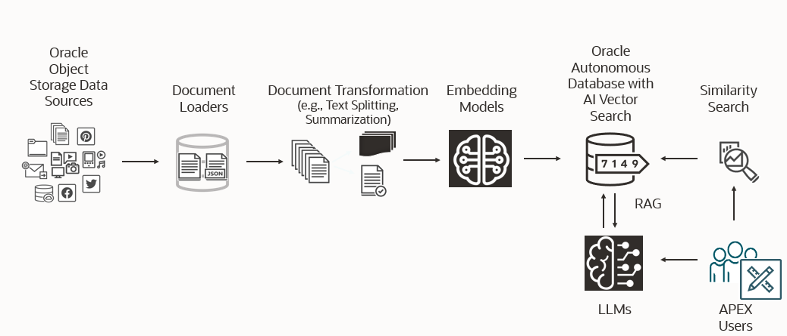

# Introduction

## Lab Overview

The scope of this workshop is to create a Generative AI RAG application using Oracle APEX with AI Vector Search in Oracle Autonomous Database. The workshop uses Oracle Object Storage as the knowledge base repository to store documents.  Customers can use the Oracle Object Storage to securely store confidential business information.

## Objectives

By the end of this lab, users will be able to:
* Set up APEX to access the Oracle Object Storage
* Set up Autonomous Database to access the Oracle Object Storage for importing the embedding model
* Import and configure APEX and run the RAG sample application
* Use APEX to call PLSQL for developing applications with Large Language Models [LLMs]
* Use AI Vector Search to store and search vectors in Oracle Autonomous Database
* Access the LLM and generate output

### Prerequisites

- An Oracle Cloud Account

## Application Description

In this Oracle Live Labs workshop, participants will develop an advanced APEX application that integrates the Retrieval Augmented Generation (RAG) model with Oracle's cutting-edge AI and database technologies. Utilizing the ONNX framework and AI Vector capabilities within Oracle Autonomous Database 23AI, this application revolutionizes document management by enabling secure storage, vectorization, and advanced querying of documents stored in Oracle Cloud Object Storage. Users will interact with the application to ask complex questions, receiving precise, context-aware responses based on the vectorized contents of the documents they want to interact with. This workshop provides a deep dive into Oracle’s AI-driven capabilities, equipping participants with the skills to build next-generation applications that merge AI with enterprise data management for enhanced efficiency, security, and insight.

## Key Components

1. **Oracle APEX Application**: A low-code development platform for building scalable, secure enterprise apps.
2. **Oracle Autonomous Database 23ai**: A fully managed, self-driving database service optimized for data warehousing and transaction processing.
3. **Oracle Cloud Object Storage**: A secure, scalable, and cost-effective storage solution for unstructured data.

## Benefits

- **AI Vector Management**: Streamlined process for storing, vectorizing, and querying documents.
- **Increased Efficiency**: Faster data retrieval and insights without manual intervention.
- **Secure Storage**: Documents are stored securely within Oracle's robust cloud infrastructure.

This lab provides a hands-on experience with Oracle's cutting-edge cloud technologies, enabling users to easily build and deploy advanced AI data-driven applications.

## Learn More

See below for more information on Oracle Database 23ai and Oracle AI Vector Search

* [Oracle Database 23ai Documentation](https://docs.oracle.com/en/database/oracle/oracle-database/)
* [Oracle AI Vector Search User's Guide](https://docs.oracle.com/en/database/oracle/oracle-database/23/vecse/index.html)
* [Oracle AI Vector Search Blog](https://blogs.oracle.com/database/post/oracle-announces-general-availability-of-ai-vector-search-in-oracle-database-23ai)

You may now [proceed to the next lab](#next).

## Acknowledgements
* **Authors** - Blake Hendricks, Vijay Balebail, Milton Wan
* **Last Updated By/Date** -  July 2024