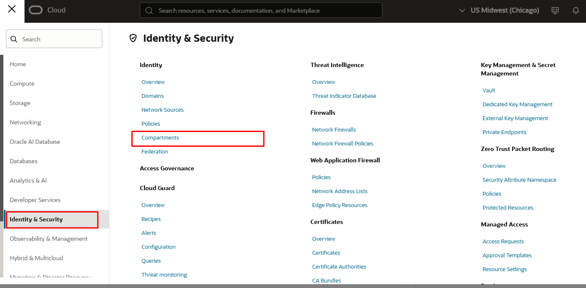
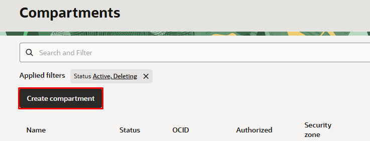
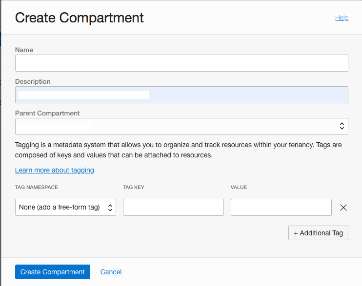
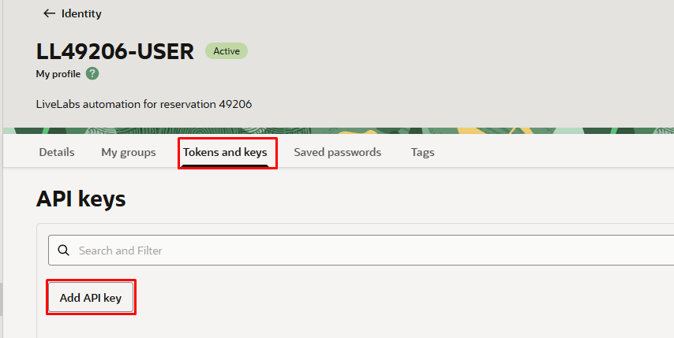
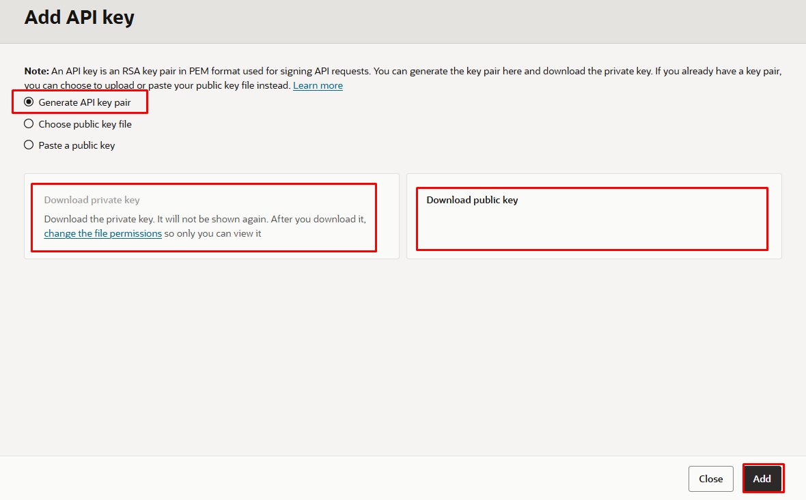
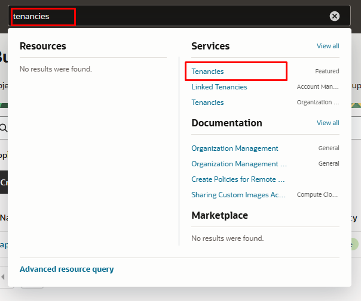
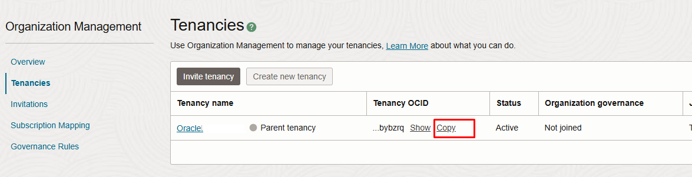
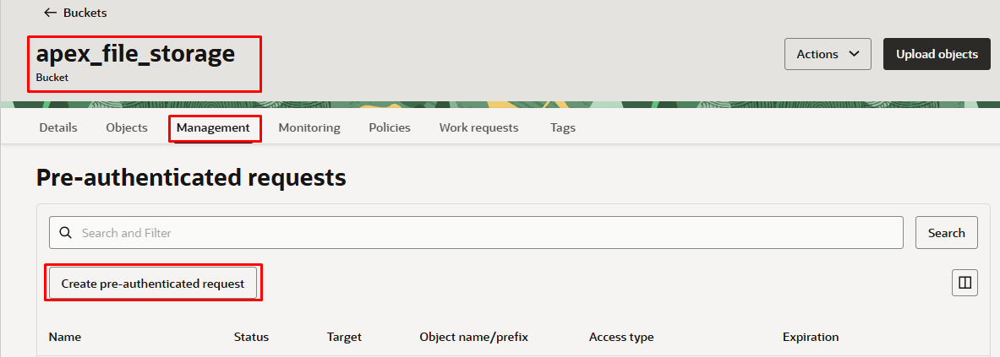

# Setup OCI Resources

## Introduction

Welcome to Lab 1. This workshop demonstrates how to set up Oracle Cloud Infrastructure (OCI) resources to enable Oracle APEX to access Oracle Object Storage. The lab focuses on two main areas: Identity Setup and Bucket Setup. By the end of this lab, you will have a functional compartment and policies for managing your cloud resources, as well as a properly configured bucket for storing and managing your objects in OCI.

In the Identity Setup section, you will learn how to create compartments, manage policies, and set up users with the necessary permissions to interact with OCI resources. Following this, the Bucket Setup section will walk you through the process of creating and configuring a storage bucket, essential for managing data and objects in your cloud environment.

**Estimated Time:** 10 minutes

## Objectives

By completing this lab, you will achieve the following objectives:

- **Create and configure a new compartment** for managing resources in OCI.
  - This involves setting up a logical grouping for your resources to enhance management and organization.
  
- **Establish policies** to control access and permissions within the compartment.
  - You will define and implement policies to manage who can access and perform actions on your OCI resources.

- **Set up a user specifically for API key management and interaction.**
  - This step ensures that there is a dedicated user with appropriate permissions for managing and using API keys securely.

- **Configure API keys for secure access and operations.**
  - You will generate and set up API keys to enable secure programmatic access to your OCI resources.

- **Obtain necessary OCIDs** for compartments, users, and tenancies.
  - OCIDs (Oracle Cloud Identifiers) are essential for uniquely identifying your resources in OCI.

- **Create and configure a storage bucket in OCI.**
  - This section guides you through setting up a storage bucket, a crucial component for storing and managing data in your cloud environment.

- **Generate a Pre-Authenticated Request (PAR) for secure bucket access.**
  - You will create a PAR to enable secure and temporary access to your storage bucket without requiring further authentication.

### Task 1: Create an OCI Compartment

1. Click the hamburger icon (≡) at the top left corner of the page.

2. Click Identity & Security. Hover over Identity and click the Compartment submenu item.


3. Click Create Compartment.


4. Enter the following information in the corresponding fields or use your own names:
    - **Name**: PROD
    - **Description**: Compartment for PROD assets
 

5. Click Create to complete the process.
6. Save the compartment OCID for later use.
   

The members of the ProdObjectManagers group will require the ability to list the buckets in the compartment and manage any objects in these buckets. 

9. Add the following statements to allow the respective policy actions:
    - Allow group ProdObjectManagers to read buckets in compartment PROD
    - Allow group ProdObjectManagers to manage objects in compartment PROD
10. Click Create to complete the process.
    

### Task 2: Create policy to enable access to OCI GenAI

Oracle's GenAI service is an LLM service from Oracle Cloud Infrastructure (OCI). The GenAI service provides access to several LLMs that you can pick from.

Create an OCI policy to enable access to OCI GenAI service.
Create a policy that will allow you to use OCI GenAI within your previously defined compartment. Make sure your policy uses the compartment where your database is deployed. The policy will be necessary for the database to interact with OCI Generative AI.

1. From the Console, open the Navigation menu and click Identity & Security. Under Identity, click Policies.

2. Click on Create policy and paste the following into the appropriate fields:

Note: Slide the Show manual editor control to display the text field in order to paste the policy.

Name: PublicGenAI

Description: Public Gen AI Policy

Compartment: select your own compartment

```
<copy>
Policy: allow user to manage generative-ai-family in compartment \<your compartment>
</copy>
```

3. Click Create.

 

Note: This policy allows any database in the specified compartment to access OCI Generative AI service. In a production environment, ensure your policy's scope is minimally inclusive.

### Task 3: Save User OCID and Create API Keys 

1. Click the profile icon in the top right of your OCI page, and click My Profile.
    
2. Save the user OCID for later use.
    

### Task 4: Create OCI API Key

1. Select API KEYS under the resources section and add api key.
    
2. Click on download the private key and public key.

3. Save the contents of the private key in a separate document.
4. View the configuration file and select the copy button and save it in a separate document for later use.

5. Go ahead and close the tab after you have saved the contents. 


### Task 5: Grab Your Parent Tenancy OCID

1. Type tenancies in the OCI search bar, click the result, and then the tenancy name.

2. Copy the tenancy OCID and save it in a separate document for later use.



### Task 6: Create a Bucket

In Oracle Object Storage, a bucket is a container for storing objects. To access a bucket through the Oracle Cloud Infrastructure REST APIs, complete the following identity management tasks using the Oracle Cloud Infrastructure console and an account that has administrative rights within the tenancy (the root compartment).

1. Log in to the Oracle Cloud Infrastructure console as an administrator.
2. Click the hamburger icon (≡), select Object Storage, and click Object Storage.
3. Ensure the PROD compartment is selected.

1. Click Create Bucket and provide the following information in the corresponding fields:
    - **Bucket Name**: Enter `apex_file_storage`, for example.
    - **Storage Tier**: Select Standard.
    - **Emit Object Events**: Uncheck this option.
    - **Encryption**: Select Encrypt Using Oracle Managed Keys.

1. Click Create Bucket to complete the process.
2. To prepare for the successful creation and discovery of the WSM data profile later, upload a dummy file to the `apex_file_storage` bucket now using the Oracle Cloud Infrastructure console.

### Task 7: Create a Pre-Authenticated Request (PAR)

1. Click Create Pre-Auth Request on the resources section from the newly created bucket.

2. Name the bucket and permit object reads and writes, enabling object listing.
3. Set the expiry date for the PAR to a time far in the future.
4. Click Create and save the pre-auth request URL in a document for later use.


You may now [proceed to the next lab](#next).

## Acknowledgements
* **Authors** - Blake Hendricks, Milton Wan
* **Last Updated By/Date** -  July 2024