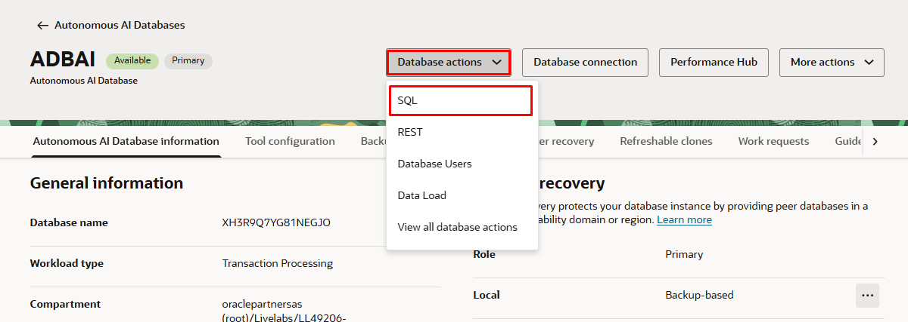

# Create the database vector tables

## Introduction

A typical RAG application requires a vector store.  Oracle Autonomous Database 23ai will be used as the vector store. In this lab, we will use documents as the source data, but you can apply these steps to other data types including audio and video.  `DBMS_VECTOR_CHAIN` package is used in this lab.  To get a better understanding of the RAG steps and the use of Oracle AI Vector Search `DBMS_VECTOR_CHAIN` package, see the PLSQL RAG LiveLabs.

Estimated Time: 10 minutes

### Objectives

In this lab, you will:

* Create the vector table in Oracle Autonomous Database 23ai
* Create a procedure to store the document
* Create a trigger to embed the vectors
* Create a function to return similar chunks and generate LLM response

### Prerequisites

* Environment with Oracle Autonomous Database 23ai

## Task 1: Create tables to store the document, chunks, and vectors

1. From your Autonomous Database console select Database Actions SQL worksheet

2. Login as VECTOR user.
3. Create a table named *MY\_BOOKS* in the VECTOR schema. We will use this table to load the original PDF file as a BLOB. Copy the code snippet to the SQL worksheet and click **Run**.

    ```
    <copy>
    CREATE TABLE IF NOT EXISTS "VECTOR"."MY_BOOKS"
        ( 
        ID              INTEGER GENERATED BY DEFAULT ON NULL AS IDENTITY 
            ( START WITH 1 CACHE 20 ) PRIMARY KEY, 
        file_name      VARCHAR2 (900) , 
        file_size      INTEGER , 
        file_type       VARCHAR2 (100) , 
        file_content    BLOB
        ) 
        LOGGING 
    </copy>
    ```

4. Create a table named *VECTOR\_STORE* in the VECTOR schema. This is used to store the corresponding text chunks and embeddings in a column of vector datatype. Copy the code snippet and click **Run**.

    ```
    <copy>
    CREATE TABLE IF NOT EXISTS VECTOR.VECTOR_STORE
      ( "DOC_ID" NUMBER(*,0) NOT NULL ENABLE, 
      "EMBED_ID" NUMBER, 
      "EMBED_DATA" VARCHAR2(4000 BYTE), 
      "EMBED_VECTOR" VECTOR,
        FOREIGN KEY (DOC_ID) REFERENCES VECTOR.MY_BOOKS(ID)
      )
    </copy>
    ```

## Task 2: Create database procedure and trigger

In this task you will:

Create a procedure `insert_my_table_row` to insert the PDF, Word, or TXT file into the MY\_BOOKS table and return the doc\_id

Create a trigger `trg_mybooks_vector_store_compound` to create embedding for the PDF and store it in the VECTOR\_STORE table.

1. From the Database Actions SQL Worksheet create and run the procedure `insert_my_table_row`

    ```
    <copy>
    create or replace PROCEDURE insert_my_table_row(
        p_file_name IN my_books.file_name%TYPE,
        p_file_size IN my_books.file_size%TYPE,
        p_file_type IN my_books.file_type%TYPE,
        p_file_content IN my_books.file_content%TYPE,
        p_new_id OUT number
    )
    IS
        v_count NUMBER;
        v_id    number;
        new_id  number ;
    BEGIN
        -- Check if the combination of a and b already exists
        BEGIN
        SELECT id INTO new_id FROM MY_BOOKS WHERE file_name = p_file_name AND file_size = p_file_size;
        EXCEPTION WHEN NO_DATA_FOUND THEN
        INSERT INTO MY_BOOKS (file_name, file_size, file_type, file_content)
            VALUES (p_file_name, p_file_size, p_file_type, p_file_content)
            RETURNING id into new_id;
        END;
        p_new_id := new_id;
        dbms_output.put_line(new_id);
        COMMIT;
    EXCEPTION
        WHEN OTHERS THEN
            -- Exception handling here, for example, a rollback or a custom error message
                DBMS_OUTPUT.PUT_LINE('Error: ' || SQLERRM);
            --RAISE;
    END insert_my_table_row;

    </copy>
    ```

2. Create the trigger `trg_mybooks_vector_store_compound`

    ```
    <copy>
    CREATE OR REPLACE TRIGGER trg_mybooks_vector_store_compound
    FOR INSERT ON my_books
    COMPOUND TRIGGER

        TYPE t_id_tab IS TABLE OF my_books.id%TYPE INDEX BY PLS_INTEGER;
        v_ids t_id_tab;

        AFTER EACH ROW IS
        BEGIN
            v_ids(v_ids.COUNT + 1) := :NEW.id;
        END AFTER EACH ROW;

        AFTER STATEMENT IS
        BEGIN
            FOR i IN 1 .. v_ids.COUNT LOOP
                INSERT INTO vector_store (doc_id, embed_id, embed_data, embed_vector)
                SELECT dt.id AS doc_id, 
                      et.embed_id, 
                      et.embed_data, 
                      to_vector(et.embed_vector) AS embed_vector
                FROM my_books dt
                CROSS JOIN TABLE(
                    dbms_vector_chain.utl_to_embeddings(
                        dbms_vector_chain.utl_to_chunks(
                            dbms_vector_chain.utl_to_text(dt.file_content), 
                            json('{"by":"words","max":"300","split":"sentence","normalize":"all"}')
                        ),
                        json('{"provider":"database", "model":"tinybert_model"}')
                    )
                )  t
                CROSS JOIN JSON_TABLE(
                    t.column_value, 
                    '$[*]' COLUMNS (
                        embed_id NUMBER PATH '$.embed_id',
                        embed_data VARCHAR2(4000) PATH '$.embed_data',
                        embed_vector CLOB PATH '$.embed_vector'
                    )
                ) AS et
                WHERE dt.id = v_ids(i);
            END LOOP;
        END AFTER STATEMENT;

    END trg_mybooks_vector_store_compound;

    </copy>
    ```

## Task 3: Option 1 OpenAI - Create function to generate response using OpenAI LLM

The LLM involves processing both the user question and relevant text excerpts to generate responses tailored specifically to the provided context. It's essential to note that the nature of the response is contingent upon the question and the LLM utilized.

LLM prompt engineering enables you to craft input queries or instructions to create more accurate and desirable outputs.  The PLSQL uses a SQL CURSOR and CLOBs to generate the LLM prompt based on facts from the similarity search from Oracle Database 23ai.

In the code below we are embedding the user question, performing a vector search in the database for the relevant text chunks using a vector distance function. We pass the doc\_id to select the chunks related to a PDF document we loaded.  This improves the accuracy of the LLM response for the question by restricting the result within the content of PDF. We then send the text chunks to LLM to provide the response.

Compile the function `generate_text_response2` below.  It is called from APEX.

### OpenAI

For connecting and authenticating to OpenAI you must have created the login credentials with an OpenAI API key using DBMS\_VECTOR.CREATE\_CREDENTIAL in the previous lab. Note: If you receive an HTTP response error ensure you have enough credits to use OpenAI.

```sql
<copy>
create or replace FUNCTION generate_text_response2 (
    user_question VARCHAR2,
    doc_id        NUMBER,
    topn          NUMBER
) RETURN CLOB IS

    messages          CLOB;
    params            CLOB;
    output            CLOB;
    message_line      VARCHAR2(4000);
    message_cursor    SYS_REFCURSOR;
    user_question_vec vector;
    pages_1             varchar2(4000);
    embed_id          number ;
BEGIN

  --vectorize the user_question

    OPEN message_cursor FOR 'WITH a AS (
    SELECT TO_VECTOR(VECTOR_EMBEDDING(TINYBERT_MODEL USING  :user_question AS data)) AS embed
    FROM DUAL)
    SELECT  EMBED_DATA, embed_id
     FROM VECTOR_STORE, a
     WHERE doc_id = :doc_id
     ORDER BY VECTOR_DISTANCE(EMBED_VECTOR, a.embed, COSINE)
     FETCH FIRST :topn ROWS ONLY '
     USING user_question, doc_id, topn;

  --select embed_data from vector_store where doc_id=7;
  -- Initialize messages CLOB
    messages := 'Your task  is to answer the Question from the give text. ';
    pages_1  := '--';

  -- Loop through cursor results and construct messages
    LOOP
        FETCH message_cursor INTO message_line,embed_id;
        EXIT WHEN message_cursor%notfound;

    -- Append message line to messages CLOB
        messages := messages|| '{"message": "'|| message_line|| '"},'|| chr(10);
        pages_1 := embed_id||','||pages_1;

    END LOOP;

    messages := messages|| '{"Question": "'|| user_question|| '"},'|| chr(10);
  -- Close the cursor
    CLOSE message_cursor;

  -- Remove the trailing comma and newline character
    messages := rtrim(messages, ',' || chr(10));

  -- Construct params JSON
    params := '
{
  "provider": "openai",
  "credential_name": "OPENAI_CRED",
  "url": "https://api.openai.com/v1/chat/completions",
  "model": "gpt-3.5-turbo-16k",
  "max_tokens": 2000,
  "temperature": 1.0
}';
    dbms_output.put_line('------------------------');
   -- dbms_output.put_line(messages);
    dbms_output.put_line(pages_1);
  --dbms_output.put_line(to_char(user_question_vec));

  -- Call UTL function to generate text
  output := dbms_vector_chain.utl_to_generate_text(messages, json(params));

  -- Return the generated text
    RETURN output;
EXCEPTION
    WHEN OTHERS THEN
        RETURN sqlerrm || sqlcode;
END;
</copy>
```

## Task 3: Option 2 OCI GenAI Service - Create function to generate response using OCI GenAI LLM

The LLM involves processing both the user question and relevant text excerpts to generate responses tailored specifically to the provided context. It's essential to note that the nature of the response is contingent upon the question and the LLM utilized.

LLM prompt engineering enables you to craft input queries or instructions to create more accurate and desirable outputs.  The PLSQL uses a SQL CURSOR and CLOBs to generate the LLM prompt based on facts from the similarity search from Oracle Database 23ai.

In the code below we are embedding the user question, performing a vector search in the database for the relevant text chunks using a vector distance function. We pass the doc\_id to select the chunks related to a PDF document we loaded.  This improves the accuracy of the LLM response for the question by restricting the result within the content of PDF. We then send the text chunks to LLM to provide the response.

Compile the function `generate_text_response2` below.  It is called from APEX.

### OCI GenAI

For connecting and authenticating to OCI GenAI you must have created the login credentials using DBMS\_VECTOR.CREATE\_CREDENTIAL in the previous lab.

```sql
<copy>
create or replace FUNCTION generate_text_response2 (
    user_question VARCHAR2,
    doc_id        NUMBER,
    topn          NUMBER
) RETURN CLOB IS

    messages          CLOB;
    params            CLOB;
    output            CLOB;
    message_line      VARCHAR2(4000);
    message_cursor    SYS_REFCURSOR;
    user_question_vec vector;
    pages_1             varchar2(4000);
    embed_id          number ;
BEGIN

  --vectorize the user_question

    OPEN message_cursor FOR 'WITH a AS (
    SELECT TO_VECTOR(VECTOR_EMBEDDING(TINYBERT_MODEL USING  :user_question AS data)) AS embed
    FROM DUAL)
    SELECT  EMBED_DATA, embed_id
     FROM VECTOR_STORE, a
     WHERE doc_id = :doc_id
     ORDER BY VECTOR_DISTANCE(EMBED_VECTOR, a.embed, COSINE)
     FETCH FIRST :topn ROWS ONLY '
     USING user_question, doc_id, topn;

  --select embed_data from vector_store where doc_id=7;
  -- Initialize messages CLOB
    messages := 'Your task  is to answer the Question from the give text. ';
    pages_1  := '--';

  -- Loop through cursor results and construct messages
    LOOP
        FETCH message_cursor INTO message_line,embed_id;
        EXIT WHEN message_cursor%notfound;

    -- Append message line to messages CLOB
        messages := messages|| '{"message": "'|| message_line|| '"},'|| chr(10);
        pages_1 := embed_id||','||pages_1;

    END LOOP;

    messages := messages|| '{"Question": "'|| user_question|| '"},'|| chr(10);
  -- Close the cursor
    CLOSE message_cursor;

  -- Remove the trailing comma and newline character
    messages := rtrim(messages, ',' || chr(10));

  -- Construct oci genai params JSON
    params := '
    {
      "provider":"ocigenai",
      "credential_name": "GENAI_CRED",
      "url": "https://inference.generativeai.us-chicago-1.oci.oraclecloud.com/20231130/actions/generateText",
      "model": "cohere.command",
      "inferenceRequest": {
        "maxTokens": 2000,
        "temperature": 1
      }
    }';

    dbms_output.put_line('------------------------');
   -- dbms_output.put_line(messages);
    dbms_output.put_line(pages_1);
  --dbms_output.put_line(to_char(user_question_vec));

  -- Call UTL function to generate text
  output := dbms_vector_chain.utl_to_generate_text(messages, json(params));

  -- Return the generated text
    RETURN output;
EXCEPTION
    WHEN OTHERS THEN
        RETURN sqlerrm || sqlcode;
END;
</copy>
```

## Conclusion

In this lab we learned how a RAG solution using PLSQL works.  The table below lists the vector functions we used.

<table>
      <thead>
        <tr>
          <th style={{ width: "200px" }}>
            Description
          </th>
          <th>
            Function
          </th>
        </tr>
      </thead>
        <tbody>
        <tr>
          <td>
            Embedding the user question  
          </td>
          <td>
            VECTOR_EMBEDDING(tinybert_model USING user_question as data)
          </td>
        </tr>
        <tr>
          <td>
            Do vector search on question against text chunk embeddings
          </td>
          <td>
            VECTOR_DISTANCE(EMBED_VECTOR, :user_question_vec, COSINE)
          </td>
        </tr>
        <tr>
          <td>
            Pass the result chunks and the user question to the LLM
          </td>
          <td>
            DBMS_VECTOR_CHAIN.UTL_TO_GENERATE_TEXT(messages, json(params_genai))
          </td>
        </tr>
        </tbody>
</table>

• In the next LAB, the APEX code will be calling the package functions here.

• This means that these packages could then easily be called from any programming language, eg.,

    * JDBC
    * C# with OPD.NET
    * python-oracledb
    * node-oracledb
    * OCI, OCCI, ODBC, Pro*C or Pro*COBOL
    * Go, Rust, PHP, Ruby etc

## Summary

You now know how to create the database vector tables with sql worksheet in ADB using OCI console.

You may now [proceed to the next lab](#next).

## Acknowledgements

* **Authors** - Vijay Balebail, Milton Wan, Blake Hendricks
* **Last Updated By/Date** - Milton Wan, July 2024
