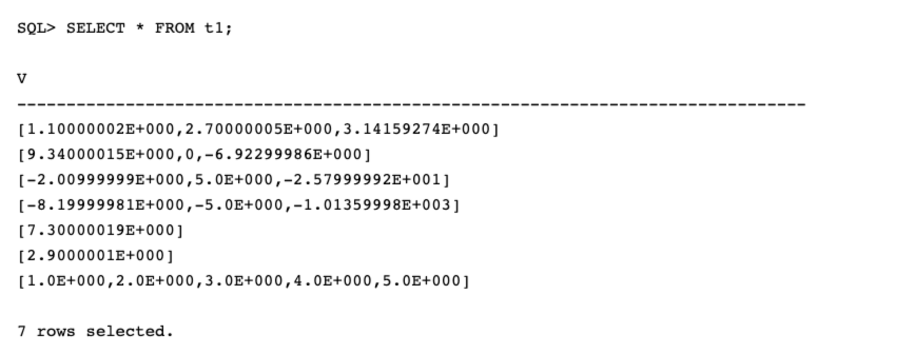
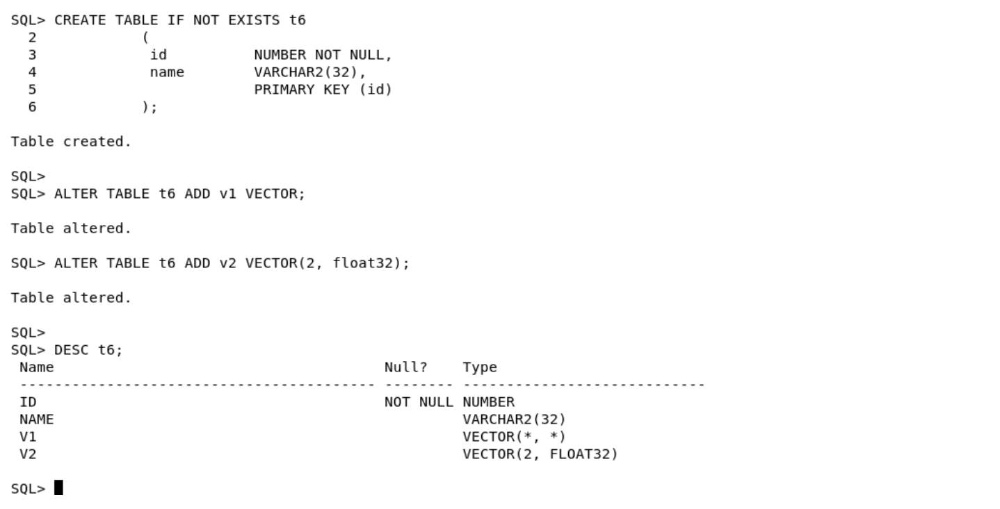

# Lab 1: Vector DDL, DML and Queries

## Introduction

In this lab we will be taking a look at using Vector data with regular relational tables. Upon completing this lab you will see:
* How easy it is to create a table with a Vector Column.
* Perform DDL (data definition language) operations on Vector columns.
* How regular DML (data manipulation language) operations can be used with Vector columns.


We'll start by creating a table with a single Vector column, Insert a few rows and query the table.

Estimated Time: 15  minutes

### Objectives


In this lab, you will see how you can perform the following Vector operations:
* Task 1 - Create a Vector in a table
* Task 2 - Insert Vectors into a Vector table
* Task 3 - Select the values from a Vector
* Task 4 - Update Vectors
* Task 5 - Performing DML operations on Vectors
* Task 6 - Tables with multiple Vectors
* Task 7 - Operations on Vectors with fixed dimensions
* Task 8 - Creating tables with multi-dimension Vectors
* Task 9 - Performing DDL operations on Vectors
* Task 10 - Vector Operations that are not permitted


### Prerequisites

This lab assumes you have:
* An Oracle account
* All previous labs successfully completed


*This is the "fold" - below items are collapsed by default*

## Connecting to your Vector Database

The lab environment includes a preinstalled Oracle 26ai Free Database which includes Oracle AI Vector Search. We will be running the lab exercises from a pluggable database called: *orclpdb1* and connecting to the database as the user: *vector* with the password: *vector*

The VM image has SQLDeveloper, SQL\*Plus and SQLCL installed, so you can choose your favorite client for running the LiveLabs. To connect with SQL\*Plus you can use:

```

  <copy>sqlplus vector/vector@orclpdb1</copy>

```

You should see:

 


## Task 1: Create a Vector in a table

Create a Vector in a table.

You will notice when we describe the table, we can see the new VECTOR data type is displayed.


```
  <copy>DROP TABLE IF EXISTS t1;  

  CREATE TABLE IF NOT EXISTS t1 (v  vector);

  DESC t1 </copy>
```

You should see:

 


## Task 2: Insert Vectors into a Vector table

  Next, we'll insert some trivial vectors into the vector table.

  *Note: Vectors are an array of numbers and can be null. However individual vector array elements numbers cannot be null.*

  - You need to separate each number with a comma.
  - You need to enclose the array with single quotes.

    ```
      <copy>INSERT INTO t1 VALUES ('[1.1, 2.7, 3.141592653589793238]'),
                            ('[9.34, 0.0, -6.923]'),
                            ('[-2.01, 5, -25.8]'),
                            ('[-8.2, -5, -1013.6]'),
                            ('[7.3]'),
                            ('[2.9]'),   
                            ('[1, 2, 3, 4, 5]') ; </copy>
    ```

   You should see:
 


## Task 3: Select the values from a Vector

  Now let's SELECT the values of a vector. You will notice, the number is displayed in scientific format.

  ```
    <copy>SELECT * FROM t1;</copy>
  ```

You should see:

 

## Task 4: Update Vectors

  It is also possible to update all Vectors.

  ```
    <copy>UPDATE t1 SET v = '[1.9, -5.02, 4]';

    SELECT * FROM t1; </copy>
  ```

You should see:

 

## Task 5: Performing DML operations on Vectors

  Other DML operations are also permitted on tables  containing Vectors, including operations on the Vectors themselves.

1. For this step we will create a table with multiple columns - including a vector column. We will also insert some rows into the table.

    ```
      <copy>CREATE TABLE IF NOT EXISTS t2
         ( id           NUMBER NOT NULL,
           name         VARCHAR2(32),
           v1           VECTOR,
                        PRIMARY KEY (id)
         );

      DESC t2;</copy>
    ```

    You should see:

 

2. Insert rows into the newly created table.

    ```
      <copy>INSERT INTO t2 VALUES (1, 'A', '[1.1]'),
                            (2, 'B', '[2.2]'),
                            (3, 'C', '[3.3]'),
                            (4, 'D', '[4.4]'),
                            (5, 'E', '[5.5]');

      SELECT * FROM t2; </copy>
    ```

    You should see:

 

3. Now let's see how we can update a Vector based upon another column in the table.

    ```
      <copy>UPDATE t2
      SET   v1 = '[2.9]'
      WHERE id = 2;

      SELECT * FROM t2
      WHERE id = 2;</copy>

    ```

    You should see:

 

4. It's also possible to delete rows containing   Vectors in the table too.

    ```
      <copy>DELETE FROM  t2
      WHERE  id IN (1, 3);

      SELECT * FROM t2; </copy>

    ```

    You should see:

 


## Task 6: Tables with multiple Vectors

  It is possible to create a table with multiple vectors. But it is most likely that normalized tables will have one vector per table.

  1. As a first step we will create a table with multiple Vectors.

    ```
      <copy>CREATE TABLE IF NOT EXISTS t3
             ( id           NUMBER NOT NULL,
               name         VARCHAR2(32),
               v1           VECTOR,
               v2           VECTOR,
               v3           VECTOR,
                            PRIMARY KEY (id)
             );

      DESC t3;</copy>

    ```

    You should see:

 

2. Next we will insert a row into the table.


    ```
      <copy>INSERT INTO t3 VALUES
             (1,
              'One',
              '[2.3, 4.5, 0.1]',
              '[1.3]',
              '[4.981, -6.3]'
             );

      SELECT * FROM t3; </copy>

    ```

    You should see:

 

## Task 7 - Operations on Vectors with fixed dimensions

Vectors have two components:
 - The number of dimensions
    - When defined, the *number of dimensions* becomes effectively a check constraint.
 - The *number format*
    - Oracle will cast the number as needed.

You can currently use up to 64K dimensions  and when defined, the **number of dimensions** becomes effectively a check constraint.

Some examples of the number of dimensions for vector embeddings:
- OpenAI text-embedding-ada-002   = 1536 dimensions
- Cohere Embed-English-v2.0       = 4096 dimensions
- Cohere Embed-English-Light-v2.0 = 1024 dimensions
- Cohere Embed-Multilingual-v2.0  = 768 dimensions
- open-source all-MiniLM-L6-v2    = 384 dimensions
1. Let's start by seeing how easy it is to create a table with a fixed number and number-format Vector.


    ```

      <copy>CREATE TABLE IF NOT EXISTS t4
                    ( v   VECTOR(3, FLOAT32) );

      DESC t4; </copy>

    ```

    You should see:

 

2. See how Vector formats are implicitly controlled once they are defined.

    In this example we will see:
    - The wrong number of elements will be rejected
    - The wrong format for the elements will be rejected

    **Note:** Observe the error messages thrown for the last 3 insert statements.

    ```
      <copy>INSERT INTO t4 VALUES ('[1.1, 2.2, 3.3]');
      INSERT INTO t4 VALUES ('[1.2, 2.3, 3.4]');
      INSERT INTO t4 VALUES ('[1.2, 2.3, 3.4]');
      INSERT INTO t4 VALUES ('[1.3]');
      INSERT INTO t4 VALUES ('[1.3, 2.4, 3.5, 4.1]');
      INSERT INTO t4 VALUES ('[1.4, 2.5, a]');
       </copy>
    ```

    The first three inserts should succeed:

 

    The next three inserts should be rejected:

 


## Task 8 - Creating tables with different Vector formats

1. It is possible to create a table with different Vector formats and in this example we will see how easy it is.

    The following Vector formats will be used in this table:
    - vector(*, float64) means any number of dimensions with float64 format
    - vector(5, *) means five dimensions with any number format
    - vector(*, *) means any number of dimensions with any number format
    - vector means any number of dimensions with float32 format
    - vector(1, int8) means one dimension with int8 format
       - int8 is a single byte


    ```
      <copy>CREATE TABLE IF NOT EXISTS t5
               ( v1        VECTOR(3, float32),
                 v2        VECTOR(2, float64),
                 v3        VECTOR(1, int8),
                 v4        VECTOR(1, *),
                 v5        VECTOR(*, float32),
                 v6        VECTOR(*, *),
                 v7        VECTOR
               );

      DESC t5;</copy>

    ```

    You should see:

 


2. Now, let's insert data into the Vectors:

    ```
      <copy>INSERT INTO t5 VALUES ('[1.1, 2.2, 3.3]',
                             '[1.1, 2.2]',
                             '[7]',
                             '[9]',
                             '[1.1, 2.2, 3.3, 4.4, 5.5]',
                             '[1.1, 2.2]',
                             '[1.1, 2.2, 3.3, 4.4, 5.5, 6.6]'
                            );

      SELECT * FROM t5; </copy>

    ```

    You should see:

 

## Task 9 - DDL operations with Vectors Operations

Regular DDL (Data Definition Language) operations are permitted on tables with Vectors.

1. It is possible to add a Vector to an existing table. Including a table that does not already contain a Vector as we will see in this step.

    ```
      <copy>CREATE TABLE IF NOT EXISTS t6
                (
                 id          NUMBER NOT NULL,
                 name        VARCHAR2(32),
                             PRIMARY KEY (id)
                );

      ALTER TABLE t6 ADD v1 VECTOR;
      ALTER TABLE t6 ADD v2 VECTOR(2, float32);

      DESC t6;</copy>

    ```

    You should see:

 

2. It is also possible to remove a Vector from a table or even drop an entire table containing a Vector.

    ```
      <copy>ALTER TABLE t6 DROP COLUMN v2;

      DESC t6;

      DROP TABLE IF EXISTS t6;</copy>

    ```

    You should see:

 

3. It is also possible to create a table with a Vector from another table with a Vector. In this example we are using a CTAS (Create Table As Select) operation.

    ```
      <copy>CREATE TABLE IF NOT EXISTS t7
          AS SELECT * FROM t3;

      DESC t7;

      SELECT * FROM t7; </copy>
    ```

    You should see:

 


## Task 10 - Vector Operations that are not permited

It is not possible to perform comparison operations between Vectors.  In the following step all three of the statements will fail as they are not permitted.

```
  <copy>SELECT id, name FROM t2
  WHERE  v1 IN (SELECT v FROM t1 WHERE t2.v1 = t1.v );

  SELECT id, name FROM t2 WHERE v1 = '[2.9]';

  SELECT id, name FROM t2 WHERE v1 = vector('[2.9, 0]', 2, float32); </copy>

```

All three of the statements will throw the following Oracle error message:

 


## Learn More

* [Oracle Database 26ai Release Notes](https://docs.oracle.com/en/database/oracle/oracle-database/23/rnrdm/index.html)
* [Oracle AI Vector Search Users Guide](https://docs.oracle.com/en/database/oracle/oracle-database/23/vecse/index.html)
* [Oracle Documentation](http://docs.oracle.com)

## Acknowledgements
* **Authors** - Doug Hood, Consulting Member of Technical Staff
* **Contributors** - Sean Stacey
* **Last Updated By/Date** - Sean Stacey, November 2023
