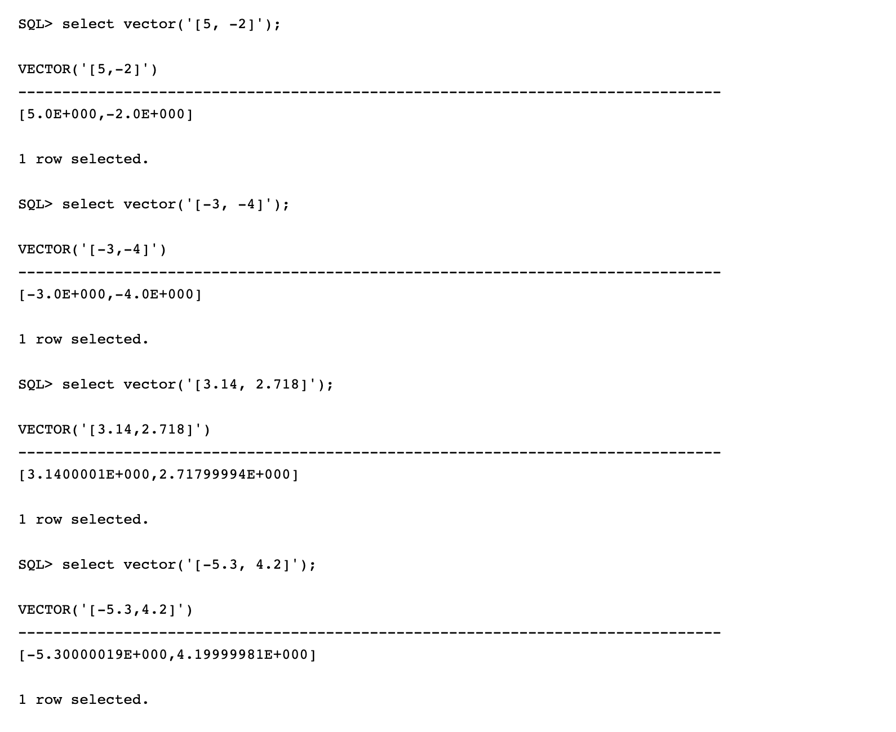
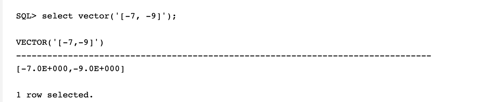
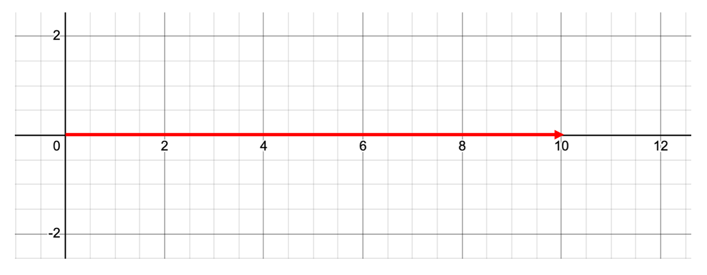
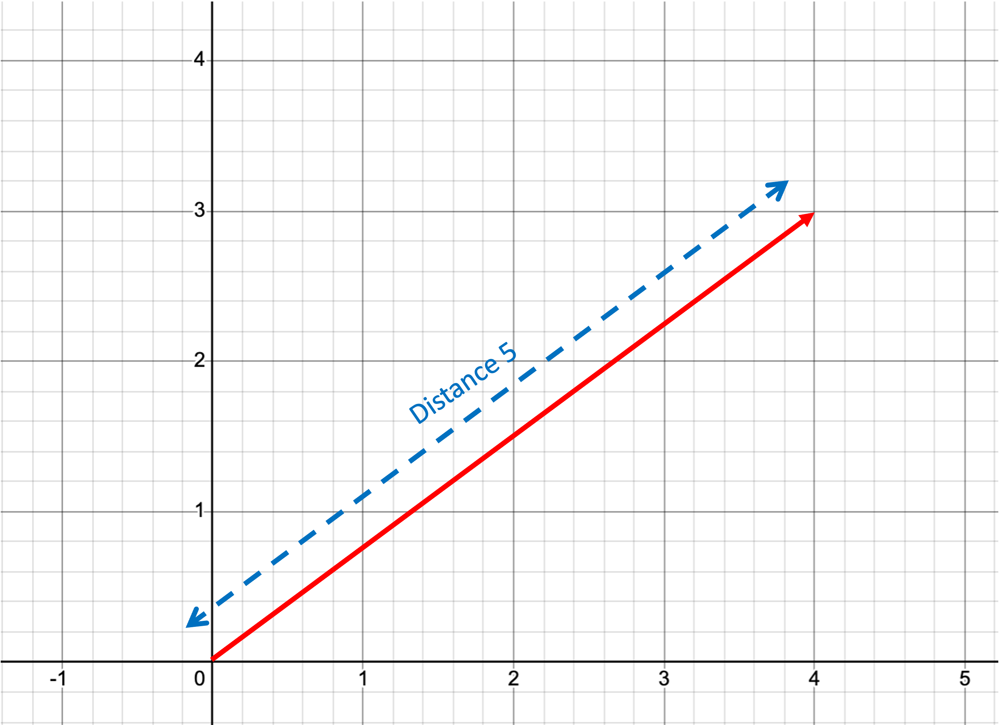
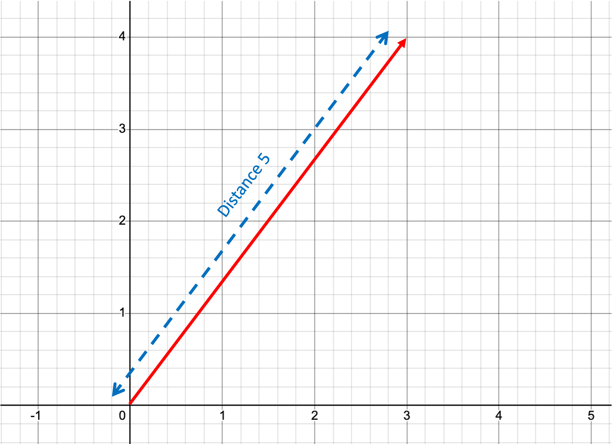
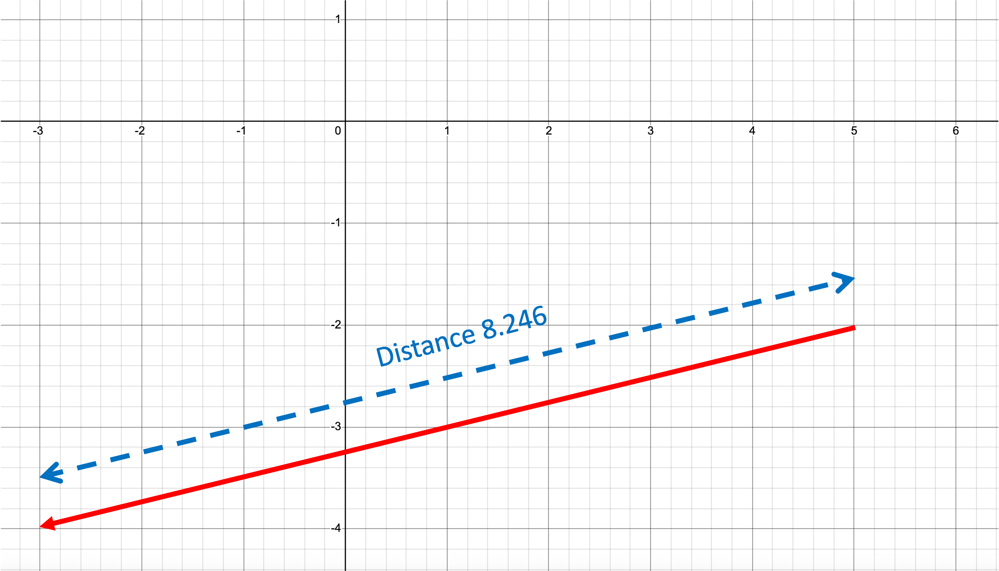
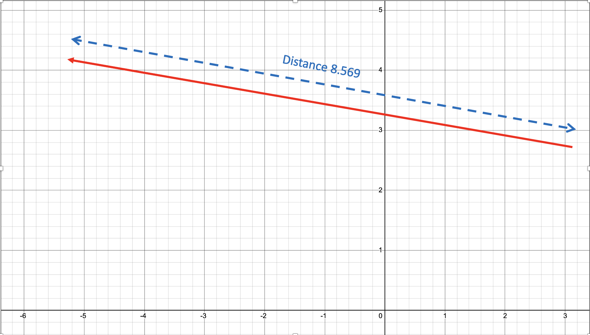

# Lab 2: Vector Distance

## Introduction

This lab introduces you to the Vector\_distance function.

- Vector\_distance() is the most important vector SQL function, as it enables similarity search.
- This exercise covers the concepts and syntax that you need to know to begin working with similarity search.

Estimated Time: 15 minutes

### Objectives

In this lab, you will:
* Use the SQL vector() constructor to create vectors
* Use the vector\_distance() function to return the distance between two vectors


## Task 1: Use the SQL vector() constructor to create vectors

Most people learned/forgot about two-dimensional graphs in school.
Two dimensional graphs have an X and Y axis.
The X axis is the horizontal offset.
The Y axis is the vertical offset.
Specifying (X,Y) coordinates determine a point on the two dimensional graph/plane.

Some examples of two-dimensional coordinates are:
* (0,0)
* (10,0)
* (0,5)
* (4,3)
* (5,-2)
* (-3,-4)
* (3.14,2.718)
* (-5.3,4.2)
* (-7,-9)

You can create vectors without inserting them into a vector column.
This is useful for learning how to use vectors with a small number of dimensions.
Vectors created via Embedding Models from companies like OpenAI or Cohere, can have thousands of dimensions.

Connect to your database, and use the SQL vector() constructor or to\_vector() to create a vector.

You need to specify the vector values, with optional number dimensions and format.
The following constructors represent the above e two-dimensional coordinates.
In Oracle Database 26ai, you do not need to specify a table for a SQL function.
The values in the vector will be in scientific format.

1. **OPTIONAL:** The following commands can be set to echo your sql commands and format output results.

    ```
      <copy>SET ECHO ON
      SET FEEDBACK 1
      SET NUMWIDTH 10
      SET LINESIZE 80
      SET TRIMSPOOL ON
      SET TAB OFF
      SET PAGESIZE 100 </copy>
    ```
    

2. Run the following queries using the vector() constructor  

    ```
      <copy>SELECT VECTOR('[0,0]');
      SELECT VECTOR('[10,0]');
      SELECT VECTOR('[0,5]', 2, float32);
      SELECT VECTOR('[4,3]');
      SELECT VECTOR('[5,-2]');
      SELECT VECTOR('[-3,-4]');
      SELECT VECTOR('[3.14,2.718]');
      SELECT VECTOR('[-5.3,4.2]');
      SELECT VECTOR('[-7,-9]'); </copy>
    ```

    You should see the following results for each query:

    

    

    


## Task 2: Using the vector_distance SQL function

1. The vector\_distance() SQL function returns the distance between two vectors.
For example, the distance between (0,0) and (10,0) is 10,
i.e., It is just the horizontal offset of 10 as the vertical offset is zero

  

    ```
    <copy>SELECT VECTOR_DISTANCE(
          VECTOR('[0, 0]'),
          VECTOR('[10, 0]'),
          EUCLIDEAN) DISTANCE; </copy>
    ```

  Results:
  


2. The scientific format of the distance can be hard to read.
Use the to\_number() function to improve readability.

    ```
    <copy>SELECT TO_NUMBER(VECTOR_DISTANCE(
        VECTOR('[0, 0]'),
        VECTOR('[10, 0]'),
        EUCLIDEAN)) DISTANCE;</copy>
    ```

  Results:
  

3. The distance between (0,0) and (0,5) is 5
i.e., It is just the vertical offset of 5 as the horizontal offset is zero.

  

    ```
    <copy>SELECT TO_NUMBER(VECTOR_DISTANCE(
        VECTOR('[0, 0]', 2, FLOAT32),
        VECTOR('[0, 5]',2, FLOAT32),
        EUCLIDEAN)) DISTANCE; </copy>
    ```

  Results:
  

4. The distance between (0,0) and (4,3) is 5.
This is the length of the hypotenuse of a triangle.
This is a 3,4,5 triangle so the length must be 5.
Verify by using the Pythagorean Theorem a^2 + b^2 = c^2

    ```
    3^2 + 4^2 = 5^2
    9 + 16 = 25
    25 = 25
    SQRT(25) = 5
    ```

    

    ```
    <copy>SELECT TO_NUMBER(VECTOR_DISTANCE(
          VECTOR('[0, 0]', 2, FLOAT32),
          VECTOR('[4, 3]', 2, FLOAT32),
          EUCLIDEAN)) DISTANCE;</copy>
    ```
  Results:
  


5. The distance between (0,0) and (3,4) is 5.
This is also a 3,4,5 triangle so the length must be 5.

  

    ```
    <copy>SELECT TO_NUMBER(VECTOR_DISTANCE(
          VECTOR('[0, 0]'),
          VECTOR('[3, 4]'),
          EUCLIDEAN)) DISTANCE; </copy>
    ```

  Results:
  

6. You do not need to use the origin (0,0) for the distance. The distance between (5,-2) and (-3,-4) is 8.246.

  Using the Pythagorean Theorem (a^2 + b^2 = c^2):

    ```
      (-3 - 5)^2 + (-4 - -2)^2 = c^2
      (-3 - 5)^2 + (-4 + 2)^2 = c^2
      (-8)^2 + (-2) ^2 = c^2
      64 + 4 = c^2
      68 = c^2
      c = sqrt(68)
      c = 8.246 [to three decimal places]
    ```

    

    ```
    <copy>SELECT TO_NUMBER(VECTOR_DISTANCE(
          VECTOR('[5, -2]', 2, FLOAT32),
          VECTOR('[-3, -4]',2, FLOAT32),
          EUCLIDEAN)) DISTANCE; </copy>
    ```

  Results:
   

7. The coordinates can be floating point numbers.
The distance between (3.14, 2.718) and (-5.3, 4.2) is 8.569

  

    ```
    <copy>SELECT TO_NUMBER(VECTOR_DISTANCE(
          VECTOR('[3.14, 2.718]'),
          VECTOR('[-5.3, 4.2]'),
          EUCLIDEAN)) DISTANCE; </copy>

    ```

  Results:
  


## Summary

Vector\_distance() is the most important vector SQL function as it enables similarity search.
The vector\_distance() SQL function
-- returns the distance between two vectors


## Learn More

* [Oracle Database 26ai Release Notes](https://docs.oracle.com/en/database/oracle/oracle-database/23/rnrdm/index.html)
* [Oracle AI Vector Search Users Guide](https://docs.oracle.com/en/database/oracle/oracle-database/23/vecse/index.html)
* [Oracle Documentation](http://docs.oracle.com)

## Acknowledgements
* **Author** - Doug Hood, Consulting Member of Technical Staff
* **Contributors** - Robert Mackowiak
* **Last Updated By/Date** - Robert Mackowiak, May 2024
