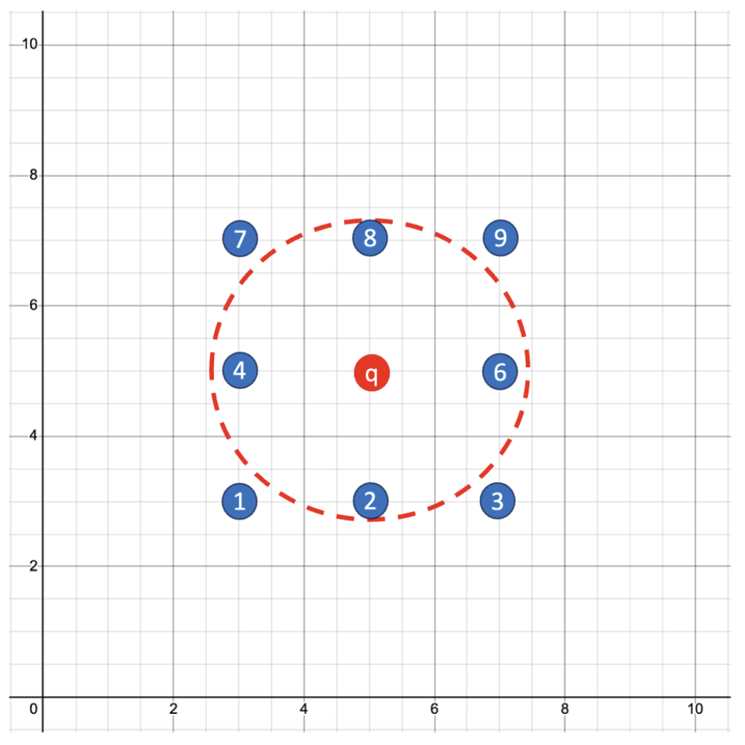

# Lab 3: Similarity Search

## Introduction

This lab walks you through the steps to perform a Similarity Search between multiple Vectors.

For Similarity Search, we tend NOT to care about the distance between two vectors. Instead we care about the *RESULT SET* (which is ordered by distance) between an input/query vector and the set of vectors in a vector column.
This means that the actual distances do not matter, rather the *RELATIVE ORDER OF DISTANCES* in the result set is what matters.

- The first row in the resultset will be the closest or most similar vector to the query vector.
- The second row in the resultset will be the second closest vector to the query vector.
- The third row in the resultset will be the third closest vector to the query vector.

Estimated Time: 15 minutes

### Objectives

In this lab, you will:
* Setup a table with Vectors to be used in the lab.  
* Look for closest Vectors to a given Vector.
* Look for closest Vectors based on Vectors clustered in groups.

### Prerequisites (Optional)

This lab assumes you have:
* All previous labs successfully completed


## Task 1: Setup a table with sample Vectors

Our first task will be to create a table to store Vectors that map to X and Y coordinates as illustated in Figure 1 below:

 
Figure 1.

1. Create a table to store the Vectors

    ```
      <copy>CREATE TABLE IF NOT EXISTS vt1
               (id   NUMBER NOT NULL,
                v    VECTOR(2, FLOAT32),
                     PRIMARY KEY (id)
               );

      DESC vt1;  </copy>
    ```

    You should see:

 


2. Insert the nine Vectors to the table vt1

    ```
      <copy>INSERT INTO vt1 VALUES (1, '[3, 3]'),  (2, '[5, 3]'),  (3, '[7, 3]'),
                             (4, '[3, 5]'),  (5, '[5, 5]'),  (6, '[7, 5]'),
                             (7, '[3, 7]'),  (8, '[5, 7]'),  (9, '[7, 7]');

      COMMIT;

      SELECT * FROM vt1
      ORDER BY id; </copy>
    ```

    You should see:

    

## Task 2: Look for closest Vectors to a given Vector

1. In our first example we will look for the three closest vectors to (5,0) indicated by the red "q" in Figure 2 below.

 
Figure 2.

   We do not care about the actual distance, instead we care about the IDs of the rows with the least (or closest) distance to (5,0) indicated by the red "q" in figure 2 above.

   ID 2 is the closest and IDs 1 and 3 are the same distance, so the answer is expected to be: 2, 1, 3  or  2, 3, 1.

    ```
      <copy>SELECT id
      FROM   vt1
      ORDER  BY  vector_distance(vector('[5, 0]'), v, EUCLIDEAN)
      FETCH FIRST 3 ROWS ONLY; </copy>
    ```

    You should see something similar to this: *(ID 2 should be first)*

 


2. Look for the three closest Vectors to (3,0) indicated by the red "q" in Figure 3 below.

 
 Figure 3.

   Once again we do not care about the actual distance, instead we care about the IDs of the Vectors with the least (or closest) distance to (3,0).

   This time ID 1 is the closest and ID 3 is the furthest away, so the answer is expected to be: 1, 2, 3.


    ```
       <copy>SELECT id
       FROM   vt1
       ORDER  BY  vector_distance(vector('[3, 0]'), v, EUCLIDEAN)
       FETCH FIRST 3 ROWS ONLY; </copy>
    ```

    You should see:

 

3. This time, let's look for the three closest Vectors to (7,0) indicated by the red "q" in Figure 3 below.

 
Figure 3.

   Once again we do not care about the actual distance, instead we care about the IDs of the Vectors with the least (or closest) distance to (7,0).

   This time ID 3 is the closest and ID 1 is the furthest away, so the answer is expected to be: 3, 2, 1.

    ```
      <copy>SELECT id
      FROM   vt1
      ORDER  BY  vector_distance(vector('[7, 0]'), v, EUCLIDEAN)
      FETCH FIRST 3 ROWS ONLY; </copy>
    ```

    You should see:

 

4. Look for the three closest Vectors to (10,7) indicated by the red "q" in Figure 4 below.

 
Figure 4.

   Once again we do not care about the actual distance, instead we care about the IDs of the Vectors with the least (or closest) distance to (10,7).

   This time ID 9 is the closest and ID 3 is the furthest away, so the answer is expected to be: 9, 6, 3.

    ```
       <copy>SELECT id
       FROM   vt1
       ORDER  BY  vector_distance(vector('[10, 7]'), v, EUCLIDEAN)
       FETCH FIRST 3 ROWS ONLY; </copy>
    ```

    You should see:

    

5. Look for the three closest Vectors to (3,9) indicated by the red "q" in Figure 5 below.

 
Figure 5.

   Once again we do not care about the actual distance, instead we care about the IDs of the Vectors with the least (or closest) distance to (3,9).

   This time ID 7 is the closest and ID 4 is the furthest away, so the answer is expected to be: 7, 8, 4.

    ```
       <copy>SELECT id
       FROM   vt1
       ORDER  BY  vector_distance(vector('[3, 9]'), v, EUCLIDEAN)
       FETCH FIRST 3 ROWS ONLY; </copy>
    ```

    You should see:

 


6. Look for the three closest Vectors to (0,0) indicated by the red "q" in Figure 6 below.

 
Figure 6.

   Once again we do not care about the actual distance, instead we care about the IDs of the Vectors with the least (or closest) distance to (0,0).

   This time ID 1 is the closest and IDs 2 and 4 are the same distance away, so the answer is expected to be either: 1, 4, 2  or 1, 2, 4.

    ```
       <copy>SELECT id
       FROM   vt1
       ORDER  BY  vector_distance(vector('[0, 0]'),  v, EUCLIDEAN)
       FETCH FIRST 3 ROWS ONLY; </copy>
    ```

    You should see: *(ID 1 should be first)*

 


7. Look for the five closest Vectors to (5, 5) indicated by the red "q" in Figure 7 below.

 
Figure 7.

   Once again we do not care about the actual distance, instead we care about the IDs of the five Vectors with the least (or closest) distance to (5, 5).

   This time ID 5 is the closest and IDs 2, 4, 6 and 8 are the same distance away, so the answer is expected to be: first a 5 followed by 2, 4, 6, 8 in any order.

    ```
       <copy>SELECT id
       FROM   vt1
       ORDER  BY  vector_distance(vector('[5, 5]'), v, EUCLIDEAN)
       FETCH FIRST 5 ROWS ONLY; </copy>
    ```

    You should see: *(ID 5 should be first)*

 


8. Look for the four closest Vectors to (3.1, 6.9) indicated by the red "q" in Figure 8 below.

 
 Figure 8.

   Once again we do not care about the actual distance, instead we care about the IDs of four the Vectors with the least (or closest) distance to (3.1, 6.9).

   This time ID 7 is the closest and IDs 5 is the furthest distance away, so the answer is expected to be: 7, 4, 8, 5 or 7, 8, 4, 5.

    ```
        <copy>SELECT id
        FROM   vt1
        ORDER  BY vector_distance(vector('[3.1, 6.9]'), v, EUCLIDEAN)
        FETCH FIRST 4 ROWS ONLY; </copy>
    ```

    You should see:

 

9. Rank all of the Vectors in order of proximity to (20, 1) indicated by the red "q" in Figure 9 below.

 
 Figure 9.

   Once again we do not care about the actual distance, instead we care about the proximity of all of the Vectors orderd by the least (or closest) distance to (20, 1).

   This time ID 3 is the closest and ID 7 is the furthest distance away, so the answer is expected to start with ID 3 and end with ID 7.

    ```
       <copy>SELECT id
       FROM   vt1
       ORDER  BY vector_distance(vector('[20, 1]'), v, EUCLIDEAN)
       FETCH FIRST 10 ROWS ONLY; </copy>
    ```

    You should see:

 


## Task 3: Look for closest Vectors based on Vectors clustered in groups.

So far, the *vector_distance* result set has been dependent on two things:
  1. Where the query Vector was, relative to the cluster, centered around a specific Vector or coordinate i.e. (5,5)
  2. How many rows were allowed in the result set.

However, vectorized data often consists of a set of clusters of vectors- and the data tends to not be uniformly distributed. There may also be zero or more clusters of data.
Hence, clusters of vectors tend to represent groups of similar data. For example: addresses, types of cars, people names, reports or book, etc.

This example has five clusters of Vectors. So we will add four more clusters of Vectors to the Table vt1 we created in Task 1. You will notice that one of the clusters of Vectors will contain negative values (or coordinates).

 
 Figure 10.

1. Add the four Clusters of Vectors to the table vt1

    ```
      <copy>INSERT INTO vt1 VALUES (21, '[9, -1]'),
                             (22, '[10, -1]'),
                             (23, '[11, -1]'),
                             (24, '[9, -3]'),
                             (25, '[10, -4]'),
                             (26, '[12, -3]') ;

      INSERT INTO vt1 VALUES (31, '[13, 6]'),
                             (32, '[14, 7]'),
                             (33, '[14, 4]'),
                             (34, '[16, 6]') ;

      INSERT INTO vt1 VALUES (41, '[0, 7]'),
                             (42, '[1, 7]'),
                             (43, '[1, 6]'),
                             (44, '[0, 5]'),
                             (45, '[1, 5]') ;

      INSERT INTO vt1 VALUES (51, '[5, 9]'),
                             (52, '[7, 9]'),
                             (53, '[6, 10]'),
                             (54, '[5, 11]'),
                             (55, '[7, 11]') ;

      COMMIT ;

      SELECT * FROM vt1; </copy>

    ```

    You should see:

 

 

2.  Look for the three closest Vectors to (16,4) indicated by the red "q" in Figure 11 below.

 
 Figure 11.

   We do not care about the actual distance, instead we care about the IDs of the Vectors with the least (or closest) distance to (16,4).

   We expect to see IDs in the 30's.


    ```
       <copy>SELECT id
       FROM   vt1
       ORDER  BY vector_distance(vector('[16, 4]'), v, EUCLIDEAN)
       FETCH FIRST 3 ROWS ONLY; </copy>
    ```

    You should see:

 


3.  Look for the five closest Vectors to (7,-5) indicated by the red "q" in Figure 12 below.

 
 Figure 12.

   We do not care about the actual distance, instead we care about the IDs of the Vectors with the least (or closest) distance to (7,-5).

   We expect to see IDs in the 20's.


    ```
       <copy>SELECT id
       FROM   vt1
       ORDER  BY vector_distance(vector('[7, -5]'), v, EUCLIDEAN)
       FETCH FIRST 5 ROWS ONLY; </copy>
    ```

    You should see:

 

4.  Look for the five closest Vectors to (6, 10) indicated by the red "q" in Figure 13 below.

 
Figure 13.

   We do not care about the actual distance, instead we care about the IDs of the Vectors with the least (or closest) distance to (6,10).

   We expect to see IDs in the 50's, starting wth ID 53.

    ```
       <copy>SELECT id
       FROM   vt1
       ORDER  BY vector_distance(vector('[6, 10]'), v, EUCLIDEAN)
       FETCH FIRST 5 ROWS ONLY; </copy>
    ```

    You should see:

 


5.  Look for the five closest Vectors to (-1, 6) indicated by red "q" in Figure 14 below.

 
 Figure 14.

   We do not care about the actual distance, instead we care about the IDs of the Vectors with the least (or closest) distance to (-1,6).

   We expect to see IDs in the 40's.

    ```
       <copy>SELECT id
       FROM   vt1
       ORDER  BY vector_distance(vector('[-1, 6]'), v, EUCLIDEAN)
       FETCH FIRST 5 ROWS ONLY; </copy>
    ```

    You should see:

 


6. Look for the four closest Vectors to (6, 8) indicated by the red "q" in Figure 15 below.

 
 Figure 15.

   We do not care about the actual distance, instead we care about the IDs of the Vectors with the least (or closest) distance to (6,8).

   We expect to see IDs: 8, 9, 51 and 52.


    ```
       <copy>SELECT id
       FROM   vt1
       ORDER  BY vector_distance(vector('[6, 8]'), v, EUCLIDEAN)
       FETCH FIRST 4 ROWS ONLY; </copy>
    ```

    You should see:

 

7. Look for the four closest Vectors to (2.5, 8.5) indicated by the red "q" in Figure 16 below.

 
 Figure 16.

   We do not care about the actual distance, instead we care about the IDs of the Vectors with the least (or closest) distance to (2.5,8.5).

   We expect to see IDs in the 10s, 40s and 50s.

    ```
       <copy>SELECT id
       FROM   vt1
       ORDER  BY vector_distance(vector('[2.5, 8.5]'), v, EUCLIDEAN)
       FETCH FIRST 4 ROWS ONLY; </copy>
    ```

    You should see:

 


## Summary

As we discussed earlier, Vector data tends not to be evenly distributed, and in many cases, Vector data tends to be clustered into groups.

Similarity searches will tend to get data from one or more clusters depending on the value of the query Vector and the fetch size.


## Learn More

* [Oracle Database 23ai Release Notes](https://docs.oracle.com/en/database/oracle/oracle-database/23/rnrdm/index.html)
* [Oracle AI Vector Search Users Guide](https://docs.oracle.com/en/database/oracle/oracle-database/23/vecse/index.html)
* [Oracle Documentation](http://docs.oracle.com)


## Acknowledgements
* **Authors** - Doug Hood, Consulting Member of Technical Staff
* **Contributors** - Sean Stacey
* **Last Updated By/Date** - Sean Stacey, November 2023
