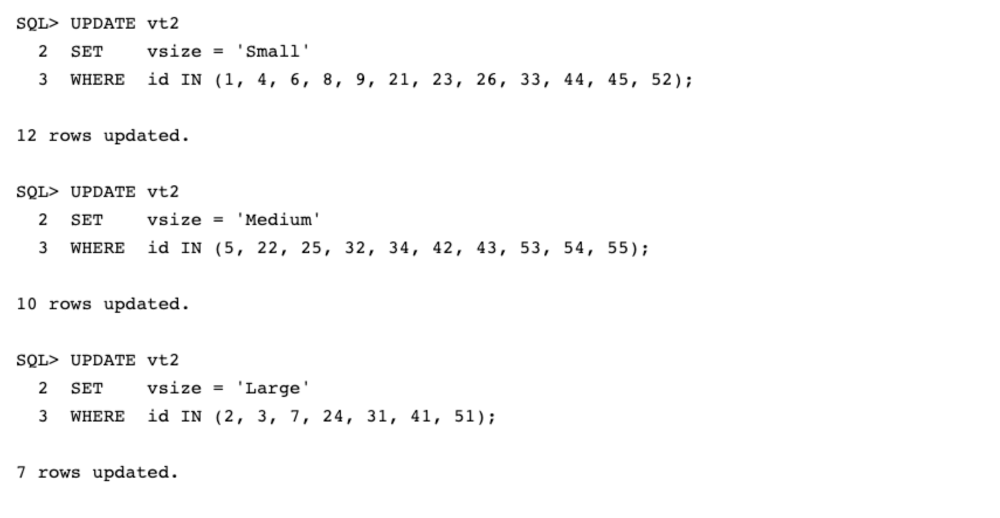
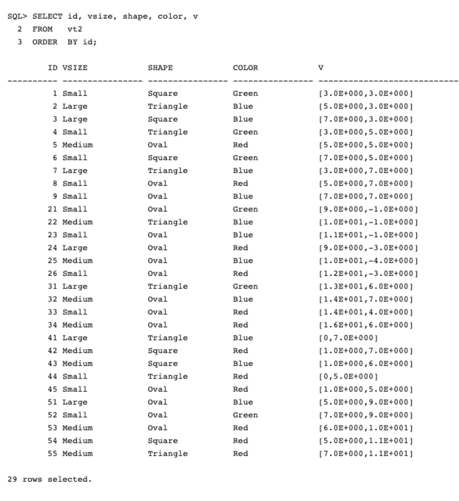

# Lab 4: Attribute Filtering

## Introduction

As we've already seen, the vector_distance() function orders results by distance. It is also possible to add additional predicates to the SQL WHERE clause to filter the results of a Similarity Search. Being able to add relational filters and table joins is a very powerful feature.

In this lab we see how Vector_Distance() can be used in combination with other SQL WHERE predicates.


------------
Estimated Time: 15 minutes


### Objectives


In this lab, you will:
* Task 1: Setup a table with Vectors to be used in this lab.  
* Task 2: Look for closest Vectors to a given Vector using relational filters.

This lab assumes you have:
* An Oracle account
* All previous labs successfully completed

*This is the "fold" - below items are collapsed by default*

## Task 1: Setup a table with sample Vectors

In this lab we will create a new table called VT2, however we will be building the VT2 table using the table created in the previous lab called VT1. The first step in this Lab is to create a table with Vectors to map different shapes, colors and sizes as illustrated in the following graphic *(figure 1)* below:


Figure 1.

1. Create a table to store the Vectors

    ```
      <copy>DROP TABLE IF EXISTS vt2 ;

      CREATE TABLE vt2 AS SELECT * FROM vt1;

      ALTER TABLE vt2 ADD (vsize varchar2(16),
                           shape varchar2(16),
                           color varchar2(16)
                          );

       DESC vt2;  </copy>
    ```

    You should see:

    


2. In this step we will set the sizes, shapes and colors in table that we will be using to query with Attribute Filtering.

  A. Setup the Vector Sizes:

    ```
       <copy>UPDATE vt2
       SET    vsize = 'Small'
       WHERE  id IN (1, 4, 6, 8, 9, 21, 23, 26, 33, 44, 45, 52);

       UPDATE vt2
       SET    vsize = 'Medium'
       WHERE  id IN (5, 22, 25, 32, 34, 42, 43, 53, 54, 55);

       UPDATE vt2
       SET    vsize = 'Large'
       WHERE  id IN (2, 3, 7, 24, 31, 41, 51); </copy>
    ```

   B. Setup the Vector Shapes:

    ```
       <copy>UPDATE vt2
       SET    shape = 'Square'
       WHERE  id IN (1, 3, 6, 42, 43, 54);

       UPDATE vt2
       SET    shape = 'Triangle'
       WHERE  id IN (2, 4, 7, 22, 31, 41, 44, 55);

       UPDATE vt2
       SET    shape = 'Oval'
       WHERE  id IN (5, 8, 9, 21, 23, 24, 25, 26, 32, 33, 34, 45, 51, 52, 53); </copy>

    ```

   C. Setup the Vector Colors:

    ```
       <copy>UPDATE vt2
       SET    color = 'Red'
       WHERE  id IN (5, 8, 24, 26, 33, 34, 42, 44, 45, 53, 54, 55);

       UPDATE vt2
       SET    color = 'Green'
       WHERE  id IN (1, 4, 6, 21, 31, 52);

       UPDATE vt2
       SET    color = 'Blue'
       WHERE id IN (2, 3, 7, 9, 22, 23, 25, 32, 41, 43, 51);

       COMMIT; </copy>
    ```

    You should see:

 
 
 

3. Confirm the updates have been correctly applied to table vt2.

    ```
       <copy>SELECT id, vsize, shape, color, v
       FROM   vt2
       ORDER  BY id; </copy>
    ```

    You should see:

 


4. Display a summarized breakdown of the different Shapes, Sizes and Colors for the table vt2.

    ```
       <copy>SELECT vsize, count(vsize)
       FROM   vt2
       GROUP  BY vsize;

       SELECT color, COUNT(color)
       FROM   vt2
       GROUP  BY color;

       SELECT shape, COUNT(shape)
       FROM   vt2
       GROUP  BY shape; </copy>
    ```


    You should see:

 

Once you have confirmed that the base table vt2 matches the graph in *Figure 1* you are ready to proceed to the next task below.  

## Task 2: Look for closest Vectors to a given Vector with Filtering

1. In our first example we will look for the three closest vectors to (16,3). We do not care about the actual distance, but instead we care about the IDs for the objects themselves. However in this query we are returning the distance so the results can be compared against the next query.


     The intent of this query is to retrieve the following Vectors from the graph *(figure 2)* below. You should also notice that the query will artificially return the IDs from a cluster.  :


 
    Figure 2.

    Enter the following Query:

    ```
       <copy>SELECT id, vsize, shape, color,
              to_number(vector_distance(vector('[16, 3]'), v)) distance
       FROM   vt2
       WHERE  id > 30 AND id < 40
       ORDER  BY vector_distance(vector('[16, 3]'), v)
       FETCH FIRST 3 ROWS ONLY; </copy>
    ```

    You should see:

 


2. In this example we will look for the three closest Vectors to (16,3). But this time we are only looking for Ovals. Once again, we do not care about the actual distance, but instead we care about the IDs for the objects themselves. However in this query we are returning the distance so the results can be compared against the previous query.

    The intent of this query is to retrieve the following Vectors from the graph *(figure 3)* below. You should also notice that the query will artificially return the IDs from a cluster. :

    
    Figure 3.

    Enter the following Query:

    ```
       <copy>SELECT id, vsize, shape, color,
              to_number(vector_distance(vector('[16, 3]'), v)) distance
       FROM   vt2
       WHERE  id > 30 AND id < 40
       AND    shape = 'Oval'
       ORDER  BY vector_distance(vector('[16, 3]'), v)
       FETCH FIRST 3 ROWS ONLY; </copy>
    ```


    You should see:

    


3. This time we are going to look for the ten closest Vectors to (6,8).


    Once again we do not care about the actual distance, instead we care about the IDs of the Vectors with the least (or closest) distance to (6,8).

    The intent of this query is to retrieve the following Vectors from the graph *(figure 3)* below:

 
Figure 3.

    Enter the following Query:

    ```
      <copy>SELECT id, vsize, shape, color
      FROM   vt2
      ORDER  BY vector_distance(vector('[6, 8]'), v)
      FETCH FIRST 10 ROWS ONLY; </copy>
    ```

    You should see:

 


4. Look for the ten closest Vectors to (6,8) filtered by Color.

    Once again we do not care about the actual distance, instead we care about the IDs of the Vectors with the least (or closest) distance to (6,8) that are Red.

    The intent of this query is to retrieve the following Vectors from the graph *(figure 4)* below:

    
    Figure 4.

    Enter the following Query:

    ```
      <copy>SELECT id, vsize, shape, color
      FROM   vt2
      WHERE  color = 'Red'
      ORDER  BY vector_distance(vector('[6, 8]'), v)
      FETCH FIRST 10 ROWS ONLY; </copy>
    ```

    You should see:

    

5. Look for the ten closest Vectors to (6,8) filtered by Color and Shape.

    Once again we do not care about the actual distance, instead we care about the IDs of the Vectors with the least (or closest) distance to (6,8) that are Red Ovals.

    You will also notice that the query only returns 8 Vectors as there are only 8 Red Ovals in the graph.

    The intent of this query is to retrieve the following Vectors from the graph *(figure 5)* below:

    
    Figure 5.

    Enter the following Query:

    ```
      <copy>SELECT id, vsize, shape, color
      FROM   vt2
      WHERE  color = 'Red'
      AND    shape = 'Oval'
      ORDER  BY vector_distance(vector('[6, 8]'), v)
      FETCH FIRST 10 ROWS ONLY; </copy>
    ```

    You should see:

    


6. Look for the ten closest Vectors to (6,8) filtered by Color, Shape and Size.

    Once again we do not care about the actual distance, instead we care about the IDs of the Vectors with the least (or closest) distance to (6,8) that are Small Red Ovals.

    You will also notice that this query only returns 4 Vectors as there are only 4 Small Red Ovals in the graph.

    The intent of this query is to retrieve the following Vectors from the graph *(figure 6)* below:

    
    Figure 6.

    Enter the following Query:

    ```
      <copy>SELECT id, vsize, shape, color
      FROM   vt2
      WHERE  color = 'Red'
      AND    shape = 'Oval'
      AND    vsize  = 'Small'
      ORDER  BY vector_distance(vector('[6, 8]'), v)
      FETCH FIRST 10 ROWS ONLY; </copy>
    ```

    You should see:

 

7. Look for the ten closest Vectors to (6,8) filtered by Color, Shape and Size as well as having an ID greater than 10.

    Once again we do not care about the actual distance, instead we care about the IDs of the Vectors with the least (or closest) distance to (6,8) that are Small Red Ovals with an ID higher than 10.

    You will also notice that this query only returns 3 Vectors as there are only 3 Small Red Ovals in the graph with ID higher than 10.

    The intent of this query is to retrieve the following Vectors from the graph *(figure 6)* below:

    
    Figure 7.

    Enter the following Query:

    ```
      <copy>SELECT id, vsize, shape, color
      FROM   vt2
      WHERE  color = 'Red'
      AND    shape = 'Oval'
      AND    vsize  = 'Small'
      AND    id    > 10
      ORDER  BY vector_distance(vector('[6, 8]'), v)
      FETCH FIRST 10 ROWS ONLY; </copy>
    ```

    You should see:

    


## Summary

As we discussed earlier, Vector data tends not to be evenly distributed, and in many cases, Vector data tends to be clustered into groups.

Similarity searches will tend to get data from one or more clusters depending on the value of the query Vector and the fetch size.

By using *SQL WHERE* clauses, you can further filter the results of a similarity search. Using SQL WHERE clauses is called *Attribute Filtering* in other (often non-relational) Vector databases.


## Learn More

* [Oracle Database 23ai Release Notes](https://docs.oracle.com/en/database/oracle/oracle-database/23/rnrdm/index.html)
* [Oracle AI Vector Search Users Guide](https://docs.oracle.com/en/database/oracle/oracle-database/23/vecse/index.html)
* [Oracle Documentation](http://docs.oracle.com)


## Acknowledgements
* **Author** - Doug Hood, Consulting Member of Technical Staff
* **Contributors** - Sean Stacey
* **Last Updated By/Date** - <Sean Stacey, November 2023>
