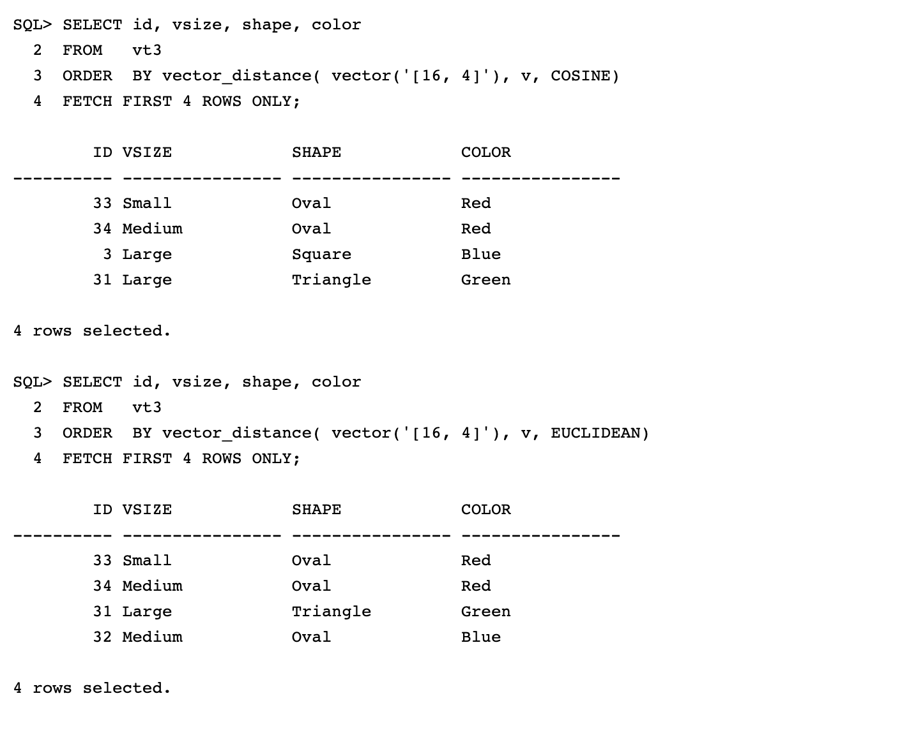

# Lab 5: Other Distance Functions

## Introduction

So far we have used the default distance function vector\_distance() which uses the **Euclidean Squared** Vector distance function.

With Oracle AI Vector Search you can also use other types of distance functions:
 - Cosine Similarity
 - Dot Product
 - Manhattan Distance
 - Hamming Distance

    *NOTE: Details and use cases for each of the other distance functions listed above can be found in Chapter 3 of the: [Oracle AI Vector Search Users Guide](../docs/oracle-ai-vector-search-users-guide_latest.pdf)*


The Vector embedding model will determine the number of dimensions and sometimes the distance function:
 - Cohere embed-english-v2.0       = 4096 Dimensions
 - Cohere embed-english-light-v2.0 = 1024 Dimensions
 - Cohere embed-multilingual-v2.0  =  768 Dimensions
 - OpenAI text-embedding-ada-002   = 1536 Dimensions and recommends Cosine Similarity for the distance function

By default, vector\_distance() uses Euclidean as the distance function, but it is also possible to explicitly choose the distance function to use in vector distance using the following approach:
 -   vector\_distance(v1, v2, EUCLIDEAN);
 -   vector\_distance(v1, v2, COSINE);
 -   vector\_distance(v1, v2, DOT);
 -   vector\_distance(v1, v2, MANHATTAN);
 -   vector\_distance(v1, v2, HAMMING);


------------
Estimated Time: 15 minutes

### Objectives

In this lab, you will:
* Task 1: Setup a Vector table: VT3 to be used in this lab.  
* Task 2: Look for closest Vectors to a given Vector using alternative distance functions.
* Task 3: Look for closest Vectors using alternative Vector distance functions.
* Task 4: Using shorthand syntax to look for closest Vectors.

### Prerequisites

This lab assumes you have:
* An Oracle account
* All previous labs successfully completed

*This is the "fold" - below items are collapsed by default*

## Task 1: Setup a table with sample Vectors

This lab will create a new table called VT3, however we will be building the VT3 table using the table created in the previous lab that we called VT2. The table will contain Vectors that map to different shapes, colors and sizes as illustrated in the following graphic *(figure 1)* below:


 
Figure 1.

1. Create a table to store the Vectors

    ```
      <copy>DROP TABLE IF EXISTS vt3 ;

      CREATE TABLE vt3 AS SELECT * FROM vt2;

      SELECT * FROM vt3 ORDER BY 1; </copy>
    ```

    You should see:

    

## Task 2: Look for closest Vectors to a given Vector using alternative distance functions.

1. Look for the 4 closest vectors to (16,4) using **Cosine Similarity** and **Euclidean Similarity** as the Vector distance function

    *Once again, we do not care about the actual distance, instead we care about the IDs of the rows with the least distance*

    Enter the following two Queries:

    **Cosine Similarity-**

    ```
      <copy>SELECT id, vsize, shape, color
      FROM   vt3
      ORDER  BY vector_distance( vector('[16, 4]'), v, COSINE)
      FETCH FIRST 4 ROWS ONLY; </copy>
    ```    

    **Euclidean Similarity-**

    ```
      <copy>SELECT id, vsize, shape, color
      FROM   vt3
      ORDER  BY vector_distance( vector('[16, 4]'), v, EUCLIDEAN)
      FETCH FIRST 4 ROWS ONLY; </copy>
    ```

    You should see:

    


2. Look for the 4 closest Vectors to (16,4) using **Dot Product** as the vector distance function.

    *Once again, we do not care about the actual distance, instead we care about the IDs of the rows with the least distance*

    Enter the following Query:

    ```
      <copy>SELECT id, vsize, shape, color
      FROM   vt3
      ORDER  BY vector_distance(vector('[16, 4]'), v, DOT)
      FETCH FIRST 4 ROWS ONLY; </copy>
    ```

    You should see:

 

3. Look for the 4 closest vectors to (16,4) using **Manhattan** as the vector distance function.

    *Once again, we do not care about the actual distance, instead we care about the IDs of the rows with the least distance*

    Enter the following Query:

    ```
      <copy>SELECT id, vsize, shape, color
      FROM   vt3
      ORDER  BY vector_distance(vector('[16, 4]'), v, MANHATTAN)
      FETCH FIRST 4 ROWS ONLY; </copy>
    ```

    You should see:

    


4. Look for the 4 closest vectors to (16,4) using **Hamming** as the vector distance function.

    *Once again, we do not care about the actual distance, instead we care about the IDs of the rows with the least distance. Also note that the results of the Search are different to what we've seen using the other previous functions.*

    Enter the following Query:

    ```
      <copy>SELECT id, vsize, shape, color
      FROM   vt3
      ORDER  BY vector_distance( vector('[16, 4]'), v, HAMMING)
      FETCH FIRST 4 ROWS ONLY; </copy>
    ```

    You should see:

 

---------------------------------------------------------------------

## Task 3: Look for closest Vectors using alternative Vector distance functions

When using Euclidean as the distance function there are four ways to perform this: Euclidean, Euclidean Squared, L2_Distance and Shorthand.

Other variations of distance functions include:
 - L1\_DISTANCE(v1, v2) = MANHATTAN distance
 - L2\_DISTANCE(v1, v2) = EUCLIDEAN distance
 - COSINE\_DISTANCE(v1, v2) = COSINE similarity
 - INNER\_PRODUCT(v1, v2) = DOT product


1. Look for the 4 closest vectors to (16,4) using L1\_DISTANCE as the vector distance function.

    *Once again, we do not care about the actual distance, instead we care about the IDs of the rows with the least distance*

    Enter the following Query:

    ```
      <copy>SELECT id, vsize, shape, color
      FROM   vt3
      ORDER  BY L1_DISTANCE(vector('[16, 4]'), v)
      FETCH FIRST 4 ROWS ONLY; </copy>
    ```

    You should see:

  


2. Look for the 4 closest vectors to (16,4) using **L2\_DISTANCE** as the vector distance function.

   *Once again, we do not care about the actual distance, instead we care about the IDs of the rows with the least distance*

   Enter the following Query:

    ```
      <copy>SELECT id, vsize, shape, color
      FROM   vt3
      ORDER  BY L2_DISTANCE(vector('[16, 4]'), v)
      FETCH FIRST 4 ROWS ONLY; </copy>
    ```

    You should see:

 


3.  Look for the 4 closest vectors to (16,4) using **COSINE\_DISTANCE** as the vector distance function.


    Enter the following Query:

    ```
      <copy>SELECT id, vsize, shape, color
      FROM   vt3
      ORDER  BY COSINE_DISTANCE( vector('[16, 4]'), v)
      FETCH FIRST 4 ROWS ONLY; </copy>
    ```

    You should see:

 


4. Look for the 4 closest vectors to (16,4) using **INNER\_PRODUCT** as the vector distance function.

    Enter the following Query:

    ```
      <copy>SELECT id, vsize, shape, color
      FROM   vt3
      ORDER  BY INNER_PRODUCT(vector('[16, 4]'), v)
      FETCH FIRST 4 ROWS ONLY; </copy>
    ```

    You should see:

 


## Task 4: Using shorthand syntax to look for closest Vectors.

It is also possible to use shorthand syntax to call a specific Vector distance function. The shorthand syntax includes the following functions:

 - v1 <-> v2 = Euclidean distance
 - v1 <=> v2 = Cosine similarity
 - v1 <#> v2 = Negative dot product

1. Look for the 4 closest Vectors to (16,4) using **<->** as the vector distance function.

   <-> is equivalent to the EUCLIDEAN distance function

    Enter the following Query:

    ```
      <copy>SELECT id, vsize, shape, color
      FROM   vt3
      ORDER  BY vector('[16, 4]') <-> v
      FETCH FIRST 4 ROWS ONLY; </copy>
    ```

    You should see:

 


2. Look for the 4 closest vectors to (16,4) using **<=>** as the vector distance function.

   <=> is equivalent to the vector cosine similarity distance function

    Enter the following Query:

    ```
      <copy>SELECT id, vsize, shape, color
      FROM   vt3
      ORDER  BY vector('[16, 4]') <=> v
      FETCH FIRST 4 ROWS ONLY; </copy>
    ```

    You should see:

 


3. Look for the 4 closest vectors to (16,4) using **<#>** as the vector distance function.

   <#> is equivalent to the vector *Negative Dot Product* distance function

   Enter the following Query:

    ```
      <copy>SELECT id, vsize, shape, color
      FROM   vt3
      ORDER  BY vector('[16, 4]') <#> v
      FETCH FIRST 4 ROWS ONLY; </copy>
    ```

    You should see:

 


## Summary

In this lab you have seen how it is possible to choose the distance function used to locate the nearest Vector. If the embedding model has a preference for a distance function then you should use that distance function.

You have also seen how it is possible to call the Vector distance function using a synonym or even shorthand syntax.

In addition to supporting different Vector Distance functions: Cosine Similarity, Dot Product, Euclidean, Manhattan Distance and Hamming Distance; Oracle gives you four approaches to search for the nearest Vector distance when using Euclidean as the distance function: Euclidean, Euclidean Squared, L2\_Distance and Shorthand.

The vector\_distance(v1, v2, distance\_function) is the most general purpose syntax for Vector distances.

There is no right or wrong syntax for vector distances. There is also no difference in performance between the different vector distance syntaxes. You should use the syntax that you are most comfortable with.


## Learn More

* [Oracle Database 23ai Release Notes](../docs/release_notes.pdf)
* [Oracle AI Vector Search Users Guide](../docs/oracle-ai-vector-search-users-guide_latest.pdf)
* [Oracle Documentation](http://docs.oracle.com)

## Acknowledgements
* **Author** - Doug Hood, Consulting Member of Technical Staff
* **Contributors** - Sean Stacey
* **Last Updated By/Date** - Sean Stacey, November 2023
