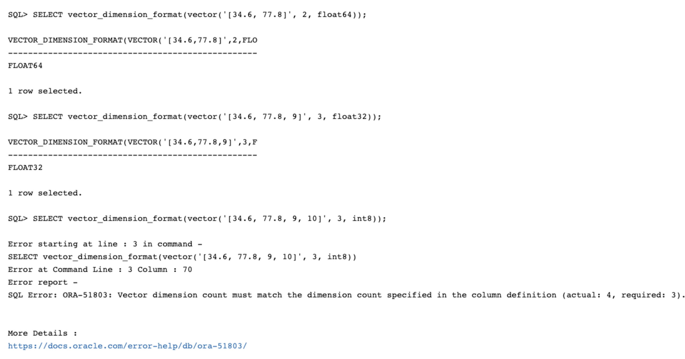
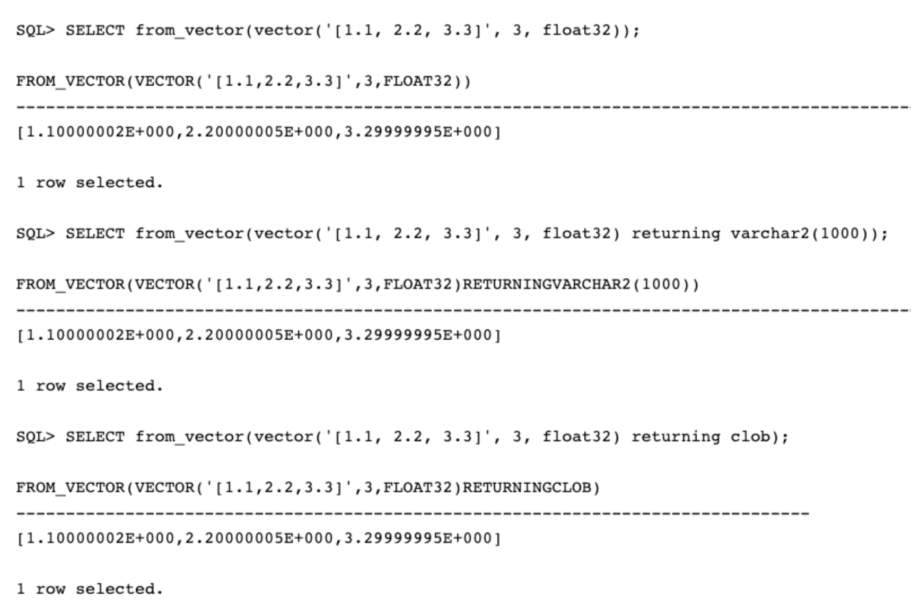

# Lab 6: Other Vector Functions

## Introduction

So far we have focused on the vector\_distance() functions, as well as seeing the outputs through the lens of a SQL display. There are also other SQL Vector functions available for managing Vectors and their presentation.

In this lab we will explore additional functions that provide information about the Vectors themselves. We will also see how to render the output of a Vector for the purpose of binding to meet application-specific requirements.

Estimated Time: 15 minutes

### Objectives

In this lab, you will see the following Vector operations:
* Functions for operating on Vectors
* Vector conversion and binding operations

### Prerequisites (Optional)

This lab assumes you have:
* All previous labs successfully completed


## Task 1: Functions for operating on Vectors

1. Converting a Vector from a string.

    The **to\_vector()** function creates a Vector from a string. It is equivalent to the vector() constructor. In this example we see two examples of converting a string to a Vector. The first example parses an array with two dimensions and the second with 3 dimensions.


    ```
      <copy>SELECT to_vector('[34.6, 77.8]', 2, float32) FROM dual;

      SELECT to_vector('[34.6, 77.8, -89.34]', 3, float32); </copy>
    ```

    You should see:

 

2. Return the Norm value of a Vector

 - It is the distance from the origin to the vector


    ```
      <copy>SELECT vector_norm(vector('[4, 3]', 2, float32) );

      SELECT vector_norm(vector('[4, 3]', 2, float64) );

      SELECT vector_norm(vector('[4, 3]', 2, int8) ); </copy>
    ```

    You should see:

 

3. Determine the number of dimensions in a Vector.

 - *vector\_dimension\_count()* returns the number of dimensions in a vector.

    ```
      <copy>SELECT vector_dimension_count(vector('[34.6, 77.8]', 2, float64));

      SELECT vector_dimension_count(vector('[34.6, 77.8, 9]', 3, float32));

      SELECT vector_dimension_count(vector('[34.6, 77.8, 9, 10]', 3, int8)); </copy>
    ```

    *NOTE: In this example the third select statement is expected to return an error as there are 4 dimensions in the vector but the calling function specifies that there are only three.*

    You should see:

 


4. Determine the format of the Vector numbers

 - *vector\_dimension\_format()* returns the format of the vector numbers

    ```
      <copy>SELECT vector_dimension_format(vector('[34.6, 77.8]', 2, float64));

      SELECT vector_dimension_format(vector('[34.6, 77.8, 9]', 3, float32));

      SELECT vector_dimension_format(vector('[34.6, 77.8, 9, 10]', 3, int8)); </copy>
    ```

    *NOTE: In this example the third select statement is expected to return an error as there are 4 dimensions in the vector but the calling function specifies that there are only three.*

    You should see:

 


## Task 2: Converting a Vector to a String or CLOB.

Currently the python-oracledb and node-oracledb SQL drivers enable native binding of vectors for both input and output. Other SQL Drivers like JDBC and ODP.NET SQL only allow binding vectors as strings or Clobs.  When Oracle AI Vector Search is generally available in Oracle 23.4, all Oracle SQL drivers should support native vector bindings.

Older SQL drivers [21c and before] require you to explicitly cast vector inputs by using the vector() or to\_vector() functions, and to cast the vector output as strings or clobs via from\_vector() or vector\_serialize().

*Note: If you run this lab in SQL\*Plus, sqlcl or SQL Developer you will not see a visible difference in the output, but you can be confident that the Vector conversion has been performed.*


1. Convert a Vector to a string or CLOB using *vector\_serialize()*.

    ```
      <copy>SELECT vector_serialize(vector('[1.1, 2.2, 3.3]', 3, float32));

      SELECT vector_serialize(vector('[1.1, 2.2, 3.3]', 3, float32)
             returning varchar2(1000));

      SELECT vector_serialize(vector('[1.1, 2.2, 3.3]', 3, float32)
             returning clob); </copy>

    ```

    You should see:

 

2. Convert a Vector to a string or CLOB using *from\_vector()*.
 - from\_vector() converts a vector into a string or a clob
 - It is equivalent to the vector\_serialize() function

    ```
      <copy>SELECT from_vector(vector('[1.1, 2.2, 3.3]', 3, float32));

      SELECT from_vector(vector('[1.1, 2.2, 3.3]', 3, float32) returning varchar2(1000));

      SELECT from_vector(vector('[1.1, 2.2, 3.3]', 3, float32) returning clob); </copy>
    ```

    You should see:

 


## Summary

In this Lab we have seen some of the methods for managing Vectors within the Oracle Database. We have also seen how it is possible to convert a Vectors for consumption by a wide variety of applications.

## Learn More

* [Oracle Database 23ai Release Notes](../docs/release_notes.pdf)
* [Oracle AI Vector Search Users Guide](../docs/oracle-ai-vector-search-users-guide_latest.pdf)
* [Oracle Documentation](http://docs.oracle.com)

## Acknowledgements
* **Author** - Doug Hood, Consulting Member of Technical Staff
* **Contributors** -  Sean Stacey
* **Last Updated By/Date** - Sean Stacey, November 2023
