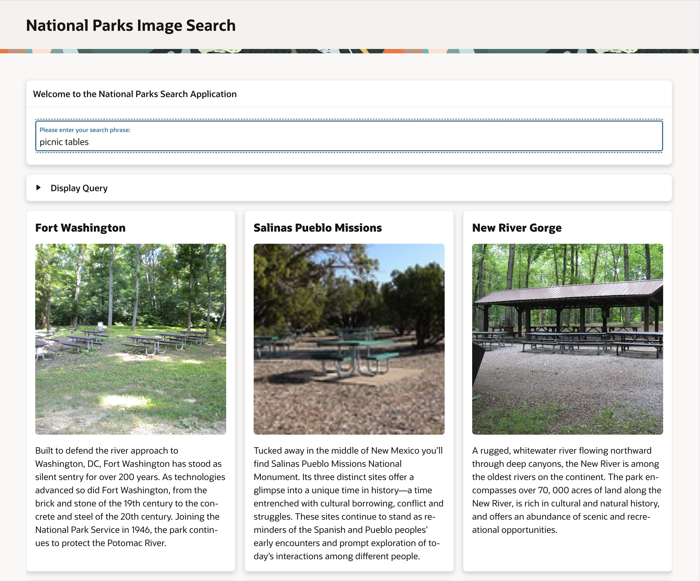
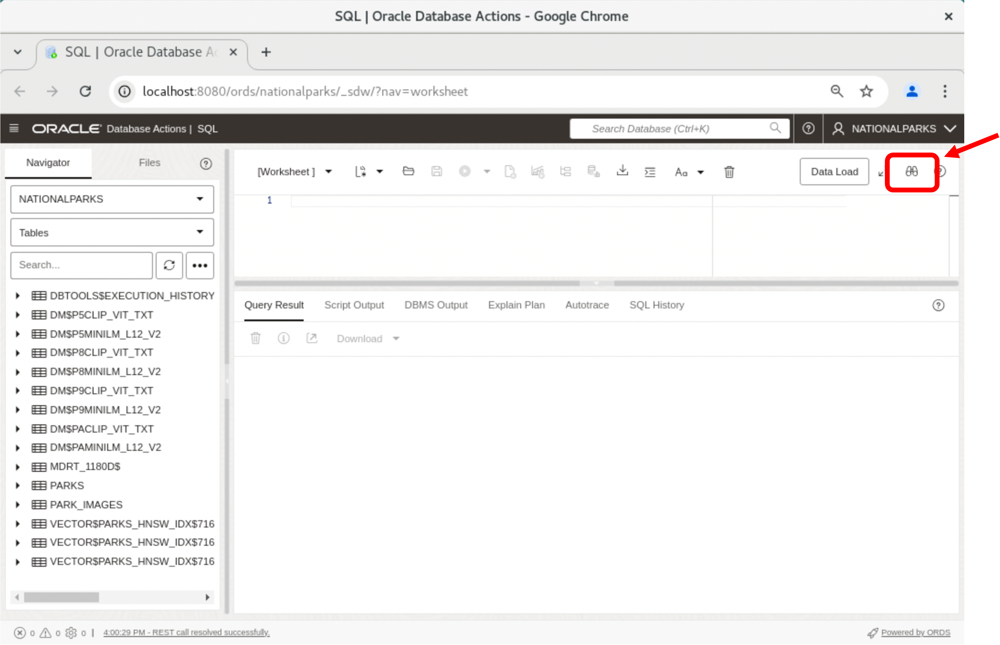

# Introduction

## Introduction

This lab will introduce you to the Oracle AI Vector Search Workshop.

Estimated Lab Time: 5 minutes

### About This Workshop

The **Oracle AI Vector Search Fundamentals** workshop will show you how you can combine the ability to perform similarity search on unstructured data like text and images with relational data to enable a whole new class of applications.

Oracle AI Vector Search is a sophisticated suite of capabilities, empowering developers to seamlessly store, index, and search vector data within Oracle Database. Vector data, represented as arrays of numbers, plays a pivotal role in capturing diverse features within unstructured data, including images, text, audio and video.

Key components of AI Vector Search include:

*Vector Data Type*: A data type designed to store vector data directly within Oracle Database, facilitating seamless integration.

*Similarity Search*: The ability to search for semantic similarity on structured or unstructured data.

*Vector Indexes*: Specialized indexing optimized for rapid and efficient retrieval of similar vectors, enhancing the database's search efficiency.

*Vector Search SQL Operators*: These SQL operators are tailored for conducting intricate similarity searches on vector data, providing developers with powerful tools to explore and analyze complex datasets.

Why use AI Vector Search?

At the heart of AI Vector Search is the ability to do a similarity search. A similarity search works with the semantic representations of your data rather than the value (words or pixels) and finds similar objects quickly. For example, find other images or documents that look like this one.  It uses vectors, or more precisely vector embeddings, to search for semantically similar objects based on their proximity to each other. In other words, vector embeddings are a way of representing almost any kind of data, like text, images, videos, and even music, as points in a multidimensional space where the locations of those points and proximity to other data are semantically meaningful.

Another big benefit of AI Vector Search is that similarity search can be combined with relational search on business data in one single system. This is not only powerful but also significantly more effective because AI Vector Search allows you to generate, store, index, and query vector embeddings along with other business data, using the full power of SQL. This means you don't need to add a specialized vector database, eliminating the pain of data fragmentation between multiple systems.

In this lab we will build the AI Vector Search features that will enable you to use AI Vector Search to search on text and image data to find attributes of US National Parks based on your interests. For example, you may want to search for parks where you can have a family picnic, go rock climbing, or see other spectacular sights. Below you can see a search on "picnic tables" that you will be able to run using the APEX-based demo in the last lab. The labs in this workshop will build the SQL and show you the features of AI Vector Search that enable this APEX-based demo.

### Objectives

In this workshop, you will learn how to:
* Load a vector embedding model into Oracle database.
* Learn about vectors and the new vector data type.
* Create vector embeddings from the embedding model you loaded.
* Learn what similarity search is.
* Perform an exact similarity search using basic SQL query operations.
* Create a vector index.
* Perform an approximate similarity search.
* Use similarity search with traditional relational searches.
* Run an APEX demo using the previously created data and queries.

### Prerequisites

This lab assumes you have:
* An Oracle Account (oracle.com account)

*This is the "fold" - below items are collapsed by default*

## Dataset

This workshop will use a public dataset from the [US National Parks] (https://www.nps.gov/subjects/science/science-data.htm) web site. There are two tables, a PARKS table that describes the different National Parks, and a PARK_IMAGES table that has one or more images for each of the parks. 

## Tools

The examples in the Lab were run using the Google Chrome browser. If you use a different browser some attributes may be slightly different. For example, cut and paste may behave differently, and opening new windows based on a URL may have slightly different instructions.

In this Lab you will use the SQL Developer Web tool to access the database and run queries. The URL to invoke SQL Developer Web is listed in the "View Login Info" details. If you are not familiar with SQL Developer Web you can run through a short tutorial by clicking on the binoculars in the circled image below once you start SQL Developer Web in each of the following labs.

In the last lab you will use APEX to run an application demonstration of just how powerful AI Vector Search can be. The URL to invoke the APEX demo is also listed in the "View Login Info" details.

Each lab starts out with a "Connecting to your Oracle AI Vector Database" section which explains how to find and invoke the URL in detail.

You may now **proceed to the next lab**

## Learn More

* [Oracle AI Vector Search Users Guide](https://docs.oracle.com/en/database/oracle/oracle-database/23/vecse/index.html)
* [OML4Py: Leveraging ONNX and Hugging Face for AI Vector Search](https://blogs.oracle.com/machinelearning/post/oml4py-leveraging-onnx-and-hugging-face-for-advanced-ai-vector-search)
* [Oracle Database 23ai Release Notes](https://docs.oracle.com/en/database/oracle/oracle-database/23/rnrdm/index.html)
* [Oracle Documentation](http://docs.oracle.com)

## Acknowledgements
* **Author** - Andy Rivenes, Product Manager
* **Contributors** - Sean Stacey, Markus Kissling, Product Managers
* **Last Updated By/Date** - Andy Rivenes, April 2025
