# Vector Embeddings

## Introduction

This lab walks you through the steps to load a vector embedding model into the database and display it's characteristics.

Estimated Lab Time: 10 minutes

### About Vector Embedding

To enable similarity search, we will need to create vector embeddings for the column(s) we would like to search on, which, in this first lab will be the DESCRIPTION column in the PARKS table. Vector embeddings are stored in a column of data type VECTOR. A vector embedding is a mathematical vector representation of data points or, more simply, an array of numbers. This vector representation translates semantic similarity into proximity in a mathematical vector space. You will get to see what these numbers look like, but ultimately it is the comparison of distance between any two vectors that enables similarity search.

Vector embeddings are generated using Machine Learning models. How do you decide which embedding model to use? After all, there are open-source embedding models and proprietary embedding models that you might have to pay for, or you could create and train your own embedding models. To add to the confusion, each embedding model has been trained on specific data. The type of embedding model you use will depend on the type of data that you plan to embed and how well that model performs for the searches you or your application need to perform.

Once you decide on one or more embedding models to try, you can choose to create vector embeddings outside the database or inside the database by importing the models directly into Oracle Database if they are compatible with the Open Neural Network Exchange (ONNX) standard. Since Oracle Database implements an ONNX runtime directly within the database, these imported models can be used to generate vector embeddings in Oracle Database.

In this Lab we are going to be searching on a text column, and we will use the all-MiniLM-L12-v2 model. This model is part of the sentence-transformers library. This model takes sentences or paragraphs and converts them into 384-dimensional vectors. Each of these 384 dimensions captures a specific aspect of the sentence's meaning or characteristics. We will be using a pre-built version of this model, which just means that it has already been converted into an ONNX format and is ready to be loaded into the database. You can find the details about how this was done in this blog post: https://blogs.oracle.com/machinelearning/post/use-our-prebuilt-onnx-model-now-available-for-embedding-generation-in-oracle-database-23ai.


### Objectives

In this lab, you will:
* Load an embedding model
* Describe and display a vector
* Create a vector column and describe the attributes
* Create vector embeddings on the PARKS table DESCRIPTION column

### Prerequisites

This lab assumes you have:
* An Oracle Cloud account
* All previous labs successfully completed


*This is the "fold" - below items are collapsed by default*

## Connecting to your Vector Database

The lab environment includes a preinstalled Oracle 23ai Database which includes AI Vector Search. We will be running the lab exercises from a pluggable database called: *orclpdb1* and connecting to the database as the user: *nationalparks*. The Lab will be run using SQL Developer Web.

To connect with SQL Developer Web to run the SQL commands in this lab you will first need to start a browser using the following URL. You will then be prompted to sign in:

```
<copy>google-chrome http://localhost:8080/ords/nationalparks/_sdw/?nav=worksheet</copy>
```

After signing in you should see a browser window like the following:


## Task 1: Load an embedding model into the database

This task will involved identifying and loading an ONNX model into the database. The pre-built all\_MiniLM\_L12\_v2 will be used as described in the About section above.

1. Let's verify that the all\_MiniLM\_L12\_v2 embedding model is not currently loaded:
    ```
    <copy>
    select MODEL_NAME, MINING_FUNCTION, ALGORITHM, ALGORITHM_TYPE, MODEL_SIZE 
    from user_mining_models;
    </copy>
    ```

    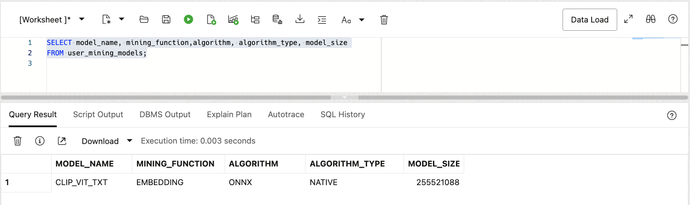

2. Next we will load the all\_MiniLM\_L12\_v2 embedding model into the database. The file is in the DM\_DUMP directory. You can display this directory with the following SQL:

    ```
    <copy>
    select * from all_directories where directory_name = 'DM_DUMP';
    </copy>
    ```

    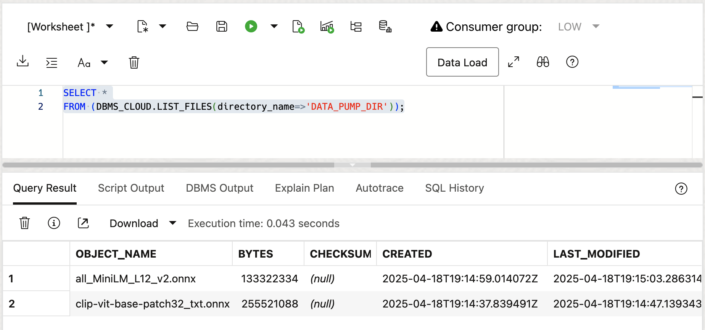

    The all\_MiniLM\_L12\_v2.onnx file resides in this operating system directory.

3. Load the all\_MiniLM\_L12\_v2 embedding model into the database:

    ```
    <copy>
    begin
       dbms_vector.load_onnx_model('DM_DUMP','all_MiniLM_L12_v2.onnx','minilm_l12_v2',
         JSON('{"function" : "embedding", "embeddingOutput" : "embedding", "input": {"input": ["DATA"]}}'));
    end;
    </copy>
    ```

    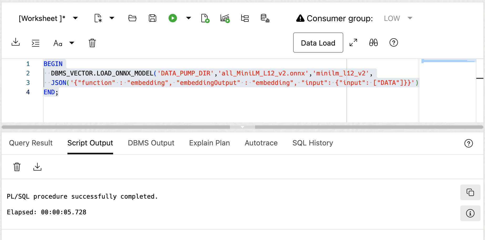

   Using the DBMS\_VECTOR.LOAD\_ONNX\_MODEL procedure the database read the all\_MiniLM\_L12\_v2.onnx file in the DM\_DUMP directory and loaded it into the database.

4. Display the newly loaded model:

    ```
    <copy>
    select MODEL_NAME, MINING_FUNCTION, ALGORITHM, ALGORITHM_TYPE, MODEL_SIZE 
    from user_mining_models;
    </copy>
    ```

    

   You may notice that the 'MINING FUNCTION' column has the attribute of EMBEDDING since this particular machine learning model is an embedding model.
  
5. Display the model details:

    ```
    <copy>
    select model_name, attribute_name, attribute_type, data_type, vector_info 
    from user_mining_model_attributes order by 1,3;
    </copy>
    ```

    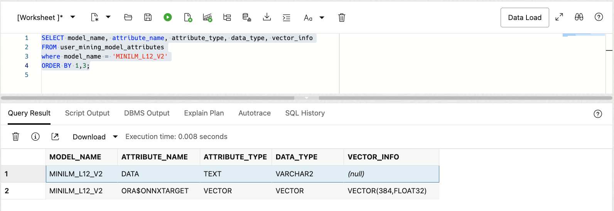

    You may notice that the VECTOR\_INFO column displays 'VECTOR(384,FLOAT32)' which matches our description in the About section where we stated that the all\_MiniLM\_L12\_v2 model has 384-dimensional vectors and a dimension format of FLOAT32.


## Task 2: Describe and display a vector

AI Vector Search adds a new VECTOR data type to Oracle Database. You can add one or more VECTOR data type columns to your application's table(s) to store vector embeddings. A vector embedding is a mathematical  representation of data points or, more simply, an array of numbers. Vector embeddings are generated using Machine Learning models to represent the distance between data. We will create vector embeddings in the next lab using the VECTOR data type we add in this lab.

The VECTOR data type is created as a column in a table. You can optionally specify the number of dimensions and their format. If you don't specify any dimension or format, you can enter vectors of different dimensions with different formats, although not at the same time. This is a simplification to help you get started with using vectors in Oracle Database and avoids having to recreate the vector definition if you later decide to change the vector embedding model and it uses a different number of dimensions and/or format.

The number of dimensions must be strictly greater than zero, with a maximum of 65535 for non-BINARY vectors and 65528 for BINARY vectors.

The possible dimension formats are:
*	INT8 (8-bit integers) 
*	FLOAT32 (32-bit IEEE floating-point numbers) 
*	FLOAT64 (64-bit IEEE floating-point numbers) 
*	BINARY (packed UINT8 bytes where each dimension is a single bit) 

Now that we have loaded an embedding model let's take a look at what a vector looks like.

1. In the SQL Developer Web window copy the following example of creating a vector embedding for the word 'hello'.

    ```
    <copy>
    SELECT VECTOR_EMBEDDING(minilm_l12_v2 USING 'hello' as data);
    </copy>
    ```

    See the image below:

    

    If you would like to look at the entire vector you can click on the "eye" icon next to the end of the vector display:

    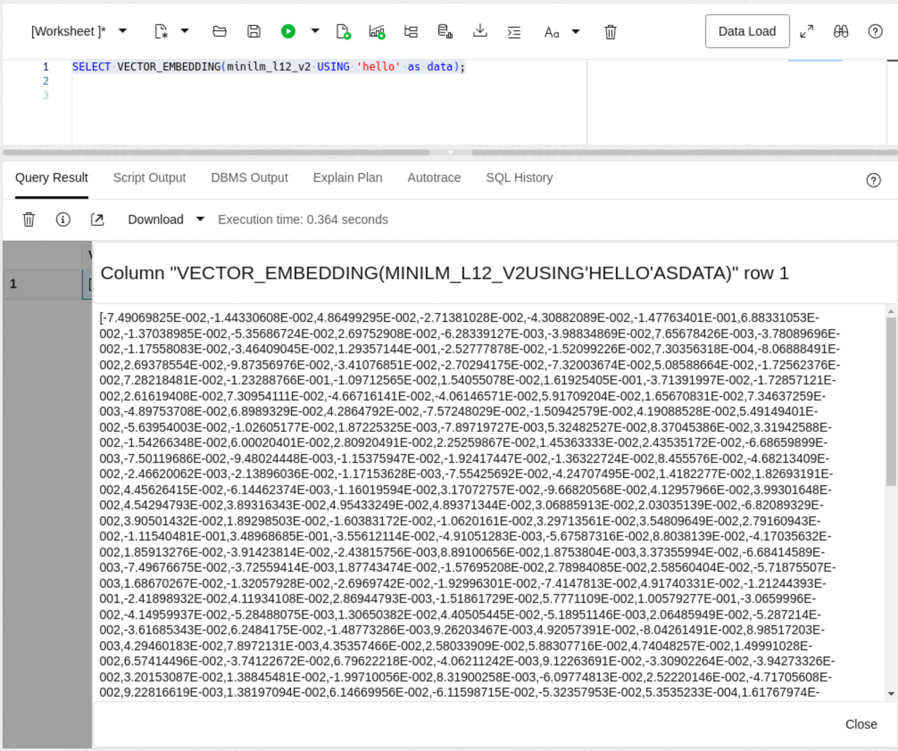

2. Now let's create a vector for the DESCRIPTION column in the PARKS table. We will just create the vector for one row in the table, but in the next section we will create vectors for the entire table based on the DESCRIPTION column.

    ```
    <copy>
    SELECT description, VECTOR_EMBEDDING(minilm_l12_v2 USING description as data)
    from parks fetch first 1 rows only;
    </copy>
    ```

    See the image below:

    

    Again, if you would like to look at the entire vector you can click on the "eye" icon next to the end of the vector display.


## Task 3: Create a vector column and describe the attributes

Now we are ready to take a look at the PARKS table. We will be using the DESCRIPTION column which is a text string describing the particular park's attributes. We will create a vector embedding for this column.

1. In the SQL Developer Web window you can you can expand the PARKS table by clicking on the arrow just to the left of the PARKS table. The table's columns will display underneath. You can display all of the table attributes by right clicking on the table name and choosing Open.

    See the image below:

    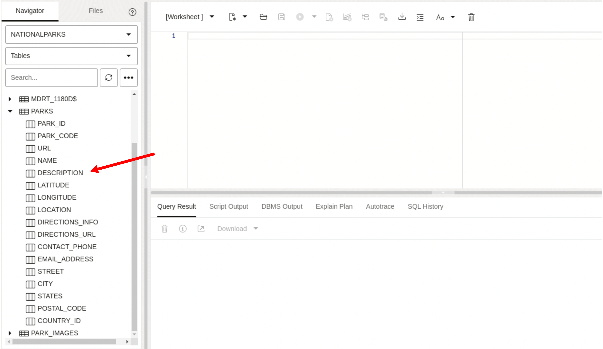

2. Next will add a new column to the table of type VECTOR. We will call the column DESC\_VECTOR.

    ```
    <copy>
    alter table PARKS add (desc_vector vector);
    </copy>
    ```

    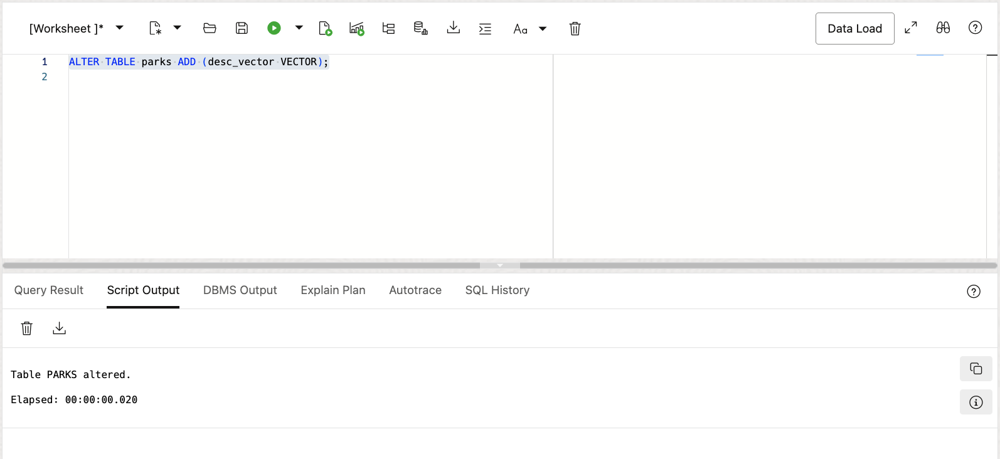

3. Refresh the screen to see the newly added column:

    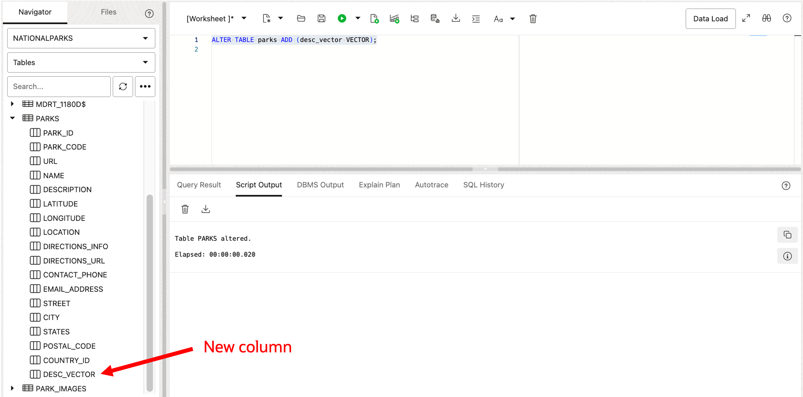

4. Now let's describe the column and take a look at the VECTOR column definitions:

    ```
    <copy>
    desc PARKS
    </copy>
    ```

    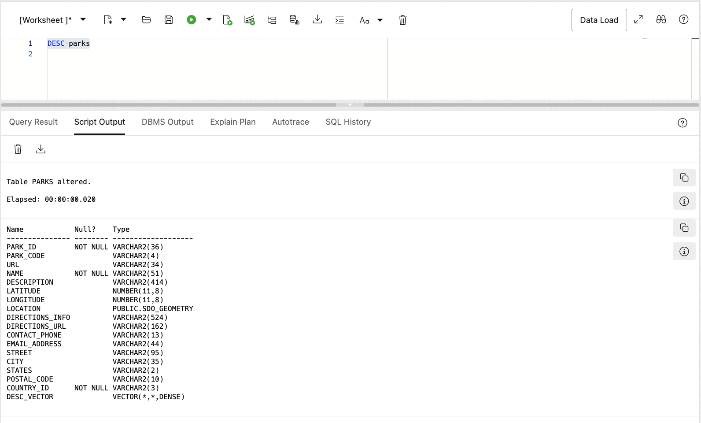

    Notice that the column definition is VECTOR(\*,\*,DENSE). Since we didn't specify any dimension or format it has been set to a '*'. This means that we could change the vector dimension and/or format and not have to redefine the column. This can be less disruptive than having to change the column definition.

## Task 4: Create vector embeddings

In this next task we will create vector embeddings on the DESCRIPTION column for all of the rows in the PARKS table.

1. Create vector embeddings for the DESCRIPTION column in the PARKS table:

    ```
    <copy>
    update parks
    set desc_vector = vector_embedding(minilm_l12_v2 using DESCRIPTION as data);
    commit;
    </copy>
    ```

    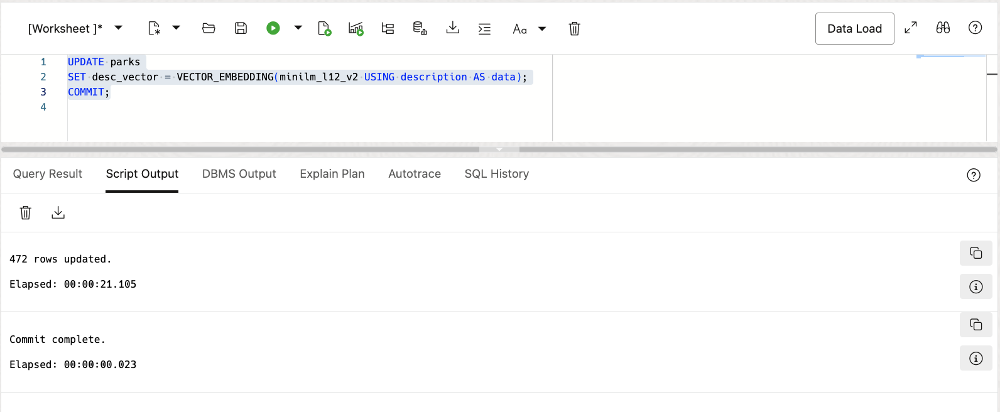

    There are other methods of creating vector embeddings, but for the small number of rows in our PARKS table this was probably the simplest method and only took a short amount of time.


2. Verify that embeddings were created:

    Since the vectors are quite large we will just display a small number of rows to verify our work:

    ```
    <copy>
    SELECT description, VECTOR_EMBEDDING(minilm_l12_v2 USING description as data) as vector
    from parks fetch first 15 rows only;
    </copy>
    ```

    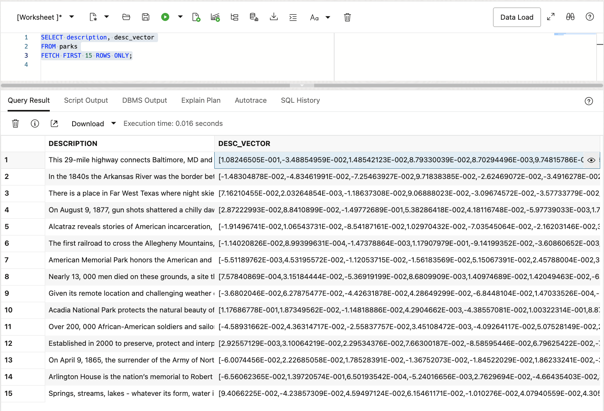


## Learn More

* [Oracle AI Vector Search Users Guide](https://docs.oracle.com/en/database/oracle/oracle-database/23/vecse/index.html)
* [OML4Py: Leveraging ONNX and Hugging Face for AI Vector Search](https://blogs.oracle.com/machinelearning/post/oml4py-leveraging-onnx-and-hugging-face-for-advanced-ai-vector-search)
* [Oracle Database 23ai Release Notes](https://docs.oracle.com/en/database/oracle/oracle-database/23/rnrdm/index.html)
* [Oracle Documentation](http://docs.oracle.com)

## Acknowledgements
* **Author** - Andy Rivenes and Sean Stacey, Product Managers
* **Contributors** - Markus Kissling, Product Manager
* **Last Updated By/Date** - Andy Rivenes, March 2025
