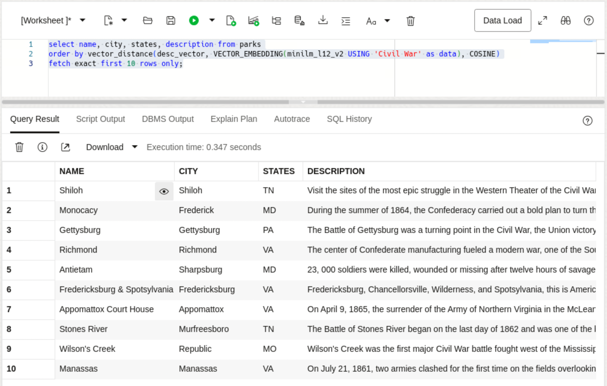
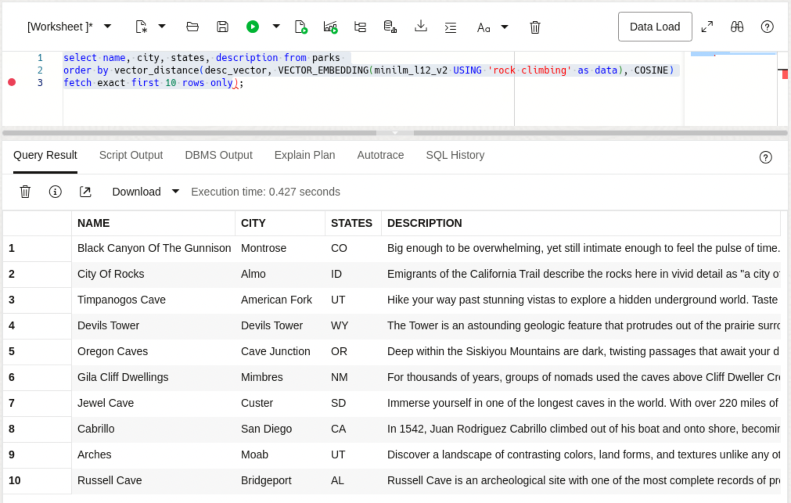
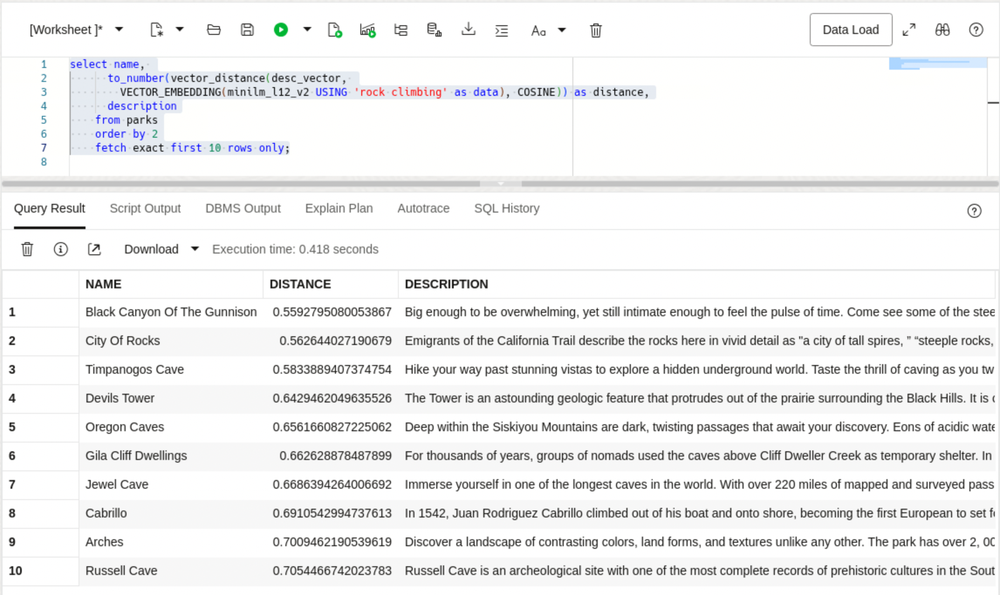
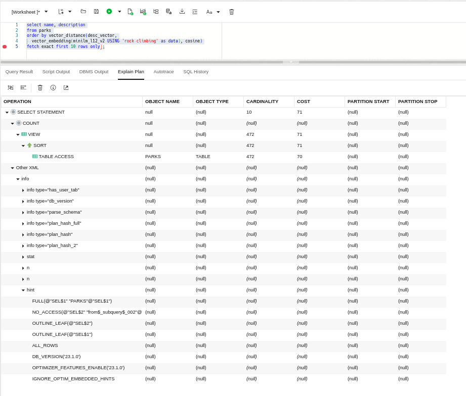

# Exact Similarity Search

## Introduction

This lab walks you through the steps to run exact similarity searches and what is happening during the search.

Estimated Lab Time: 10 minutes

### About Exact Similarity Search

To enable similarity search, we will need to create vector embeddings for the column(s) we would like to search on, which, in this first lab will be the DESCRIPTION column in the PARKS table. Vector embeddings are stored in a column of data type VECTOR. A vector embedding is a mathematical vector representation of data points or, more simply, an array of numbers. This vector representation translates semantic similarity into proximity in a mathematical vector space. You will get to see what these numbers look like, but ultimately it is the comparison of distance between any two vectors that enables similarity search.

Vector embeddings are generated using Machine Learning models. How do you decide which embedding model to use? After all, there are open-source embedding models and proprietary embedding models that you might have to pay for, or you could create and train your own embedding models. To add to the confusion, each embedding model has been trained on specific data. The type of embedding model you use will depend on the type of data that you plan to embed and how well that model performs for the searches you or your application need to perform.

Once you decide on one or more embedding models to try, you can choose to create vector embeddings outside the database or inside the database by importing the models directly into Oracle Database if they are compatible with the Open Neural Network Exchange (ONNX) standard. Since Oracle Database implements an ONNX runtime directly within the database, these imported models can be used to generate vector embeddings in Oracle Database.

In this Lab we are going to be searching on a text column, and we will use the all-MiniLM-L12-v2 model. This model is part of the sentence-transformers library. This model takes sentences or paragraphs and converts them into 384-dimensional vectors. Each of these 384 dimensions captures a specific aspect of the sentence's meaning or characteristics. We will be using a pre-built version of this model, which just means that it has already been converted into an ONNX format and is ready to be loaded into the database. You can find the details about how this was done in this blog post: https://blogs.oracle.com/machinelearning/post/use-our-prebuilt-onnx-model-now-available-for-embedding-generation-in-oracle-database-23ai.


### Objectives

In this lab, you will:

* Run exact similarity searches
* Show vector distances to reinforce how the search is evaluated
* Show an execution plan from a query

### Prerequisites

This lab assumes you have:
* An Oracle Cloud account
* All previous labs successfully completed


*This is the "fold" - below items are collapsed by default*


## Task 1: Run exact similarity searches

In this task we will put our work to use and run some exact similarity searches on the DESCRIPTION vector embeddings that we just created.

1. Our first query will look for parks that are associated with the Civil War:

    ```
    <copy>
    select name, city, states, description from parks
    order by vector_distance(desc_vector, 
      VECTOR_EMBEDDING(minilm_l12_v2 USING 'Civil War' as data), COSINE)
    fetch EXACT first 10 rows only;
    </copy>
    ```

    

    If you know anything about the Civil War you will notice that those are some pretty famous locations. However you might also notice that the words "Civil War" show up in almost all of the descriptions. You might ask, couldn't I have just searched on the term civil war? And that probably would have worked so lets try something a little harder in our next query.

2. For our second query we will try a query with a term, "rock climbing", that doesn't show up in the description:

    ```
    <copy>
    select name, city, states, description from parks 
    order by vector_distance(desc_vector, 
      VECTOR_EMBEDDING(minilm_l12_v2 USING 'rock climbing' as data), COSINE)
    fetch EXACT first 10 rows only);
    </copy>
    ```

    

    The results are even more surprising since only two description have words that are close to "rock climbing". One has "rock climbers" in it, and one mentions "crack climbing", but otherwise no mention of actual rock climbing for parks that appear to be good candidates for rock climbing. We will see later in the Lab how close we actually came.

3. We mentioned in the introduction that vectors are used to search for semantically similar objects based on their proximity to each other In other words, the embedding process enables the use of specialized algorithms to search for the closest matches to the vector embedding being compared based on the distance between the search vector and the target vectors. Lets add the distance calculation to our query to see how this actually works.

    ```
    <copy>
    select name, 
      to_number(vector_distance(desc_vector, 
        VECTOR_EMBEDDING(minilm_l12_v2 USING 'rock climbing' as data), COSINE)) as distance,
      description
    from parks
    order by 2
    fetch EXACT first 10 rows only;
    </copy>
    ```

	 

    Notice that the distance number, the DISTANCE column, is increasing. This means that the best match is first with the smallest distance and as the distance increases the matches have less and less similarity to the search vector.

4. One last step. Since we are doing exact queries, that is we have not created any vector indexes, what does an execution plan look like?

    ```
    <copy>
    select name, description from parks 
    order by vector_distance(desc_vector, 
      VECTOR_EMBEDDING(minilm_l12_v2 USING 'rock climbing' as data), COSINE)
    fetch EXACT first 10 rows only);
    </copy>
    ```
  
    Click on the "Explain Plan" button and choose the "Advanced View" to display an image like the one below:

	 

    Notice that a TABLE ACCESS is performed on the PARKS table since we have not defined any indexes. In the next Lab we will take a look at how to create a vector index and perform approximate similarity searches.


## Learn More

* [Oracle AI Vector Search Users Guide](https://docs.oracle.com/en/database/oracle/oracle-database/23/vecse/index.html)
* [OML4Py: Leveraging ONNX and Hugging Face for AI Vector Search](https://blogs.oracle.com/machinelearning/post/oml4py-leveraging-onnx-and-hugging-face-for-advanced-ai-vector-search)
* [Oracle Database 23ai Release Notes](https://docs.oracle.com/en/database/oracle/oracle-database/23/rnrdm/index.html)
* [Oracle Documentation](http://docs.oracle.com)

## Acknowledgements
* **Author** - Andy Rivenes and Sean Stacey, Product Managers
* **Contributors** - Markus Kissling, Product Manager
* **Last Updated By/Date** - Andy Rivenes, March 2025
