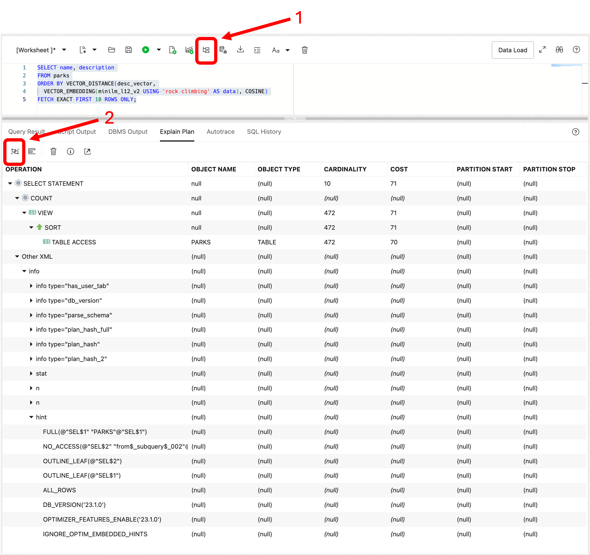

# Exact Similarity Search

## Introduction

This lab walks you through the steps to run exact similarity searches and what is happening during the search.

Estimated Lab Time: 10 minutes

### About Exact Similarity Search

An exact similarity search looks at the distances, based on a given query vector, to all other vectors in a data set. In this type of search, all vectors are compared, and produces the most accurate results.

In this Lab we are going to be performing exact similarity searches on a text column, and we will use the all-MiniLM-L12-v2 model. This is the same model we used in the Embedding Models lab to create the vector embeddings for the DESCRIPTION column in the PARKS table.


### Objectives

In this lab, you will:

* Run exact similarity searches
* Show vector distances to reinforce how the search is evaluated
* Show an execution plan from a query

### Prerequisites

This lab assumes you have:
* An Oracle Cloud account
* All previous labs successfully completed


*This is the "fold" - below items are collapsed by default*

## Connecting to your Vector Database

The lab environment includes a preinstalled Oracle 23ai Database which includes AI Vector Search. We will be running the lab exercises from a pluggable database called: *orclpdb1* and connecting to the database as the user: *nationalparks*. The Lab will be run using SQL Developer Web.

To connect with SQL Developer Web to run the SQL commands in this lab you will first need to start a browser using the following URL. You will then be prompted to sign in:

  ```
  <copy>google-chrome http://localhost:8080/ords/nationalparks/_sdw/?nav=worksheet</copy>
  ```

After signing in you should see a browser window like the following:

 


## Task 1: Run exact similarity searches

In this task we will put our work to use and run some exact similarity searches on the DESCRIPTION vector embeddings that we just created.

1. Our first query will look for parks that are associated with the Civil War:

    ```
    <copy>
    select name, city, states, description 
    from parks
    order by vector_distance(desc_vector,
      vector_embedding(minilm_l12_v2 USING 'Civil War' as data), cosine)
    fetch exact first 10 rows only;
    </copy>
    ```

    

    If you know anything about the Civil War you will notice that those are some pretty famous locations. However you might also notice that the words "Civil War" show up in almost all of the descriptions. You might ask, couldn't I have just searched on the term civil war? And that probably would have worked so let's try something a little harder in our next query.

2. For our second query we will try a query with a term, "rock climbing", that doesn't show up in the description:

    ```
    <copy>
    select name, city, states, description
    from parks
    order by vector_distance(desc_vector,
      vector_embedding(minilm_l12_v2 using 'rock climbing' as data), cosine)
    fetch exact first 10 rows only);
    </copy>
    ```

    

    The results are even more surprising since only two description have words that are close to "rock climbing". One has "rock climbers" in it, and one mentions "crack climbing", but otherwise no mention of actual rock climbing for parks that appear to be good candidates for rock climbing. We will see later in the Lab how close we actually came.

3. We mentioned in the introduction that vectors are used to search for semantically similar objects based on their proximity to each other In other words, the embedding process enables the use of specialized algorithms to search for the closest matches to the vector embedding being compared based on the distance between the search vector and the target vectors. Lets add the distance calculation to our query to see how this actually works.

    ```
    <copy>
    select name,
      to_number(vector_distance(desc_vector,
        vector_embedding(minilm_l12_v2 USING 'rock climbing' as data), cosine)) as distance,
      description
    from parks
    order by 2
    fetch exact first 10 rows only;
    </copy>
    ```

	 

    Notice that the distance number, the DISTANCE column, is increasing. This means that the best match is first with the smallest distance and as the distance increases the matches have less and less similarity to the search vector.

4. One last step. Since we are doing exact queries, that is we have not created any vector indexes, what does an execution plan look like?

    ```
    <copy>
    select name, description
    from parks
    order by vector_distance(desc_vector,
      vector_embedding(minilm_l12_v2 USING 'rock climbing' as data), cosine)
    fetch exact first 10 rows only);
    </copy>
    ```
  
    Click on the "Explain Plan" button and choose the "Advanced View" to display an image like the one below:

	 

    Notice that a TABLE ACCESS is performed on the PARKS table since we have not defined any indexes. In the next Lab we will take a look at how to create a vector index and perform approximate similarity searches.


## Learn More

* [Oracle AI Vector Search Users Guide](https://docs.oracle.com/en/database/oracle/oracle-database/23/vecse/index.html)
* [OML4Py: Leveraging ONNX and Hugging Face for AI Vector Search](https://blogs.oracle.com/machinelearning/post/oml4py-leveraging-onnx-and-hugging-face-for-advanced-ai-vector-search)
* [Oracle Database 23ai Release Notes](https://docs.oracle.com/en/database/oracle/oracle-database/23/rnrdm/index.html)
* [Oracle Documentation](http://docs.oracle.com)

## Acknowledgements
* **Author** - Andy Rivenes, Product Manager
* **Contributors** - Sean Stacey, Markus Kissling, Product Managers
* **Last Updated By/Date** - Andy Rivenes, April 2025
