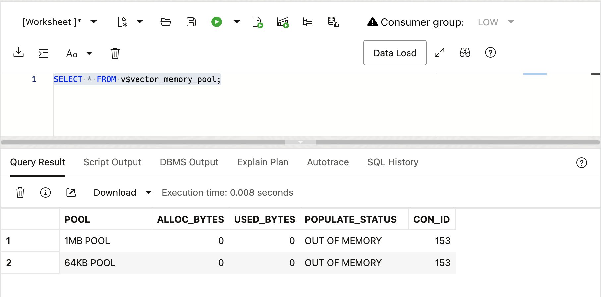
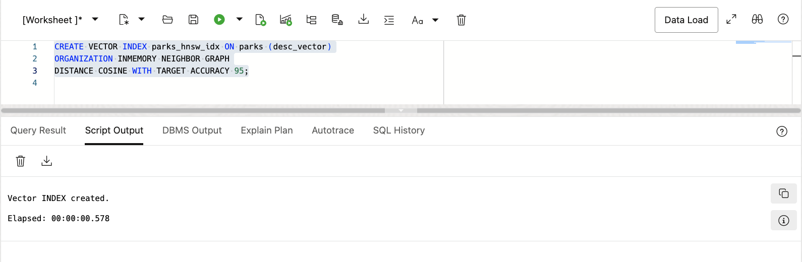
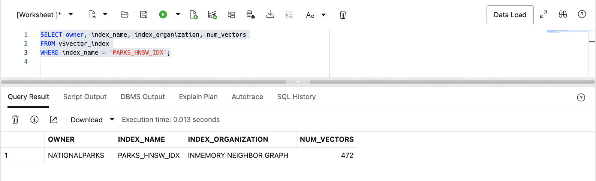
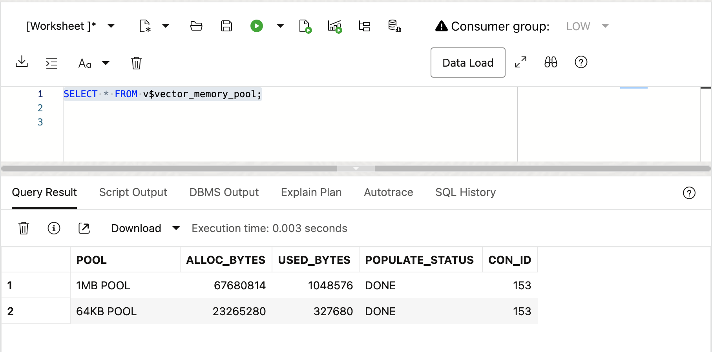
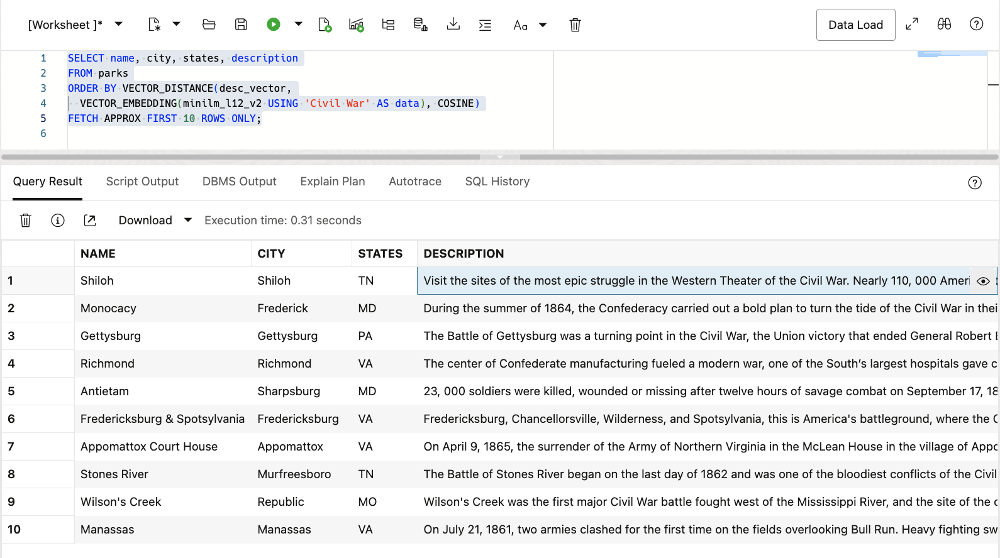
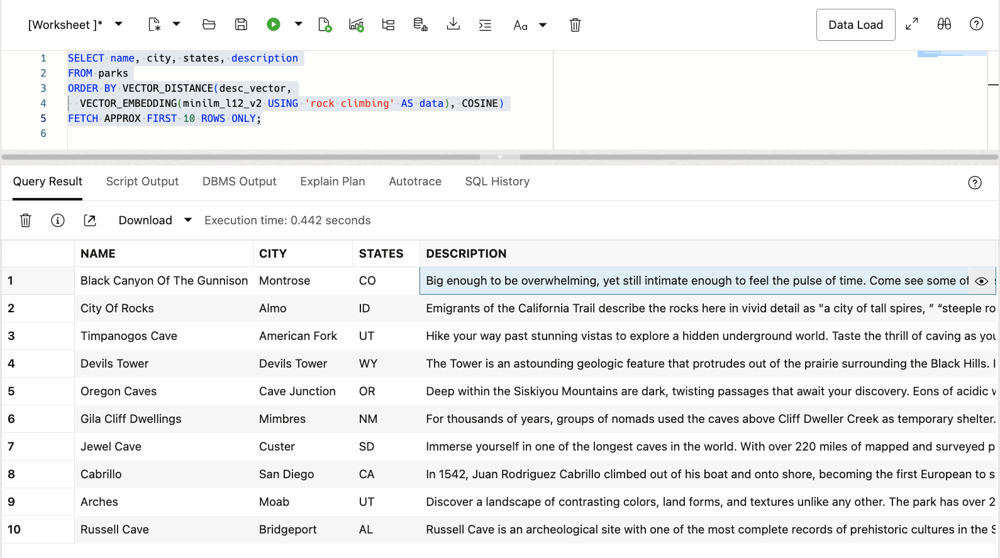
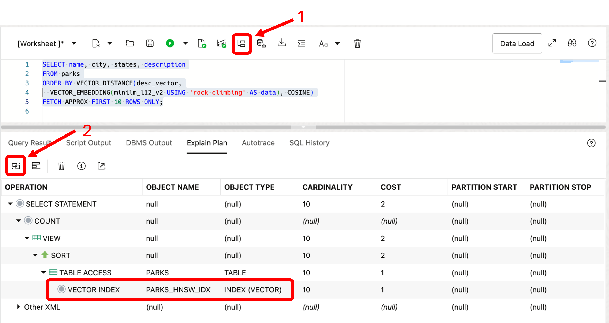

# Approximate Similarity Search

## Introduction

This lab walks you through the steps to create vector indexes and run approximate similarity searches for text.

Estimated Lab Time: 10 minutes

### About Approximate Similarity Search

In the previous Lab, Exhaustive Search, we performed exhaustive similarity searches which examined each vector in the table. This can be resource intensive since examining vector distances are computationally expensive and don't scale well for very large vector datasets. This is where approximate similarity searches have an advantage. Creating vector indexes enables the ability to use approximate similarity search. Instead of checking every possible match, an approximate similarity search uses a class of algorithms referred to as _Approximate Nearest Neighbor_. Using vector indexes helps reduce the number of distance calculations, making searches faster and more efficient with only a slight penalty in accuracy.

There are currently three types of vector indexes available in AI Vector Search:

*	**In-Memory Neighbor Graph Vector Index** – Oracle AI Vector Search supports an in-memory Hierarchical Navigable Small World (HNSW) type of In-Memory Neighbor Graph vector index where vertices represent vectors and edges between vertices represent similarity.  This is an in-memory only index. This type of index is typically highly efficient for both accuracy and speed.
* **Neighbor Partition Vector Index** – Oracle AI Vector Search also supports an Inverted File Flat (IVF) partition-based index with vectors clustered into table partitions based on similarity. This type of index typically provides an efficient scale-out index, with fast and seamless transactional support.
* **Hybrid Vector Index** - There is also a Hybrid Vector Index that combines the information retrieval capabilities of Oracle Text search indexes and the semantic search capabilities of Oracle AI Vector Search vector indexes.

In this Lab we will use HNSW indexes to enable approximate similarity search since they provide the fastest performance and our dataset will easily fit in-memory.


### Objectives

In this lab, you will:

* View the Vector Pool
* Run the vector memory advisor to estimate the space required
* Create an HNSW vector index on the PARKS table vector column
* Show index memory usage and information
* Run approximate similarity searches
* Show an execution plan from a query
* Show differences between and exhaustive and approximate similarity searches

### Prerequisites

This lab assumes you have:
* An Oracle Cloud account
* All previous labs successfully completed


*This is the "fold" - below items are collapsed by default*

## Connecting to your Vector Database

The lab environment includes a preinstalled Oracle 23ai Database which includes AI Vector Search. We will be running the lab exercises from a pluggable database called: *orclpdb1* and connecting to the database as the user: *nationalparks*. The Lab will be run using SQL Developer Web.

To connect with SQL Developer Web to run the SQL commands in this lab you will first need to start a browser using the following URL. You will then be prompted to sign in:

 ```
 <copy>http://localhost:8080/ords/nationalparks/_sdw/?nav=worksheet</copy>
 ```

After signing in you should see a browser window like the following:

 


## Task 1: View the Vector Pool

When HNSW indexes are used, you must enable a new memory area in the database called the Vector Pool. The Vector Pool is memory allocated from the System Global Area (SGA) to store HNSW type vector indexes and their associated metadata. It is allocated using a new database initialization parameter called VECTOR_MEMORY_SIZE.

1. Let's see how much memory has been allocated to the Vector Pool in our Lab environment:

    ```
    <copy>
    SELECT * FROM v$vector_memory_pool;
    </copy>
    ```

    

    You can see that there are two pools, the 1MB pool and the 64KB pool. The VECTOR\_MEMORY\_SIZE has been set to 5G and you can view how that memory has been allocated to each pool in the ALLOC\_BYTES column. Since we have not created any vector indexes yet you can see that the USED\_BYTES is 0 for both pools.


## Task 2: Create a vector index

In this task we will create an HNSW vector index and see how much space is used in the Vector Pool.

1. Create a vector index for the DESC\_VECTOR column in the PARKS table:

    ```
    <copy>
    CREATE VECTOR INDEX parks_hnsw_idx ON parks (desc_vector)
    ORGANIZATION INMEMORY NEIGHBOR GRAPH
    DISTANCE COSINE WITH TARGET ACCURACY 95;
    </copy>
    ```

    

    Notice that an HNSW index is created by specifying "inmemory neighbor graph". The minilm\_l12\_v2 embedding model we have been using works well with the "cosine" distance method and we have also specified a "target accuracy" of 95 percent.

2. Display information about the new vector index:

    ```
    <copy>
    SELECT owner, index_name, index_organization, num_vectors
    FROM v$vector_index
    WHERE index_name = 'PARKS_HNSW_IDX';
    </copy>
    ```

    

    Notice the space consumed by the index.

3. See how much memory was used in the Vector Pool:

    ```
    <copy>
    SELECT * FROM v$vector_memory_pool;
    </copy>
    ```

    


## Task 3: Run approximate similarity searches

In this task we will run the same queries we ran in the the Exhaustive Search lab, but now we will run approximate similarity searches with the vector index that we just created.

1. Recall that the first query we ran in the Exhaustive Search lab looked for parks that were associated with the Civil War. Notice that we have changed the EXACT keyword on the fetch line to APPROX for approximate. If the EXACT keyword is NOT used, the optimizer will choose a vector index if the cost is less than an exhaustive search. This can help ensure that you are actually running an approximate search:
The APPROX keyword is optional and helps make the intent of the approximate query more obvious.
The EXACT keyword forces an exhaustive search.

    ```
    <copy>
    SELECT name, city, states, description
    FROM parks
    ORDER BY VECTOR_DISTANCE(desc_vector,
      VECTOR_EMBEDDING(minilm_l12_v2 USING 'Civil War' AS data), COSINE)
    FETCH APPROX FIRST 10 ROWS ONLY;
    </copy>
    ```

    

2. Lets also re-run our "rock climbing" query and see if there are any differences running an approximate search:

    ```
    <copy>
    SELECT name, city, states, description
    FROM parks
    ORDER BY VECTOR_DISTANCE(desc_vector,
      VECTOR_EMBEDDING(minilm_l12_v2 USING 'rock climbing' AS data), COSINE)
    FETCH APPROX FIRST 10 ROWS ONLY;
    </copy>
    ```

    

   Notice that the results are the same for both queries with potentially less work and faster execution. Since our dataset is so small you may not notice much difference. However, in practice with large datasets the difference can be very large.

3. Since we are now doing an approximate search using a vector index, what does the execution plan look like?

    ```
    <copy>
    SELECT name, city, states, description
    FROM parks
    ORDER BY VECTOR_DISTANCE(desc_vector,
      VECTOR_EMBEDDING(minilm_l12_v2 USING 'rock climbing' AS data), COSINE)
    FETCH APPROX FIRST 10 ROWS ONLY;
    </copy>
    ```
  
    Click on the "Explain Plan" button and select the "Advanced View" button to display an image like the one below:

	

    Notice that a vector index access is now performed on the PARKS table since we have a vector index available.


You may now **proceed to the next lab**


## Learn More

* [Oracle AI Vector Search Users Guide](https://docs.oracle.com/en/database/oracle/oracle-database/23/vecse/index.html)
* [OML4Py: Leveraging ONNX and Hugging Face for AI Vector Search](https://blogs.oracle.com/machinelearning/post/oml4py-leveraging-onnx-and-hugging-face-for-advanced-ai-vector-search)
* [Oracle Database 23ai Release Notes](https://docs.oracle.com/en/database/oracle/oracle-database/23/rnrdm/index.html)
* [Oracle Documentation](http://docs.oracle.com)

## Acknowledgements
* **Author** - Andy Rivenes, Product Manager
* **Contributors** - Sean Stacey, Markus Kissling, Product Managers
* **Last Updated By/Date** - Andy Rivenes, April 2025
