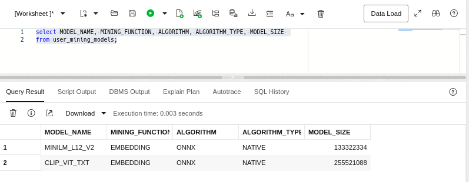
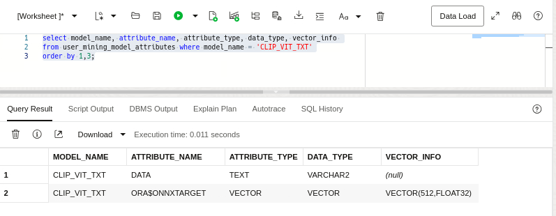
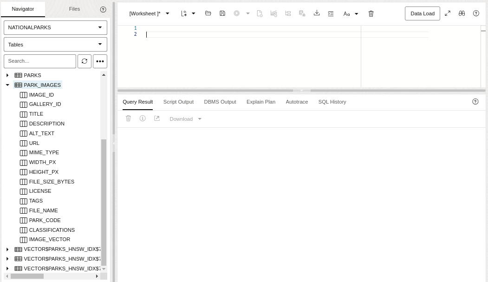
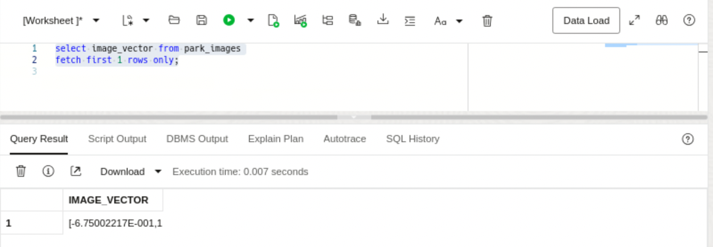
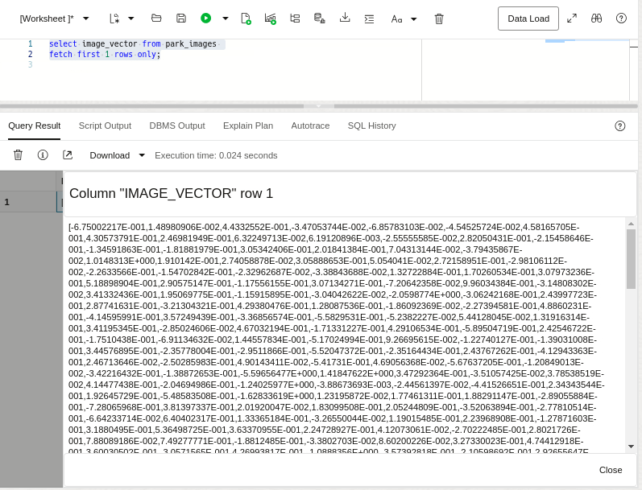
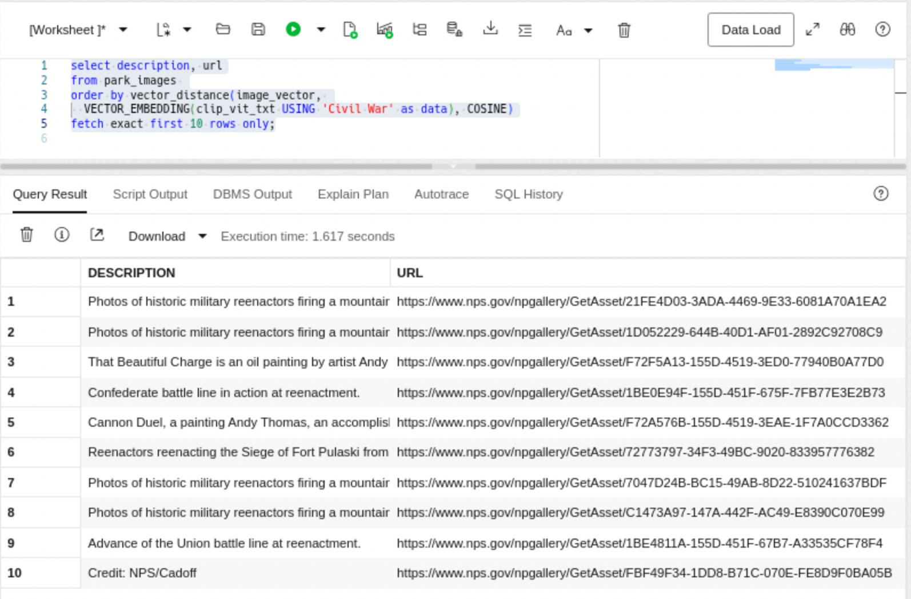
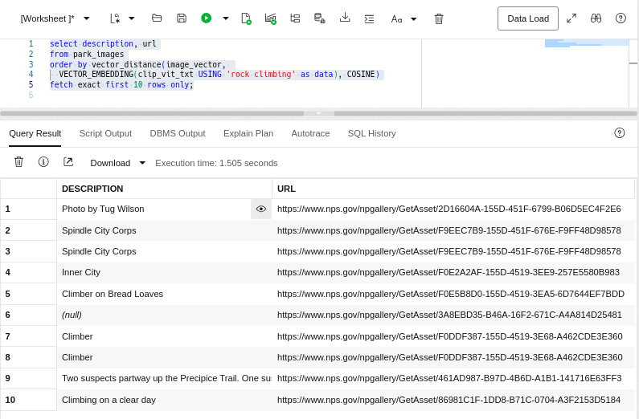
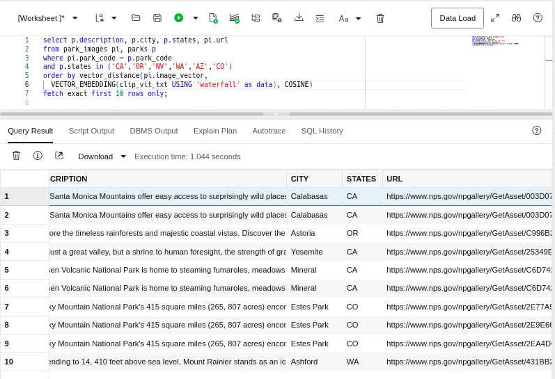
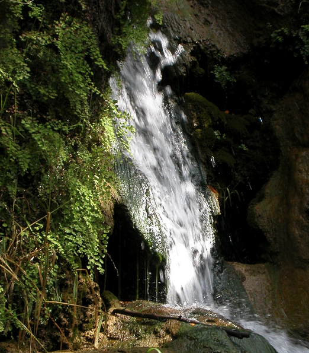

# Similarity Search on Images

## Introduction

This lab walks you through the steps to create vector indexes and run approximate similarity searches.

Estimated Lab Time: 10 minutes

### About Image Similarity Search

In the previous Labs, we looked at embedding models and similarity search on text based data. Now we are going to look at something even more impressive. The ability to use words or phrases to search images. The US National Parks dataset that we have been using has two tables. One based on parks and then another that has images for those parks. We are going to search the images and then also combine a query to join the two tables and look through images based on a general location.

The image vector embeddings have already been created since that would take too long for this lab environment, but we will take a look at them. The embedding model that was used was the OpenAI CLIP model that was built to enable searching images with text phrases or even other images. We will keep it simple and use the text version of the embedding model to search the image vectors. This model has already been loaded into the database as well, and is called CLIP_VIT_TXT. You may have even noticed it when we looking at text embedding model in the Embedding Model lab.


### Objectives

In this lab, you will:

* Look at the image embedding model characteristics
* Describe the vector column in the images table PARK_IMAGES
* Run exact similarity searches for specific images
* Run combined similarity and relational searches

### Prerequisites

This lab assumes you have:
* An Oracle Cloud account
* All previous labs successfully completed


*This is the "fold" - below items are collapsed by default*


## Task 1: Display the CLIP embedding model

The CLIP embedding model has already been converted to ONNX format and loaded into the database. This is the same model that was used to create vectors of the park images that were also pre-loaded.

1. Display the CLIP embedding model:

   ```
   <copy>
   select MODEL_NAME, MINING_FUNCTION, ALGORITHM, ALGORITHM_TYPE, MODEL_SIZE 
   from user_mining_models;
   </copy>
   ```

   

   You may notice that the 'MINING FUNCTION' column has the attribute of EMBEDDING since this particular machine learning model is an embedding model.
  
2. Display the model details:

   ```
   <copy>
   select model_name, attribute_name, attribute_type, data_type, vector_info 
   from user_mining_model_attributes order by 1,3;
   </copy>
   ```

   

   You may notice that the VECTOR_INFO column displays 'VECTOR(384,FLOAT32)' which matches our description in the About section where we stated that the all_MiniLM_L12_v2 model has 384-dimensional vectors and a dimension format of FLOAT32.


## Task 2: Display the Vector column in the PARKS_IMAGES table

In this task we will take a look at the PARK_IMAGES table. The table itself has a URL to the park images, they are not actually stored in the table. Vector embeddings of each of those images have been created and stored in the IMAGES_VECTOR column. These embeddings were created externally using the CLIP embedding model. We have stored the actual images in the Object Store so you can look at them based on the searches you will perform in this Lab.

1. Display the columns in the PARK_IMAGES table by clicking on the arrow next to the PARK_IMAGES table in the SQL Developer Web navigator column on the left. Alternatively you can right-click on the PARK_IMAGES table anc click the Open option.

   See the image below:

   

2. Display one of the IMAGE_VECTOR columns:

   ```
   <copy>
   select image_vector from park_images
   fetch first 1 rows only;
   </copy>
   ```

   

   You can select the IMAGE_VECTOR and then click on the eye image to expand the entire vector:

   

## Task 3: Run image based similarity searches

In this task we will run similar queries to the ones we ran in the previous Labs, but now we will use our text phrases to search the image vectors, not text vectors.

1. First we can search for Civil War park images:

    ```
    <copy>
    select description, url from park_images
    order by vector_distance(image_vector, 
      VECTOR_EMBEDDING(clip_vit_txt USING 'Civil War' as data), COSINE)
    fetch APPROX first 10 rows only;
    </copy>
    ```

    

    If you copy the first URL into a browser window you will see an image like the following:

    

2. Now let's see if we can find images that have rock climbing:

    ```
    <copy>
    select description, url from park_images
    order by vector_distance(image_vector, 
      VECTOR_EMBEDDING(clip_vit_txt USING 'rock climbing' as data), COSINE)
    fetch APPROX first 10 rows only;
    </copy>
    ```

    

    If you copy the first URL into a browser window you will see an image like the following:

    

3. Lastly, let's search for waterfalls, but let's add a twist. We will add a join to the PARKS table so we can include the park location details:

    ```
    <copy>
    select p.description, p.city, p.states, pi.url
    from park_images pi, parks p
    where pi.park_code = p.park_code
      and p.states in ('CA','OR','NV','WA','AZ','CO')
    order by vector_distance(pi.image_vector, 
      VECTOR_EMBEDDING(clip_vit_txt USING 'waterfall' as data), COSINE)
    fetch exact first 10 rows only;
    </copy>
    ```

    

    If you copy the first URL into a browser window you will see an image like the following:

    


## Learn More

* [Oracle AI Vector Search Users Guide](https://docs.oracle.com/en/database/oracle/oracle-database/23/vecse/index.html)
* [OML4Py: Leveraging ONNX and Hugging Face for AI Vector Search](https://blogs.oracle.com/machinelearning/post/oml4py-leveraging-onnx-and-hugging-face-for-advanced-ai-vector-search)
* [Oracle Database 23ai Release Notes](https://docs.oracle.com/en/database/oracle/oracle-database/23/rnrdm/index.html)
* [Oracle Documentation](http://docs.oracle.com)

## Acknowledgements
* **Author** - Andy Rivenes and Sean Stacey, Product Managers
* **Contributors** - Markus Kissling, Product Manager
* **Last Updated By/Date** - Andy Rivenes, March 2025
