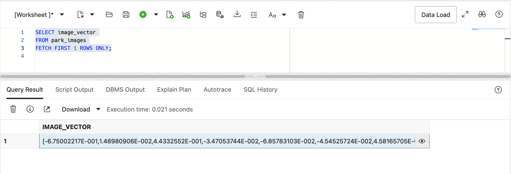
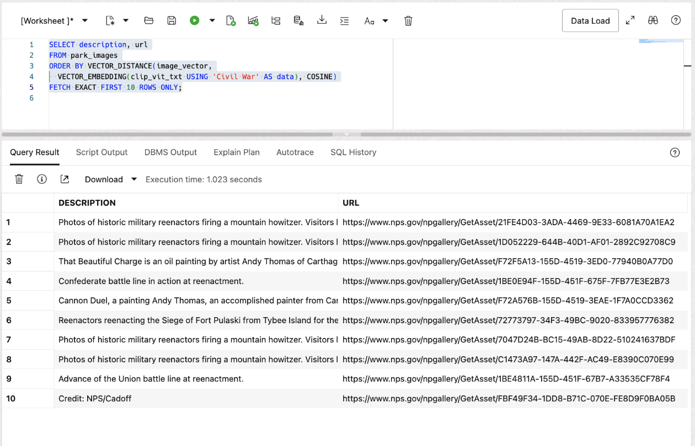
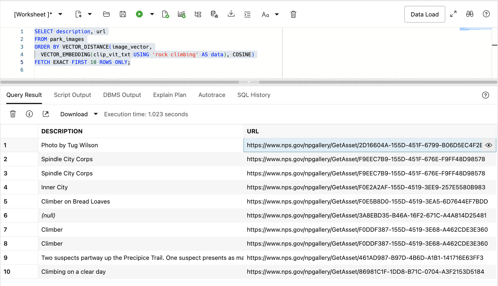
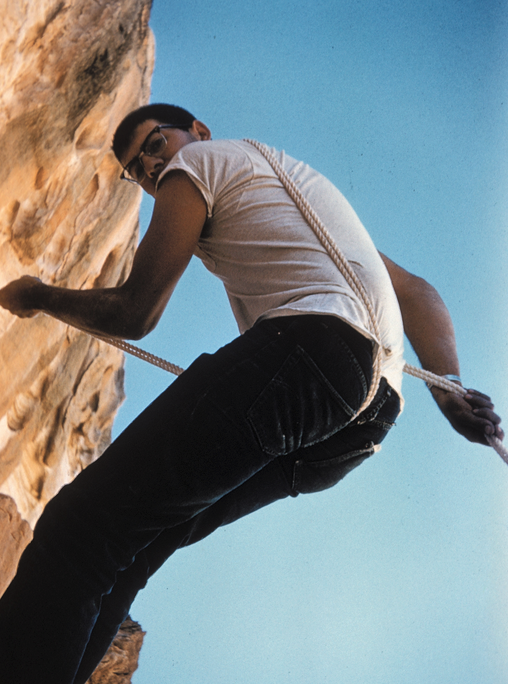

# Similarity Search on Images

## Introduction

This lab walks you through the steps to create vector indexes and run approximate similarity searches on images.

Estimated Lab Time: 10 minutes

### About Image Similarity Search

In the previous Labs, we looked at embedding models and similarity search on text based data. Now we are going to look at something even more impressive. The ability to use words or phrases to search images. The US National Parks dataset that we have been using has two tables. One based on parks and then another that has images for those parks. We are going to search the images and then also combine a query to join the two tables and look through images based on a general location.

The image vector embeddings have already been created since that would take too long for this lab environment, but we will take a look at them. The embedding model that was used was the OpenAI CLIP model that was built to enable searching images with text phrases or even other images. We will keep it simple and use the text version of the embedding model to search the image vectors in this lab. This model has already been loaded into the database as well, and is called CLIP\_VIT\_TXT.


### Objectives

In this lab, you will:

* Look at the image embedding model characteristics
* Describe the vector column in the images table PARK_IMAGES
* Run exhaustive similarity searches for specific images
* Run combined similarity and relational searches

### Prerequisites

This lab assumes you have:
* An Oracle Cloud account
* All previous labs successfully completed


*This is the "fold" - below items are collapsed by default*

## Connecting to your Vector Database

The lab environment includes a preinstalled Oracle 23ai Database which includes AI Vector Search. We will be running the lab exercises from a pluggable database called: *orclpdb1* and connecting to the database as the user: *nationalparks*. The Lab will be run using SQL Developer Web.

To connect with SQL Developer Web to run the SQL commands in this lab you will first need to start a browser using the following URL. You will then be prompted to sign in:

  ```
  <copy>google-chrome http://localhost:8080/ords/nationalparks/_sdw/?nav=worksheet</copy>
  ```

After signing in you should see a browser window like the following:

 


## Task 1: Display the CLIP embedding model

The CLIP embedding model has already been converted to ONNX format and loaded into the database. This is the same model that was used to create vectors of the park images that were also pre-loaded.

1. Display the CLIP embedding model:

    ```
    <copy>
    SELECT model_name, mining_function, algorithm, algorithm_type, model_size
    FROM user_mining_models;
    </copy>
    ```

    

      
2. Display the model details:

    ```
    <copy>
    SELECT model_name, attribute_name, attribute_type, data_type, vector_info
    FROM user_mining_model_attributes
    ORDER BY 1,3;
    </copy>
    ```

    

    You may notice that the VECTOR\_INFO column displays 'VECTOR(512,FLOAT32)' for this model which is different than what we saw for the all\_MiniLM\_L12\_v2 model which was VECTOR(384, FLOAT32).  This means that the CLIP text model is wider as it has 512 dimensions.


## Task 2: Display the Vector column in the PARKS\_IMAGES table

In this task we will take a look at the PARK\_IMAGES table. The table itself has a URL to the park images, they are not actually stored in the table. Vector embeddings of each of those images have been created and stored in the IMAGES\_VECTOR column. These embeddings were created externally using the CLIP embedding model.

1. Display the columns in the PARK\_IMAGES table by clicking on the arrow next to the PARK\_IMAGES table in the SQL Developer Web navigator column on the left. Alternatively you can right-click on the PARK\_IMAGES table and click the "Open" option.

    See the image below:

    

2. Display one of the IMAGE\_VECTOR columns:

    ```
    <copy>
    SELECT image_vector
    FROM park_images
    FETCH FIRST 1 ROWS ONLY;
    </copy>
    ```

    

    You can select the IMAGE\_VECTOR and then click on the eye image to expand the entire vector:

    

## Task 3: Run image based similarity searches

In this task we will run similar queries to the ones we ran in the previous Labs, but now we will use our text phrases to search the image vectors, not text vectors.

1. First we can search for Civil War park images:

    ```
    <copy>
    SELECT description, url
    FROM park_images
    ORDER BY VECTOR_DISTANCE(image_vector,
      VECTOR_EMBEDDING(clip_vit_txt USING 'Civil War' AS data), COSINE)
    FETCH EXACT FIRST 10 ROWS ONLY;
    </copy>
    ```

    

    If you click on the first URL and then click on the eye icon the URL will open in a new window:

    
    
    If you then highlight the URL and right click a dialog box will open. Choose the "Go to ..." option to open the image in a new browser tab:
    
    
    
    You should see an image like the following:

    

2. Now let's see if we can find images that have rock climbing:

    ```
    <copy>
    SELECT description, url
    FROM park_images
    ORDER BY VECTOR_DISTANCE(image_vector,
      VECTOR_EMBEDDING(clip_vit_txt USING 'rock climbing' AS data), COSINE)
    FETCH EXACT FIRST 10 ROWS ONLY;
    </copy>
    ```

    

    If you click on the first URL, click on the eye icon, then highlight the URL and right click you can choose the "Go to ..." option to open the image in a new browser tab:

    

3. Lastly, let's search for waterfalls, but let's add a twist. We will add a join to the PARKS table so we can include the park location details. Since the author of this Lab is based out of Redwood Shores, CA we will restrict our query of parks with waterfalls to the western United States:

    ```
    <copy>
    SELECT p.description, p.city, p.states, pi.url
    FROM park_images pi, parks p
    WHERE pi.park_code = p.park_code
      AND p.states in ('CA','OR','NV','WA','AZ','CO')
    ORDER BY VECTOR_DISTANCE(pi.image_vector,
      VECTOR_EMBEDDING(clip_vit_txt USING 'waterfall' AS data), COSINE)
    FETCH EXACT FIRST 10 ROWS ONLY;
    </copy>
    ```

    

    If you click on the first URL, click on the eye icon, then highlight the URL and right click you can choose the "Go to ..." option to open the image in a new browser tab:

    


You may now **proceed to the next lab**


## Learn More

* [Oracle AI Vector Search Users Guide](https://docs.oracle.com/en/database/oracle/oracle-database/23/vecse/index.html)
* [OML4Py: Leveraging ONNX and Hugging Face for AI Vector Search](https://blogs.oracle.com/machinelearning/post/oml4py-leveraging-onnx-and-hugging-face-for-advanced-ai-vector-search)
* [Oracle Database 23ai Release Notes](https://docs.oracle.com/en/database/oracle/oracle-database/23/rnrdm/index.html)
* [Oracle Documentation](http://docs.oracle.com)

## Acknowledgements
* **Author** - Andy Rivenes, Product Manager
* **Contributors** - Sean Stacey, Markus Kissling, Product Managers
* **Last Updated By/Date** - Andy Rivenes, April 2025
