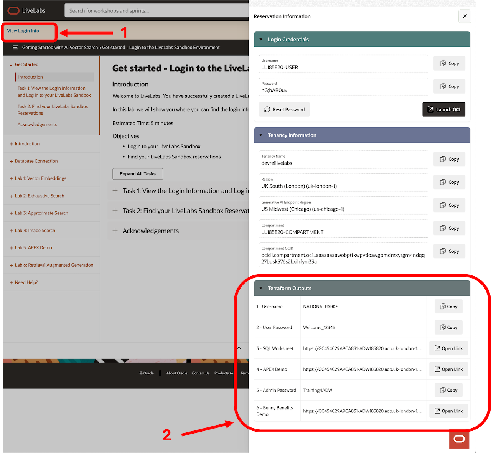
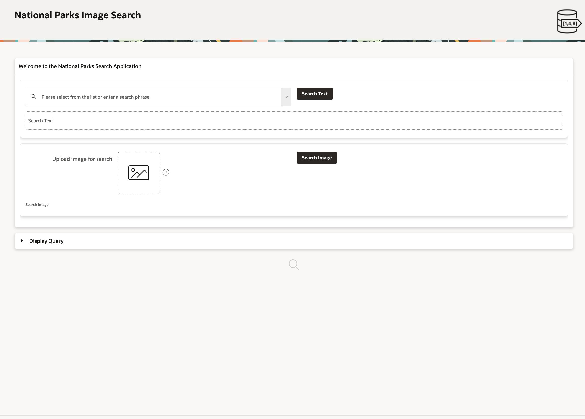
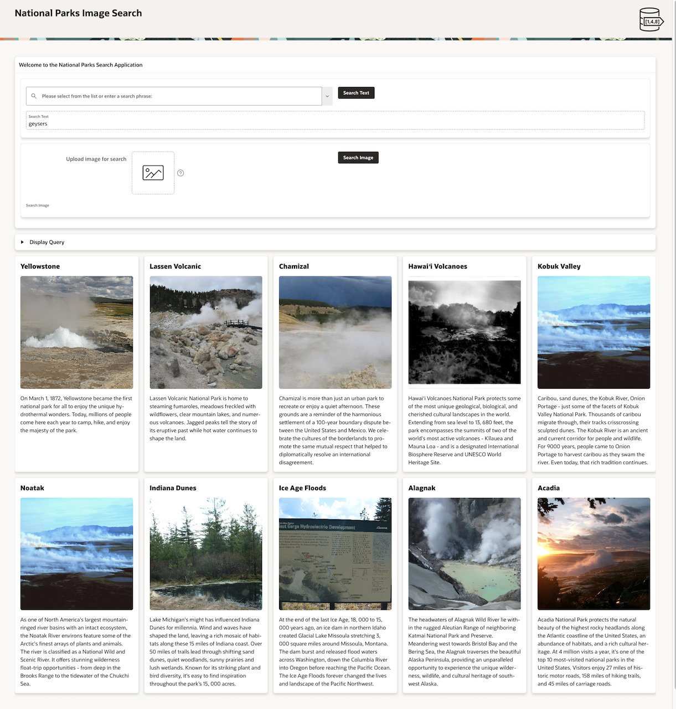
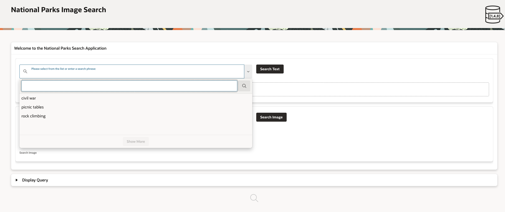
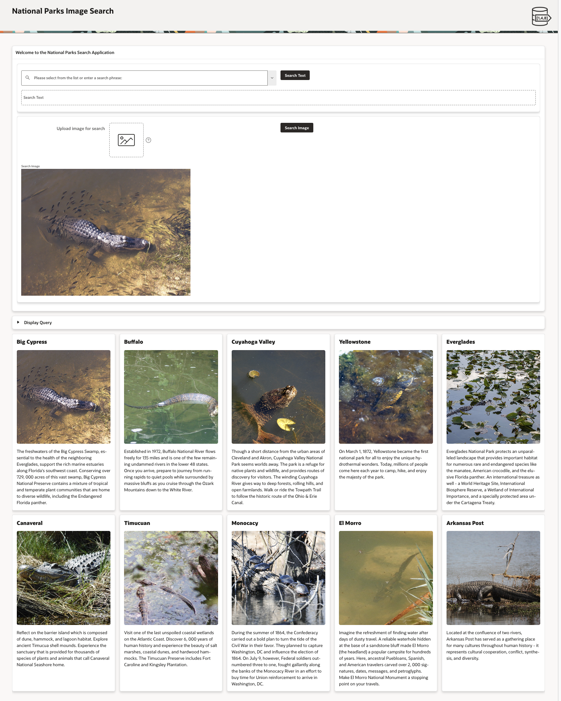
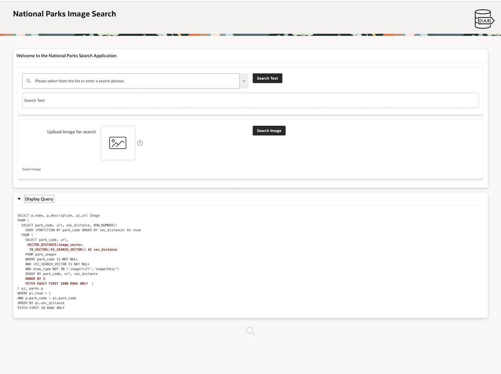

# APEX Demo Search on Images

## Introduction

This lab walks you through a demonstration of AI Vector Search in an APEX application using the SQL that we built in the previous steps in this Lab.

Watch the video below for a quick walk-through of the APEX demo search on images lab:

[APEX Demo Search on Images](https://videohub.oracle.com/media/Vector-Search-APEX-Demo-Lab2/1_brgqm6c6)

Estimated Lab Time: X

### About APEX Demo

In the previous Labs, we loaded a vector embedding model in the database, looked at how vectors are created, ran exact similarity searches, and then created a vector index and ran approximate similarity searches. We also looked at how running similarity searches on images was really the same as on text. This is one of the great features of AI Vector Search. You can search all sorts of data easily. Now we are going to show you an APEX demo that uses the same dataset and queries that we were using in our SQL Worksheet examples to show how one might use AI Vector Search to write actual applications.

This demo will allow you to search for US National Parks based on some attribute like picnic tables, if for example, you wanted to find a park to have a family picnic. Perhaps you're more adventurous and would like to find parks that you could go rock climbing in on your next vacation. We have also designed the application so you can supply any search term or image that you want.

### Objectives

In this lab, you will:

* Use an APEX application to explore US National Parks

### Prerequisites

This lab assumes you have:

* An Oracle Account (oracle.com account)
* Some familiarity with Oracle SQL and AI Vector Search

## Task 1: Connecting to the APEX application

This lab will be run by accessing an APEX application running in our LiveLabs database. You simply need to run the APEX Demo URL in your web browser.

<if type="sandbox">

In an Oracle sandbox environment you simply need to run the APEX Demo URL that can be found on the Introduction page that will be displayed after you launch the workshop. If you click on the "View Login Info" button in the upper left corner of the page a pop up page will appear on the right. You can click on the APEX Demo link to start the demo application.

See the image below for an example:



After clicking on the link in the Terraform Values section shown in the page above you should see a browser window like the following:

 

</if>

<if type="tenancy">

In your own tenancy environment you will need to navigate to the "Tool configuration" tab in the ADB page:


and copy the APEX "Public access URL":


You will then need to open a new browser window or tab and copy the URL into the address bar (note that your URL may have a different hostname) and replace "apex" at the end of the URL:

`https://host_name.adb.us-ashburn-1.oraclecloudapps.com/ords/apex`

with the following string:

```[]
<copy>
/r/nationalparks/nationalparks108/image-search
</copy>
```

The resulting URL should look like this (note that your URL may have a different hostname):

`https://host_name.adb.us-ashburn-1.oraclecloudapps.com/ords/r/nationalparks/nationalparks108/image-search`

Then hit enter to go to invoke the APEX demo. You should see a browser window like the following:

 

</if>

## Task 2: Run the APEX demo

You can now enter any search term or image that you would like to search on. You can pull down on a pre-created list of search terms or make up your own. The demo is designed to return the top 10 most similar park images based on the search term. Only one image per park is returned in search order, although the dataset contains many images for most parks.

1. Run a text search:

    The following shows searching on the term "geysers". Type in the word "geysers" and click on the Search Text button:

    

2. If you would like to see a list of text search terms then you can just click on the arrow to the far right of the query box:

    

3. If you would like to run a search using an image then click on the "Upload image for search" box and choose an image from your machine. If you don't have an image then you can right click on one of the images from a previous search and save that image to your machine. You can then choose that image to search on. Once the image is selected click on the Search Image button. Not all image types are supported by APEX. For a list of the supported and unsupported types, click on the question mark to the right of the image upload graphic.

    In this example an image of an alligator was used:

    

4. If you would like to see the SQL that is being run for these searches then just click on the arrow next to the "Display Query" label:

    

    You may notice that the query is slightly different than the one we created in the examples in the Image Search lab. In particular you might notice that there are no VECTOR\_EMBEDDING calls. This is due to the way that APEX works and how the application was designed, since we wanted to use the same query whether we were searching with a vector generated from a text phrase or a vector generated from an image. The actual VECTOR\_EMBEDDING calls are made using an APEX API, that is APEX_AI.GET\_VECTOR\_EMBEDDINGS, and stored in a variable called P2\_SEARCH\_VECTOR. This allowed us to use the appropriate embedding model, the CLIP\_VIT\_TXT and CLIP\_VIT\_IMG models that we used earlier and not have to have several different queries that did basically the same thing.

    The following is the code in the APEX application that generates the vector embedding for the search input based on whether it is a text phrase or an image:

    ```[]
    DECLARE
      l_vector_clob CLOB;
    BEGIN
      IF :P2_MODEL = 'clip_text_model' THEN
        l_vector_clob := FROM_VECTOR(
           APEX_AI.GET_VECTOR_EMBEDDINGS (
             p_value   =>  :P2_DATA,
             p_service_static_id => 'clip_text_model'));
      ELSE
        l_vector_clob := FROM_VECTOR(
           APEX_AI.GET_VECTOR_EMBEDDINGS (
             p_value   =>  :P2_IMAGE_CLOB,
             p_service_static_id => 'clip_image_model'));
      END IF;
      RETURN l_vector_clob;
    END;
    ```

    Go ahead and experiment with different search terms. You can't hurt anything and you may be amazed at just how good AI Vector Search really is.

## Learn More

* [Oracle AI Vector Search Users Guide](https://docs.oracle.com/en/database/oracle/oracle-database/26/vecse/index.html)
* [OML4Py: Leveraging ONNX and Hugging Face for AI Vector Search](https://blogs.oracle.com/machinelearning/post/oml4py-leveraging-onnx-and-hugging-face-for-advanced-ai-vector-search)
* [Oracle Database 26ai Release Notes](https://docs.oracle.com/en/database/oracle/oracle-database/26/rnrdm/index.html)
* [Oracle Documentation](http://docs.oracle.com)

## Acknowledgements

* **Author** - Andy Rivenes, Markus Kissling, Product Managers, AI Vector Search
* **Contributors** - Sean Stacey, Product Manager, AI Vector Search
* **Last Updated By/Date** - Andy Rivenes, Product Manager, AI Vector Search, March 2026
