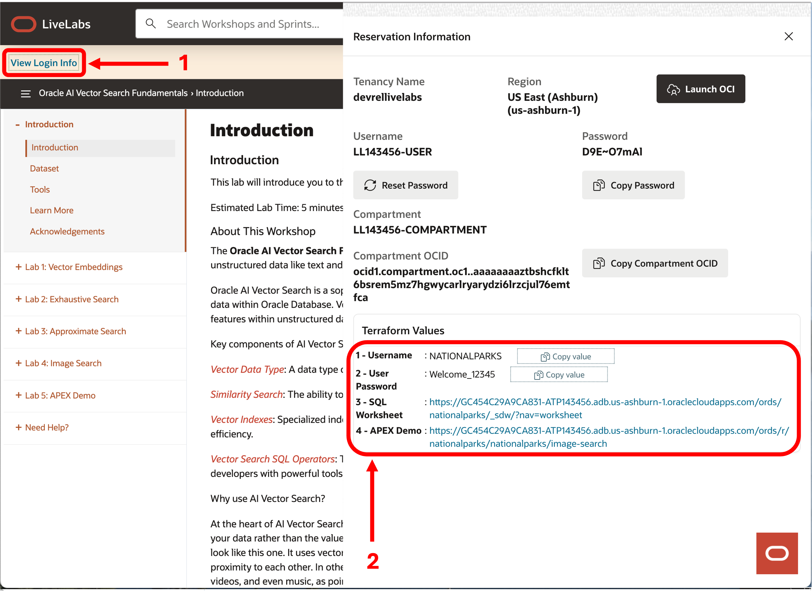
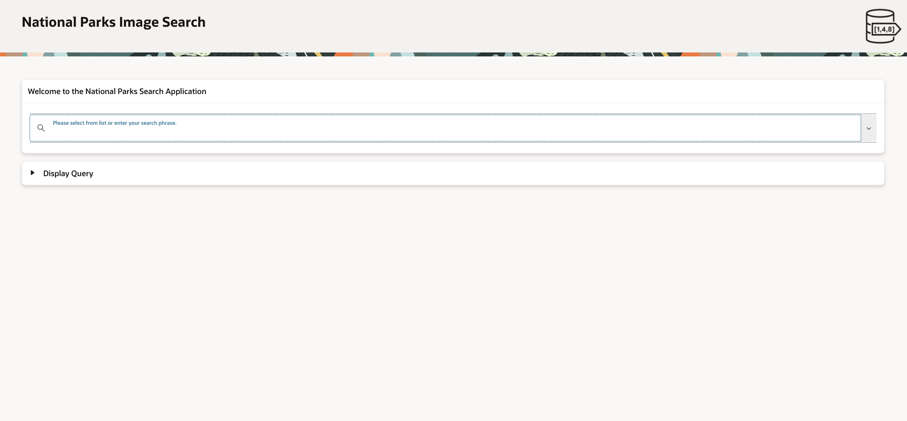
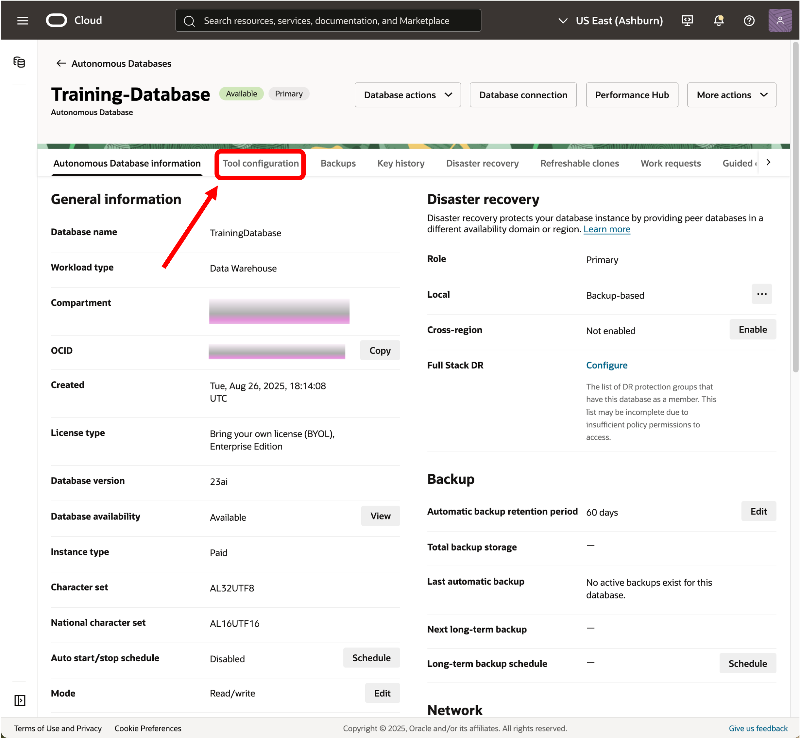
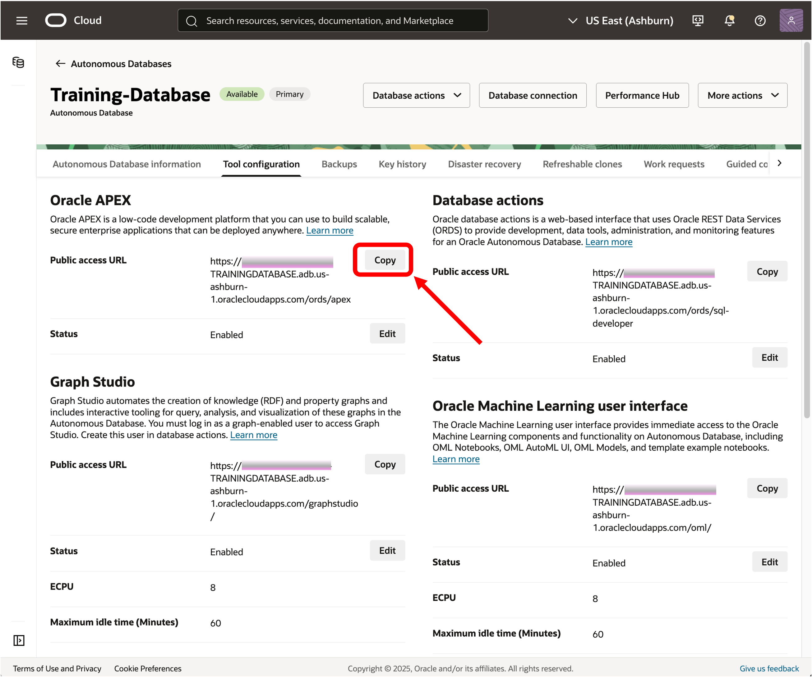
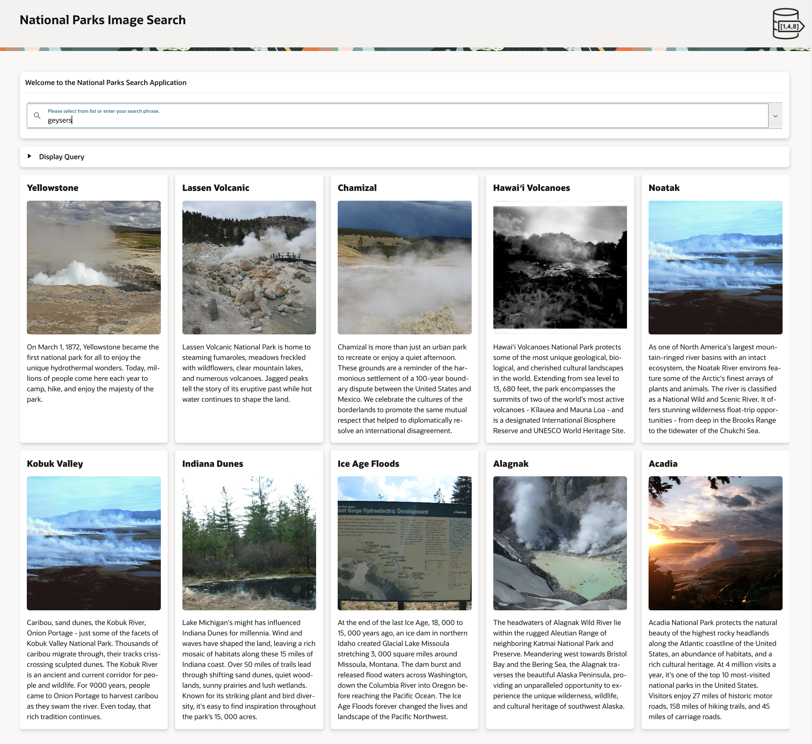
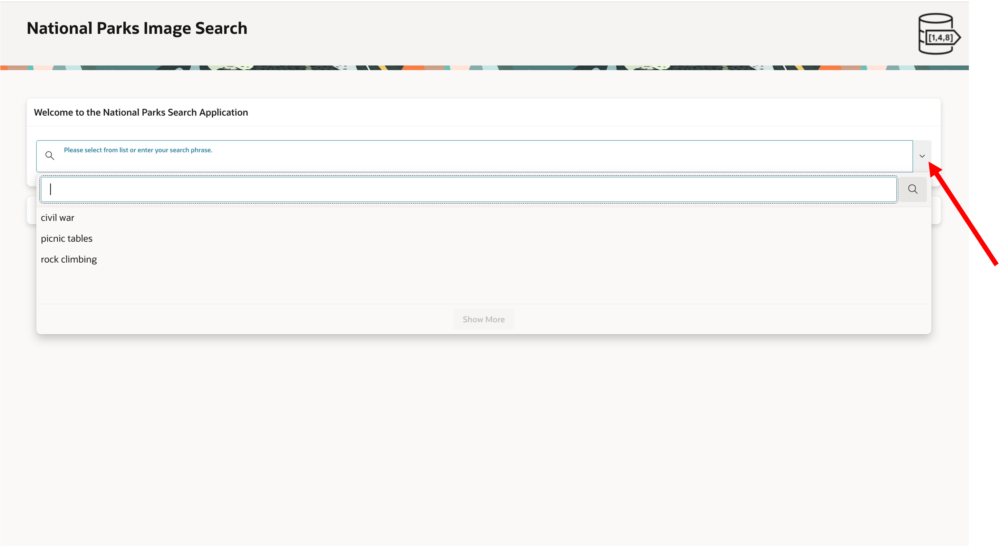

# APEX Demo Search on Images

## Introduction

This lab walks you through a demonstration of AI Vector Search in an APEX application using the SQL that we built in the previous steps in this Lab.

Estimated Lab Time: 5 minutes

### About APEX Demo

In the previous Labs, we loaded a vector embedding model in the database, looked at how vectors are created, ran exact similarity searches, and then created a vector index and ran approximate similarity searches. We also looked at how running similarity searches on images was really the same as on text. This is one of the great features of AI Vector Search. You can search all sorts of data easily. Now we are going to show you an APEX demo that uses the same dataset and queries that we were using in our SQL Developer Web labs to show how one might use AI Vector Search to write actual applications.

This demo will allow you to search for US National Parks based on some attribute like picnic tables, if for example, you wanted to find a park to have a family picnic. Perhaps you're more adventurous and would like to find parks that you could go rock climbing in on your next vacation. We have also designed the application so you can supply any search term you want.

### Objectives

In this lab, you will:

* Use an APEX application to explore US National Parks.

### Prerequisites

This lab assumes you have:
* An Oracle Account (oracle.com account)
* All previous labs successfully completed

*This is the "fold" - below items are collapsed by default*

## Task 1: Connecting to the APEX application

This lab will be run by accessing an APEX application running in our LiveLabs database. You simply need to run the APEX Demo URL in your web browser. Depending on which environment you are running in, that is an Oracle environment or sandbox, or your own environment or tenancy you will follow either Task 1a or Task 1b to determine the correct URL to use in your web browser.

### Task 1a: Running in an Oracle environment (sandbox)

In an Oracle sandbox environment you simply need to run the APEX Demo URL that can be found on the Introduction page that will be displayed after you launch the workshop. If you first click on the "View Login Info" button in the upper left corner of the page a pop up page will appear on the right. You can click on the APEX Demo link and sign in with the username "NATIONALPARKS" and the password "Welcome_12345".

See the image below for an example:

After signing in with the Username and User Password from the Terraform Values section shown in your version of the page above you should see a browser window like the following:

 

### Task 1b: Running in your Oracle environment (tenancy)

In your own tenancy environment you will need to navigate to the "Tool configuration" tab in the ADB page:

and copy the APEX "Public access URL":

You will then need to open a new browser window or tab and copy the URL into the address bar (note that your URL may have a different hostname) and replace "apex" at the end of the URL:

`https://host_name.adb.us-ashburn-1.oraclecloudapps.com/ords/apex`

with the following string:

`/r/nationalparks/nationalparks/image-search`

The resulting URL should look like this (note that your URL may have a different hostname):

`https://host_name.adb.us-ashburn-1.oraclecloudapps.com/ords/r/nationalparks/nationalparks/image-search`

Then hit enter to go to the APEX demo and sign in with the username "NATIONALPARKS" and the password "Welcome_12345".

After signing in you should see a browser window like the following:

 

## Task 2: Run the APEX demo

You can now enter any search term you would like to search on. You can pull down on a pre-created list of search terms or make up your own. The demo is designed to return the top 10 most similar park images based on the search term. Only one image per park is returned in search order, although the dataset contains many images for most parks.

The following shows searching on the term "geysers":

1. Run APEX demo:

    

2. If you would like to see a list of search terms then you can just click on the arrow to the far right of the query box:

    

3. If you would like to see the SQL that is being run then just click on the arrow next to the "Display Query" label:

    

Go ahead and experiment with different search terms. You can't hurt anything and you may be amazed at just how good AI Vector Search really is.

## Learn More

* [Oracle AI Vector Search Users Guide](https://docs.oracle.com/en/database/oracle/oracle-database/23/vecse/index.html)
* [OML4Py: Leveraging ONNX and Hugging Face for AI Vector Search](https://blogs.oracle.com/machinelearning/post/oml4py-leveraging-onnx-and-hugging-face-for-advanced-ai-vector-search)
* [Oracle Database 23ai Release Notes](https://docs.oracle.com/en/database/oracle/oracle-database/23/rnrdm/index.html)
* [Oracle Documentation](http://docs.oracle.com)

## Acknowledgements
* **Author** - Andy Rivenes, Markus Kissling, Product Managers
* **Contributors** - Sean Stacey, Product Manager
* **Last Updated By/Date** - Andy Rivenes, August 2025
