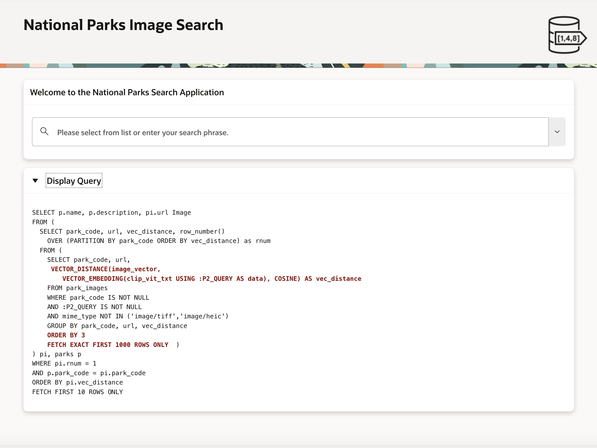

# APEX Demo Search on Images

## Introduction

This lab walks you through a demonstration of AI Vector Search in an APEX application using the SQL that we built in the previous steps in this Lab.

Estimated Lab Time: 5 minutes

### About APEX Demo

In the previous Labs, we loaded a vector embedding model in the database, looked at how vectors are created, ran exact similarity searches, and then created a vector index and ran approximate similarity searches. We also looked at how running similarity searches on images was really the same as on text. This is one of the great features of AI Vector Search. You can search all sorts of data easily. Now we are going to show you an APEX demo that uses the same dataset and queries that we were using in our SQL Developer Web labs to show how one might use AI Vector Search to write actual applications.

This demo will allow you to search for US National Parks based on some attribute like picnic tables and a general location if for example, you wanted to find a park to have a family picnic. Perhaps you're more adventurous and would like to find parks that you could go rock climbing in on your next vacation. We have also designed the application so you can supply any search term you want.


### Objectives

In this lab, you will:

* Use an APEX application to explore US National Parks.


### Prerequisites

This lab assumes you have:
* An Oracle Cloud account
* All previous labs successfully completed


*This is the "fold" - below items are collapsed by default*

## Connecting to the APEX application

This lab will be run by accessing an APEX application running in our LiveLabs database. You simply need to run the following URL in your web browser:

  ```
  <copy>http://localhost:8080/ords/apex/nationalparks/nationalparks</copy>
  ```

You should see a browser window like the following:

 


## Task 1: Run the APEX demo

You can now enter any search term you would like to search on. You can pull down on a pre-created list of search terms or make up your own. The following shows searching on the term "geysers":

1. Run APEX demo:

    

2. If you would like to see the SQL that is being run then just click on the arrow next to the "Display Query" label:

    


## Learn More

* [Oracle AI Vector Search Users Guide](https://docs.oracle.com/en/database/oracle/oracle-database/23/vecse/index.html)
* [OML4Py: Leveraging ONNX and Hugging Face for AI Vector Search](https://blogs.oracle.com/machinelearning/post/oml4py-leveraging-onnx-and-hugging-face-for-advanced-ai-vector-search)
* [Oracle Database 23ai Release Notes](https://docs.oracle.com/en/database/oracle/oracle-database/23/rnrdm/index.html)
* [Oracle Documentation](http://docs.oracle.com)

## Acknowledgements
* **Author** - Andy Rivenes, Markus Kissling, Product Managers
* **Contributors** - Sean Stacey, Product Manager
* **Last Updated By/Date** - Andy Rivenes, April 2025
