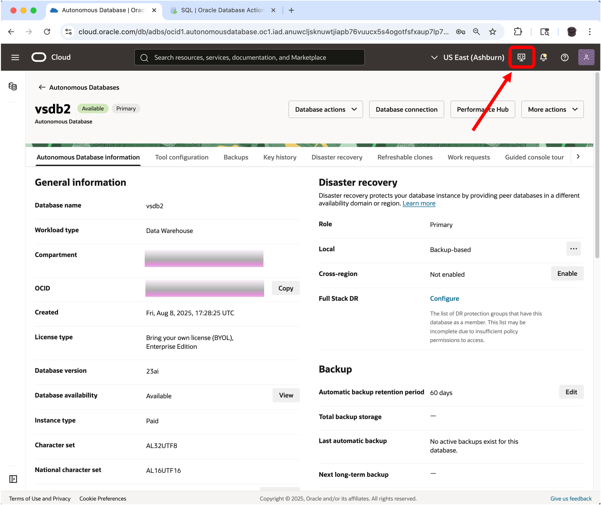
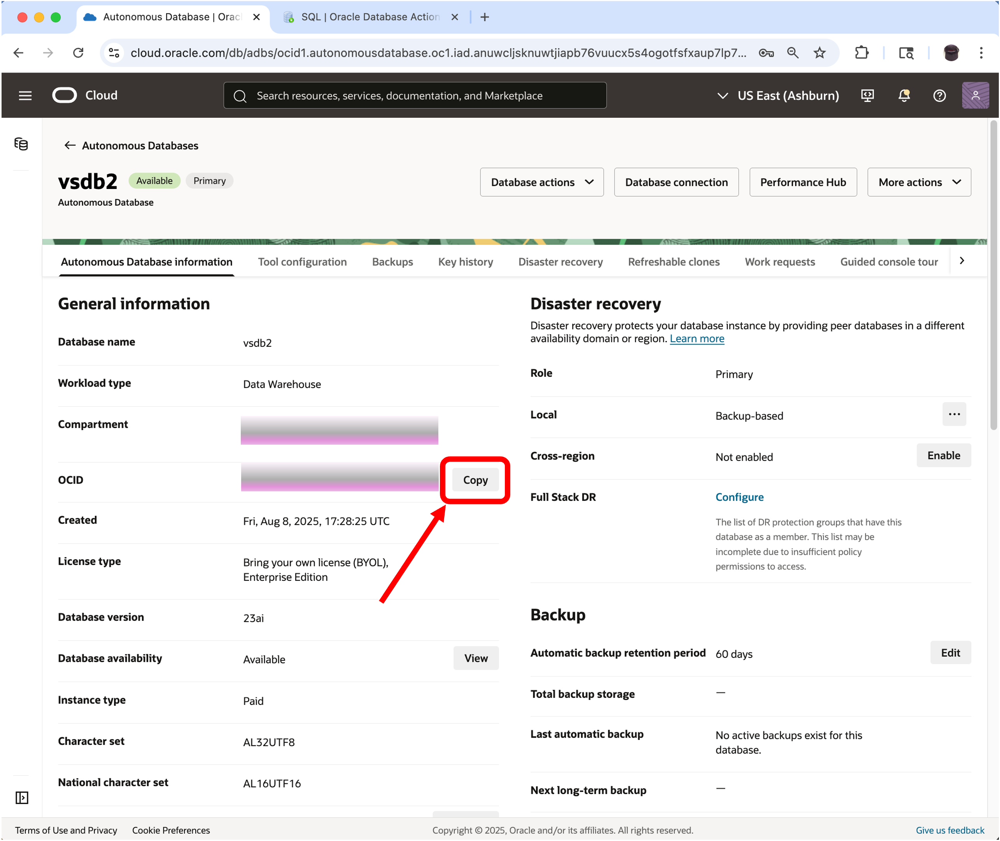

# Create and Enable a Database User in Database Actions

## Introduction

This lab walks you through the steps to get started with Database Actions. You will create the NATIONALPARKS user and provide that user the access to run the Getting Started with AI Vector Search lab. You will then load the ONNX models, create the NATIONALPARKS schema, and then setup up the APEX demo that will be used in the last lab.

Estimated time: 10 minutes

### Objectives

- Learn how to setup the required database roles in Database Actions.
- Learn how to create a database user in Database Actions.
- Load the ONNX embedding models
- Import the NATIONALPARKS schema
- Import the APEX workspace and application

### Prerequisites

- Oracle Cloud account
- Provisioned Autonomous Database

## Task 1: Login to Database Actions

[](include:adb-connect-with-sql-worksheet-body.md)

## Task 2: Create a database user

Now create the **NATIONALPARKS** user and provide Database Actions access for this user.

[](include:adb-create-user.md)

## Task 3: Grant database privileges

1. Switch back to the **SQL | Oracle Database Actions** window.

    

2. Proceed with **Grant privileges**:

```sql
<copy>
-- ADD ROLES
GRANT CONNECT TO NATIONALPARKS;
GRANT RESOURCE TO NATIONALPARKS;


-- REST ENABLE
BEGIN
    ORDS_ADMIN.ENABLE_SCHEMA(
        p_enabled => TRUE,
        p_schema => 'NATIONALPARKS',
        p_url_mapping_type => 'BASE_PATH',
        p_url_mapping_pattern => 'nationalparks',
        p_auto_rest_auth=> TRUE
    );
    -- ENABLE DATA SHARING
    C##ADP$SERVICE.DBMS_SHARE.ENABLE_SCHEMA(
            SCHEMA_NAME => 'NATIONALPARKS',
            ENABLED => TRUE
    );
    commit;
END;
/

-- QUOTA
GRANT ORDS_RUNTIME_ROLE TO nationalparks;
GRANT EXECUTE ON dbms_cloud TO nationalparks;
GRANT READ,WRITE ON directory data_pump_dir TO nationalparks;
GRANT CREATE mining model TO nationalparks;
GRANT SELECT ON sys.v_$vector_memory_pool TO nationalparks;
GRANT SELECT ON sys.v_$vector_index TO nationalparks;
</copy>
```

3. Confirm that you can login with the new user.

    This will require that you log out of the ADMIN user, click on the down error next to the ADMIN user name at the top right of the screen and click "Sign Out". You should then sign in as the NATIONALPARKS user with the password of "Welcome_12345".

    

    For details, see the ["Create Users on Autonomous Database with Database Actions"](https://docs.oracle.com/en/cloud/paas/autonomous-database/serverless/adbsb/manage-users-create.html#GUID-DD0D847B-0283-47F5-9EF3-D8252084F0C1) section in the documentation.

## Task 4: Import ONNX Models

1. Now that you are logged in as the NATIONALPARKS user bring up a Database Actions SQL worksheet.

2. Copy the ONNX models to the DATA\_PUMP\_DIR directory and load into the database by copying the script below, paste it into a SQL Dev Web window and then click on the "Run Script" button:

    ```sql
    <copy>
    begin
      dbms_cloud.get_object(
        object_uri=>'https://c4u04.objectstorage.us-ashburn-1.oci.customer-oci.com/p/EcTjWk2IuZPZeNnD_fYMcgUhdNDIDA6rt9gaFj_WZMiL7VvxPBNMY60837hu5hga/n/c4u04/b/livelabsfiles/o/labfiles/clip-vit-base-patch32_txt.onnx',
        directory_name=>'DATA_PUMP_DIR',
        file_name=>'clip-vit-base-patch32_txt.onnx'
      );
    end;
    /
    begin
      dbms_vector.load_onnx_model(directory=>'DATA_PUMP_DIR', 
        file_name=>'clip-vit-base-patch32_txt.onnx', model_name=>'clip_vit_txt',
        metadata=>JSON('{"function" : "embedding", "embeddingOutput" : "embedding" , "input": {"input": ["DATA"]}}'));
    end;
    /
    begin
      dbms_cloud.get_object(
        object_uri=>'https://c4u04.objectstorage.us-ashburn-1.oci.customer-oci.com/p/EcTjWk2IuZPZeNnD_fYMcgUhdNDIDA6rt9gaFj_WZMiL7VvxPBNMY60837hu5hga/n/c4u04/b/livelabsfiles/o/labfiles/all_MiniLM_L12_v2.onnx',
        directory_name=>'DATA_PUMP_DIR',
        file_name=>'all_MiniLM_L12_v2.onnx'
      );
    end;
    /
    </copy>
    ```

## Task 5: Import Tables into NATIONALPARKS schema

1. From the Database Actions SQL worksheet as the NATIONALPARKS user you will import the NATIONALPARKS schema in the next step.

2. Import the NATIONALPARKS tables:

    ```sql
    <copy>
    DECLARE
      l_job_state      VARCHAR2(1000);
      l_job_handle     NUMBER;
    BEGIN
      l_job_handle := DBMS_DATAPUMP.OPEN(OPERATION=>'IMPORT', JOB_MODE=>'FULL', JOB_NAME=>'TEST_DP_1', VERSION => 'LATEST');
      DBMS_DATAPUMP.ADD_FILE(HANDLE=>l_job_handle, FILENAME=>'https://c4u04.objectstorage.us-ashburn-1.oci.customer-oci.com/p/EcTjWk2IuZPZeNnD_fYMcgUhdNDIDA6rt9gaFj_WZMiL7VvxPBNMY60837hu5hga/n/c4u04/b/livelabsfiles/o/labfiles/natparks.dmp', DIRECTORY=>'DATA_PUMP_DIR');
      DBMS_DATAPUMP.START_JOB(HANDLE=>l_job_handle, SKIP_CURRENT=>0, ABORT_STEP=>0);
      DBMS_DATAPUMP.WAIT_FOR_JOB(HANDLE=>l_job_handle, JOB_STATE=>l_job_state);
      DBMS_DATAPUMP.DETACH(HANDLE=>l_job_handle);
    END;
    /
    </copy>
    ```

## Task 6: Import APEX Demo Workspace and Application

1. Go to the ADB page and click on the Developers Tools icon at the top of the page and select "Cloud Shell" to create a cloud shell environment.

    

2. Copy the APEX workspace and application files from object storage to the local directory:

    ```
    <copy>
    wget https://c4u04.objectstorage.us-ashburn-1.oci.customer-oci.com/p/EcTjWk2IuZPZeNnD_fYMcgUhdNDIDA6rt9gaFj_WZMiL7VvxPBNMY60837hu5hga/n/c4u04/b/livelabsfiles/o/labfiles/w100001.sql
    wget https://c4u04.objectstorage.us-ashburn-1.oci.customer-oci.com/p/EcTjWk2IuZPZeNnD_fYMcgUhdNDIDA6rt9gaFj_WZMiL7VvxPBNMY60837hu5hga/n/c4u04/b/livelabsfiles/o/labfiles/f114.sql
    </copy>
    ```

3. Create a wallet zip file and unzip for TNS connection to the database:

    ```
    <copy>
    oci db autonomous-database generate-wallet --autonomous-database-id <Insert your OCID here> --file adb.zip --password  Welcome_12345
    </copy>
    ```

    Don't forget that you have to insert your OCID for the autonomous-database-id above.
    The OCID can be obtained from the ADB General Information section in the ADB page:

    

    You can then unzip your zip file to get the tnsnames.ora file.

    ```
    <copy>
    unzip adb.zip
    </copy>
    ```

    You can list the tnsnames.ora file for the TNS alias' available. You should be able to use your "**Database\_name**\_low" TNS alias to connect to the database with SQLcl in the next step.

4. Connect to SQLcl with the ADMIN user using the TNS string from the tnsnames.ora file created in the previous step:

    ```sql
    sql ADMIN/Training4ADW@"insert your connect string here"
    @w100001.sql
    @f114.sql
    </copy>
    ```

You may now proceed to the next lab.

## Acknowledgements

- **Author** - Andy Rivenes, Product Manager, AI Vector Search
- **Contributors** - David Start
- **Last Updated By/Date** - Andy Rivenes, Product Manager, AI Vector Search Product Manager, August 2025
