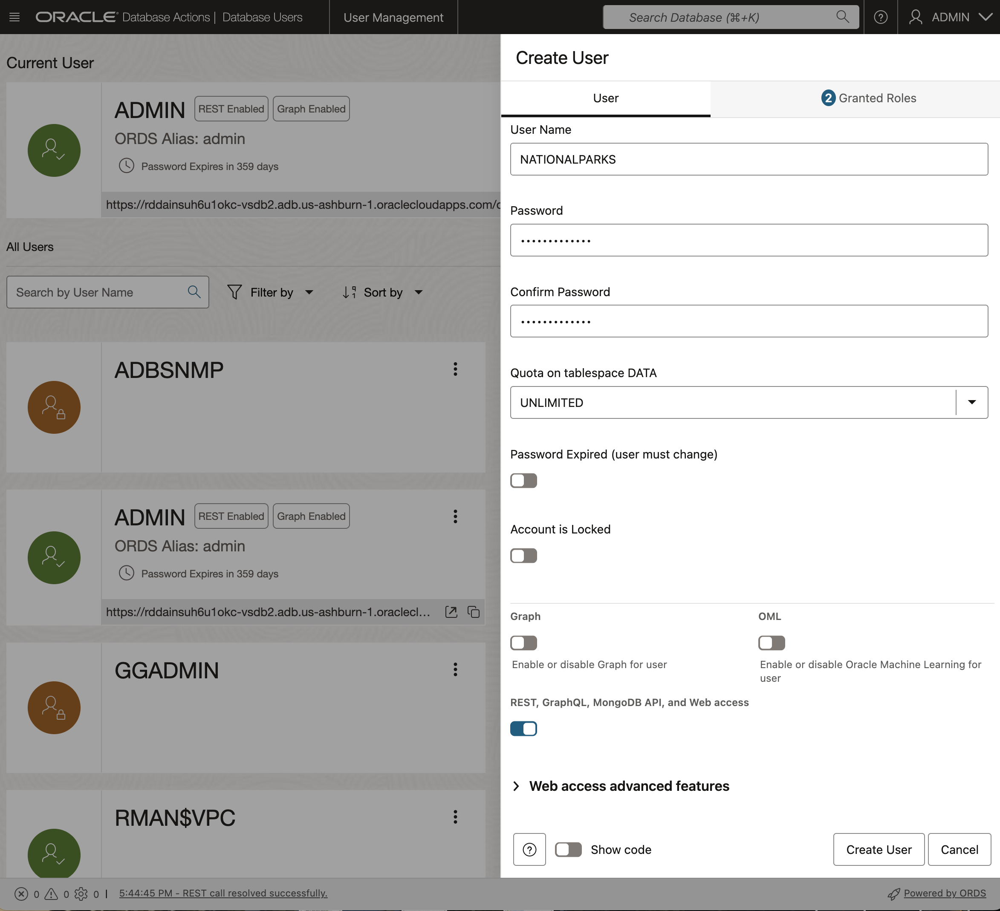

<!--
    {
        "name":"Create ADB User using Database Actions",
        "description":"Creates an ADB user using the new user database action"
    }
-->

When you create a new Autonomous Database, you automatically get an account called ADMIN that is your super administrator user. In this task we will need to create a separate new user for the lab. This section will guide you through this process using the "New User" wizard within the Database Actions set of tools.

1. Navigate to the Details page of the Autonomous Database you previously provisioned. In this example, the database name is "vsdb3", but yours may be different depending on what name you chose. Click the **Database Actions -> Database Users** button.

    

You will automatically be logged in as the ADMIN user, or you may be prompted to provide the username and password of the administrator you specified when you created the Autonomous Database instance.

2.  You can see that your ADMIN user appears as the current user. And, several other system users may already exist. On the right-hand side, click the **+ Create User** button.

    

4. The **Create User** form will appear on the right-hand side of your browser window. Use the settings below to complete the form:

- User Name: **NATIONALPARKS**
- Password:  **Welcome_12345**
- Quota on tablespace DATA: UNLIMITED

- Leave the **Graph** toggle button as off.
- Toggle the **Web Access** button to **On**.
- Leave the **OML** button as off.
- In the upper right section of the Create User dialog, select **UNLIMITED** from the drop down menu for Quota on tablespace DATA.

- Leave the **Password Expired** toggle button as off (Note: this controls whether the user is prompted to change their password when they next log in).
- Leave the **Account is Locked** toggle button as off. 

- Click **Create User** at the bottom of the form.

    
