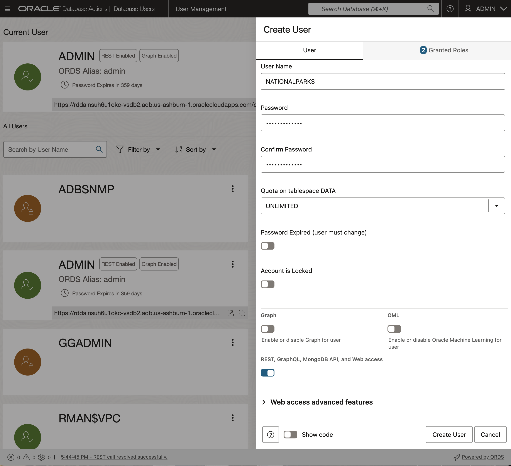

# Create and Enable a Database User in Database Actions

## Introduction

This lab walks you through the steps to get started with Database Actions. You will create the NATIONALPARKS user and provide that user the access to run the Getting Started with AI Vector Search lab. You will then load the ONNX models, create the NATIONALPARKS schema, and then setup up the APEX demo that will be used in the last lab.

Estimated time: 10 minutes

### Objectives

- Learn how to setup the required database roles in Database Actions.
- Learn how to create a database user in Database Actions.
- Load the ONNX embedding models
- Import the NATIONALPARKS schema
- Import the APEX workspace and application

### Prerequisites

- Oracle Cloud account
- Provisioned Autonomous Database

## Task 1: Login to Database Actions

Although you can connect to your Oracle Autonomous Database using desktop tools like Oracle SQL Developer, you can conveniently access the browser-based SQL Worksheet directly from your Autonomous Database console.

1. If you are not logged in to the Oracle Cloud Console, log in and select **Oracle Database** from the navigation menu and then **Autonomous Database** from the **Overview** column, make sure you are in the right compartment where your ADB is provisioned, and select your database display name, **[](var:db_display_name)** if you used the recommended name in the Create an Autonomous Database lab, in the **Display name** column.

    


    

2. In your ADB database's details page, click the **Database Actions** button and then choose the **View all database actions** option.

    

    Logging in from the OCI service console expects that you are the ADMIN user. Log in as ADMIN, or your admin user, if you are not automatically logged in.

3. The Database Actions page opens. In the **Development** box, click **SQL**.

    

4.  The first time you open SQL Worksheet, a series of pop-up informational boxes may appear, providing you a tour that introduces the main features. If not, click the Tour button (labeled with binoculars symbol) in the upper right corner. Click **Next** to take a tour through the informational boxes.

    

## Task 2: Create a database user

Now create the **NATIONALPARKS** user and provide Database Actions access for this user.

When you create a new Autonomous Database, you automatically get an account called ADMIN that is your super administrator user. In this task we will need to create a separate new user for the lab. This section will guide you through this process using the "New User" wizard within the Database Actions set of tools.

1. Navigate to the Details page of the Autonomous Database you previously provisioned. In this example, the database name is **[](var:db_name)**, but yours may be different depending on what name you chose. Click the **Database Actions -> Database Users** button.

    

  You will automatically be logged in as the ADMIN user, or you may be prompted to provide the username and password of the administrator you specified when you created the Autonomous Database instance.

2.  You can see that your ADMIN user appears as the current user. And, several other system users may already exist. On the right-hand side, click the **+ Create User** button.

    

4. The **Create User** form will appear on the right-hand side of your browser window. Use the settings below to complete the form:

- User Name: **NATIONALPARKS**
- Password:  **Welcome_12345**
- Quota on tablespace DATA: UNLIMITED

- Leave the **Graph** toggle button as off.
- Toggle the **Web Access** button to **On**.
- Leave the **OML** button as off.
- In the upper right section of the Create User dialog, select **UNLIMITED** from the drop down menu for Quota on tablespace DATA.

- Leave the **Password Expired** toggle button as off (Note: this controls whether the user is prompted to change their password when they next log in).
- Leave the **Account is Locked** toggle button as off. 

- Click **Create User** at the bottom of the form.

    

## Task 3: Grant database privileges

1. Switch back to the **SQL | Oracle Database Actions** window.

  

2. Proceed with **Grant privileges** by copying and pasting the following into the Database Actions SQL window:

    ```sql
    <copy>
    -- ADD ROLES
    GRANT CONNECT TO NATIONALPARKS;
    GRANT RESOURCE TO NATIONALPARKS;


    -- REST ENABLE
    BEGIN
      ORDS_ADMIN.ENABLE_SCHEMA(
        p_enabled => TRUE,
        p_schema => 'NATIONALPARKS',
        p_url_mapping_type => 'BASE_PATH',
        p_url_mapping_pattern => 'nationalparks',
        p_auto_rest_auth=> TRUE
      );
      -- ENABLE DATA SHARING
      C##ADP$SERVICE.DBMS_SHARE.ENABLE_SCHEMA(
        SCHEMA_NAME => 'NATIONALPARKS',
        ENABLED => TRUE
      );
      commit;
    END;
    /

    -- QUOTA
    GRANT ORDS_RUNTIME_ROLE TO nationalparks;
    GRANT EXECUTE ON dbms_cloud TO nationalparks;
    GRANT READ,WRITE ON directory data_pump_dir TO nationalparks;
    GRANT CREATE mining model TO nationalparks;
    GRANT SELECT ON sys.v_$vector_memory_pool TO nationalparks;
    GRANT SELECT ON sys.v_$vector_index TO nationalparks;
    </copy>
    ```

    Note: Run the entire script by clicking on the "Run Script" button.


3. Confirm that you can login with the new user.

  This will require that you log out of the ADMIN user, click on the down error next to the ADMIN user name at the top right of the screen and click "Sign Out". You should then sign in as the NATIONALPARKS user with the password of "Welcome_12345".

  

  For details, see the ["Create Users on Autonomous Database with Database Actions"](https://docs.oracle.com/en/cloud/paas/autonomous-database/serverless/adbsb/manage-users-create.html#GUID-DD0D847B-0283-47F5-9EF3-D8252084F0C1) section in the documentation.

## Task 4: Import ONNX Models

1. Now that you are logged in as the NATIONALPARKS user bring up a Database Actions SQL worksheet.

2. Copy the ONNX models to the DATA\_PUMP\_DIR directory and load into the database by copying the script below, paste it into a SQL Dev Web window and then click on the "Run Script" button:

    ```sql
    <copy>
    begin
      dbms_cloud.get_object(
        object_uri=>'https://c4u04.objectstorage.us-ashburn-1.oci.customer-oci.com/p/EcTjWk2IuZPZeNnD_fYMcgUhdNDIDA6rt9gaFj_WZMiL7VvxPBNMY60837hu5hga/n/c4u04/b/livelabsfiles/o/labfiles/clip-vit-base-patch32_txt.onnx',
        directory_name=>'DATA_PUMP_DIR',
        file_name=>'clip-vit-base-patch32_txt.onnx'
      );
    end;
    /
    begin
      dbms_vector.load_onnx_model(directory=>'DATA_PUMP_DIR', 
        file_name=>'clip-vit-base-patch32_txt.onnx', model_name=>'clip_vit_txt',
        metadata=>JSON('{"function" : "embedding", "embeddingOutput" : "embedding" , "input": {"input": ["DATA"]}}'));
    end;
    /
    begin
      dbms_cloud.get_object(
        object_uri=>'https://c4u04.objectstorage.us-ashburn-1.oci.customer-oci.com/p/EcTjWk2IuZPZeNnD_fYMcgUhdNDIDA6rt9gaFj_WZMiL7VvxPBNMY60837hu5hga/n/c4u04/b/livelabsfiles/o/labfiles/all_MiniLM_L12_v2.onnx',
        directory_name=>'DATA_PUMP_DIR',
        file_name=>'all_MiniLM_L12_v2.onnx'
      );
    end;
    /
    </copy>
    ```

## Task 5: Import Tables into NATIONALPARKS schema

1. From the Database Actions SQL worksheet as the NATIONALPARKS user you will import the NATIONALPARKS schema in the next step.

2. Import the NATIONALPARKS tables:

    ```sql
    <copy>
    DECLARE
      l_job_state      VARCHAR2(1000);
      l_job_handle     NUMBER;
    BEGIN
      l_job_handle := DBMS_DATAPUMP.OPEN(OPERATION=>'IMPORT', JOB_MODE=>'FULL', JOB_NAME=>'TEST_DP_1', VERSION => 'LATEST');
      DBMS_DATAPUMP.ADD_FILE(HANDLE=>l_job_handle, FILENAME=>'https://c4u04.objectstorage.us-ashburn-1.oci.customer-oci.com/p/EcTjWk2IuZPZeNnD_fYMcgUhdNDIDA6rt9gaFj_WZMiL7VvxPBNMY60837hu5hga/n/c4u04/b/livelabsfiles/o/labfiles/natparks.dmp', DIRECTORY=>'DATA_PUMP_DIR');
      DBMS_DATAPUMP.START_JOB(HANDLE=>l_job_handle, SKIP_CURRENT=>0, ABORT_STEP=>0);
      DBMS_DATAPUMP.WAIT_FOR_JOB(HANDLE=>l_job_handle, JOB_STATE=>l_job_state);
      DBMS_DATAPUMP.DETACH(HANDLE=>l_job_handle);
    END;
    /
    </copy>
    ```

## Task 6: Import APEX Demo Workspace and Application

1. Go to the ADB page and click on the Developers Tools icon at the top of the page and select "Cloud Shell" to create a cloud shell environment.

    

2. Copy the APEX workspace and application files from object storage to the local directory:

    ```
    <copy>
    wget https://c4u04.objectstorage.us-ashburn-1.oci.customer-oci.com/p/EcTjWk2IuZPZeNnD_fYMcgUhdNDIDA6rt9gaFj_WZMiL7VvxPBNMY60837hu5hga/n/c4u04/b/livelabsfiles/o/labfiles/w100001.sql
    wget https://c4u04.objectstorage.us-ashburn-1.oci.customer-oci.com/p/EcTjWk2IuZPZeNnD_fYMcgUhdNDIDA6rt9gaFj_WZMiL7VvxPBNMY60837hu5hga/n/c4u04/b/livelabsfiles/o/labfiles/f114.sql
    </copy>
    ```

3. Create a wallet zip file and unzip for TNS connection to the database:

    ```
    oci db autonomous-database generate-wallet --autonomous-database-id <Insert your OCID here> --file adb.zip --password  Welcome_12345
    ```

    Don't forget that you have to insert your OCID for the autonomous-database-id above.
    The OCID can be obtained from the ADB General Information section in the ADB page:

    

    You can then unzip your zip file to get the tnsnames.ora file.

    ```
    <copy>
    unzip adb.zip
    </copy>
    ```

    You can list the tnsnames.ora file for the TNS alias' available. You should be able to use your "**Database\_name**\_low" TNS alias to connect to the database with SQLcl in the next step.

4. Connect to SQLcl with the ADMIN user using the TNS string from the tnsnames.ora file created in the previous step:

    ```
    sql ADMIN/Training4ADW@<insert your TNS alias here>
    @w100001.sql
    @f114.sql
    ```

You may now proceed to the next lab.

## Acknowledgements

- **Author** - Andy Rivenes, Product Manager, AI Vector Search
- **Contributors** - David Start
- **Last Updated By/Date** - Andy Rivenes, Product Manager, AI Vector Search Product Manager, August 2025
