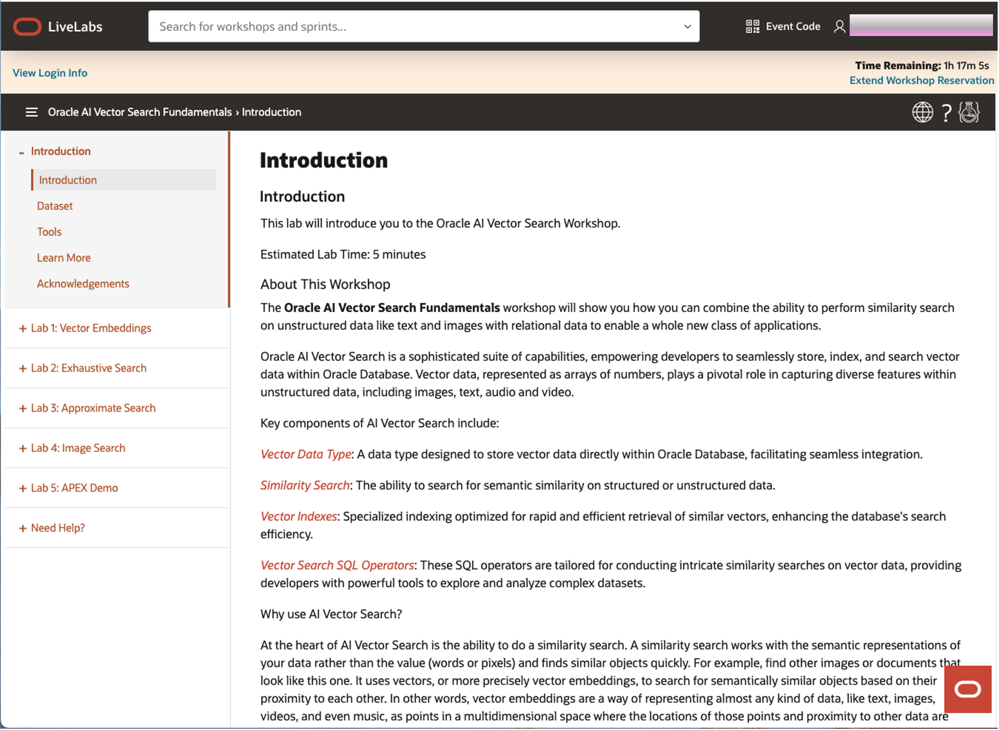

# Database Connection

## Introduction

This lab walks you through the steps to connect to your AI Vector Search database. The process is different if you are running the workshop on your own environment (tenancy) versus running the workshop in an Oracle environment (sandbox).

Estimated Lab Time: 5 minutes

### Objectives

In this lab, you will:
* Connect to the NATIONALPARKS user

### Prerequisites

This lab assumes you have:
* An Oracle Account (oracle.com account)
* All previous labs successfully completed

## Task 1: Connecting to your Oracle AI Vector Database

The lab environment is run in Oracle Autonomous Database (ADB) 23ai which includes AI Vector Search. We will be running the lab exercises using SQL Developer Web. The URL to access SQL Developer Web can be found on the Introduction page that should now be displayed after you clicked on the launch the workshop button.

See the image below for an example:

If you click on the "View Login Info" button in the upper left corner of the Introduction page a pop up page will appear on the right. You can click on the SQL Worksheet link and sign in with the username "NATIONALPARKS" and the password "Welcome_12345".

See the image below for an example:

After signing in you should see a browser window like the following:

You may now **proceed to the next lab**

## Learn More

* [Oracle AI Vector Search Users Guide](https://docs.oracle.com/en/database/oracle/oracle-database/26/vecse/index.html)
* [OML4Py: Leveraging ONNX and Hugging Face for AI Vector Search](https://blogs.oracle.com/machinelearning/post/oml4py-leveraging-onnx-and-hugging-face-for-advanced-ai-vector-search)
* [Oracle Database 26ai Release Notes](https://docs.oracle.com/en/database/oracle/oracle-database/26/rnrdm/index.html)
* [Oracle Documentation](http://docs.oracle.com)

## Acknowledgements
* **Author** - Andy Rivenes, Product Manager, AI Vector Search
* **Contributors**
* **Last Updated By/Date** - Andy Rivenes, Product Manager, AI Vector Search, January 2026
