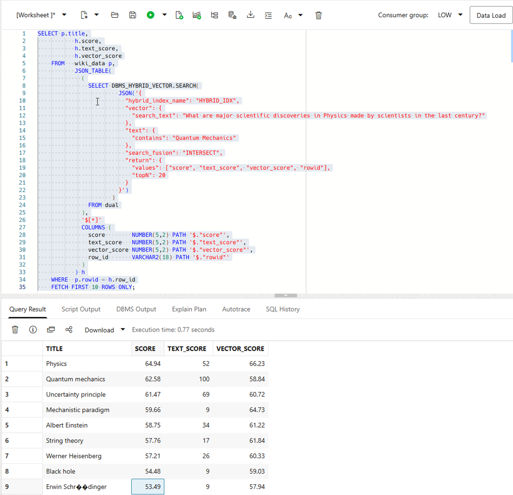
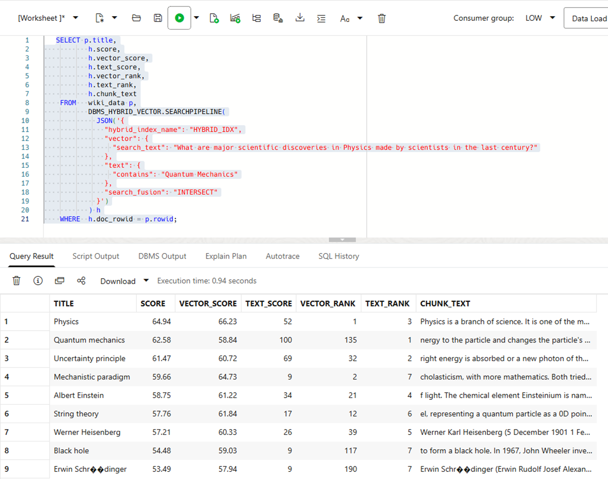
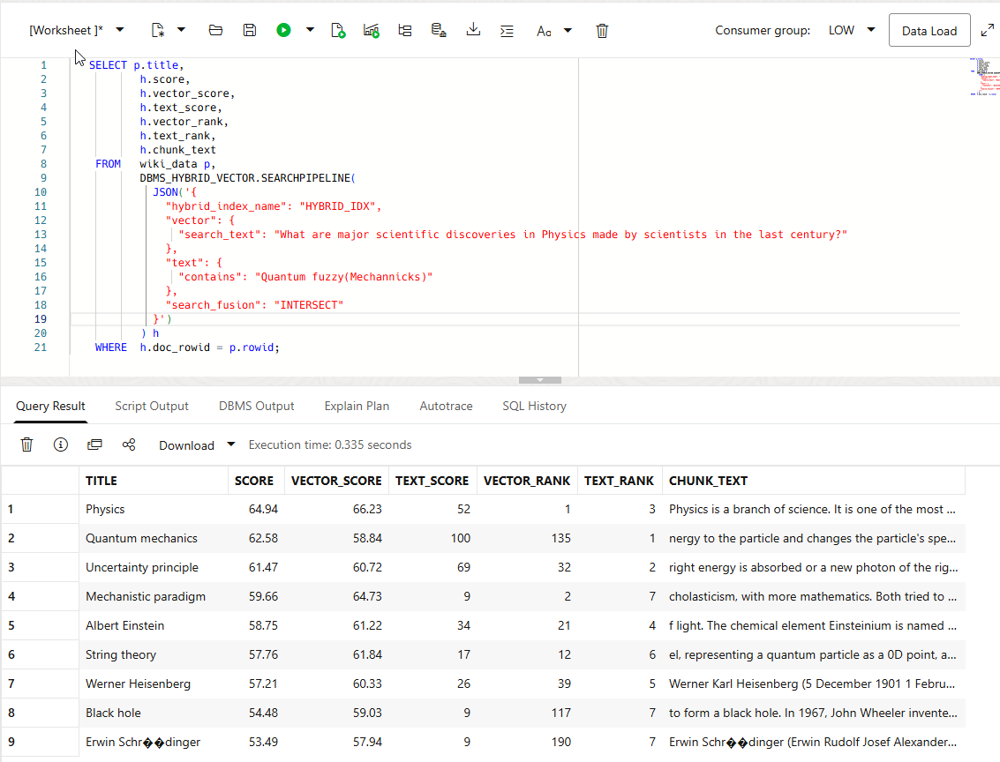
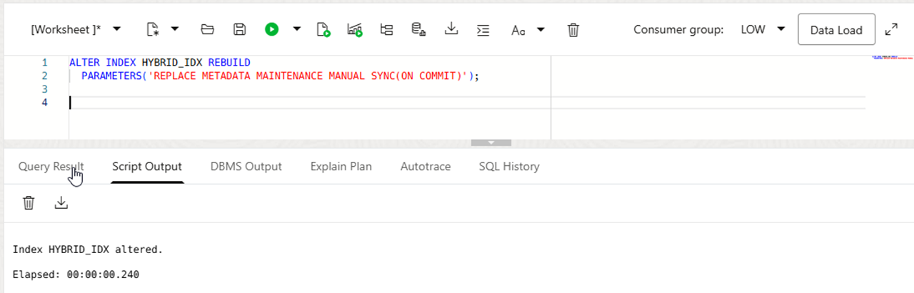
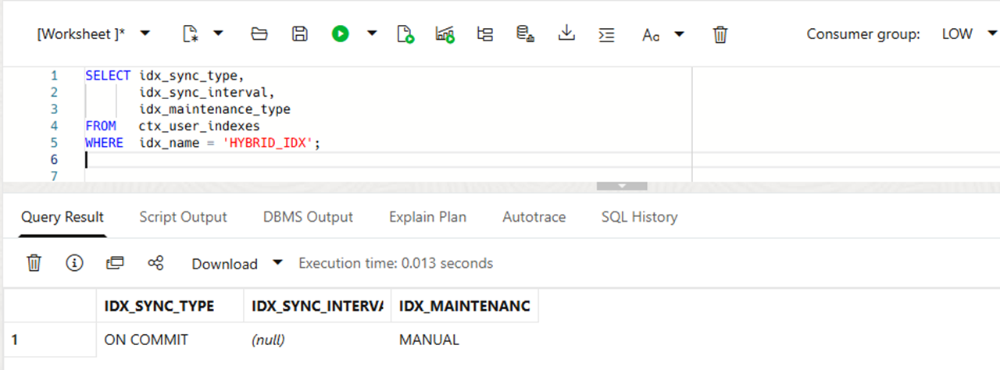
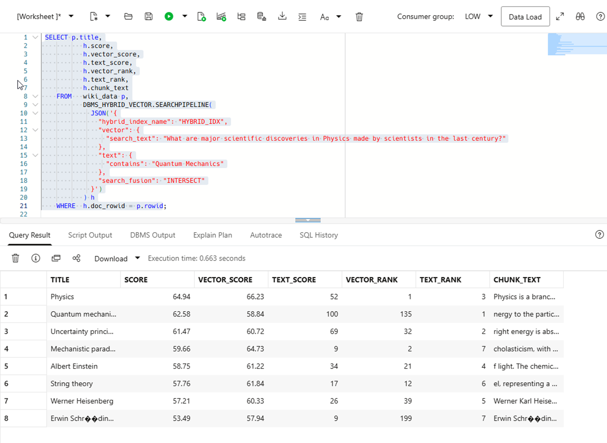

# Combine INTERSECT Fusion and Fuzzy Search

## Introduction


The implementation of a hybrid vector index leverages both an Oracle AI Vector Search vector index, but also the existing capabilities of an Oracle Text search index. By integrating traditional keyword-based text search with vector-based similarity search, you can improve the overall search experience and provide users with more accurate information.

In the previous lab, you ran vector-only similarity searches against `HYBRID_IDX`. In this lab you will investigate further capabilities and
demomstrate hybrid search. For hybrid search, Oracle combines the keyword and vector result sets into a single ranked result set. Fusion determines which results are retained—for example, UNION (the default) keeps results returned by either search, while INTERSECT keeps only results returned by both the text and vector searches.

This lab adds a keyword requirement to the semantic search and uses `search_fusion: INTERSECT` to retain only results that match both the semantic and text searches. 

You can use CONTAINS query operators to specify query expressions for full-text search, such as OR (|), AND (&), STEM ($), MINUS (-), and so on. For a complete list of all such operators to use, see [Oracle Text Reference](https://docs.oracle.com/en/database/oracle/oracle-database/26/ccref/oracle-text-contains-query-operators.html#GUID-6410B783-FC9A-4C99-B3AF-9E0349AA43D1)
In this lab, we use Oracle Text fuzzy matching operator. Fuzzy matching expands a keyword to similarly spelled terms in the index. It helps when a user misspells a search term.

You can maintain a hybrid vector index using the same general operations as an Oracle Text index, including synchronization, optimization, and automatic maintenance.

By default, a hybrid vector index uses MAINTENANCE AUTO. In this mode, changes to the base table—INSERT, UPDATE, and DELETE operations—are synchronized to the index asynchronously in the background at Oracle-managed intervals.

If your application requires a different synchronization policy, configure MAINTENANCE MANUAL and select a SYNC mode such as MANUAL, EVERY, or ON COMMIT. You can define these settings when creating the index or change them later with ALTER INDEX.

In this lab, you change the synchronization policy to ON COMMIT. Consequently, after a transaction modifies the indexed source text and commits, Oracle synchronizes the hybrid vector index as part of commit processing, making the change available to subsequent searches.


### Objectives

In this lab, you will:

- Run a document-level hybrid query with `INTERSECT` fusion.
- Use `DBMS_HYBRID_VECTOR.SEARCHPIPELINE` to inspect scores, ranks and chunk text.
- Add `fuzzy()` to the Oracle Text condition.
- Compare the text, vector and the final scores returned by hybrid search.
- Update an

Estimated Time: xx minutes

### Prerequisites

- Complete the lab that created `HYBRID_IDX`.
- Complete the vector-only similarity-search lab.
- Connect as the owner of `WIKI_DATA` and `HYBRID_IDX`.

## Task 1: Run an INTERSECT Hybrid Query

Suppose that you want articles related to major discoveries in physics, but only when the document also matches the terms `Quantum Mechanics`.

1. Run the query.

    ```sql[]
    <copy>
    SELECT p.title,
           h.score,
           h.text_score,
           h.vector_score
    FROM   wiki_data p,
           JSON_TABLE(
             (
               SELECT DBMS_HYBRID_VECTOR.SEARCH(
                        JSON('{
                          "hybrid_index_name": "HYBRID_IDX",
                          "vector": {
                            "search_text": "What are major scientific discoveries in Physics made by scientists in the last century?""
                          },
                          "text": {
                            "contains": "Quantum Mechanics"
                          },
                          "search_fusion": "INTERSECT",
                          "return": {
                            "values": ["score", "text_score", "vector_score", "rowid"],
                            "topN": 20
                          }
                        }')
                      )
               FROM dual
             ),
             '$[*]'
             COLUMNS (
               score        NUMBER(5,2) PATH '$."score"',
               text_score   NUMBER(5,2) PATH '$."text_score"',
               vector_score NUMBER(5,2) PATH '$."vector_score"',
               row_id       VARCHAR2(18) PATH '$."rowid"'
             )
           ) h
    WHERE  p.rowid = h.row_id
    FETCH FIRST 10 ROWS ONLY;
    </copy>
    ```

2. Inspect the results.

    `INTERSECT` retains only rows common to the text and vector result sets. A qualifying result has both  `text_score > 0` and `vector_score > 0`. Tso the query can return fewer than ten rows. The final `score` is calculated by the configured hybrid-search scorer; interpret it as the ranking value for this result set rather than as the same scale as either component score.

    Compare the results with the `VECTOR_ONLY` query from the previous lab. A strong semantic match does not qualify unless the document also satisfies the Oracle Text condition.
    See the image below:

    

## Task 2: Inspect Ranks and Chunk Text with SEARCHPIPELINE

`DBMS_HYBRID_VECTOR.SEARCHPIPELINE` returns a pipeline of result records. It avoids manual `JSON_TABLE` parsing and exposes score, rank, and chunk fields for use in SQL.

    ```sql[]
    <copy>
    SELECT p.title,
           h.score,
           h.vector_score,
           h.text_score,
           h.vector_rank,
           h.text_rank,
           h.chunk_text
    FROM   wiki_data p,
           DBMS_HYBRID_VECTOR.SEARCHPIPELINE(
             JSON('{
               "hybrid_index_name": "HYBRID_IDX",
               "vector": {
                 "search_text": "What are major scientific discoveries in Physics made by scientists in the last century?"
               },
               "text": {
                 "contains": "Quantum Mechanics"
               },
               "search_fusion": "INTERSECT"
             }')
           ) h
    WHERE  h.doc_rowid = p.rowid;
    </copy>
    ```

2. Compare the rank columns.

    `TEXT_RANK` measures keyword relevance. `VECTOR_RANK` measures semantic relevance. A row can rank highly for one signal and lower for the other, but `INTERSECT` requires both signals to match.

    `CHUNK_TEXT` contains the passage that matched. In a retrieval-augmented generation workflow, this is the text you would provide to an LLM as supporting context.
    See the image below:

    


## Task 3: Add Fuzzy Matching to the Text Filter

Oracle Text `fuzzy()` expands a term to similarly spelled terms that exist in the index. This helps recover matches when a search term contains a typo.

1. Run the query with a misspelled form of `Mechanics`.

    ```[]
    <copy>
     SELECT p.title,
           h.score,
           h.vector_score,
           h.text_score,
           h.vector_rank,
           h.text_rank,
           h.chunk_text
    FROM   wiki_data p,
           DBMS_HYBRID_VECTOR.SEARCHPIPELINE(
             JSON('{
               "hybrid_index_name": "HYBRID_IDX",
               "vector": {
                 "search_text": "What are major scientific discoveries in Physics made by scientists in the last century?"
               },
               "text": {
                 "contains": "Quantum fuzzy(Mechannicks)"
               },
               "search_fusion": "INTERSECT"
             }')
           ) h
    WHERE  h.doc_rowid = p.rowid;
    </copy>
    ```

2. Inspect the results.

    Oracle Text expands `Mechannicks` only to similar terms that are present in the index. Therefore, the exact rows and scores depend on the indexed content and its language configuration. `INTERSECT` still requires both a text match and a vector match; fuzzy matching changes only the text-search candidates.

    Compare the results with Task 1. If the index contains `Mechanics` and it meets the fuzzy threshold, the misspelled query returns the document.

    See the image below:

    

## Task 4: Update a document and search again

By default, a hybrid vector index runs in an automatic maintenance mode (MAINTENANCE AUTO), which means that your DMLs are automatically synchronized into the index in the background at optimal intervals. To make it more predictable, we change the maintenance mode to manual with sync(on COMMIT). 

1. Run the following ALTER INDEX command to change the synchronisation mode.

 ```[]
    <copy>
ALTER INDEX HYBRID_IDX REBUILD
  PARAMETERS('REPLACE METADATA MAINTENANCE MANUAL SYNC(ON COMMIT)');
</copy>
    ```
With METADATA after REPLACE the REBUILD operation updates the index’s synchronization metadata rather than rebuilding all index data. Therefore the rebuild is fast.
After this change, inserts, updates, and deletes to the base table are incorporated into the index immediately after COMMIT, rather than being synchronized at Oracle-managed background intervals.

   See the image below:

    

  

2.  Check the status with `ctx_user_indexes` view.

 ```[]
    <copy>
SELECT idx_sync_type,
       idx_sync_interval,
       idx_maintenance_type
FROM   ctx_user_indexes
WHERE  idx_name = 'HYBRID_IDX';
</copy>
    ```

       See the image below:
 


3. Update the column text and COMMIT.

 ```[]
    <copy>
UPDATE wiki_data SET text=' ' WHERE title = 'Black hole';
commit;  
</copy>
```
       See the image below:
 

4. Run the query from Task 2 again and compre the results
   
 ```[]
 <copy>
    SELECT p.title,
           h.score,
           h.vector_score,
           h.text_score,
           h.vector_rank,
           h.text_rank,
           h.chunk_text
    FROM   wiki_data p,
           DBMS_HYBRID_VECTOR.SEARCHPIPELINE(
             JSON('{
               "hybrid_index_name": "HYBRID_IDX",
               "vector": {
                 "search_text": "What are major scientific discoveries in Physics made by scientists in the last century?"
               },
               "text": {
                 "contains": "Quantum Mechanics"
               },
               "search_fusion": "INTERSECT"
             }')
           ) h
    WHERE  h.doc_rowid = p.rowid;
    </copy>
    ```
See the image below:

    

We received the expected result - only 8 rows without the document with the title 'Black hole'.

## Wrap-up

This lab used three hybrid retrieval patterns:

- `VECTOR_ONLY` returns rows that are semantically close to the question.
- `INTERSECT` returns rows that are semantically close and match the text condition.
- `INTERSECT` with `fuzzy()` returns rows that meet both conditions when the text term is misspelled.

`UNION` broadens recall by retaining rows from either search signal. `TEXT_ONLY` returns keyword-driven results. Both use the same JSON query structure with a different `search_fusion` value.

We also demonstrated the index maintenance of hybrid vector index and changed it to SYNC(ON COMMIT).

## Learn More

- [DBMS_HYBRID_VECTOR](https://docs.oracle.com/en/database/oracle/oracle-database/26/arpls/dbms_hybrid_vector1.html)
- [Query Hybrid Vector Indexes: End-to-End Example](https://docs.oracle.com/en/database/oracle/oracle-database/26/vecse/query-hybrid-vector-indexes-end-end-example.html)
- [Oracle Text CONTAINS Query Operators](https://docs.oracle.com/en/database/oracle/oracle-database/26/ccref/oracle-text-CONTAINS-query-operators.html)

## Acknowledgements

* **Author** - TODO
* **Last Updated By/Date** - TODO
