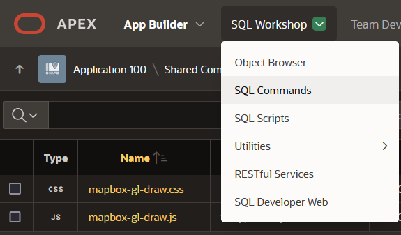
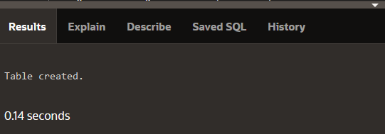
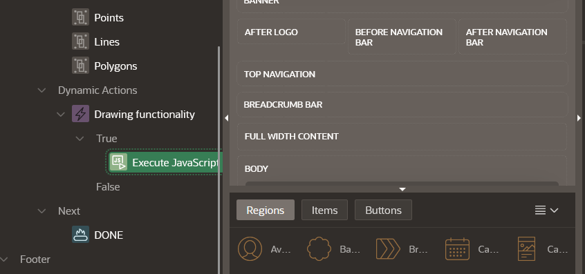
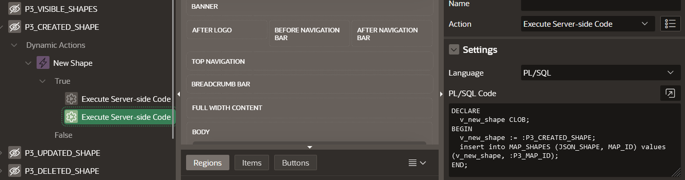
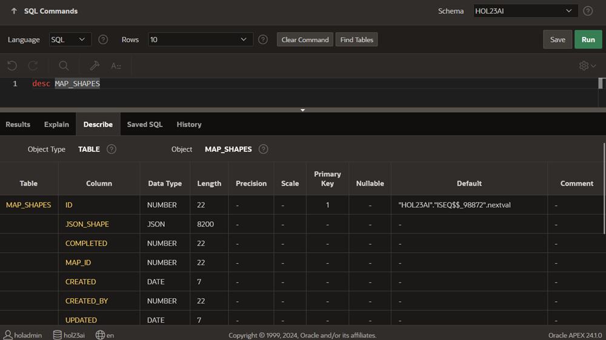
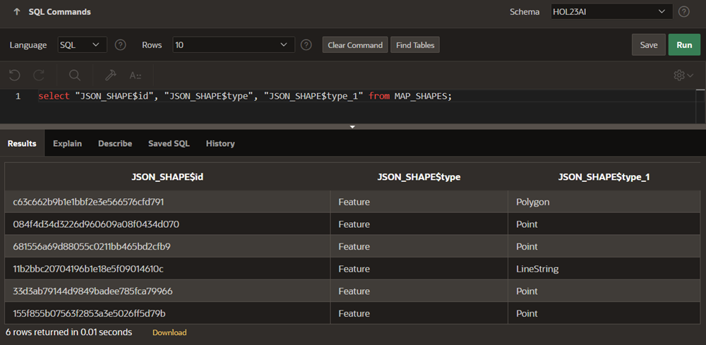
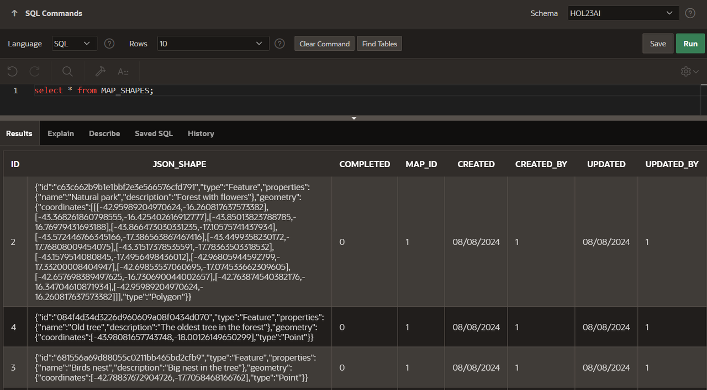

# Prepare APEX application for spatial JSON data

## Introduction

Estimated Time: 60 minutes

### Objectives

In this lab, you will:

- Prepare APEX application schema for spatial data
- Create in-database JSON components for advanced retrieval techniques

### Prerequisites

This lab assumes you have:
* Completed the previous labs of this workshop.
* Experience with Oracle Database features, SQL, and PL/SQL.
* Experience with Oracle APEX low-code development.
* Basic experience with JSON document format.

## Task 1: Create application schema objects

1. Navigate to SQL Workshop > **SQL Commands**.

    

2. Create the required schema objects.

    **NOTE:** For each DDL execution check the Results tab for errors.

    

3. Create a table for maps.

    ```sql
    <copy>
    CREATE TABLE "MAPS"
    ("ID" NUMBER GENERATED BY DEFAULT ON NULL AS IDENTITY (CACHE 5) PRIMARY KEY,
    "NAME" VARCHAR2(250) NOT NULL ENABLE,
    "ISCURRENT" NUMBER default 1 NOT NULL ENABLE,
    "ISPUBLIC" NUMBER default 0 NOT NULL ENABLE,
    "CENTER_LON" NUMBER default -3.7038,
    "CENTER_LAT" NUMBER default 40.4168,
    "ZOOM_LEVEL" NUMBER default 5,
    "CREATED" DATE NOT NULL ENABLE,
    "CREATED_BY" NUMBER NOT NULL ENABLE,
    "UPDATED" DATE NOT NULL ENABLE,
    "UPDATED_BY" NUMBER NOT NULL ENABLE);
    </copy>
    ```

4. Create a trigger for the maps table.

    ```sql
    <copy>
    CREATE OR REPLACE EDITIONABLE TRIGGER "MAPS_BIU"
    before insert or update
    on "MAPS"
    for each row
    begin
    if inserting then
      :new.created := SYSDATE;
      :new.iscurrent := 0;
      select ID into :new.created_by from APPUSER where lower(EMAIL) = lower(NVL(SYS_CONTEXT('APEX$SESSION','APP_USER'),user));
    end if;
    :new.updated := SYSDATE;
    select ID into :new.updated_by from APPUSER where lower(EMAIL) = lower(NVL(SYS_CONTEXT('APEX$SESSION','APP_USER'),user));
    end;
    /
    </copy>
    ```

5. Create a table for the object shapes.

    ```sql
    <copy>
    CREATE TABLE "MAP_SHAPES"
    ("ID" NUMBER GENERATED BY DEFAULT ON NULL AS IDENTITY (CACHE 5) PRIMARY KEY,
    "JSON_SHAPE" JSON NOT NULL ENABLE,
    "MAP_ID" NUMBER NOT NULL ENABLE,
    "CREATED" DATE NOT NULL ENABLE,
    "CREATED_BY" NUMBER NOT NULL ENABLE,
    "UPDATED" DATE NOT NULL ENABLE,
    "UPDATED_BY" NUMBER NOT NULL ENABLE,
    CONSTRAINT MAP_ID_FK FOREIGN KEY (MAP_ID) REFERENCES MAPS(ID) ON DELETE CASCADE);
    </copy>
    ```

6. Create a trigger for the object shapes table.

    ```sql
    <copy>
    CREATE OR REPLACE EDITIONABLE TRIGGER "MAP_SHAPES_BIU"
    before insert or update
    on "MAP_SHAPES"
    for each row
    begin
    if inserting then
    :new.created := SYSDATE;
    select ID into :new.created_by from APPUSER where lower(EMAIL) = lower(NVL(SYS_CONTEXT('APEX$SESSION','APP_USER'),user));
    end if;
    :new.updated := SYSDATE;
    select ID into :new.updated_by from APPUSER where lower(EMAIL) = lower(NVL(SYS_CONTEXT('APEX$SESSION','APP_USER'),user));
    end;
    /
    </copy>
    ```

7. Create an audit table to store deleted object shapes.

    ```sql
    <copy>
    CREATE TABLE "MAP_SHAPES_AUDIT"
    ("ID" NUMBER GENERATED BY DEFAULT ON NULL AS IDENTITY (CACHE 5) PRIMARY KEY,
    "JSON_SHAPE" JSON NOT NULL ENABLE,
    "CREATED" DATE NOT NULL ENABLE,
    "CREATED_BY" NUMBER NOT NULL ENABLE,
    "UPDATED" DATE NOT NULL ENABLE,
    "UPDATED_BY" NUMBER NOT NULL ENABLE,
    "DELETED" DATE NOT NULL ENABLE,
    "DELETED_BY" NUMBER NOT NULL ENABLE);
    </copy>
    ```

8. Create a trigger to send deleted shapes to the audit table.

    ```sql
    <copy>
    CREATE OR REPLACE TRIGGER "MAP_SHAPES_BD"
    BEFORE DELETE
    ON "MAP_SHAPES"
    FOR EACH ROW
    DECLARE
    v_userid number;
    BEGIN
    SELECT id INTO v_userid FROM APPUSER where lower(EMAIL) = lower(NVL(SYS_CONTEXT('APEX$SESSION','APP_USER'),user));
    INSERT INTO "MAP_SHAPES_AUDIT"
    ( JSON_SHAPE, CREATED, CREATED_BY, UPDATED, UPDATED_BY, DELETED, DELETED_BY )
    VALUES
    ( :old.JSON_SHAPE, :old.CREATED, :old.CREATED_BY, :old.UPDATED, :old.UPDATED_BY, sysdate, v_userid );
    END;
    /
    </copy>
    ```

9. Create a view to extract relational data from JSON fields.

    ```sql
    <copy>
    create or replace editionable view V_GEOM_LAT_LON as
    with COORDINATES as 
      (select rownum as N, ID, JSON_SHAPE, jt.*
        from MAP_SHAPES,
        json_table(MAP_SHAPES.JSON_SHAPE, '$' columns (
                      shape_id varchar2(128) path '$.id',
                      geometry_type varchar2(128) path '$.geometry.type',
                      nested path '$.geometry.coordinates[*][*][*]' columns(
                          coordinate number path '$[*,*]'
                      ))
                  ) jt)
      select lon.ID, lon.SHAPE_ID, lon.GEOMETRY_TYPE, lon.LON, lat.LAT from
        (select c.N, c.ID, c.SHAPE_ID, c.GEOMETRY_TYPE, c.COORDINATE as LON from COORDINATES c where MOD(c.N,2)=1) lon
        left join
        (select c.N, c.ID, c.SHAPE_ID, c.GEOMETRY_TYPE, c.COORDINATE as LAT from COORDINATES c where MOD(c.N,2)=0) lat
        on lon.N = lat.N - 1
      order by lon.ID desc;
    </copy>
    ```


## Task 2: Review APEX application logic

1. Review **Shape Creator** page to understand application logic.

2. This is the SQL query for the Polygons layer that uses Oracle JSON native support to extract geometry shapes from GeoJSON obejects and relational records like `name` and `description` from JSON document fields.

    ```sql
    <copy>
    SELECT ms.ID, DBMS_RANDOM.VALUE() as color,
        trim(BOTH '"' from ms.JSON_SHAPE.properties.name) as shapename,
        trim(BOTH '"' from ms.JSON_SHAPE.properties.description) as shapedesc,
        jt.SDO_SHAPE
    FROM   MAP_SHAPES ms,
        JSON_TABLE(JSON_SHAPE, '$'
            COLUMNS (SDO_SHAPE SDO_GEOMETRY PATH '$.geometry')
        ) jt,
        MAPS m
    WHERE m.ID = :P403_MAP_ID AND ms.MAP_ID = m.ID
   </copy>
    ```

3. The JavaScript code that enables APEX standard map region to draw and edit geometrical shapes is under Dynamic Actions.

    

4. The JavaScript external libraries are using some APEX page items to retrieve and push records from an into the database table.

    

5. Each operation is performed by a Dynamic Action defined on the APEX page item.

    ```sql
    <copy>
    DECLARE
      v_new_shape CLOB;
    BEGIN
      v_new_shape := :P403_CREATED_SHAPE;
      insert into MAP_SHAPES (JSON_SHAPE, MAP_ID) values (v_new_shape, :P403_MAP_ID);
    END;
    </copy>
    ```

6. Run the application and create a map with some shapes.

7. Edit the shapes and add some custom names, descriptions.

8. Edit the shapes to familiarize with the basic map controls.


## Task 3: Work with in-database JSON tools

1. Navigate to SQL Workshop > **SQL Commands**.

    

2. Create a search index for your GeoJSON documents. Use the SQL Workshop > SQL Commands for these steps.

    **NOTE:** A JSON search index is a general index for ad hoc queries and full-text search. It can improve the performance of both ad hoc structural queries, that is, queries that you might not anticipate or use regularly, and full-text search. It is an Oracle Text index that is designed specifically for use with JSON data. 

    ```sql
    <copy>
    CREATE SEARCH INDEX json_MAP_SHAPES_src_idx ON MAP_SHAPES (JSON_SHAPE) FOR JSON;
    </copy>
    ```

3. Create a Data Guide for your GeoJSON documents. A JSON data guide lets you discover information about the structure and content of JSON documents stored in Oracle Database.

    **NOTE:** JSON data-guide information can be saved persistently as part of the JSON search index infrastructure, and this information is updated automatically as new JSON content is added.

    ```sql
    <copy>
    ALTER INDEX json_MAP_SHAPES_src_idx rebuild parameters ( 'dataguide on' );
    </copy>
    ```

4. You can project JSON fields from your data as non-JSON columns in a database view or as non-JSON virtual columns added to the same table that contains the JSON column. 

    **NOTE:** You can specify a preferred name for such a column.

    ```sql
    <copy>
    BEGIN
    DBMS_JSON.add_virtual_columns('MAP_SHAPES', 'JSON_SHAPE', 100);
    END;
    /
    </copy>
    ```

5. Describe `MAP_SHAPES` table after these operations.

    ```sql
    <copy>
    desc MAP_SHAPES
    </copy>
    ```

6. Query the virtual columns that have beed added to the original table.

    ```sql
    <copy>
    select "JSON_SHAPE$id", "JSON_SHAPE$type", "JSON_SHAPE$type_1" from MAP_SHAPES;
    </copy>
    ```

7. Use SQL Workshop to describe map shapes table attributes.

    

8. Query map shapes table virtual columns.

    

9. Use SQL Commands to select records from the map shapes table to understand the GeoJSON format and fields.

    

10. Using a JSON editor to format the values in a pretty format you can understand the structure better. This is a polygon shape.

    ```json
    <copy>
    {
      "geometry": {
        "coordinates": [
          [
            [
              -42.95989204970624,
              -16.260817637573382
            ],
            [
              -43.368261860798555,
              -16.425402616912777
            ],
            [
              -42.657698389497625,
              -16.730690044002657
            ],
            [
              -42.763874540382176,
              -16.34704610871934
            ],
            [
              -42.95989204970624,
              -16.260817637573382
            ]
          ]
        ],
        "type": "Polygon"
      },
      "id": "c63c662b9b1e1bbf2e3e566576cfd791",
      "properties": {
        "description": "Forest with flowers",
        "name": "Natural park"
      },
      "type": "Feature"
    }
    </copy>
    ```

11. This is a line shape.

    ```json
    <copy>
    {
      "geometry": {
        "coordinates": [
          [
            -45.05891287872143,
            -16.323533018671256
          ],
          [
            -44.25850804898013,
            -18.29618206806329
          ],
          [
            -44.01348616232508,
            -19.270453242916034
          ],
          [
            -43.85013823788785,
            -19.578553270042093
          ],
          [
            -43.90731001144053,
            -19.832293386485162
          ]
        ],
        "type": "LineString"
      },
      "id": "11b2bbc20704196b1e18e5f09014610c",
      "properties": {
        "description": "Big river running to the sea",
        "name": "The river"
      },
      "type": "Feature"
    }
    </copy>
    ```

12. This is a point shape.

    ```json
    <copy>
    {
      "geometry": {
        "coordinates": [
          -43.98081657743748,
          -18.00126149650299
        ],
        "type": "Point"
      },
      "id": "084f4d34d3226d960609a08f0434d070",
      "properties": {
        "description": "The oldest tree in the forest",
        "name": "Old tree"
      },
      "type": "Feature"
    }
    </copy>
    ```

This workshop is now complete.


## Learn More

- [JSON-based Development in Oracle Database](https://www.oracle.com/database/what-is-json/technologies/database/)
- [JSON Search Index](https://docs.oracle.com/en/database/oracle/oracle-database/23/adjsn/indexes-for-json-data.html#GUID-8A1B098E-D4FE-436E-A715-D8B465655C0D)
- [JSON Data Guide](https://docs.oracle.com/en/database/oracle/oracle-database/23/adjsn/json-dataguide.html#GUID-219FC30E-89A7-4189-BC36-7B961A24067C)
- [GeoJSON Geographic Data](https://docs.oracle.com/en/database/oracle/oracle-database/23/adjsn/GeoJSON-geographic-data.html#GUID-1B740D97-DC77-4548-80F8-E8FBD28C3A38)

## **Acknowledgements**

- **Author** - Valentin Leonard Tabacaru, Database Product Management
- **Last Updated By/Date** - Valentin Leonard Tabacaru, Database Product Management, June 2025
