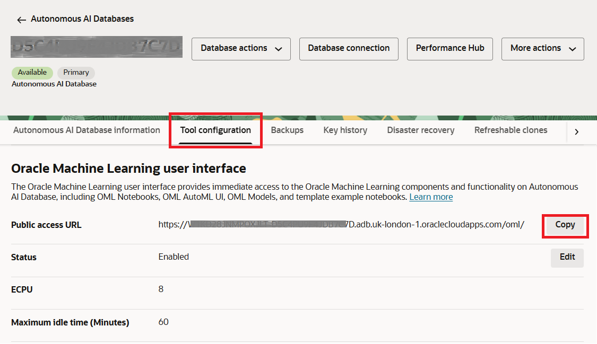
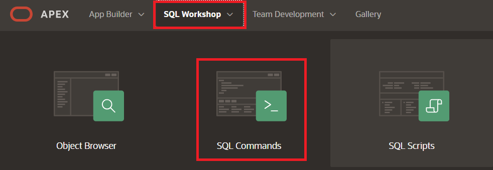

# Prepare APEX application for Web crawling

## Introduction

Estimated Time: 60 minutes

### Objectives

In this lab, you will:

- Prepare APEX application schema for crawling web pages.
- Create in-database JSON components for web indexing techniques.

The end result of this lab is an application that can perform Web crawling - automated process of systematically browsing the internet to find and index web pages. Your APEX application will act as a web crawler, spiders, or bot, which follows links from page to page, download content, and extract information like text and images to build a searchable index for search engines like Oracle AI Vector Search.

[Prepare...](youtube:)

### Prerequisites

This lab assumes you have:
* Completed the previous labs of this workshop.
* Experience with Oracle AI Database features, SQL, and PL/SQL.
* Basic experience with APEX AI Application Generator.
* Basic experience with Python programming language.

## Task 1: Create a Conda environment and custom Python libraries

1. Open a new browser tab and access the Oracle Machine Learning user interface using the link under Tool Configuration tab.

    

2. Use the Oracle Machine Learning user interface connected as the `ADMIN` user to list Conda environments.

    ````sh
    <copy>
    %conda
    env list
    </copy>
    ````

3. Use the `search` command to check the availability of certain libraries.

    ````sh
    <copy>
    %conda
    search '*rdflib*'
    </copy>
    ````

4. Create a Conda environment with the necessary Python libraries.

    ````sh
    <copy>
    %conda
    create -n myenv python=3.13 rdflib rdflib-with-all scikit-learn pandas
    </copy>
    ````

5. Upload the custom Conda environment to Object Storage for other users, like `DBAI`, to download and use these environments.

    ````sh
    <copy>
    %conda
    env-lcm upload myenv --description 'Conda environment with rdflib' -t application "OML4PY-RDF" --overwrite
    </copy>
    ````

## Task 2: Create a user-defined Python function

1. Connect to your APEX `DBAI` workspace as `DBAIADMIN` user, and navigate to SQL Workshop > SQL Commands.

    

2. Create a stored user-defined Python function and use it to perform the web crawling.

    ````sql
    <copy>
    begin
        sys.pyqScriptCreate('pyqCrawlWebTxt',
            'def crawlerTxt(page_url, user_agent):
                from urllib.request import Request, urlopen
                import urllib.error
                from bs4 import BeautifulSoup
                # extract index URL from page URL
                idx = page_url.rindex("/")
                target_url = page_url[:idx]
                # set page request values
                req = Request(page_url)
                req.add_header("User-Agent", user_agent)
                try:
                    # request page and parse contents
                    html = urlopen(req).read()
                    soup = BeautifulSoup(html, features="html.parser")
                    # remove all script and style elements
                    for script in soup(["script", "style"]):
                        script.extract()
                    # get text contents
                    text = soup.get_text()
                    # break into lines and remove leading and trailing space on each
                    lines = (line.strip() for line in text.splitlines())
                    # break multi-headlines into a line each
                    chunks = (phrase.strip() for line in lines for phrase in line.split("  "))
                    # drop all blank lines
                    result = ''\n''.join(chunk for chunk in chunks if chunk)
                    # collect all the links
                    link_elements = soup.select("a[href]")
                    for link_element in link_elements:
                        url = link_element["href"]
                        # convert links to absolute URLs
                        if not url.startswith("http"):
                            absolute_url = target_url + ''/'' + url
                        else:
                            absolute_url = url
                        # add a prefix to the link lines
                        result = result + ''\n **Link**: '' + absolute_url
                    # add the title line with a prefix
                    result = ''**Title**: '' + soup.find("title").get_text() + ''\n'' + result
                except urllib.error.HTTPError as e:
                    # "e" can be treated as a http.client.HTTPResponse object
                    result = str(e)
                return result',
            TRUE,  -- Make the user-defined Python function global.
            TRUE); -- Overwrite any global user-defined Python function with the same name.
    end;
    </copy>
    ````

3. This function can be executed directly from SQL using a REST authentication token. Test the Embeded Python Execution by retrieving the Oracle AI Database Documentation web page `https://docs.oracle.com/en/database/oracle/oracle-database/index.html`. Replace `<H1AH28AHAHATHAT-A5H4HA9T4HAT7H7A>` with your Oracle APEX Public access URL sub-domain, `<TENANCY_REGION>` with your tenancy Region, and `<Your#5tr0ng_PassW0rd>` with the strong password for your ADB instance schema.

    ````sql
    <copy>
    declare
      l_Expires date;
      l_Response clob;
      l_Token clob;
    begin
      -- verify last auth token is still valid
      begin
        select EXPIRES into l_Expires
          from (select EXPIRES
                  from WEB_TOKENS order by EXPIRES desc)
          where ROWNUM = 1;
      exception
        when NO_DATA_FOUND then
            l_Expires := SYSDATE - 1;
      end;
      if l_Expires < SYSDATE then
        -- Populate the globals to send cookies and HTTP headers
        apex_web_service.g_request_headers(1).name := 'Content-Type';
        apex_web_service.g_request_headers(1).value := 'application/json'; 
        -- Invoke the RESTful style Web service
        l_Response := apex_web_service.make_rest_request(
            p_url => 'https://<H1AH28AHAHATHAT-A5H4HA9T4HAT7H7A>.adb.<TENANCY_REGION>.oraclecloudapps.com/omlusers/api/oauth2/v1/token',
            p_http_method => 'POST',
            p_body => '{"grant_type":"password", "username":"DBAI", "password":"<Your#5tr0ng_PassW0rd>"}');
        dbms_output.put_line(l_Response);
        -- Extract the token string from the JSON response
        l_Token := JSON_VALUE(l_Response, '$.accessToken');
        dbms_output.put_line(l_Token);
        -- Once you have the authentication token, use it to set the access token in the token store
        pyqSetAuthToken(l_Token);
        insert into WEB_TOKENS (REQUESTED, EXPIRES) values (SYSDATE, SYSDATE + 1/24);
      end if;
      -- insert web page crawling results
      insert into WEBPAGES
        select null, 'https://docs.oracle.com/en/database/oracle/oracle-database/index.html', t.VALUE, SYSDATE
        from table(pyqEval(
            par_lst => '{"oml_service_level":"HIGH",
                        "page_url":"https://docs.oracle.com/en/database/oracle/oracle-database/index.html",
                        "user_agent":"Mozilla/5.0 (X11; Linux x86_64) AppleWebKit/537.36 (KHTML, like Gecko) Chrome/54.0.2840.90 Safari/537.36"}',
            out_fmt => 'JSON',
            scr_name => 'pyqCrawlWebTxt',
            env_name => 'myenv')) t;
    end;
    </copy>
    ````

4. This same PL/SQL user-defined Python function is used on the Page 16: Web URL Details, in the Crawl Web Page process.

    > **Note:** You don't have to execute this block of code, just try to understand it.

    ````sql
    <copy>
    -- check in Shared Components > Application Definition under Substitutions these three Substitution Strings
    -- have the correct Substitution Values: APEX_SCHEMA_NAME, APEX_SCHEMA_PASS, and APEX_SUBDOMAIN
    declare
      l_Expires date;
      l_Response clob;
      l_Token clob;
    begin
      -- verify last auth token is still valid
      begin
        select EXPIRES into l_Expires
          from (select EXPIRES
                  from WEB_TOKENS order by EXPIRES desc)
          where ROWNUM = 1;
      exception
        when NO_DATA_FOUND then
            l_Expires := SYSDATE - 1;
      end;
      if l_Expires < SYSDATE then
        -- Populate the globals to send cookies and HTTP headers
        apex_web_service.g_request_headers(1).name := 'Content-Type';
        apex_web_service.g_request_headers(1).value := 'application/json'; 
        -- Invoke the RESTful style Web service
        l_Response := apex_web_service.make_rest_request(
            p_url => 'https://' || :APEX_SUBDOMAIN || '.adb.uk-london-1.oraclecloudapps.com/omlusers/api/oauth2/v1/token',
            p_http_method => 'POST',
            p_body => '{"grant_type":"password", "username":"' || :APEX_SCHEMA_NAME || '", "password":"' || :APEX_SCHEMA_PASS || '"}');
        dbms_output.put_line(l_Response);
        -- Extract the token string from the JSON response
        l_Token := JSON_VALUE(l_Response, '$.accessToken');
        dbms_output.put_line(l_Token);
        -- Once you have the authentication token, use it to set the access token in the token store
        pyqSetAuthToken(l_Token);
        insert into WEB_TOKENS (REQUESTED, EXPIRES) values (SYSDATE, SYSDATE + 1/24);
      end if;
      -- update web page record with the crawling results
      update WEBPAGES
        set WEB_CONTENTS = (
          select t.VALUE
          from table(pyqEval(
            par_lst => '{"oml_service_level":"HIGH",
                        "page_url":"' || :P16_WEB_URL || '",
                        "user_agent":"Mozilla/5.0 (X11; Linux x86_64) AppleWebKit/537.36 (KHTML, like Gecko) Chrome/54.0.2840.90 Safari/537.36"}',
            out_fmt => 'JSON',
            scr_name => 'pyqCrawlWebTxt',
            env_name => 'myenv')) t ),
            UPDATED = SYSDATE
        where ID = :P16_ID;
    end;
    </copy>
    ````

5. Depending on the pages you want to crawl, you will have to change the value in the `user_agent` parameter list called `par_lst` for the `pyqEval` function.

This workshop is now complete.


## Learn More

- [Conda Commands](https://docs.oracle.com/en/database/oracle/machine-learning/oml4py/2/mlpug/conda-commands.html)
- [Python API for Embedded Python Execution](https://docs.oracle.com/en/database/oracle/machine-learning/oml4py/2/mlpug/python-api-embedded-python-execution1.html)
- [Oracle AI Database Embedded Python Execution](https://medium.com/@valitabacaru/oracle-ai-database-embedded-python-execution-654eb2c3e5ff)

## **Acknowledgements**

- **Author** - Valentin Leonard Tabacaru, Database Product Management
- **Last Updated By/Date** - Valentin Leonard Tabacaru, Database Product Management, November 2025
