<if type="Creation">

# Lab 1: Common Java Code

## Introduction

In this preparatory lab, we will be going over the java code we will be using in the later labs to utilize Oracle 23ai database with JDBC to perform Similarity Search. 
We shall be using Visual Studio Code as our IDE of choice. Feel free to create your environment in which ever IDE you prefer.

Estimated Time: 20 minutes

---------------


### **Objectives**

In this lab, you will perform the following tasks:
* Task 1: Root Environment ai-vector-search-oracle-jdbc-examples-main 
* Task 2: The ojdbc-vector-examples-common Directory And All The Files Within
* Task 3: The ojdbc-vector-examples-cohere Directory And All The Files Within
* Task 4: The ojdbc-vector-examples-openai Directory And All The Files Within


### Prerequisites

This lab asssumes you have:
* IDE of your choice
* The latest version of Maven installed
* Java 11 or newer installed


## Task 1: Root Environment ai-vector-search-oracle-jdbc-examples-main

The main root directory which we will use shall be named ai-vector-search-oracle-jdbc-examples-main. We can use the terminal located in our VS code to streamline this process.

```
<copy>
mvn archetype:generate -DgroupId=oracle.jdbc.vector.example -DartifactId=ai-vector-search-oracle-jdbc-examples-main -DarchetypeArtifactId=maven-archetype-quickstart -DinteractiveMode=false
</copy>
```

Within this root directory, we will have 3 sub directories named **ojdbc-vector-example-common** , **ojdbc-vector-example-cohere**, **ojdbc-vector-example-openai** . We shall also will have a file named `example-config.properties`. We shall also have a pom.xml file.


### The TEMPLATE config file example-config.properties

The example-config.properties file is a configuration file for the AI Vector Search using Oracle JDBC Code Examples. This is a template file which includes the mandatory database connection details such as the `JDBC_URL`, `JDBC_USER`, and 'JDBC_PASSWORD`. The file also contains the configurations for different machine learning technologies, the API key and Model name for OpenAI, and various settings for Oracle Cloud Infrastructure(OCI) including the endpoint URL, configuration file location, profile, compartment OCID, and model ID for the embedding model. This setup ensures that the example code can interract with the database and the respective Machine Learning Services appropriately. </br>

</br>
*AGAIN THIS IS ONLY A TEMPLATE FILE* 

```
<copy>
# This is a configuration file for AI Vector Search: Oracle JDBC Code Examples.

# JDBC URL for an Oracle Database. This must be configured, regardless of
# which ML technology is used.
JDBC_URL=jdbc:oracle:thin:@host:port/service-name
# Note that JDBC_URL can have an Oracle Net Descriptor:
#   JDBC_URL=jdbc:oracle:thin:@(DESCRIPTION=...
# Or, if TNS_ADMIN is set as an environment variable, JDBC_URL can reference a
# tnsnames.ora alias:
#   JDBC_URL=jdbc:oracle:thin:@tns_names_alias

# Database username. This must be configured, regardless of which ML technology
# is used.
JDBC_USER=database-username

# Database password. This must be configured, regardless of which ML technology
# is used.
JDBC_PASSWORD=database-password

# Configuration for ONNX Runtime.
MODEL_PATH=/path/to/model.onnx

# Configuration for OpenAI ()
OPENAI_API_KEY=key-from-openai-account
OPENAI_MODEL=text-embedding-3-small

# OCI Configuration
# Endpoint URL for OCI Generative AI Service. Adjust according to your service region.
OCI_ENDPOINT=https://inference.generativeai.us-chicago-1.oci.oraclecloud.com

# Location of the OCI configuration file which includes your API credentials.
OCI_CONFIG_LOCATION=~/.oci/config

# The profile to use from the OCI configuration file. Typically "DEFAULT" or a user-defined profile.
OCI_CONFIG_PROFILE=DEFAULT

# The compartment OCID within OCI where the AI service is authorized.
OCI_COMPARTMENT_ID=ocid1.compartment.oc1..aaaaaaaah2dzjemfdkom3ngrrq6b3wk7c3wezj5ysuulxiwp56klk57gtfga

# The model ID for the embedding model to be used. Make sure this ID corresponds to the correct model in OCI.
OCI_MODEL_ID=cohere.embed-english-v3.0

</copy>
```

We will create a useable version of our **`example-config.properties`** file 
run the following command

```
<copy>
cp -i example-config.properties config.properties
</copy>
```
This will be the file that our Java classes will call later in the lab.

### **POM.XML**

The final individual file within this directory shall be the Pom.XML file. This will be the main pom which will build out our applications. Below is our pom.xml file
</br>

```
<copy>

<project xmlns="http://maven.apache.org/POM/4.0.0" xmlns:xsi="http://www.w3.org/2001/XMLSchema-instance"
         xsi:schemaLocation="http://maven.apache.org/POM/4.0.0 https://maven.apache.org/xsd/maven-4.0.0.xsd">
    <modelVersion>4.0.0</modelVersion>

    <groupId>com.oracle.database.jdbc</groupId>
    <artifactId>ojdbc-vector-examples</artifactId>
    <version>1.0.0</version>
    <packaging>pom</packaging>

    <name>VECTOR code examples</name>
    <description>
        Code examples which use the VECTOR data type with Oracle JDBC.
    </description>
    <url>https://github.com/oracle-samples/oracle-db-examples/tree/main/java/jdbc</url>
    <licenses>
        <license>
            <name>The Universal Permissive License (UPL), Version 1.0</name>
            <url>https://oss.oracle.com/licenses/upl/</url>
        </license>
    </licenses>
    <developers>
        <developer>
            <organization>Oracle America, Inc.</organization>
            <organizationUrl>http://www.oracle.com</organizationUrl>
        </developer>
    </developers>

    <properties>
        <maven.compiler.target>11</maven.compiler.target>
        <maven.compiler.source>11</maven.compiler.source>
        <maven.compiler.release>11</maven.compiler.release>
        <project.build.sourceEncoding>UTF-8</project.build.sourceEncoding>
        <project.reporting.outputEncoding>UTF-8</project.reporting.outputEncoding>
    </properties>

    <modules>
        <module>ojdbc-vector-examples-common</module>
        <module>ojdbc-vector-examples-cohere</module>
        <module>ojdbc-vector-examples-openai</module>
    </modules>

    <build>
        <plugins>
            <plugin>
                <groupId>org.apache.maven.plugins</groupId>
                <artifactId>maven-compiler-plugin</artifactId>
                <version>3.11.0</version>
            </plugin>
        </plugins>
    </build>
</project>

</copy>
```


## Task 2: The ojdbc-vector-examples-common Directory And All The Files Within
The first directory we shall have is the ojdbc-vector-example-common. The files within this directory shall be accessed by all other folders in order to run our vector code. The folder shall have a pom.xml and the src folder. 

```
ai-vector-search-oracle-jdbc-examples-main
└── ojdbc-vector-example-common
    └── src
        └── main
            └── java
                └── oracle
                    └── jdbc
                        └── vector
                            └── examples
```
### **Pom within Common**
Let's begin by first looking at the contents within the pom file. This file is located within the ojdbc-vector-example-common/ folder. </br>
That would be:
</br> 
**`/ai-vector-search-oracle-jdbc-examples-main/ojdbc-vector-example-common/`** 

The pom.xml file shall contain the following:

```
<copy>
<?xml version="1.0" encoding="UTF-8"?>
<project xmlns="http://maven.apache.org/POM/4.0.0"
         xmlns:xsi="http://www.w3.org/2001/XMLSchema-instance"
         xsi:schemaLocation="http://maven.apache.org/POM/4.0.0 http://maven.apache.org/xsd/maven-4.0.0.xsd">
    <modelVersion>4.0.0</modelVersion>

    <parent>
        <groupId>com.oracle.database.jdbc</groupId>
        <artifactId>ojdbc-vector-examples</artifactId>
        <version>1.0.0</version>
    </parent>

    <artifactId>ojdbc-vector-examples-common</artifactId>
    <version>1.0.0</version>

    <dependencies>
        <dependency>
            <groupId>com.oracle.database.jdbc</groupId>
            <artifactId>ojdbc11</artifactId>
            <version>[23.4,)</version>
        </dependency>
    </dependencies>

</project>
</copy>
```
</br>

**Now we shall be working from the examples folder located in :**

**`ai-vector-search-oracle-jdbc-examples-main/ojdbc-vector-examples-common/src/main/java/oracle/jdbc/vector/examples/`**

### **Config.java**
Within the examples folder we shall have 4 files, `Config.java`, `Model.java`, `Schema.java`, and `SimilaritySearch.java`. </br>

The first file is `Config.java`. This class manages the configurable values for code exmaples by reading them from the config.properties file, JVM system properties or environment variables, in that order of precedence. It includes methods to retreive these values.

```
<copy>
package oracle.jdbc.vector.examples;

import java.io.IOException;
import java.io.Reader;
import java.nio.file.Files;
import java.nio.file.Path;
import java.nio.file.Paths;
import java.util.Properties;

/**
 * Configurable values used by code examples. In order of precedence, these
 * values can be configured as JVM system properties, or environment variables.
 */
public final class Config {

  /**
   * Path to the configuration file
   */
  private static final Path CONFIG_PATH =
    Paths.get("config.properties").toAbsolutePath();

  /**
   * Configuration read from config.properties in the current working directory.
   */
  private static final Properties CONFIG_FILE = new Properties();
  static {
    try (Reader reader = Files.newBufferedReader(CONFIG_PATH)) {
      CONFIG_FILE.load(reader);
    }
    catch (IOException ioException) {
      System.out.println("Failed to read configuration from path:\n"
        + CONFIG_PATH
        + "\nFalling back to JVM system properties and environment variables");
    }
  }

  private Config() { }

  /**
   * Returns the value configured for a given <code>name</code>, or throws a
   * {@link RuntimeException} if no value is configured.
   *
   * @param name Name of a configurable value. Case sensitive. Not null.
   * @return The configured value. Not null.
   * @throws RuntimeException If no value is configured.
   */
  public static String get(String name) {
    String value = getOrDefault(name, null);

    if (value == null) {
      throw new RuntimeException(
        "\"" + name + "\" must be configured in:\n"
          + CONFIG_PATH
          + "\nOr set as a JVM system property or environment variable.");
    }

    return value;
  }

  /**
   * Returns the value configured for a given <code>name</code>, or a
   * <code>defaultValue</code> if no value is configured.
   *
   * @param name Name of a configurable value. Case sensitive. Not null.
   * @param defaultValue Default value. May be null.
   * @return The configured value, or the default if none is configured. May be
   * null if the <code>defaultValue</code> argument is null.
   */
  public static String getOrDefault(String name, String defaultValue) {
    String value = CONFIG_FILE.getProperty(name);
    if (value != null)
      return value;

    value = System.getProperty(name);
    if (value != null)
      return value;

    value = System.getenv(name);
    if (value != null)
      return value;

    return defaultValue;
  }
}
</copy>
```

### **Model.java**
Next java file shall be the `Model.java`. This defines a 'Model' interface for machine learning models that generate vector embeddings for sentence in natural language. The 'embed' method takes an array of sentences as input and returns a 2D array of floats, where each `float[]` represents the embedding of the corresponding sentence in the input array.

```
<copy>
package oracle.jdbc.vector.examples;

/**
 * A machine learning (ML) model which generates a vector embedding for
 * sentences in a natural language. Implementations of this interface use
 * a particular model and a particular library or remote service to generate
 * the embedding.
 */
public interface Model {

  /**
   * Returns embeddings for the given <code>sentences</code>. In the returned
   * array, the <code>float[]</code> at index <i>n</i> is the embedding for
   * the sentence at index <i>n</i> in the given array of
   * <code>sentences</code>.
   *
   * @param sentences Sentences to embed. Not null. Not containing null.
   * @return Embeddings for the sentences. Not null. Not containing null.
   */
  float[][] embed(String[] sentences);

}
</copy>
```
</br>

### **Schema.java**

The next code shall be the `Schema.java`. 

This code defines a class that manages a database schema, which creates, populates and drops the schema. The schema features a table named 'my_data" with columns for: </br>
</br>
**id : A unique numeric id. It is a PRIMARY KEY**</br>
**info: A plain text sentence which conveys some information, such as, "San Francisco is in California".**</br>
**v: A vector embedding of the info within the sentence.**</br>
</br>
The 'create' method initializes the schema and populates it with example data, the 'drop' method removes the schema, and the 'vectorizeTable' method updates the table with vector embeddings generated by a provided model and creates an index for efficient similarity searches. The class handles SQL operations using JDBC, ensuring proper setup and teardown of the schema for interactive similarity search examples.

Below is the `Schema.java` file.

```
<copy>
package oracle.jdbc.vector.examples;

import oracle.jdbc.OracleType;

import java.sql.Connection;
import java.sql.PreparedStatement;
import java.sql.ResultSet;
import java.sql.SQLException;
import java.sql.Statement;
import java.util.ArrayList;

/**
 * <p>
 * A database schema (a collection of tables and other database objects) which
 * are used in code examples. Methods of this class will create and drop the
 * schema.
 * </p><p>
 * The example schema includes a table named "my_data". This table has the
 * following columns:
 * <dl><dt>
 * id
 * </dt><dd>
 * A unique numeric id. It is a PRIMARY KEY
 * </dd><dt>
 * info
 * </dt><dd>
 * A plain text sentence which conveys some information, such as
 * "San Francisco is in California".
 * </dd><dt>
 * v
 * </dt><dd>
 * A vector embedding of the <code>info</code> sentence.
 * </dd></dl>
 * </p>
 */
public final class Schema {

  Schema() { }

  /**
   * Creates the schema, if it does not already exist.
   *
   * @param connection Connection used to create the schema. Not null.
   * @throws SQLException If creation fails due to a database error.
   */
  public static void create(Connection connection) throws SQLException {

    try (Statement statement = connection.createStatement()) {
      statement.execute("CREATE TABLE my_data ("
        + " id   NUMBER PRIMARY KEY,"
        + " info VARCHAR2(128),"
        + " v    VECTOR)");
    }
    catch (SQLException sqlException) {
      if (sqlException.getErrorCode() == 955) {
        // Return if ORA-00955 is caught. This error means the schema is already
        // created.
        return;
      }
      else {
        throw sqlException;
      }
    }

    try (PreparedStatement preparedStatement = connection.prepareStatement(
      "INSERT INTO my_data (id, info) VALUES (:1, :2)")) {

      preparedStatement.setInt(1, 1);
      preparedStatement.setString(2, "San Francisco is in California.");
      preparedStatement.addBatch();
      preparedStatement.setInt(1, 2);
      preparedStatement.setString(2, "San Jose is in California.");
      preparedStatement.addBatch();
      preparedStatement.setInt(1, 3);
      preparedStatement.setString(2, "Los Angeles is in California.");
      preparedStatement.addBatch();
      preparedStatement.setInt(1, 4);
      preparedStatement.setString(2, "Buffalo is in New York.");
      preparedStatement.addBatch();
      preparedStatement.setInt(1, 5);
      preparedStatement.setString(2, "Brooklyn is in New York.");
      preparedStatement.addBatch();
      preparedStatement.setInt(1, 6);
      preparedStatement.setString(2, "Queens is in New York.");
      preparedStatement.addBatch();
      preparedStatement.setInt(1, 7);
      preparedStatement.setString(2, "Harlem is in New York.");
      preparedStatement.addBatch();
      preparedStatement.setInt(1, 8);
      preparedStatement.setString(2, "The Bronx is in New York.");
      preparedStatement.addBatch();
      preparedStatement.setInt(1, 9);
      preparedStatement.setString(2, "Manhattan is in New York.");
      preparedStatement.addBatch();
      preparedStatement.setInt(1, 10);
      preparedStatement.setString(2, "Staten Island is in New York.");
      preparedStatement.addBatch();
      preparedStatement.setInt(1, 11);
      preparedStatement.setString(2, "Miami is in Florida.");
      preparedStatement.addBatch();
      preparedStatement.setInt(1, 12);
      preparedStatement.setString(2, "Tampa is in Florida.");
      preparedStatement.addBatch();
      preparedStatement.setInt(1, 13);
      preparedStatement.setString(2, "Orlando is in Florida.");
      preparedStatement.addBatch();
      preparedStatement.setInt(1, 14);
      preparedStatement.setString(2, "Dallas is in Texas.");
      preparedStatement.addBatch();
      preparedStatement.setInt(1, 15);
      preparedStatement.setString(2, "Houston is in Texas.");
      preparedStatement.addBatch();
      preparedStatement.setInt(1, 16);
      preparedStatement.setString(2, "Austin is in Texas.");
      preparedStatement.addBatch();
      preparedStatement.setInt(1, 17);
      preparedStatement.setString(2, "Phoenix is in Arizona.");
      preparedStatement.addBatch();
      preparedStatement.setInt(1, 18);
      preparedStatement.setString(2, "Las Vegas is in Nevada.");
      preparedStatement.addBatch();
      preparedStatement.setInt(1, 19);
      preparedStatement.setString(2, "Portland is in Oregon.");
      preparedStatement.addBatch();
      preparedStatement.setInt(1, 20);
      preparedStatement.setString(2, "New Orleans is in Louisiana.");
      preparedStatement.addBatch();
      preparedStatement.setInt(1, 21);
      preparedStatement.setString(2, "Atlanta is in Georgia.");
      preparedStatement.addBatch();
      preparedStatement.setInt(1, 22);
      preparedStatement.setString(2, "Chicago is in Illinois.");
      preparedStatement.addBatch();
      preparedStatement.setInt(1, 23);
      preparedStatement.setString(2, "Cleveland is in Ohio.");
      preparedStatement.addBatch();
      preparedStatement.setInt(1, 24);
      preparedStatement.setString(2, "Boston is in Massachusetts.");
      preparedStatement.addBatch();
      preparedStatement.setInt(1, 25);
      preparedStatement.setString(2, "Baltimore is in Maryland.");
      preparedStatement.addBatch();
      preparedStatement.setInt(1, 26);
      preparedStatement.setString(2, "Charlotte is in North Carolina.");
      preparedStatement.addBatch();
      preparedStatement.setInt(1, 27);
      preparedStatement.setString(2, "Raleigh is in North Carolina.");
      preparedStatement.addBatch();

      preparedStatement.setInt(1, 100);
      preparedStatement.setString(2, "Ferraris are often red.");
      preparedStatement.addBatch();
      preparedStatement.setInt(1, 101);
      preparedStatement.setString(2, "Teslas are electric.");
      preparedStatement.addBatch();
      preparedStatement.setInt(1, 102);
      preparedStatement.setString(2, "Mini coopers are small.");
      preparedStatement.addBatch();
      preparedStatement.setInt(1, 103);
      preparedStatement.setString(2, "Fiat 500 are small.");
      preparedStatement.addBatch();
      preparedStatement.setInt(1, 104);
      preparedStatement.setString(2, "Dodge Vipers are wide.");
      preparedStatement.addBatch();
      preparedStatement.setInt(1, 105);
      preparedStatement.setString(2, "Ford 150 are popular.");
      preparedStatement.addBatch();
      preparedStatement.setInt(1, 106);
      preparedStatement.setString(2, "Alfa Romeos are fun.");
      preparedStatement.addBatch();
      preparedStatement.setInt(1, 107);
      preparedStatement.setString(2, "Volvos are safe.");
      preparedStatement.addBatch();
      preparedStatement.setInt(1, 108);
      preparedStatement.setString(2, "Toyotas are reliable.");
      preparedStatement.addBatch();
      preparedStatement.setInt(1, 109);
      preparedStatement.setString(2, "Hondas are reliable.");
      preparedStatement.addBatch();
      preparedStatement.setInt(1, 110);
      preparedStatement.setString(2, "Porsches are fast and reliable.");
      preparedStatement.addBatch();
      preparedStatement.setInt(1, 111);
      preparedStatement.setString(2, "Nissan GTRs are great");
      preparedStatement.addBatch();
      preparedStatement.setInt(1, 112);
      preparedStatement.setString(2, "NISMO is awesome");
      preparedStatement.addBatch();
      preparedStatement.setInt(1, 113);
      preparedStatement.setString(2, "Tesla Cybertrucks are awesome");
      preparedStatement.addBatch();
      preparedStatement.setInt(1, 114);
      preparedStatement.setString(2, "Jeep Wranglers are fun.");
      preparedStatement.addBatch();

      preparedStatement.setInt(1, 200);
      preparedStatement.setString(2, "Bananas are yellow.");
      preparedStatement.addBatch();
      preparedStatement.setInt(1, 201);
      preparedStatement.setString(2, "Kiwis are green inside.");
      preparedStatement.addBatch();
      preparedStatement.setInt(1, 202);
      preparedStatement.setString(2, "Kiwis are brown on the outside.");
      preparedStatement.addBatch();
      preparedStatement.setInt(1, 203);
      preparedStatement.setString(2, "Kiwis are birds.");
      preparedStatement.addBatch();
      preparedStatement.setInt(1, 204);
      preparedStatement.setString(2, "Kiwis taste good.");
      preparedStatement.addBatch();
      preparedStatement.setInt(1, 205);
      preparedStatement.setString(2, "Ripe strawberries are red.");
      preparedStatement.addBatch();
      preparedStatement.setInt(1, 206);
      preparedStatement.setString(2, "Apples can be green, yellow or red.");
      preparedStatement.addBatch();
      preparedStatement.setInt(1, 207);
      preparedStatement.setString(2, "Ripe cherries are red.");
      preparedStatement.addBatch();
      preparedStatement.setInt(1, 208);
      preparedStatement.setString(2, "Pears can be green, yellow or brown.");
      preparedStatement.addBatch();
      preparedStatement.setInt(1, 209);
      preparedStatement.setString(2, "Oranges are orange.");
      preparedStatement.addBatch();
      preparedStatement.setInt(1, 210);
      preparedStatement.setString(2, "Peaches can be yellow, orange or red.");
      preparedStatement.addBatch();
      preparedStatement.setInt(1, 211);
      preparedStatement.setString(2, "Peaches can be fuzzy.");
      preparedStatement.addBatch();
      preparedStatement.setInt(1, 212);
      preparedStatement.setString(2, "Grapes can be green, red or purple.");
      preparedStatement.addBatch();
      preparedStatement.setInt(1, 213);
      preparedStatement.setString(2, "Watermelons are green on the outside.");
      preparedStatement.addBatch();
      preparedStatement.setInt(1, 214);
      preparedStatement.setString(2, "Watermelons are red on the outside.");
      preparedStatement.addBatch();
      preparedStatement.setInt(1, 215);
      preparedStatement.setString(2, "Blueberries are blue.");
      preparedStatement.addBatch();
      preparedStatement.setInt(1, 216);
      preparedStatement.setString(2, "Limes are green.");
      preparedStatement.addBatch();
      preparedStatement.setInt(1, 217);
      preparedStatement.setString(2, "Lemons are yellow.");
      preparedStatement.addBatch();
      preparedStatement.setInt(1, 218);
      preparedStatement.setString(2, "Ripe tomatoes are red.");
      preparedStatement.addBatch();
      preparedStatement.setInt(1, 219);
      preparedStatement.setString(2, "Unripe tomatoes are green.");
      preparedStatement.addBatch();
      preparedStatement.setInt(1, 220);
      preparedStatement.setString(2, "Ripe raspberries are red.");
      preparedStatement.addBatch();
      preparedStatement.setInt(1, 221);
      preparedStatement.setString(2, "Mangoes can be yellow, gold, green or orange.");
      preparedStatement.addBatch();

      preparedStatement.setInt(1, 300);
      preparedStatement.setString(2, "Tigers have stripes.");
      preparedStatement.addBatch();
      preparedStatement.setInt(1, 301);
      preparedStatement.setString(2, "Lions are big.");
      preparedStatement.addBatch();
      preparedStatement.setInt(1, 302);
      preparedStatement.setString(2, "Mice are small.");
      preparedStatement.addBatch();
      preparedStatement.setInt(1, 303);
      preparedStatement.setString(2, "Cats do not care.");
      preparedStatement.addBatch();
      preparedStatement.setInt(1, 304);
      preparedStatement.setString(2, "Dogs are loyal.");
      preparedStatement.addBatch();
      preparedStatement.setInt(1, 305);
      preparedStatement.setString(2, "Bears are hairy.");
      preparedStatement.addBatch();
      preparedStatement.setInt(1, 306);
      preparedStatement.setString(2, "Pandas are black and white.");
      preparedStatement.addBatch();
      preparedStatement.setInt(1, 307);
      preparedStatement.setString(2, "Zebras are black and white.");
      preparedStatement.addBatch();
      preparedStatement.setInt(1, 308);
      preparedStatement.setString(2, "Penguins can be black and white.");
      preparedStatement.addBatch();
      preparedStatement.setInt(1, 309);
      preparedStatement.setString(2, "Puffins can be black and white.");
      preparedStatement.addBatch();
      preparedStatement.setInt(1, 310);
      preparedStatement.setString(2, "Giraffes have long necks.");
      preparedStatement.addBatch();
      preparedStatement.setInt(1, 311);
      preparedStatement.setString(2, "Elephants have trunks.");
      preparedStatement.addBatch();
      preparedStatement.setInt(1, 312);
      preparedStatement.setString(2, "Horses have four legs.");
      preparedStatement.addBatch();
      preparedStatement.setInt(1, 313);
      preparedStatement.setString(2, "Birds can fly.");
      preparedStatement.addBatch();
      preparedStatement.setInt(1, 314);
      preparedStatement.setString(2, "Birds lay eggs.");
      preparedStatement.addBatch();
      preparedStatement.setInt(1, 315);
      preparedStatement.setString(2, "Fish can swim.");
      preparedStatement.addBatch();
      preparedStatement.setInt(1, 316);
      preparedStatement.setString(2, "Sharks have lots of teeth.");
      preparedStatement.addBatch();
      preparedStatement.setInt(1, 317);
      preparedStatement.setString(2, "Flies can fly.");
      preparedStatement.addBatch();
      preparedStatement.setInt(1, 318);
      preparedStatement.setString(2, "Snakes have fangs.");
      preparedStatement.addBatch();
      preparedStatement.setInt(1, 319);
      preparedStatement.setString(2, "Hyenas laugh.");
      preparedStatement.addBatch();
      preparedStatement.setInt(1, 320);
      preparedStatement.setString(2, "Crocodiles lurk.");
      preparedStatement.addBatch();
      preparedStatement.setInt(1, 321);
      preparedStatement.setString(2, "Spiders have eight legs.");
      preparedStatement.addBatch();
      preparedStatement.setInt(1, 322);
      preparedStatement.setString(2, "Wolves are hairy.");
      preparedStatement.addBatch();
      preparedStatement.setInt(1, 323);
      preparedStatement.setString(2, "Mountain Lions eat deer.");
      preparedStatement.addBatch();
      preparedStatement.setInt(1, 324);
      preparedStatement.setString(2, "Kangaroos can hop.");
      preparedStatement.addBatch();
      preparedStatement.setInt(1, 325);
      preparedStatement.setString(2, "Turtles have shells.");
      preparedStatement.addBatch();


      preparedStatement.setInt(1, 400);
      preparedStatement.setString(2, "Ibaraki is in Kanto.");
      preparedStatement.addBatch();
      preparedStatement.setInt(1, 401);
      preparedStatement.setString(2, "Tochigi is in Kanto.");
      preparedStatement.addBatch();
      preparedStatement.setInt(1, 402);
      preparedStatement.setString(2, "Gunma is in Kanto.");
      preparedStatement.addBatch();
      preparedStatement.setInt(1, 403);
      preparedStatement.setString(2, "Saitama is in Kanto.");
      preparedStatement.addBatch();
      preparedStatement.setInt(1, 404);
      preparedStatement.setString(2, "Chiba is in Kanto.");
      preparedStatement.addBatch();
      preparedStatement.setInt(1, 405);
      preparedStatement.setString(2, "Tokyo is in Kanto.");
      preparedStatement.addBatch();
      preparedStatement.setInt(1, 406);
      preparedStatement.setString(2, "Kanagawa is in Kanto.");
      preparedStatement.addBatch();

      preparedStatement.setInt(1, 500);
      preparedStatement.setString(2, "Eggs are egg shaped.");
      preparedStatement.addBatch();
      preparedStatement.setInt(1, 501);
      preparedStatement.setString(2, "The answer to life is 42.");
      preparedStatement.addBatch();
      preparedStatement.setInt(1, 502);
      preparedStatement.setString(2, "To be, or not to be, that is the question.");
      preparedStatement.addBatch();
      preparedStatement.setInt(1, 503);
      preparedStatement.setString(2, "640K ought to be enough for anybody.");
      preparedStatement.addBatch();
      preparedStatement.setInt(1, 504);
      preparedStatement.setString(2, "Man overboard.");
      preparedStatement.addBatch();
      preparedStatement.setInt(1, 505);
      preparedStatement.setString(2, "The world is your oyster.");
      preparedStatement.addBatch();
      preparedStatement.setInt(1, 506);
      preparedStatement.setString(2, "One small step for Mankind.");
      preparedStatement.addBatch();
      preparedStatement.setInt(1, 507);
      preparedStatement.setString(2, "Bitcoin is cryptocurrency.");
      preparedStatement.addBatch();
      preparedStatement.setInt(1, 508);
      preparedStatement.setString(2, "Saturn has rings.");
      preparedStatement.addBatch();

      preparedStatement.setInt(1, 600);
      preparedStatement.setString(2, "Catamarans have two hulls.");
      preparedStatement.addBatch();
      preparedStatement.setInt(1, 601);
      preparedStatement.setString(2, "Monohulls have a single hull.");
      preparedStatement.addBatch();
      preparedStatement.setInt(1, 602);
      preparedStatement.setString(2, "Foiling sailboats are fast.");
      preparedStatement.addBatch();
      preparedStatement.setInt(1, 603);
      preparedStatement.setString(2, "Cutters have two headsails.");
      preparedStatement.addBatch();
      preparedStatement.setInt(1, 604);
      preparedStatement.setString(2, "Yawls ave two masts.");
      preparedStatement.addBatch();
      preparedStatement.setInt(1, 605);
      preparedStatement.setString(2, "Sloops have one mast.");
      preparedStatement.addBatch();


      preparedStatement.setInt(1, 900);
      preparedStatement.setString(2, "Oracle CloudWorld Las Vegas was on September 18–21, 2023");
      preparedStatement.addBatch();
      preparedStatement.setInt(1, 901);
      preparedStatement.setString(2, "Oracle CloudWorld Las Vegas was at The Venetian Convention and Expo Center");
      preparedStatement.addBatch();
      preparedStatement.setInt(1, 902);
      preparedStatement.setString(2, "Oracle CloudWorld Dubai is on 23 January 2024");
      preparedStatement.addBatch();
      preparedStatement.setInt(1, 903);
      preparedStatement.setString(2, "Oracle CloudWorld Dubai is at the Dubai World Trade Centre");
      preparedStatement.addBatch();
      preparedStatement.setInt(1, 904);
      preparedStatement.setString(2, "Oracle CloudWorld Mumbai is on 14 February 2024");
      preparedStatement.addBatch();
      preparedStatement.setInt(1, 905);
      preparedStatement.setString(2, "Oracle CloudWorld Mumbai is at the Jio World Convention Centre");
      preparedStatement.addBatch();
      preparedStatement.setInt(1, 906);
      preparedStatement.setString(2, "Oracle CloudWorld London is on 14 March 2024");
      preparedStatement.addBatch();
      preparedStatement.setInt(1, 907);
      preparedStatement.setString(2, "Oracle CloudWorld London is at the ExCeL London");
      preparedStatement.addBatch();
      preparedStatement.setInt(1, 908);
      preparedStatement.setString(2, "Oracle CloudWorld Milan is on 21 March 2024");
      preparedStatement.addBatch();
      preparedStatement.setInt(1, 909);
      preparedStatement.setString(2, "Oracle CloudWorld Milan is at the Milano Convention Centre");
      preparedStatement.addBatch();
      preparedStatement.setInt(1, 910);
      preparedStatement.setString(2, "Oracle CloudWorld Sao Paulo is on 4 April 2024");
      preparedStatement.addBatch();
      preparedStatement.setInt(1, 911);
      preparedStatement.setString(2, "Oracle CloudWorld Sao Paulo is at The World Trade Center São Paulo.");
      preparedStatement.addBatch();
      preparedStatement.setInt(1, 912);
      preparedStatement.setString(2, "Oracle CloudWorld Singapore is on 16 April 2024");
      preparedStatement.addBatch();
      preparedStatement.setInt(1, 913);
      preparedStatement.setString(2, "Oracle CloudWorld Singapore is at the TBD");
      preparedStatement.addBatch();
      preparedStatement.setInt(1, 914);
      preparedStatement.setString(2, "Oracle CloudWorld Tokyo is on 18 April 2024");
      preparedStatement.addBatch();
      preparedStatement.setInt(1, 915);
      preparedStatement.setString(2, "Oracle CloudWorld Tokyo is at The Prince Park Tower Tokyo.");
      preparedStatement.addBatch();
      preparedStatement.setInt(1, 916);
      preparedStatement.setString(2, "Oracle CloudWorld Mexico City is on 25 April 2024");
      preparedStatement.addBatch();
      preparedStatement.setInt(1, 917);
      preparedStatement.setString(2, "Oracle CloudWorld Mexico City is at the Centro Citibanex.");
      preparedStatement.addBatch();

      preparedStatement.setInt(1, 1000);
      preparedStatement.setString(2, "Dubai is in the United Arab Emirates.");
      preparedStatement.addBatch();
      preparedStatement.setInt(1, 1001);
      preparedStatement.setString(2, "The Burj Khalifa is in Dubai.");
      preparedStatement.addBatch();
      preparedStatement.setInt(1, 1002);
      preparedStatement.setString(2, "The Burj Khalifa is the tallest building in the world.");
      preparedStatement.addBatch();
      preparedStatement.setInt(1, 1003);
      preparedStatement.setString(2, "Dubai is in the Persian Gulf.");
      preparedStatement.addBatch();
      preparedStatement.setInt(1, 1004);
      preparedStatement.setString(2, "The United Arab Emirates consists of seven Emirates.");
      preparedStatement.addBatch();
      preparedStatement.setInt(1, 1005);
      preparedStatement.setString(2, "The Emirates are Abu Dhabi, Ajman, Dubai, Fujairah, Ras Al Khaimah, Sharjah and Umm Al Quwain.");
      preparedStatement.addBatch();
      preparedStatement.setInt(1, 1006);
      preparedStatement.setString(2, "The Emirates Mars Mission sent the Hope probe into orbit around Mars.");
      preparedStatement.addBatch();
      preparedStatement.setInt(1, 1007);
      preparedStatement.setString(2, "Sheikh Mohamed bin Zayed Al Nahyan is the president of the United Arab Emirates.");
      preparedStatement.addBatch();
      preparedStatement.setInt(1, 1008);
      preparedStatement.setString(2, "Emirates is the largest airline in the Middle East.");
      preparedStatement.addBatch();
      preparedStatement.setInt(1, 1009);
      preparedStatement.setString(2, "Emirates operates to more than 150 cities in 80 countries.");
      preparedStatement.addBatch();
      preparedStatement.setInt(1, 1010);
      preparedStatement.setString(2, "Emirates operates a fleet of nearly 300 aircraft.");
      preparedStatement.addBatch();
      preparedStatement.setInt(1, 1011);
      preparedStatement.setString(2, "Emirates sponsors the Arsenal Football Club.");
      preparedStatement.addBatch();

      preparedStatement.setInt(1, 1100);
      preparedStatement.setString(2, "Mumbai is in India.");
      preparedStatement.addBatch();
      preparedStatement.setInt(1, 1101);
      preparedStatement.setString(2, "Mumbai is the capital city of the Indian state of Maharashtra.");
      preparedStatement.addBatch();
      preparedStatement.setInt(1, 1102);
      preparedStatement.setString(2, "Mumbai is the Indian state of Maharashtra.");
      preparedStatement.addBatch();
      preparedStatement.setInt(1, 1103);
      preparedStatement.setString(2, "Mumbai is on the west coast of India.");
      preparedStatement.addBatch();
      preparedStatement.setInt(1, 1104);
      preparedStatement.setString(2, "Mumbai is the de facto financial centre of India.");
      preparedStatement.addBatch();
      preparedStatement.setInt(1, 1105);
      preparedStatement.setString(2, "Mumbai has a population of about 12.5 million people.");
      preparedStatement.addBatch();
      preparedStatement.setInt(1, 1106);
      preparedStatement.setString(2, "Mumbai is hot with an average minimum temperature of 24 degrees celsius.");
      preparedStatement.addBatch();
      preparedStatement.setInt(1, 1107);
      preparedStatement.setString(2, "Common languages in Mumbai are Marathi, Hindi, Gujarati, Urdu, Bambaiya  and English.");
      preparedStatement.addBatch();

      preparedStatement.executeBatch();
    }
  }

  /**
   * Drops the schema, if it exists.
   * @param connection Connection used to drop the schema. Not null.
   * @throws SQLException If dropping fails due to a database error.
   */
  public static void drop(Connection connection) throws SQLException {
    try (Statement statement = connection.createStatement()) {
      statement.addBatch("DROP TABLE IF EXISTS my_data PURGE");
      statement.addBatch("DROP INDEX IF EXISTS my_data_v");
      statement.executeBatch();
    }
  }

  /**
   * Updates the table to store vector embeddings generated by a given
   * <code>model</code>.
   *
   * @param connection Connection to use for updating the table. Not null.
   * @param model Model to use for generating vector embeddings. Not null.
   * @throws SQLException If a database failure occurs when updating the table.
   */
  public static void vectorizeTable(Connection connection, Model model)
    throws SQLException {

    class IdInfo {
      int id;
      String info;
    }

    ArrayList<IdInfo> idInfos = new ArrayList<>();
    try (
      Statement statement = connection.createStatement();
      ResultSet resultSet = statement.executeQuery(
        "SELECT id, info FROM my_data")) {
      while (resultSet.next()) {
        IdInfo idInfo = new IdInfo();
        idInfo.id = resultSet.getInt("id");
        idInfo.info = resultSet.getString("info");
        idInfos.add(idInfo);
      }
    }

    String[] sentences = idInfos.stream()
      .map(idInfo -> idInfo.info)
      .toArray(String[]::new);

    float[][] embeddings = model.embed(sentences);

    try (PreparedStatement update = connection.prepareStatement(
      "UPDATE my_data SET v=? WHERE id=?")) {
      for (int i = 0; i < idInfos.size(); i++) {
        update.setObject(1, embeddings[i], OracleType.VECTOR);
        update.setInt(2, idInfos.get(i).id);
        update.addBatch();
      }
      update.executeBatch();
    }

    try (Statement statement = connection.createStatement()) {
      statement.execute("CREATE VECTOR INDEX my_data_v_index"
        + " ON my_data (v)"
        + " ORGANIZATION INMEMORY NEIGHBOR GRAPH"
        + " DISTANCE COSINE"
        + " WITH TARGET ACCURACY 95"
        + " PARALLEL 4");
    }
  }

}

</copy>
```

### **SimilaritySearch.java**

The final Java file **SimilaritySearch.java** . This code defines the SimilaritySearch class that performs an interactive similarity search using vector embeddings of text sentences with our Oracle Database. The search process uses the 'Model' to generate the vector embeddings, which can be implemented using remote services like Generative Ai service on OCI or OpenAI, or local runtimes like ONNX. The program connects to the Oracle Database, allows the user to create or use an existing schema, and performs searches based on user input, displaying the top matches using the 'vector_distance' function of the Oracle Database. Additionally, it measures and prints the time taken for each similarity search. </br>

</br>

Below is the `SimilaritySearch.java` code

```
<copy>
package oracle.jdbc.vector.examples;

import oracle.jdbc.OracleType;

import java.io.BufferedReader;
import java.io.InputStreamReader;
import java.sql.Connection;
import java.sql.DriverManager;
import java.sql.PreparedStatement;
import java.sql.ResultSet;

import static java.nio.charset.StandardCharsets.UTF_8;

/**
 * <p>
 * An interactive command line program that performs a similarity search using
 * a vector embedding of text sentences. The search is implemented using Oracle
 * Database via the Oracle JDBC Driver. Vector embeddings are generated by an
 * abstract {@link Model}. The <code>Model</code> may be implemented using a
 * remote service such as Cohere or OpenAI. It can also be implemented using a
 * local runtime, such as ONNX.
 * </p>
 */
public class SimilaritySearch {

  private SimilaritySearch() { }

  /**
   * <p>
   * Runs the interactive search with embeddings generated by a given
   * <code>Model</code>.
   * </p><p>
   * This method connects to an Oracle Database and then prompts the user to
   * generate a schema, or use an existing one. The user can then enter search
   * terms and the terminal will display the top matches based on a
   * <code>vector_distance</code> function which is built-in to Oracle Database.
   * </p>
   * @param model Model used to generated vector embeddings. Not null.
   */
  public static void run(Model model) {
    try (
      Connection connection = DriverManager.getConnection(
        Config.get("JDBC_URL"),
        Config.get("JDBC_USER"),
        Config.get("JDBC_PASSWORD"));
      PreparedStatement query = connection.prepareStatement(
        "SELECT info"
          + " FROM my_data"
          + " ORDER BY VECTOR_DISTANCE(v, ?, COSINE)"
          + " FETCH APPROX FIRST ? ROWS ONLY");
    ) {

      // Do we need to create the table and vectorize the data?
      System.out.print("Create schema? (Y/N) ");
      String input =
        new BufferedReader(new InputStreamReader(System.in, UTF_8)).readLine();
      if (input.compareToIgnoreCase("y") == 0) {
        Schema.drop(connection);
        Schema.create(connection);
        Schema.vectorizeTable(connection, model);
      }

      while(true) {
        System.out.print("Search for ('bye' to exit): ");
        input =
          new BufferedReader(new InputStreamReader(System.in, UTF_8))
            .readLine();
        if (input.compareToIgnoreCase("bye") == 0) {
          break;
        }

        long startTime = System.nanoTime(); // Starts the timing before the embedding
        float[] embedding = model.embed(new String[]{input})[0];

        query.setObject(1, embedding, OracleType.VECTOR);
        query.setInt(2, 5/*TODO: Let users configure this*/);
        try (ResultSet resultSet = query.executeQuery()) {
          while (resultSet.next()) {
            System.out.println(resultSet.getString("info"));
          }
        }

        long endTime = System.nanoTime(); //End timing after the results are fetched
        double durationInSeconds = (endTime - startTime) / 1_000_000_000.0; //This converts nanoseconds to seconds
        System.out.printf("Similarity search took %.3f seconds.\n", durationInSeconds);
      }
    }
    catch (Exception exception) {
      throw new RuntimeException(exception);
    }
  }
}
</copy>
```
</br>

## Task 3: The ojdbc-vector-examples-cohere Directory And All The Files Within
Let's take a look at how this directory is configured. 

```
ai-vector-search-oracle-jdbc-examples-main
└── ojdbc-vector-examples-cohere
    └── src
        └── main
            └── java
                └── oracle
                    └── jdbc
                        └── vector
                            └── examples
                                └── cohere
```

</br>

### Pom
To begin, let's first edit the pom file within the `ojdbc-vector-examples-cohere` folder. The pom.xml file should look as followed:

```
<copy>
<?xml version="1.0" encoding="UTF-8"?>
<project xmlns="http://maven.apache.org/POM/4.0.0"
         xmlns:xsi="http://www.w3.org/2001/XMLSchema-instance"
         xsi:schemaLocation="http://maven.apache.org/POM/4.0.0 http://maven.apache.org/xsd/maven-4.0.0.xsd">
    <modelVersion>4.0.0</modelVersion>

    <parent>
        <groupId>com.oracle.database.jdbc</groupId>
        <artifactId>ojdbc-vector-examples</artifactId>
        <version>1.0.0</version>
    </parent>

    <artifactId>ojdbc-vector-examples-cohere</artifactId>
    <version>1.0.0</version>

    <dependencies>
        <dependency>
            <groupId>com.fasterxml.jackson.core</groupId>
            <artifactId>jackson-databind</artifactId>
            <version>2.15.1</version>
        </dependency>
        <dependency>
            <groupId>com.oracle.database.jdbc</groupId>
            <artifactId>ojdbc-vector-examples-common</artifactId>
            <version>1.0.0</version>
        </dependency>
        <dependency>
            <groupId>com.oracle.oci.sdk</groupId>
            <artifactId>oci-java-sdk-common-httpclient-jersey</artifactId>
            <version>3.41.0</version>
        </dependency>
        <dependency>
            <groupId>org.slf4j</groupId>
            <artifactId>slf4j-simple</artifactId>
            <version>2.0.13</version>
        </dependency>
        <dependency>
            <groupId>com.oracle.oci.sdk</groupId>
            <artifactId>oci-java-sdk-common</artifactId>
            <version>3.41.0</version>
        </dependency>
        <dependency>
            <groupId>com.oracle.oci.sdk</groupId>
            <artifactId>oci-java-sdk-generativeaiinference</artifactId>
            <version>3.41.0</version>
        </dependency>
        <dependency>
            <groupId>org.json</groupId>
            <artifactId>json</artifactId>
            <version>20240303</version>
        </dependency>
    </dependencies>

    <repositories>
        <repository>
            <id>oracle-public</id>
            <url>https://maven.oracle.com/public</url>
	    <layout>default</layout>
	    <releases>
	        <enabled>true</enabled>
	    </releases>
	    <snapshots>
		<enabled>false</enabled>
	    </snapshots>
        </repository>
    </repositories>
	
</project>
</copy>
```
</br>
  Now we shall proceed to the cohere folder. That folder shall be </br>
  **/ai-vector-search-oracle-jdbc-examples-main/ojdbc-vector-examples-cohere/src/main/java/oracle/jdbc/vector/examples/cohere**


### CohereModel.java
The first file within the Cohere folder, shall be **CohereModel.java**. This code defines the CohereModel class that implements the **Model** interface to generate vector embeddings for text using Oracle Cloud Infrastructures Generative AI Service. The class is initialized with an OCI client configured through client configuration and authentication details read from the configuration.properties file. The **embed** method processes input text in batches, sends requests to the OCI Generative AI Service to generate embeddings, and combines the results into a single 2D float array. The **parseResponse** method converts the embedding results from the service response into the required float array format for further use.


```
<copy>
package oracle.jdbc.vector.examples.cohere;

import com.oracle.bmc.ClientConfiguration;
import com.oracle.bmc.ConfigFileReader;
import com.oracle.bmc.auth.AuthenticationDetailsProvider;
import com.oracle.bmc.auth.ConfigFileAuthenticationDetailsProvider;
import com.oracle.bmc.generativeaiinference.GenerativeAiInferenceClient;
import com.oracle.bmc.generativeaiinference.model.EmbedTextDetails;
import com.oracle.bmc.generativeaiinference.model.OnDemandServingMode;
import com.oracle.bmc.generativeaiinference.requests.EmbedTextRequest;
import com.oracle.bmc.generativeaiinference.responses.EmbedTextResponse;
import oracle.jdbc.vector.examples.Config;
import oracle.jdbc.vector.examples.Model;

import java.util.Arrays;
import java.util.List;
import java.util.stream.Collectors;

/**
 * A model which is accessed through the OCI Generative AI Service.
 */
public class CohereModel implements Model {
    private GenerativeAiInferenceClient generativeAiInferenceClient;

    public static final Model INSTANCE = new CohereModel();

    public CohereModel() {
        try {
            // Set up the client configuration
            ClientConfiguration clientConfiguration = ClientConfiguration.builder()
                    .readTimeoutMillis(240000)
                    .build();

            // Authenticate using the OCI configuration file
            AuthenticationDetailsProvider provider = new ConfigFileAuthenticationDetailsProvider(
                ConfigFileReader.parse(Config.get("OCI_CONFIG_LOCATION"), Config.get("OCI_CONFIG_PROFILE"))
            );

            generativeAiInferenceClient = new GenerativeAiInferenceClient(provider, clientConfiguration);
            generativeAiInferenceClient.setEndpoint(Config.get("OCI_ENDPOINT"));
        } catch (Exception e) {
            throw new RuntimeException("Failed to initialize the OCI Generative AI client", e);
        }
    }

    @Override
    public float[][] embed(String[] texts) {
        List<String> inputs = Arrays.asList(texts);
        float[][] embeddings = new float[inputs.size()][];

        // Process in batches of up to 96 items
        int batchSize = 96;
        for (int start = 0; start < inputs.size(); start += batchSize) {
            int end = Math.min(inputs.size(), start + batchSize);
            List<String> batchInputs = inputs.subList(start, end);
            
            EmbedTextDetails embedTextDetails = EmbedTextDetails.builder()
                    .servingMode(OnDemandServingMode.builder().modelId("cohere.embed-english-v3.0").build())
                    .compartmentId(Config.get("OCI_COMPARTMENT_ID"))
                    .inputs(batchInputs)
                    .build();

            EmbedTextRequest request = EmbedTextRequest.builder()
                    .embedTextDetails(embedTextDetails)
                    .build();

            EmbedTextResponse response = generativeAiInferenceClient.embedText(request);
            float[][] batchEmbeddings = parseResponse(response);
            
            // Combine batch embeddings into the main array
            System.arraycopy(batchEmbeddings, 0, embeddings, start, batchEmbeddings.length);
        }

        return embeddings;
    }

    private float[][] parseResponse(EmbedTextResponse response) {
        List<List<Float>> embeddingsList = response.getEmbedTextResult().getEmbeddings();
        float[][] embeddings = new float[embeddingsList.size()][];
        for (int i = 0; i < embeddingsList.size(); i++) {
            List<Float> embeddingList = embeddingsList.get(i);
            embeddings[i] = new float[embeddingList.size()];

            for (int j = 0; j < embeddingList.size(); j++) {
               embeddings[i][j] = embeddingList.get(j);
            }
          }
        // Placeholder for the response parsing logic
        // This should convert the response to the required float[][] format
        // Assume response parsing is implemented correctly here
        return embeddings;
    }
}
</copy>
```

### **CohereSimilaritySearch.java**
The final code within the cohere folder is a Java file named **`CohereSimilaritySearch.java`** . </br>
This will run an interactive similarity search using Oracle Database and the CohereModel for generating vector embeddings. The **main** method in this class calls the **run** method of the **SimilaritySearch** class, passing the singleton instance of **CohereModel** as an argument. This setup leverages the OCI Generative AI service to generate embeddings and execute similarity searches.

 ```
 <copy>
 package oracle.jdbc.vector.examples.cohere;

import oracle.jdbc.vector.examples.SimilaritySearch;

/**
 * Runs an interactive similarity search using Oracle Database and
 * Oracle Generative AI Service.
 */
public class CohereSimilaritySearch {

  public static void main(String[] args) {
    SimilaritySearch.run(CohereModel.INSTANCE);
  }

}

 </copy>
 ```
</br>
This concludes all the files within the Cohere folder.
</br>

## Task 4: The ojdbc-vector-examples-openai Directory And All The Files Within

Let's take a look at how this directory is configured. 

```
ai-vector-search-oracle-jdbc-examples-main
└── ojdbc-vector-examples-openai
    └── src
        └── main
            └── java
                └── oracle
                    └── jdbc
                        └── vector
                            └── examples
                                └── openai
```
The openai folder shall contain 2 Java files, **`OpenAiModel.java`** and **`OpenAiSimilaritySearch.java`** .

### Pom
Within the **/ai-vector-search-oracle-jdbc-examples-main/ojdbc-vector-examples-openai/** , let's see the pom.xml file.

```
<copy>
<?xml version="1.0" encoding="UTF-8"?>
<project xmlns="http://maven.apache.org/POM/4.0.0"
         xmlns:xsi="http://www.w3.org/2001/XMLSchema-instance"
         xsi:schemaLocation="http://maven.apache.org/POM/4.0.0 http://maven.apache.org/xsd/maven-4.0.0.xsd">
    <modelVersion>4.0.0</modelVersion>

    <parent>
        <groupId>com.oracle.database.jdbc</groupId>
        <artifactId>ojdbc-vector-examples</artifactId>
        <version>1.0.0</version>
    </parent>

    <artifactId>ojdbc-vector-examples-openai</artifactId>
    <version>1.0.0</version>

    <dependencies>
        <dependency>
            <groupId>com.oracle.database.jdbc</groupId>
            <artifactId>ojdbc-vector-examples-common</artifactId>
            <version>1.0.0</version>
        </dependency>
        <dependency>
            <groupId>com.theokanning.openai-gpt3-java</groupId>
            <artifactId>service</artifactId>
            <version>0.18.2</version>
        </dependency>
    </dependencies>

</project>

</copy>
```

Now we will proceed to the OpenAi folder located at **ai-vector-search-oracle-jdbc-examples-main/ojdbc-vector-examples-openai/src/main/java/oracle/jdbc/vector/examples/openai**

### **OpenAiModel.java**
The first Java file is named `OpenAiModel.java`. This code defines an **`OpenAiModel`** class that implements the **`Model`** interface for generating vector embeddings of sentences using the OpenAi Service. The class is a singleton, ensuring only one instance exists and uses the community maintained OpenAi-Java client for interacting with the OpenAI API. The **`embed`** method constructs an embedding requests, sends it to the OpenAI service, and proceeses the response to convert embeddings into 2D float array. It includes error handling for rate limiting by waiting and retrying the request if the rate limit is exceeded.

This implementation uses the community maintained Java client for OpenAI: <"https://github.com/TheoKanning/openai-java/tree/main">

```
<copy>
package oracle.jdbc.vector.examples.openai;

import com.theokanning.openai.OpenAiHttpException;
import com.theokanning.openai.embedding.Embedding;
import com.theokanning.openai.embedding.EmbeddingRequest;
import oracle.jdbc.vector.examples.Config;
import oracle.jdbc.vector.examples.Model;
import com.theokanning.openai.service.OpenAiService;

import java.util.Arrays;
import java.util.List;

/**
 * A model implemented with OpenAI. This implementation uses the community
 * maintained Java client for OpenAI:
 * <a href="https://github.com/TheoKanning/openai-java/tree/main">
 * OpenAI-Java
 * </a>
 */
final class OpenAiModel implements Model {


  /** Singleton instance of this class */
  static final OpenAiModel INSTANCE = new OpenAiModel();
  private OpenAiModel() { }

  private static final OpenAiService SERVICE =
    new OpenAiService(Config.get("OPENAI_API_KEY"));

  @Override
  public float[][] embed(String[] sentences) {
    EmbeddingRequest request =
      EmbeddingRequest.builder()
        .input(Arrays.asList(sentences))
        .model(Config.getOrDefault("OPENAI_MODEL", "text-embedding-3-large"))
        .build();

    do {
      try {
        return SERVICE.createEmbeddings(request)
          .getData()
          .stream()
          .map(Embedding::getEmbedding)
          .map(OpenAiModel::toFloatArray)
          .toArray(float[][]::new);
      }
      catch (OpenAiHttpException httpException) {
        if (!"rate_limit_exceeded".equals(httpException.code))
          throw httpException;

        // A "rate_limit_exceeded" error means that too many requests have been
        // sent within a period of time. Recover from this by waiting.
        System.out.println(httpException.getMessage());
        try {
          for (int i = 20; i >= 0; i--) {
            System.out.print("Waiting " + i + " seconds...\r");
            Thread.sleep(1_000);
          }
        }
        catch (InterruptedException interruptedException) {
          System.out.println("Wait interrupted");
        }
      }
    } while (true);

  }

  private static float[] toFloatArray(List<Double> doubleList) {
    float[] floatArray = new float[doubleList.size()];

    for (int i = 0; i < floatArray.length; i++)
      floatArray[i] = doubleList.get(i).floatValue();

    return floatArray;
  }
}
</copy>
```

</br>

### OpenAiSimilaritySearch.java
The final Java file within the openai folder is **`OpenAiSimilaritySearch.java`**.</br>

This code defines an **`OpenAiSimilaritySearch`** class that performs an interactive similarity search using Oracle Database and the **`OpenAiModel`** for generating vector embeddings. The **`main`** method in this class calls the **`run`** method of the **`SimilaritySearch`** class, passing the singleton instance of **`OpenAiModel`** as an argument. This setup leverages the OpenAI service to generate embeddings and execute similarity searches.

```
<copy>
package oracle.jdbc.vector.examples.openai;

import oracle.jdbc.vector.examples.SimilaritySearch;

/**
 * Runs an interactive similarity search using Oracle Database and
 * {@linkplain OpenAiModel OpenAI}. Please see the README.md for values that
 * must be configured to run this example.
 */
public class OpenAiSimilaritySearch {

  public static void main(String[] args) {
    SimilaritySearch.run(OpenAiModel.INSTANCE);
  }

}
</copy>
```
</br>

This concludes all the files we will need within this directory.

## Summary

In this lab we have gone through all the Java files which will be needed to run future labs. You are now ready to move onto the next lab.


## Learn More
* [Oracle Database 23ai Release Notes](https://docs.oracle.com/en/database/oracle/oracle-database/23/rnrdm/)
* [Oracle AI Vector Search Users Guide](https://docs.oracle.com/en/database/oracle/oracle-database/23/vecse/)
* [Oracle Documentation](http://docs.oracle.com)
* [OpenAI.com](https://openai.com) 

## Acknowledgements
* **Author** - Francis Regalado, Cloud Solutions Engineer
* **Last Updated By/Date** - Francis Regalado, May 2024

</if>

<if type="Cohere">

# Lab 2: Using Oracle OCI GenerativeAI Cohere for Vector Embedding Models

## Introduction

In this lab we will learn how to use the embedding models from the Oracle OCI GenAI Cohere service with vectors stored in Oracle Database 23ai. 

------------
Estimated Time: 25 minutes

### Objectives


In this lab, you will see the following Vector operations using Java: 
* Task 1: Preparing the Environment
* Task 2: Perform Similarity Search using Oracle OCI Generative Ai Cohere embedding
* Task 3: Changing embedding models

### Prerequisites 

This lab assumes you have:
* An Oracle Cloud Infrastructure account
* Your workshop environment is configured (Completed Lab 0)
* Oracle Database 23ai is installed and running 
* Java 11 or newer installed
* Maven 3.9.6 or newer installed


## Task 1: Preparing The Environment

The first step in order to properly run our code, we will verify we are in the proper directory. Within the Operating System user Oracle, go into the ai-vector-search-oracle-jdbc-examples-main folder. This shall be the root directory for our project.

```
<copy>
cd java/ai-vector-search-oracle-jdbc-examples-main/
</copy>
```

Now within the root folders directory, we want to make sure our code is able to compile and is executable. For that we will run maven clean install command.

```
<copy>
mvn clean install
</copy>
```

## Task 2: Perform Similarity Search using Oracle OCI GenAi Cohere

In this lab we will see how to perform a similarity search with the Cohere embedding models using Java. Our table which has been provided within the **`Schema.java`** connects to the Oracle database, drops and creates a table called MY_DATA. The program then inserts 150 rows of sample data. We will vectorize our search phrase with the embedding model provided by Cohere from the OCI Generative AI service. The search phrase is entered in the console by the user, vectorized and then used to search against the vectors in the database.

1. While logged into your Operating System as the oracle user, within the ai-vector-search-oracle-jdbc-examples-main folder we shall be running our CohereSimilaritySearch.java file. This will run an interactive similarity search using Oracle Database and the CohereModel for generating vector embeddings. The **main** method in this class calls the **run** method of the **SimilaritySearch** class, passing the singleton instance of **CohereModel** as an argument. This setup leverages the OCI Generative AI service to generate embeddings and execute similarity searches.


    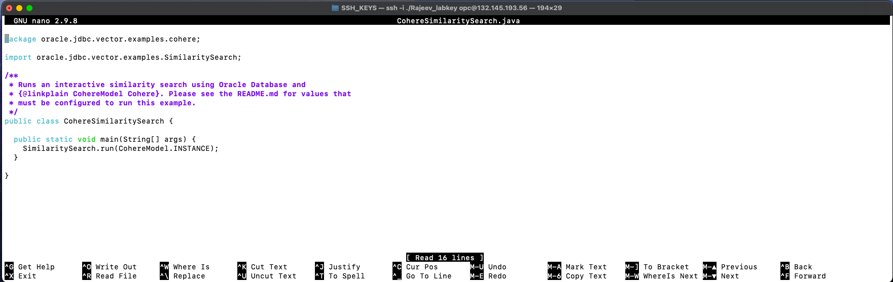

    ```
    <copy>
    package oracle.jdbc.vector.examples.cohere;

    import oracle.jdbc.vector.examples.SimilaritySearch;

    /**
    * Runs an interactive similarity search using Oracle Database and
    * the OCI Generative AI Service
    * must be configured to run this example.
    */
    public class CohereSimilaritySearch {

      public static void main(String[] args) {
        SimilaritySearch.run(CohereModel.INSTANCE);
      }
    }
    </copy>
    ```

    This is the CohereSimilaritySearch Java file.
</br>

  In addition, here is the CohereModel Java file
  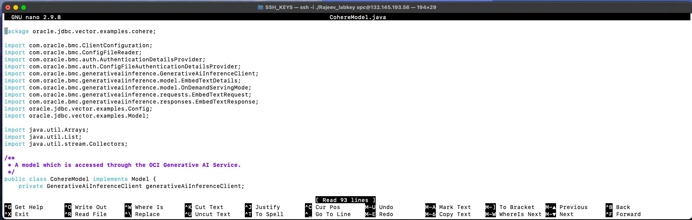
  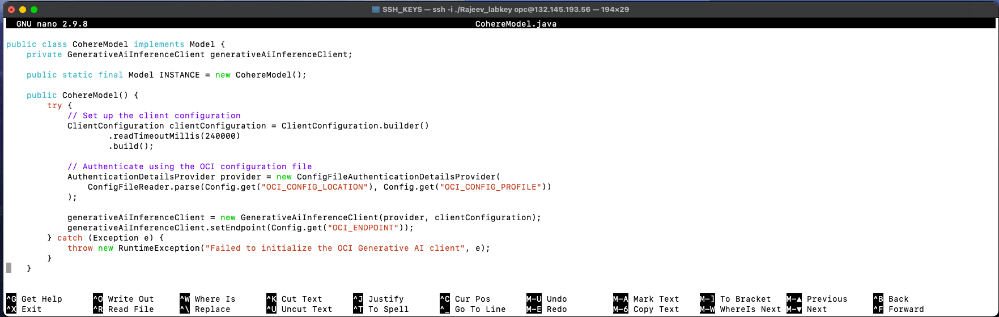


    ```
    <copy>
      package oracle.jdbc.vector.examples.cohere;

      import com.oracle.bmc.ClientConfiguration;
      import com.oracle.bmc.ConfigFileReader;
      import com.oracle.bmc.auth.AuthenticationDetailsProvider;
      import com.oracle.bmc.auth.ConfigFileAuthenticationDetailsProvider;
      import com.oracle.bmc.generativeaiinference.GenerativeAiInferenceClient;
      import com.oracle.bmc.generativeaiinference.model.EmbedTextDetails;
      import com.oracle.bmc.generativeaiinference.model.OnDemandServingMode;
      import com.oracle.bmc.generativeaiinference.requests.EmbedTextRequest;
      import com.oracle.bmc.generativeaiinference.responses.EmbedTextResponse;
      import oracle.jdbc.vector.examples.Config;
      import oracle.jdbc.vector.examples.Model;

      import java.util.Arrays;
      import java.util.List;
      import java.util.stream.Collectors;

      /**
      * A model which is accessed through the OCI Generative AI Service.
      */
      public class CohereModel implements Model {
          private GenerativeAiInferenceClient generativeAiInferenceClient;

          public static final Model INSTANCE = new CohereModel();

          public CohereModel() {
              try {
                  // Set up the client configuration
                  ClientConfiguration clientConfiguration = ClientConfiguration.builder()
                          .readTimeoutMillis(240000)
                          .build();

                  // Authenticate using the OCI configuration file
                  AuthenticationDetailsProvider provider = new ConfigFileAuthenticationDetailsProvider(
                      ConfigFileReader.parse(Config.get("OCI_CONFIG_LOCATION"), Config.get("OCI_CONFIG_PROFILE"))
                  );

                  generativeAiInferenceClient = new GenerativeAiInferenceClient(provider, clientConfiguration);
                  generativeAiInferenceClient.setEndpoint(Config.get("OCI_ENDPOINT"));
              } catch (Exception e) {
                  throw new RuntimeException("Failed to initialize the OCI Generative AI client", e);
              }
          }

          @Override
          public float[][] embed(String[] texts) {
              List<String> inputs = Arrays.asList(texts);
              float[][] embeddings = new float[inputs.size()][];

              // Process in batches of up to 96 items
              int batchSize = 96;
              for (int start = 0; start < inputs.size(); start += batchSize) {
                  int end = Math.min(inputs.size(), start + batchSize);
                  List<String> batchInputs = inputs.subList(start, end);

                  EmbedTextDetails embedTextDetails = EmbedTextDetails.builder()
                          .servingMode(OnDemandServingMode.builder().modelId("cohere.embed-english-v3.0").build())
                          .compartmentId(Config.get("OCI_COMPARTMENT_ID"))
                          .inputs(batchInputs)
                          .build();

                  EmbedTextRequest request = EmbedTextRequest.builder()
                          .embedTextDetails(embedTextDetails)
                          .build();

                  EmbedTextResponse response = generativeAiInferenceClient.embedText(request);
                  float[][] batchEmbeddings = parseResponse(response);

                  // Combine batch embeddings into the main array
                  System.arraycopy(batchEmbeddings, 0, embeddings, start, batchEmbeddings.length);
              }

              return embeddings;
          }

          private float[][] parseResponse(EmbedTextResponse response) {
              List<List<Float>> embeddingsList = response.getEmbedTextResult().getEmbeddings();
              float[][] embeddings = new float[embeddingsList.size()][];
              for (int i = 0; i < embeddingsList.size(); i++) {
                  List<Float> embeddingList = embeddingsList.get(i);
                  embeddings[i] = new float[embeddingList.size()];

                  for (int j = 0; j < embeddingList.size(); j++) {
                    embeddings[i][j] = embeddingList.get(j);
                  }
                }
              // Placeholder for the response parsing logic
              // This should convert the response to the required float[][] format
              // Assume response parsing is implemented correctly here
              return embeddings;
          }
      }
    </copy>
    ```

  Now we shall run our program from the main root folder.
    ```
    <copy>
    mvn exec:java -pl ojdbc-vector-examples-cohere -Dexec.mainClass="oracle.jdbc.vector.examples.cohere.CohereSimilaritySearch"
    </copy>
    ```

    Once the program has run, you will be asked to create a Schema, write "Y" and press enter:

    

    You will now be within the SimilaritySearch interface.

2. For our first example, let's try the word "cars" at the prompt.</br>
You should see something similar to : </br>

    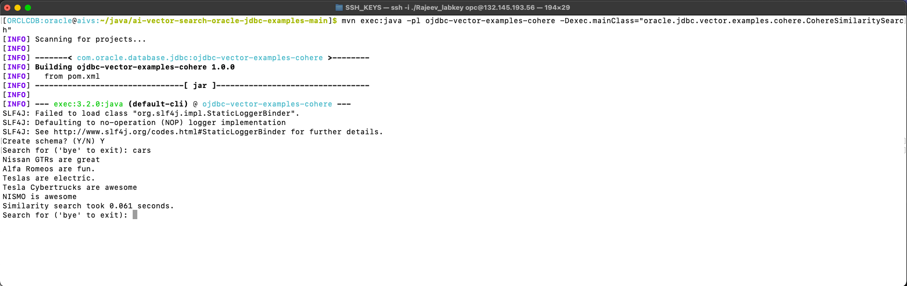

    It's possible that you will see times different to ours, as the time includes the network round trip REST call. With that being the case, we can see that the first operation is to vectorize the phrase, which in this case is "cars" and it took 0.061 seconds. <br>

    - Next we see that similarity search took 0.061 seconds to locate 5 related entries to the word "cars".
    - The 5 rows returned are the 5 most semantically simillar to our phrase cars from our sample data in MY_DATA table
    - The results themselves look like good results as all 5 of the factoids are in fact accurate with the phrase "cars".
    </br>

  3. Next we can type in the word "cats" </br>
  You should see something similar to :
  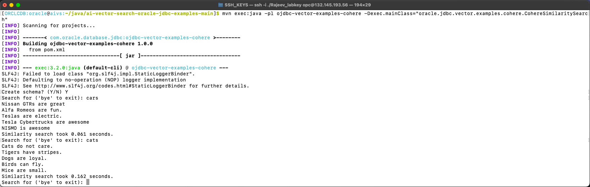

    - This time, the output does not appear to have the same level of accuracy as "Birds can fly" has nothing really to do with cats. Tigers are in the cat family so one can see the similarity there. As for "Dogs are loyal" and "Mice are small" are usally animals which have comman similaties with cats, as cats hunt mice and Cats and dogs are both popular pets. 
    - The entire point about Similarity Search is that it is not necessaritly exactly correct, as it is best to match given the available data using the given embedding model. The embedding model is trained using information avilable from the internet and other publicly sourced information.

4. We can also try another search phrase for example "fruit" or even "NY".

    We should see something similar to : </br>
    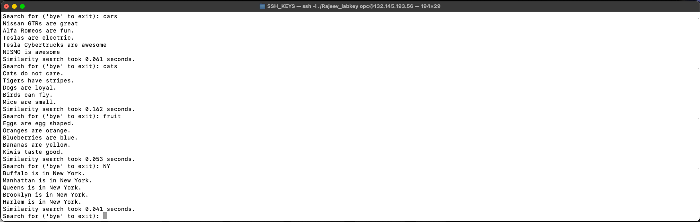

    - Both of these results were on target and illustrate the power of similarity search. The queries are very different to a traditional relational query where we are looking for an exact match, but in both of these instances neither of the terms "fruit" or "NY" were in our table. Similarity search is able to find a correlation. 
    - For "fruit", we see that Eggs are not fruits but they are a food. All the other returned searches are in fact fruits.
    - For "NY", you can see that Buffalo, a city within NY state is selected, not just the boroughs within NYC.

 5. Next we should search for "Borough".
    You should see something similar to :
    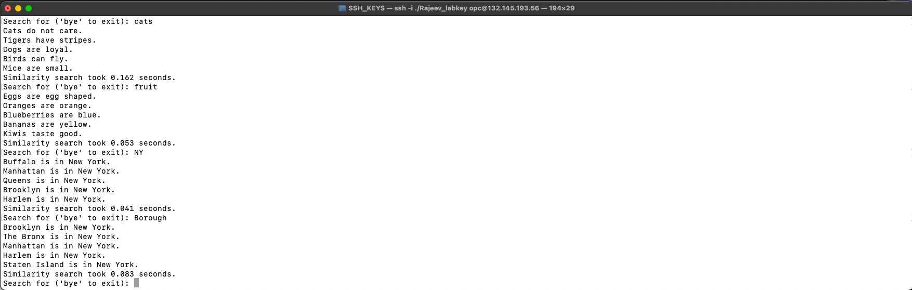

    - This phrase directs our similarity search to information related to New York City - and you should notice that now, we don't see "Buffalo". You may also notice that we see four of the five boroughs: "Bronx" , "Brooklyn", "Manhattan" and "Staten Island". We see "Harlem" which is a neighborhood within the borough of Manhattan, it is not a borough itself.

  6. For another experiment, we can enter the word "Bombay". You should see something similar to this :

    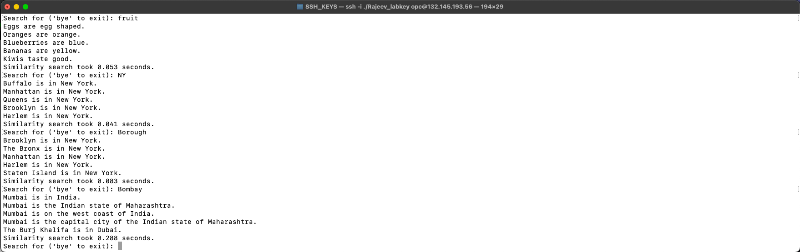
    - The word "Bombay" does not appear in our data set, but the results related to Mumbai are correct because "Bombay" is the former name for "Mumbai", and as such there is a strong correlation between the two names for the same geographic location. 

    Remember, similarity search works on the basis of the trained data from which the embedding models use. Trained embedding models use text sourced from the internet and it is very likely that there is information that includes both the names "Bombay" and "Mumbai" in relation to the same place.


  7. Now to see what happens when there is no correlation in the terms, let's try something completely random.

      Enter the phrase  phrase **"random stuff"** - you should see :

      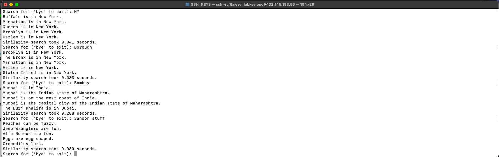

      The first thing you may notice is that there is little or no correlation between the terms returned and the phrase we entered. This is also likely influenced by the small data-set or number of rows in the MY\_DATA table.

      Go ahead and exit the program, type "bye" to exit.
      

Now that we are finished, we can take a quick look at the Vector column: V in the MY\_DATA table in the Oracle database to see what the change looks like by logging into sqlplus:

  ```
    <copy>
    sqlplus vector/vector@orclpdb1
    </copy>
  ```

  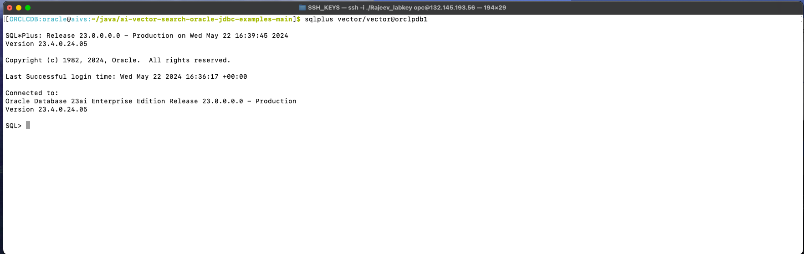

  ii. We can now query the MY\_DATA table to verify that all 150 rows have been updated.

  ```
    <copy>
    select count(*) from MY_DATA where V is not null;
    </copy>
  ```

  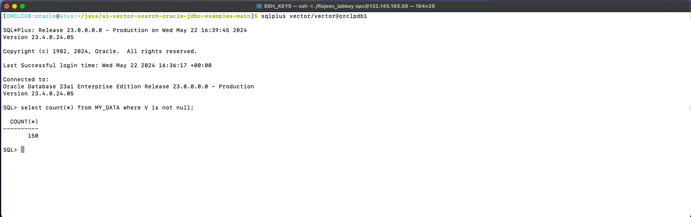

  iii. We can see the information within our table by writing 
  
  ```
  <copy>
  select info from my_data where V is not null;
  </copy>
  ```

   
  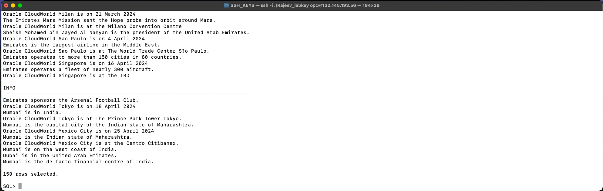

  iv. We can also query the vector column: V in the MY_DATA table to see what the vectors and dimensions look like.

  ```
    <copy>
    select V from MY_DATA ; 
    </copy>
  ```

  You should see: 

  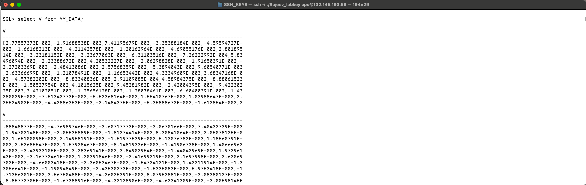
  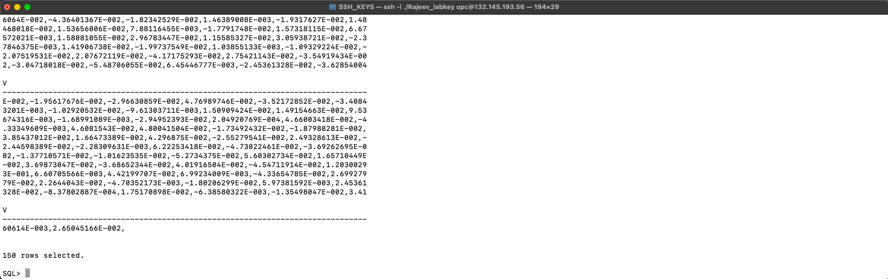
  
  What you are seeing is the semantic representation of the data stored in the corresponding row of the INFO column.


  To be honest it is difficult to see a change to our Vectors when we look at the raw data. An alternative query we can try is to see if the length of the V column has changed. We can run the following query to check this-

  iv. We can also query the length of the vectors stored in the V column by running the following query-

  ```
    <copy>
    select max(length(V)) from MY_DATA ;
    </copy>
  ```

  You should see something similar to this-

  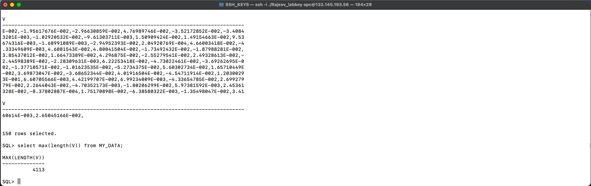 </br>

  You should notice that that length of the contents in the vector column: V is 4113. 

  This is approximately: ((1024 from Cohere Embed English v3.0 dimensions) x (4 bytes for each float dimension)) + (header overhead) 
  </br>

  To summarize what we've just done, the **`CohereSimilaritySearch`** program calls will run an interactive similarity search using Oracle Database and the **`CohereModel`** for generating vector embeddings. The main method in this class calls the run method of the SimilaritySearch class, passing the singleton instance of CohereModel as an argument. This setup leverages the OCI Generative AI service to generate embeddings and execute similarity searches. The CohereModel which is used implements the Model interface to generate the vector embedding. The class is initialized with an OCI client configured through client configuration and authentication details read from the configuration.properties file. The embed method processes input text in batches, sends requests to the OCI Generative AI Service to generate embeddings, and combines the results into a single 2D float array. The parseResponse method converts the embedding results from the service response into the required float array format for further use. The data stored within the `MY_DATA` table, is retrieved from the INFO column, and vectorizes the "factoid" for each of the 150 rows. We are storing the vectorized data as a vector in the column called: V. You will also notice that we are using `cohere.embed-english-v3.0` as the embedding model for this operation, both to vectorize our data when we populated the `MY_DATA` table, as well as when we performed our similarity searches. 

Next, let's show the steps if the user wants to change the Embedding Model.

## Task 3: Changing the Embedding Models
In the next step we will show the user what to do if they want to switch the embedding model so they can see the differences in similarity search results.

We will continue to use Cohere embedding through OCI Generative AI Service, so the modifications required are minor.

1. In order to do this we will need to edit a few of files:
    The first file we will be making changes to will be our config.properties file, located in our root folder ai-vector-search-oracle-jdbc-examples-main. Open the file using your editor of choice, we will be using nano. 

    ```
    <copy>
    nano config.properties
    </copy>
    ``` 

    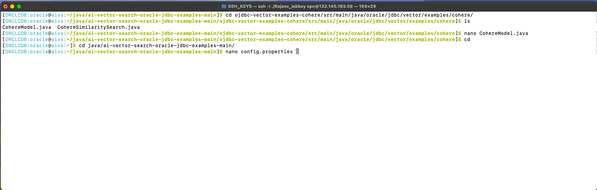 

    We will scroll down to the cohere section and change the listed model from  **'cohere.embed-english-v3.0'** to the user's desired new model. Insert the model of your choice, for example you can select **'cohere.*embed-multilingual-v3.0'**.

    
    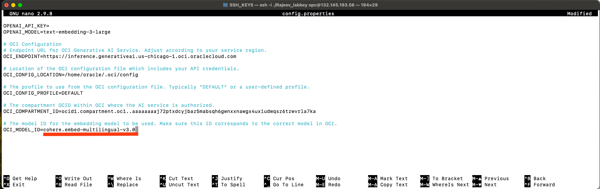

2. After making the change here, we will now go into the cohere folder, located in
**`/ai-vector-search-oracle-jdbc-examples-main/ojdbc-vector-examples-cohere/src/main/java/oracle/jdbc/vector/examples/cohere`**.
    
    ```
    ai-vector-search-oracle-jdbc-examples-main
    └── ojdbc-vector-examples-cohere
        └── src
            └── main
                └── java
                    └── oracle
                        └── jdbc
                            └── vector
                                └── examples
                                    └── cohere
    ```

    The file we shall make a correction to shall be the `CohereModel.java`.

    Scroll down until you see this portion of the code:

    ```
    // Process in batches of up to 96 items
        int batchSize = 96;
        for (int start = 0; start < inputs.size(); start += batchSize) {
            int end = Math.min(inputs.size(), start + batchSize);
            List<String> batchInputs = inputs.subList(start, end);
            
            EmbedTextDetails embedTextDetails = EmbedTextDetails.builder()
                    .servingMode(OnDemandServingMode.builder().modelId("cohere.embed-english-v3.0").build())
                    .compartmentId(Config.get("OCI_COMPARTMENT_ID"))
                    .inputs(batchInputs)
                    .build();

            EmbedTextRequest request = EmbedTextRequest.builder()
                    .embedTextDetails(embedTextDetails)
                    .build();
    ```


    Find line of code that reads:
    **".servingMode(OnDemandServingMode.builder().modelId("cohere.embed-english-v3.0").build())"**

    You will change that from **'cohere.embed-english-v3.0'** to **'cohere.embed-multilingual-v3.0'.**

    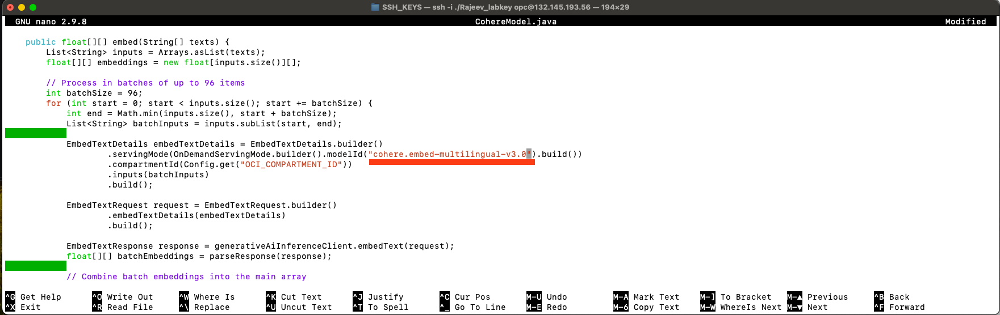

     Save and exit the nano editor.

3. Return to the root folder ai-vector-search-oracle-jdbc-examples-main. Once there run the mvn clean install since we made changes to the files.
    Run mvn clean install since we made configuration changes.
      ```
        <copy>
        mvn clean install
        </copy>
      ```

4. Now that it has finished building correctly, feel free to re run your CohereSimilaritySearch to see the differences in speed or results.
  You'll run the program with the same command as before :

    ```
    <copy>
    mvn exec:java -pl ojdbc-vector-examples-cohere -Dexec.mainClass="oracle.jdbc.vector.examples.cohere.CohereSimilaritySearch"
    </copy>
    ```

## Summary

Congratulations you've completed the lab!

Hopefully you have seen how easy it is to use Oracle OCI Generative AI Cohere with JDBC and Oracle Database 23ai with Similarity Search. You are ready to move onto trying this at home.


## Learn More
* [Oracle Database 23ai Release Notes](https://docs.oracle.com/en/database/oracle/oracle-database/23/rnrdm/)
* [Oracle AI Vector Search Users Guide](https://docs.oracle.com/en/database/oracle/oracle-database/23/vecse/)
* [Oracle Documentation](http://docs.oracle.com)


## Acknowledgements
* **Author** - Francis Regalado, Cloud Solutions Engineer
* **Last Updated By/Date** - Francis Regalado, May 2024

</if>

<if type="OpenAi">
# Lab 3: Using OpenAI Vector Embedding Models With JDBC

### **This module CANNOT run in The Live Labs platform and is for informational purposes only. This sample code is provided so that a student can run this example in their own environment.**
Note : in this lab we are using the Free version of 23ai, feel free to use EE if desired.

## Introduction

In this lab we will learn how to use the OpenAI embedding models and JDBC with Oracle Database 23ai. OpenAI is a commercial product and as such requires a licensed key to use their embedding models.


### **Objectives**

In this lab, you will see the following Vector operations using Java:
* Task 1: Preparing The Environment
* Task 2: Perform Similarity Search Using OpenAi
* Task 3: Changing Embedding Models

### **Prerequisites** 

This lab assumes you have:
* An Oracle Cloud Infrastructure account
* Your workshop environment is configured (Completed Lab 0)
* An API key for OpenAI (Can be a free trial key)
* Oracle Database 23ai is installed and running 
* Java 11 or newer installed
* Maven 3.9.6 or newer installed


## Task 1: Preparing The Environment
The first step in order to properly run our code, we will verify we are in the proper directory. Within the Operating System user oracle, go into the ai-vector-search-oracle-jdbc-examples-main folder. This shall be the root directory for our project.

```
<copy>
cd java/ai-vector-search-oracle-jdbc-examples-main/
</copy>
```

Now within the root folders directory, we want to make sure our code is able to compile and is executable. For that we will run maven clean install command.

```
<copy>
mvn clean install
</copy>
```

Everything should compile without an issue.

## Task 2: Perform Similarity Search using OpenAi

In this lab we will see how to perform a similarity search with the OpenAI embedding models using Java. Our table which has been provided within the Schema.java connects to the Oracle database, dops and creates a table called MY_DATA. The program then inserts 150 rows of sample data. We will vectorize our search phrase with the embedding model provided by OpenAI. The search phrase is entered in the console by the user, vectorized and then used to search against the vectors in the database.

Running the `OpenAiSimilaritySearch.java` performs and interactive similarity search using Oracle Database combined with the defined OpenAI model. The main method in this class calls a static run method from the 'SimilaritySearch' class, passing the singleton instance of `OpenAiModel` as an argument.

Within the ojdbc-vector-examples-openai, there are 2 files we shall be addressing:  **`OpenAiModel.java`** and **`OpenAiSimilaritySearch.java`**. Once we run our OpenAiSimilaritySearch program and as perform our searches, we connect to OpenAi to vectorize our search phrase with the same embedding model. Let's take a look at how our files look.

### **OpenAiModel.java** 
</b>

1. Let's begin with viewing the contents of the Java file **`OpenAiModel.java`**

    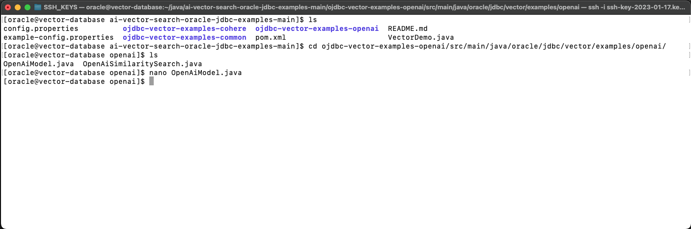
</br>

    ```
    package oracle.jdbc.vector.examples.openai;

    import com.theokanning.openai.OpenAiHttpException;
    import com.theokanning.openai.embedding.Embedding;
    import com.theokanning.openai.embedding.EmbeddingRequest;
    import oracle.jdbc.vector.examples.Config;
    import oracle.jdbc.vector.examples.Model;
    import com.theokanning.openai.service.OpenAiService;

    import java.util.Arrays;
    import java.util.List;

    /**
    * A model implemented with OpenAI. This implementation uses the community
    * maintained Java client for OpenAI:
    * <a href="https://github.com/TheoKanning/openai-java/tree/main">
    * OpenAI-Java
    * </a>
    */
    final class OpenAiModel implements Model {


      /** Singleton instance of this class */
      static final OpenAiModel INSTANCE = new OpenAiModel();
      private OpenAiModel() { }

      private static final OpenAiService SERVICE =
        new OpenAiService(Config.get("OPENAI_API_KEY"));

      @Override
      public float[][] embed(String[] sentences) {
        EmbeddingRequest request =
          EmbeddingRequest.builder()
            .input(Arrays.asList(sentences))
            .model(Config.getOrDefault("OPENAI_MODEL", "text-embedding-3-small"))
            .build();

        do {
          try {
            return SERVICE.createEmbeddings(request)
              .getData()
              .stream()
              .map(Embedding::getEmbedding)
              .map(OpenAiModel::toFloatArray)
              .toArray(float[][]::new);
          }
          catch (OpenAiHttpException httpException) {
            if (!"rate_limit_exceeded".equals(httpException.code))
              throw httpException;

            // A "rate_limit_exceeded" error means that too many requests have been
            // sent within a period of time. Recover from this by waiting.
            System.out.println(httpException.getMessage());
            try {
              for (int i = 20; i >= 0; i--) {
                System.out.print("Waiting " + i + " seconds...\r");
                Thread.sleep(1_000);
              }
            }
            catch (InterruptedException interruptedException) {
              System.out.println("Wait interrupted");
            }
          }
        } while (true);

      }

      private static float[] toFloatArray(List<Double> doubleList) {
        float[] floatArray = new float[doubleList.size()];

        for (int i = 0; i < floatArray.length; i++)
          floatArray[i] = doubleList.get(i).floatValue();

        return floatArray;
      }
    }
    ```

    The **'OpenAiModel.java'** is class that implements the **Model** interface for generating vector embeddings of sentences using OpenAi's embedding service. The implementation uses the community maintained Java Client for OpenAI. It defines a singleton `OpenAiModel` class that implements the `Model` interface and provides a method to embed sentences using OpenAi's embedding service. 
</br>

    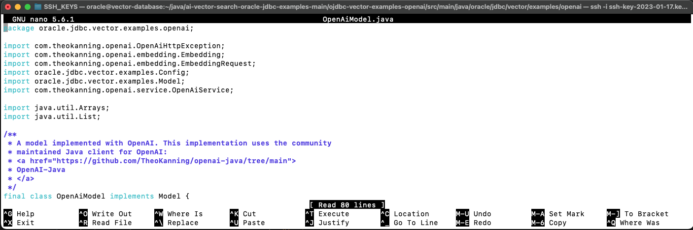

    Next,it uses the `OpenAiService` to send embedding requests via the OpenAI API with the specified model, which is configurable within the `Config` class and config.proferties file. Once it has access the key, it selects which embedding model to run, this this case we first defined "text-embedding-3-small". </br>

    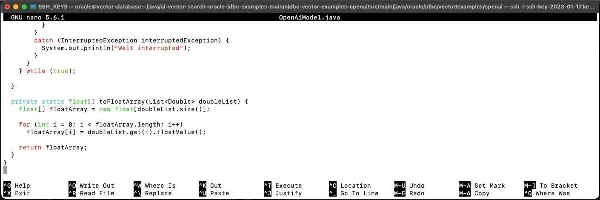

    Now it will create the embedding. If it encounters a limit, it will throw an exception. In this case, we defined a rate limit exception if the user is using a free api key. The system will wait a specified 20 seconds.The `embed` method processes the response to convert the embeddings from a list of `Double` to a 2D array of `float`. 


    This concludes the `OpenAiModel.java` program. </br>
</br>

### **OpenAiSimilaritySearch.java** </br>

2. Now we will look at the next java file **`OpenAiSimilaritySearch.java`**. 

    ```
    package oracle.jdbc.vector.examples.openai;

    import oracle.jdbc.vector.examples.SimilaritySearch;

    /**
    * Runs an interactive similarity search using Oracle Database and
    * OpenAiModel OpenAI
    */
    public class OpenAiSimilaritySearch {

      public static void main(String[] args) {
        SimilaritySearch.run(OpenAiModel.INSTANCE);
      }

    }
    ```

    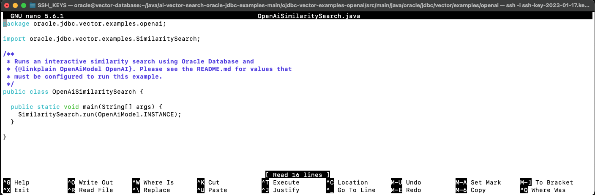 

    This is the java code which we shall be running from the main root directory folder. The Java code defines a class **`OpenAiSimilaritySearch`** that performs an interactive similarity search using Oracle Database combined with an **`OpenAiModel`** for generating vector embeddings. The **`main`** method in this class calls the **`run`** method from the **`SimilaritySearch`** class, passing the singleton instance of **`OpenAiModel`** as an argument.

    In order to execute this program, we shall run:

    ```
    <copy>
    mvn exec:java -pl ojdbc-vector-examples-openai -Dexec.mainClass="oracle.jdbc.vector.examples.openai.OpenAiSimilaritySearch"
    </copy>
    ```
    Once you run the similarity search Java program, the first thing you shall see is:
      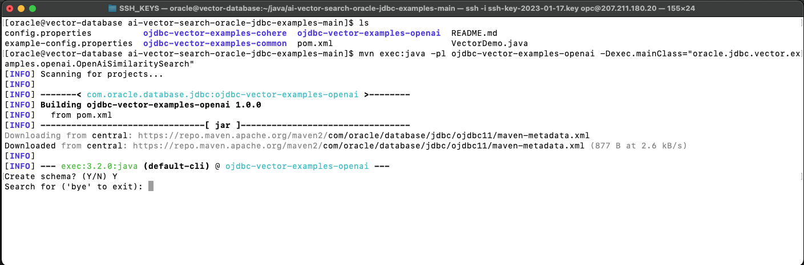 

3. For our first example let's enter the word "cars". This is the same phrase we tested with other models,so you'll know what to expect. As expected, these results should be the conceptually similar.
</br>

  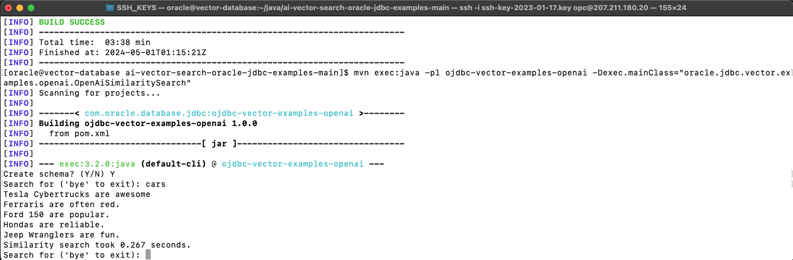

  Next let's try the phrase "cats" and see what our results are.

    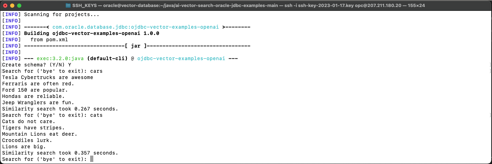

    Looking at the query output, not all the results are directly related to our search term: "cats", being that four out of the five rows return a member of the cat family, while "crocodile" is the outlier. One could argue that there is a minor correlation as all 5 rows are animal associations. This is not too bad considering our relatively small number of 150 entries.


    If we try a more general term like "animals" we should see the following:

    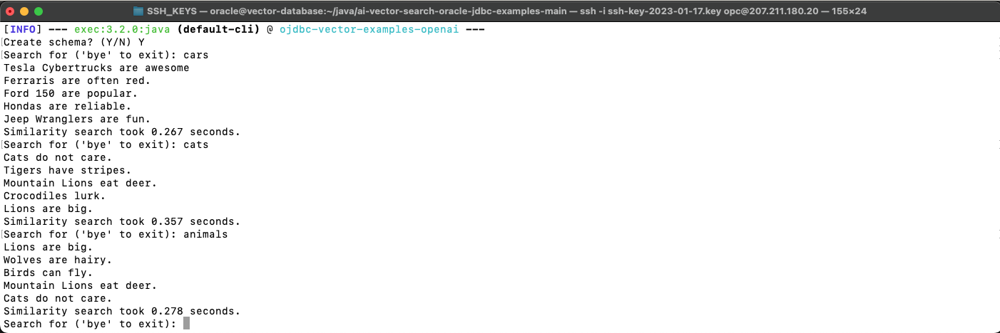

    All 5 entries are correct as they contain an animal in the results.

    Let's try our two queries related to New York: </br>
    The first shall be "NY" and then "boroughs"

    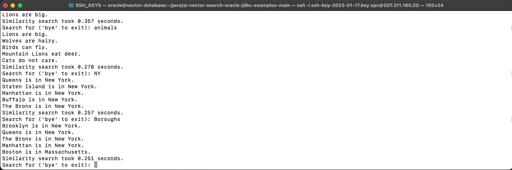

    The results for "NY" are related to places located in the state of "New York". You see Buffalo is a city in New York State and the others are boroughs within New York City. In the second search of Borough, it's not as accurate. Although the first 4 results are actual boroughs located in New York City, "Boston" is not even in the state of New York. It is important to remember that similarity search can respond with results that vary depending on the embedding model in use.

    Another intereting query to test is the phrase "New Zealand".

    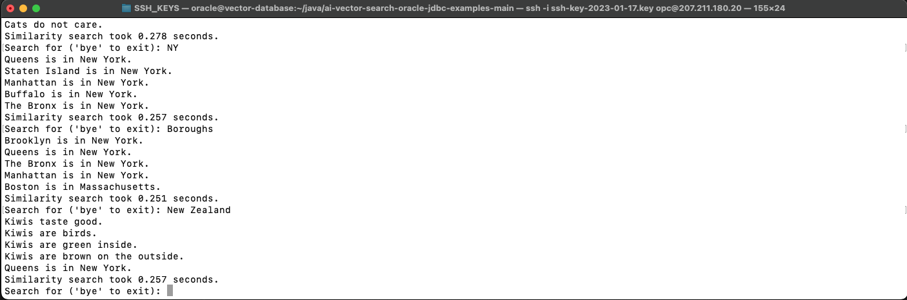

    The top 4 results we see when using OpenAi and the "text-embedding-3-small" embedding model are related to the place "New Zealand" ("Kiwi" is slang for a person from New Zealand, and Kiwi birds and Kiwi fruit are native to New Zealand). However the last entry about "Queens" seems very random, though it is a geographic location and the word "New" appears in both phrases, so one could argue there is a slight correlation here.

    Now that our data has been vectorize, we should take a look in the the Oracle database to see the updates made to the *MY\_DATA* table.

    Let us exit our Similarity Search program by typing "bye".

    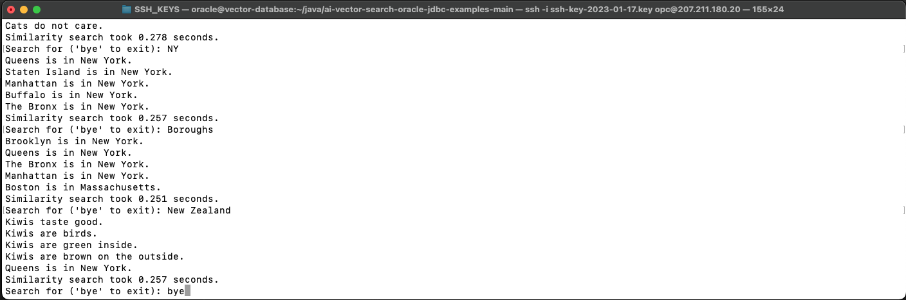

    Now let us connect to our database

    i. Connect to your Oracle database as the user: **vector** and password: **vector**

    ```
    <copy>
    sqlplus vector/vector@FREEPDB1
    </copy>
    ```

    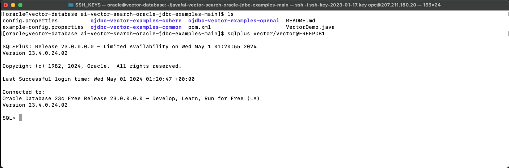

    ii. We can now query the MY\_DATA table to verify that all 150 rows have been updated.

    ```
    <copy>
    select count(*) from MY_DATA where V is not null;
    </copy>
    ```
    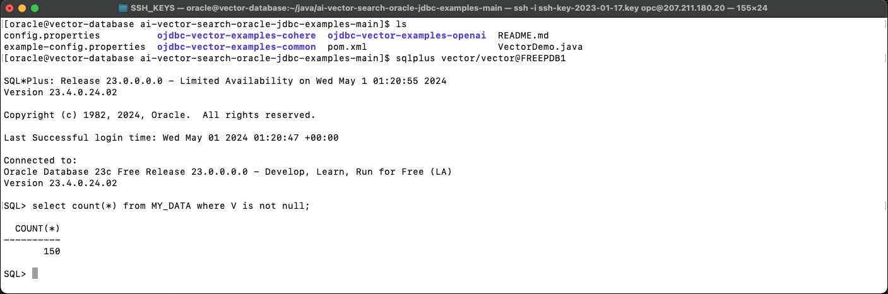


    iii. We can also query the vector column: V in the MY\_DATA table to see what the vectors and dimensions look like.

    ```
    <copy>
    select V from MY_DATA;
    </copy>
    ```

    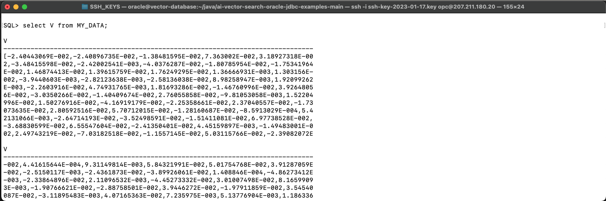
    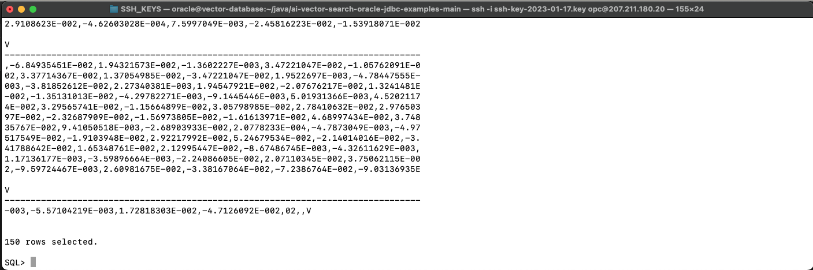


    What you are seeing is the semantic representation of the data stored in the corresponding row of the INFO column.
        
    iv. We can also query the length of the vectors stored in the V column by running the following query-

    ```
    <copy>
    select max(length(V)) from MY_DATA ;
    </copy>
    ```

    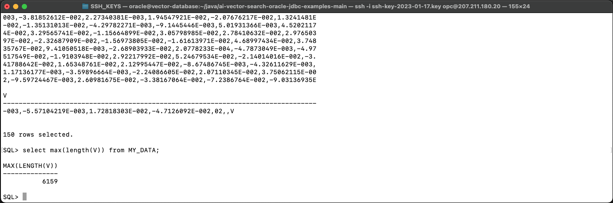

    You will notice that the length of the vector in column: **V** is 6159.

    This is approximately: ((1536 dimensions from text-embedding-3-small) x (4 bytes for each float dimension)) + (header overhead)


## Task 3: Changing Embedding Models
1. Let's experiment with changing the embedding model in our OpenAi Java program.

    In this case we are going to see what happens when we switch to a larger embedding model. We will switch from *"text-embedding-3-small"* to *"text-embedding-3-large"*. This change increases the number of dimensions for each Vector from 1536 to 3072, so hopefully the accuracy of our search results will improve. 
    </br>

      **NOTE:** There is a difference in cost when using different embedding models in OpenAI. Pricing information for the OpenAI embedding models is available here: https://openai.com/pricing
    
    Remember the embedding model used for similarity search must match in both the `config.properties` file as well as the `OpenAiModel.java` file. 

    First go to the config.properties file located in the root folder

      The first file we will be making changes to will be our config.properties file, located in our root folder ai-vector-search-oracle-jdbc-examples-main. Open the file using your editor of choice, we will be using nano. 

      ```
      <copy>
      nano config.properties
      </copy>
      ``` 

      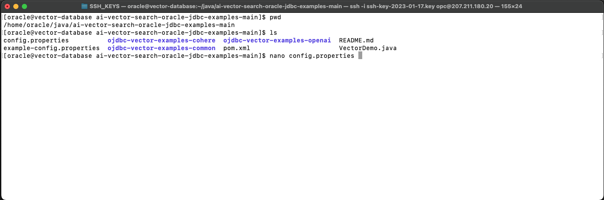

    We will scroll down to the openai section and change the listed model from **"text-embedding-3-small"** to **"text-embedding-3-large"**. </br>

      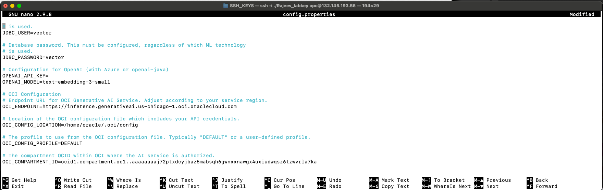
      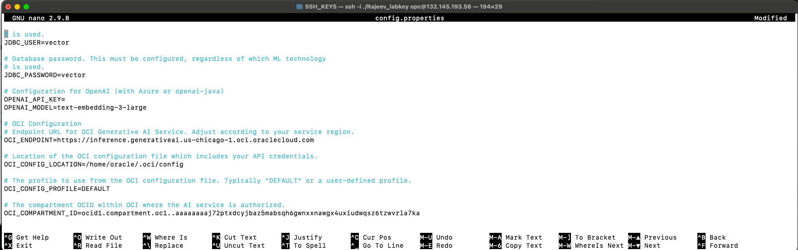

    After making the change here, we will now go into the openai folder, located in `/ai-vector-search-oracle-jdbc-examples-main/ojdbc-vector-examples-openai/src/main/java/oracle/jdbc/vector/examples/openai`.

    ```
    ai-vector-search-oracle-jdbc-examples-main
    └── ojdbc-vector-examples-openai
        └── src
            └── main
                └── java
                    └── oracle
                        └── jdbc
                            └── vector
                                └── examples
                                    └── openai
    ```

    The file we shall make a correction to shall be the `OpenAiModel.java`

    Open the file using your code editor of choice, in this case we will be choosing nano

    ```
    nano OpenAiModel.java
    ```

    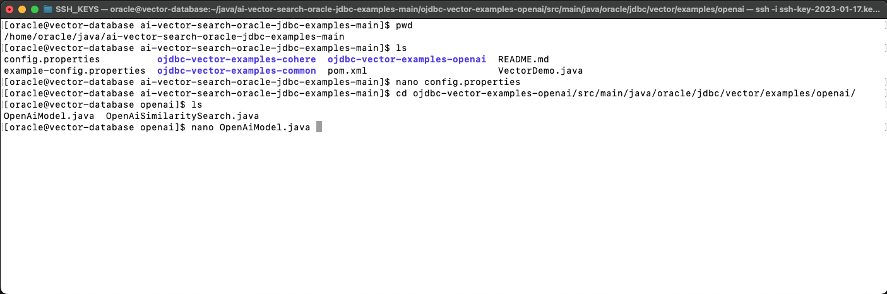


    Scroll down until you see the code section 

    ```
    <copy>
      private static final OpenAiService SERVICE =
        new OpenAiService(Config.get("OPENAI_API_KEY"));

      @Override
      public float[][] embed(String[] sentences) {
        EmbeddingRequest request =
          EmbeddingRequest.builder()
            .input(Arrays.asList(sentences))
            .model(Config.getOrDefault("OPENAI_MODEL", "text-embedding-3-small"))
            .build();
    </copy>
    ```

    replace the "text-embedding-3-small" with "text-embedding-3-large"

    Save and exit the code editor.

    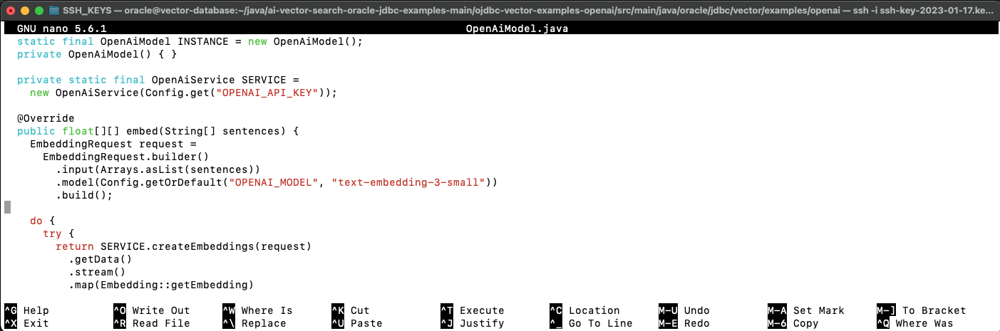
    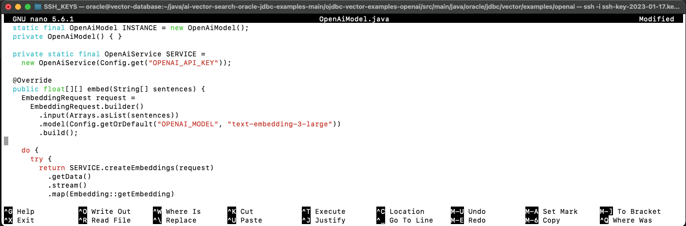


2. Now return to your root folder ai-vector-search-oracle-jdbc-examples-main. Run mvn clean install since we made configuration changes.

    

    ```
    <copy>
    mvn clean install
    </copy>
    ```

    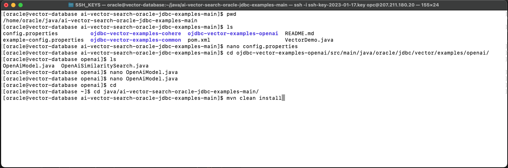

3. We're now ready rerun the Similarity Search program once again: </br> 

    ```
    <copy>
    mvn exec:java -pl ojdbc-vector-examples-openai -Dexec.mainClass="oracle.jdbc.vector.examples.openai.OpenAiSimilaritySearch"
    </copy>
    ```
    
    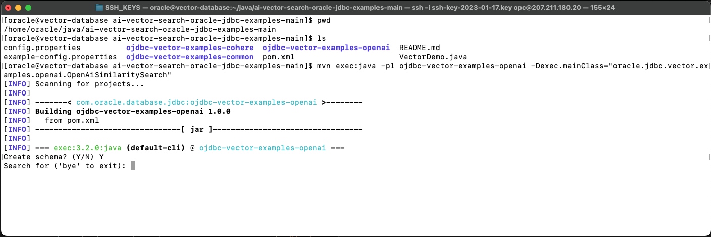


4. As a baseline let's start with our familar search terms "cars".

    You should see :
    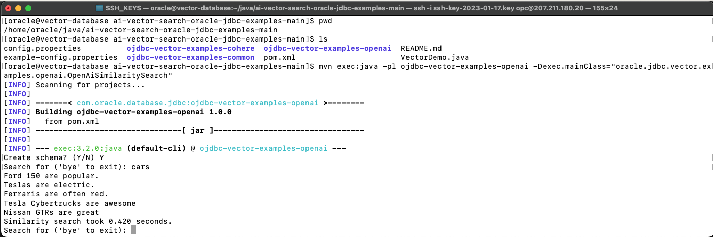

    The first thing you should notice it that performance with the larger model is slower than the smaller model. This is expected. Also, the results of the similarity search for the phrase "cars" is once again 100% accurate, however the phrases returned are different to those returned when we used the smaller embedding model. 

    Now let's try the phrase "cats" to asses if there are any changes : 

    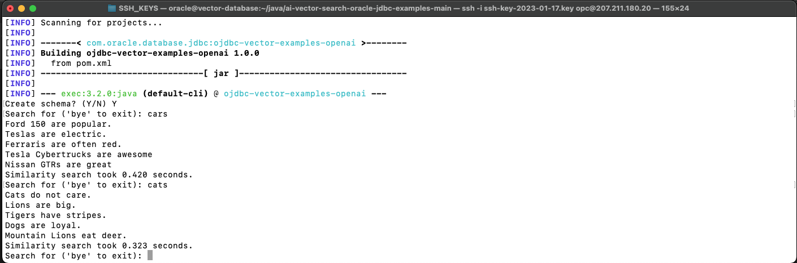


    This time we will see four of the five results include terms directly related to Cats. One could argue that while the one off phrase is not specific to cats, there is a closer correlation between cats and dogs versus cats and crocodiles. 

    Let's revisit our other combinations of phrases "NY" and "Boroughs" to see whether the embedding model makes a difference.

    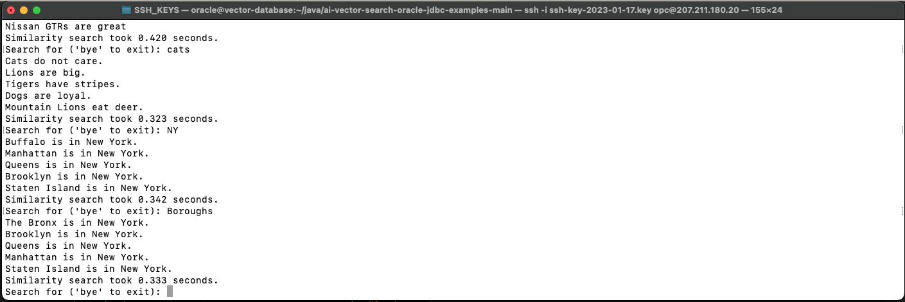

    This time, both phrases return 100% correct results. So the large model with more dimesions provides us with a better accuracy. 

    Another phrase to retry is "New Zealand".

    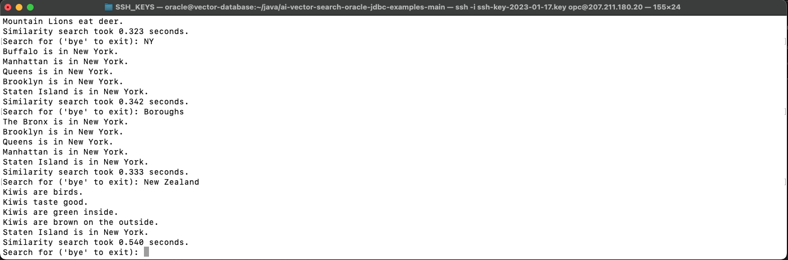
    
    Once again, the top 4 results are the same as when using the OpenAI "text-embedding-3-small" embedding model. All four phrases are related to the place "New Zealand" ("Kiwi" is slang for a person from New Zealand, and *Kiwi birds* and *Kiwi fruit* are native to New Zealand). However once again the last phrase about "Staten Island" seems very out of place at first. But it is a geographic location and the word "New" appears in both phrases, so one could argue there is a slight correlation here.

    Feel free to try some other queries including repeating some of the previous examples we entered when we used other embedding models for your own comparison. 
    

5. Now that we are finished, we can take a quick look at the Vector column: V in the MY\_DATA table in the Oracle database to see what the change looks like by logging into sqlplus:

    i. First exit the Similarity Search program by entering "bye" </br>  
    
    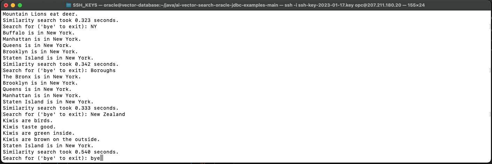

    ```
    <copy>
    sqlplus vector/vector@FREEPDB1
    </copy>
    ```
    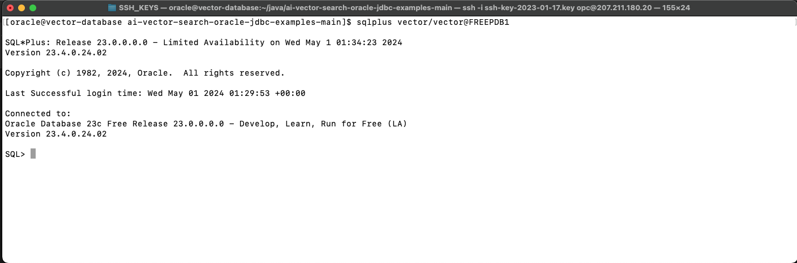

    ii. Next, run the following query-

    ```
      <copy>
      select V from MY_DATA ; 
      </copy>
    ```

    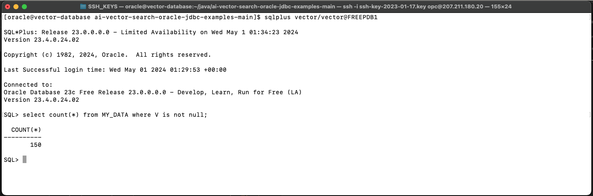

    ii. We can now query the MY\_DATA table to see what the vectors and dimensions look like

    ```
    <copy>
    select V from MY_DATA;
    </copy>
    ```

    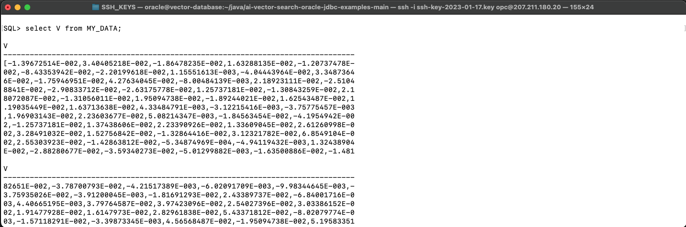
    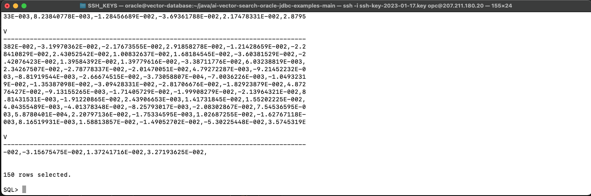

    
    To be honest it is difficult to see a change to our Vectors when we look at the raw data. An alternative query we can try is to see if the length of the V column has changed. We can run the following query to check this-

    ```
      <copy>
      select max(length(V)) from MY_DATA ;
      </copy>
    ```

    You should see something similar to this-

      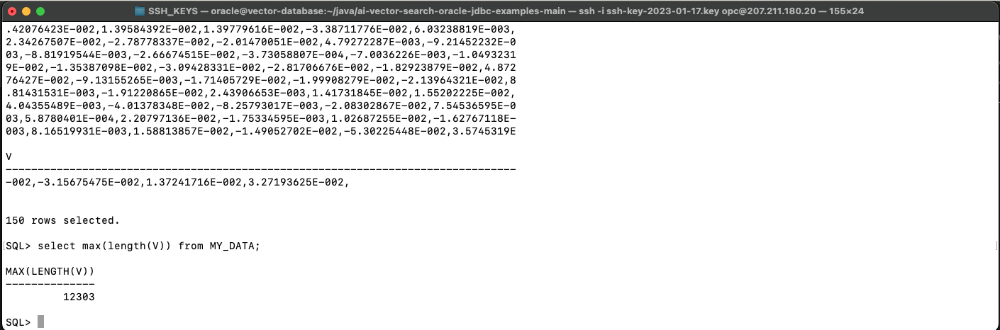

    You should notice that that length of the contents in the vector column: V is now 12303.  You may recall it was 6159 when we used the smaller model.
  
    This is approximately: ((3072 dimensions from text-embedding-3-large) x (4 bytes for each float dimension)) + (header overhead)

    To summarize, the difference between the two OpenAI embedding models we've tried, comes down to performance versus accuracy. There are times where accuracy is more important than performance and vice versa. This is a trade-off you will need to decide upon - based on your specific use-case. The least of your concerns is whether or not the Oracle database can accomodate different embedding models.  The effort to support different embedding models with Oracle Database is minimal. 

    Feel free to try some other queries including repeating some of the previous examples we entered with the "small" embedding model for your own comparison. 

## Summary

Congratulations you've completed the lab!

Hopefully you have seen how easy it is to use OpenAI with JDBC and Oracle Database 23ai with Similarity Search. This concludes this lab.

## Learn More
* [Oracle Database 23ai Release Notes](https://docs.oracle.com/en/database/oracle/oracle-database/23/rnrdm/)
* [Oracle AI Vector Search Users Guide](https://docs.oracle.com/en/database/oracle/oracle-database/23/vecse/)
* [Oracle Documentation](http://docs.oracle.com)


## Acknowledgements
* **Author** - Francis Regalado, Cloud Solutions Engineer
* **Last Updated By/Date** - Francis Regalado, May 2024


</if>