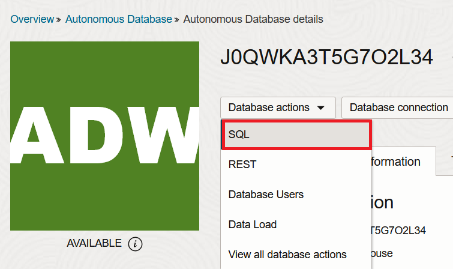
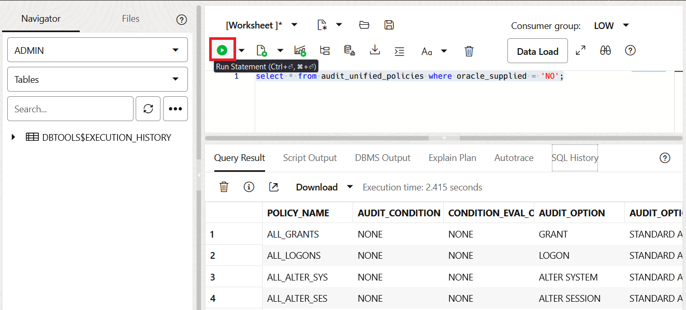
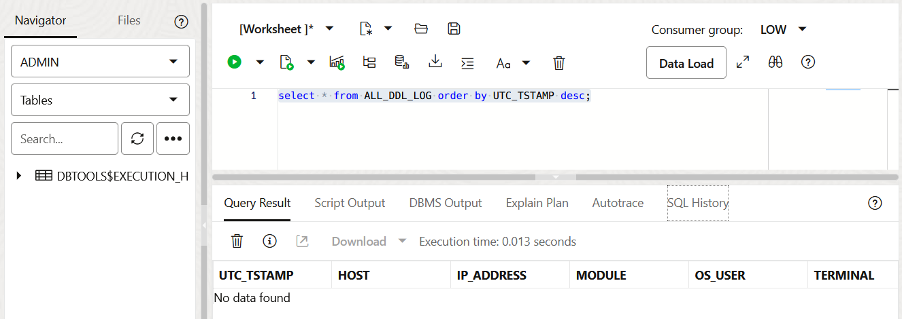
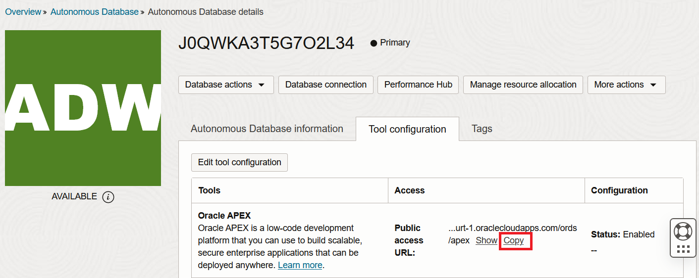
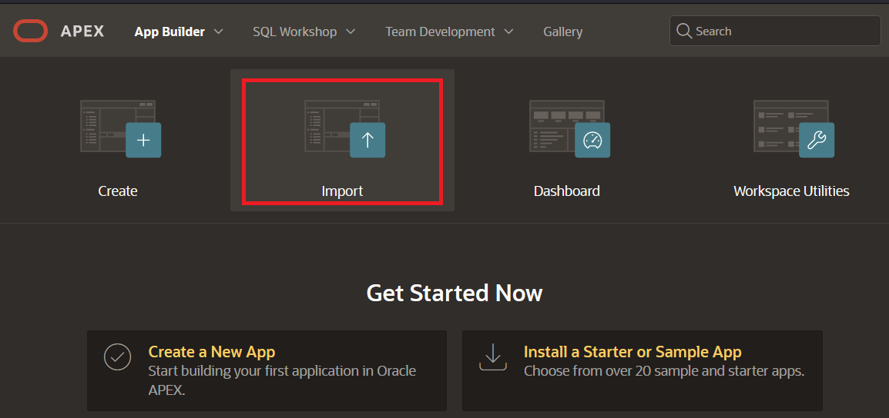
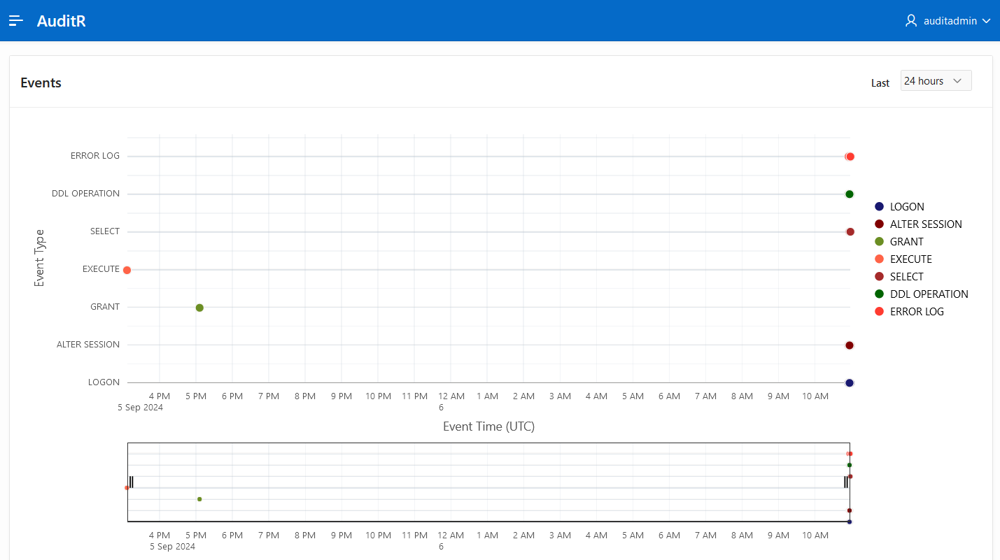
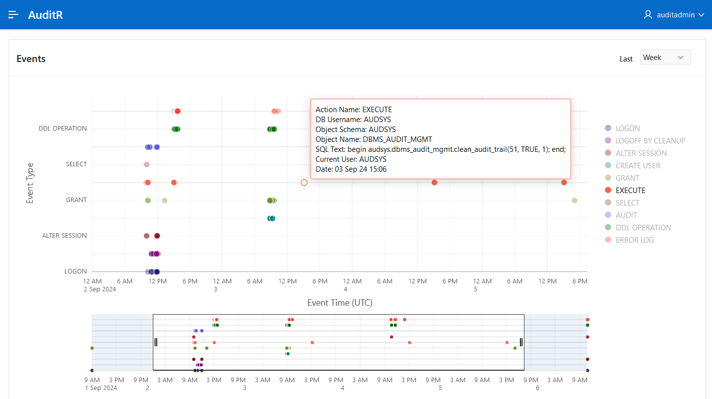
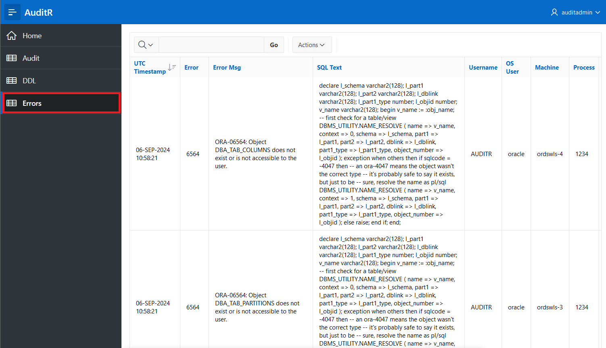

# Oracle Database custom audit events

## Introduction

This lab walks you through the steps to collect audit information from an Oracle Database instance and use it to build customized charts and reports using Oracle Application Express (APEX). For this example, you will use an Oracle Autonomous Database (ADB) running in Oracle Cloud Infrastructure (OCI).
This simple example collects audit information from the standard unified audit trail and two custom sources:
- DDL statements and code executed;
- Errors raised in the database instance. 

Estimated Time: 60 minutes

### Objectives

In this lab, you will:
* Create a cloud database instance and necessary objects
* Customize audit policies and sources
* Create application user and setup APEX workspace
* Deploy practice APEX application with charts and reports

### Prerequisites

This lab assumes you have the following:
* Oracle Cloud Infrastructure (OCI) account
* OCI resources: Virtual Cloud Network (VCN), Oracle Autonomous Database (ADB)
* Oracle REST Data Services (ORDS) and Application Express (APEX)
* Basic experience with OCI and APEX

## Task 1: Create ADB instance and objects

1. Navigate to OCI console main menu ≡ > Oracle Database > **Autonomous Database**.

    

2. Click **Create Autonomous Database**.

    

3. Use the form to **Create Autonomous Database** instance, any flavor and shape, including Always Free.

    

4. When your Autonomous Database (ADB) instance is **available**, click Database Actions > **SQL**.

    

5. Create a table to store all database errors.

    ```sql
    <copy>
    create table ALL_ERROR_LOG
    (
        utc_tstamp TIMESTAMP(6) default SYS_EXTRACT_UTC(SYSTIMESTAMP) NOT NULL,
        error      VARCHAR2(30),
        error_msg  VARCHAR2(4000),
        sql_text   CLOB,
        username   VARCHAR2(30),
        osuser     VARCHAR2(20),
        machine    VARCHAR2(64),
        process    VARCHAR2(8),
        program    VARCHAR2(48)
    );
    </copy>
    ```

6. When executing DDL, click the **Run Script** button.

    

7. Create an index on top of the errors table.

    ```sql
    <copy>
    CREATE INDEX ALL_ERROR_LOG_IX ON ALL_ERROR_LOG (utc_tstamp);
    </copy>
    ```

8. Create a trigger to capture database errors.

    ```sql
    <copy>
    create or replace trigger ERROR_GRABBER
    after servererror on database
    disable
    declare
        var_error     VARCHAR2(30);
        var_error_msg VARCHAR2(4000);
        my_message    VARCHAR2(32000);
        var_user      VARCHAR2(30);
        var_osuser    VARCHAR2(20);
        var_machine   VARCHAR2(64);
        var_process   VARCHAR2(8);
        var_program   VARCHAR2(48);
        stmnt_list    dbms_standard.ora_name_list_t;
        n             PLS_INTEGER;
    begin
        select username, osuser, machine, process, program
            into var_user, var_osuser, var_machine, var_process, var_program
            from sys.v_$session
            where audsid = userenv('sessionid')
            fetch FIRST 1 ROWS ONLY;
        n := dbms_standard.original_sql_txt(stmnt_list);
        if to_char(n) IS NULL then my_message := to_clob('N/A');
        else
            FOR i in 1..n LOOP
                my_message := my_message || stmnt_list(i);
            END LOOP;
        end if;
        var_error := dbms_standard.server_error(1);
        var_error_msg := dbms_standard.server_error_msg(1);
        insert into ALL_ERROR_LOG
        values (SYS_EXTRACT_UTC(SYSTIMESTAMP),
                var_error,
                var_error_msg,
                my_message,
                var_user,
                var_osuser,
                var_machine,
                var_process,
                var_program
                );
    end;
    /
    </copy>
    ```

9. Enable the trigger.

    ```sql
    <copy>
    alter trigger ERROR_GRABBER enable;
    </copy>
    ```

10. Verify records in the errors table.

    ```sql
    <copy>
    select * from ALL_ERROR_LOG order by UTC_TSTAMP desc;
    </copy>
    ```

11. When executing SQL select statement, click the **Run Statement** button.

    

12. Create a table to store all DDL statements executed.

    ```sql
    <copy>
    create table ALL_DDL_LOG
    (
    utc_tstamp   TIMESTAMP(6) default SYS_EXTRACT_UTC(SYSTIMESTAMP) NOT NULL,
    host         VARCHAR2(50),
    ip_address   VARCHAR2(16),
    module       VARCHAR2(100),
    os_user      VARCHAR2(20),
    terminal     VARCHAR2(50),
    operation    VARCHAR2(50),
    owner        VARCHAR2(50),
    object_name  VARCHAR2(150),
    object_type  VARCHAR2(25),
    sqltext      CLOB
    );
    </copy>
    ```

13. Create an index on top of the DDL statements table.

    ```sql
    <copy>
    CREATE INDEX ALL_DDL_LOG_IX ON ALL_DDL_LOG (utc_tstamp);
    </copy>
    ```

14. Create a trigger to capture all DDL statements executed.

    ```sql
    <copy>
    create or replace trigger DDL_GRABBER
    after create or alter or drop on database
    disable
    declare
        l_string   varchar2(32000);
        l_sql_text ora_name_list_t;
        l_n        number;
    begin
        if nvl(sys_context('USERENV', 'MODULE' ), 'x' ) != 'DBMS_SCHEDULER'
        then
            l_n := ora_sql_txt(l_sql_text);
            for i in 1 .. l_n
            loop
                l_string := l_string || l_sql_text(i);
            end loop;

            insert into ALL_DDL_LOG
            values (SYS_EXTRACT_UTC(SYSTIMESTAMP),
                    sys_context('USERENV', 'HOST'),
                    sys_context('USERENV', 'IP_ADDRESS'),
                    sys_context('USERENV', 'MODULE'),
                    sys_context('USERENV', 'OS_USER'),
                    sys_context('USERENV', 'TERMINAL'),
                    ora_sysevent,
                    ora_dict_obj_owner,
                    ora_dict_obj_name,
                    ora_dict_obj_type,
                    case when ora_dict_obj_type not in ('PACKAGE', 'PROCEDURE', 'FUNCTION', 'PACKAGE BODY') then
                        l_string
                    end
                    );
        end if;
    exception
        when others then
            RAISE;
    end;
    /
    </copy>
    ```

15. Enable the DDL capturing trigger.

    ```sql
    <copy>
    alter trigger DDL_GRABBER enable;
    </copy>
    ```

16. Verify records in the captured DDL table.

    ```sql
    <copy>
    select * from ALL_DDL_LOG order by UTC_TSTAMP desc;
    </copy>
    ```

## Task 2: Add specific audit policies

1. Both new tables `ALL_ERROR_LOG` and `ALL_DDL_LOG` are empty if you didn't run any DDL statement or you have not received any errors.

    

2. Create an audit policy for privilege grants.

    ```sql
    <copy>
    CREATE AUDIT POLICY all_grants ACTIONS GRANT;
    </copy>
    ```

3. Activate the grants audit policy.

    ```sql
    <copy>
    AUDIT POLICY all_grants;
    </copy>
    ```

4. Create an audit policy for `LOGON` actions.

    ```sql
    <copy>
    CREATE AUDIT POLICY all_logons ACTIONS LOGON;
    </copy>
    ```

5. Activate the `LOGON` actions audit policy.

    ```sql
    <copy>
    AUDIT POLICY all_logons EXCEPT ORDS_PUBLIC_USER;
    </copy>
    ```

6. Create an audit policy for `ALTER SYSTEM` executions.

    ```sql
    <copy>
    create audit policy all_alter_sys actions alter system;
    </copy>
    ```

7. Activate the `ALTER SYSTEM` audit policy.

    ```sql
    <copy>
    audit policy all_alter_sys;
    </copy>
    ```

8. Create the last audit policy for alter session commands.

    ```sql
    <copy>
    create audit policy all_alter_ses actions alter session;
    </copy>
    ```

9. Activate the alter session audit policy.

    ```sql
    <copy>
    AUDIT POLICY all_alter_ses EXCEPT ORDS_PUBLIC_USER;
    </copy>
    ```

10. Verify all audit policies that are not supplied by default.

    ```sql
    <copy>
    select * from audit_unified_policies where oracle_supplied = 'NO';
    </copy>
    ```

11. Retrieve all audit records for the Unified Audit Trail.

    ```sql
    <copy>
    select EVENT_TIMESTAMP_UTC, EVENT_TIMESTAMP, OS_USERNAME, USERHOST, DBUSERNAME, DBPROXY_USERNAME,
           CLIENT_PROGRAM_NAME, ACTION_NAME, OBJECT_SCHEMA, OBJECT_NAME, SQL_TEXT, SQL_BINDS,
           APPLICATION_CONTEXTS, SYSTEM_PRIVILEGE_USED, TARGET_USER, CURRENT_USER, ADDITIONAL_INFO, 
           UNIFIED_AUDIT_POLICIES, OBJECT_TYPE, SOURCE
      from UNIFIED_AUDIT_TRAIL order BY EVENT_TIMESTAMP_UTC desc;
    </copy>
    ```


## Task 3: Create a practice application user

1. Navigate to Database Actions main menu ≡ > **Database Users**.

    

2. Or from the OCI cloud console.

    

3. Click **Create User**.

    

4. Use the following details:

    - User Name: AUDITR
    - Password: a strong password
    - Web Access: enabled
    - Quota on Tablespace DATA: Unlimited

    

5. Click **Granted Roles**. Search for `audit`. Enable **Granted** and **Default** for **AUDIT_VIEWER** role. Click **Create User**.

    

6. Navigate to Database Actions main menu ≡ > **SQL**.

    

7. Grant user `AUDITR` select privilege on `ALL_DDL_LOG` table.

    ```sql
    <copy>
    grant select on ALL_DDL_LOG to AUDITR;
    </copy>
    ```

8. Grant user `AUDITR` select privilege on `ALL_ERROR_LOG` table.

    ```sql
    <copy>
    grant select on ALL_ERROR_LOG to AUDITR;
    </copy>
    ```


## Task 4: Prepare Oracle APEX environment

1. On the Oracle Cloud console, open the Tool Configuration tab on the Autonomous Database details dialog. Click **Copy** next to the Public access URL for the **Oracle APEX** tool.

    

2. Open a new tab in your browser and open the Oracle APEX URL. Use the administrator (ADMIN) password you specified when you provisioned the ADB instance.

    

3. Click **Create Workspace**.

    

4. Create a workspace for an **Existing Schema**.

    

5. Click the selector next to **Database User** to specify `AUDITR` schema. The last two fields are:

    - Workspace Username: AUDITADMIN
    - Workspace Password: a strong password

    

6. Once the workspace is created, click on the **AUDITR** link to access it.

    

7. Use the details specified to sign in.

    

8. Click **App Builder**.

    

9. Click **Import**.

    

10. Download the [AuditR_f100.sql](https://oraclepartnersas.objectstorage.eu-frankfurt-1.oci.customer-oci.com/p/ks_jbzzTiM8dcMb1PfAFhWijGb_BOoVJ-VUt-Th1o5Z4KSSDHkFi-hnRr9SiKfD-/n/oraclepartnersas/b/WS-files/o/AuditALL/AuditR_f100.sql) APEX application file and open it in the Import wizard. Click **Next**.

    

11. Click **Install Application**.

    

12. Once the application is installed, click **Edit Application** to see all pages and components.

    


## Task 5: Get ready with the practice application

1. Click **Run Application**.

    

2. Sign in using the `AUDITADMIN` user.

    

3. The home page of this basic learning application shows a graph with all the events recorded from the three sources: 

    - `ALL_DDL_LOG` table displayed with the **DDL OPERATION** event type;
    - `ALL_ERROR_LOG` table displayed with the **ERROR LOG** event type;
    - `UNIFIED_AUDIT_TRAIL` audit trail is displayed as the other event types.

    

4. Use the dropdown selector to set the period of time limit for the events displayed.

    

5. Place your mouse pointer on any of the events to see more details.

    

6. Use the main menu of this practice application to see the full report on audit trail events.

    

7. Just in case the audit trail in your database has a different structure, edit the audit events on page 2 and re-synchronize the columns of the report. Right-click on the Audit report component and click **Synchronize Columns**.

    

8. The third entry in the application's main menu is the report about all DDL code executed.

    

9. The last entry is the report with all errors captured in the database instance.

    


## Learn More

* [Oracle Autonomous Database](https://www.oracle.com/autonomous-database/)
* [Oracle Database 23ai - Creating Custom Unified Audit Policies](https://docs.oracle.com/en/database/oracle/oracle-database/23/dbseg/creating-custom-unified-audit-policies.html)
* [YouTube: How to audit every DDL command executed on the database](https://www.youtube.com/watch?v=ulB-HXFa3-I)

## Acknowledgements
* **Author** - Valentin Leonard Tabacaru
* **Contributors** - Connor McDonald
* **Last Updated By/Date** - Valentin Leonard Tabacaru, Database Product Management, September 2024
