# Setup Oracle Cloud Infrastructure (OCI) Project with GitRepo for CI/CD

## Introduction

You will take on the persona of a DevOps Engineer. Your task is to set up an OCI project with a CI/CD pipeline using Git repository integration. This setup will include cloning your Git repository, configuring the OCI Developer Services, and deploying your application to the Oracle Kubernetes Engine (OKE). The environment will utilize OCI components such as Compartments, Cloud Shell, and the Container Registry for the CI/CD workflow.

Estimated time: 30 minutes

### Objectives

- Set up your Oracle Cloud Infrastructure (OCI) project environment.
- Clone a Git repository using Cloud Shell for version control.
- Set up a continuous integration/continuous deployment (CI/CD) pipeline with OKE.

**Tip:** Keep a notes page to store credentials, API keys, and important information for your CI/CD setup.

### Prerequisites

- Access to an Oracle Cloud Trial or Free Tier Account.
- A Git repository for your project (public or private).
- Basic knowledge of Kubernetes, CI/CD, and Git.


## Task 1: Set Up OCI DevOps for CI/CD

### Step 1: Create a DevOps Project

1. In the **Navigation Menu**, go to **Developer Services** and select **DevOps**.
   - Click on **Create devops project**.
   - Provide a meaningful name for your project and description.
   - Select a topic or create a new [Create Topic](https://docs.oracle.com/en-us/iaas/Content/Notification/Tasks/create-topic.htm)
   - Once DevOps Project created open your DevOps Project.
   - Select Logs in **DevOps project resources** Panel then select in Enable Log if currently selected **Not Enabled**
       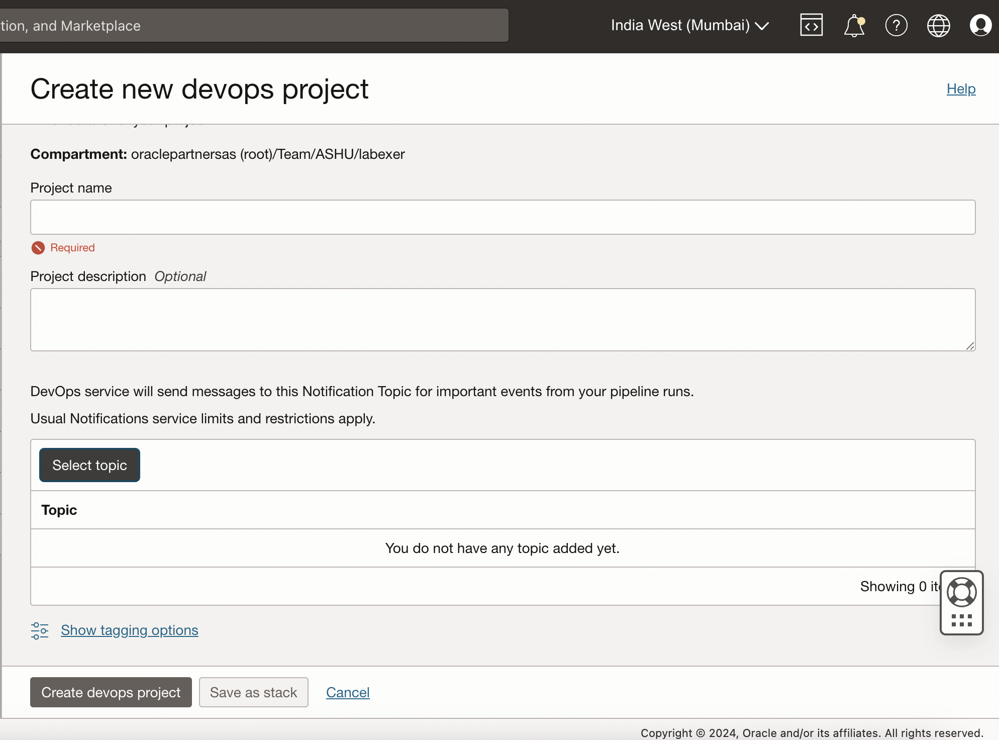

### Step 2: Configure the Git Repository as a Code Source

1. In your DevOps project, under **Code Repositories**, click **Create Repository**.

   - Provide a meaningful name for your repository and description

       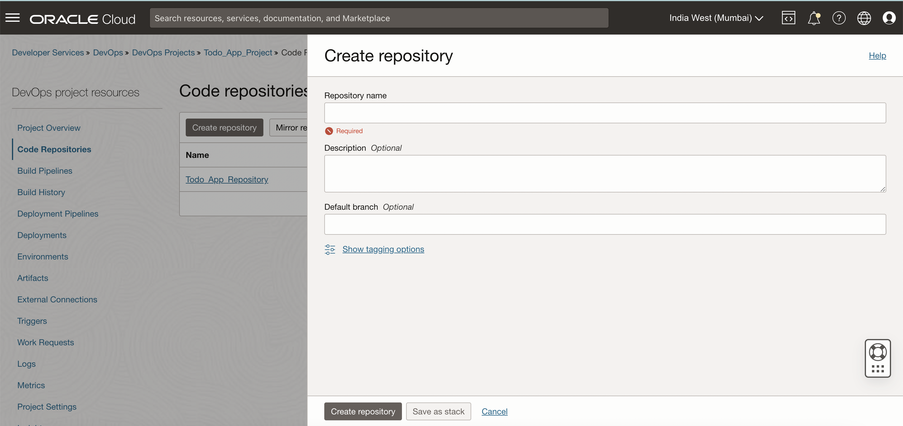
   

---

## Task 2: Set Up Cloud Shell and Clone OCI Repository

### Step 1: Launch Cloud Shell

1. Open **Cloud Shell** by clicking the Cloud Shell icon in the top-right corner of the OCI console. This will open a terminal directly in your browser.

### Step 2: Clone and Commit Code to OCI DevOps Project

1. **Download the Code from GitHub in the Cloud Shell terminal**:
   ```bash
   <copy>
   wget https://github.com/ashuashu20691/python-todo/archive/refs/heads/main.zip
   unzip main.zip
   ```
   - This command will download the code from the public GitHub repository `python-todo`.

2. **Navigate to the project folder**:
   ```bash
   <copy>
   cd python-todo-main
   ```

3. **Initialize Git** (if not already initialized):
   ```bash
   <copy>
   git init
   ```

4. **Add the OCI DevOps Code Repository as a remote**:
   - You need the OCI DevOps code repository URL (from your DevOps project).
   - Add the OCI remote repository:
   ```bash
   <copy>
   git remote add origin [oci-devops-repo-https-url]
   </copy>
   ```
   - Replace `[oci-devops-repo-https-url]` with the actual URL of your OCI DevOps project repository by selecting the 3 dot menu of your code repository, and select clone repo you will get the https url.


       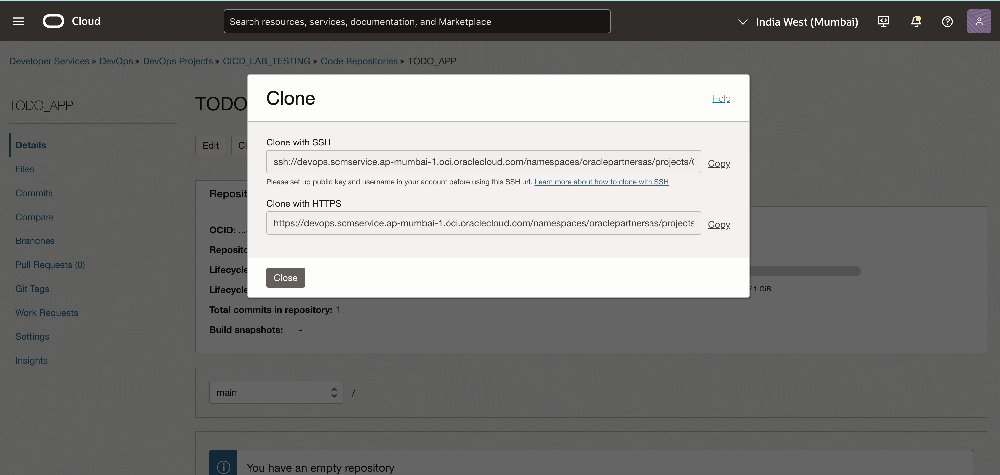
       
5. **Update DB credentials and Wallet config**.

      1. Update liquibase.properties file in liquibase folder with db credentials
      2. Update config.cfg in the root folder with db credentials
      3. Unzip your DB Wallet zip file and Replace the root Wallet folder.
      4. Navigate to the Wallet folder and update the **sqlnet.ora** file with the following:
         - change DIRECTORY path with DIRECTORY="/app/Wallet"
         ```bash
         <copy>
         WALLET_LOCATION = (SOURCE = (METHOD = file) (METHOD_DATA = (DIRECTORY="/app/Wallet")))
         SSL_SERVER_DN_MATCH=yes
         </copy>
         ```
      5. Navigate to the Wallet folder and update the **ojdbc.properties** file with the following:
         - Comment out the oracle.net.wallet_location line.
         - Set javax.net.ssl.trustStorePassword to the Wallet password that you entered to download the Wallet.
         - Set javax.net.ssl.keyStorePassword to the Wallet password that you entered to download the Wallet.
         ```bash
          <copy>
          #oracle.net.wallet_location=(SOURCE=(METHOD=FILE)(METHOD_DATA=(DIRECTORY=${TNS_ADMIN})))
         javax.net.ssl.trustStore=${TNS_ADMIN}/truststore.jks
         javax.net.ssl.trustStorePassword=my_wallet_password
         javax.net.ssl.keyStore=${TNS_ADMIN}/keystore.jks
         javax.net.ssl.keyStorePassword=my_wallet_password
         </copy>
         ```
6. **Update Docker Image path**.
   1. Open **kubernate.yaml** from the root folder.
   2. Update the image path in image path remember in the next lab keep image name same as **todo-img** while creating container registory.
   ```
   current value: image: bom.ocir.io/oraclepartnersas/todo-img:${BUILDRUN_HASH}

   pattern: region/tenancy/repository-name

   eg. bom.ocir.io/oraclepartnersas/todo-img:${BUILDRUN_HASH}
   ```
   
   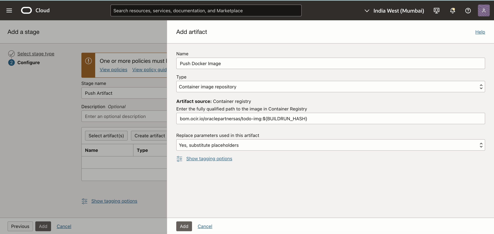

7. **Commit the code to your OCI DevOps repository**:
   - Stage all the files:
   ```bash
   <copy>
   git add .
   </copy>
   ```
   - Commit the changes:
   ```bash
   <copy>
   git commit -m "Initial commit for Python ToDo project"
   </copy>
   ```
   - Push the code to the OCI DevOps repository:
   ```bash
   <copy>
   git push -u origin master -f
   </copy>
   ```

***Important: Steps to Push Your Code Securely***: 

   - **Repository Authentication Details:**
      - **Username**: Use your Tenancy name/OCI Cloud username. eg.: mytenancy/myusername ie. oraclepartnersas/ashu.kumar@oracle.com
      - **Password**: Use an **Authentication Token** generated from your Oracle Cloud Infrastructure Console.

   - **Generating an Authentication Token**
   
   To push code securely, you must use an authentication token instead of a password:

      - Go to the Oracle Cloud Infrastructure Console.
      - Navigate to Profile → Auth Tokens.
      - Click Generate Token and save it securely.
      - Use this token as your password when prompted during Git operations.

---

## Task 3: Set Up Build Pipeline

### Step 1: Create a Build Pipeline

1. In the **DevOps project**, navigate to **Build Pipelines**.

2. Click on **Create Pipeline**, give it a name, e.g., **AppBuildPipeline** and click in **Create** Button.

       

3. Open your Build Pipeline and Add a Stage type **Managed Build**:
   - Choose **Managed Build** and configure it to compile your project and run tests.
   - click Next and Provide a unique name and description for this stage (e.g., `Build Artifacts`).

       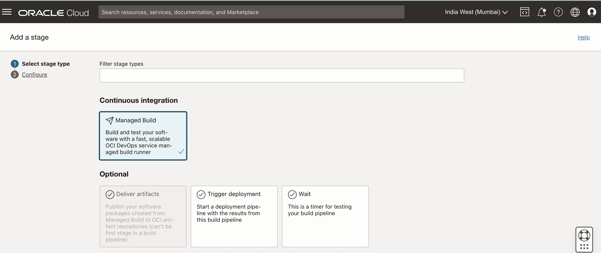


4. Setup Primary code repository:
   - Click on **Select** option.
   - Select Source (Connection Type) : **OCI Code Repository**
   - In the Build Stage configuration, select your OCI code repository:
   - Click on **Add** button

       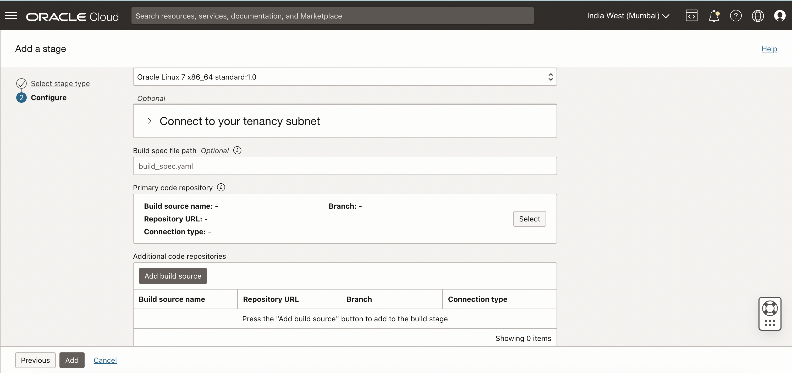

       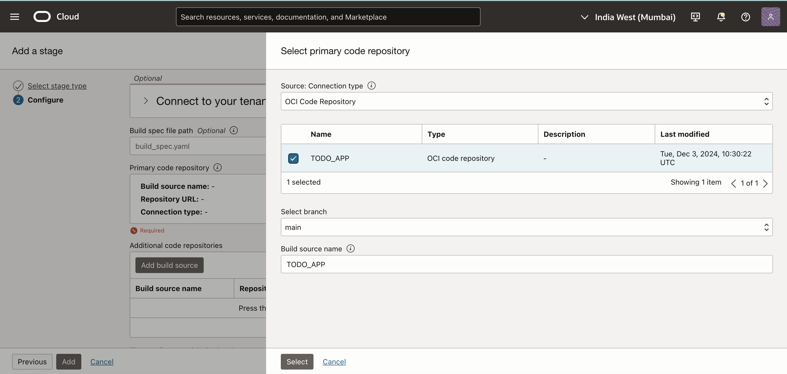

### Step 2: Create a **Container Registry**

1. Go to **Developer Services** and select **Container Registry**.
2. Click **Create Repository** and name it **todo-img**.
3. Select the Access **Public** for simplify this test livelab.
4. Set it to the **CI-CD-Compartment** created earlier and create.

       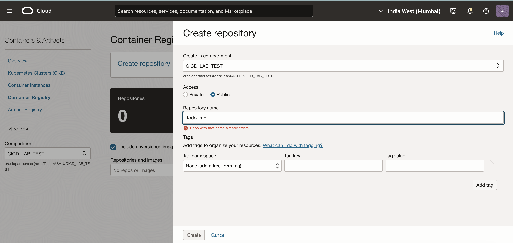

### Step 3: Create an **Artifact Registry**

1. Go to **Developer Services** and select **Artifact Registry**.
2. Click **Create Repository** and name it **kubernetes-manifest**.
3. Set it to the **CI-CD-Compartment** created earlier and create.
4. Deselect **Immutable artifacts** for multiple deployment within same version of application

       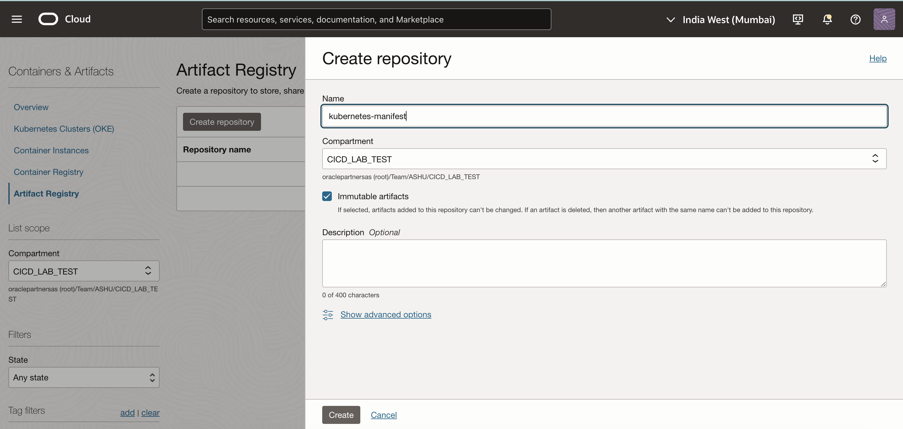

### Step 4: Configure **Deliver Artifacts Stage**

1. In the **DevOps project**, navigate to **Build Pipelines**.
2. Open your Build Pipeline
3. Click on the **+ icon** to select stage type **Deliver Artifacts** and name this stage **Push Artifact** with some description.
4. Next Click on second option **Create Artifact**, Give it a name **Push Docker Image**, select type **Container Image Repository** with the path:   

   ```
   pattern: region/tenancy/repository-name

   eg. bom.ocir.io/oraclepartnersas/todo-img:${BUILDRUN_HASH}
   ```
   
   

4. Create One More Artifact
   - name it **Kuberates Artifact** and Select type **Kubernetes Manifest**:
   - Select **Artifact source** the kubernate artifact we create in previous **Step 3 (kubernetes-manifest)**
   - Set **Artifact location** as **Set a custom location and version**
   - Give Artifact path 'devops-oke-manifest' and version `${BUILDRUN_HASH}`.
   

       

5. Associate the Artifacts with Build Result:
   -  Once both the artifact are associated with **Push Artifact** stage 
   -  Associate artifacts with build result with **Build config/result artifact name**
   -  **Kubernate Artifact** with **oke\_deploy\_manifest**
   -  **Push Docker Image** with **todo\_image** 
   -  Click on Add
       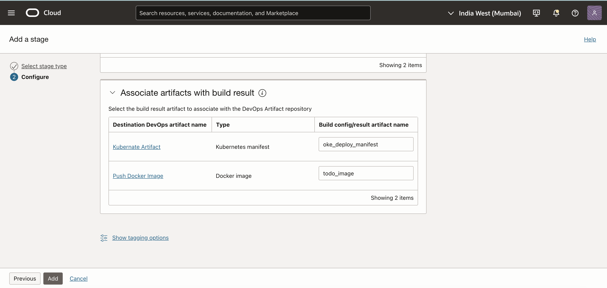


---

## Task 4: Create an Environment

   Objective: Set up the environment that will be used in the Deploy Pipeline.

### Steps:
   - Navigate to your DevOps Project select **Environments** and click on **Create Environment**.
   - Select Environment Type: **Oracle Kubernetes Engine (OKE)**.
   - Give it a name, e.g., DevEnvironment.

       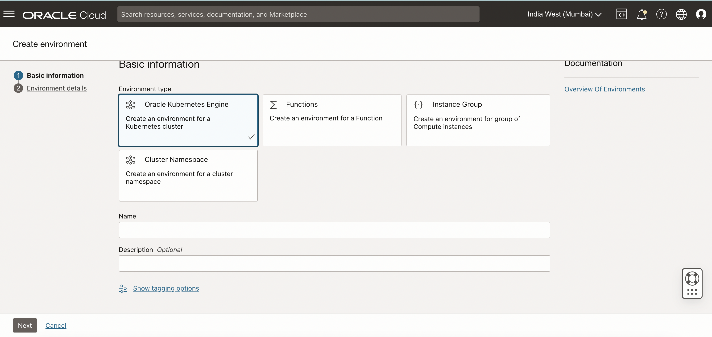

   - Click **Next** and from the cluster select dropdown select the cluster that we already created in **Lab 3**. Post selection hit the **Create Enviroment** button.

       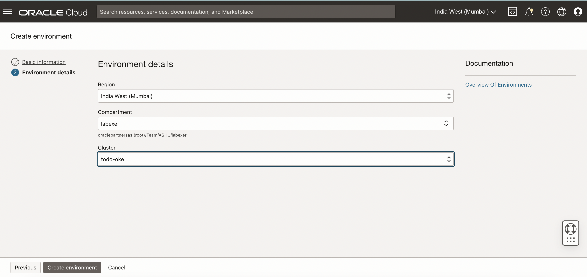

---

## Task 5: Create a Deploy Pipeline

**Objective**: Set up the Deploy Pipeline for your project.

### Steps:
   - Navigate to your DevOps Project  select **Deploy Pipelines**.
   - Click on **Create Pipeline** and give it a name, e.g., **AppDeployPipeline**.

       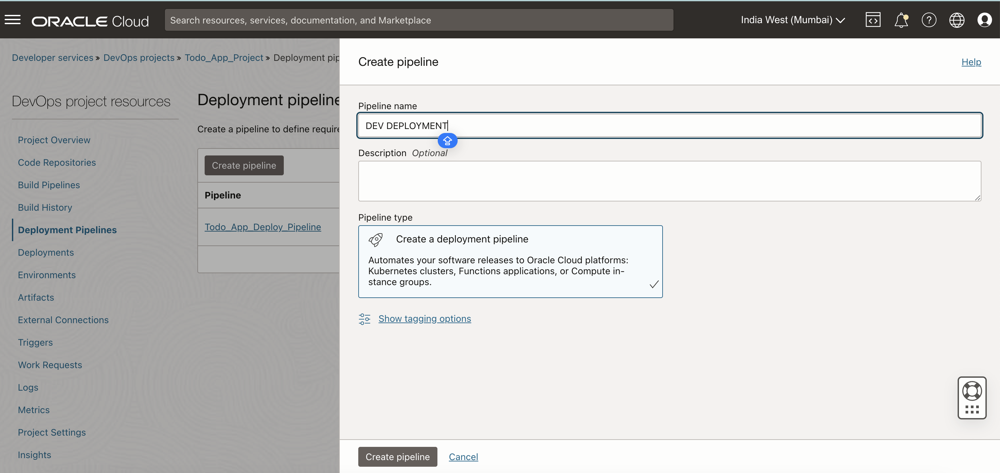
   - Open your Deploy Pipeline
   - Add a stage type **Apply Manifest to your Kubernetes cluster**:
      - Provide a Stage Name, e.g., **Deploy to Development**.
      - Select **Environment Type**: **OKE environment**.
      - Select the **Dev Environment** from the OKE Environment dropdown.
      - In the Artifact section, select the **Kubernetes Manifest** that you created earlier.

       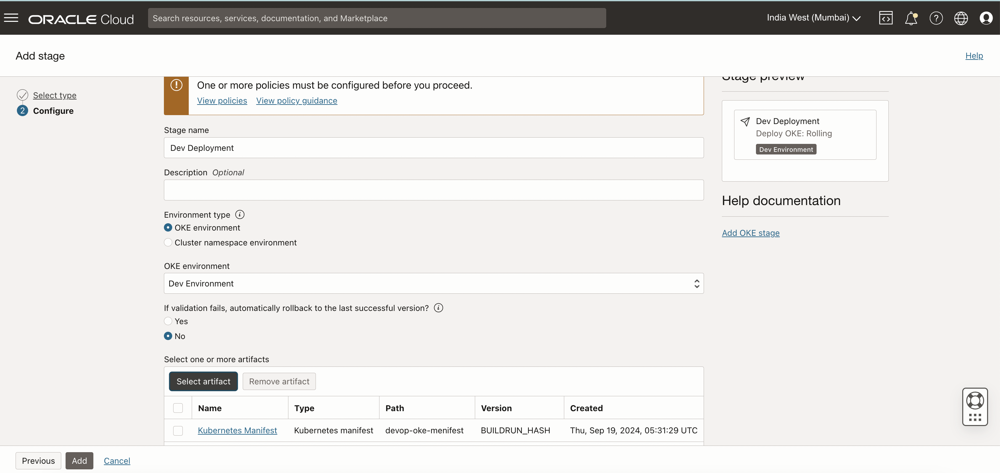

   - Click on **Add** to save the configuration.

---

## Task 6: Add a "Trigger Deploy Pipeline" Stage to Your Build Pipeline

### Steps:

- Open your **Build Pipeline**.  
- Click on the **+ icon** to select the stage type **Trigger Deployment**:  

       

  - Provide a **Stage Name**, e.g., **Trigger Deploy Pipeline**.  
  - From the **select deployment ipeline**: Choose the **AppDeployPipeline** from the available pipelines.  

       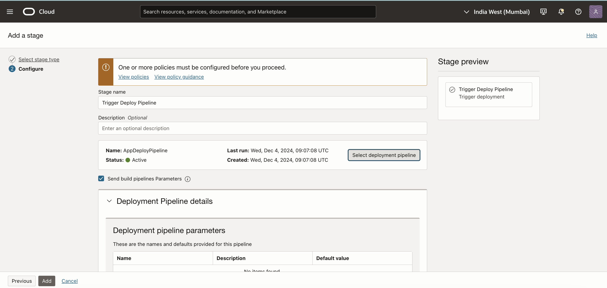

- Click on **Add** to save the configuration.  

---

## Task 7: Run the Pipleline and Get the Application URL

**Objective**: Access the deployed application via the external URL.

### Step 1:

1. Open your **Build Pipeline**.  
2. Hit the **Start manual run**
3. Wait till both the Build and Deployment Pipeline executed the succefully


### Step 2:

1. Navigate to your **Oracle Kubernetes Engine (OKE) Cluster** details page.
2. Click on the **Access Cluster** button.
3. Select **Cloud Shell Access**.
4. Copy the **Kubeconfig** configuration details.

       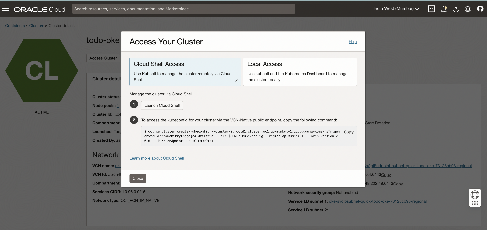


5. Launch **Cloud Shell** in the Oracle Cloud Console.
6. Paste the **Kubeconfig** into the Cloud Shell and run the following command to see all Kubernetes resources:
   ```bash
   <copy>
   kubectl get all
   </copy>
   ```
7. Monitor your **pods**, **deployments**, and the **load balancer** status.

       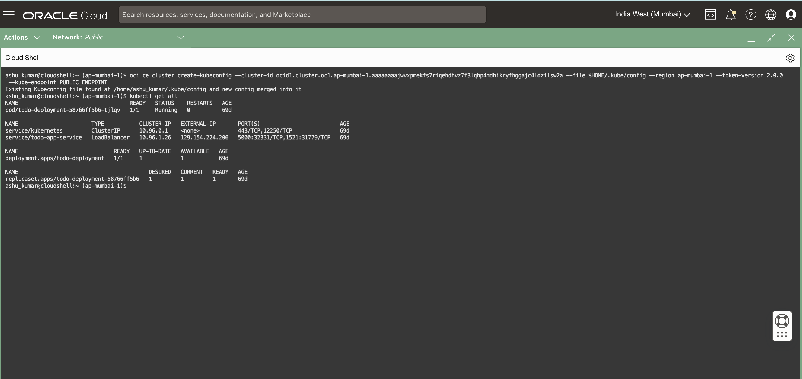


8. Once the load balancer is running, copy the **LoadBalancer External IP**.
9. Append port **5000** to the copied IP address.
10. Open your browser and paste the full URL to access the application.
    - Example: `http://<LoadBalancer_External_IP>:5000/`
    - Example: `http://129.154.224.206:5000/`.

---

This step concludes the deployment process, allowing access to the deployed application.

---

## Conclusion

In this guide, you’ve set up an OCI project for CI/CD. By integrating a Git repository and configuring OCI DevOps services, you’ve created an automated pipeline to build, test, and deploy your application to the Oracle Kubernetes Engine (OKE). This setup is the foundation for continuous integration and continuous delivery, allowing for seamless updates and management of cloud-native applications.

---

## Acknowledgements

- **Author**: Ashu Kumar, Principal Product Manager
- **Last Updated By/Date**: Ashu Kumar, December 2024