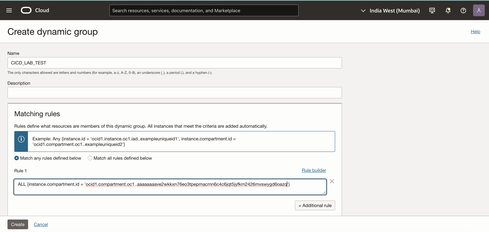
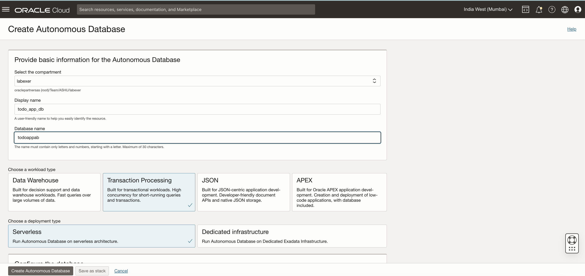
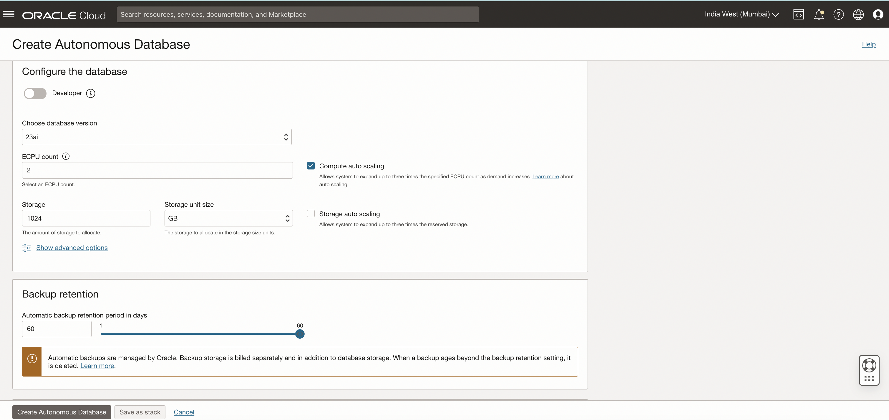
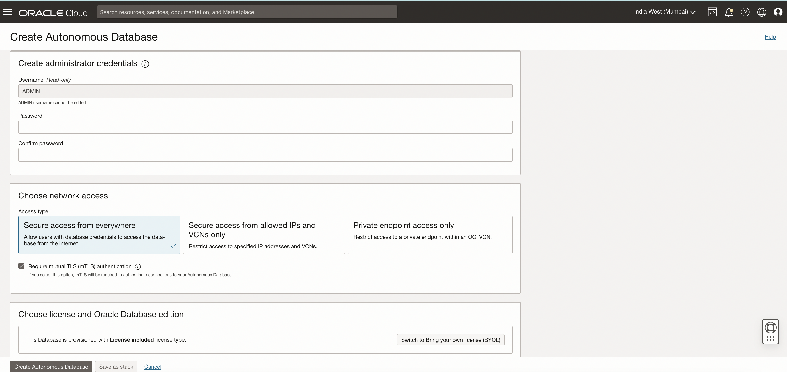
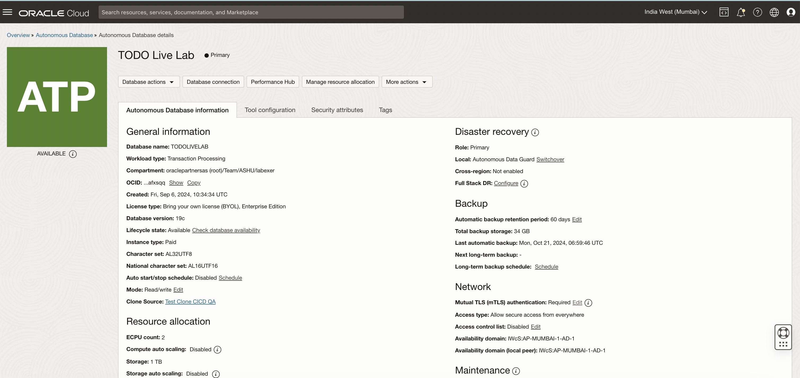
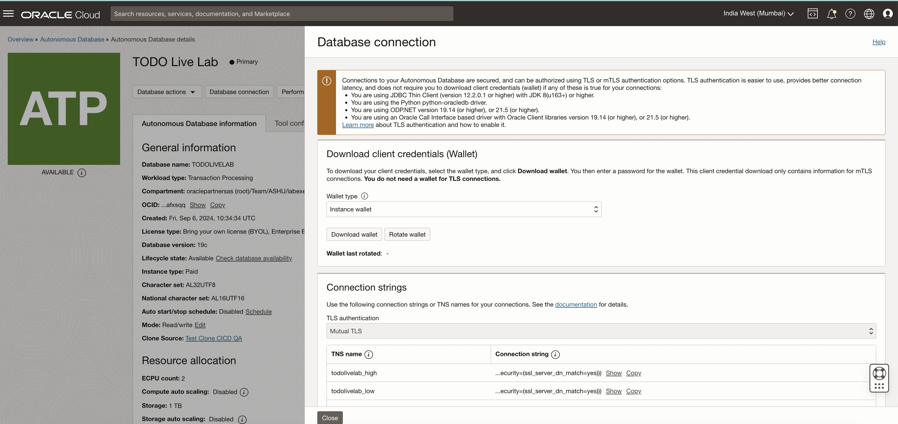
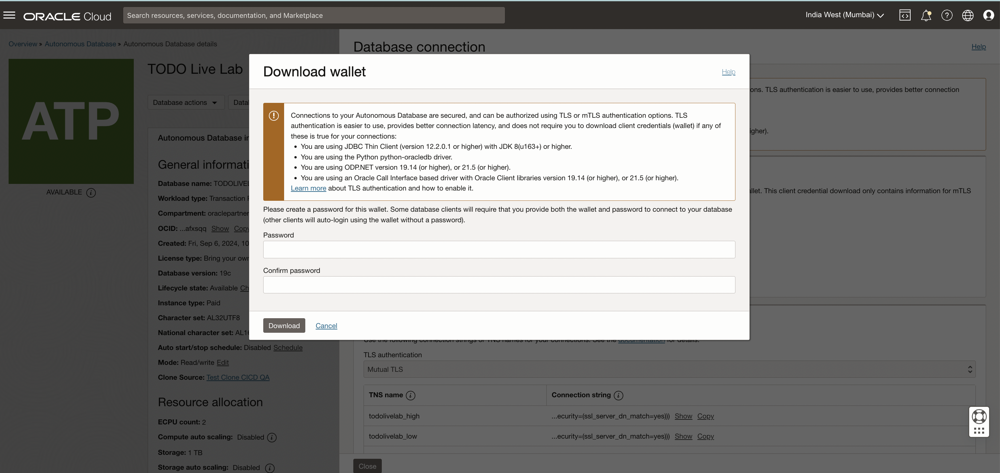

# Setting up Dynamic Groups, Policies, and Autonomous Database (ADB) with Wallet Download in Oracle Cloud Infrastructure (OCI)

Estimated time: 30 minutes

### Objectives

This lab will guide you through creating a dynamic group, assigning policies, provisioning an Autonomous Database (ADB), and downloading the required wallet for secure database connectivity.

**Tip:** Keep a notes page to store credentials, API keys, and important information for your CI/CD setup.

### Prerequisites

   - Basic understanding of OCI services.
   - Access to Oracle Cloud Infrastructure (OCI) with permissions to create dynamic groups, policies, and databases.

---

## Task 1: Create a Dynamic Group and Define Policies for CI/CD Automation

### Step 1: Create a Dynamic Group

1. **Navigate to Identity & Access Management**:
   - Select the **root** compartment
   - Open the navigation menu and click **Identity & Security**. Under **Identity**, click **Domains**.
   - Select the identity domain you want to work in and click **Dynamic Groups** (select **Default**)

2. **Create a New Dynamic Group**:
   - Click on **Create Dynamic Group**.
   - Provide a unique name for the dynamic group (e.g., `CI_CD_Dynamic_Group`).
   - Add a description like **Dynamic Group for CI/CD and ADB automation**.

3. **Define Matching Rules**:
   - Add below matching rules to include the necessary resources (e.g., instances, pipeline, repo, etc).
   ```bash
   <copy>
   Any {instance.compartment.id = '<compartment_ocid>', resource.compartment.id = '<compartment_ocid>'}	
 
   ALL {resource.type = 'devopsdeploypipeline', resource.compartment.id = '<compartment_ocid>'}	

   ALL {resource.type = 'devopsrepository', resource.compartment.id = '<compartment_ocid>'}	

   ALL {resource.type = ‘devopsbuildpipeline’, resource.compartment.id = '<compartment_ocid>'}	

   ALL {resource.type = ‘devopsconnection’, resource.compartment.id = '<compartment_ocid>'}

   ALL {instance.compartment.id = '<compartment_ocid>'}
   </copy>
   ```
   - Replace `<compartment_ocid>` with the actual OCID of your compartment.

   


### Step 2: Create Policies for the Dynamic Group

1. **Navigate to Policies**:
   - Under **Identity & Security**, click on **Policies**.

2. **Create a New Policy**:
   - Click on **Create Policy**.
   - Name the policy (e.g., `CI_CD_LiveLab_Policy`).
   - Choose the compartment where the dynamic group will operate.

3. **Write Policy Statements**:
   - Example policies to grant necessary permissions to the dynamic group:

     **Allow management of Autonomous Database:**
     ```bash
     allow dynamic-group  <dynamic_group_name> to manage autonomous-database-family in compartment <compartment_name>
     ```

     **Allow access to network resources (for OKE, Load Balancers, etc.):**
     ```bash
     allow dynamic-group <dynamic_group_name> to use virtual-network-family in compartment <compartment_name>
     ```

     **Allow the `<dynamic_group_name>` group to manage the following resources:**
     - **DevOps repository**:
       ```bash
       allow dynamic-group <dynamic_group_name> to manage devops-repository in compartment <compartment_ocid>
       ```

     - **Containers**:
       ```bash
       Allow group <dynamic_group_name> to manage containers in compartment <compartment_name>
       ```

     - **DevOps Family**:
       ```bash
       Allow dynamic-group <dynamic_group_name> to manage devops-family in compartment <compartment_name>
       ```

     - **Repos**:
       ```bash
       Allow dynamic-group <dynamic_group_name> to manage repos in compartment <compartment_name>
       ```

     - **Generic Artifacts**:
       ```bash
       Allow dynamic-group <dynamic_group_name> to manage generic-artifacts in compartment <compartment_name>
       ```

     - **ONS Topics**:
       ```bash
       Allow dynamic-group <dynamic_group_name> to use ons-topics in compartment <compartment_name>
       ```

     - **All Resources**:
       ```bash
       Allow dynamic-group <dynamic_group_name> to manage all-resources in compartment <compartment_name>
       ```

     - **All Artifacts**:
       ```bash
       Allow dynamic-group <dynamic_group_name> to read all-artifacts in compartment <compartment_name>
       ```

     - **Cluster**:
       ```bash
       Allow dynamic-group <dynamic_group_name> to manage cluster in compartment <compartment_name>
       ```

     - **Secret Family**:
       ```bash
       Allow dynamic-group <dynamic_group_name> to read secret-family in compartment <compartment_name>
       ```


Here’s the all policies required for this lab that you can copy directly into policy panel:

**Note** : In Policy Builder select **Show manual editor** to paste all policies in one go.

```bash
<copy>
allow dynamic-group <dynamic_group_name> to manage devops-repository in compartment id <compartment_ocid> 

allow group <dynamic_group_name> to manage containers in compartment <compartment_name>

allow dynamic-group <dynamic_group_name> to manage devops-family in compartment  <compartment_name>

allow dynamic-group <dynamic_group_name> to manage repos in compartment  <compartment_name>

allow dynamic-group <dynamic_group_name> to manage generic-artifacts in compartment  <compartment_name>

allow dynamic-group <dynamic_group_name> to use ons-topics in compartment  <compartment_name>

allow dynamic-group <dynamic_group_name> to manage all-resources in compartment  <compartment_name>

allow dynamic-group <dynamic_group_name> to read all-artifacts in compartment  <compartment_name>

allow dynamic-group <dynamic_group_name> to manage cluster in compartment  <compartment_name>

allow dynamic-group <dynamic_group_name> to read secret-family in compartment  <compartment_name>

allow dynamic-group <dynamic_group_name> to manage generic-artifacts in compartment  <compartment_name>
</copy>
```

4. **Create the Policy**.

In this task, you’ve created a dynamic group to support your CI/CD pipeline and defined several policies that grant access to various OCI resources necessary for automation and management of the environment. By leveraging dynamic groups and policies, you can ensure the appropriate level of access control and automation for your development and deployment pipelines.

---

## Task 2: Provisioning an Autonomous Database (ADB) in OCI

1. **Navigate to the Autonomous Database Console**:
   - In the **OCI Console**, go to **Oracle Database** → **Autonomous Transaction Processing** (or **Autonomous Database** for other types like Autonomous Data Warehouse).

2. **Click on Create Autonomous Database**:
   - Choose a compartment where your Autonomous Database (ADB) will be created.

3. **Fill in Database Details**:
   - **Compartment**: Select your livelab compartment (e.g., `todo_app_compartment`).
   - **Display Name**: Enter a unique name (e.g., `todo_app_db`).
   - **Database Name**: Enter a unique name (e.g., `todoappdb`).
   - **Workload Type**: Choose **Transaction Processing** for general-purpose workloads.

       

   - **Create administrator credentials**: Create Password.
   - **Network Access**: Choose **Secure access from everywhere**.
   - **Database Version**: Choose the latest version.


       


5. **Choose a License Type**:
   - Select either **Bring Your Own License (BYOL)** or **License Included** based on your subscription.

       

6. **Create the Autonomous Database**:
   - Click **Create Autonomous Database** and wait for the provisioning process to complete.

---

## Task 3: Downloading the Autonomous Database Wallet

1. **Navigate to Your Autonomous Database**:
   - Once the database is provisioned, go to the **Autonomous Database Details** page.

       

2. **Click on 'DB Connection'**:
   - Under the **Database Connection** section, click on **DB Connection**.

       

3. **Download the Wallet**:
   - Select **Download Wallet**.
   - Enter a password to secure the wallet (make sure to remember this password as it will be used during the connection process).
   - Click **Download** to save the wallet ZIP file.

       

4. **Store the Wallet Securely**:
   - Unzip the downloaded wallet and replace the contents securely in a location accessible to your applications root folder Wallet directory, such as your CI/CD pipeline configuration that will connect to this database. We will commit this wallet files later in next lab.

---

## Acknowledgements

- **Author**: Ashu Kumar, Principal Product Manager
- **Last Updated By/Date**: Ashu Kumar, December 2024